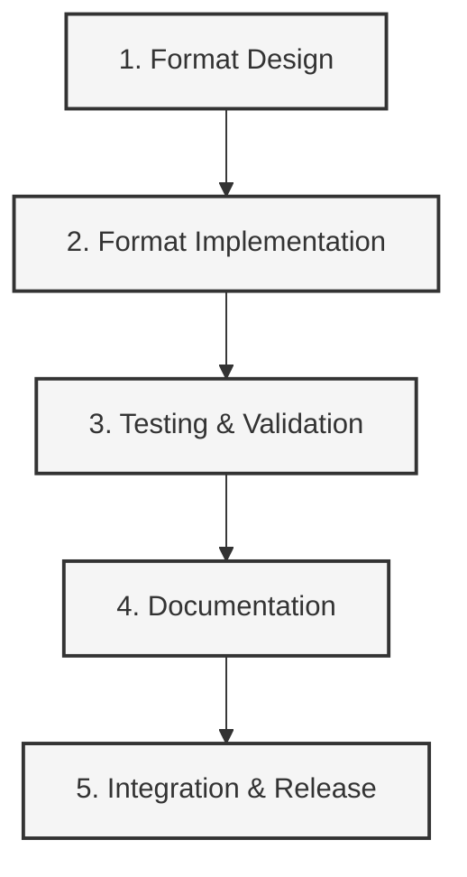
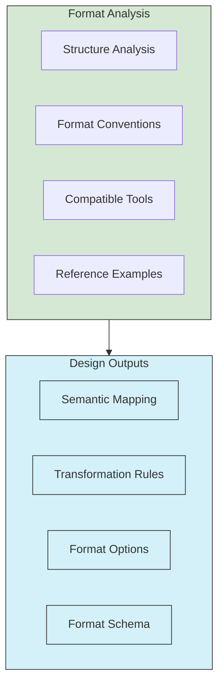
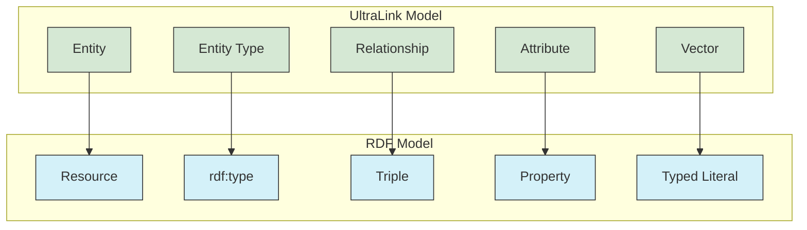

# Creating New Export Formats for UltraLink

This guide provides step-by-step instructions for designing, implementing, and testing new export formats for UltraLink. Adding a new format allows UltraLink knowledge graphs to be used in additional systems and tools.



## 1. Format Design

### 1.1 Format Analysis

Begin by analyzing the target format:



**Key questions to answer:**

1. **What is the primary purpose of this format?**
   - Data exchange, visualization, analysis, knowledge management, etc.

2. **Who are the primary consumers of this format?**
   - Specific tools, libraries, systems, or users

3. **What are the format's technical requirements?**
   - File structure, encoding, syntax rules, validation mechanisms

4. **What are common conventions in this format?**
   - Naming patterns, organization, metadata inclusion

5. **Are there any format-specific limitations?**
   - Size constraints, character restrictions, nesting limits

**Example analysis for a hypothetical RDF/Turtle format:**

```markdown
# RDF/Turtle Format Analysis

## Primary Purpose
- Semantic web data interchange
- Linked data representation
- Ontology expression

## Primary Consumers
- RDF Triple Stores (e.g., Apache Jena, RDF4J)
- SPARQL Query Engines
- Semantic Reasoners
- Linked Data Platforms

## Technical Requirements
- Triple-based structure (subject-predicate-object)
- Supports URI identifiers
- Namespaces with prefixes
- Literal values with datatypes
- Unicode support

## Common Conventions
- Uses common vocabularies (RDF, RDFS, OWL, etc.)
- Organizes triples by subject
- Prefixes defined at beginning
- Blank nodes for unnamed resources

## Limitations
- No direct support for nested structures
- No built-in mechanism for vector representations
- Requires mapping to appropriate ontologies
```

### 1.2 Semantic Mapping

Create a detailed mapping between UltraLink concepts and the target format:

```markdown
# UltraLink to RDF/Turtle Semantic Mapping

## Entity Mapping
- Entity → RDF Resource
- Entity ID → URI
- Entity Type → rdf:type property

## Relationship Mapping
- Relationship → RDF Triple
- Relationship Source → Subject
- Relationship Target → Object
- Relationship Type → Predicate

## Attribute Mapping
- Attribute → RDF Property
- Attribute Name → Predicate URI
- Attribute Value → Object Literal (with datatype)

## Vector Mapping
- Vector → Custom Predicate with JSON-encoded array
- Vector dimensions → Literal with custom datatype

## Metadata Mapping
- Created timestamp → dc:created
- Modified timestamp → dc:modified
- Version → owl:versionInfo
```

### 1.3 Format Options Design

Design configurable options for the new format:

```javascript
/**
 * Options for RDF/Turtle export
 * @typedef {Object} RDFTurtleOptions
 * @property {boolean} includeVectors - Whether to include vector embeddings
 * @property {boolean} includeMetadata - Whether to include metadata
 * @property {string} baseURI - Base URI for all resources
 * @property {Object} namespaces - Additional namespace prefix mappings
 * @property {string} ontology - Ontology to use for mapping ('schema', 'foaf', 'custom')
 * @property {boolean} prettyPrint - Whether to format the output for readability
 */
```

## 2. Format Implementation

### 2.1 Exporter Module Structure

Create a new file in the `src/lib/exporters` directory:

```javascript
// src/lib/exporters/rdf-turtle.js

/**
 * RDFTurtleExporter
 * Exports UltraLink knowledge graph to RDF Turtle format
 */
class RDFTurtleExporter {
  /**
   * @param {UltraLink} ultralink - The UltraLink instance
   * @param {RDFTurtleOptions} options - Export options
   */
  constructor(ultralink, options = {}) {
    this.ultralink = ultralink;
    this.options = {
      includeVectors: false,
      includeMetadata: true,
      baseURI: 'http://ultralink.dev/resource/',
      namespaces: {},
      ontology: 'schema',
      prettyPrint: false,
      ...options
    };
    
    // Initialize format-specific data structures
    this.triples = [];
    this.prefixes = {
      rdf: 'http://www.w3.org/1999/02/22-rdf-syntax-ns#',
      rdfs: 'http://www.w3.org/2000/01/rdf-schema#',
      xsd: 'http://www.w3.org/2001/XMLSchema#',
      ul: 'http://ultralink.dev/ontology#',
      ...this.options.namespaces
    };
  }
  
  /**
   * Main export method
   * @returns {string} RDF Turtle formatted output
   */
  export() {
    // 1. Extract entities and relationships
    const entities = Array.from(this.ultralink.entities.values());
    const relationships = this.extractRelationships();
    
    // 2. Generate prefixes section
    this.generatePrefixes();
    
    // 3. Transform entities to triples
    this.transformEntities(entities);
    
    // 4. Transform relationships to triples
    this.transformRelationships(relationships);
    
    // 5. Format and return output
    return this.formatOutput();
  }
  
  /**
   * Extract relationships from UltraLink
   * @private
   * @returns {Array} Relationship objects
   */
  extractRelationships() {
    const relationships = [];
    
    for (const [sourceId, targets] of this.ultralink.links.entries()) {
      for (const [targetId, rel] of targets.entries()) {
        relationships.push({
          source: sourceId,
          target: targetId,
          type: rel.type,
          attributes: rel.attributes || {},
          metadata: rel.metadata || {}
        });
      }
    }
    
    return relationships;
  }
  
  /**
   * Generate prefix declarations
   * @private
   */
  generatePrefixes() {
    this.prefixSection = Object.entries(this.prefixes)
      .map(([prefix, uri]) => `@prefix ${prefix}: <${uri}> .`)
      .join('\n');
  }
  
  /**
   * Transform entities to RDF triples
   * @private
   * @param {Array} entities - UltraLink entities
   */
  transformEntities(entities) {
    for (const entity of entities) {
      // Create entity resource URI
      const entityURI = `${this.options.baseURI}${entity.id}`;
      
      // Add entity type triple
      this.triples.push(`<${entityURI}> rdf:type ul:${entity.type} .`);
      
      // Add label if available
      if (entity.attributes && entity.attributes.name) {
        this.triples.push(`<${entityURI}> rdfs:label "${this.escapeTurtle(entity.attributes.name)}"@en .`);
      }
      
      // Add attributes as properties
      if (entity.attributes) {
        for (const [key, value] of Object.entries(entity.attributes)) {
          if (key === 'name') continue; // Already handled
          
          const datatype = this.getDatatype(value);
          const formatted = this.formatValue(value, datatype);
          this.triples.push(`<${entityURI}> ul:${key} ${formatted} .`);
        }
      }
      
      // Add vector if requested
      if (this.options.includeVectors && entity.vector) {
        const vectorJSON = JSON.stringify(entity.vector);
        this.triples.push(`<${entityURI}> ul:vector "${this.escapeTurtle(vectorJSON)}"^^ul:vectorType .`);
      }
      
      // Add metadata if requested
      if (this.options.includeMetadata && entity.metadata) {
        if (entity.metadata.created) {
          this.triples.push(`<${entityURI}> dc:created "${entity.metadata.created}"^^xsd:dateTime .`);
        }
        if (entity.metadata.modified) {
          this.triples.push(`<${entityURI}> dc:modified "${entity.metadata.modified}"^^xsd:dateTime .`);
        }
      }
    }
  }
  
  /**
   * Transform relationships to RDF triples
   * @private
   * @param {Array} relationships - UltraLink relationships
   */
  transformRelationships(relationships) {
    for (const rel of relationships) {
      // Create URIs
      const sourceURI = `${this.options.baseURI}${rel.source}`;
      const targetURI = `${this.options.baseURI}${rel.target}`;
      
      // Add main relationship triple
      this.triples.push(`<${sourceURI}> ul:${rel.type} <${targetURI}> .`);
      
      // For relationships with attributes, create a blank node
      if (Object.keys(rel.attributes || {}).length > 0 || 
          (this.options.includeMetadata && Object.keys(rel.metadata || {}).length > 0)) {
        
        // Create a blank node ID for the relationship
        const blankNode = `_:rel_${rel.source}_${rel.type}_${rel.target}`;
        
        // Connect blank node to main relationship
        this.triples.push(`<${sourceURI}> ul:${rel.type}Details ${blankNode} .`);
        this.triples.push(`${blankNode} ul:source <${sourceURI}> .`);
        this.triples.push(`${blankNode} ul:target <${targetURI}> .`);
        this.triples.push(`${blankNode} ul:type ul:${rel.type} .`);
        
        // Add attributes to blank node
        if (rel.attributes) {
          for (const [key, value] of Object.entries(rel.attributes)) {
            const datatype = this.getDatatype(value);
            const formatted = this.formatValue(value, datatype);
            this.triples.push(`${blankNode} ul:${key} ${formatted} .`);
          }
        }
        
        // Add metadata to blank node if requested
        if (this.options.includeMetadata && rel.metadata) {
          if (rel.metadata.created) {
            this.triples.push(`${blankNode} dc:created "${rel.metadata.created}"^^xsd:dateTime .`);
          }
          if (rel.metadata.modified) {
            this.triples.push(`${blankNode} dc:modified "${rel.metadata.modified}"^^xsd:dateTime .`);
          }
        }
      }
    }
  }
  
  /**
   * Get XSD datatype for a value
   * @private
   * @param {*} value - The value to check
   * @returns {string} XSD datatype
   */
  getDatatype(value) {
    if (typeof value === 'string') return 'xsd:string';
    if (typeof value === 'number') {
      return Number.isInteger(value) ? 'xsd:integer' : 'xsd:decimal';
    }
    if (typeof value === 'boolean') return 'xsd:boolean';
    if (value instanceof Date) return 'xsd:dateTime';
    if (Array.isArray(value)) return 'rdf:JSON';
    if (typeof value === 'object') return 'rdf:JSON';
    return 'xsd:string';
  }
  
  /**
   * Format a value for Turtle output based on its datatype
   * @private
   * @param {*} value - The value to format
   * @param {string} datatype - XSD datatype
   * @returns {string} Formatted value
   */
  formatValue(value, datatype) {
    if (datatype === 'xsd:integer' || datatype === 'xsd:decimal') {
      return `"${value}"^^${datatype}`;
    }
    if (datatype === 'xsd:boolean') {
      return `"${value}"^^${datatype}`;
    }
    if (datatype === 'xsd:dateTime') {
      return `"${value instanceof Date ? value.toISOString() : value}"^^${datatype}`;
    }
    if (datatype === 'rdf:JSON') {
      return `"${this.escapeTurtle(JSON.stringify(value))}"^^${datatype}`;
    }
    return `"${this.escapeTurtle(String(value))}"`;
  }
  
  /**
   * Escape special characters for Turtle format
   * @private
   * @param {string} str - String to escape
   * @returns {string} Escaped string
   */
  escapeTurtle(str) {
    return str
      .replace(/\\/g, '\\\\')
      .replace(/"/g, '\\"')
      .replace(/\r/g, '\\r')
      .replace(/\n/g, '\\n')
      .replace(/\t/g, '\\t');
  }
  
  /**
   * Format the final output
   * @private
   * @returns {string} Formatted RDF Turtle
   */
  formatOutput() {
    // Combine prefixes and triples
    const output = [
      this.prefixSection,
      '',
      this.triples.join('\n')
    ].join('\n');
    
    // Apply pretty printing if requested
    if (this.options.prettyPrint) {
      return this.prettyPrint(output);
    }
    
    return output;
  }
  
  /**
   * Pretty print the Turtle output
   * @private
   * @param {string} output - The raw output
   * @returns {string} Pretty printed output
   */
  prettyPrint(output) {
    // Implementation depends on the format
    // This is a simple example
    return output.split('\n').map(line => line.trim()).join('\n');
  }
}

module.exports = RDFTurtleExporter;
```

### 2.2 Integration with UltraLink Core

Add the exporter to the UltraLink class:

```javascript
// src/ultralink.js (add to existing imports)
const RDFTurtleExporter = require('./lib/exporters/rdf-turtle');

// Add inside the UltraLink class definition:

/**
 * Export UltraLink data to RDF Turtle format
 * @param {RDFTurtleOptions} options - Export options
 * @returns {string} RDF Turtle formatted string
 */
UltraLink.prototype.toRDFTurtle = function(options = {}) {
  const exporter = new RDFTurtleExporter(this, options);
  return exporter.export();
};
```

### 2.3 Error Handling

Implement appropriate error handling:

```javascript
// Inside the RDFTurtleExporter class

export() {
  try {
    // Existing export code
    // ...
    
    return this.formatOutput();
  } catch (error) {
    throw new Error(`RDF Turtle export failed: ${error.message}`);
  }
}
```

## 3. Testing & Validation

### 3.1 Unit Tests

Create unit tests for the new exporter:

```javascript
// tests/unit/exporters/rdf-turtle.test.js

const UltraLink = require('../../../src/ultralink');
const RDFTurtleExporter = require('../../../src/lib/exporters/rdf-turtle');

describe('RDFTurtleExporter', () => {
  // Test basic functionality
  test('should export basic entities and relationships', () => {
    // Setup test data
    const ultralink = new UltraLink();
    
    const entity1 = ultralink.createEntity({
      id: 'person1',
      type: 'person',
      attributes: {
        name: 'Alice',
        age: 30
      }
    });
    
    const entity2 = ultralink.createEntity({
      id: 'person2',
      type: 'person',
      attributes: {
        name: 'Bob',
        age: 35
      }
    });
    
    ultralink.createRelationship({
      source: entity1.id,
      target: entity2.id,
      type: 'knows',
      attributes: {
        since: '2020-01-01'
      }
    });
    
    // Export to RDF Turtle
    const turtle = ultralink.toRDFTurtle();
    
    // Validate output
    expect(turtle).toBeDefined();
    expect(turtle).toContain('@prefix rdf:');
    expect(turtle).toContain('@prefix ul:');
    
    // Check entity representation
    expect(turtle).toContain('<http://ultralink.dev/resource/person1> rdf:type ul:person');
    expect(turtle).toContain('<http://ultralink.dev/resource/person1> rdfs:label "Alice"@en');
    expect(turtle).toContain('<http://ultralink.dev/resource/person1> ul:age "30"^^xsd:integer');
    
    // Check relationship representation
    expect(turtle).toContain('<http://ultralink.dev/resource/person1> ul:knows <http://ultralink.dev/resource/person2>');
    
    // Check relationship attributes
    expect(turtle).toContain('ul:since "2020-01-01"');
  });
  
  // Test options handling
  test('should respect export options', () => {
    const ultralink = new UltraLink();
    
    // Add entity with vector
    ultralink.createEntity({
      id: 'concept1',
      type: 'concept',
      attributes: {
        name: 'Deep Learning'
      },
      vector: [0.1, 0.2, 0.3]
    });
    
    // Test with vectors excluded
    const turtleWithoutVectors = ultralink.toRDFTurtle({
      includeVectors: false
    });
    
    // Test with vectors included
    const turtleWithVectors = ultralink.toRDFTurtle({
      includeVectors: true
    });
    
    expect(turtleWithoutVectors).not.toContain('ul:vector');
    expect(turtleWithVectors).toContain('ul:vector');
    
    // Test base URI option
    const customURI = ultralink.toRDFTurtle({
      baseURI: 'http://example.com/resources/'
    });
    
    expect(customURI).toContain('<http://example.com/resources/concept1>');
  });
  
  // Test error handling
  test('should handle invalid inputs gracefully', () => {
    // Setup test case with problematic data
    const ultralink = new UltraLink();
    
    // Add entity with problematic content
    ultralink.createEntity({
      id: 'problem1',
      type: 'problem',
      attributes: {
        text: 'Line 1\nLine 2\nLine "quoted" text'
      }
    });
    
    // Should not throw error
    expect(() => {
      ultralink.toRDFTurtle();
    }).not.toThrow();
    
    // Output should have escaped special characters
    const turtle = ultralink.toRDFTurtle();
    expect(turtle).toContain('Line 1\\nLine 2\\nLine \\"quoted\\" text');
  });
});
```

### 3.2 Integration Tests

Add the new format to the system-level tests:

```javascript
// Add to tests/system/rendering.test.js

// Add RDF Turtle to FORMATS array
const FORMATS = [
  'json',
  'graphml',
  'obsidian',
  'html-website',
  'visualization',
  'csv',
  'kif',
  'rdf-turtle' // Add new format
];

// Add format-specific test case
describe(`rdf-turtle format`, () => {
  const outputPath = path.join(OUTPUT_DIR, systemName, 'rdf-turtle');
  
  it(`should render ${systemName} to rdf-turtle format`, () => {
    const turtlePath = path.join(outputPath, `${systemName.toLowerCase()}.ttl`);
    fs.writeFileSync(turtlePath, system.toRDFTurtle({
      includeVectors: true,
      prettyPrint: true
    }));
    
    // Verify file exists
    expect(fs.existsSync(turtlePath)).toBe(true);
    
    // Verify content
    const content = fs.readFileSync(turtlePath, 'utf8');
    expect(content).toContain('@prefix rdf:');
    expect(content).toContain('@prefix ul:');
    
    // Additional format-specific checks
    // ...
  });
});
```

### 3.3 Format Validation

Create validation routines for the new format:

```javascript
// tests/validation/rdf-turtle-validator.js

/**
 * Validates RDF Turtle format output
 * @param {string} turtleOutput - RDF Turtle string to validate
 * @returns {boolean} True if valid
 * @throws {Error} If validation fails
 */
function validateRDFTurtle(turtleOutput) {
  // Check basic format requirements
  if (!turtleOutput.includes('@prefix')) {
    throw new Error('Missing prefix declarations');
  }
  
  // Check for common syntax errors
  const lines = turtleOutput.split('\n');
  for (let i = 0; i < lines.length; i++) {
    const line = lines[i].trim();
    
    // Skip comments and empty lines
    if (line.startsWith('#') || line === '') continue;
    
    // Check prefix declarations
    if (line.startsWith('@prefix')) {
      if (!line.match(/@prefix\s+\w+:\s+<[^>]+>\s*\./)) {
        throw new Error(`Invalid prefix declaration at line ${i + 1}: ${line}`);
      }
      continue;
    }
    
    // Check triple patterns (simple validation)
    if (!line.endsWith('.') && !line.endsWith(';') && !line.endsWith(',')) {
      throw new Error(`Line ${i + 1} is missing proper termination: ${line}`);
    }
  }
  
  // More detailed validation could use a proper RDF library
  // For comprehensive validation, you might use an external tool
  
  return true;
}

module.exports = validateRDFTurtle;
```

## 4. Documentation

### 4.1 Format Documentation

Create a Markdown file for the new format:

```markdown
# RDF Turtle Format for UltraLink

This document details the RDF Turtle rendering target for UltraLink, its structure, usage, and connection to the UltraLink data model.

> **Related Documents**: 
> - [Overview of Rendering Targets](./rendering_targets.md)
> - [Implementation in src/lib/exporters/rdf-turtle.js](../src/lib/exporters/rdf-turtle.js)

## Overview

The RDF Turtle format provides a semantic web representation of UltraLink data, enabling integration with RDF triple stores, SPARQL query engines, and linked data platforms. It transforms the UltraLink knowledge graph into a set of subject-predicate-object triples conforming to RDF standards.

### Key Features

- **Semantic Web Integration**: Compatible with RDF technologies
- **Linked Data Interoperability**: Works with standard RDF tools
- **Ontology-based**: Maps UltraLink concepts to RDF types
- **Customizable Namespaces**: Supports custom prefix mappings
- **SPARQL Query Support**: Enables powerful graph queries

## Data Model Mapping

The RDF Turtle format maps the UltraLink data model as follows:



## Usage

The RDF Turtle exporter is implemented in [src/lib/exporters/rdf-turtle.js](../src/lib/exporters/rdf-turtle.js) and can be used as follows:

```javascript
// Basic export to RDF Turtle
const turtle = ultralink.toRDFTurtle();

// Export with specific options
const turtleCustomized = ultralink.toRDFTurtle({
  includeVectors: true,
  baseURI: 'http://example.org/resources/',
  ontology: 'schema',
  prettyPrint: true
});
```

### Export Options

| Option | Type | Default | Description |
|--------|------|---------|-------------|
| `includeVectors` | Boolean | `false` | Include entity vector embeddings |
| `includeMetadata` | Boolean | `true` | Include creation and modification metadata |
| `baseURI` | String | `'http://ultralink.dev/resource/'` | Base URI for all resources |
| `namespaces` | Object | `{}` | Additional namespace prefix mappings |
| `ontology` | String | `'schema'` | Ontology to use for mapping |
| `prettyPrint` | Boolean | `false` | Format output for readability |

## Example Output

```turtle
@prefix rdf: <http://www.w3.org/1999/02/22-rdf-syntax-ns#> .
@prefix rdfs: <http://www.w3.org/2000/01/rdf-schema#> .
@prefix xsd: <http://www.w3.org/2001/XMLSchema#> .
@prefix ul: <http://ultralink.dev/ontology#> .
@prefix dc: <http://purl.org/dc/elements/1.1/> .

<http://ultralink.dev/resource/person1> rdf:type ul:person .
<http://ultralink.dev/resource/person1> rdfs:label "Alice"@en .
<http://ultralink.dev/resource/person1> ul:age "30"^^xsd:integer .
<http://ultralink.dev/resource/person1> dc:created "2023-06-15T10:30:00Z"^^xsd:dateTime .

<http://ultralink.dev/resource/person2> rdf:type ul:person .
<http://ultralink.dev/resource/person2> rdfs:label "Bob"@en .
<http://ultralink.dev/resource/person2> ul:age "35"^^xsd:integer .
<http://ultralink.dev/resource/person2> dc:created "2023-06-15T10:31:00Z"^^xsd:dateTime .

<http://ultralink.dev/resource/person1> ul:knows <http://ultralink.dev/resource/person2> .

_:rel_person1_knows_person2 ul:source <http://ultralink.dev/resource/person1> .
_:rel_person1_knows_person2 ul:target <http://ultralink.dev/resource/person2> .
_:rel_person1_knows_person2 ul:type ul:knows .
_:rel_person1_knows_person2 ul:since "2020-01-01"^^xsd:string .
```

## Semantic Preservation

The RDF Turtle format preserves UltraLink semantics as follows:

| UltraLink Semantic | RDF Turtle Representation |
|--------------------|---------------------------|
| Entity identity | Resource URI |
| Entity type | rdf:type property |
| Attributes | RDF properties |
| Relationships | Direct triples between resources |
| Relationship attributes | Blank nodes with properties |
| Vector embeddings | JSON literals with custom datatype |
| Metadata | DC terms for timestamps |

## Related Tools and Libraries

You can work with the RDF Turtle output using these tools:

1. **Apache Jena** - RDF framework for Java
2. **RDF4J** - RDF framework for Java
3. **rdflib** - RDF library for Python
4. **Protégé** - Ontology editor and knowledge base framework
5. **GraphDB** - RDF database
6. **Virtuoso** - Triple store and SPARQL endpoint

## Limitations

- No direct mapping for some UltraLink-specific concepts
- Vector embeddings encoded as JSON strings rather than native structures
- Complex attributes require JSON serialization
- May require custom ontologies for full semantic interoperability

## Future Enhancements

- Support for additional RDF serializations (e.g., RDF/XML, JSON-LD)
- Custom ontology definition for UltraLink concepts
- Direct integration with triple stores
- SPARQL query support
```

### 4.2 Update Overall Documentation

Update related documentation files:

```markdown
<!-- Add to docs/formats/formats_overview.md -->

### RDF Turtle Format

RDF Turtle represents UltraLink knowledge as semantic web triples, enabling integration with RDF tools and SPARQL queries.

**Key uses:**
- Semantic web integration
- Triple store storage
- SPARQL querying
- Linked data publishing
- Ontology utilization

**Primary Consumers:** Triple stores, SPARQL engines, semantic reasoners, linked data platforms
```

```markdown
<!-- Add to docs/formats/README.md table -->

| [RDF/Turtle](./rdf-turtle-format.md) | Semantic web format | Triple stores, SPARQL querying | Semantic, Linked Data |
```

### 4.3 Command-Line Help

Update CLI help for the new format:

```javascript
// In cli.js or similar

const formatOptions = [
  // Existing options
  { name: 'json', description: 'JSON format for data interchange' },
  { name: 'graphml', description: 'GraphML format for network analysis' },
  // ...
  { name: 'rdf-turtle', description: 'RDF Turtle format for semantic web integration' }
];
```

## 5. Integration & Release

### 5.1 Pull Request Template

Prepare a pull request with the following sections:

```markdown
# New Format: RDF Turtle

## Description
This PR adds support for exporting UltraLink knowledge graphs to RDF Turtle format, enabling semantic web integration.

## Features
- Export to standard RDF Turtle syntax
- Configurable URI base and namespaces
- Support for all entity and relationship attributes
- Optional vector embedding inclusion
- Pretty printing option

## Testing
- Unit tests for basic functionality, options, and error handling
- Integration with system rendering tests
- Format validation routines
- Tested with external tools (Apache Jena, rdflib)

## Documentation
- Added detailed format documentation
- Updated formats overview
- Added to README
- Updated CLI help

## Screenshots
*Screenshot of output visualization in a semantic web tool*

## Checklist
- [x] Code follows project style guidelines
- [x] Unit tests added and passing
- [x] System tests updated and passing
- [x] Documentation created/updated
- [x] Example output provided
- [x] Validation routines added
```

### 5.2 Release Notes

Prepare release notes for the new format:

```markdown
## Release Notes - v1.X.0

### New Features

#### RDF Turtle Export Format
- Added support for exporting UltraLink knowledge graphs to RDF Turtle format
- Enables integration with semantic web technologies, triple stores, and SPARQL
- Configure with custom URIs, namespaces, and ontology mappings
- Preserves all UltraLink semantics in RDF triples
- Documentation and examples provided
```

## Examples and Patterns

### Common Implementation Patterns

#### 1. Handling Special Elements

```javascript
// Special format for relationship attributes
if (Object.keys(rel.attributes || {}).length > 0) {
  // Create a blank node or complex structure
  // to represent relationship attributes
}
```

#### 2. Detecting Data Types

```javascript
// Data type detection for proper format representation
function detectDataType(value) {
  if (typeof value === 'number') {
    return Number.isInteger(value) ? 'integer' : 'float';
  }
  if (typeof value === 'boolean') return 'boolean';
  if (value instanceof Date) return 'datetime';
  if (Array.isArray(value)) return 'array';
  
  // Default as string
  return 'string';
}
```

#### 3. Character Escaping

```javascript
// Format-specific character escaping
function escapeSpecialChars(str, format) {
  switch (format) {
    case 'xml':
      return str.replace(/&/g, '&amp;')
                .replace(/</g, '&lt;')
                .replace(/>/g, '&gt;')
                .replace(/"/g, '&quot;')
                .replace(/'/g, '&apos;');
    case 'json':
      return str.replace(/\\/g, '\\\\')
                .replace(/"/g, '\\"')
                .replace(/\r/g, '\\r')
                .replace(/\n/g, '\\n')
                .replace(/\t/g, '\\t');
    // Other formats
  }
}
```

#### 4. Stream Processing for Large Outputs

```javascript
// Stream-based output for large datasets
async function* generateOutput() {
  // Yield header information
  yield this.generateHeader();
  
  // Yield entities one by one
  for (const entity of this.ultralink.entities.values()) {
    yield this.formatEntity(entity);
  }
  
  // Yield relationships
  for (const relationship of this.extractRelationships()) {
    yield this.formatRelationship(relationship);
  }
  
  // Yield footer
  yield this.generateFooter();
}
```

## Conclusion

Creating a new export format for UltraLink involves designing a clear semantic mapping, implementing the transformation logic, thorough testing, and comprehensive documentation. Following the patterns and processes outlined in this guide will ensure your new format integrates seamlessly with the UltraLink ecosystem and provides value to users.

Remember these key principles:

1. **Comprehensive Semantic Mapping**: Ensure all UltraLink concepts have a clear representation
2. **Modular Implementation**: Follow the established exporter pattern
3. **Thorough Testing**: Unit tests, integration tests, and validation
4. **Clear Documentation**: Help users understand and use the format effectively
5. **Maintainable Code**: Follow project patterns and best practices

By adhering to these guidelines, your new format will be a valuable addition to UltraLink's capabilities. 