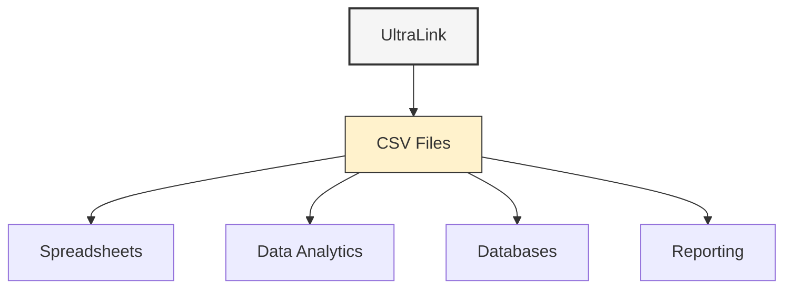

# CSV Format Guide

CSV (Comma-Separated Values) is a simple tabular format that can be easily opened in spreadsheet applications, imported into databases, and processed by data analysis tools. UltraLink's CSV export enables tabular representations of your knowledge graph for analysis, reporting, and integration with tabular data systems.



## Overview

UltraLink exports data to CSV files that represent entities and relationships in tabular form. This format is particularly useful for:

1. Data analysis in tools like Excel, Google Sheets, or R
2. Importing into SQL databases
3. Creating reports and visualizations
4. Sharing data with non-technical users
5. Data transformation and ETL processes

## Usage

### Basic Export

```javascript
// Export to CSV files
await ultralink.toCSV();

// Export with custom directory
await ultralink.toCSV('./data-export');
```

### Export with Options

```javascript
// Export with detailed options
await ultralink.toCSV({
  directory: './csv-export',
  entityTypes: ['person', 'organization'],
  relationshipTypes: ['works_at', 'knows'],
  includeMetadata: true,
  includeHeaders: true,
  delimiter: ',',
  quoteStrings: true,
  dateFormat: 'YYYY-MM-DD'
});
```

## Output Structure

UltraLink's CSV export generates two primary files:

### Entities CSV

The `entities.csv` file contains one row per entity with all attributes as columns:

```csv
id,type,name,scientificName,height,lifespan,description,annualRainfall
saguaro,organism,Saguaro Cactus,Carnegiea gigantea,15-50 feet,150-200 years,,
kangaroo-rat,organism,Kangaroo Rat,Dipodomys,,,nocturnal desert rodent,
aridity,environmental_factor,Aridity,,,,"Extremely dry conditions with minimal rainfall",3-15 inches
```

### Relationships CSV

The `relationships.csv` file contains one row per relationship with relationship attributes as columns:

```csv
source,target,type,mechanism,efficiency
saguaro,aridity,adapts_to,Water storage in stem,0.95
kangaroo-rat,aridity,adapts_to,Metabolic water production,0.88
```

## Type-Specific Files

UltraLink can also generate type-specific CSV files:

```
csv-export/
├── entities/
│   ├── organism.csv
│   ├── environmental_factor.csv
│   └── location.csv
├── relationships/
│   ├── adapts_to.csv
│   ├── lives_in.csv
│   └── preys_on.csv
├── entities.csv
└── relationships.csv
```

Each type-specific file contains only entities or relationships of that type, with columns specific to their attributes.

## Options Reference

| Option | Type | Default | Description |
|--------|------|---------|-------------|
| `directory` | string | './output/csv' | Output directory for CSV files |
| `entityTypes` | string[] | all | Filter entities by type |
| `relationshipTypes` | string[] | all | Filter relationships by type |
| `includeMetadata` | boolean | false | Include metadata columns (created, modified) |
| `includeHeaders` | boolean | true | Include header row |
| `delimiter` | string | ',' | Field delimiter character |
| `quoteStrings` | boolean | true | Wrap string values in quotes |
| `dateFormat` | string | 'YYYY-MM-DD' | Format for date values |
| `nullValue` | string | '' | Representation for null values |
| `includeTypeSpecificFiles` | boolean | true | Generate separate files for each entity/relationship type |
| `fileName` | string | 'entities.csv'/'relationships.csv' | Names for main CSV files |
| `encoding` | string | 'utf8' | File encoding |

## Use Cases

### Data Analysis

CSV export is ideal for analyzing your knowledge graph data in analytical tools:

```javascript
// Export for data analysis
await ultralink.toCSV({
  directory: './analysis-data',
  includeMetadata: true,
  entityTypes: ['project', 'task', 'person'],
  relationshipTypes: ['assigned_to', 'depends_on']
});

// Then use in R, Python, or other analysis tools
// R example:
// projects <- read.csv('analysis-data/entities/project.csv')
// assignments <- read.csv('analysis-data/relationships/assigned_to.csv')
// analysis <- merge(projects, assignments, by.x='id', by.y='source')
```

### Database Import

Export to CSV for importing into a relational database:

```javascript
// Export for database import
await ultralink.toCSV({
  directory: './db-import',
  includeHeaders: true,
  delimiter: ',',
  quoteStrings: true
});

// SQL example for import
// LOAD DATA INFILE './db-import/entities.csv' 
// INTO TABLE entities 
// FIELDS TERMINATED BY ',' 
// ENCLOSED BY '"' 
// LINES TERMINATED BY '\n'
// IGNORE 1 LINES;
```

### Custom Reports

Generate custom CSV reports from your knowledge graph:

```javascript
// Custom report generator
async function generateActivityReport(ultralink, start, end, filename) {
  // Query data for the report period
  const activities = await ultralink.findEntities({
    type: 'activity',
    filter: {
      date: {
        $gte: start,
        $lte: end
      }
    }
  });
  
  // Extract relationships
  const activityConnections = await Promise.all(
    activities.map(async activity => {
      const person = await ultralink.findLinkedEntities({
        sourceId: activity.id,
        relationshipType: 'performed_by',
        direction: 'outgoing',
        entityType: 'person'
      });
      
      return {
        activityId: activity.id,
        activityName: activity.attributes.name,
        date: activity.attributes.date,
        duration: activity.attributes.duration,
        personId: person[0]?.id || 'unknown',
        personName: person[0]?.attributes.name || 'Unknown'
      };
    })
  );
  
  // Generate custom CSV
  const createCsvWriter = require('csv-writer').createObjectCsvWriter;
  const csvWriter = createCsvWriter({
    path: filename,
    header: [
      {id: 'date', title: 'Date'},
      {id: 'activityName', title: 'Activity'},
      {id: 'personName', title: 'Person'},
      {id: 'duration', title: 'Duration (hours)'}
    ]
  });
  
  return await csvWriter.writeRecords(activityConnections);
}
```

## Advanced Features

### Handling Complex Data Types

When exporting arrays, objects, or other complex data types to CSV:

```javascript
await ultralink.toCSV({
  directory: './export',
  complexTypeHandling: {
    array: 'join',     // Join arrays with delimiter
    arrayDelimiter: '|',
    object: 'json',    // Convert objects to JSON strings
    boolean: 'text'    // Convert booleans to 'true'/'false'
  }
});
```

### Customizing Headers

Rename or translate column headers:

```javascript
await ultralink.toCSV({
  directory: './localized-export',
  headerMap: {
    'id': 'ID',
    'type': 'Type',
    'name': 'Name',
    'created': 'Creation Date',
    'modified': 'Last Modified',
    // Type-specific attribute mappings
    'person.email': 'Email Address',
    'person.age': 'Age (Years)',
    'organization.size': 'Company Size'
  }
});
```

### Row Filtering

Apply custom filters to exported rows:

```javascript
await ultralink.toCSV({
  directory: './filtered-export',
  entityFilter: (entity) => {
    // Only export entities modified in the last week
    const lastWeek = new Date();
    lastWeek.setDate(lastWeek.getDate() - 7);
    return new Date(entity.metadata.modified) >= lastWeek;
  },
  relationshipFilter: (relationship) => {
    // Only export relationships with confidence > 0.7
    return relationship.attributes.confidence > 0.7;
  }
});
```

## For Autonomous Agents

CSV exports can be valuable for autonomous agents that need to analyze data patterns:

```javascript
class AnalyticalAgent {
  constructor() {
    this.knowledgeBase = new UltraLink();
    this.dataAnalysisLibrary = require('data-analysis-library');
  }
  
  async analyzePatterns() {
    // Export relevant data to CSV for analysis
    await this.knowledgeBase.toCSV({
      directory: './agent-analysis',
      entityTypes: ['event', 'observation'],
      includeMetadata: true
    });
    
    // Perform analysis using specialized libraries
    const events = await this.dataAnalysisLibrary.readCsv('./agent-analysis/entities/event.csv');
    const patterns = await this.dataAnalysisLibrary.findPatterns(events);
    
    // Store analysis results back in the knowledge base
    for (const pattern of patterns) {
      await this.knowledgeBase.addEntity(`pattern-${Date.now()}`, 'pattern', {
        description: pattern.description,
        confidence: pattern.confidence,
        supportingEvents: pattern.eventIds
      });
    }
    
    return patterns;
  }
}
```

## Best Practices

When working with CSV exports:

1. **Use meaningful headers** - Customize headers to make data clear to end users
2. **Handle complex data types** - Configure how complex types are represented
3. **Include metadata** - When analyzing changes over time, include metadata
4. **Use type-specific files** - Work with type-specific CSV files when analyzing particular entity types
5. **Consider encoding** - Set appropriate encoding for international character support

## Limitations

Be aware of these limitations when using CSV export:

1. **Graph structure flattening** - CSV format flattens the graph structure, so relationship traversal isn't immediately apparent
2. **Limited complex data support** - Arrays and objects need special handling in CSV format
3. **Vector embeddings** - Vector embeddings don't translate well to CSV (consider JSON export for these)
4. **Schema diversity** - Entities with very different attributes may result in sparse CSV files with many empty cells

## Conclusion

CSV export is ideal when you need to analyze your UltraLink data in spreadsheets, databases, or data analysis tools. The tabular format makes it accessible for data analysis, reporting, and integration with systems that work with tabular data.

For more information on other export formats, see the [Rendering Formats Overview](README.md). 