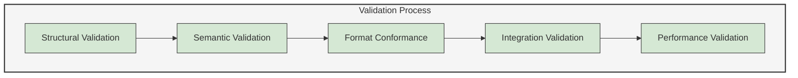
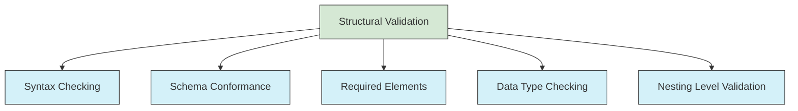
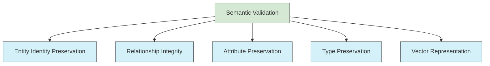
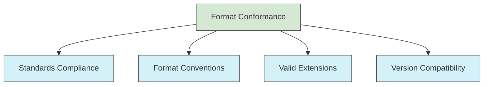
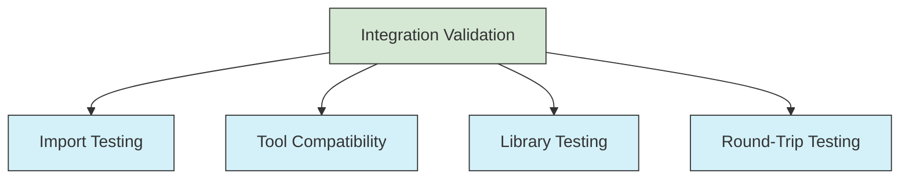
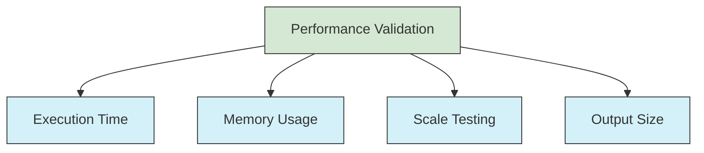
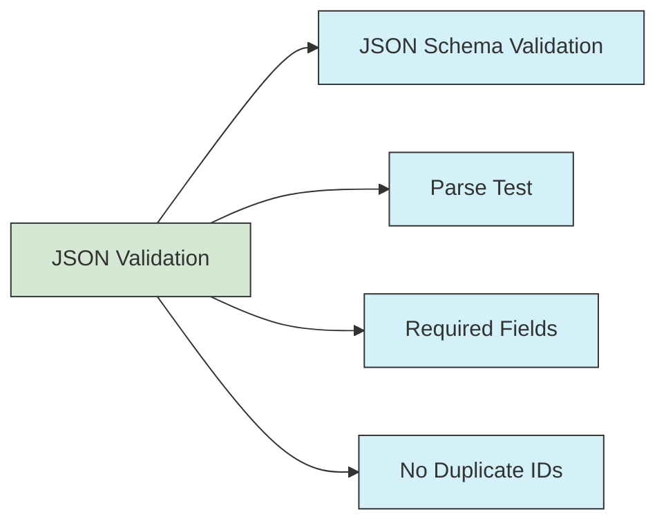
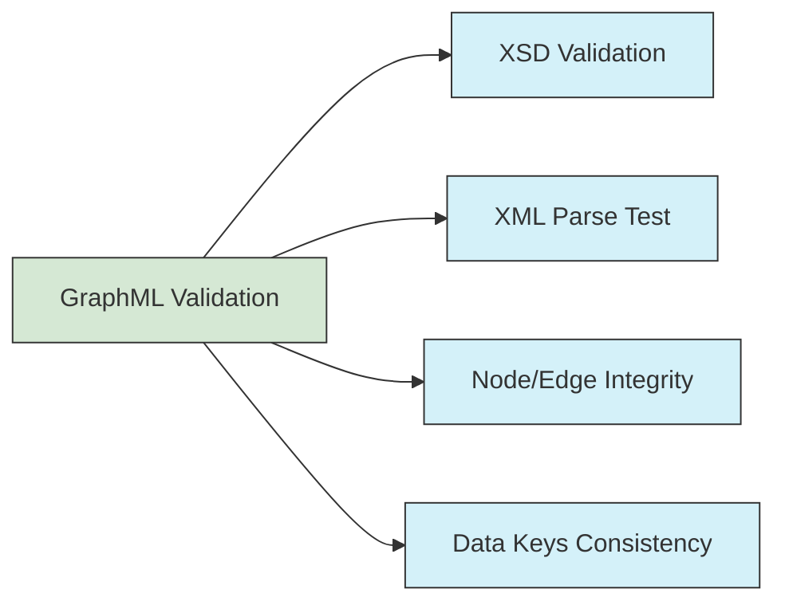
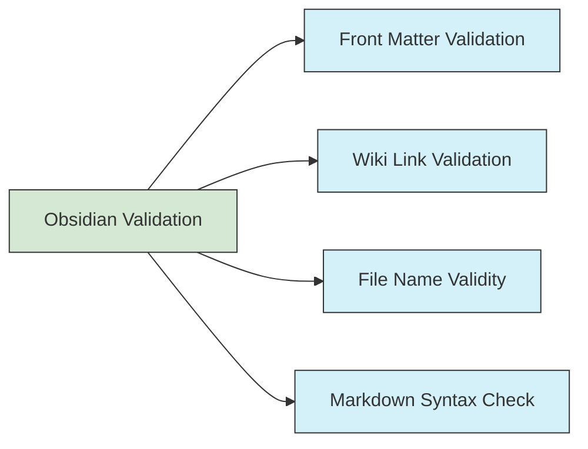

# UltraLink Format Validation Guide

This document provides comprehensive guidance for validating UltraLink format transformations to ensure reliability, correctness, and quality across all supported formats.



## Validation Dimensions

UltraLink format validations operate across multiple dimensions to ensure complete coverage:

### 1. Structural Validation

Ensures the output adheres to the expected structure and syntax of the target format.



**Implementation approaches:**

```javascript
// JSON Schema validation
function validateStructure(output, schema) {
  const Ajv = require('ajv');
  const ajv = new Ajv();
  const validate = ajv.compile(schema);
  const valid = validate(output);
  
  if (!valid) {
    throw new Error(`Structural validation failed: ${JSON.stringify(validate.errors)}`);
  }
  
  return true;
}

// XML Schema validation
function validateXMLStructure(xmlString, xsdPath) {
  const libxmljs = require('libxmljs');
  const fs = require('fs');
  
  const xsd = fs.readFileSync(xsdPath, 'utf8');
  const xsdDoc = libxmljs.parseXml(xsd);
  const xmlDoc = libxmljs.parseXml(xmlString);
  
  const isValid = xmlDoc.validate(xsdDoc);
  if (!isValid) {
    throw new Error(`XML validation failed: ${xmlDoc.validationErrors}`);
  }
  
  return true;
}
```

### 2. Semantic Validation

Ensures the meaning and relationships in the UltraLink model are correctly preserved in the target format.



**Implementation approaches:**

```javascript
function validateSemantics(originalUltraLink, exportedFormat) {
  // Entity count validation
  const entitiesInExport = countEntities(exportedFormat);
  if (entitiesInExport !== originalUltraLink.entities.size) {
    throw new Error(`Entity count mismatch: expected ${originalUltraLink.entities.size}, got ${entitiesInExport}`);
  }
  
  // Relationship count validation
  const relationshipsInExport = countRelationships(exportedFormat);
  const originalRelationshipCount = countOriginalRelationships(originalUltraLink);
  if (relationshipsInExport !== originalRelationshipCount) {
    throw new Error(`Relationship count mismatch: expected ${originalRelationshipCount}, got ${relationshipsInExport}`);
  }
  
  // Entity identity validation
  const entityIds = new Set(getEntityIds(exportedFormat));
  for (const id of originalUltraLink.entities.keys()) {
    if (!entityIds.has(id)) {
      throw new Error(`Missing entity: ${id}`);
    }
  }
  
  // Relationship reference validation
  for (const relationship of getRelationships(exportedFormat)) {
    if (!entityIds.has(relationship.source)) {
      throw new Error(`Relationship references non-existent source: ${relationship.source}`);
    }
    if (!entityIds.has(relationship.target)) {
      throw new Error(`Relationship references non-existent target: ${relationship.target}`);
    }
  }
  
  // Type preservation validation
  // ... additional semantic checks
  
  return true;
}
```

### 3. Format Conformance Validation

Ensures the output conforms to the target format's specific requirements and conventions.



**Implementation approaches:**

```javascript
async function validateFormatConformance(output, formatType) {
  switch (formatType) {
    case 'json':
      // Check if valid JSON
      try {
        JSON.parse(output);
      } catch (e) {
        throw new Error(`Invalid JSON: ${e.message}`);
      }
      break;
      
    case 'graphml':
      // Validate against GraphML XSD
      return validateXMLStructure(output, path.join(__dirname, 'schemas', 'graphml.xsd'));
      
    case 'csv':
      // Check CSV format validity
      return validateCSVFormat(output);
      
    // Other format-specific validations
  }
  
  return true;
}

// Validate with external tools where appropriate
async function validateWithExternalTool(output, format) {
  const tempFile = path.join(os.tmpdir(), `validation-${Date.now()}.${format}`);
  fs.writeFileSync(tempFile, output);
  
  try {
    // Run appropriate external validator
    switch (format) {
      case 'graphml':
        await runCommand('xmllint', ['--schema', 'graphml.xsd', tempFile]);
        break;
      case 'json':
        await runCommand('jsonlint', [tempFile]);
        break;
      // Handle other formats
    }
    return true;
  } finally {
    // Clean up temp file
    fs.unlinkSync(tempFile);
  }
}
```

### 4. Integration Validation

Ensures the exported format can be successfully consumed by target systems and tools.



**Implementation approaches:**

```javascript
async function validateIntegration(output, format) {
  switch (format) {
    case 'graphml':
      // Test with popular graph libraries
      await testWithNetworkX(output);
      await testWithGephi(output);
      break;
      
    case 'json':
      // Verify that it can be parsed and used
      const parsed = JSON.parse(output);
      await testWithJSONConsumerLibrary(parsed);
      break;
      
    case 'obsidian':
      // Test with Obsidian API or mock
      await testWithObsidianMock(output);
      break;
      
    // Other format-specific integrations  
  }
  
  return true;
}

// Round-trip validation
async function validateRoundTrip(ultralink, format) {
  // Export to the format
  const exported = ultralink.exportToFormat(format);
  
  // Create a new UltraLink instance
  const newUltralink = new UltraLink();
  
  // Import from the format
  await newUltralink.importFromFormat(format, exported);
  
  // Compare the two instances
  return compareUltraLinkInstances(ultralink, newUltralink);
}
```

### 5. Performance Validation

Ensures the transformation process meets performance requirements for various data sizes.



**Implementation approaches:**

```javascript
async function validatePerformance(formatFunction, sizes) {
  const results = {};
  
  for (const size of sizes) {
    // Create test dataset of specified size
    const testData = generateTestData(size);
    const ultralink = new UltraLink();
    await populateWithTestData(ultralink, testData);
    
    // Measure execution time
    const startTime = process.hrtime.bigint();
    const memory0 = process.memoryUsage().heapUsed;
    
    const output = formatFunction(ultralink);
    
    const endTime = process.hrtime.bigint();
    const memory1 = process.memoryUsage().heapUsed;
    
    // Calculate metrics
    const executionTimeMs = Number(endTime - startTime) / 1_000_000;
    const memoryUsageMB = (memory1 - memory0) / (1024 * 1024);
    const outputSizeKB = Buffer.byteLength(output, 'utf8') / 1024;
    
    results[size] = {
      executionTimeMs,
      memoryUsageMB,
      outputSizeKB,
      entitiesPerSecond: (size.entities / (executionTimeMs / 1000)),
      bytesPerEntity: (Buffer.byteLength(output, 'utf8') / size.entities)
    };
    
    // Validate against performance requirements
    if (executionTimeMs > size.maxTimeMs) {
      throw new Error(`Performance requirement not met: ${executionTimeMs}ms > ${size.maxTimeMs}ms maximum`);
    }
  }
  
  return results;
}
```

## Format-Specific Validation Requirements

Each format requires specific validation approaches:

### JSON Format Validation



```javascript
function validateJSONOutput(jsonOutput) {
  // Parse test
  let parsed;
  try {
    parsed = JSON.parse(jsonOutput);
  } catch (e) {
    throw new Error(`Invalid JSON: ${e.message}`);
  }
  
  // JSON Schema validation
  const schema = require('./schemas/ultralink-json-schema.json');
  const Ajv = require('ajv');
  const ajv = new Ajv();
  const validate = ajv.compile(schema);
  const valid = validate(parsed);
  
  if (!valid) {
    throw new Error(`JSON schema validation failed: ${JSON.stringify(validate.errors)}`);
  }
  
  // Check for duplicate IDs
  const entityIds = new Set();
  for (const entity of parsed.entities) {
    if (entityIds.has(entity.id)) {
      throw new Error(`Duplicate entity ID: ${entity.id}`);
    }
    entityIds.add(entity.id);
  }
  
  // Additional JSON-specific checks
  // ...
  
  return true;
}
```

### GraphML Format Validation



```javascript
function validateGraphMLOutput(graphmlOutput) {
  // Parse test
  let parsed;
  try {
    const libxmljs = require('libxmljs');
    parsed = libxmljs.parseXml(graphmlOutput);
  } catch (e) {
    throw new Error(`Invalid XML: ${e.message}`);
  }
  
  // XSD validation
  const fs = require('fs');
  const xsdPath = path.join(__dirname, 'schemas', 'graphml.xsd');
  const xsd = fs.readFileSync(xsdPath, 'utf8');
  const xsdDoc = libxmljs.parseXml(xsd);
  
  const isValid = parsed.validate(xsdDoc);
  if (!isValid) {
    throw new Error(`GraphML validation failed: ${parsed.validationErrors}`);
  }
  
  // Check node/edge integrity
  const nodeIds = new Set();
  const nodes = parsed.find('//node');
  for (const node of nodes) {
    const id = node.attr('id').value();
    nodeIds.add(id);
  }
  
  const edges = parsed.find('//edge');
  for (const edge of edges) {
    const source = edge.attr('source').value();
    const target = edge.attr('target').value();
    
    if (!nodeIds.has(source)) {
      throw new Error(`Edge references non-existent source node: ${source}`);
    }
    
    if (!nodeIds.has(target)) {
      throw new Error(`Edge references non-existent target node: ${target}`);
    }
  }
  
  // Additional GraphML-specific checks
  // ...
  
  return true;
}
```

### Obsidian Format Validation



```javascript
function validateObsidianOutput(obsidianFiles) {
  // Check file naming
  for (const [filename, content] of Object.entries(obsidianFiles)) {
    if (!/^[a-zA-Z0-9\-_]+\.md$/.test(filename)) {
      throw new Error(`Invalid Obsidian filename: ${filename}`);
    }
    
    // Front matter validation
    if (!content.startsWith('---\n')) {
      throw new Error(`Missing front matter in file: ${filename}`);
    }
    
    const frontMatterEndIndex = content.indexOf('\n---\n', 4);
    if (frontMatterEndIndex === -1) {
      throw new Error(`Invalid front matter format in file: ${filename}`);
    }
    
    const frontMatter = content.substring(4, frontMatterEndIndex);
    
    // Validate required front matter fields
    if (!frontMatter.includes('id:')) {
      throw new Error(`Missing 'id' in front matter for file: ${filename}`);
    }
    
    // Wiki link validation
    const wikiLinkRegex = /\[\[([^\]|]+)(?:\|([^\]]+))?\]\]/g;
    let match;
    const linkedFiles = new Set();
    
    while ((match = wikiLinkRegex.exec(content)) !== null) {
      linkedFiles.add(match[1]);
    }
    
    // Check that linked files exist
    for (const linkedFile of linkedFiles) {
      const linkedFilename = `${linkedFile}.md`;
      if (!obsidianFiles[linkedFilename] && !obsidianFiles[linkedFile]) {
        throw new Error(`Broken wiki link to '${linkedFile}' in file: ${filename}`);
      }
    }
  }
  
  return true;
}
```

## Validation Strategy for Testing

Implement a layered validation strategy in your tests:

### 1. Unit Tests for Individual Validators

```javascript
describe('Format Validators', () => {
  describe('JSON Validator', () => {
    it('should validate correct JSON output', () => {
      const validJSON = JSON.stringify({
        entities: [
          { id: 'test1', type: 'test', attributes: {} }
        ],
        relationships: []
      });
      
      expect(() => validateJSONOutput(validJSON)).not.toThrow();
    });
    
    it('should reject invalid JSON', () => {
      const invalidJSON = '{entities: []'; // Missing quotes, invalid JSON
      
      expect(() => validateJSONOutput(invalidJSON)).toThrow();
    });
    
    it('should detect duplicate entity IDs', () => {
      const duplicateIdsJSON = JSON.stringify({
        entities: [
          { id: 'test1', type: 'test', attributes: {} },
          { id: 'test1', type: 'test', attributes: {} }
        ],
        relationships: []
      });
      
      expect(() => validateJSONOutput(duplicateIdsJSON)).toThrow(/Duplicate entity ID/);
    });
    
    // Additional validation test cases
  });
  
  // Tests for other format validators
});
```

### 2. Integration Tests for Format Exporters

```javascript
describe('Format Exporters', () => {
  describe('JSON Exporter', () => {
    it('should produce valid JSON output', () => {
      const ultralink = new UltraLink();
      ultralink.createEntity({ id: 'test1', type: 'test', attributes: { name: 'Test 1' } });
      ultralink.createEntity({ id: 'test2', type: 'test', attributes: { name: 'Test 2' } });
      ultralink.createRelationship({ source: 'test1', target: 'test2', type: 'related_to' });
      
      const jsonOutput = ultralink.toJSON();
      
      // Validate the output
      expect(() => validateJSONOutput(jsonOutput)).not.toThrow();
    });
    
    // Test with various configurations
    it('should handle vector inclusion', () => {
      const ultralink = new UltraLink();
      // Create entity with vector
      ultralink.createEntity({
        id: 'test1',
        type: 'test',
        attributes: { name: 'Test 1' },
        vector: [0.1, 0.2, 0.3]
      });
      
      const jsonWithoutVectors = ultralink.toJSON({ includeVectors: false });
      const jsonWithVectors = ultralink.toJSON({ includeVectors: true });
      
      // Parse outputs
      const parsedWithoutVectors = JSON.parse(jsonWithoutVectors);
      const parsedWithVectors = JSON.parse(jsonWithVectors);
      
      // Check vector presence/absence
      expect(parsedWithoutVectors.entities[0].vector).toBeUndefined();
      expect(parsedWithVectors.entities[0].vector).toEqual([0.1, 0.2, 0.3]);
      
      // Both should be valid
      expect(() => validateJSONOutput(jsonWithoutVectors)).not.toThrow();
      expect(() => validateJSONOutput(jsonWithVectors)).not.toThrow();
    });
    
    // Additional exporter test cases
  });
  
  // Tests for other format exporters
});
```

### 3. System-Level Validation Tests

```javascript
describe('System-Level Format Validation', () => {
  // Test with complete systems
  it('should validate all formats for Research Team system', async () => {
    const system = createResearchTeamDataset();
    
    // Validate JSON format
    const jsonOutput = system.toJSON();
    expect(() => validateJSONOutput(jsonOutput)).not.toThrow();
    
    // Validate GraphML format
    const graphmlOutput = system.toGraphML();
    expect(() => validateGraphMLOutput(graphmlOutput)).not.toThrow();
    
    // Validate Obsidian format
    const obsidianOutput = system.toObsidian();
    expect(() => validateObsidianOutput(obsidianOutput)).not.toThrow();
    
    // Validate other formats
    // ...
    
    // Round-trip validation where applicable
    if (system.fromJSON) {
      const newSystem = new UltraLink();
      await newSystem.fromJSON(jsonOutput);
      expect(compareUltraLinkInstances(system, newSystem)).toBe(true);
    }
  });
  
  // Test with additional test systems
});
```

## Validation Utility Library

Create a reusable validation utility library for testing:

```javascript
/**
 * UltraLink Format Validation Utilities
 */
const UltraLinkValidation = {
  /**
   * Validates JSON format output
   * @param {string} jsonOutput - JSON string to validate
   * @returns {boolean} true if valid
   * @throws {Error} if validation fails
   */
  json: validateJSONOutput,
  
  /**
   * Validates GraphML format output
   * @param {string} graphmlOutput - GraphML string to validate
   * @returns {boolean} true if valid
   * @throws {Error} if validation fails
   */
  graphml: validateGraphMLOutput,
  
  /**
   * Validates Obsidian format output
   * @param {Object} obsidianFiles - Object mapping filenames to content
   * @returns {boolean} true if valid
   * @throws {Error} if validation fails
   */
  obsidian: validateObsidianOutput,
  
  /**
   * Validates semantic preservation between UltraLink instance and export
   * @param {UltraLink} originalUltraLink - Original UltraLink instance
   * @param {string|Object} exportedFormat - Exported format data
   * @param {string} formatType - Format type for parsing
   * @returns {boolean} true if semantics are preserved
   * @throws {Error} if validation fails
   */
  semantics: validateSemantics,
  
  /**
   * Validates performance metrics for a format exporter
   * @param {Function} formatFunction - Function that exports UltraLink to format
   * @param {Array<Object>} sizes - Array of test size configurations
   * @returns {Object} Performance metrics
   * @throws {Error} if performance requirements not met
   */
  performance: validatePerformance,
  
  /**
   * Validates format conformance
   * @param {string|Object} output - Exported format output
   * @param {string} formatType - Format type
   * @returns {boolean} true if format conforms to standards
   * @throws {Error} if validation fails
   */
  conformance: validateFormatConformance,
  
  /**
   * Validates round-trip preservation
   * @param {UltraLink} ultralink - Original UltraLink instance
   * @param {string} format - Format name for export/import
   * @returns {boolean} true if round-trip preserves data
   * @throws {Error} if validation fails
   */
  roundTrip: validateRoundTrip
};

module.exports = UltraLinkValidation;
```

## Continuous Integration Validation

Implement validation in your CI/CD pipeline:

```yaml
# In your CI/CD configuration file
format-validation:
  stage: test
  script:
    - npm install
    - node tests/validation/run-format-validations.js
    - node tests/validation/run-format-conformance.js
    - node tests/validation/run-format-performance.js
  artifacts:
    paths:
      - validation-reports/
```

## Validation Reports

Generate structured validation reports:

```javascript
class ValidationReporter {
  constructor(options = {}) {
    this.results = [];
    this.startTime = Date.now();
    this.options = {
      outputPath: './validation-reports',
      failOnError: true,
      ...options
    };
  }
  
  addResult(formatName, testName, passed, details = null, error = null) {
    this.results.push({
      timestamp: new Date().toISOString(),
      format: formatName,
      test: testName,
      passed,
      details,
      error: error ? error.message : null,
      stack: error ? error.stack : null
    });
  }
  
  getSummary() {
    const totalTests = this.results.length;
    const passedTests = this.results.filter(r => r.passed).length;
    const failedTests = totalTests - passedTests;
    
    return {
      totalTests,
      passedTests,
      failedTests,
      success: failedTests === 0,
      duration: Date.now() - this.startTime
    };
  }
  
  async writeReport() {
    const fs = require('fs').promises;
    const path = require('path');
    
    const summary = this.getSummary();
    const report = {
      summary,
      results: this.results
    };
    
    await fs.mkdir(this.options.outputPath, { recursive: true });
    
    // Write JSON report
    const jsonPath = path.join(this.options.outputPath, `validation-report-${Date.now()}.json`);
    await fs.writeFile(jsonPath, JSON.stringify(report, null, 2));
    
    // Write HTML report for easier viewing
    const htmlPath = path.join(this.options.outputPath, `validation-report-${Date.now()}.html`);
    const htmlContent = this.generateHtmlReport(report);
    await fs.writeFile(htmlPath, htmlContent);
    
    return {
      jsonPath,
      htmlPath,
      summary
    };
  }
  
  generateHtmlReport(report) {
    // Generate HTML report from results
    // ...
  }
}
```

## Conclusion

By implementing comprehensive format validation, UltraLink ensures:

1. **Reliability**: Formats are consistently correct and valid
2. **Interoperability**: Exported formats work with target systems
3. **Performance**: Transformations meet performance requirements
4. **Semantic Preservation**: Knowledge is accurately represented across formats
5. **Quality Assurance**: Issues are caught before deployment

Use this validation framework to:
- Validate existing format transformations
- Develop tests for new formats
- Validate format-specific optimizations
- Ensure backward compatibility when refactoring
- Generate validation reports for documentation

For format-specific validation details, see the respective format documentation. 