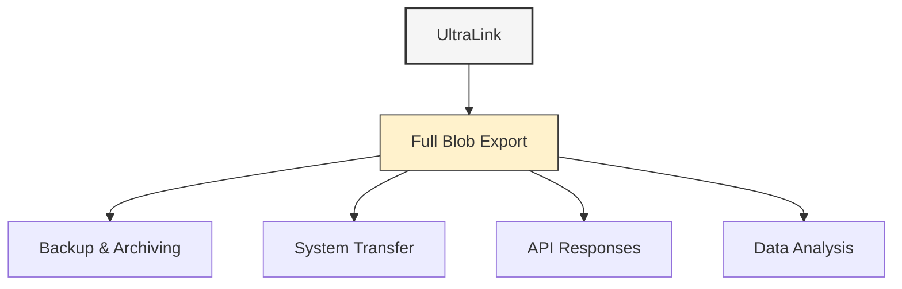

# Full Blob Format Guide

The Full Blob export format provides a complete, serialized representation of your UltraLink knowledge graph in a single file. This format preserves all data, relationships, metadata, and vector embeddings, making it ideal for backup, transfer, and programmatic access.



## Overview

The Full Blob format is UltraLink's most comprehensive export option, including:

1. All entities with their complete attributes and metadata
2. All relationships with their attributes and directionality
3. Vector embeddings for semantic search and similarity
4. System metadata and configuration
5. Temporal information and version history (if enabled)

This format is ideal for:

- Complete system backups
- Transferring knowledge graphs between systems
- API responses containing full graph state
- Data analysis and processing
- Integration with external systems
- Autonomous agent knowledge storage

## Usage

### Basic Export

```javascript
// Export to Full Blob format
await ultralink.toFullBlob('./knowledge-graph.blob');

// With simple options
await ultralink.toFullBlob({
  filename: './knowledge-graph.blob',
  compress: true
});
```

### Export with Detailed Options

```javascript
// Export with all options
await ultralink.toFullBlob({
  filename: './backups/knowledge-graph-v2.blob',
  compress: true,
  encryption: {
    enabled: true,
    password: process.env.BACKUP_PASSWORD,
    algorithm: 'aes-256-gcm'
  },
  includeVectors: true,
  includeMetadata: true,
  includeHistory: true,
  entityTypes: ['concept', 'person', 'project'],
  relationshipTypes: ['related_to', 'created_by', 'part_of'],
  format: 'binary',
  splitSize: 0,  // 0 for single file, positive number for size in MB
  addTimestamp: true,
  validateBeforeExport: true
});
```

## Output Structure

The Full Blob format contains a complete serialized representation of the knowledge graph:

```javascript
// Internal structure (when using format: 'json')
{
  "metadata": {
    "version": "1.2.0",
    "created": "2023-08-15T14:30:00Z",
    "description": "Desert Ecosystem Knowledge Graph",
    "entityCount": 42,
    "relationshipCount": 87,
    "configuration": {
      // System configuration
    }
  },
  "entities": {
    "saguaro": {
      "id": "saguaro",
      "type": "organism",
      "created_at": "2023-06-15T10:30:00Z",
      "updated_at": "2023-07-20T08:15:00Z",
      "attributes": {
        "name": "Saguaro Cactus",
        "scientificName": "Carnegiea gigantea",
        "height": "15-50 feet",
        "lifespan": "150-200 years"
      },
      "relationships": {
        "adapts_to": [
          {
            "target": "aridity",
            "attributes": {
              "mechanism": "Water storage in stem",
              "efficiency": 0.95
            }
          }
        ],
        "provides_habitat_for": [
          { "target": "gila-woodpecker" },
          { "target": "cactus-wren" }
        ]
      },
      "vector": [0.123, -0.456, 0.789, /* ... */]
    },
    // Additional entities...
  },
  "history": {
    // Optional version history if includeHistory is true
  },
  "checksum": "sha256:a1b2c3d4e5f6..."
}
```

When using `format: 'binary'`, this structure is converted to a binary representation for more compact storage.

## Options Reference

| Option | Type | Default | Description |
|--------|------|---------|-------------|
| `filename` | string | './output/graph.blob' | Output filename for the blob file |
| `compress` | boolean | true | Compress the output (gzip) |
| `encryption` | object | null | Encryption options |
| `encryption.enabled` | boolean | false | Enable encryption |
| `encryption.password` | string | null | Encryption password |
| `encryption.algorithm` | string | 'aes-256-gcm' | Encryption algorithm |
| `includeVectors` | boolean | true | Include vector embeddings |
| `includeMetadata` | boolean | true | Include system metadata |
| `includeHistory` | boolean | false | Include version history |
| `entityTypes` | string[] | all | Filter entities by type |
| `relationshipTypes` | string[] | all | Filter relationships by type |
| `format` | string | 'binary' | Output format ('binary' or 'json') |
| `splitSize` | number | 0 | Split into multiple files if > 0 (size in MB) |
| `addTimestamp` | boolean | true | Add timestamp to filename |
| `validateBeforeExport` | boolean | true | Validate data before export |
| `excludeAttributes` | string[] | [] | Entity/relationship attributes to exclude |
| `includeDeleted` | boolean | false | Include soft-deleted entities |
| `compressionLevel` | number | 6 | Compression level (0-9) |
| `chunkSize` | number | 10000 | Number of entities per chunk when processing |

## Advanced Features

### Encryption

Secure your knowledge graph with encryption:

```javascript
// Export with encryption
await ultralink.toFullBlob({
  filename: './secure/encrypted-knowledge.blob',
  compress: true,
  encryption: {
    enabled: true,
    password: process.env.SECURE_KEY,
    algorithm: 'aes-256-gcm',
    keyDerivation: 'pbkdf2',
    keyLength: 32,
    iterations: 10000
  }
});
```

### Split Files

Split large knowledge graphs into multiple files:

```javascript
// Export with file splitting
await ultralink.toFullBlob({
  filename: './backups/knowledge-graph.blob',
  compress: true,
  splitSize: 50, // Split into 50MB chunks
  addTimestamp: true
});
```

This will create files like:
- `knowledge-graph-2023-08-15T14-30-00Z.blob.001`
- `knowledge-graph-2023-08-15T14-30-00Z.blob.002`
- etc.

### Binary vs JSON Format

Choose between binary and JSON formats:

```javascript
// Binary format (more compact)
await ultralink.toFullBlob({
  filename: './knowledge-graph.blob',
  format: 'binary' // Default
});

// JSON format (human-readable but larger)
await ultralink.toFullBlob({
  filename: './knowledge-graph.json',
  format: 'json',
  prettyPrint: true // Format with indentation
});
```

## Use Cases

### System Backup

Create complete system backups for disaster recovery:

```javascript
// Create a rotating backup system
const createBackup = async () => {
  const timestamp = new Date().toISOString().replace(/:/g, '-');
  
  await ultralink.toFullBlob({
    filename: `./backups/kb-backup-${timestamp}.blob`,
    compress: true,
    encryption: {
      enabled: true,
      password: process.env.BACKUP_PASSWORD
    },
    includeVectors: true,
    includeMetadata: true,
    includeHistory: true,
    validateBeforeExport: true
  });
  
  // Keep only the last 10 backups
  const fs = require('fs');
  const path = require('path');
  const backupDir = './backups';
  
  const files = fs.readdirSync(backupDir)
    .filter(file => file.startsWith('kb-backup-'))
    .map(file => path.join(backupDir, file));
  
  if (files.length > 10) {
    files.sort((a, b) => fs.statSync(a).mtime.getTime() - fs.statSync(b).mtime.getTime());
    
    // Delete oldest files
    for (let i = 0; i < files.length - 10; i++) {
      fs.unlinkSync(files[i]);
    }
  }
};

// Create backup job
const scheduleBackup = () => {
  setInterval(createBackup, 24 * 60 * 60 * 1000); // Daily backup
};

scheduleBackup();
```

### System Transfer

Transfer knowledge graphs between systems:

```javascript
// Export full knowledge graph
const exportGraph = async () => {
  await ultralink.toFullBlob({
    filename: './transfer/knowledge-export.blob',
    compress: true,
    includeVectors: true,
    includeMetadata: true
  });
  
  // Upload to transfer location
  await uploadToCloud('./transfer/knowledge-export.blob', 'storage/knowledge-export.blob');
};

// Import on another system
const importGraph = async () => {
  // Download from transfer location
  await downloadFromCloud('storage/knowledge-export.blob', './transfer/knowledge-import.blob');
  
  // Create a new UltraLink instance
  const newSystem = new UltraLink();
  
  // Import from blob
  await newSystem.fromFullBlob('./transfer/knowledge-import.blob');
  
  console.log('Import complete, entities:', await newSystem.countEntities());
};
```

### API Integration

Use Full Blob format for API responses:

```javascript
// Express.js API endpoint example
const express = require('express');
const app = express();

app.get('/api/knowledge-graph', async (req, res) => {
  try {
    // Create in-memory blob
    const blobBuffer = await ultralink.toFullBlob({
      returnBuffer: true, // Return buffer instead of writing file
      compress: true,
      includeVectors: req.query.vectors === 'true',
      entityTypes: req.query.types ? req.query.types.split(',') : undefined,
      format: req.query.format || 'binary'
    });
    
    // Set appropriate content type
    const contentType = req.query.format === 'json' 
      ? 'application/json' 
      : 'application/octet-stream';
    
    res.setHeader('Content-Type', contentType);
    res.setHeader('Content-Disposition', 'attachment; filename="knowledge-graph.blob"');
    res.send(blobBuffer);
  } catch (error) {
    res.status(500).json({ error: error.message });
  }
});

app.listen(3000, () => {
  console.log('API server running on port 3000');
});
```

## For Autonomous Agents

Autonomous agents can use Full Blob format to persist their knowledge:

```javascript
class KnowledgeAgent {
  constructor() {
    this.knowledgeBase = new UltraLink();
    this.backupLocation = './agent-knowledge/';
    // Initialize agent
  }
  
  async initialize() {
    try {
      // Try to load previous knowledge
      await this.loadKnowledge();
    } catch (error) {
      console.log('No previous knowledge found, starting fresh');
    }
  }
  
  async saveKnowledge() {
    const timestamp = new Date().toISOString().replace(/:/g, '-');
    const filename = `${this.backupLocation}agent-knowledge-${timestamp}.blob`;
    
    await this.knowledgeBase.toFullBlob({
      filename,
      compress: true,
      includeVectors: true,
      includeMetadata: true,
      // Use versioning instead of separate files
      addTimestamp: false
    });
    
    // Update the "latest" pointer
    await this.knowledgeBase.toFullBlob({
      filename: `${this.backupLocation}agent-knowledge-latest.blob`,
      compress: true,
      includeVectors: true,
      includeMetadata: true,
      addTimestamp: false
    });
    
    console.log(`Knowledge saved to ${filename}`);
    return filename;
  }
  
  async loadKnowledge() {
    const latestFile = `${this.backupLocation}agent-knowledge-latest.blob`;
    
    await this.knowledgeBase.fromFullBlob(latestFile);
    
    console.log('Knowledge loaded successfully');
    return await this.knowledgeBase.countEntities();
  }
  
  async learnNewConcept(concept, definition, relationships) {
    // Add new knowledge
    await this.knowledgeBase.addEntity(concept, 'concept', {
      definition,
      learned_at: new Date().toISOString()
    });
    
    // Add relationships
    for (const [relType, targets] of Object.entries(relationships)) {
      for (const target of targets) {
        await this.knowledgeBase.addLink(concept, target, relType);
      }
    }
    
    // Save knowledge after learning
    await this.saveKnowledge();
  }
}

// Usage example
const agent = new KnowledgeAgent();
await agent.initialize();

await agent.learnNewConcept(
  'active-inference',
  'A theory in neuroscience that describes perception and action as two aspects of the same process.',
  {
    'related_to': ['free-energy-principle', 'predictive-coding', 'bayesian-brain'],
    'developed_by': ['karl-friston']
  }
);
```

## Import from Full Blob

Restore or load a knowledge graph from a Full Blob:

```javascript
// Create a new UltraLink instance
const ultralink = new UltraLink();

// Basic import
await ultralink.fromFullBlob('./knowledge-graph.blob');

// Import with options
await ultralink.fromFullBlob({
  filename: './backups/knowledge-graph.blob',
  encryption: {
    enabled: true,
    password: process.env.BACKUP_PASSWORD
  },
  validateAfterImport: true,
  mergeStrategy: 'overwrite', // 'overwrite', 'merge', or 'skip'
  importVectors: true,
  importHistory: true
});

// After import
console.log(`Imported ${await ultralink.countEntities()} entities`);
```

## Best Practices

### Security

- **Encrypt sensitive data**: Always use encryption for sensitive knowledge graphs
- **Secure passwords**: Store encryption passwords securely, not in code
- **Access control**: Restrict access to blob files with appropriate permissions
- **Sanitize data**: Validate and sanitize data before importing from untrusted sources
- **Audit trail**: Keep logs of export and import operations

### Performance

- **Use compression**: Enable compression for all but the smallest graphs
- **Split large graphs**: Use the `splitSize` option for very large knowledge graphs
- **Binary format**: Use binary format for better performance with large graphs
- **Incremental backups**: Consider using `entityTypes` to create focused backups
- **Schedule backups**: Schedule backups during low-usage periods

### Reliability

- **Validate before export**: Keep `validateBeforeExport` enabled
- **Regular backups**: Implement a regular backup schedule
- **Test restores**: Periodically test the restore process
- **Version control**: Add timestamps and maintain multiple backup versions
- **Checksums**: Verify file integrity with checksums

## Limitations

- **File size**: Very large knowledge graphs may require splitting
- **Memory usage**: Import/export of large graphs requires sufficient memory
- **Cross-version compatibility**: Full Blob format may change between major versions
- **External resources**: Blob format doesn't include external files (like images)
- **Encryption overhead**: Encryption adds processing time and slightly increases file size

## Conclusion

UltraLink's Full Blob export provides the most comprehensive way to capture, store, and transfer your knowledge graph. With options for compression, encryption, and selective export, it's suitable for a wide range of backup, transfer, and integration scenarios.

For more information on other export formats, see the [Rendering Formats Overview](README.md). 