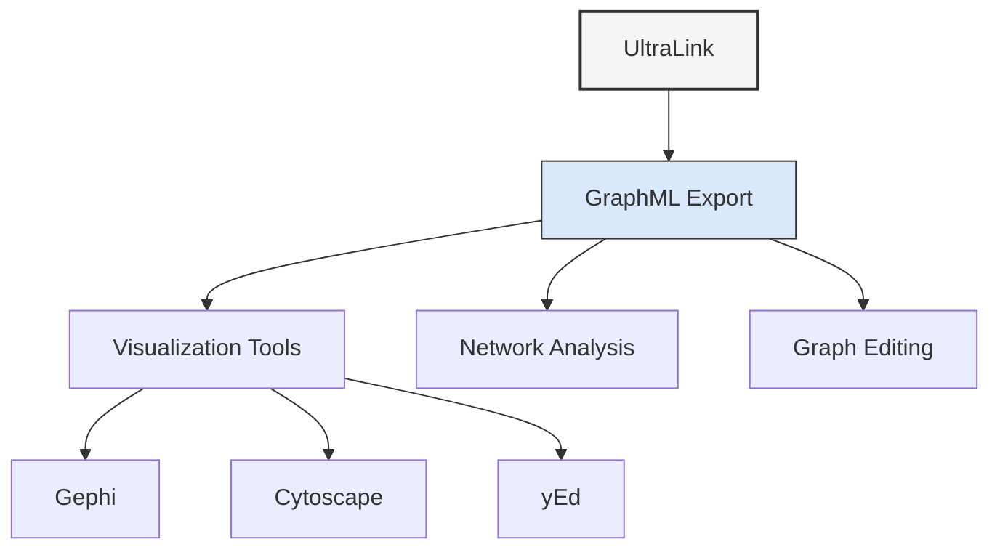

# GraphML Format Guide

GraphML export transforms your UltraLink knowledge graph into a standardized XML-based file format for graphs. This format preserves the complete structure of your knowledge graph and is compatible with popular graph visualization and analysis tools.



## Overview

[GraphML](http://graphml.graphdrawing.org/) is an XML-based file format for graph structures, developed to provide a common language for exchanging graph data between applications. UltraLink's GraphML export generates standards-compliant files that represent:

- Entities as graph nodes
- Relationships as graph edges
- Attributes as node/edge properties
- Custom metadata as XML extensions

This format is ideal for:

- Visualizing complex knowledge networks
- Analyzing graph properties and metrics
- Editing and refining graph structures
- Exchanging graph data with other applications
- Archiving graph structures in a standard format

## Usage

### Basic Export

```javascript
// Export to GraphML format
await ultralink.toGraphML('./knowledge-graph.graphml');

// With simple options
await ultralink.toGraphML({
  filename: './knowledge-graph.graphml',
  includeVectors: false
});
```

### Export with Detailed Options

```javascript
// Export with full options
await ultralink.toGraphML({
  filename: './output/knowledge-graph.graphml',
  includeVectors: true,
  includeMetadata: true,
  prettyPrint: true,
  entityTypes: ['concept', 'person', 'project'],
  relationshipTypes: ['related_to', 'created_by', 'part_of'],
  nodeAttributes: ['name', 'description', 'createdAt'],
  edgeAttributes: ['weight', 'relationship_type'],
  defaultNodeColor: '#6495ED',
  defaultEdgeColor: '#708090',
  nodeColorMapping: {
    'person': '#FF7F50',
    'concept': '#9370DB',
    'project': '#3CB371'
  },
  edgeColorMapping: {
    'created_by': '#FF6347',
    'part_of': '#4682B4'
  },
  nodeSizeAttribute: 'importance',
  edgeWidthAttribute: 'strength'
});
```

## Output Structure

The GraphML output is an XML file with the following structure:

```xml
<?xml version="1.0" encoding="UTF-8"?>
<graphml xmlns="http://graphml.graphdrawing.org/xmlns"
         xmlns:xsi="http://www.w3.org/2001/XMLSchema-instance"
         xsi:schemaLocation="http://graphml.graphdrawing.org/xmlns
         http://graphml.graphdrawing.org/xmlns/1.0/graphml.xsd">
  
  <!-- Property definitions -->
  <key id="name" for="node" attr.name="name" attr.type="string"/>
  <key id="type" for="node" attr.name="type" attr.type="string"/>
  <key id="vector" for="node" attr.name="vector" attr.type="string"/>
  <key id="relationship_type" for="edge" attr.name="relationship_type" attr.type="string"/>
  <key id="weight" for="edge" attr.name="weight" attr.type="double"/>
  <key id="d_color" for="node" attr.name="color" attr.type="string"/>
  <key id="e_color" for="edge" attr.name="color" attr.type="string"/>
  
  <graph id="UltraLink" edgedefault="directed">
    
    <!-- Nodes (entities) -->
    <node id="saguaro">
      <data key="name">Saguaro Cactus</data>
      <data key="type">organism</data>
      <data key="d_color">#3CB371</data>
      <data key="scientificName">Carnegiea gigantea</data>
      <data key="height">15-50 feet</data>
      <data key="lifespan">150-200 years</data>
    </node>
    
    <node id="aridity">
      <data key="name">Aridity</data>
      <data key="type">environmental_factor</data>
      <data key="d_color">#9370DB</data>
      <data key="description">Low precipitation and humidity</data>
    </node>
    
    <!-- Edges (relationships) -->
    <edge id="rel1" source="saguaro" target="aridity">
      <data key="relationship_type">adapts_to</data>
      <data key="e_color">#4682B4</data>
      <data key="mechanism">Water storage in stem</data>
      <data key="efficiency">0.95</data>
    </edge>
    
  </graph>
</graphml>
```

## Options Reference

| Option | Type | Default | Description |
|--------|------|---------|-------------|
| `filename` | string | './output/graph.graphml' | Output filename for the GraphML file |
| `includeVectors` | boolean | false | Include entity vector embeddings |
| `includeMetadata` | boolean | true | Include system metadata |
| `prettyPrint` | boolean | true | Format XML with indentation |
| `entityTypes` | string[] | all | Filter entities by type |
| `relationshipTypes` | string[] | all | Filter relationships by type |
| `nodeAttributes` | string[] | all | Entity attributes to include |
| `edgeAttributes` | string[] | all | Relationship attributes to include |
| `defaultNodeColor` | string | '#6495ED' | Default color for nodes |
| `defaultEdgeColor` | string | '#708090' | Default color for edges |
| `nodeColorMapping` | object | {} | Map of entity types to colors |
| `edgeColorMapping` | object | {} | Map of relationship types to colors |
| `nodeSizeAttribute` | string | null | Attribute to map to node size |
| `edgeWidthAttribute` | string | null | Attribute to map to edge width |
| `layoutAlgorithm` | string | 'force' | Suggested layout algorithm |
| `customKeyTypes` | object | {} | Define custom attribute types |
| `useYFilesExtensions` | boolean | false | Add yEd/yFiles extensions |

## Compatible Visualization Tools

The GraphML export is compatible with numerous graph visualization tools:

### Gephi

[Gephi](https://gephi.org/) is an open-source network analysis and visualization software:

```javascript
// Export for Gephi with specific layout attributes
await ultralink.toGraphML({
  filename: './gephi-analysis.graphml',
  includeMetadata: true,
  nodeSizeAttribute: 'pagerank',
  customKeyTypes: {
    'pagerank': 'double',
    'betweenness': 'double',
    'community': 'int'
  }
});
```

### yEd Graph Editor

[yEd](https://www.yworks.com/products/yed) is a powerful graph editor that supports GraphML:

```javascript
// Export with yEd-specific extensions
await ultralink.toGraphML({
  filename: './yed-visualization.graphml',
  useYFilesExtensions: true,
  nodeShapeMapping: {
    'person': 'ellipse',
    'concept': 'rectangle',
    'project': 'roundrectangle'
  },
  nodeLabelAttribute: 'name',
  edgeLabelAttribute: 'relationship_type',
  prettyPrint: true
});
```

### Cytoscape

[Cytoscape](https://cytoscape.org/) is a platform for complex network visualization:

```javascript
// Export for Cytoscape with network analysis attributes
await ultralink.toGraphML({
  filename: './cytoscape-analysis.graphml',
  includeMetadata: true,
  nodeSizeAttribute: 'importance',
  edgeWidthAttribute: 'weight',
  customKeyTypes: {
    'importance': 'double',
    'weight': 'double',
    'cluster': 'int'
  }
});
```

## Use Cases

### Network Analysis

Perform advanced network analysis on your knowledge graph:

```javascript
// Export for network analysis
await ultralink.toGraphML({
  filename: './network-analysis.graphml',
  includeVectors: false,
  includeMetadata: true,
  // Include only attributes relevant for analysis
  nodeAttributes: ['name', 'type', 'importance', 'centrality'],
  edgeAttributes: ['relationship_type', 'weight', 'direction'],
  // Add specific calculations as attributes
  transformNodeAttributes: (entity) => ({
    ...entity.attributes,
    connections: Object.values(entity.relationships || {}).flat().length,
    importance: calculateImportance(entity)
  }),
  transformEdgeAttributes: (relationship) => ({
    ...relationship.attributes,
    weight: relationship.attributes.weight || 1.0
  })
});
```

### Visual Knowledge Mapping

Create visually rich knowledge maps:

```javascript
// Export for visual knowledge mapping
await ultralink.toGraphML({
  filename: './knowledge-map.graphml',
  useYFilesExtensions: true,
  prettyPrint: true,
  // Visual styling
  nodeColorMapping: {
    'concept': '#4B0082',
    'process': '#006400',
    'resource': '#B8860B',
    'person': '#8B0000',
    'event': '#00008B'
  },
  nodeShapeMapping: {
    'concept': 'ellipse',
    'process': 'rectangle',
    'resource': 'diamond',
    'person': 'circle',
    'event': 'hexagon'
  },
  edgeColorMapping: {
    'defines': '#2E8B57',
    'relates_to': '#708090',
    'depends_on': '#A52A2A',
    'created_by': '#4682B4',
    'participates_in': '#FF8C00'
  },
  // Size by importance
  nodeSizeAttribute: 'importance',
  edgeWidthAttribute: 'strength'
});
```

### Data Exchange

Exchange graph data with other systems:

```javascript
// Export for data exchange
await ultralink.toGraphML({
  filename: './exchange-data.graphml',
  includeVectors: true,
  includeMetadata: true,
  prettyPrint: true,
  // Include all attributes
  transformNodeAttributes: (entity) => ({
    ...entity.attributes,
    id: entity.id,
    entity_type: entity.type,
    created_at: entity.created_at,
    updated_at: entity.updated_at
  }),
  // Custom namespaces for integration
  customNamespaces: {
    'ex': 'http://example.org/graphml/extension',
    'ul': 'http://ultralink.io/schema'
  }
});
```

## Advanced Features

### Custom Attribute Types

Define custom attribute types for better integration:

```javascript
// Define custom attribute types
await ultralink.toGraphML({
  filename: './typed-data.graphml',
  customKeyTypes: {
    'name': 'string',
    'description': 'string',
    'created_at': 'string',
    'modified_at': 'string',
    'importance': 'double',
    'count': 'int',
    'is_active': 'boolean',
    'coordinates': 'string', // For complex types
    'tags': 'string' // For arrays
  }
});
```

### Node and Edge Transformations

Transform your data before export:

```javascript
// Transform data during export
await ultralink.toGraphML({
  filename: './transformed-data.graphml',
  // Custom node transformations
  transformNodeAttributes: (entity) => {
    // Calculate node properties
    const connections = Object.values(entity.relationships || {}).flat().length;
    const importance = calculateImportance(entity);
    
    return {
      ...entity.attributes,
      connections,
      importance,
      display_name: entity.attributes.name || entity.id,
      summary: truncate(entity.attributes.description, 100),
      is_core: connections > 5 ? 'true' : 'false'
    };
  },
  // Custom edge transformations
  transformEdgeAttributes: (relationship) => {
    // Calculate edge properties
    const strength = relationship.attributes.weight || 
                    (relationship.attributes.confidence ? 
                     relationship.attributes.confidence : 1.0);
    
    return {
      ...relationship.attributes,
      strength,
      bidirectional: isBidirectional(relationship) ? 'true' : 'false',
      label: formatRelationshipLabel(relationship)
    };
  }
});
```

### Layout Hints

Add layout hints for visualization tools:

```javascript
// Add layout hints
await ultralink.toGraphML({
  filename: './layout-hints.graphml',
  useYFilesExtensions: true,
  // Group nodes by type
  includeGroupNodes: true,
  groupByAttribute: 'type',
  // Add layout algorithm suggestions
  layoutAlgorithm: 'hierarchical',
  layoutOptions: {
    'orientation': 'top_to_bottom',
    'alignment': 'center',
    'compactness': 0.8,
    'nodeSpacing': 50,
    'levelDistance': 100
  }
});
```

## For Autonomous Agents

Autonomous agents can use GraphML exports for graph analysis and visualization:

```javascript
class KnowledgeAnalysisAgent {
  constructor() {
    this.knowledgeBase = new UltraLink();
    // Initialize agent
  }
  
  async analyzeKnowledgeStructure() {
    // Export current knowledge as GraphML
    await this.knowledgeBase.toGraphML({
      filename: './analysis/knowledge-structure.graphml',
      includeMetadata: true
    });
    
    // Use external tool to analyze network properties
    const analysisResults = await this.runNetworkAnalysis('./analysis/knowledge-structure.graphml');
    
    // Update entities with analysis results
    for (const [entityId, metrics] of Object.entries(analysisResults)) {
      await this.knowledgeBase.updateEntity(entityId, {
        centrality: metrics.centrality,
        betweenness: metrics.betweenness,
        clustering: metrics.clustering,
        community: metrics.community
      });
    }
    
    // Generate visualization with updated metrics
    await this.knowledgeBase.toGraphML({
      filename: './analysis/knowledge-visualization.graphml',
      useYFilesExtensions: true,
      nodeColorMapping: this.communityColorMap(analysisResults),
      nodeSizeAttribute: 'centrality'
    });
    
    return {
      mainHubs: this.findTopEntities(analysisResults, 'centrality', 5),
      communities: this.summarizeCommunities(analysisResults),
      bridges: this.findTopEntities(analysisResults, 'betweenness', 5),
      visualizationPath: './analysis/knowledge-visualization.graphml'
    };
  }
  
  communityColorMap(analysisResults) {
    // Generate color map based on communities
    const communities = new Set();
    Object.values(analysisResults).forEach(r => communities.add(r.community));
    
    const colorMap = {};
    const colors = ['#e41a1c', '#377eb8', '#4daf4a', '#984ea3', '#ff7f00', '#ffff33'];
    
    Array.from(communities).forEach((community, index) => {
      const colorIndex = index % colors.length;
      colorMap[`community_${community}`] = colors[colorIndex];
    });
    
    return colorMap;
  }
}
```

## Best Practices

### File Size Management

- **Filter unnecessary attributes**: Only include relevant attributes
- **Exclude vectors by default**: Include vectors only when necessary
- **Use compression**: Consider compressing large GraphML files
- **Split large graphs**: For very large graphs, consider splitting by domain

### Visual Styling

- **Consistent color scheme**: Use a consistent color scheme for node types
- **Meaningful shapes**: Choose shapes that represent the semantics of your nodes
- **Size by importance**: Use size to represent importance or centrality
- **Edge styling**: Differentiate edge types with colors and line styles

### Tool-Specific Optimization

- **Enable tool extensions**: Use yFiles extensions when exporting for yEd
- **Add layout hints**: Include layout algorithm suggestions
- **Provide attribute types**: Define accurate types for better import
- **Test with target tool**: Verify the export works well with your target tool

## Conclusion

UltraLink's GraphML export provides a powerful way to visualize, analyze, and share your knowledge graph using standard graph visualization and analysis tools. The resulting GraphML files preserve your graph structure and attributes while enabling advanced visual exploration and network analysis.

For more information on other export formats, see the [Rendering Formats Overview](README.md). 