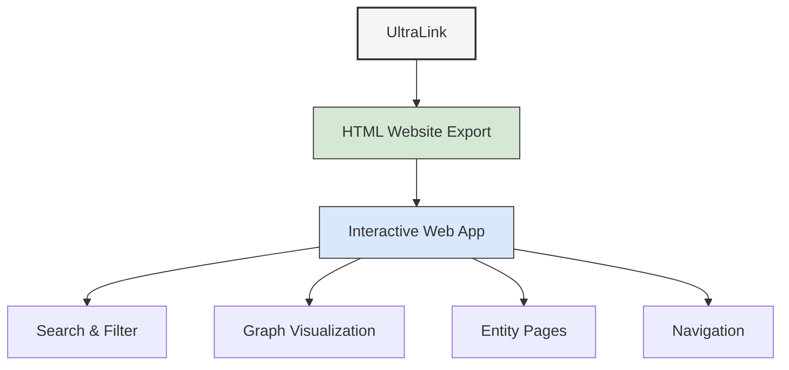

# HTML Website Format Guide

The HTML Website export creates a complete interactive web application from your UltraLink knowledge graph. This format generates a fully functional static website with search, visualization, and navigation features that can be deployed anywhere.



## Overview

UltraLink's HTML Website export transforms your knowledge graph into an interactive web application with:

1. A responsive, modern user interface
2. Interactive graph visualization
3. Full-text search capabilities
4. Detailed entity and relationship pages
5. Navigation and exploration features
6. Customizable theme and styling

This format is ideal for:

- Public knowledge bases
- Team documentation
- Project portfolios
- Research catalogs
- Interactive demonstrations
- Educational resources

## Usage

### Basic Export

```javascript
// Export to HTML website
await ultralink.toHTMLWebsite('./website');

// With simple options
await ultralink.toHTMLWebsite({
  directory: './website',
  title: 'My Knowledge Graph'
});
```

### Export with Detailed Options

```javascript
// Export with comprehensive options
await ultralink.toHTMLWebsite({
  directory: './public-website',
  title: 'Desert Ecosystem Knowledge Base',
  description: 'An interactive exploration of desert ecosystems and their components',
  theme: 'desert',
  customCSS: './styles/custom.css',
  logo: './assets/logo.png',
  favicon: './assets/favicon.ico',
  includeSearch: true,
  includeGraphVisualization: true,
  entityTypes: ['organism', 'environmental_factor', 'location'],
  relationshipTypes: ['adapts_to', 'lives_in', 'provides_habitat_for'],
  graphInitialOptions: {
    layout: 'force',
    nodeSize: 'degree',
    nodeColor: 'type',
    edgeColor: 'relationship_type'
  },
  indexPageContent: `
    <h1>Welcome to the Desert Ecosystem Knowledge Base</h1>
    <p>This interactive website allows you to explore the fascinating connections between organisms and environmental factors in desert ecosystems.</p>
  `,
  footerContent: '© 2023 Desert Research Institute',
  additionalPages: [
    {
      path: 'about.html',
      title: 'About This Project',
      content: '<h1>About</h1><p>This knowledge base was created using UltraLink...</p>'
    }
  ],
  metaTags: {
    'og:type': 'website',
    'og:title': 'Desert Ecosystem Knowledge Base',
    'twitter:card': 'summary_large_image'
  }
});
```

## Output Structure

The HTML Website export generates a complete website structure:

```
website/
├── index.html              # Home page
├── about.html              # Custom additional page
├── search.html             # Search interface
├── graph.html              # Graph visualization page
├── entities/               # Entity pages
│   ├── saguaro.html
│   ├── kangaroo-rat.html
│   └── aridity.html
├── css/                    # Stylesheets
│   ├── main.css
│   ├── theme-desert.css
│   └── custom.css
├── js/                     # JavaScript files
│   ├── app.js
│   ├── search.js
│   ├── graph.js
│   └── entity.js
├── data/                   # Data files
│   ├── entities.json
│   ├── relationships.json
│   ├── graph.json
│   └── search-index.json
├── assets/                 # Images and other resources
│   ├── logo.png
│   ├── favicon.ico
│   └── images/
└── libs/                   # Third-party libraries
    ├── d3.min.js
    ├── lunr.min.js
    └── bootstrap.min.js
```

### Entity Page Example

Each entity gets its own detailed HTML page:

```html
<!DOCTYPE html>
<html lang="en">
<head>
  <meta charset="UTF-8">
  <meta name="viewport" content="width=device-width, initial-scale=1.0">
  <title>Saguaro Cactus | Desert Ecosystem Knowledge Base</title>
  <link rel="stylesheet" href="../css/main.css">
  <link rel="stylesheet" href="../css/theme-desert.css">
  <link rel="stylesheet" href="../css/custom.css">
  <link rel="icon" href="../assets/favicon.ico">
</head>
<body>
  <header>
    <nav>
      <a href="../index.html" class="logo">
        
      </a>
      <ul>
        <li><a href="../index.html">Home</a></li>
        <li><a href="../graph.html">Graph</a></li>
        <li><a href="../search.html">Search</a></li>
        <li><a href="../about.html">About</a></li>
      </ul>
    </nav>
  </header>
  
  <main class="entity-page">
    <div class="entity-header">
      <h1>Saguaro Cactus</h1>
      <span class="entity-type organism">Organism</span>
    </div>
    
    <div class="entity-visualization">
      <!-- Local graph visualization -->
    </div>
    
    <div class="entity-content">
      <section class="entity-attributes">
        <h2>Attributes</h2>
        <dl>
          <dt>Scientific Name</dt>
          <dd>Carnegiea gigantea</dd>
          
          <dt>Height</dt>
          <dd>15-50 feet</dd>
          
          <dt>Lifespan</dt>
          <dd>150-200 years</dd>
        </dl>
      </section>
      
      <section class="entity-relationships">
        <h2>Relationships</h2>
        
        <div class="relationship-group">
          <h3>Adapts To</h3>
          <ul>
            <li>
              <a href="../entities/aridity.html">Aridity</a>
              <span class="relationship-attributes">
                Mechanism: Water storage in stem, Efficiency: 0.95
              </span>
            </li>
          </ul>
        </div>
        
        <div class="relationship-group">
          <h3>Provides Habitat For</h3>
          <ul>
            <li><a href="../entities/gila-woodpecker.html">Gila Woodpecker</a></li>
            <li><a href="../entities/cactus-wren.html">Cactus Wren</a></li>
          </ul>
        </div>
      </section>
    </div>
  </main>
  
  <footer>
    © 2023 Desert Research Institute
  </footer>
  
  <script src="../libs/d3.min.js"></script>
  <script src="../js/entity.js"></script>
</body>
</html>
```

## Options Reference

| Option | Type | Default | Description |
|--------|------|---------|-------------|
| `directory` | string | './output/website' | Output directory for the website |
| `title` | string | 'UltraLink Knowledge Graph' | Website title |
| `description` | string | '' | Website description for metadata |
| `theme` | string | 'default' | Theme name ('default', 'dark', 'light', 'minimal') |
| `customCSS` | string | null | Path to custom CSS file |
| `logo` | string | null | Path to logo image |
| `favicon` | string | null | Path to favicon |
| `includeSearch` | boolean | true | Include search functionality |
| `includeGraphVisualization` | boolean | true | Include interactive graph visualization |
| `entityTypes` | string[] | all | Filter entities by type |
| `relationshipTypes` | string[] | all | Filter relationships by type |
| `graphInitialOptions` | object | {} | Initial settings for graph visualization |
| `indexPageContent` | string | '' | Custom HTML content for index page |
| `footerContent` | string | '© [year] UltraLink' | Custom HTML content for footer |
| `additionalPages` | array | [] | Custom additional pages |
| `metaTags` | object | {} | Additional meta tags for SEO |
| `showEntityIds` | boolean | false | Display entity IDs on entity pages |
| `customTemplates` | object | null | Custom HTML templates |
| `includeRawData` | boolean | true | Include raw JSON data files |
| `maxEntitiesPerPage` | number | 100 | Maximum entities to show on list pages |
| `analytics` | object | null | Analytics configuration |
| `searchOptions` | object | {} | Search configuration options |
| `graphOptions` | object | {} | Graph visualization options |
| `navigationLinks` | array | [] | Custom navigation links |

## Customization

### Themes

UltraLink provides several built-in themes and supports custom themes:

```javascript
// Use a built-in theme
await ultralink.toHTMLWebsite({
  directory: './website',
  theme: 'dark'  // 'default', 'light', 'dark', 'minimal'
});

// Use a custom theme with custom CSS
await ultralink.toHTMLWebsite({
  directory: './website',
  theme: 'custom',
  customCSS: './styles/my-theme.css'
});
```

### Custom Templates

Override default HTML templates:

```javascript
// Customize templates
await ultralink.toHTMLWebsite({
  directory: './website',
  customTemplates: {
    entityPage: './templates/entity.html',
    indexPage: './templates/index.html',
    searchPage: './templates/search.html',
    graphPage: './templates/graph.html'
  }
});
```

Entity page template example:

```html
<!DOCTYPE html>
<html lang="en">
<head>
  <!-- Head content -->
  <title>{{entity.name}} | {{title}}</title>
  <!-- CSS links -->
</head>
<body>
  {{> header}}
  
  <main class="entity-page custom-style">
    <div class="custom-header">
      <h1>{{entity.name}}</h1>
      <span class="custom-type {{entity.type}}">{{entity.type}}</span>
      {{#if entity.attributes.image}}
      
      {{/if}}
    </div>
    
    <!-- Custom entity content -->
    <div class="custom-sections">
      {{#if entity.attributes}}
      <section class="custom-attributes">
        <h2>Properties</h2>
        <table>
          {{#each entity.attributes}}
          <tr>
            <th>{{@key}}</th>
            <td>{{this}}</td>
          </tr>
          {{/each}}
        </table>
      </section>
      {{/if}}
      
      <!-- Relationships section -->
    </div>
    
    <!-- Custom visualization -->
    <div class="entity-network">
      <h2>Network</h2>
      <div id="localGraph"></div>
    </div>
  </main>
  
  {{> footer}}
  
  <!-- Scripts -->
</body>
</html>
```

### Custom Index Page

Create a custom landing page:

```javascript
// Add custom index page content
await ultralink.toHTMLWebsite({
  directory: './website',
  indexPageContent: `
    <div class="hero">
      <h1>Welcome to Our Knowledge Graph</h1>
      <p>An interactive exploration of interconnected concepts.</p>
      <div class="buttons">
        <a href="graph.html" class="button primary">Explore Graph</a>
        <a href="search.html" class="button secondary">Search</a>
      </div>
    </div>
    
    <div class="features">
      <div class="feature">
        <h2>Discover Connections</h2>
        <p>Explore how different elements relate to each other.</p>
      </div>
      
      <div class="feature">
        <h2>Find Information</h2>
        <p>Powerful search helps you find exactly what you need.</p>
      </div>
      
      <div class="feature">
        <h2>Visualize Knowledge</h2>
        <p>Interactive visualizations make complex relationships clear.</p>
      </div>
    </div>
    
    <div class="highlights">
      <h2>Featured Entities</h2>
      <div class="entities-grid" id="featuredEntities">
        <!-- Will be filled dynamically -->
      </div>
    </div>
  `
});
```

## Graph Visualization Options

Configure the interactive graph visualization:

```javascript
// Configure graph visualization
await ultralink.toHTMLWebsite({
  directory: './website',
  includeGraphVisualization: true,
  graphInitialOptions: {
    layout: 'force',         // 'force', 'radial', 'hierarchical', 'grid'
    nodeSize: 'connections', // 'fixed', 'degree', 'attribute:importance'
    nodeColor: 'type',       // 'type', 'attribute:category'
    edgeColor: 'type',       // 'type', 'attribute:strength'
    nodeShape: 'type',       // 'circle', 'square', 'type'
    edgeWidth: 'weight',     // 'fixed', 'weight', 'attribute:importance'
    physics: {
      gravity: -100,
      linkDistance: 100,
      charge: -300
    }
  },
  graphOptions: {
    defaultZoomLevel: 1.5,
    maxZoom: 5,
    minZoom: 0.5,
    highlightConnections: true,
    showLabels: true,
    draggable: true,
    showLegend: true,
    legendPosition: 'bottom-right',
    enableFiltering: true,
    enableClustering: true,
    animationDuration: 500,
    nodeStyles: {
      'person': { shape: 'circle', color: '#FF7F50' },
      'concept': { shape: 'square', color: '#9370DB' },
      'project': { shape: 'diamond', color: '#3CB371' }
    },
    edgeStyles: {
      'created_by': { color: '#FF6347', dashed: false },
      'part_of': { color: '#4682B4', dashed: true }
    }
  }
});
```

## Search Options

Configure the search functionality:

```javascript
// Configure search functionality
await ultralink.toHTMLWebsite({
  directory: './website',
  includeSearch: true,
  searchOptions: {
    searchFields: ['name', 'type', 'attributes.description'], // Fields to search
    boostFields: { name: 2, 'attributes.description': 1 },    // Boost importance
    fuzzySearch: true,                                        // Allow fuzzy matching
    fuzzyDistance: 1,                                         // Edit distance for fuzzy matching
    highlightResults: true,                                   // Highlight matching terms
    maxResults: 20,                                           // Max results per search
    searchOperator: 'OR',                                     // Default operator
    includeTypeFilters: true,                                 // Include type filters
    includeAttributeFilters: ['category', 'status'],          // Attribute filters
    saveRecentSearches: true,                                 // Save recent searches
    maxRecentSearches: 5,                                     // Number of recent searches to save
    indexStrategy: 'prefix',                                  // Indexing strategy
    searchResultTemplate: './templates/search-result.html'    // Custom result template
  }
});
```

## Analytics Integration

Add analytics tracking:

```javascript
// Add analytics tracking
await ultralink.toHTMLWebsite({
  directory: './website',
  analytics: {
    provider: 'google',        // 'google', 'matomo', 'plausible', 'custom'
    trackingId: 'UA-12345678-1',
    options: {
      anonymizeIp: true,
      trackPageViews: true,
      trackClicks: true,
      trackSearch: true,
      trackGraphInteractions: true
    },
    customScript: null        // Optional custom analytics script
  }
});
```

## Advanced Use Cases

### Public Knowledge Base

Create a public knowledge base website:

```javascript
// Create a public knowledge base
await ultralink.toHTMLWebsite({
  directory: './public-kb',
  title: 'Research Knowledge Base',
  description: 'Public knowledge base of our research findings and projects',
  theme: 'academic',
  logo: './assets/institute-logo.png',
  favicon: './assets/favicon.ico',
  
  // Content organization
  indexPageContent: `
    <div class="welcome">
      <h1>Research Knowledge Base</h1>
      <p>Welcome to our institute's public knowledge repository.</p>
    </div>
    
    <div class="topic-areas">
      <h2>Main Research Areas</h2>
      <div id="researchAreas" class="areas-grid"></div>
    </div>
    
    <div class="recent">
      <h2>Recent Publications</h2>
      <div id="recentPublications" class="publications-list"></div>
    </div>
  `,
  
  // Additional pages
  additionalPages: [
    {
      path: 'about.html',
      title: 'About Our Research',
      content: '<h1>About Our Research</h1><p>Our institute focuses on...</p>'
    },
    {
      path: 'contact.html',
      title: 'Contact Us',
      content: '<h1>Contact Us</h1><p>Get in touch with our research team...</p>'
    },
    {
      path: 'publications.html',
      title: 'Publications',
      content: '<h1>Publications</h1><div id="publicationsList"></div>'
    }
  ],
  
  // Navigation
  navigationLinks: [
    { title: 'Home', path: 'index.html' },
    { title: 'Research Areas', path: 'graph.html?filter=type:research_area' },
    { title: 'Publications', path: 'publications.html' },
    { title: 'Team', path: 'graph.html?filter=type:person' },
    { title: 'About', path: 'about.html' },
    { title: 'Contact', path: 'contact.html' }
  ],
  
  // Advanced graph and search options
  graphOptions: {
    defaultView: 'research_areas',
    predefinedViews: {
      'research_areas': {
        filter: { types: ['research_area', 'project'] },
        layout: 'radial',
        centerNode: 'main_research'
      },
      'collaboration': {
        filter: { types: ['person', 'institution'] },
        layout: 'force',
        nodeColor: 'attribute:institution'
      }
    }
  },
  
  // SEO optimization
  metaTags: {
    'og:type': 'website',
    'og:title': 'Research Knowledge Base',
    'og:description': 'Public knowledge base of our research findings and projects',
    'og:image': 'https://example.org/assets/kb-preview.jpg',
    'twitter:card': 'summary_large_image'
  }
});
```

### Interactive Portfolio

Create an interactive portfolio website:

```javascript
// Create an interactive portfolio
await ultralink.toHTMLWebsite({
  directory: './portfolio',
  title: 'Design Portfolio',
  description: 'Interactive portfolio of design projects and skills',
  theme: 'portfolio',
  customCSS: './styles/portfolio.css',
  logo: './assets/designer-logo.svg',
  
  // Portfolio-specific content
  indexPageContent: `
    <div class="hero">
      <h1>Design Portfolio</h1>
      <p>Interactive exploration of my design journey</p>
    </div>
    
    <div class="featured-projects">
      <h2>Featured Projects</h2>
      <div id="featuredProjects" class="project-grid"></div>
    </div>
    
    <div class="skills-overview">
      <h2>Skills & Expertise</h2>
      <div id="skillsGraph" class="skills-visualization"></div>
    </div>
  `,
  
  // Portfolio-specific scripts
  customScripts: [
    './scripts/portfolio.js',
    './scripts/project-showcase.js'
  ],
  
  // Portfolio-optimized graph
  graphOptions: {
    nodeStyles: {
      'project': { shape: 'square', color: '#FF6B6B' },
      'skill': { shape: 'circle', color: '#4ECDC4' },
      'client': { shape: 'diamond', color: '#FFE66D' },
      'tool': { shape: 'hexagon', color: '#292F36' }
    },
    defaultView: 'skills',
    predefinedViews: {
      'projects': {
        filter: { types: ['project', 'client'] },
        layout: 'hierarchical'
      },
      'skills': {
        filter: { types: ['skill', 'tool'] },
        layout: 'cluster'
      }
    }
  }
});
```

## For Autonomous Agents

Autonomous agents can use HTML Website export to create user-friendly interfaces for knowledge exploration:

```javascript
class KnowledgePublishingAgent {
  constructor() {
    this.knowledgeBase = new UltraLink();
    // Initialize agent
  }
  
  async publishKnowledgeWebsite() {
    // Generate website from current knowledge
    await this.knowledgeBase.toHTMLWebsite({
      directory: './published-knowledge',
      title: 'Agent Knowledge Base',
      description: 'Knowledge collected and organized by autonomous agent',
      
      // Custom introduction
      indexPageContent: `
        <div class="agent-intro">
          <h1>Agent-Generated Knowledge Base</h1>
          <p>This knowledge base was automatically collected, organized, and published
          by an autonomous agent. It represents information gathered from multiple sources,
          analyzed for connections, and structured for human exploration.</p>
          
          <div class="agent-stats">
            <div class="stat">
              <h3>${await this.countEntities()} Entities</h3>
              <p>Distinct knowledge elements</p>
            </div>
            <div class="stat">
              <h3>${await this.countRelationships()} Connections</h3>
              <p>Relationships between entities</p>
            </div>
            <div class="stat">
              <h3>${await this.getEntityTypes().length} Categories</h3>
              <p>Different types of information</p>
            </div>
          </div>
        </div>
        
        <div class="exploration-options">
          <h2>Explore the Knowledge</h2>
          <p>Select how you'd like to explore the collected knowledge:</p>
          <div class="options-grid">
            <a href="graph.html" class="option">
              <h3>Visual Exploration</h3>
              <p>Explore connections visually</p>
            </a>
            <a href="search.html" class="option">
              <h3>Search</h3>
              <p>Find specific information</p>
            </a>
            <a href="entities/index.html" class="option">
              <h3>Browse</h3>
              <p>Browse all entities by category</p>
            </a>
          </div>
        </div>
      `,
      
      // Add agent-specific pages
      additionalPages: [
        {
          path: 'about-agent.html',
          title: 'About the Agent',
          content: `
            <h1>About the Knowledge Agent</h1>
            <p>This autonomous agent was designed to collect, organize, and publish knowledge
            in a way that's easily accessible to humans. Here's how it works:</p>
            
            <h2>Collection Process</h2>
            <p>The agent collects information from various sources including...</p>
            
            <h2>Analysis & Organization</h2>
            <p>After collection, the agent analyzes the information to identify...</p>
            
            <h2>Knowledge Graph Creation</h2>
            <p>The agent organizes information into a knowledge graph where...</p>
            
            <h2>Website Generation</h2>
            <p>This website is automatically generated from the knowledge graph to provide...</p>
          `
        },
        {
          path: 'agent-insights.html',
          title: 'Agent Insights',
          content: `
            <h1>Agent Insights</h1>
            <p>Through analysis of the knowledge graph, the agent has identified
            the following insights:</p>
            
            <div id="agentInsights">
              <!-- Will be populated dynamically -->
            </div>
          `
        }
      ],
      
      // Track website usage for agent learning
      analytics: {
        provider: 'custom',
        customScript: `
          // Custom analytics to collect usage patterns
          // for agent learning and improvement
          window.agentAnalytics = {
            track: function(event, data) {
              // Send to agent analytics endpoint
              fetch('/agent-analytics', {
                method: 'POST',
                headers: { 'Content-Type': 'application/json' },
                body: JSON.stringify({ event, data, timestamp: new Date() })
              });
            }
          };
          
          // Track page views
          window.agentAnalytics.track('pageView', { 
            page: window.location.pathname 
          });
        `
      }
    });
    
    console.log('Knowledge website published successfully');
  }
  
  // Helper methods
  async countEntities() {
    return Object.keys(await this.knowledgeBase.getEntities()).length;
  }
  
  async countRelationships() {
    let count = 0;
    const entities = await this.knowledgeBase.getEntities();
    for (const entity of Object.values(entities)) {
      count += Object.values(entity.relationships || {}).flat().length;
    }
    return count;
  }
  
  async getEntityTypes() {
    const entities = await this.knowledgeBase.getEntities();
    return [...new Set(Object.values(entities).map(e => e.type))];
  }
}
```

## Deployment

### Static Hosting

The generated HTML website can be deployed to any static hosting service:

```javascript
// Generate optimized website for deployment
await ultralink.toHTMLWebsite({
  directory: './website-deploy',
  // Optimization options
  minifyHTML: true,
  minifyCSS: true,
  minifyJS: true,
  optimizeImages: true,
  generateSitemap: true,
  generateRobotsTxt: true,
  // Cache settings
  cacheControl: {
    html: 'max-age=3600',
    css: 'max-age=604800',
    js: 'max-age=604800',
    images: 'max-age=2592000',
    data: 'max-age=3600'
  }
});
```

### Custom Domain Configuration

Add custom domain configuration:

```javascript
// Configure for custom domain
await ultralink.toHTMLWebsite({
  directory: './website-deploy',
  // Domain settings
  domainName: 'knowledge.example.com',
  generateCNAME: true,
  metaTags: {
    'og:url': 'https://knowledge.example.com',
    'canonical': 'https://knowledge.example.com'
  }
});
```

## Best Practices

### Performance Optimization

- **Filter unnecessary entities**: Use `entityTypes` to include only relevant entities
- **Paginate large lists**: Set appropriate `maxEntitiesPerPage` for large graphs
- **Lazy load visualizations**: Enable `lazyLoadGraph` for better initial page load
- **Optimize data**: Consider `minifyData` for smaller JSON files
- **Use thumbnails**: Provide optimized thumbnails for entity images

### Usability

- **Provide clear navigation**: Create intuitive navigation structure
- **Include search functionality**: Always include search for large knowledge graphs
- **Add introductory content**: Use `indexPageContent` to explain the website purpose
- **Create predefined views**: Set up helpful graph visualization views
- **Ensure mobile compatibility**: Test on mobile devices and adjust styling

### SEO Optimization

- **Add descriptive metadata**: Include title, description, and other metadata
- **Configure Open Graph tags**: Add social media preview metadata
- **Generate sitemap**: Enable `generateSitemap` for search engine indexing
- **Use semantic HTML**: Ensure templates use proper semantic elements
- **Add structured data**: Consider adding JSON-LD structured data

## Conclusion

UltraLink's HTML Website export transforms your knowledge graph into an interactive web application that can be deployed anywhere. With extensive customization options, you can create a polished, user-friendly interface for exploring complex information structures.

For more information on other export formats, see the [Rendering Formats Overview](README.md). 