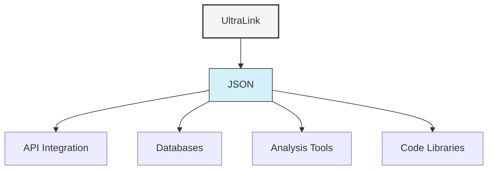

# JSON Format Guide

The JSON (JavaScript Object Notation) format is a lightweight data interchange format that's easy for humans to read and write and easy for machines to parse and generate. UltraLink provides robust JSON export capabilities for data exchange and system integration.



## Overview

The JSON format provides a complete representation of the UltraLink data in a widely-supported format, making it ideal for:

1. Data exchange between systems
2. API integration
3. Backup and persistence
4. Data processing in programming languages
5. Import into database systems

## Usage

### Basic Export

```javascript
// Export to JSON object
const json = ultralink.toJSON();

// Export to file
await ultralink.toJSON('ultralink-data.json');

// Convert to string for storage or transmission
const jsonString = JSON.stringify(json, null, 2);
```

### Export with Options

```javascript
// Export with detailed options
const jsonWithOptions = await ultralink.toJSON({
  includeVectors: true,        // Include vector embeddings
  includeHistory: true,        // Include historical versions
  includeMetadata: true,       // Include metadata
  prettyPrint: true,           // Format with indentation
  entityTypes: ['person', 'organization'],  // Filter by entity type
  relationshipTypes: ['works_at', 'knows'], // Filter by relationship type
  filename: 'filtered-data.json'            // Output filename
});
```

## Output Structure

The JSON output includes entities and their relationships:

```json
{
  "entities": [
    {
      "id": "saguaro",
      "type": "organism",
      "attributes": {
        "name": "Saguaro Cactus",
        "scientificName": "Carnegiea gigantea",
        "height": "15-50 feet",
        "lifespan": "150-200 years"
      },
      "metadata": {
        "created": "2023-06-15T10:30:00Z",
        "modified": "2023-06-15T10:30:00Z"
      },
      "vector": [0.1, 0.2, 0.3, ...],  // Only if includeVectors is true
      "history": [...]                 // Only if includeHistory is true
    },
    // More entities...
  ],
  "relationships": [
    {
      "source": "saguaro",
      "target": "aridity",
      "type": "adapts_to",
      "attributes": {
        "mechanism": "Water storage in stem",
        "efficiency": 0.95
      },
      "metadata": {
        "created": "2023-06-15T10:30:00Z",
        "modified": "2023-06-15T10:30:00Z"
      },
      "history": [...]  // Only if includeHistory is true
    },
    // More relationships...
  ],
  "metadata": {
    "name": "Desert Ecosystem",
    "description": "A model of a desert ecosystem and its relationships",
    "version": "1.0.0",
    "created": "2023-06-15T10:30:00Z",
    "modified": "2023-06-16T15:45:00Z",
    "entityCount": 56,
    "relationshipCount": 218
  }
}
```

## Options Reference

| Option | Type | Default | Description |
|--------|------|---------|-------------|
| `filename` | string | null | Output filename (if null, returns the JSON object) |
| `prettyPrint` | boolean | true | Format the JSON with indentation for readability |
| `includeVectors` | boolean | false | Include vector embeddings in the output |
| `includeHistory` | boolean | false | Include historical versions of entities and relationships |
| `includeMetadata` | boolean | true | Include metadata about entities and relationships |
| `entityTypes` | string[] | all | Filter entities by type |
| `relationshipTypes` | string[] | all | Filter relationships by type |
| `depth` | number | -1 | Recursion depth for relationship traversal (-1 = unlimited) |
| `startNodes` | string[] | all | Starting node IDs for subgraph extraction |
| `maxSize` | number | -1 | Maximum size of output in entities (-1 = unlimited) |

## Use Cases

### API Integration

```javascript
// Create an API endpoint that serves UltraLink data
app.get('/api/knowledge', async (req, res) => {
  const ultralink = await loadUltraLink();
  
  // Extract query parameters
  const { types, depth, start } = req.query;
  
  // Generate JSON with request-specific filters
  const json = await ultralink.toJSON({
    entityTypes: types ? types.split(',') : undefined,
    depth: depth ? parseInt(depth) : 1,
    startNodes: start ? [start] : undefined
  });
  
  res.json(json);
});
```

### Data Import into Database

```javascript
// Export UltraLink data and import into MongoDB
const json = await ultralink.toJSON({
  includeMetadata: true,
  includeVectors: false
});

// Process for MongoDB
const processedData = {
  entities: json.entities.map(entity => ({
    _id: entity.id,
    ...entity
  })),
  relationships: json.relationships.map(rel => ({
    _id: `${rel.source}_${rel.type}_${rel.target}`,
    ...rel
  }))
};

// Insert into MongoDB
await mongoClient.db('knowledge').collection('entities').insertMany(processedData.entities);
await mongoClient.db('knowledge').collection('relationships').insertMany(processedData.relationships);
```

### Cross-System Transfer

```javascript
// Export from one UltraLink instance
const jsonData = await sourceUltraLink.toJSON({
  includeVectors: true,
  includeHistory: true
});

// Import into another instance
await targetUltraLink.fromJSON(jsonData);
```

## JSON Schema

UltraLink provides a JSON Schema that describes the structure of the exported JSON:

```javascript
// Get the JSON Schema
const schema = UltraLink.getJSONSchema();

// Validate export against schema
const validate = require('ajv');
const validator = new validate();
const valid = validator.validate(schema, jsonData);

if (!valid) {
  console.error('Invalid JSON data:', validator.errors);
}
```

The JSON Schema is available in the `/schemas/ultralink-json.schema.json` file in the UltraLink package.

## Advanced Usage

### Streaming Large Data

For very large knowledge graphs, UltraLink supports streaming JSON output:

```javascript
// Create a writable stream
const fs = require('fs');
const outputStream = fs.createWriteStream('large-graph.json');

// Stream JSON output
await ultralink.toJSONStream(outputStream, {
  batchSize: 1000,  // Process entities in batches of 1000
  includeVectors: false
});
```

### Custom JSON Transformation

You can provide a custom transformation function:

```javascript
// Custom transformation
await ultralink.toJSON({
  filename: 'custom-format.json',
  transform: (data) => {
    // Custom transformation logic
    return {
      nodes: data.entities.map(e => ({
        id: e.id,
        label: e.attributes.name || e.id,
        type: e.type,
        properties: e.attributes
      })),
      edges: data.relationships.map(r => ({
        from: r.source,
        to: r.target,
        label: r.type,
        properties: r.attributes
      }))
    };
  }
});
```

## For Autonomous Agents

JSON is particularly well-suited for use with autonomous agents:

```javascript
class KnowledgeAgent {
  constructor() {
    this.knowledgeBase = new UltraLink();
    // Initialize agent...
  }
  
  async saveState() {
    // Save agent state to JSON
    return await this.knowledgeBase.toJSON({
      filename: `agent-state-${Date.now()}.json`,
      includeVectors: true,
      includeHistory: true
    });
  }
  
  async loadState(jsonFile) {
    // Load agent state from JSON
    await this.knowledgeBase.fromJSON(jsonFile);
  }
  
  async shareKnowledge(targetAgent, filter = {}) {
    // Extract relevant knowledge
    const knowledge = await this.knowledgeBase.toJSON({
      entityTypes: filter.entityTypes,
      relationshipTypes: filter.relationshipTypes,
      startNodes: filter.startNodes,
      depth: filter.depth || 1
    });
    
    // Share with target agent
    await targetAgent.receiveKnowledge(knowledge);
  }
  
  async receiveKnowledge(knowledge) {
    // Merge received knowledge into the agent's knowledge base
    await this.knowledgeBase.mergeJSON(knowledge, {
      onConflict: 'newer'  // Use newer values on conflict
    });
  }
}
```

## Conclusion

The JSON format provides a flexible and widely compatible way to export UltraLink data for various use cases. Its simplicity and universal support make it ideal for system integration, data exchange, and programmatic access to knowledge graph data.

For more information on other export formats, see the [Rendering Formats Overview](README.md). 