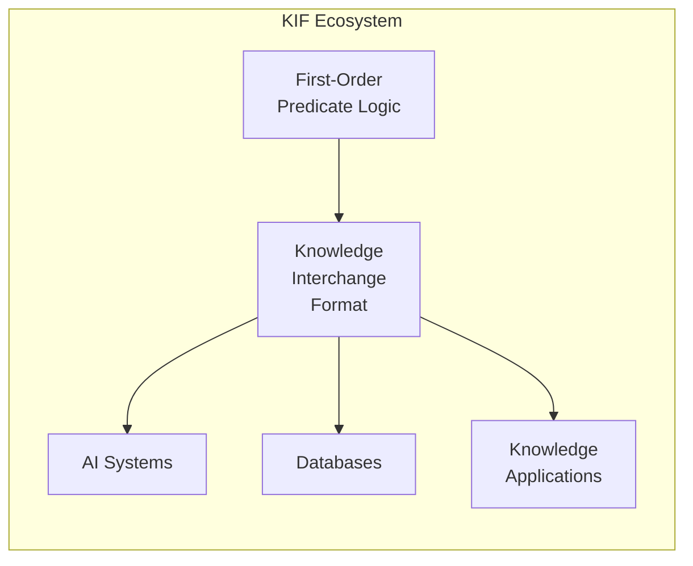
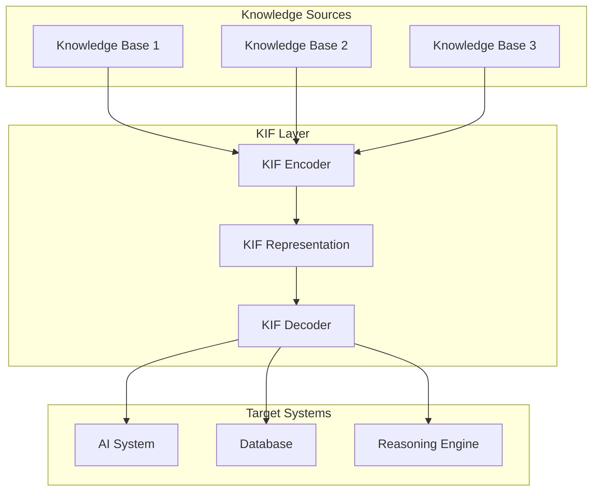
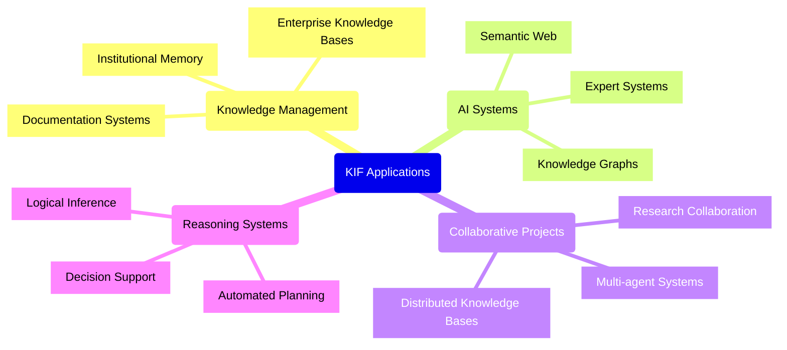
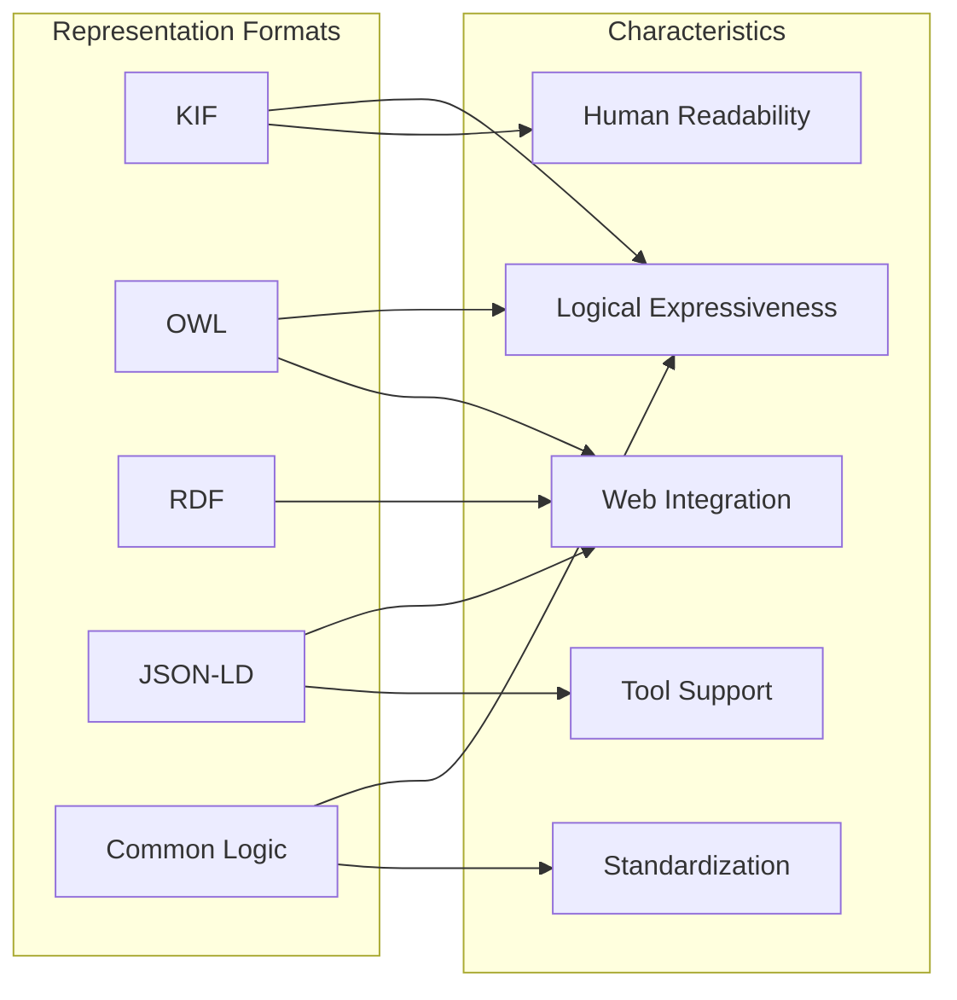
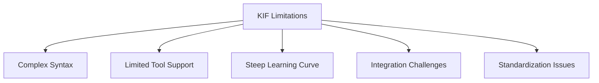
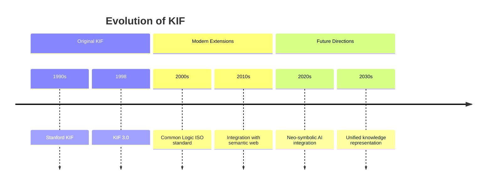

# UltraLink Knowledge Interchange Format (KIF)

## Overview

The Knowledge Interchange Format (KIF) is a formal language designed for the interchange of knowledge among disparate computer systems. Developed by the Stanford AI Lab, KIF enables standardized representation and sharing of complex information across different AI systems, databases, and applications, making it a powerful tool for knowledge representation and exchange in UltraLink.



## Key Features and Characteristics

1. **Logical Foundation**: Based on first-order predicate logic, allowing representation of complex relationships, rules, and logical expressions
2. **Expressiveness**: Highly expressive language capable of representing facts, rules, definitions, and meta-knowledge
3. **Well-Defined Semantics**: Clear syntax and semantics for unambiguous interpretation
4. **Interoperability**: Enables knowledge exchange between different systems without custom translation mechanisms
5. **Human Readability**: Syntax designed to be both machine-processable and human-readable

## Architecture



## Implementation

### 1. Syntax and Structure

KIF's syntax is based on first-order predicate logic and influenced by LISP. Key syntactic elements include:

```lisp
;; Simple fact assertion
(instance Socrates Human)

;; Relation definition
(defrelation ancestor (?x ?y) :=
  (or (parent ?x ?y)
      (and (parent ?x ?z) (ancestor ?z ?y))))

;; Function definition
(deffunction father (?x) := 
  (the ?y (and (parent ?y ?x) (male ?y))))

;; Rule with quantifiers
(forall (?x) 
  (=> (Human ?x) (Mortal ?x)))

;; Meta-knowledge
(believes John (married Mary Bill))
```

### 2. Term Types

KIF uses various types of terms to denote objects:

```typescript
type KIFTerm = 
  | IndividualVariable   // Words beginning with "?", e.g., ?x
  | Constant             // Words that are neither variables nor operators
  | FunctionTerm         // (function arg1 arg2 ...)
  | ListTerm             // (listof term1 term2 ...)
  | Quotation            // (quote expression) or 'expression
  | LogicalTerm          // Using 'if' and 'cond' operators
```

### 3. Sentence Types

KIF sentences express facts and relationships:

```typescript
type KIFSentence =
  | RelationalSentence   // (relation arg1 arg2 ...)
  | Equation             // (= term1 term2)
  | Inequality           // (/= term1 term2)
  | LogicalSentence      // Using connectives like 'and', 'or', 'not'
  | QuantifiedSentence   // Using 'forall' and 'exists'
  | DefinitionSentence   // defobject, deffunction, defrelation
```

### 4. UltraLink Integration

UltraLink provides comprehensive support for KIF, allowing for knowledge representation and exchange in this powerful format:

```javascript
// Export UltraLink data to KIF format
const kifOutput = ultralink.toKIF({
  includeMetaKnowledge: true,
  includeFunctions: true,
  includeRules: true
});

// Import knowledge from KIF format
const importedKnowledge = await ultralink.fromKIF({
  source: kifContent,
  validateLogic: true
});

// Query knowledge using KIF expressions
const result = ultralink.queryKIF('(and (Human ?x) (teaches ?x AI))');
```

### 5. KIF Interpreter

The KIF interpreter in UltraLink processes KIF expressions and integrates them with the UltraLink data model:

```typescript
class KIFInterpreter {
  constructor(options = {}) {
    this.environment = new Map();
    this.functions = new Map();
    this.relations = new Map();
    this.axioms = [];
    this.options = options;
  }

  parse(kifString) {
    const expressions = this.tokenize(kifString);
    return this.evaluateExpressions(expressions);
  }

  evaluateExpressions(expressions) {
    const results = [];
    for (const expr of expressions) {
      results.push(this.evaluate(expr));
    }
    return results;
  }

  evaluate(expression) {
    if (this.isVariable(expression)) {
      return this.lookupVariable(expression);
    } else if (this.isConstant(expression)) {
      return expression;
    } else if (Array.isArray(expression)) {
      const [operator, ...args] = expression;
      return this.applyOperator(operator, args);
    }
    return null;
  }

  // Additional methods for specific KIF operations
}
```

## Applications

KIF has been applied in numerous areas where knowledge representation and exchange are critical:



### 1. Knowledge Management

KIF provides a robust framework for encoding and managing complex knowledge:

```javascript
// Define organizational knowledge structure
const organizationalKnowledge = ultralink.createKIFBase(`
  (defrelation reports-to (?employee ?manager)
    :documentation "Indicates reporting relationship in organization")
  
  (defrelation leads (?manager ?project)
    :documentation "Indicates leadership responsibility")
  
  (defrelation skill (?employee ?skill-type ?level)
    :documentation "Records skill proficiency of employees")
  
  ;; Facts about the organization
  (reports-to Alice Bob)
  (reports-to Carol Bob)
  (reports-to David Eve)
  
  (leads Bob Project-X)
  (leads Eve Project-Y)
  
  (skill Alice Programming Expert)
  (skill Bob Management Senior)
  (skill Carol Design Intermediate)
`);

// Query for all employees with programming skills
const programmers = organizationalKnowledge.query(`
  (skill ?employee Programming ?level)
`);
```

### 2. AI and Machine Learning

KIF enables integration of symbolic knowledge with machine learning systems:

```javascript
// Hybrid KIF + ML system in UltraLink
const hybridSystem = ultralink.createHybridSystem({
  symbolicKnowledge: kifContent,
  neuralModel: 'path/to/neural/model',
  integration: 'neuro-symbolic'
});

// Use symbolic rules to guide ML inference
const guidedInference = hybridSystem.infer({
  input: inputData,
  constraints: `
    (forall (?x) 
      (=> (and (Patient ?x) (has-symptom ?x Fever))
          (possible-condition ?x Infection)))
  `
});
```

### 3. Interoperability

KIF facilitates knowledge exchange between different systems and formats:

```javascript
// Convert between KIF and other formats
const owlOutput = ultralink.convertFormat({
  source: kifContent,
  sourceFormat: 'kif',
  targetFormat: 'owl'
});

const jsonLdOutput = ultralink.convertFormat({
  source: kifContent,
  sourceFormat: 'kif',
  targetFormat: 'jsonld'
});
```

## Comparison with Other Formats

KIF can be compared with other knowledge representation formats:



### Format Comparison

| Feature | KIF | OWL | RDF | JSON-LD | Common Logic |
|---------|-----|-----|-----|---------|--------------|
| Logical Foundation | First-order logic | Description logic | Triple model | Linked data | First-order logic |
| Expressiveness | Very high | High | Medium | Medium | Very high |
| Web Integration | Limited | High | High | High | Limited |
| Tool Support | Medium | High | High | High | Limited |
| Learning Curve | Steep | Moderate | Gentle | Gentle | Steep |
| Standardization | De facto | W3C | W3C | W3C | ISO |

## Implementation and Tools

KIF has been implemented in various projects and tools:

### 1. Ontolingua

The Ontolingua system uses KIF for ontology development and translation:

```javascript
// UltraLink integration with Ontolingua-style ontologies
const ontology = ultralink.importOntology({
  source: 'path/to/ontology.kif',
  format: 'ontolingua',
  mapping: {
    classes: 'entities',
    relations: 'relationships',
    axioms: 'rules'
  }
});
```

### 2. Cyc Project

The Cyc project uses KIF-like representations for its massive knowledge base:

```javascript
// UltraLink integration with Cyc knowledge
const cycKnowledge = ultralink.importCycKnowledge({
  source: cycContent,
  version: 'OpenCyc',
  mapToUltraLink: true
});

// Apply Cyc inference methods
const inferences = cycKnowledge.inferAll({
  context: 'HumanActivities',
  maxDepth: 3
});
```

### 3. SUMO (Suggested Upper Merged Ontology)

SUMO uses a variant of KIF called SUO-KIF:

```javascript
// Import SUMO ontology into UltraLink
const sumo = ultralink.importSUMO({
  modules: ['Merge', 'Mid-level-ontology', 'Economy'],
  format: 'suo-kif'
});

// Map UltraLink entities to SUMO concepts
ultralink.mapToSUMO({
  entityMap: {
    'person': 'Human',
    'company': 'Corporation',
    'product': 'Artifact'
  },
  relationMap: {
    'works-for': 'employs',
    'creates': 'authors'
  }
});
```

## Limitations and Future Directions

Despite its comprehensive design, KIF faces some challenges:

### 1. Limitations



1. **Complexity**: The high expressiveness of KIF makes it complex to implement and use effectively
2. **Reasoning Support**: Full reasoning support is challenging due to the expressiveness
3. **Integration**: Integration with modern web technologies can be difficult
4. **Learning Curve**: Steep learning curve for users not familiar with formal logic
5. **Standardization**: Lacks formal international standardization

### 2. Future Directions



Future directions for KIF include:

1. **Integration with modern AI**: Combining KIF's logical representation with neural approaches
2. **Simplified dialects**: Developing more accessible subsets of KIF for broader adoption
3. **Web integration**: Better tooling for integrating KIF with web technologies
4. **Formalized standards**: Pushing for formal standardization of modern KIF variants
5. **Knowledge graph integration**: Tighter integration with knowledge graph technologies

## UltraLink KIF Support

UltraLink provides comprehensive support for KIF through its knowledge representation system:

```javascript
// Define knowledge using KIF syntax
ultralink.defineKnowledge(`
  ;; Define relationships
  (defrelation contains (?x ?y)
    :documentation "Entity x contains entity y"
    :properties (transitive))
  
  (defrelation causes (?x ?y)
    :documentation "Entity x causes entity y")
  
  ;; Define rules
  (=> (and (contains ?x ?y) (contains ?y ?z))
      (contains ?x ?z))
      
  (=> (and (causes ?x ?y) (causes ?y ?z))
      (causes ?x ?z))
  
  ;; Facts about the domain
  (contains System Module)
  (contains Module Component)
  (causes ComponentFailure ModuleFailure)
  (causes ModuleFailure SystemFailure)
`);

// Query using KIF
const results = ultralink.queryKnowledge(`
  (causes ?what SystemFailure)
`);

// Export to KIF
const kifExport = ultralink.toKIF({
  prettyPrint: true,
  includeDocumentation: true
});
```

## Best Practices

### 1. Knowledge Modeling

- Start with core concepts and relations
- Define clear semantics for predicates
- Organize knowledge hierarchically
- Document relations and rules
- Use consistent naming conventions

### 2. Interoperability

- Stick to well-supported KIF subsets when exchanging with other systems
- Provide mappings to common ontologies
- Test interchange with target systems
- Include metadata about knowledge representation choices

### 3. Performance

- Break complex axioms into simpler components
- Limit the depth of nested expressions
- Consider adding control knowledge to guide reasoning
- Profile and optimize performance-critical sections
- Cache common inference results

### 4. Maintainability

- Document knowledge sources
- Version knowledge bases
- Implement validation rules
- Develop unit tests for knowledge components
- Build visualization tools for knowledge exploration

## Conclusion

Knowledge Interchange Format (KIF) provides a powerful mechanism for representing and sharing complex knowledge in UltraLink. While it presents challenges in terms of complexity and learning curve, its logical foundation and expressiveness make it an invaluable tool for knowledge-intensive applications. UltraLink's integration with KIF enables sophisticated knowledge representation, reasoning, and exchange capabilities that complement its existing data modeling strengths.


Citations:
[1] https://www.sapien.io/glossary/definition/knowledge-interchange-format
[2] https://www.w3.org/2000/07/hs78/KIF
[3] https://www.obitko.com/tutorials/ontologies-semantic-web/knowledge-interchange-format.html
[4] http://www-ksl.stanford.edu/knowledge-sharing/kif/
[5] https://www.autoblocks.ai/glossary/knowledge-interchange-format
[6] https://klu.ai/glossary/knowledge-interchange-format
[7] https://en.wikipedia.org/wiki/Knowledge_Interchange_Format
[8] https://ojs.aaai.org/aimagazine/index.php/aimagazine/article/view/903/821
[9] https://arxiv.org/abs/2403.10304
[10] https://research.cs.umbc.edu/kif/
[11] https://jmvidal.cse.sc.edu/talks/agentcommunication/kif.html
[12] https://citeseerx.ist.psu.edu/document?repid=rep1&type=pdf&doi=b20c866025b85f165557235a68143c42d53fa70f
[13] http://www.jfsowa.com/ikl/KIFdpans.htm
[14] https://www.opentrain.ai/glossary/knowledge-interchange-format-kif
[15] http://www-ksl.stanford.edu/knowledge-sharing/papers/kif.ps
[16] https://www.researchgate.net/publication/2419061_Knowledge_Interchange_Format_Version_30_Reference_Manual
[17] http://www.w3c.hu/forditasok/RDF/cached/HayesMenzel-SKIF-IJCAI2001.pdf
[18] https://ojs.aaai.org/aimagazine/index.php/aimagazine/article/view/903
[19] https://typeset.io/topics/knowledge-interchange-format-1lw9ijtz
[20] https://github.com/kif-framework/KIF
[21] https://citeseerx.ist.psu.edu/document?repid=rep1&type=pdf&doi=9e382392a6702a8a71823fdc2abcc7e2964e9cbb
[22] https://dl.acm.org/doi/10.1609/aimag.v12i3.903
[23] https://www.researchgate.net/publication/339404620_A_Knowledge_Interchange_Format_KIF_for_Robots_in_Cloud
[24] https://x.com/kifleswing
[25] http://www.fipa.org/specs/fipa00010/XC00010B.html
[26] https://github.com/kamerlinlab/KIF


Knowledge Interchange Format (KIF) is a formal language designed for representing and sharing knowledge among different computer systems. Its syntax and semantics are carefully defined to ensure unambiguous interpretation and facilitate interoperability. Here are some technical details regarding KIF syntax and semantics:

## Syntax

KIF's syntax is based on first-order predicate logic and is influenced by LISP. Key syntactic elements include:

**Terms**: KIF uses various types of terms to denote objects:

1. Individual variables: Words beginning with "?", e.g., ?x, ?The-Murderer[3]
2. Constants: Words that are neither variables nor operators[3]
3. Function terms: ( * [])[3]
4. List terms: (listof * [])[3]
5. Quotations: (quote ) or '[4]
6. Logical terms: Using 'if' and 'cond' operators[4]

**Sentences**: KIF sentences express facts about the world:

1. Relational sentences: (relation-name arg1 arg2 ...)[4]
2. Equations: (= term1 term2)[4]
3. Inequalities: (/= term1 term2)[4]
4. Logical sentences: Using connectives like 'and', 'or', 'not'[4]
5. Quantified sentences: Using 'forall' and 'exists'[4]

**Definitions**: KIF allows defining new terms:

1. Object definitions: (defobject ...)[4]
2. Function definitions: (deffunction ...)[4]
3. Relation definitions: (defrelation ...)[4]

## Semantics

KIF's semantics are declarative, focusing on describing facts rather than processes:

1. **Logical Foundation**: Based on first-order predicate logic, allowing representation of complex relationships and rules[1][5]

2. **Expressiveness**: Can represent facts, rules, definitions, and meta-knowledge[5]

3. **Interpretation**: KIF expressions are interpreted under a conceptualization, which includes a universe of discourse, functions, and relations[7]

4. **Functional Terms**: Semantics of function terms are defined as:
   SIV((fn term1 ... termn)) = I(fn)[SIV(term1) ... SIV(termn)][3]

5. **List Terms**: Interpreted as ordered sequences:
   SIV((listof term1 ... termn)) = [3]

6. **Logical Operators**: KIF includes standard logical operators with their usual first-order logic semantics[4]

7. **Quantifiers**: Supports universal and existential quantification[4]

8. **Non-monotonic Reasoning**: KIF allows for the representation of default rules and exceptions[2]

9. **Meta-Knowledge**: Supports representation of knowledge about knowledge representation[2]

KIF's well-defined syntax and semantics ensure that knowledge represented in KIF can be accurately interpreted and processed by different systems, making it a powerful tool for knowledge interchange in artificial intelligence and knowledge-based systems[5].

Citations:
[1] https://www.obitko.com/tutorials/ontologies-semantic-web/knowledge-interchange-format.html
[2] https://en.wikipedia.org/wiki/Knowledge_Interchange_Format
[3] https://courses.cs.umbc.edu/771/current/presentations/kif.pdf
[4] http://www.fipa.org/specs/fipa00010/XC00010B.html
[5] https://www.sapien.io/glossary/definition/knowledge-interchange-format
[6] https://www.autoblocks.ai/glossary/knowledge-interchange-format
[7] https://citeseerx.ist.psu.edu/document?repid=rep1&type=pdf&doi=b20c866025b85f165557235a68143c42d53fa70f
[8] https://www.researchgate.net/publication/2419061_Knowledge_Interchange_Format_Version_30_Reference_Manual
[9] https://www.opentrain.ai/glossary/knowledge-interchange-format-kif
[10] https://www.w3.org/2000/07/hs78/KIF
[11] http://www.jfsowa.com/ikl/KIFdpans.htm
[12] https://klu.ai/glossary/knowledge-interchange-format
[13] https://github.com/kif-framework/KIF/blob/master/README.md
[14] http://www-ksl.stanford.edu/knowledge-sharing/papers/kif.ps
[15] http://www-ksl.stanford.edu/knowledge-sharing/kif/
[16] https://research.cs.umbc.edu/kif/
[17] https://ojs.aaai.org/aimagazine/index.php/aimagazine/article/view/903/821
[18] http://www.w3c.hu/forditasok/RDF/cached/HayesMenzel-SKIF-IJCAI2001.pdf
