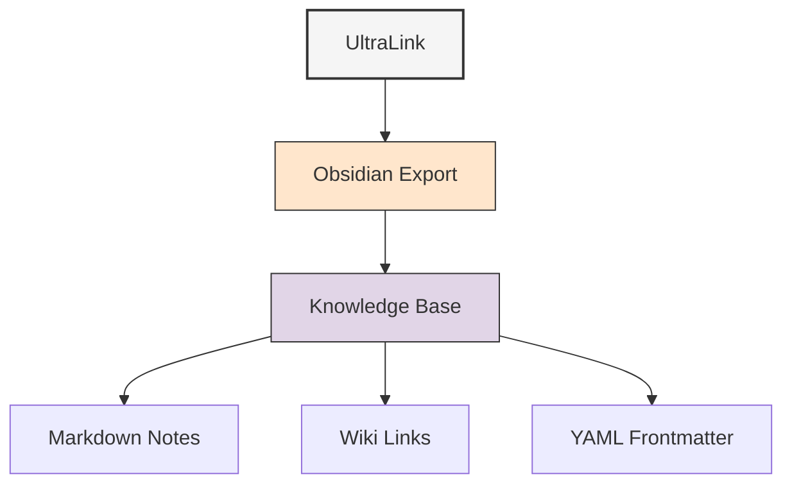

# Obsidian Format Guide

The Obsidian export format generates a set of interconnected Markdown files with wiki-links, designed for use with [Obsidian](https://obsidian.md/) and similar knowledge management tools. This format transforms your UltraLink knowledge graph into a navigable personal knowledge base.



## Overview

UltraLink's Obsidian export converts each entity in your knowledge graph into a standalone Markdown file with:

1. YAML frontmatter containing metadata and attributes
2. Wiki-style links to related entities
3. Structured sections for attributes, relationships, and backlinks
4. Optional embedded visualizations and data

This format is ideal for:

- Personal knowledge management
- Research note organization
- Documentation systems
- Study and learning materials
- Project documentation

## Usage

### Basic Export

```javascript
// Export to Obsidian format
await ultralink.toObsidian('./knowledge-base');

// With simple options
await ultralink.toObsidian({
  directory: './knowledge-base',
  includeBacklinks: true
});
```

### Export with Detailed Options

```javascript
// Export with all options
await ultralink.toObsidian({
  directory: './obsidian-vault',
  includeBacklinks: true,
  includeMetadata: true,
  includeAttributes: true,
  includeRelationships: true,
  includeVisualization: true,
  entityTypes: ['concept', 'person', 'project'],
  relationshipTypes: ['related_to', 'created_by', 'part_of'],
  fileNameFormat: '{{id}}',
  templateFile: './templates/entity-template.md',
  imageDirectory: './assets/images',
  addTags: true
});
```

## Output Structure

Each entity becomes a Markdown file with frontmatter, attributes, and relationships:

```markdown
---
id: saguaro
type: organism
created: 2023-06-15T10:30:00Z
modified: 2023-06-15T10:30:00Z
tags: organism, desert, plant
---

# Saguaro Cactus

**Type**: organism
**ID**: saguaro

## Attributes

- **scientificName**: Carnegiea gigantea
- **height**: 15-50 feet
- **lifespan**: 150-200 years

## Relationships

### Adapts To

- [[aridity|Aridity]] (mechanism: Water storage in stem, efficiency: 0.95)

### Provides Habitat For

- [[gila-woodpecker|Gila Woodpecker]]
- [[cactus-wren|Cactus Wren]]

## Backlinks

- [[desert-ecosystem|Desert Ecosystem]] (contains)
- [[sonoran-desert|Sonoran Desert]] (native_to)
```

## Folder Structure

The export creates a well-organized folder structure:

```
obsidian-vault/
├── index.md                   # Main index/overview file
├── organisms/                 # Group by entity type (optional)
│   ├── saguaro.md
│   ├── kangaroo-rat.md
│   └── cactus-wren.md
├── environmental_factors/
│   ├── aridity.md
│   ├── temperature.md
│   └── precipitation.md
├── locations/
│   ├── sonoran-desert.md
│   └── mojave-desert.md
├── .obsidian/                 # Obsidian configuration
│   ├── app.json
│   ├── appearance.json
│   ├── graph.json             # Graph view settings
│   └── plugins/
└── assets/                    # Images and other assets
    ├── images/
    │   ├── saguaro.jpg
    │   └── desert-graph.png
    └── data/
        └── measurements.csv
```

## Options Reference

| Option | Type | Default | Description |
|--------|------|---------|-------------|
| `directory` | string | './output/obsidian' | Output directory for the Obsidian vault |
| `includeBacklinks` | boolean | true | Include backlinks section in each note |
| `includeMetadata` | boolean | true | Include created/modified timestamps in frontmatter |
| `includeAttributes` | boolean | true | Include entity attributes section |
| `includeRelationships` | boolean | true | Include relationships section |
| `includeVisualization` | boolean | false | Include visualization of local graph |
| `entityTypes` | string[] | all | Filter entities by type |
| `relationshipTypes` | string[] | all | Filter relationships by type |
| `fileNameFormat` | string | '{{id}}' | Template for file naming (supports attributes) |
| `folderStructure` | string | 'byType' | Folder organization ('flat', 'byType', 'custom') |
| `templateFile` | string | null | Custom template for generating notes |
| `imageDirectory` | string | './assets/images' | Directory for images within vault |
| `addTags` | boolean | true | Add tags to frontmatter based on type and attributes |
| `customTagging` | object | null | Custom rules for tag generation |
| `createObsidianConfig` | boolean | true | Create default .obsidian configuration |
| `linkFormat` | string | 'wiki' | Link format ('wiki', 'markdown', 'html') |
| `defaultTemplate` | string | see below | Default template if no template file provided |

## Template System

UltraLink's Obsidian export uses a template system for customizing notes:

```javascript
// Custom template example
await ultralink.toObsidian({
  directory: './knowledge-base',
  defaultTemplate: `---
id: {{id}}
type: {{type}}
created: {{created}}
modified: {{modified}}
tags: {{tags}}
---

# {{name}}

> {{attributes.description}}

## Properties

{{#each attributes}}
- **{{@key}}**: {{this}}
{{/each}}

## Connections

{{#each relationships}}
### {{@key}}

{{#each this}}
- [[{{target}}]] {{#if attributes}}({{#each attributes}}{{@key}}: {{this}}{{#unless @last}}, {{/unless}}{{/each}}){{/if}}
{{/each}}

{{/each}}

## Backlinks

{{#each backlinks}}
- [[{{source}}]] ({{type}})
{{/each}}

*Last updated: {{modified}}*`
});
```

## Use Cases

### Knowledge Management

Create a personal knowledge base from UltraLink data:

```javascript
// Export research notes to Obsidian
await ultralink.toObsidian({
  directory: './research-notes',
  includeBacklinks: true,
  addTags: true,
  customTagging: {
    priority: (value) => `priority-${value}`,
    status: (value) => value,
    domain: (values) => values.map(v => `domain-${v}`)
  },
  fileNameFormat: '{{attributes.date}}-{{id}}'
});
```

### Documentation System

Create a documentation system with UltraLink and Obsidian:

```javascript
// Export as technical documentation
await ultralink.toObsidian({
  directory: './documentation',
  templateFile: './templates/documentation-template.md',
  folderStructure: 'custom',
  folderMapping: {
    'component': 'components',
    'api': 'api-reference',
    'guide': 'guides',
    'concept': 'concepts'
  },
  fileNameFormat: '{{attributes.order}}-{{attributes.title}}',
  linkFormat: 'markdown',
  createObsidianConfig: true,
  obsidianConfig: {
    theme: 'moonstone',
    enabledPlugins: ['graph-analysis', 'dataview']
  }
});
```

### Study Materials

Create interconnected study notes:

```javascript
// Export study materials
await ultralink.toObsidian({
  directory: './study-materials',
  includeVisualization: true,
  templateFile: './templates/study-note-template.md',
  folderStructure: 'byType',
  extraFiles: [
    {
      filename: 'INDEX.md',
      content: '# Study Materials\n\n## Main Topics\n\n{{#each types.topic}}* [[{{this}}]]\n{{/each}}'
    },
    {
      filename: 'How-to-use.md',
      content: '# How to Use These Study Notes\n\nThese notes are designed to be interconnected...'
    }
  ]
});
```

## Integration with Obsidian Features

### Graph View

UltraLink's Obsidian export is optimized for Obsidian's graph view, preserving the knowledge graph structure:

```javascript
// Configure graph view settings
await ultralink.toObsidian({
  directory: './knowledge-base',
  createObsidianConfig: true,
  obsidianConfig: {
    graph: {
      colors: {
        'person': '#4285F4',
        'concept': '#EA4335',
        'project': '#FBBC05'
      },
      forceSetting: {
        centerStrength: 0.4,
        linkStrength: 0.7,
        linkDistance: 50
      },
      showOrphans: false
    }
  }
});
```

### Plugin Support

Export with support for popular Obsidian plugins:

```javascript
// Add Dataview-compatible frontmatter
await ultralink.toObsidian({
  directory: './knowledge-base',
  extendFrontmatter: (entity) => ({
    aliases: [entity.attributes.name, entity.attributes.abbreviation],
    dataview: true,
    importance: entity.attributes.priority || 'medium',
    status: entity.attributes.status || 'active',
    related: entity.relationships.related_to?.map(r => r.target) || []
  })
});
```

## For Autonomous Agents

Autonomous agents can use Obsidian export to create human-readable knowledge bases:

```javascript
class ResearchAgent {
  constructor() {
    this.knowledgeBase = new UltraLink();
    // Initialize agent
  }
  
  async addResearchFind(topic, content, sources) {
    // Add a research finding to the knowledge base
    const id = `find-${Date.now()}`;
    await this.knowledgeBase.addEntity(id, 'finding', {
      topic,
      content,
      sources,
      date: new Date().toISOString(),
      confidence: this.calculateConfidence(sources)
    });
    
    // Link to related topics
    const relatedTopics = await this.knowledgeBase.findSimilar(content, {
      entityTypes: ['topic'],
      minSimilarity: 0.7,
      limit: 3
    });
    
    for (const topic of relatedTopics) {
      await this.knowledgeBase.addLink(id, topic.id, 'related_to', {
        similarity: topic.similarity,
        auto_generated: true
      });
    }
    
    // Generate human-readable research notes
    await this.exportResearchNotes();
  }
  
  async exportResearchNotes() {
    // Create an Obsidian vault of current research
    await this.knowledgeBase.toObsidian({
      directory: './research-notes',
      includeBacklinks: true,
      addTags: true,
      folderStructure: 'byType',
      fileNameFormat: '{{attributes.date}}-{{id}}',
      templateFile: './templates/research-note.md'
    });
  }
}
```

## Best Practices

### Naming and Organization

- **Consistent naming**: Use consistent naming conventions for entities
- **Meaningful IDs**: Create IDs that are both machine-friendly and readable
- **Thoughtful folder structure**: Choose a folder structure that matches your workflow
- **Tagging strategy**: Develop a consistent tagging strategy for easier organization

### Content Formatting

- **Rich templates**: Create templates that make information easy to scan
- **Visual hierarchy**: Use headings and formatting to establish clear visual hierarchy
- **Limited frontmatter**: Include only essential metadata in frontmatter
- **Link context**: Add context to links with link labels and relationship information 

### Knowledge Management

- **Regular exports**: Update your Obsidian vault regularly as your UltraLink data evolves
- **Incremental updates**: When possible, update only changed notes rather than regenerating all
- **Backups**: Keep backups of your customizations before regenerating
- **Version control**: Consider keeping your Obsidian vault in version control (e.g., Git)

## Conclusion

UltraLink's Obsidian export provides a powerful way to transform your structured knowledge graph into an interconnected personal knowledge base. The resulting Markdown files work seamlessly with Obsidian's features, enabling intuitive navigation, visualization, and knowledge management.

For more information on other export formats, see the [Rendering Formats Overview](README.md). 