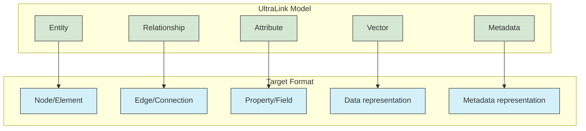

# UltraLink Transformation Patterns

This document outlines patterns and best practices for implementing, testing, and validating format transformations in UltraLink. It serves as a guide for developers working on existing formats or implementing new export formats.


## Core Transformation Framework

UltraLink's transformation system follows a structured approach to ensure consistency and correctness when converting between formats:

### 1. Semantic Mapping

Every transformation starts with a semantic mapping that defines how UltraLink concepts map to the target format:



### 2. Transformation Pipeline

Transformations follow a standard pipeline:

```mermaid
flowchart LR
    Extract[Extract UltraLink Data]
    Filter[Apply Filters]
    Transform[Apply Transformations]
    Format[Format for Target]
    Validate[Validate Output]
    Optimize[Optimize]
    
    Extract --> Filter
    Filter --> Transform
    Transform --> Format
    Format --> Validate
    Validate --> Optimize
    
    style Extract fill:#d5e8d4,stroke:#333,stroke-width:1px
    style Filter fill:#d5e8d4,stroke:#333,stroke-width:1px
    style Transform fill:#d4f1f9,stroke:#333,stroke-width:1px
    style Format fill:#ffe6cc,stroke:#333,stroke-width:1px
    style Validate fill:#fff2cc,stroke:#333,stroke-width:1px
    style Optimize fill:#e1d5e7,stroke:#333,stroke-width:1px
```



## Implementing a New Format Transformer

### Step 1: Define the Format Specification

Create a detailed specification for the format:

```javascript
/**
 * Format Specification for Example Format
 * 
 * @typedef {Object} ExampleFormatSpec
 * @property {string} version - Format version
 * @property {string} encoding - Character encoding
 * @property {Object} nodes - Node definitions
 * @property {Object} edges - Edge definitions
 * @property {Object} properties - Property definitions
 */
```

### Step 2: Create the Exporter Module

Follow this template for creating a new exporter:

```javascript
/**
 * Example Format Exporter
 * Transforms UltraLink data to Example Format
 */
class ExampleFormatExporter {
  /**
   * @param {UltraLink} ultralink - The UltraLink instance
   * @param {Object} options - Export options
   */
  constructor(ultralink, options = {}) {
    this.ultralink = ultralink;
    this.options = {
      prettyPrint: false,
      includeVectors: false,
      includeMetadata: true,
      ...options
    };
  }
  
  /**
   * Main export method
   * @returns {string|Object} The exported data
   */
  export() {
    // 1. Extract entities and relationships
    const entities = Array.from(this.ultralink.entities.values());
    const relationships = this.extractRelationships();
    
    // 2. Apply filters
    const filteredEntities = this.filterEntities(entities);
    const filteredRelationships = this.filterRelationships(relationships);
    
    // 3. Transform to target format
    const output = this.transform(filteredEntities, filteredRelationships);
    
    // 4. Validate output
    this.validate(output);
    
    // 5. Format and return
    return this.formatOutput(output);
  }
  
  /**
   * Extract all relationships from UltraLink
   * @private
   */
  extractRelationships() {
    // Implementation details
  }
  
  /**
   * Apply entity filters
   * @private
   */
  filterEntities(entities) {
    // Implementation details
  }
  
  /**
   * Apply relationship filters
   * @private
   */
  filterRelationships(relationships) {
    // Implementation details
  }
  
  /**
   * Transform to the target format
   * @private
   */
  transform(entities, relationships) {
    // Implementation details
  }
  
  /**
   * Validate the output
   * @private
   */
  validate(output) {
    // Implementation details
  }
  
  /**
   * Format the final output
   * @private
   */
  formatOutput(output) {
    // Implementation details
  }
}

module.exports = ExampleFormatExporter;
```

### Step 3: Integrate with UltraLink Core

Add the exporter to the UltraLink class:

```javascript
/**
 * Export to Example Format
 * @param {Object} options - Export options
 * @returns {string|Object} The exported data
 */
UltraLink.prototype.toExampleFormat = function(options = {}) {
  const exporter = new ExampleFormatExporter(this, options);
  return exporter.export();
};
```

## Testing Format Transformations

### Test Framework

Use this test structure for comprehensive format testing:

```javascript
describe('ExampleFormat Export', () => {
  // Test basic export
  it('should export basic entities and relationships', () => {
    const ul = new UltraLink();
    // Setup test data
    const entity1 = ul.createEntity({ type: 'test', attributes: { name: 'Entity 1' } });
    const entity2 = ul.createEntity({ type: 'test', attributes: { name: 'Entity 2' } });
    ul.createRelationship({ source: entity1.id, target: entity2.id, type: 'test' });
    
    // Perform export
    const result = ul.toExampleFormat();
    
    // Validate output
    expect(result).toBeDefined();
    // Format-specific validation
  });
  
  // Test with various options
  it('should respect export options', () => {
    const ul = new UltraLink();
    // Setup test data
    
    // Test with options
    const result1 = ul.toExampleFormat({ prettyPrint: true });
    const result2 = ul.toExampleFormat({ includeVectors: true });
    
    // Validate options were applied correctly
  });
  
  // Test edge cases
  it('should handle edge cases', () => {
    const ul = new UltraLink();
    // Setup edge case data
    
    // Perform export
    const result = ul.toExampleFormat();
    
    // Validate handling of edge cases
  });
  
  // Test round-trip conversion if applicable
  it('should support round-trip conversion', () => {
    const ul1 = new UltraLink();
    // Setup test data
    
    // Export
    const exported = ul1.toExampleFormat();
    
    // Import back
    const ul2 = new UltraLink();
    ul2.fromExampleFormat(exported);
    
    // Verify data integrity
    // Compare ul1 and ul2 for equality
  });
});
```

### Test Matrix

Create a comprehensive test matrix for your format:

| Test Case | Description | Expected Result |
|-----------|-------------|-----------------|
| Basic export | Entity and relationship | Validates structure |
| Empty graph | No entities/relationships | Valid empty format |
| Large graph | Many entities/relationships | Performance test |
| Special characters | Unicode/special chars | Proper escaping |
| Circular relationships | Entities referencing each other | Handled correctly |
| Missing attributes | Partial entity data | Defaults applied |
| All options | Test each export option | Option applied |
| All entity types | Test different entity types | Type-specific handling |
| All relationship types | Test relationship types | Type-specific handling |

## Validation Patterns

### Schema Validation

Define a schema for your format:

```javascript
const schema = {
  type: 'object',
  required: ['version', 'entities', 'relationships'],
  properties: {
    version: { type: 'string' },
    entities: {
      type: 'array',
      items: {
        type: 'object',
        required: ['id', 'type'],
        properties: {
          id: { type: 'string' },
          type: { type: 'string' },
          attributes: { type: 'object' }
        }
      }
    },
    relationships: {
      type: 'array',
      items: {
        type: 'object',
        required: ['source', 'target', 'type'],
        properties: {
          source: { type: 'string' },
          target: { type: 'string' },
          type: { type: 'string' },
          attributes: { type: 'object' }
        }
      }
    }
  }
};

// In your validate method:
validateWithSchema(output, schema);
```

### Semantic Validation

Validate semantic integrity:

```javascript
validate(output) {
  // Check for entity reference integrity
  const entityIds = new Set(output.entities.map(e => e.id));
  
  for (const rel of output.relationships) {
    if (!entityIds.has(rel.source)) {
      throw new Error(`Relationship references non-existent source entity: ${rel.source}`);
    }
    if (!entityIds.has(rel.target)) {
      throw new Error(`Relationship references non-existent target entity: ${rel.target}`);
    }
  }
  
  // Check for format-specific constraints
  // ...
}
```

## Format-Specific Testing

### File Format Validation

For file-based formats:

```javascript
it('should produce valid file format', async () => {
  const ul = createTestSystem();
  const output = ul.toExampleFormat();
  
  // Write to temp file
  const tempFile = path.join(os.tmpdir(), 'test-output.example');
  fs.writeFileSync(tempFile, output);
  
  // Validate with external tool if available
  const validation = await validateWithExternalTool(tempFile);
  expect(validation.valid).toBe(true);
  
  // Clean up
  fs.unlinkSync(tempFile);
});
```

### Integration Testing

Test integration with target systems:

```javascript
it('should be usable by target system', async () => {
  const ul = createTestSystem();
  const output = ul.toExampleFormat();
  
  // Test with target system library/API
  const targetSystem = new TargetSystemLibrary();
  const result = await targetSystem.load(output);
  
  expect(result.success).toBe(true);
  expect(result.entities.length).toEqual(ul.entities.size);
});
```

## Performance Considerations

### Benchmarking

Benchmark your transformer:

```javascript
it('should handle large datasets efficiently', () => {
  // Create large test dataset
  const ul = createLargeTestSystem(1000, 5000); // 1000 entities, 5000 relationships
  
  // Benchmark
  const start = process.hrtime.bigint();
  const output = ul.toExampleFormat();
  const end = process.hrtime.bigint();
  
  const durationMs = Number(end - start) / 1_000_000;
  console.log(`Export took ${durationMs}ms`);
  
  // Assert performance constraints
  expect(durationMs).toBeLessThan(1000); // Should take less than 1 second
  
  // Check output size
  const size = output.length;
  console.log(`Output size: ${size} bytes`);
});
```

### Optimizations

Common optimization patterns:

```javascript
// Stream processing for large datasets
async *generateEntities() {
  for (const entity of this.ultralink.entities.values()) {
    yield this.transformEntity(entity);
  }
}

// Batched processing
async transformEntitiesInBatches(entities, batchSize = 100) {
  const results = [];
  for (let i = 0; i < entities.length; i += batchSize) {
    const batch = entities.slice(i, i + batchSize);
    const transformed = await Promise.all(batch.map(e => this.transformEntity(e)));
    results.push(...transformed);
  }
  return results;
}
```

## Documentation Template

For each format, create comprehensive documentation using this template:

### Format Overview

- **Purpose**: Why this format exists and its primary use cases
- **Specification**: Link to format specs if applicable
- **Tools & Libraries**: Related tools that work with this format

### Data Model Mapping

- **Entity Mapping**: How entities map to the format's concepts
- **Relationship Mapping**: How relationships are represented
- **Attribute Mapping**: How attributes are handled
- **Vector Mapping**: How vectors are represented if applicable
- **Temporal Mapping**: How temporal aspects are represented

### Usage Examples

- **Basic Export**: Simple export example
- **Advanced Options**: Examples with different options
- **Integration**: How to use the output with other tools

### Format Structure

- **Root Elements**: Documentation of top-level elements
- **Schema Diagram**: Visual representation of the format structure
- **Example Output**: Complete example output for reference

### Semantic Preservation

- Document exactly which UltraLink semantics are preserved
- Note any semantics that can't be represented in this format
- Provide guidance for semantic-preserving transformations

## Implementation Best Practices

1. **Keep transformers modular**: Each format should have its own module
2. **Use consistent naming**: Follow UltraLink naming conventions
3. **Handle errors gracefully**: Provide helpful error messages
4. **Document edge cases**: Note any special handling required
5. **Support streaming for large datasets**: Don't load everything into memory
6. **Include format validation**: Self-validate output before returning
7. **Support configuration options**: Make transformers flexible
8. **Maintain bidirectional support where possible**: Support import if applicable
9. **Follow language/format conventions**: Respect the target format's idioms
10. **Establish format-specific test suites**: Test thoroughly

## Additional Resources

- **Format Specifications**: Links to official format specifications
- **Validation Tools**: Tools to validate format outputs
- **Reference Implementations**: Examples from other systems
- **Performance Testing**: Tools and techniques for performance evaluation
- **Compatibility Matrix**: Compatibility with different versions of target systems

By following these patterns, you'll ensure that UltraLink's transformation capabilities remain robust, extensible, and well-tested. 