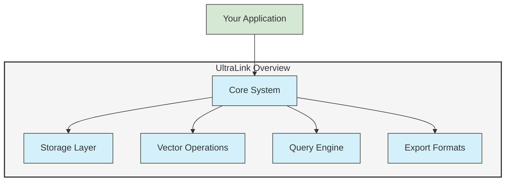
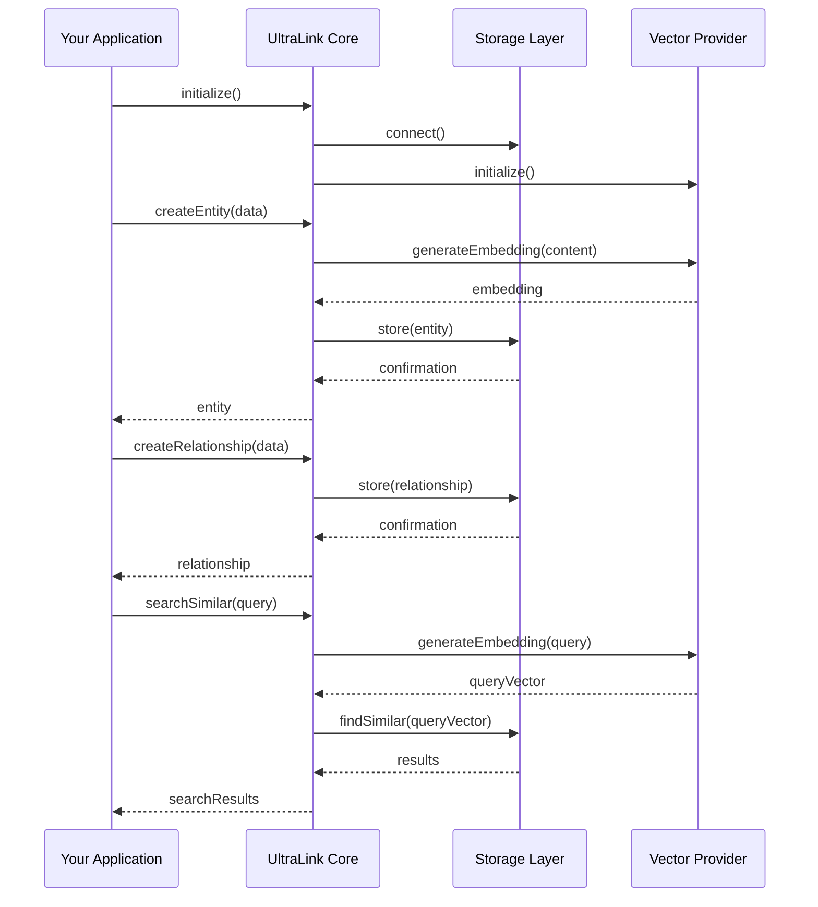

# Getting Started with UltraLink

This guide will help you get started with UltraLink, from installation to your first knowledge graph application.

## What is UltraLink?

UltraLink is a powerful knowledge graph system designed for flexible entity management, relationship mapping, and vector-based semantic search. It provides a unified API for creating, querying, and exporting connected data with advanced features like vector embeddings and LLM integration.



## Installation

### Node.js Installation

```bash
# Install core package with npm
npm install @ultralink/core

# Or with yarn
yarn add @ultralink/core

# Optional components
npm install @ultralink/server @ultralink/vector-openai
```

### Browser Installation

```html
<!-- UMD bundle -->
<script src="https://cdn.ultralink.dev/ultralink.min.js"></script>

<!-- ES modules -->
<script type="module">
  import { UltraLink } from 'https://cdn.ultralink.dev/ultralink.esm.js';
</script>
```

## Quick Start

### Basic Initialization

```typescript
import { UltraLink } from '@ultralink/core';

// Create a new UltraLink instance with in-memory storage
const ultralink = new UltraLink({
  storage: {
    adapter: 'memory'
  }
});

// Initialize UltraLink
await ultralink.initialize();
```

### Creating Entities

```typescript
// Create a document entity
const document = await ultralink.createEntity({
  type: 'document',
  attributes: {
    title: 'Getting Started with UltraLink',
    content: 'UltraLink is a powerful knowledge graph system...',
    tags: ['documentation', 'tutorial']
  }
});

// Create an author entity
const author = await ultralink.createEntity({
  type: 'person',
  attributes: {
    name: 'Jane Smith',
    role: 'Developer Advocate'
  }
});

console.log('Created document:', document.id);
console.log('Created author:', author.id);
```

### Creating Relationships

```typescript
// Connect the author to the document
const relationship = await ultralink.createRelationship({
  source: author.id,
  target: document.id,
  type: 'authored',
  attributes: {
    date: '2023-05-15'
  }
});

console.log('Created relationship:', relationship.id);
```

### Basic Queries

```typescript
// Find all documents
const documents = await ultralink.findEntities({
  type: 'document'
});

// Find entities with specific attributes
const tutorials = await ultralink.findEntities({
  where: {
    'attributes.tags': {
      contains: 'tutorial'
    }
  }
});

// Find all entities authored by Jane
const authoredByJane = await ultralink.query({
  traverse: {
    start: author.id,
    direction: 'outgoing',
    type: 'authored'
  }
});

console.log('Found documents:', documents.length);
console.log('Found tutorials:', tutorials.length);
console.log('Authored by Jane:', authoredByJane.length);
```

## Working with Vectors

### Setup with Vector Provider

```typescript
// Initialize UltraLink with vector capabilities
const ultralink = new UltraLink({
  storage: {
    adapter: 'memory'
  },
  vector: {
    provider: 'openai',
    options: {
      apiKey: process.env.OPENAI_API_KEY,
      model: 'text-embedding-ada-002'
    }
  }
});

await ultralink.initialize();
```

### Generating Embeddings & Semantic Search

```typescript
// Create a document with vector embedding
const content = 'UltraLink provides powerful vector search capabilities';
const vector = await ultralink.generateEmbedding(content);

const document = await ultralink.createEntity({
  type: 'document',
  attributes: {
    title: 'Vector Search',
    content
  },
  vector
});

// Add more documents
await ultralink.createEntity({
  type: 'document',
  attributes: {
    title: 'Knowledge Graphs',
    content: 'Knowledge graphs represent connected information'
  },
  vector: await ultralink.generateEmbedding('Knowledge graphs represent connected information')
});

// Perform semantic search
const results = await ultralink.searchSimilar('How to search with vectors', {
  limit: 5,
  threshold: 0.7
});

console.log('Search results:', results);
```

## Complete Example Application

Here's a complete example that builds a simple knowledge base:

```typescript
import { UltraLink } from '@ultralink/core';
import dotenv from 'dotenv';

// Load environment variables
dotenv.config();

async function main() {
  // Initialize UltraLink
  const ultralink = new UltraLink({
    storage: {
      adapter: 'memory'
    },
    vector: {
      provider: 'openai',
      options: {
        apiKey: process.env.OPENAI_API_KEY,
        model: 'text-embedding-ada-002'
      }
    }
  });

  await ultralink.initialize();
  console.log('UltraLink initialized');

  // Create entities
  const concepts = [
    { title: 'Knowledge Graph', content: 'A knowledge graph is a network of entities and their semantic relationships.' },
    { title: 'Vector Embedding', content: 'Vector embeddings represent semantic meaning in multidimensional space.' },
    { title: 'Semantic Search', content: 'Semantic search uses meaning rather than keywords to find relevant results.' }
  ];

  // Create entities with vectors
  const entityIds = [];
  for (const concept of concepts) {
    const vector = await ultralink.generateEmbedding(concept.content);
    const entity = await ultralink.createEntity({
      type: 'concept',
      attributes: concept,
      vector
    });
    entityIds.push(entity.id);
    console.log(`Created concept: ${concept.title}`);
  }

  // Create relationships
  await ultralink.createRelationship({
    source: entityIds[0], // Knowledge Graph
    target: entityIds[1], // Vector Embedding
    type: 'related_to'
  });

  await ultralink.createRelationship({
    source: entityIds[1], // Vector Embedding
    target: entityIds[2], // Semantic Search
    type: 'enables'
  });

  // Query the graph
  const knowledgeGraph = await ultralink.getEntity(entityIds[0]);
  const relationships = await ultralink.getRelationships(entityIds[0]);

  console.log('Knowledge Graph concept:', knowledgeGraph);
  console.log('Relationships:', relationships);

  // Perform semantic search
  const searchQuery = 'How does meaning get represented in search?';
  const searchResults = await ultralink.searchSimilar(searchQuery, { limit: 2 });

  console.log('Search query:', searchQuery);
  console.log('Search results:', searchResults.map(r => ({
    title: r.entity.attributes.title,
    score: r.score
  })));

  // Clean up
  await ultralink.disconnect();
  console.log('UltraLink disconnected');
}

main().catch(console.error);
```

## Data Flow Diagram



## Configuration Options

UltraLink offers many configuration options depending on your needs:

```typescript
const ultralink = new UltraLink({
  // Core options
  defaultIdGenerator: () => uuidv4(),
  
  // Storage options
  storage: {
    adapter: 'redis',
    options: {
      url: process.env.REDIS_URL,
      prefix: 'ultralink:'
    }
  },
  
  // Vector options
  vector: {
    provider: 'openai',
    dimensions: 1536,
    options: {
      apiKey: process.env.OPENAI_API_KEY,
      model: 'text-embedding-ada-002'
    }
  },
  
  // Cache options
  cache: {
    enabled: true,
    ttl: 3600,
    maxSize: 1000
  },
  
  // Event options
  events: {
    enabled: true,
    asyncEmit: false
  }
});
```

## Available Storage Adapters

UltraLink supports multiple storage options:

| Adapter | Package | Description |
|---------|---------|-------------|
| Memory | Built-in | In-memory storage, not persistent |
| File | `@ultralink/file-storage` | File-based storage for Node.js |
| Redis | `@ultralink/redis` | Redis-based storage |
| MongoDB | `@ultralink/mongodb` | MongoDB storage |
| SQLite | `@ultralink/sqlite` | SQLite storage |
| IndexedDB | `@ultralink/indexeddb` | Browser IndexedDB storage |

## Available Vector Providers

UltraLink supports various vector embedding providers:

| Provider | Package | Description |
|----------|---------|-------------|
| OpenAI | `@ultralink/vector-openai` | OpenAI embeddings API |
| HuggingFace | `@ultralink/vector-huggingface` | HuggingFace embeddings |
| TensorFlow | `@ultralink/vector-tensorflow` | TensorFlow.js local embeddings |
| Onnx | `@ultralink/vector-onnx` | ONNX runtime embeddings |

## Next Steps

Now that you understand the basics of UltraLink, you can explore these topics:

- [Core API Reference](./api/core.md) - Complete API documentation
- [Advanced Queries](./guides/advanced-queries.md) - Learn complex query patterns
- [Vector Operations](./guides/vector-operations.md) - Advanced vector operations
- [Plugin Development](./advanced/plugin-development.md) - Extend UltraLink
- [Deployment Guide](./deployment/index.md) - Deploy to production 