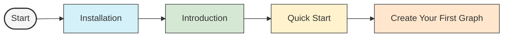

# Getting Started with UltraLink

Welcome to UltraLink! This section provides all the information you need to start using UltraLink in your projects.

## Getting Started Guides

### [Introduction to UltraLink](./introduction.md)

This guide introduces the fundamental concepts of UltraLink, its core features, and how it can benefit your projects. Learn about:

- What is UltraLink?
- Key differentiators from other knowledge graph tools
- Core features overview
- Use cases and applications

### [Installation Guide](./installation-guide.md)

Follow our step-by-step instructions to install UltraLink in your project:

- Installation via npm/yarn
- CDN usage
- Browser and Node.js environments
- Verifying your installation
- Configuration options

### [Quick Start Guide](./quick-start.md)

A fast-paced guide to get up and running with UltraLink:

- Creating your first knowledge graph
- Adding entities and relationships
- Basic vector embeddings
- Exporting to different formats
- Simple visualization example

## Next Steps

After getting started with UltraLink, you may want to explore:

- [Core Features](../core-features/README.md) - Learn about UltraLink's powerful capabilities
- [Formats](../formats/README.md) - Discover the various export formats
- [Tutorials](../tutorials/README.md) - Follow practical step-by-step tutorials
- [API Reference](../api/README.md) - Explore the complete API documentation

## Need Help?

If you encounter any issues during setup or have questions, check out:

- [Troubleshooting Guide](../troubleshooting/troubleshooting.md)
- [FAQ](../faq.md)
- [Community Support](../contributing/community-support.md) 