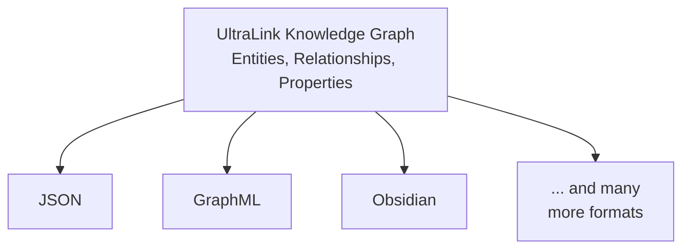
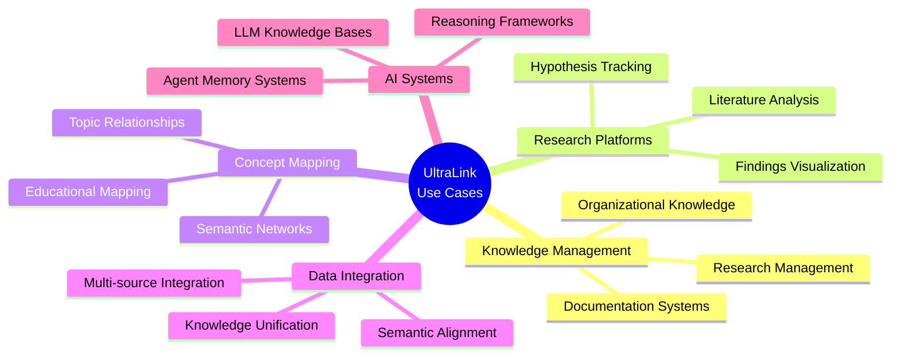
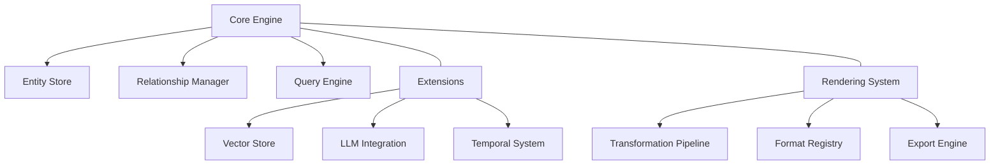

# Introduction to UltraLink

## What is UltraLink?

UltraLink is a powerful JavaScript library for creating, managing, and analyzing knowledge graphs with a flexible rendering system at its core. Its primary strength lies in its ability to transform knowledge representations into virtually any target format while providing advanced capabilities for vector embeddings and LLM integration.

The name "UltraLink" reflects its fundamental purpose: creating sophisticated connections ("links") between knowledge entities that can be flexibly rendered for different contexts and applications.

## The UltraLink Paradigm: Flexible Rendering at its Core

**The most distinguishing feature of UltraLink is its flexible rendering system** - the ability to represent knowledge once and render it in multiple formats for different tools, platforms, and use cases.

Traditional knowledge management systems often lock data into specific formats, forcing users to duplicate information across different tools. UltraLink breaks this pattern with a "create once, render anywhere" approach:

> **Note:** All diagrams in the UltraLink documentation use Mermaid syntax for consistency, clarity, and maintainability.

This flexibility enables unprecedented workflow integrations:
- Engineers can visualize knowledge in specialized graph tools
- Writers can access the same knowledge in documentation formats
- Analysts can export to data analysis formats
- Researchers can utilize Bayesian networks for probabilistic reasoning
- Educators can render knowledge as interactive learning materials
- Developers can create custom rendering targets for specialized needs

The UltraLink paradigm is built on the principle that knowledge representation should be separate from knowledge presentation, with a robust transformation layer in between.

## Core Features

UltraLink offers a wide range of features designed to make knowledge graph management powerful and flexible:

### Flexible Rendering System

- **Multiple Export Formats**: Transform knowledge into JSON, GraphML, CSV, Obsidian, HTML, Bayesian Networks, KIF, and more
- **Deterministic Transformations**: Ensure consistent and reproducible exports
- **Custom Rendering Targets**: Extend with your own formats (game engines, VR/AR, specialized tools)
- **Rendering Pipelines**: Create complex multi-step transformation workflows
- **Test-Driven Rendering**: Comprehensive test suite ensures rendering fidelity

### Entity and Relationship Management

- **Typed Entities**: Create entities with specific types and custom attributes
- **Flexible Relationships**: Define directed links between entities with custom properties
- **Attribute System**: Attach structured metadata to both entities and relationships
- **Validation Rules**: Ensure data integrity with configurable validation

### Vector Space Integration

- **Vector Embeddings**: Store and query vector embeddings for semantic similarity
- **Clustering**: Automatically cluster similar entities based on vector proximity
- **Semantic Search**: Find similar entities based on vector similarity
- **Dimensionality Reduction**: Visualize high-dimensional data in lower dimensions

### LLM Integration

- **Insight Generation**: Generate insights about entities using LLM capabilities
- **Content Analysis**: Automatically extract entities and relationships from text
- **Risk Assessment**: Analyze potential issues and risks related to entities
- **Evidence-Based Reasoning**: Maintain justifications and evidence for generated insights

### Temporal Analysis

- **Version History**: Track changes to entities and relationships over time
- **Evolution Tracking**: Analyze how knowledge evolves across different timeframes
- **Change Propagation**: Understand how changes affect related entities
- **Temporal Queries**: Query the state of the knowledge graph at specific points in time

## Use Cases

UltraLink is designed to be versatile and can be applied to a wide range of use cases:

- **Knowledge Management Systems**: Organize and connect organizational knowledge
- **Research Platforms**: Map research areas, papers, and findings
- **Concept Mapping**: Create sophisticated concept maps with semantic relationships
- **Documentation Systems**: Connect related documentation and technical concepts
- **Educational Tools**: Create learning paths and concept relationships
- **Data Integration**: Unify data from multiple sources with semantic connections
- **AI Integration**: Provide structured knowledge for AI systems
- **Recommendation Systems**: Build relationship-based recommendation engines
- **Data Visualization**: Generate interactive visualizations of complex knowledge networks

## Getting Started

To get started with UltraLink:

1. Follow the [Installation Guide](./installation-guide.md) to set up UltraLink in your project
2. Work through the [Quick Start Guide](./quick-start.md) to create your first knowledge graph
3. Explore the [Tutorials](../tutorials/README.md) for step-by-step learning
4. Refer to the [API Reference](../api/README.md) for detailed function documentation

## Architecture Overview

UltraLink is built on a modular architecture with these key components:

For a deeper understanding of UltraLink's architecture, see the [Architecture Overview](../architecture/overview.md).

## The Power of Format Flexibility

The true power of UltraLink becomes apparent when you need to:

- **Share knowledge across tools**: Use the same knowledge base with different specialized tools
- **Create multi-format publications**: Generate documentation, visualizations, and interactive tools from a single source
- **Future-proof your knowledge**: As new tools emerge, add new rendering formats without restructuring your knowledge
- **Build specialized presentations**: Create domain-specific views of your knowledge for different audiences
- **Integrate with existing systems**: Connect with legacy systems through appropriate format transformations

## Next Steps

After reading this introduction, you should have a basic understanding of what UltraLink is and what it can do. Continue your journey with these next steps:

- [Install UltraLink](./installation-guide.md) in your project
- Follow the [Quick Start Guide](./quick-start.md) to create your first knowledge graph
- Learn more about [UltraLink's Flexible Rendering System](../core-features/rendering-flexibility.md)
- Explore [Example Projects](../examples/README.md) to see UltraLink in action 