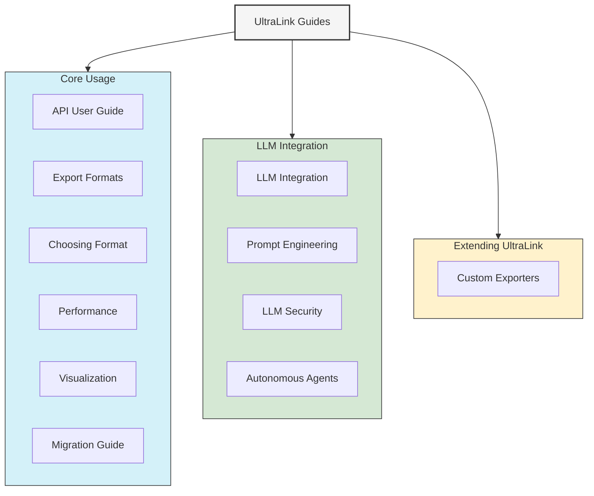

# UltraLink Guides

This directory contains practical guides and tutorials for working with UltraLink. These guides provide step-by-step instructions, best practices, and examples to help you get the most out of UltraLink.

## Core Usage Guides

### [API User Guide](./api-user-guide.md)
A comprehensive guide to using the UltraLink API, with examples and best practices for creating and managing knowledge graphs.

### [Export Formats Guide](./export-formats.md)
Learn about the various export formats supported by UltraLink and how to use them effectively.

### [Choosing the Right Format](./choosing-format.md)
Guidelines for selecting the most appropriate format for your specific use case.

### [Performance Guide](./performance.md)
Tips and techniques for optimizing performance when working with large knowledge graphs.

### [Visualization Guide](./visualization.md)
Learn how to create effective visualizations of your knowledge graphs using UltraLink's visualization capabilities.

### [Migration Guide](./migration-guide.md)
Instructions for migrating from previous versions of UltraLink or from other knowledge graph systems.

## LLM Integration Guides

### [LLM Integration Guide](./llm-integration.md)
Learn how to integrate UltraLink with language models to enhance your knowledge graphs with AI capabilities.

### [Prompt Engineering Guide](./prompt-engineering.md)
Best practices for crafting effective prompts when using UltraLink with language models.

### [LLM Security Guide](./llm-security.md)
Guidelines for ensuring security and privacy when integrating UltraLink with language models.

### [Autonomous Agents Guide](./autonomous-agents.md)
Learn how to create autonomous agents that can interact with and manipulate UltraLink knowledge graphs.

## Extending UltraLink

### [Custom Exporters Guide](./custom-exporters.md)
Instructions for creating custom exporters to support new formats or specialized output requirements.

## Getting Started

If you're new to UltraLink, we recommend starting with the [API User Guide](./api-user-guide.md) to learn the basics of creating and managing knowledge graphs. Then, explore the [Export Formats Guide](./export-formats.md) to understand how to share your knowledge in different formats.

For AI-enhanced knowledge graphs, check out the [LLM Integration Guide](./llm-integration.md) to learn how to leverage language models with UltraLink.

## Related Documentation

- [API Reference](../api/README.md) - Detailed API documentation
- [Core Features](../core-features/README.md) - Information about UltraLink's core features
- [Formats](../formats/README.md) - Detailed specifications for supported formats
- [Technical Documentation](../technical/README.md) - In-depth technical information 