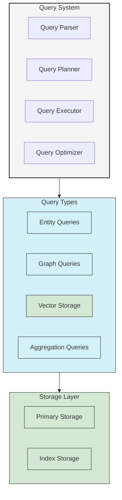

# Advanced Queries in UltraLink

This guide provides in-depth information on UltraLink's advanced querying capabilities, including complex filters, graph traversals, and aggregations.

## Query System Architecture

UltraLink's query system is designed to provide powerful, flexible queries across your knowledge graph:



## Entity Queries

### Basic Entity Query

```typescript
// Find all documents
const documents = await ultralink.findEntities({
  type: 'document'
});

// Find documents with a specific tag
const tutorials = await ultralink.findEntities({
  type: 'document',
  where: {
    'attributes.tags': {
      contains: 'tutorial'
    }
  }
});
```

### Complex Filters

```typescript
// Complex AND/OR conditions
const results = await ultralink.findEntities({
  where: {
    AND: [
      {
        type: 'document'
      },
      {
        'attributes.status': 'published'
      },
      {
        OR: [
          {
            'attributes.tags': {
              contains: 'tutorial'
            }
          },
          {
            'attributes.tags': {
              contains: 'guide'
            }
          }
        ]
      }
    ]
  }
});
```

### Comparison Operators

UltraLink supports a variety of comparison operators:

```typescript
// Greater than / less than
const recentDocuments = await ultralink.findEntities({
  type: 'document',
  where: {
    'attributes.publishDate': {
      gt: '2023-01-01'
    }
  }
});

// Between range
const mediumLengthDocuments = await ultralink.findEntities({
  type: 'document',
  where: {
    'attributes.wordCount': {
      gte: 1000,
      lte: 5000
    }
  }
});

// In list
const specificDocuments = await ultralink.findEntities({
  where: {
    'id': {
      in: ['doc-123', 'doc-456', 'doc-789']
    }
  }
});

// Full text search
const searchResults = await ultralink.findEntities({
  type: 'document',
  where: {
    'attributes.content': {
      search: 'advanced query techniques'
    }
  }
});
```

### Pagination and Sorting

```typescript
// Paginated results
const page1 = await ultralink.findEntities({
  type: 'document',
  sort: {
    'attributes.publishDate': 'desc'
  },
  limit: 10,
  offset: 0
});

const page2 = await ultralink.findEntities({
  type: 'document',
  sort: {
    'attributes.publishDate': 'desc'
  },
  limit: 10,
  offset: 10
});

// Multiple sort criteria
const sortedResults = await ultralink.findEntities({
  type: 'document',
  sort: [
    { 'attributes.category': 'asc' },
    { 'attributes.publishDate': 'desc' }
  ],
  limit: 20
});
```

### Field Selection

```typescript
// Select specific fields
const titles = await ultralink.findEntities({
  type: 'document',
  select: ['id', 'attributes.title', 'attributes.publishDate']
});

// Field projection with transformation
const summaries = await ultralink.findEntities({
  type: 'document',
  project: {
    id: true,
    title: 'attributes.title',
    date: 'attributes.publishDate',
    summary: entity => summarizeContent(entity.attributes.content)
  }
});
```

## Graph Traversal Queries

### Basic Traversal

```typescript
// Find all entities connected to a document
const connections = await ultralink.query({
  traverse: {
    start: 'doc-123',
    direction: 'both'
  }
});

// Find all documents authored by a person
const authored = await ultralink.query({
  traverse: {
    start: 'person-456',
    direction: 'outgoing',
    type: 'authored'
  }
});

// Multi-hop traversal
const twoHops = await ultralink.query({
  traverse: {
    start: 'doc-123',
    direction: 'outgoing',
    depth: 2
  }
});
```

### Path Finding

```typescript
// Find paths between entities
const paths = await ultralink.findPaths({
  start: 'person-123',
  end: 'document-456',
  maxDepth: 3
});

// Find paths with specific relationship types
const specificPaths = await ultralink.findPaths({
  start: 'person-123',
  end: 'document-456',
  relationshipTypes: ['authored', 'references'],
  maxDepth: 4
});

// Shortest path with weights
const shortestPath = await ultralink.findShortestPath({
  start: 'person-123',
  end: 'document-456',
  weightProperty: 'attributes.strength',
  maxDepth: 5
});
```

### Subgraph Extraction

```typescript
// Extract subgraph around an entity
const subgraph = await ultralink.getSubgraph({
  rootId: 'doc-123',
  depth: 2
});

// Filtered subgraph
const filteredSubgraph = await ultralink.getSubgraph({
  rootId: 'doc-123',
  depth: 2,
  nodeFilter: {
    type: {
      in: ['document', 'person', 'topic']
    }
  },
  edgeFilter: {
    type: {
      in: ['authored', 'references', 'contains']
    }
  }
});

// Subgraph with custom options
const customSubgraph = await ultralink.getSubgraph({
  rootId: 'doc-123',
  depth: 2,
  includeRootNode: true,
  includeBidirectional: true,
  includeNodeProperties: ['id', 'type', 'attributes.title'],
  includeEdgeProperties: ['id', 'type', 'attributes.strength']
});
```

The result of a subgraph query includes both nodes and edges:

```typescript
console.log(subgraph.nodes.length); // Number of nodes
console.log(subgraph.edges.length); // Number of edges

// Visualize the subgraph
const dotFormat = ultralink.export(subgraph, 'dot');
console.log(dotFormat);
```

### Graph Pattern Matching

```typescript
// Find triangles (e.g., co-authorship patterns)
const triangles = await ultralink.matchPattern({
  pattern: [
    { alias: 'a', type: 'person' },
    { alias: 'b', type: 'person' },
    { alias: 'c', type: 'document' },
    { from: 'a', to: 'c', type: 'authored' },
    { from: 'b', to: 'c', type: 'authored' },
    { from: 'a', to: 'b', type: 'knows' }
  ]
});

// Find citation chains
const citationChains = await ultralink.matchPattern({
  pattern: [
    { alias: 'a', type: 'document' },
    { alias: 'b', type: 'document' },
    { alias: 'c', type: 'document' },
    { from: 'a', to: 'b', type: 'cites' },
    { from: 'b', to: 'c', type: 'cites' }
  ]
});
```

## Vector Queries

### Basic Similarity Search

```typescript
// Search by content
const results = await ultralink.searchSimilar('How to perform advanced queries', {
  limit: 10,
  threshold: 0.7
});

// Search with type filter
const documentResults = await ultralink.searchSimilar('How to perform advanced queries', {
  filter: {
    type: 'document'
  },
  limit: 10
});

// Search with attribute filters
const recentResults = await ultralink.searchSimilar('How to perform advanced queries', {
  filter: {
    type: 'document',
    'attributes.publishDate': {
      gte: '2023-01-01'
    }
  },
  limit: 10
});
```

### Hybrid Search

Combining vector search with keyword filters:

```typescript
// Hybrid search - vector similarity + keyword matching
const hybridResults = await ultralink.search({
  text: 'advanced query techniques',
  filter: {
    type: 'document',
    'attributes.tags': {
      contains: 'tutorial'
    }
  },
  weights: {
    vector: 0.7,
    keyword: 0.3
  },
  limit: 10
});
```

### Vector Search with Reranking

```typescript
// Search with reranking
const rerankedResults = await ultralink.searchSimilar('How to query UltraLink', {
  limit: 20,
  rerank: {
    model: 'cross-encoder',
    limit: 5
  }
});

// Custom reranking function
const customReranked = await ultralink.searchSimilar('How to query UltraLink', {
  limit: 20,
  rerank: {
    function: (query, results) => {
      // Custom reranking logic
      return results.map(r => ({
        ...r,
        score: calculateCustomScore(query, r)
      })).sort((a, b) => b.score - a.score).slice(0, 5);
    }
  }
});
```

### Nearest Neighbors

```typescript
// Find nearest neighbors by entity ID
const neighbors = await ultralink.findNearestNeighbors('doc-123', {
  limit: 5
});

// Find nearest neighbors by vector
const vectorNeighbors = await ultralink.findNearestNeighborsByVector(vector, {
  limit: 5,
  filter: {
    type: 'document'
  }
});
```

## Aggregation Queries

### Basic Aggregations

```typescript
// Count entities
const count = await ultralink.query({
  type: 'document',
  aggregate: {
    count: true
  }
});

// Min/Max/Avg
const stats = await ultralink.query({
  type: 'document',
  aggregate: {
    count: true,
    min: 'attributes.wordCount',
    max: 'attributes.wordCount',
    avg: 'attributes.wordCount'
  }
});
```

### Group By Aggregations

```typescript
// Group by category
const categoryStats = await ultralink.query({
  type: 'document',
  aggregate: {
    groupBy: 'attributes.category',
    count: true
  }
});

// Multiple metrics
const authorStats = await ultralink.query({
  type: 'document',
  aggregate: {
    groupBy: 'attributes.author',
    metrics: {
      count: true,
      avgWordCount: {
        avg: 'attributes.wordCount'
      },
      maxPublishDate: {
        max: 'attributes.publishDate'
      }
    }
  }
});

// Multi-level grouping
const hierarchicalStats = await ultralink.query({
  type: 'document',
  aggregate: {
    groupBy: ['attributes.category', 'attributes.status'],
    count: true
  }
});
```

### Histograms

```typescript
// Date histogram
const publishTimeline = await ultralink.query({
  type: 'document',
  aggregate: {
    histogram: {
      field: 'attributes.publishDate',
      interval: 'month'
    },
    count: true
  }
});

// Numeric range histogram
const wordCountDistribution = await ultralink.query({
  type: 'document',
  aggregate: {
    histogram: {
      field: 'attributes.wordCount',
      interval: 1000,
      min: 0,
      max: 10000
    },
    count: true
  }
});
```

## Combining Query Types

### Entity + Graph Queries

```typescript
// Find documents and expand to related entities
const results = await ultralink.query({
  type: 'document',
  where: {
    'attributes.tags': {
      contains: 'tutorial'
    }
  },
  expand: {
    authored_by: {
      type: 'authored',
      direction: 'incoming',
      as: 'authors'
    },
    references: {
      type: 'references',
      direction: 'outgoing',
      as: 'citations'
    }
  }
});

// Process expanded results
for (const doc of results) {
  console.log(`Document: ${doc.attributes.title}`);
  console.log(`Authors: ${doc.authors.map(a => a.attributes.name).join(', ')}`);
  console.log(`Citations: ${doc.citations.length}`);
}
```

### Vector + Graph Queries

```typescript
// Find similar documents and expand to authors
const results = await ultralink.searchSimilar('advanced query', {
  limit: 5,
  expand: {
    authors: {
      type: 'authored',
      direction: 'incoming'
    }
  }
});

// Find paths between similar documents
const connectionsOfSimilarDocs = await ultralink.query({
  vector: {
    text: 'knowledge graph query',
    limit: 5
  },
  paths: {
    maxDepth: 2,
    relationshipTypes: ['references', 'related_to']
  }
});
```

### Aggregations + Filters

```typescript
// Filtered aggregations
const tagStats = await ultralink.query({
  type: 'document',
  where: {
    'attributes.publishDate': {
      gte: '2023-01-01'
    }
  },
  aggregate: {
    groupBy: 'attributes.tags',
    count: true,
    filter: {
      // Only count documents with wordCount > 1000
      'attributes.wordCount': {
        gt: 1000
      }
    }
  }
});
```

## Query Performance Optimization

### Indexing

UltraLink automatically creates indexes for common query patterns, but you can explicitly define additional indexes:

```typescript
// Define indexes when initializing
const ultralink = new UltraLink({
  storage: {
    adapter: 'memory',
    indexes: [
      { path: 'attributes.publishDate', type: 'btree' },
      { path: 'attributes.tags', type: 'array' },
      { path: 'attributes.wordCount', type: 'btree' }
    ]
  }
});

// Add index at runtime
await ultralink.createIndex({
  path: 'attributes.category',
  type: 'hash'
});
```

### Query Caching

```typescript
// Enable query caching
const ultralink = new UltraLink({
  query: {
    cache: {
      enabled: true,
      ttl: 300, // 5 minutes
      maxSize: 100 // Store up to 100 query results
    }
  }
});

// Use cache hint in query
const results = await ultralink.findEntities({
  type: 'document',
  where: {
    'attributes.category': 'tutorial'
  },
  cache: {
    ttl: 600, // Override cache TTL for this query
    key: 'tutorial-docs' // Custom cache key
  }
});
```

### Query Explain

```typescript
// Get query execution plan
const plan = await ultralink.explainQuery({
  type: 'document',
  where: {
    'attributes.tags': {
      contains: 'tutorial'
    }
  },
  sort: {
    'attributes.publishDate': 'desc'
  }
});

console.log(plan);
// {
//   steps: [
//     { type: 'scan', collection: 'entities', filter: {...}, indexName: 'idx_tags' },
//     { type: 'filter', condition: {...} },
//     { type: 'sort', properties: [...], useIndex: true },
//     { type: 'limit', value: 50 }
//   ],
//   estimatedCost: 0.15,
//   estimatedResults: 42
// }
```

## Query Streaming

For queries that might return large result sets, you can use streaming to process results incrementally:

```typescript
// Stream query results
const stream = await ultralink.streamQuery({
  type: 'document',
  where: {
    'attributes.status': 'published'
  }
});

// Process results as they arrive
for await (const entity of stream) {
  console.log(entity.id, entity.attributes.title);
  
  // Perform processing on each entity
  await processEntity(entity);
}
```

## Query Language

UltraLink also supports a query language for more complex queries:

```typescript
// Using the query language
const results = await ultralink.executeQuery(`
  MATCH (person:person)-[r:authored]->(doc:document)
  WHERE doc.attributes.tags CONTAINS 'tutorial'
  AND person.attributes.expertise IN ['javascript', 'typescript']
  RETURN person, doc
  SORT doc.attributes.publishDate DESC
  LIMIT 10
`);

// Parameterized queries
const paramResults = await ultralink.executeQuery(`
  MATCH (person:person)-[r:authored]->(doc:document)
  WHERE doc.attributes.tags CONTAINS $tag
  RETURN person, doc
  LIMIT $limit
`, {
  tag: 'tutorial',
  limit: 10
});
```

## Visualization of Query Results

```typescript
// Export query results for visualization
const graph = await ultralink.query({
  traverse: {
    start: 'doc-123',
    depth: 2
  }
});

// Export as DOT format (for Graphviz)
const dot = ultralink.export(graph, 'dot');

// Export as JSON for D3.js visualization
const d3Format = ultralink.export(graph, 'json', {
  format: 'd3'
});

// Export as GraphML
const graphML = ultralink.export(graph, 'graphml');
```

## Next Steps

- [Vector Operations Guide](./vector-operations.md) - Advanced vector capabilities
- [Core API Reference](../api/core.md) - Complete API details
- [Query Optimization Guide](./query-optimization.md) - Performance tuning 