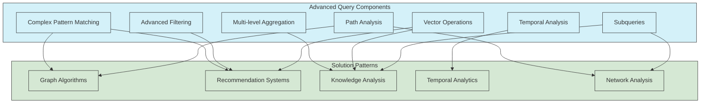
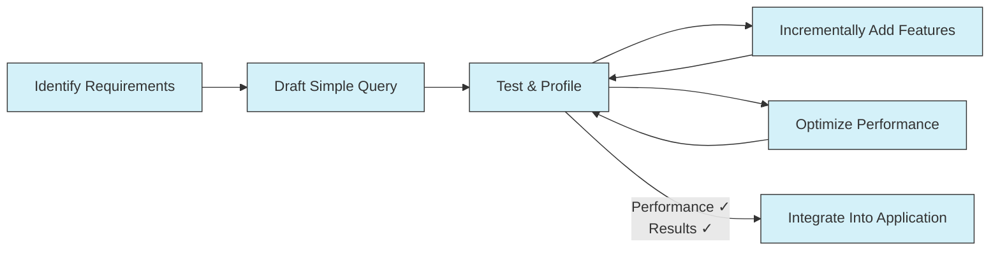

# Advanced UQL Query Patterns

This guide explores advanced patterns and techniques for the UltraLink Query Language (UQL) that can help you solve complex knowledge graph problems and optimize query performance.

## Query Pattern Architecture

Advanced UQL queries typically combine multiple techniques to solve complex problems:



## 1. Graph Algorithm Patterns

### 1.1 Centrality Analysis

Identify the most important nodes in your knowledge graph using centrality measures:

```
// Degree centrality - find entities with the most relationships
MATCH (n)-[r]-()
WITH n, COUNT(r) as degree
ORDER BY degree DESC
LIMIT 10
RETURN n.attributes.name, n.type, degree

// Betweenness centrality approximation - find key connectors
MATCH path = shortestPath((start)-[*1..5]-(end))
WHERE id(start) < id(end) // Avoid counting twice
WITH DISTINCT start, end, path
WITH NODES(path) AS nodes
UNWIND nodes AS node
WITH node, COUNT(*) AS pathCount
ORDER BY pathCount DESC
LIMIT 10
RETURN node.attributes.name, node.type, pathCount
```

### 1.2 Community Detection

Identify communities or clusters within your knowledge graph:

```
// Basic community detection using relationship density
MATCH (p1:person)-[:authored]->(:document)<-[:authored]-(p2:person)
WHERE p1 <> p2
WITH p1, p2, COUNT(*) AS collaboration_weight
WHERE collaboration_weight >= 3
RETURN p1.attributes.name, COLLECT(p2.attributes.name) AS collaborators, 
       SUM(collaboration_weight) AS community_strength
ORDER BY community_strength DESC

// Extended triangle-based clustering
MATCH (p1:person)-[:collaborates_with]->(p2:person)-[:collaborates_with]->(p3:person)-[:collaborates_with]->(p1)
WHERE p1.id < p2.id AND p2.id < p3.id // Avoid duplicates
RETURN p1.attributes.name, p2.attributes.name, p3.attributes.name, 
       COUNT(*) AS triangle_count
```

### 1.3 Path Analysis

Discover and analyze paths through your knowledge graph:

```
// All paths between two entities
MATCH paths = allShortestPaths(
  (source:concept {id: 'machine-learning'})-[:related_to*1..5]-(target:concept {id: 'neural-networks'})
)
RETURN paths, LENGTH(paths) AS path_length
ORDER BY path_length

// Weighted path finding
MATCH (start:concept {id: 'reinforcement-learning'}), (end:concept {id: 'robotics'})
CALL apoc.algo.dijkstra(start, end, 'RELATED_TO', 'weight') YIELD path, weight
RETURN path, weight
```

## 2. Complex Relationship Patterns

### 2.1 Multi-level Relationships

Find complex relationship patterns that span multiple levels:

```
// Three-level relationship pattern
MATCH (researcher:person)-[:authored]->(paper:document)-[:cites]->(cited:document)<-[:authored]-(authority:person)
WHERE researcher <> authority
RETURN researcher.attributes.name, authority.attributes.name, 
       COUNT(DISTINCT paper) AS connection_strength
ORDER BY connection_strength DESC
LIMIT 20

// Hierarchical pattern matching
MATCH (employee:person)-[:works_in]->(dept:department)-[:part_of]->(division:division)-[:part_of]->(company:organization)
WHERE company.attributes.name = 'Acme Corp'
RETURN employee.attributes.name, dept.attributes.name, division.attributes.name,
       employee.attributes.position
```

### 2.2 Recursive Patterns

Handle recursive structures like hierarchies and trees:

```
// Organizational hierarchy
MATCH path = (employee:person {id: 'emp-123'})-[:reports_to*]->(manager:person)
RETURN [node IN NODES(path) | node.attributes.name] AS reporting_line

// Category hierarchy with depth tracking
MATCH path = (subcategory:category)-[:child_of*]->(parent:category)
WHERE subcategory.attributes.name = 'Deep Learning'
WITH parent, LENGTH(path) AS depth
RETURN parent.attributes.name, depth
ORDER BY depth
```

### 2.3 Graph Intersection Patterns

Find where different subgraphs intersect or overlap:

```
// People who are both authors and reviewers
MATCH (person:person)-[:authored]->(doc1:document)
MATCH (person)-[:reviewed]->(doc2:document)
WHERE doc1 <> doc2
RETURN person.attributes.name, 
       COUNT(DISTINCT doc1) AS authored_docs,
       COUNT(DISTINCT doc2) AS reviewed_docs

// Topics common to multiple disciplines
MATCH (topic:concept)<-[:includes]-(discipline1:discipline)
MATCH (topic)<-[:includes]-(discipline2:discipline)
WHERE discipline1 <> discipline2
AND discipline1.attributes.name = 'Computer Science'
AND discipline2.attributes.name = 'Neuroscience'
RETURN topic.attributes.name, COUNT(*) AS relevance
```

## 3. Advanced Vector Query Patterns

### 3.1 Hybrid Vector-Structural Searches

Combine vector similarity with structural patterns:

```
// Find documents similar to a reference but connected to a specific concept
MATCH (doc:document) SIMILAR TO {text: 'quantum computing applications'}
WITH doc, similarity
WHERE similarity > 0.75
MATCH (doc)-[:relates_to]->(concept:concept {id: 'artificial-intelligence'})
RETURN doc.attributes.title, similarity
ORDER BY similarity DESC

// Find similar documents authored by specific researchers
MATCH (author:person)-[:authored]->(doc:document)
WHERE author.attributes.organization = 'Stanford University'
AND VECTOR_SIMILARITY(doc, 'neural networks for computer vision') > 0.8
RETURN author.attributes.name, doc.attributes.title,
       VECTOR_SIMILARITY(doc, 'neural networks for computer vision') AS relevance
ORDER BY relevance DESC
```

### 3.2 Multi-Vector Constraints

Combine multiple vector similarity constraints:

```
// Find entities similar to two different queries
MATCH (doc:document)
WHERE VECTOR_SIMILARITY(doc.attributes.abstract, 'machine learning') > 0.7
AND VECTOR_SIMILARITY(doc.attributes.abstract, 'healthcare applications') > 0.6
RETURN doc.attributes.title,
       VECTOR_SIMILARITY(doc.attributes.abstract, 'machine learning') AS ml_score,
       VECTOR_SIMILARITY(doc.attributes.abstract, 'healthcare applications') AS health_score,
       (VECTOR_SIMILARITY(doc.attributes.abstract, 'machine learning') + 
        VECTOR_SIMILARITY(doc.attributes.abstract, 'healthcare applications')) / 2 AS combined_score
ORDER BY combined_score DESC

// Document similar to one concept but dissimilar to another
MATCH (doc:document)
MATCH (concept1:concept {id: 'reinforcement-learning'})
MATCH (concept2:concept {id: 'supervised-learning'})
WHERE VECTOR_SIMILARITY(doc, concept1) > 0.75
AND VECTOR_SIMILARITY(doc, concept2) < 0.3
RETURN doc.attributes.title,
       VECTOR_SIMILARITY(doc, concept1) AS rl_similarity,
       VECTOR_SIMILARITY(doc, concept2) AS sl_similarity
```

### 3.3 Vector Clustering

Find clusters of similar entities:

```
// K-means clustering of documents by vector similarity
CALL vector.kmeans('document', 'embedding', {k: 5})
YIELD cluster, members
RETURN cluster, COUNT(members) AS cluster_size, 
       [doc IN members | doc.attributes.title][..5] AS sample_docs

// Hierarchical clustering
CALL vector.hierarchicalClustering('document', 'embedding', {
  method: 'average',
  distance: 'cosine',
  cutHeight: 0.3
})
YIELD cluster, level, members
RETURN cluster, level, COUNT(members) AS size
```

## 4. Temporal Analytics Patterns

### 4.1 Trend Analysis

Analyze how entities and relationships change over time:

```
// Track entity attribute changes over time
MATCH (entity:project {id: 'project-123'}) CHANGES
WHERE change_type = 'UPDATE'
AND change_time BETWEEN '2023-01-01' AND '2023-12-31'
RETURN change_time, changed_attributes, previous_values, new_values
ORDER BY change_time

// Track concept popularity over time
MATCH (doc:document)-[:relates_to]->(concept:concept)
WITH concept, doc.attributes.publication_date.year AS year, COUNT(*) AS mentions
WHERE year >= 2018 AND year <= 2023
RETURN concept.attributes.name, year, mentions
ORDER BY concept.attributes.name, year
```

### 4.2 State Comparison

Compare entity states across different time points:

```
// Compare project state between two timepoints
MATCH (project:project {id: 'project-quantum'}) AT '2023-01-01' AS p1
MATCH (project:project {id: 'project-quantum'}) AT '2023-06-30' AS p2
RETURN p1.attributes.status AS initial_status,
       p2.attributes.status AS current_status,
       p1.attributes.completion_percentage AS initial_completion,
       p2.attributes.completion_percentage AS current_completion,
       p2.attributes.completion_percentage - p1.attributes.completion_percentage AS progress

// Team composition changes
MATCH (team:team {id: 'team-ml'})-[:has_member]->(member:person) AT '2022-01-01' AS old_team
WITH COLLECT(member.id) AS old_members, team
MATCH (team)-[:has_member]->(member:person) AT '2023-01-01' AS new_team
WITH old_members, COLLECT(member.id) AS new_members, team
RETURN team.attributes.name,
       SIZE(old_members) AS old_size,
       SIZE(new_members) AS new_size,
       SIZE([m IN new_members WHERE NOT m IN old_members]) AS added_members,
       SIZE([m IN old_members WHERE NOT m IN new_members]) AS removed_members
```

### 4.3 Event Sequences

Find sequences of related events or changes:

```
// Find project milestone sequences
MATCH (project:project {id: 'project-agile'})-[:has_milestone]->(milestone:milestone)
WITH project, milestone
ORDER BY milestone.attributes.due_date
WITH project, COLLECT({name: milestone.attributes.name, date: milestone.attributes.due_date}) AS milestones
RETURN project.attributes.name, milestones

// Analyze sequential document publications
MATCH (author:person)-[:authored]->(doc:document)
WITH author, doc
ORDER BY doc.attributes.publication_date
WITH author, COLLECT({title: doc.attributes.title, date: doc.attributes.publication_date}) AS publication_timeline
WHERE SIZE(publication_timeline) >= 3
RETURN author.attributes.name, publication_timeline
```

## 5. Knowledge Analysis Patterns

### 5.1 Expertise Identification

Identify expertise patterns within your knowledge graph:

```
// Find subject matter experts
MATCH (person:person)-[:authored]->(doc:document)
MATCH (doc)-[:relates_to]->(topic:concept)
WITH person, topic, COUNT(doc) AS expertise_evidence
WHERE expertise_evidence >= 3
WITH person, COLLECT({topic: topic.attributes.name, strength: expertise_evidence}) AS expertise_areas
RETURN person.attributes.name, expertise_areas
ORDER BY SIZE(expertise_areas) DESC

// Find rising experts (increasing publication rate)
MATCH (person:person)-[:authored]->(doc:document)
WITH person, doc.attributes.publication_date.year AS year, COUNT(*) AS pub_count
WHERE year >= 2020 AND year <= 2023
WITH person, COLLECT({year: year, count: pub_count}) AS yearly_pubs
WHERE SIZE(yearly_pubs) >= 3
AND yearly_pubs[-1].count > yearly_pubs[0].count
RETURN person.attributes.name, yearly_pubs
ORDER BY yearly_pubs[-1].count - yearly_pubs[0].count DESC
```

### 5.2 Knowledge Gap Analysis

Identify gaps or missing connections in your knowledge graph:

```
// Find missing relationships between related concepts
MATCH (c1:concept)-[:related_to]->(common:concept)<-[:related_to]-(c2:concept)
WHERE c1 <> c2
AND NOT (c1)-[:related_to]-(c2)
RETURN c1.attributes.name, c2.attributes.name, COUNT(common) AS common_connections
ORDER BY common_connections DESC
LIMIT 20

// Topics with limited documentation
MATCH (concept:concept)
OPTIONAL MATCH (concept)<-[:relates_to]-(doc:document)
WITH concept, COUNT(doc) AS doc_count
WHERE doc_count <= 2
RETURN concept.attributes.name, doc_count
ORDER BY doc_count
```

### 5.3 Contradiction Detection

Find potential contradictions or conflicts in your knowledge graph:

```
// Find directly contradicting relationships
MATCH (source:document)-[:supports]->(claim:claim)
MATCH (other:document)-[:contradicts]->(claim)
RETURN claim.attributes.statement, 
       [source IN COLLECT(DISTINCT source) | source.attributes.title] AS supporting_docs,
       [doc IN COLLECT(DISTINCT other) | doc.attributes.title] AS contradicting_docs

// Claims with mixed supporting evidence
MATCH (doc:document)-[r]->(claim:claim)
WITH claim, 
     SUM(CASE WHEN type(r) = 'supports' THEN 1 ELSE 0 END) AS supporting,
     SUM(CASE WHEN type(r) = 'contradicts' THEN 1 ELSE 0 END) AS contradicting
WHERE supporting > 0 AND contradicting > 0
RETURN claim.attributes.statement, supporting, contradicting,
       supporting / (supporting + contradicting) AS support_ratio
ORDER BY support_ratio
```

## 6. Recommendation Patterns

### 6.1 Content Recommendation

Create personalized content recommendations:

```
// Basic content recommendation based on history
MATCH (user:user {id: 'user-123'})-[:viewed]->(content:document)
MATCH (content)-[:similar_to]->(recommendation:document)
WHERE NOT (user)-[:viewed]->(recommendation)
RETURN recommendation.attributes.title, COUNT(content) AS relevance_score
ORDER BY relevance_score DESC
LIMIT 10

// Advanced hybrid recommendation using vectors and relationships
MATCH (user:user {id: 'user-789'})-[:interested_in]->(topic:concept)
MATCH (doc:document)-[:relates_to]->(topic)
WHERE NOT (user)-[:viewed]->(doc)
WITH doc, COUNT(topic) AS topic_match, user

// Add vector similarity score
MATCH (user)-[:viewed]->(viewed_doc:document)
WITH doc, topic_match, AVG(VECTOR_SIMILARITY(doc, viewed_doc)) AS content_similarity
WHERE content_similarity > 0.6 OR topic_match >= 2
RETURN doc.attributes.title, 
       topic_match * 0.3 + content_similarity * 0.7 AS combined_score
ORDER BY combined_score DESC
LIMIT 5
```

### 6.2 Collaborative Filtering

Implement collaborative filtering patterns:

```
// User-based collaborative filtering
MATCH (targetUser:user {id: 'user-123'})-[:rated]->(content:document)
WITH targetUser, AVG(content.rating) AS targetAvg

MATCH (otherUser:user)-[:rated]->(content:document)
WHERE otherUser <> targetUser
WITH otherUser, targetUser, targetAvg, AVG(content.rating) AS otherAvg

MATCH (targetUser)-[r1:rated]->(common:document)<-[r2:rated]-(otherUser)
WITH targetUser, otherUser, targetAvg, otherAvg,
     SUM((r1.rating - targetAvg) * (r2.rating - otherAvg)) / 
     (SQRT(SUM((r1.rating - targetAvg)^2)) * SQRT(SUM((r2.rating - otherAvg)^2))) AS similarity
WHERE similarity > 0.7

MATCH (otherUser)-[r:rated]->(recommendation:document)
WHERE NOT (targetUser)-[:rated|viewed]->(recommendation)
RETURN recommendation.attributes.title,
       SUM(r.rating * similarity) / SUM(similarity) AS predicted_rating
ORDER BY predicted_rating DESC
LIMIT 10
```

### 6.3 Diverse Recommendations

Ensure diversity in recommendations:

```
// Topic-diverse recommendations
MATCH (user:user {id: 'user-456'})-[:interested_in]->(topic:concept)
MATCH (doc:document)-[:relates_to]->(topic)
WHERE NOT (user)-[:viewed]->(doc)
WITH topic, doc, user
ORDER BY VECTOR_SIMILARITY(doc, user) DESC
WITH topic, COLLECT(doc)[0] AS top_doc_per_topic
RETURN topic.attributes.name, top_doc_per_topic.attributes.title

// Recency-balanced recommendations
MATCH (user:user {id: 'user-789'})-[:viewed]->(content:document)
WITH user, AVG(VECTOR_SIMILARITY(content, content)) AS userProfile

MATCH (recommendation:document)
WHERE NOT (user)-[:viewed]->(recommendation)
WITH recommendation, userProfile, 
     VECTOR_SIMILARITY(recommendation, userProfile) AS relevance,
     date.timestamp() - recommendation.attributes.publication_date.timestamp() AS recency_score

RETURN recommendation.attributes.title,
       relevance * 0.7 + (1 / (recency_score + 1)) * 0.3 AS balanced_score
ORDER BY balanced_score DESC
LIMIT 15
```

## 7. Performance Optimization Patterns

### 7.1 Query Rewriting Patterns

Restructure queries for better performance:

```
// Original query
MATCH (person:person)-[:authored]->(doc:document)
MATCH (doc)-[:relates_to]->(topic:concept)
WHERE topic.attributes.name = 'AI'
RETURN person, COUNT(doc) AS doc_count

// Rewritten with more specific starting point
MATCH (topic:concept {attributes: {name: 'AI'}})
MATCH (doc:document)-[:relates_to]->(topic)
MATCH (person:person)-[:authored]->(doc)
RETURN person, COUNT(doc) AS doc_count
```

### 7.2 Index Utilization

Leverage indexes effectively:

```
// Ensure index exists on nodes you filter
CALL db.index.nodes.create('document_date_idx', ['document'], ['attributes.publication_date'])

// Query using indexed properties
MATCH (doc:document)
WHERE doc.attributes.publication_date > '2023-01-01'
RETURN COUNT(doc)
```

### 7.3 Query Staging

Break complex queries into stages:

```
// Original complex query
MATCH (author:person)-[:authored]->(doc:document)-[:cites]->(cited:document)
WHERE doc.attributes.publication_date > '2022-01-01'
AND cited.attributes.citations > 100
RETURN author.attributes.name, COUNT(DISTINCT doc) AS authored, COUNT(DISTINCT cited) AS cited

// Staged with intermediate results
MATCH (author:person)
WITH author
LIMIT 1000

MATCH (author)-[:authored]->(doc:document)
WHERE doc.attributes.publication_date > '2022-01-01'
WITH author, COLLECT(doc) AS authored_docs
WHERE SIZE(authored_docs) > 0

UNWIND authored_docs AS doc
MATCH (doc)-[:cites]->(cited:document)
WHERE cited.attributes.citations > 100
WITH author, authored_docs, COLLECT(DISTINCT cited) AS cited_docs
RETURN author.attributes.name, SIZE(authored_docs) AS authored, SIZE(cited_docs) AS cited
```

## 8. Query Design Process

When designing advanced queries, follow this iterative process:



1. **Identify Requirements**: Define what question you're trying to answer
2. **Draft Simple Query**: Start with a basic version of your query
3. **Test & Profile**: Run the query and check both results and performance
4. **Incrementally Add Features**: Add complexity one piece at a time
5. **Optimize Performance**: Improve speed and resource usage
6. **Integrate Into Application**: Implement in your final system

## Related Documentation

- [UQL Reference Guide](../reference/query-language-syntax.md)
- [Query Optimization Guide](../performance/query-optimization.md)
- [Vector Search Techniques](../guides/vector-search.md)
- [Temporal Query Patterns](../guides/temporal-queries.md)
- [UltraLink Core Syntax](../core-features/syntax-and-semantics.md) 