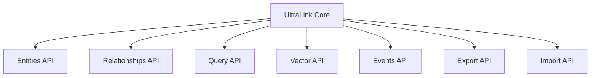

# UltraLink API User Guide

This guide provides a comprehensive overview of UltraLink's API, featuring examples and best practices for effective implementation.

## Table of Contents

1. [Introduction](#introduction)
2. [Getting Started](#getting-started)
3. [Core API Overview](#core-api-overview)
4. [Working with Entities](#working-with-entities)
5. [Working with Relationships](#working-with-relationships)
6. [Advanced Queries and Filters](#advanced-queries-and-filters)
7. [Vector Embeddings and Similarity](#vector-embeddings-and-similarity)
8. [Events and Reactivity](#events-and-reactivity)
9. [Export Operations](#export-operations)
10. [Import Operations](#import-operations)
11. [Error Handling](#error-handling)
12. [Performance Optimization](#performance-optimization)
13. [Best Practices](#best-practices)
14. [API Reference](#api-reference)

## Introduction

UltraLink is a powerful JavaScript library for creating, managing, and exporting knowledge graphs. It provides a simple yet flexible API for working with entities and their relationships, along with various export formats for integration with other tools and systems.



## Getting Started

### Installation

```bash
npm install ultralink
# or
yarn add ultralink
```

### Basic Usage

```javascript
const { UltraLink } = require('ultralink');
// or using ES modules
// import { UltraLink } from 'ultralink';

// Create a new UltraLink instance
const ultralink = new UltraLink();

// Add entities
await ultralink.addEntity('alice', 'person', { name: 'Alice', age: 30 });
await ultralink.addEntity('bob', 'person', { name: 'Bob', age: 25 });

// Add relationships
await ultralink.addLink('alice', 'bob', 'knows', { since: 2020 });

// Export to various formats
const json = await ultralink.toJSON();
const graphml = await ultralink.toGraphML();
```

## Core API Overview

The UltraLink API is organized around a few key concepts:

1. **Entities**: Nodes in the knowledge graph with types and attributes
2. **Relationships**: Directed connections between entities with types and attributes
3. **Queries**: Methods to search and filter entities and relationships
4. **Vectors**: Methods for working with vector embeddings and similarity search
5. **Events**: Reactive system for responding to changes in the graph
6. **Exports**: Methods to convert the graph to various formats
7. **Imports**: Methods to import data from various formats

## Working with Entities

Entities are the core building blocks of your knowledge graph.

### Adding Entities

```javascript
// Basic entity
await ultralink.addEntity('alice', 'person', { name: 'Alice' });

// Entity with additional attributes
await ultralink.addEntity('article1', 'document', {
  title: 'Introduction to Knowledge Graphs',
  publishedDate: '2023-05-10',
  tags: ['knowledge-graph', 'tutorial']
});

// Entity with metadata
await ultralink.addEntity('project1', 'project', 
  { name: 'UltraLink Development', status: 'active' },
  { source: 'manual', confidence: 0.95 }
);
```

### Retrieving Entities

```javascript
// Get an entity by ID
const alice = await ultralink.getEntity('alice');
console.log(alice.attributes.name); // 'Alice'

// Check if an entity exists
const exists = await ultralink.hasEntity('bob');
console.log(exists); // true or false
```

### Updating Entities

```javascript
// Update an entity's attributes
await ultralink.updateEntity('alice', {
  age: 31,
  location: 'New York'
});

// Update with patch (only modifies specified fields)
await ultralink.patchEntity('alice', {
  location: 'San Francisco'
});

// Set a specific attribute
await ultralink.setEntityAttribute('alice', 'skills', ['JavaScript', 'Python']);
```

### Deleting Entities

```javascript
// Remove an entity (and its relationships)
await ultralink.removeEntity('alice');

// Remove multiple entities
await ultralink.removeEntities(['alice', 'bob']);
```

## Working with Relationships

Relationships connect entities and describe how they interact.

### Adding Relationships

```javascript
// Basic relationship
await ultralink.addLink('alice', 'bob', 'knows');

// Relationship with attributes
await ultralink.addLink('alice', 'article1', 'authored', {
  date: '2023-01-15',
  contributionLevel: 'primary'
});

// Relationship with metadata
await ultralink.addLink('bob', 'project1', 'works_on', 
  { role: 'developer' },
  { source: 'hr-database', confidence: 0.9 }
);
```

### Retrieving Relationships

```javascript
// Get all relationships for an entity
const aliceRelationships = await ultralink.getEntityLinks('alice');

// Get specific relationships
const knows = await ultralink.getLink('alice', 'bob', 'knows');

// Get all outgoing relationships of a specific type
const authored = await ultralink.getOutgoingLinksByType('alice', 'authored');

// Get all incoming relationships of a specific type
const managed = await ultralink.getIncomingLinksByType('alice', 'managed_by');
```

### Updating Relationships

```javascript
// Update relationship attributes
await ultralink.updateLink('alice', 'bob', 'knows', {
  since: 2019,
  closeness: 'good friend'
});

// Update with patch
await ultralink.patchLink('alice', 'bob', 'knows', {
  closeness: 'best friend'
});
```

### Deleting Relationships

```javascript
// Remove a specific relationship
await ultralink.removeLink('alice', 'bob', 'knows');

// Remove all relationships of a certain type
await ultralink.removeLinksByType('knows');

// Remove all relationships for an entity
await ultralink.removeEntityLinks('alice');
```

## Advanced Queries and Filters

UltraLink provides powerful query capabilities to find entities and relationships.

### Finding Entities

```javascript
// Find entities by type
const allPeople = await ultralink.findEntities({ type: 'person' });

// Find with attribute filters
const adultsInNY = await ultralink.findEntities({
  type: 'person',
  attributes: {
    age: { $gte: 18 },
    location: 'New York'
  }
});

// Complex queries with logical operators
const seniorDevs = await ultralink.findEntities({
  $and: [
    { type: 'person' },
    { 
      $or: [
        { attributes: { skills: { $contains: 'JavaScript' } } },
        { attributes: { skills: { $contains: 'Python' } } }
      ]
    },
    { attributes: { experience: { $gte: 5 } } }
  ]
});
```

### Query Operators

UltraLink supports a MongoDB-like query syntax:

- `$eq`: Equal to
- `$ne`: Not equal to
- `$gt`/`$gte`: Greater than / Greater than or equal to
- `$lt`/`$lte`: Less than / Less than or equal to
- `$in`: In an array
- `$nin`: Not in array
- `$contains`: Array contains element
- `$containsAny`: Array contains any of the specified elements
- `$containsAll`: Array contains all of the specified elements
- `$regex`: Matches regular expression (string values)
- `$and`: Logical AND
- `$or`: Logical OR
- `$not`: Logical NOT

### Path Queries

Find connections between entities:

```javascript
// Find all paths between two entities
const paths = await ultralink.findPaths('alice', 'charlie', {
  maxDepth: 3,
  typeFilter: ['knows', 'works_with']
});

// Find shortest path
const shortestPath = await ultralink.findShortestPath('alice', 'dave');
```

### Subgraph Extraction

Extract portions of the graph:

```javascript
// Extract neighborhood around an entity
const neighborhood = await ultralink.getNeighborhood('alice', {
  depth: 2,
  includeAttributes: true
});

// Extract a subgraph of specific types
const teamGraph = await ultralink.extractSubgraph({
  entityTypes: ['person', 'team', 'project'],
  relationshipTypes: ['member_of', 'works_on']
});
```

## Vector Embeddings and Similarity

UltraLink's vector capabilities enable semantic search and similarity matching.

### Setting Up Vector Support

```javascript
// Enable vector support when creating UltraLink instance
const ultralink = new UltraLink({
  vectors: {
    enabled: true,
    dimensions: 768,
    model: 'text-embedding-3-small'
  }
});
```

### Adding Embeddings

```javascript
// Manually add an embedding
await ultralink.setEntityEmbedding('article1', new Float32Array([0.1, 0.2, ...]));

// Generate embeddings (requires an embedding provider)
await ultralink.generateEmbeddings({
  model: 'text-embedding-3-small',
  textAttribute: 'content',
  batchSize: 10
});
```

### Similarity Search

```javascript
// Find similar entities to a given entity
const similar = await ultralink.findSimilarEntities('article1', {
  limit: 5,
  minSimilarity: 0.7
});

// Find entities similar to a vector
const vector = new Float32Array([0.1, 0.2, ...]);
const matches = await ultralink.findSimilarByVector(vector, {
  entityType: 'document',
  limit: 10
});

// Hybrid search (semantic + filter)
const results = await ultralink.hybridSearch({
  vector: vector,
  filter: {
    type: 'document',
    attributes: {
      publishedDate: { $gte: '2023-01-01' }
    }
  },
  limit: 20
});
```

## Events and Reactivity

UltraLink includes an event system for reacting to changes in the knowledge graph.

### Registering Event Handlers

```javascript
// Listen for entity events
ultralink.events.on('entity.added', (entity) => {
  console.log(`New entity added: ${entity.id}`);
});

ultralink.events.on('entity.updated', (entity, oldEntity) => {
  console.log(`Entity updated: ${entity.id}`);
  console.log('Changes:', diff(oldEntity, entity));
});

ultralink.events.on('entity.removed', (entityId) => {
  console.log(`Entity removed: ${entityId}`);
});

// Listen for relationship events
ultralink.events.on('relationship.added', (relationship) => {
  console.log(`New relationship: ${relationship.source} -> ${relationship.target}`);
});

// Listen to all events
ultralink.events.on('*', (eventType, ...args) => {
  console.log(`Event: ${eventType}`);
});
```

### Unregistering Event Handlers

```javascript
// Store the handler reference
const handler = (entity) => console.log(`Entity added: ${entity.id}`);
ultralink.events.on('entity.added', handler);

// Later, unregister the handler
ultralink.events.off('entity.added', handler);

// Or remove all handlers for an event
ultralink.events.off('entity.added');
```

### Custom Events

```javascript
// Emit a custom event
ultralink.events.emit('custom.event', { data: 'example' });

// Listen for custom events
ultralink.events.on('custom.event', (data) => {
  console.log('Custom event received:', data);
});
```

## Export Operations

UltraLink can export the knowledge graph to various formats.

### JSON Export

```javascript
// Export to JSON
const json = await ultralink.toJSON({
  pretty: true,
  includeMetadata: true,
  includeEmbeddings: false
});

// Save to file
await fs.writeFile('knowledge-graph.json', json);
```

### GraphML Export

```javascript
// Export to GraphML
const graphml = await ultralink.toGraphML({
  includeAttributes: true,
  prettify: true
});

// Save to file
await fs.writeFile('knowledge-graph.graphml', graphml);
```

### CSV Export

```javascript
// Export to CSV
const csv = await ultralink.toCSV({
  delimiter: ',',
  includeHeaders: true
});

// Save to files
await fs.writeFile('entities.csv', csv.entities);
await fs.writeFile('relationships.csv', csv.relationships);
```

### Obsidian Export

```javascript
// Export to Obsidian Markdown
await ultralink.toObsidian({
  directory: './obsidian-vault',
  frontmatter: true,
  wikiLinks: true,
  linkDirection: 'outgoing',
  includeBacklinks: true,
  includeTags: true
});
```

### HTML Website Export

```javascript
// Export to interactive HTML website
await ultralink.toHTMLWebsite({
  outputDir: './website',
  title: 'My Knowledge Graph',
  description: 'An interactive view of my knowledge graph',
  theme: 'light',
  features: {
    search: true,
    filter: true,
    visualization: true
  }
});
```

### Bayesian Network Export

```javascript
// Export to Bayesian Network
const bayesianNetwork = await ultralink.toBayesianNetwork({
  outputFormat: 'bif', // or 'json'
  includeParameters: true,
  nodeTypeMapping: {
    'variable': 'discrete',
    'outcome': 'discrete'
  }
});

// Save to file
if (bayesianNetwork.format === 'json') {
  await fs.writeFile('network.json', JSON.stringify(bayesianNetwork.data, null, 2));
} else {
  await fs.writeFile('network.bif', bayesianNetwork.data);
}
```

### KIF Export

```javascript
// Export to KIF (Knowledge Interchange Format)
const kif = await ultralink.toKIF({
  includeMetaKnowledge: true,
  commentsForEntities: true,
  relationMapping: {
    'knows': 'knows-person'
  }
});

// Save to file
await fs.writeFile('knowledge.kif', kif);
```

### Full Blob Export

```javascript
// Export everything to a comprehensive blob
const blob = await ultralink.toFullBlob({
  compress: true,
  includeEmbeddings: true,
  includeMetadata: true,
  version: '0.5.0'
});

// Save to file
await fs.writeFile('complete-export.blob', blob);
```

## Import Operations

UltraLink can import data from various formats.

### JSON Import

```javascript
// Import from JSON string
const jsonData = await fs.readFile('knowledge-graph.json', 'utf8');
await ultralink.fromJSON(JSON.parse(jsonData), {
  mergeStrategy: 'overwrite',
  validateEntities: true
});

// Import from JSON object
const jsonObject = {
  entities: [
    { id: 'alice', type: 'person', attributes: { name: 'Alice' } }
  ],
  relationships: [
    { source: 'alice', target: 'bob', type: 'knows' }
  ]
};
await ultralink.fromJSON(jsonObject);
```

### GraphML Import

```javascript
// Import from GraphML
const graphmlData = await fs.readFile('knowledge-graph.graphml', 'utf8');
await ultralink.fromGraphML(graphmlData, {
  idAttribute: 'id',
  typeAttribute: 'nodeType',
  edgeTypeAttribute: 'relType'
});
```

### CSV Import

```javascript
// Import from CSV files
const entitiesCsv = await fs.readFile('entities.csv', 'utf8');
const relationshipsCsv = await fs.readFile('relationships.csv', 'utf8');

await ultralink.fromCSV({
  entities: entitiesCsv,
  relationships: relationshipsCsv,
  delimiter: ',',
  hasHeaders: true
});
```

### Obsidian Import

```javascript
// Import from Obsidian vault
await ultralink.fromObsidian({
  directory: './obsidian-vault',
  parseWikiLinks: true,
  parseFrontmatter: true,
  defaultEntityType: 'note',
  linkType: 'references'
});
```

### Bayesian Network Import

```javascript
// Import from BIF format
const bifData = await fs.readFile('network.bif', 'utf8');
await ultralink.fromBayesianNetwork({
  data: bifData,
  format: 'bif',
  nodeMapping: {
    'discrete': 'variable'
  }
});

// Import from JSON format
const jsonData = await fs.readFile('network.json', 'utf8');
await ultralink.fromBayesianNetwork({
  data: JSON.parse(jsonData),
  format: 'json'
});
```

### KIF Import

```javascript
// Import from KIF
const kifData = await fs.readFile('knowledge.kif', 'utf8');
await ultralink.fromKIF(kifData, {
  relationMapping: {
    'knows-person': 'knows'
  }
});
```

### Full Blob Import

```javascript
// Import from full blob
const blobData = await fs.readFile('complete-export.blob', 'utf8');
await ultralink.fromFullBlob(blobData, {
  includeEmbeddings: true
});
```

## Error Handling

UltraLink provides detailed error handling to help diagnose and fix issues.

### Try-Catch Pattern

```javascript
try {
  await ultralink.addEntity('alice', 'person', { name: 'Alice' });
  await ultralink.addLink('alice', 'bob', 'knows');
} catch (error) {
  if (error instanceof UltraLinkError) {
    console.error(`UltraLink Error: ${error.message}`);
    console.error(`Code: ${error.code}`);
    console.error(`Context:`, error.context);
  } else {
    console.error(`Unexpected error:`, error);
  }
}
```

### Error Types

UltraLink provides specific error types:

```javascript
try {
  // Some UltraLink operation
} catch (error) {
  if (error instanceof EntityNotFoundError) {
    console.error(`Entity not found: ${error.entityId}`);
  } else if (error instanceof DuplicateEntityError) {
    console.error(`Entity already exists: ${error.entityId}`);
  } else if (error instanceof ValidationError) {
    console.error(`Validation failed: ${error.message}`);
  } else if (error instanceof ExportError) {
    console.error(`Export failed: ${error.message}`);
  }
}
```

### Error Codes

UltraLink errors have standardized error codes:

- `ENTITY_NOT_FOUND` - Entity with the given ID does not exist
- `ENTITY_ALREADY_EXISTS` - Attempting to create an entity with an ID that already exists
- `LINK_NOT_FOUND` - Specified relationship does not exist
- `INVALID_ENTITY_TYPE` - Entity type is invalid or not allowed
- `INVALID_LINK_TYPE` - Relationship type is invalid or not allowed
- `VALIDATION_ERROR` - Data validation failed
- `EXPORT_ERROR` - Error during export process
- `IMPORT_ERROR` - Error during import process
- `VECTOR_ERROR` - Error related to vector operations
- `CONFIG_ERROR` - Invalid configuration

## Performance Optimization

Tips for optimal performance with UltraLink.

### Batch Operations

```javascript
// Batch entity creation
await ultralink.addEntitiesBatch([
  { id: 'alice', type: 'person', attributes: { name: 'Alice' } },
  { id: 'bob', type: 'person', attributes: { name: 'Bob' } },
  { id: 'charlie', type: 'person', attributes: { name: 'Charlie' } }
]);

// Batch relationship creation
await ultralink.addLinksBatch([
  { source: 'alice', target: 'bob', type: 'knows' },
  { source: 'bob', target: 'charlie', type: 'knows' },
  { source: 'alice', target: 'charlie', type: 'knows' }
]);
```

### Memory Management

```javascript
// For large graphs, enable memory optimization
const ultralink = new UltraLink({
  optimization: {
    memoryEfficient: true,
    lazyLoading: true,
    cacheSize: 1000
  }
});

// Clear caches periodically
ultralink.clearCaches();
```

### Pagination

```javascript
// Use pagination for large result sets
const pageSize = 100;
let page = 1;

// Get results page by page
async function fetchAllResults() {
  let results = [];
  let hasMore = true;
  
  while (hasMore) {
    const pageResults = await ultralink.findEntities(
      { type: 'document' },
      { skip: (page - 1) * pageSize, limit: pageSize }
    );
    
    results = results.concat(pageResults);
    hasMore = pageResults.length === pageSize;
    page++;
  }
  
  return results;
}
```

### Optimized Exports

```javascript
// For large graphs, optimize exports
const json = await ultralink.toJSON({
  pretty: false, // Saves space
  includeEmbeddings: false, // Saves space
  stream: true // Uses streaming for large exports
});

// Use the streaming API for large exports
const stream = await ultralink.toJSONStream();
stream.pipe(fs.createWriteStream('large-graph.json'));
```

## Best Practices

Guidelines for effective use of UltraLink.

### Entity ID Conventions

```javascript
// Use consistent ID patterns
await ultralink.addEntity('person:alice', 'person', { name: 'Alice' });
await ultralink.addEntity('document:report-2023', 'document', { title: 'Annual Report 2023' });

// Use namespaces to organize entities
await ultralink.addEntity('org:acme:employee:1234', 'person', { name: 'John Doe' });
await ultralink.addEntity('org:acme:department:engineering', 'department', { name: 'Engineering' });
```

### Schema Validation

```javascript
// Define schemas for entity types
const ultralink = new UltraLink({
  schemas: {
    person: {
      required: ['name'],
      properties: {
        name: { type: 'string' },
        age: { type: 'number', minimum: 0 },
        email: { type: 'string', format: 'email' }
      }
    },
    document: {
      required: ['title'],
      properties: {
        title: { type: 'string' },
        content: { type: 'string' },
        tags: { type: 'array', items: { type: 'string' } }
      }
    }
  },
  validateOnAdd: true
});
```

### Data Consistency

```javascript
// Use transactions for related operations
await ultralink.transaction(async () => {
  const alice = await ultralink.addEntity('alice', 'person', { name: 'Alice' });
  const bob = await ultralink.addEntity('bob', 'person', { name: 'Bob' });
  await ultralink.addLink('alice', 'bob', 'knows');
});

// Validate relationships
ultralink.validateLinks = true;
```

### Performance Monitoring

```javascript
// Enable performance tracking
ultralink.enablePerformanceTracking();

// After operations, get performance metrics
const metrics = ultralink.getPerformanceMetrics();
console.log('Entity operations:', metrics.entityOperations);
console.log('Query performance:', metrics.queries);
console.log('Export performance:', metrics.exports);

// Reset metrics
ultralink.resetPerformanceMetrics();
```

## API Reference

Below is a quick reference of the most commonly used UltraLink API methods.

### Constructor

```javascript
const ultralink = new UltraLink(options);
```

### Entity Methods

```javascript
await ultralink.addEntity(id, type, attributes, metadata);
await ultralink.getEntity(id);
await ultralink.hasEntity(id);
await ultralink.updateEntity(id, attributes);
await ultralink.patchEntity(id, patch);
await ultralink.removeEntity(id);
await ultralink.findEntities(query, options);
```

### Relationship Methods

```javascript
await ultralink.addLink(source, target, type, attributes, metadata);
await ultralink.getLink(source, target, type);
await ultralink.hasLink(source, target, type);
await ultralink.updateLink(source, target, type, attributes);
await ultralink.patchLink(source, target, type, patch);
await ultralink.removeLink(source, target, type);
await ultralink.getEntityLinks(entityId);
await ultralink.getOutgoingLinks(entityId);
await ultralink.getIncomingLinks(entityId);
```

### Vector Methods

```javascript
await ultralink.setEntityEmbedding(entityId, embedding);
await ultralink.getEntityEmbedding(entityId);
await ultralink.generateEmbeddings(options);
await ultralink.findSimilarEntities(entityId, options);
await ultralink.findSimilarByVector(vector, options);
```

### Export Methods

```javascript
await ultralink.toJSON(options);
await ultralink.toGraphML(options);
await ultralink.toCSV(options);
await ultralink.toObsidian(options);
await ultralink.toHTMLWebsite(options);
await ultralink.toBayesianNetwork(options);
await ultralink.toKIF(options);
await ultralink.toFullBlob(options);
```

### Import Methods

```javascript
await ultralink.fromJSON(data, options);
await ultralink.fromGraphML(data, options);
await ultralink.fromCSV(data, options);
await ultralink.fromObsidian(options);
await ultralink.fromBayesianNetwork(data, options);
await ultralink.fromKIF(data, options);
await ultralink.fromFullBlob(data, options);
```

### Event Methods

```javascript
ultralink.events.on(eventType, handler);
ultralink.events.off(eventType, handler);
ultralink.events.emit(eventType, ...data);
```

### Utility Methods

```javascript
await ultralink.clear();
await ultralink.clone();
await ultralink.merge(otherUltraLink);
await ultralink.validate();
await ultralink.transaction(callback);
ultralink.getStats();
```

## Conclusion

This guide covers the core functionality of UltraLink's API. For more detailed information on specific methods and advanced usage, refer to the API reference documentation. UltraLink's flexible and powerful API enables you to create, manage, and leverage knowledge graphs in your applications with ease. 