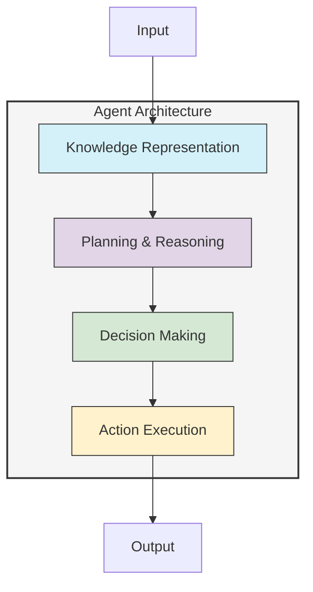

# Autonomous Agents Guide

This guide provides comprehensive instructions for implementing and using autonomous agents with UltraLink. Whether you're building AI assistants, automated data processors, or multi-agent systems, UltraLink provides powerful capabilities for knowledge representation and reasoning.



## Overview

Autonomous agents are software entities that can perceive their environment, reason about their goals, and take actions to achieve those goals with minimal human intervention. UltraLink provides a powerful foundation for building autonomous agents by offering:

1. **Rich Knowledge Representation**: Store and structure domain knowledge, agent beliefs, and world models
2. **Vector Embeddings**: Enable semantic understanding and similarity-based reasoning
3. **Temporal Tracking**: Monitor changes and evolution of knowledge over time
4. **Flexible Querying**: Access relevant information using precise queries or semantic similarity
5. **Extensible Architecture**: Integrate with external systems, APIs, and tools

## Getting Started with Agent Development

### Basic Agent Architecture

A typical autonomous agent built with UltraLink includes these components:

```javascript
const { UltraLink } = require('ultralink');

class AutonomousAgent {
  constructor(options = {}) {
    // Initialize the knowledge base
    this.knowledgeBase = new UltraLink({
      vectors: { enabled: true, dimensions: 384 },
      temporal: { enabled: true },
      ...options
    });
    
    // Agent state
    this.currentTask = null;
    this.goals = [];
    this.observations = [];
    
    // Configure the agent
    this.initializeAgentSchema();
    this.loadInitialKnowledge();
  }
  
  initializeAgentSchema() {
    // Define entity types for the agent's knowledge
    this.knowledgeBase.defineEntityType('task', {
      attributes: {
        name: { type: 'string', required: true },
        description: { type: 'text' },
        priority: { type: 'number', default: 1 },
        status: { type: 'enum', values: ['pending', 'in-progress', 'completed', 'failed'] },
        deadline: { type: 'date' }
      }
    });
    
    this.knowledgeBase.defineEntityType('fact', {
      attributes: {
        statement: { type: 'text', required: true },
        confidence: { type: 'number', default: 1.0 },
        source: { type: 'string' },
        verified: { type: 'boolean', default: false }
      }
    });
    
    this.knowledgeBase.defineEntityType('action', {
      attributes: {
        name: { type: 'string', required: true },
        description: { type: 'text' },
        parameters: { type: 'object' },
        expectedOutcome: { type: 'text' },
        successRate: { type: 'number', default: 0.5 }
      }
    });
  }
  
  loadInitialKnowledge() {
    // Load domain-specific knowledge
    // This will vary based on the agent's purpose
  }
  
  // Core agent functions
  perceive(observation) {
    // Process and store new information
    const obsId = `obs-${Date.now()}`;
    this.knowledgeBase.addEntity(obsId, 'fact', {
      statement: observation,
      source: 'perception',
      timestamp: new Date().toISOString()
    });
    
    this.observations.push(obsId);
    
    // Update beliefs based on new observation
    this.updateBeliefs(obsId);
  }
  
  updateBeliefs(newFactId) {
    // Reasoning logic to update the agent's beliefs
    // based on new information
  }
  
  planAction() {
    // Determine the next action based on goals and current state
    // Returns an action object
  }
  
  executeAction(action) {
    // Perform the selected action
    // Returns the result of the action
  }
  
  setGoal(goal) {
    // Add a new goal for the agent to pursue
    const goalId = `goal-${Date.now()}`;
    this.knowledgeBase.addEntity(goalId, 'task', {
      name: goal.name,
      description: goal.description,
      priority: goal.priority || 1,
      status: 'pending'
    });
    
    this.goals.push(goalId);
  }
  
  // The main agent loop
  async run() {
    while (this.hasActiveGoals()) {
      // 1. Select the highest priority goal
      const currentGoal = this.selectGoal();
      
      // 2. Plan an action to achieve the goal
      const nextAction = this.planAction(currentGoal);
      
      // 3. Execute the action
      const result = await this.executeAction(nextAction);
      
      // 4. Process the result and update knowledge
      this.processActionResult(nextAction, result);
      
      // 5. Update goal status
      this.updateGoalStatus(currentGoal);
    }
  }
  
  // Helper methods...
}
```

## Integrating with LLMs

UltraLink works well with Large Language Models to create more capable agents:

```javascript
const { UltraLink } = require('ultralink');
const { OpenAI } = require('openai');

class LLMPoweredAgent {
  constructor() {
    this.knowledgeBase = new UltraLink({
      vectors: { enabled: true, dimensions: 1536 },
      temporal: { enabled: true }
    });
    
    this.llm = new OpenAI({
      apiKey: process.env.OPENAI_API_KEY
    });
    
    this.initializeAgentSchema();
  }
  
  async generateResponse(query, context) {
    // Retrieve relevant knowledge
    const relevantFacts = await this.knowledgeBase.findSimilar(query, {
      entityTypes: ['fact', 'entity', 'concept'],
      minSimilarity: 0.7,
      limit: 5
    });
    
    // Format context for the LLM
    const formattedContext = this.formatContextForLLM(relevantFacts);
    
    // Generate response using the LLM
    const completion = await this.llm.completions.create({
      model: "gpt-4-turbo",
      messages: [
        {
          role: "system",
          content: "You are a helpful assistant. Use the following information to answer the query."
        },
        {
          role: "user",
          content: `Context information:\n${formattedContext}\n\nQuery: ${query}`
        }
      ],
      max_tokens: 500
    });
    
    // Extract and store new knowledge from the response
    this.extractAndStoreKnowledge(completion.choices[0].message.content);
    
    return completion.choices[0].message.content;
  }
  
  // Helper methods for knowledge extraction, formatting, etc.
}
```

## Multi-Agent Systems

UltraLink can be used to build systems of multiple cooperating agents:

```javascript
class AgentNetwork {
  constructor() {
    // Shared knowledge base for all agents
    this.sharedKnowledge = new UltraLink({
      vectors: { enabled: true },
      temporal: { enabled: true }
    });
    
    // Individual agents
    this.agents = {};
  }
  
  createAgent(agentId, spec) {
    // Create a new agent with access to shared knowledge
    this.agents[agentId] = new SpecializedAgent(
      agentId, 
      this.sharedKnowledge,
      spec
    );
    
    return this.agents[agentId];
  }
  
  async broadcastMessage(from, message, recipients = 'all') {
    // Send a message to specified agents or all agents
    const targets = recipients === 'all' 
      ? Object.keys(this.agents) 
      : recipients;
    
    for (const agentId of targets) {
      if (agentId !== from) {
        await this.agents[agentId].receiveMessage(from, message);
      }
    }
  }
  
  // Network coordination methods
}

class SpecializedAgent {
  constructor(id, sharedKnowledge, spec) {
    this.id = id;
    this.specialty = spec.specialty;
    this.sharedKnowledge = sharedKnowledge;
    
    // Private knowledge only accessible to this agent
    this.privateKnowledge = new UltraLink();
  }
  
  async receiveMessage(from, message) {
    // Process incoming message
    console.log(`Agent ${this.id} received message from ${from}: ${message}`);
    
    // Update knowledge and potentially respond
    // ...
  }
  
  async shareKnowledge(knowledge) {
    // Add knowledge to the shared knowledge base
    // ...
  }
  
  // Agent-specific methods
}
```

## Debugging and Monitoring Agents

UltraLink provides tools for monitoring agent behavior and debugging:

```javascript
// Add this to your agent class
monitorAgent() {
  // Create a monitoring dashboard
  this.dashboard = this.knowledgeBase.createDashboard({
    title: 'Agent Monitoring',
    refreshInterval: 5000, // Update every 5 seconds
    metrics: [
      {
        name: 'Active Goals',
        query: () => this.goals.filter(g => 
          this.knowledgeBase.getEntity(g).attributes.status !== 'completed'
        ).length
      },
      {
        name: 'Knowledge Size',
        query: () => this.knowledgeBase.countEntities()
      },
      {
        name: 'Actions Executed',
        query: () => this.knowledgeBase.countEntities({
          type: 'action',
          filter: { status: 'executed' }
        })
      }
    ],
    visualizations: [
      {
        type: 'timeline',
        title: 'Agent Activity',
        query: () => this.knowledgeBase.findEntities({
          types: ['action', 'observation'],
          sort: 'timestamp'
        })
      },
      {
        type: 'network',
        title: 'Knowledge Graph',
        query: () => this.knowledgeBase.getSubgraph({
          depth: 2,
          startNodes: this.goals
        })
      }
    ]
  });
}
```

## Exporting Agent Knowledge

Agents can export their knowledge in various formats:

```javascript
async exportAgentKnowledge() {
  // Export to JSON
  await this.knowledgeBase.toJSON('agent-knowledge.json');
  
  // Export to HTML Website for visualization
  await this.knowledgeBase.toHTMLWebsite({
    directory: './agent-dashboard',
    title: 'Agent Knowledge Explorer',
    description: 'Interactive visualization of agent knowledge',
    includeSearch: true,
    includeTimeline: true
  });
  
  // Export to Obsidian for manual review
  await this.knowledgeBase.toObsidian({
    directory: './agent-knowledge-base',
    includeBacklinks: true,
    includeMetadata: true
  });
}
```

## Best Practices for Agent Development

### Knowledge Organization

- **Entity Types**: Create specific types for different knowledge components (facts, beliefs, goals, etc.)
- **Relationship Clarity**: Define clear relationship types between entities
- **Confidence Levels**: Track uncertainty in knowledge with confidence scores
- **Source Tracking**: Record where knowledge came from for verification

### Planning and Decision Making

- **Goal Hierarchies**: Break complex goals into subgoals
- **Utility Functions**: Define clear metrics for evaluating action outcomes
- **Fallback Strategies**: Always have backup plans when actions fail
- **Learning**: Update strategies based on past successes and failures

### Integration

- **API Documentation**: Maintain clear documentation for external service APIs
- **Rate Limiting**: Respect API rate limits for external services
- **Graceful Degradation**: Ensure agents function (with reduced capabilities) when services are unavailable
- **Logging**: Implement comprehensive logging for debugging and audit purposes

## Common Agent Patterns

### Reactive Agent

```javascript
class ReactiveAgent {
  constructor() {
    this.knowledgeBase = new UltraLink();
    this.rules = new Map();
  }
  
  addRule(condition, action) {
    this.rules.set(condition, action);
  }
  
  async perceive(input) {
    // Process input and update knowledge
    
    // Check each rule against current state
    for (const [condition, action] of this.rules.entries()) {
      if (await this.evaluateCondition(condition)) {
        await action();
      }
    }
  }
}
```

### BDI (Belief-Desire-Intention) Agent

```javascript
class BDIAgent {
  constructor() {
    this.beliefs = new UltraLink(); // Knowledge about the world
    this.desires = []; // Goals the agent wants to achieve
    this.intentions = []; // Current plan of action
  }
  
  // Update beliefs based on new information
  updateBeliefs(perception) { /*...*/ }
  
  // Generate desires based on current beliefs
  generateDesires() { /*...*/ }
  
  // Select which desires to pursue as intentions
  deliberate() { /*...*/ }
  
  // Generate plans to achieve intentions
  plan() { /*...*/ }
  
  // Execute the current plan
  execute() { /*...*/ }
  
  // Main agent cycle
  async run() {
    while (true) {
      const perception = await this.perceive();
      this.updateBeliefs(perception);
      
      if (this.shouldReconsiderDesires()) {
        this.generateDesires();
      }
      
      if (this.shouldDeliberate()) {
        this.deliberate();
      }
      
      if (this.shouldCreateNewPlan()) {
        this.plan();
      }
      
      const succeeded = await this.execute();
      
      // Update intentions based on execution results
      if (succeeded) {
        this.intentions.shift(); // Remove completed intention
      } else {
        // Replan or try alternative
      }
    }
  }
}
```

## Advanced Topics

### Vector-Based Reasoning

UltraLink's vector embeddings enable sophisticated reasoning:

```javascript
async semanticPlanning() {
  // Find concepts similar to current goal
  const similarConcepts = await this.knowledgeBase.findSimilar(
    this.currentGoal.description,
    { entityTypes: ['concept'], minSimilarity: 0.8 }
  );
  
  // Extract strategies from similar concepts
  const possibleStrategies = [];
  for (const concept of similarConcepts) {
    const strategies = await this.knowledgeBase.findLinks({
      source: concept.id,
      relationship: 'has_strategy'
    });
    possibleStrategies.push(...strategies);
  }
  
  // Select the most promising strategy
  return this.selectBestStrategy(possibleStrategies);
}
```

### Temporal Reasoning

Use UltraLink's temporal capabilities for reasoning about time:

```javascript
async predictFutureState(timeSteps) {
  // Get current state
  const currentState = await this.getCurrentState();
  
  // Get historical state transitions
  const transitions = await this.knowledgeBase.getTemporalSequence({
    entityType: 'state',
    timeRange: { from: '-30d', to: 'now' },
    sort: 'chronological'
  });
  
  // Create a transition model
  const model = this.buildTransitionModel(transitions);
  
  // Predict future states
  let predictedState = currentState;
  for (let i = 0; i < timeSteps; i++) {
    predictedState = model.predict(predictedState);
  }
  
  return predictedState;
}
```

## Conclusion

UltraLink provides a powerful foundation for building autonomous agents with sophisticated knowledge representation, reasoning capabilities, and integration options. By leveraging UltraLink's features for knowledge management, you can create agents that understand their environment, make informed decisions, and learn from experience.

For more information, see the [API Reference](../api-reference.md) for detailed documentation of all UltraLink capabilities relevant to agent development. 