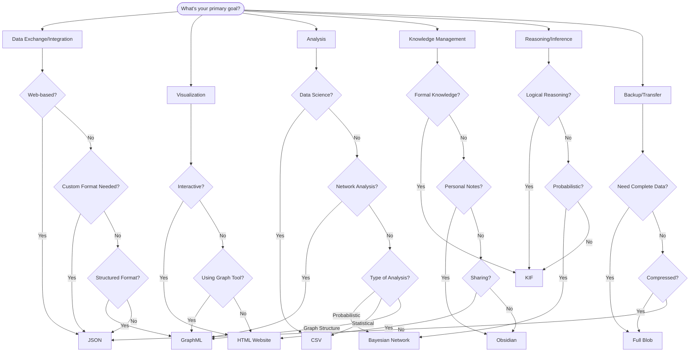
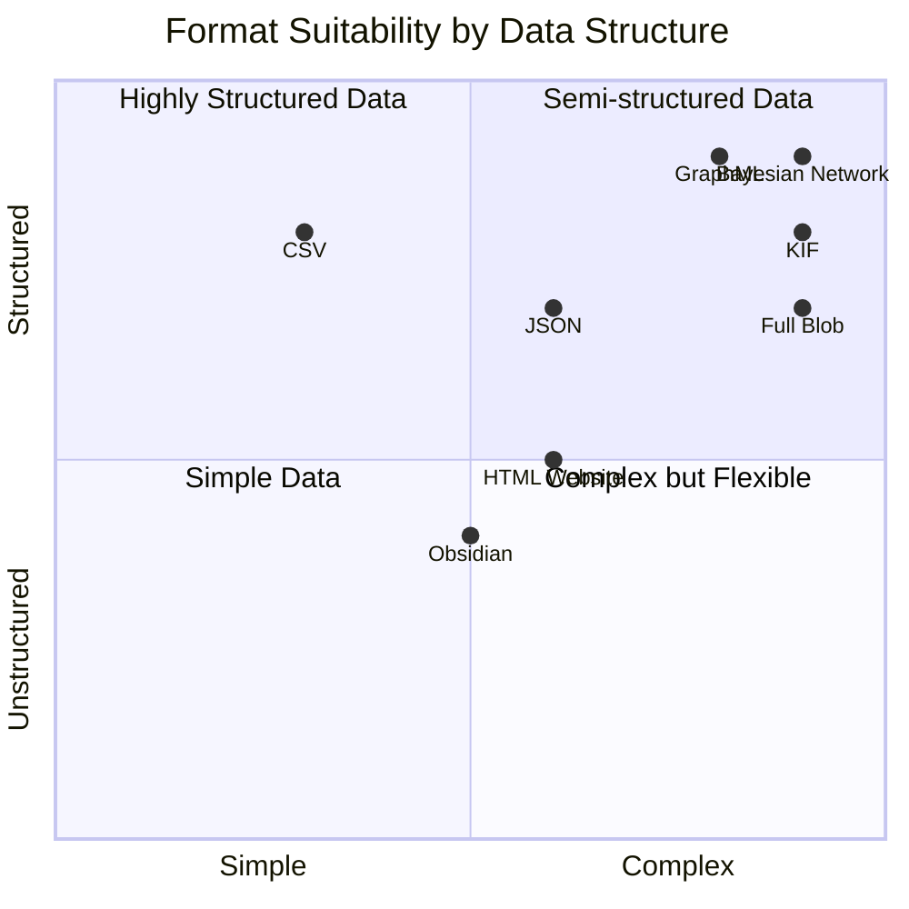
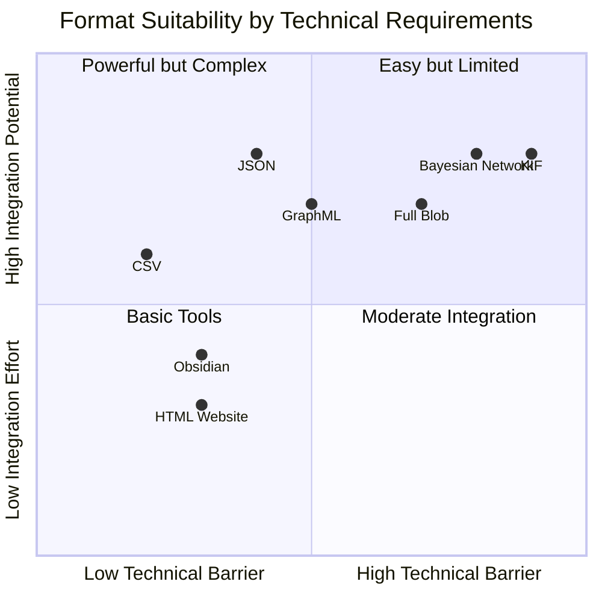
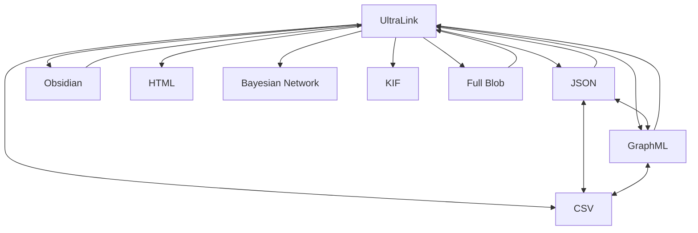

# Choosing the Right UltraLink Format

This guide will help you select the most appropriate export format for your specific needs when working with UltraLink.

## Format Selection Decision Tree

Start by considering your primary goal:



## Format Quick Reference

| Format | Best For | Not Ideal For | Example Use Case |
|--------|----------|---------------|------------------|
| **JSON** | Data integration, web apps, API responses | Network visualization, tabular analysis | Integrating with a web application |
| **GraphML** | Graph visualization, network analysis | Tabular data, formal knowledge representation | Visualizing relationships in Gephi |
| **CSV** | Data analysis, spreadsheets, statistical analysis | Knowledge representation, graph structure | Analyzing data patterns in Excel |
| **Obsidian** | Personal knowledge management, documentation | Data processing, formal reasoning | Creating a personal knowledge base |
| **HTML Website** | Interactive exploration, sharing, presentations | Data processing, system integration | Sharing insights with stakeholders |
| **Bayesian Network** | Probabilistic reasoning, causal inference | Tabular analysis, documentation | Modeling uncertainty and causality |
| **KIF** | Formal knowledge representation, logical reasoning | Direct visualization, tabular analysis | Integrating with AI reasoning systems |
| **Full Blob** | Complete backups, system transfers | Sharing with external systems, browsing | Creating complete system backups |

## Format Comparison by Requirements

### Data Structure Requirements



### Technical Requirements



## Detailed Format Considerations

### JSON Format

**Choose when you need:**
- Web application integration
- A widely supported, language-agnostic format
- Programmatic access to data
- Flexible schema

**Example code:**
```javascript
// Export to JSON
const jsonData = await ultralink.toJSON({
  includeMetadata: true,
  prettyPrint: true
});

// Use in web application
fetch('/api/data', {
  method: 'POST',
  headers: { 'Content-Type': 'application/json' },
  body: jsonData
});
```

### GraphML Format

**Choose when you need:**
- To visualize network data
- To use graph analysis tools like Gephi or Cytoscape
- XML-based format with schema validation
- Graphical representation of relationships

**Example code:**
```javascript
// Export to GraphML
const graphml = await ultralink.toGraphML({
  includeAllAttributes: true,
  prettyPrint: true
});

// Save for use with Gephi
fs.writeFileSync('network.graphml', graphml);
```

### CSV Format

**Choose when you need:**
- Spreadsheet compatibility
- Statistical analysis
- Data science workflows
- Tabular representation

**Example code:**
```javascript
// Export to CSV
const csvOutput = await ultralink.toCSV();

// Save entity and relationship data
fs.writeFileSync('entities.csv', csvOutput.entities);
fs.writeFileSync('relationships.csv', csvOutput.relationships);
```

### Obsidian Format

**Choose when you need:**
- Knowledge management
- Wiki-style documentation
- Human-readable notes
- Bidirectional links

**Example code:**
```javascript
// Export to Obsidian
await ultralink.toObsidian({
  directory: './obsidian-vault',
  includeBacklinks: true,
  includeTags: true
});
```

### HTML Website Format

**Choose when you need:**
- Interactive exploration
- Shareable visualization
- Self-contained presentation
- User-friendly interface

**Example code:**
```javascript
// Export to HTML Website
await ultralink.toHTMLWebsite({
  directory: './knowledge-website',
  title: 'Knowledge Explorer',
  theme: 'academic',
  includeSearch: true
});
```

### Bayesian Network Format

**Choose when you need:**
- Probabilistic reasoning
- Causal inference
- Uncertainty modeling
- Integration with Bayesian tools

**Example code:**
```javascript
// Export to Bayesian Network format
const bayesianOutput = await ultralink.toBayesianNetwork({
  outputFormat: 'bif',  // or 'json'
  includeParameters: true,
  nodeTypeMapping: {
    'person': 'discrete',
    'event': 'discrete'
  }
});

// Save for use with Bayesian tools
fs.writeFileSync('model.bif', bayesianOutput);
```

### Knowledge Interchange Format (KIF)

**Choose when you need:**
- Formal knowledge representation
- Logical reasoning
- Integration with AI systems
- Rich semantic expressivity

**Example code:**
```javascript
// Export to KIF
const kifOutput = await ultralink.toKIF({
  includeMetaKnowledge: true,
  includeRules: true,
  prettyPrint: true
});

// Save for integration with reasoning systems
fs.writeFileSync('knowledge_base.kif', kifOutput);
```

### Full Blob Format

**Choose when you need:**
- Complete system backup
- State transfer between systems
- Persistence with full fidelity
- Including vector embeddings and history

**Example code:**
```javascript
// Export to Full Blob
const blob = await ultralink.toFullBlob({
  compress: true,
  includeVectors: true,
  includeHistory: true
});

// Save for later restoration
fs.writeFileSync('ultralink_backup.blob', blob);
```

## Common Scenarios and Recommended Formats

### Academic Research

| Task | Recommended Format | Why |
|------|-------------------|-----|
| Literature review | Obsidian | Good for organizing papers and notes with connections |
| Data analysis | CSV | Compatible with R, Python, and statistical tools |
| Publishing findings | HTML Website | Interactive visualization for papers and presentations |
| Formal knowledge modeling | KIF | Formal representation of domain knowledge |
| Causal modeling | Bayesian Network | Modeling probabilistic relationships in experimental data |

### Business Intelligence

| Task | Recommended Format | Why |
|------|-------------------|-----|
| Data integration | JSON | Flexible integration with BI tools and APIs |
| Network analysis | GraphML | Understanding organizational relationships |
| Reporting | CSV | Easy import into Excel and BI tools |
| Knowledge sharing | HTML Website | Shareable insights across the organization |
| Decision modeling | Bayesian Network | Quantifying uncertainty in business decisions |

### Software Development

| Task | Recommended Format | Why |
|------|-------------------|-----|
| API integration | JSON | Standard for web APIs and integrations |
| Documentation | Obsidian | Connected documentation with code references |
| System architecture | GraphML | Visualizing component relationships |
| Knowledge sharing | HTML Website | Team knowledge portal |
| System backup | Full Blob | Complete system state with history |

## Format Interconversion

Sometimes you may need to convert between formats. UltraLink supports this workflow:



## Combining Multiple Formats

For complex projects, consider using multiple formats for different aspects:

```javascript
// Export in multiple formats for different use cases
async function exportProject(ultralink, projectName) {
  const outputDir = `./output/${projectName}`;
  
  // For data analysis
  await ultralink.toCSV({
    directory: `${outputDir}/analysis`
  });
  
  // For visualization
  await ultralink.toGraphML({
    filename: `${outputDir}/visualization/${projectName}.graphml`
  });
  
  // For documentation
  await ultralink.toObsidian({
    directory: `${outputDir}/docs`
  });
  
  // For sharing
  await ultralink.toHTMLWebsite({
    directory: `${outputDir}/website`,
    title: `${projectName} Knowledge Explorer`
  });
  
  // For backup
  await ultralink.toFullBlob({
    filename: `${outputDir}/backup/${projectName}.blob`,
    compress: true
  });
  
  console.log(`Exported ${projectName} in multiple formats to ${outputDir}`);
}
```

## Conclusion

Selecting the right format depends on your specific use case, target audience, and technical requirements. By understanding the strengths and limitations of each format, you can make an informed choice that maximizes the value of your UltraLink data.

For more details on each format, refer to the individual format documentation:

- [JSON Format](../formats/JSON_FORMAT.md)
- [GraphML Format](../formats/GRAPHML_FORMAT.md)
- [CSV Format](../formats/CSV_FORMAT.md)
- [Obsidian Format](../formats/OBSIDIAN_FORMAT.md)
- [HTML Website Format](../formats/HTML_WEBSITE_FORMAT.md)
- [Bayesian Network Format](../formats/BAYESIAN_NETWORK_FORMAT.md)
- [Knowledge Interchange Format (KIF)](../formats/KIF_FORMAT.md)
- [Full Blob Format](../formats/FULL_BLOB_FORMAT.md)
- [Visualization Format](../formats/VISUALIZATION_FORMAT.md) 