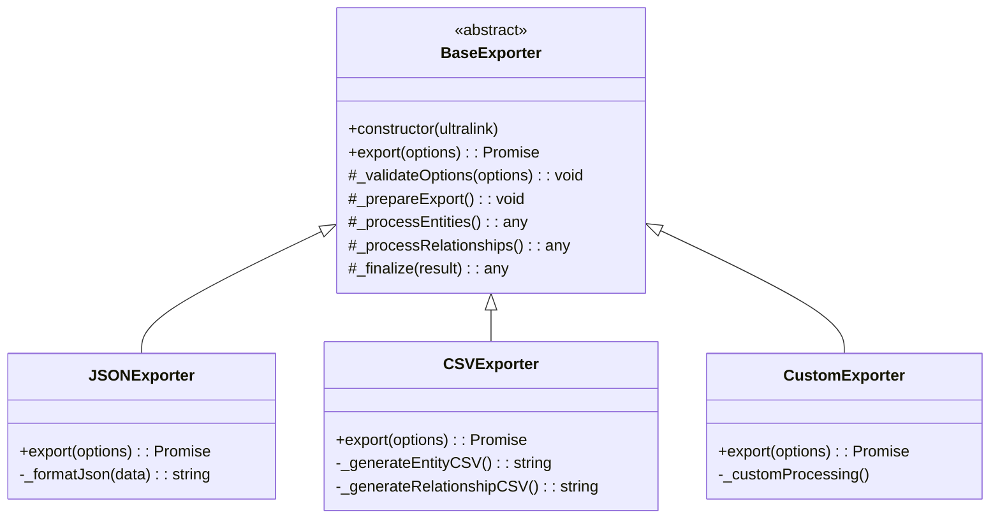

# Creating Custom Exporters for UltraLink

This guide explains how to extend UltraLink with custom exporters to support additional output formats beyond the built-in ones.

## Table of Contents

- [Overview](#overview)
- [Exporter Architecture](#exporter-architecture)
- [Creating a Basic Exporter](#creating-a-basic-exporter)
- [Advanced Exporter Features](#advanced-exporter-features)
- [Registration and Usage](#registration-and-usage)
- [Testing Custom Exporters](#testing-custom-exporters)
- [Best Practices](#best-practices)
- [Examples](#examples)

## Overview

UltraLink provides built-in exporters for common formats like JSON, GraphML, CSV, and others. However, you may need to export to a specialized or proprietary format not included in the core library. The exporter system is designed to be extensible, allowing you to create custom exporters that integrate seamlessly with the UltraLink API.

## Exporter Architecture

UltraLink exporters follow a simple but flexible architecture:



All exporters inherit from a `BaseExporter` class that provides the core functionality and structure. Each specific exporter implements the necessary methods to handle its particular format requirements.

## Creating a Basic Exporter

### Step 1: Create the Exporter Class

First, create a new class that extends the `BaseExporter`:

```javascript
// myapp/custom-yaml-exporter.js
const { BaseExporter } = require('ultralink');
const yaml = require('yaml'); // Assuming you're using the 'yaml' package

class YAMLExporter extends BaseExporter {
  constructor(ultralink) {
    super(ultralink);
  }
  
  async export(options = {}) {
    // Validate options
    this._validateOptions(options);
    
    // Prepare for export
    this._prepareExport();
    
    // Create the data structure to export
    const data = {
      entities: this._processEntities(options),
      relationships: this._processRelationships(options)
    };
    
    // Convert to YAML and return
    return yaml.stringify(data);
  }
  
  _validateOptions(options) {
    // Any specific validation for YAML options
    super._validateOptions(options);
  }
  
  _processEntities(options) {
    // Get all entities and process them for YAML export
    const entities = [];
    
    for (const entity of this.ultralink.getAllEntities()) {
      // Transform entity into appropriate format
      entities.push({
        id: entity.id,
        type: entity.type,
        attributes: entity.attributes,
        // Include metadata if specified in options
        ...(options.includeMetadata ? { metadata: entity.metadata } : {})
      });
    }
    
    return entities;
  }
  
  _processRelationships(options) {
    // Get all relationships and process them for YAML export
    const relationships = [];
    
    for (const relationship of this.ultralink.getAllRelationships()) {
      // Transform relationship into appropriate format
      relationships.push({
        source: relationship.source,
        target: relationship.target,
        type: relationship.type,
        attributes: relationship.attributes,
        // Include metadata if specified in options
        ...(options.includeMetadata ? { metadata: relationship.metadata } : {})
      });
    }
    
    return relationships;
  }
}

module.exports = YAMLExporter;
```

### Step 2: Implement the Export Method

The key method to implement is `export(options)`, which should:

1. Validate the provided options
2. Extract and process entities and relationships
3. Transform the data into the target format
4. Return the formatted output

The `export` method should handle any format-specific processing or options.

### Step 3: Define Exporter Options

Document and validate the options specific to your exporter:

```javascript
/**
 * @typedef {Object} YAMLExportOptions
 * @property {boolean} [includeMetadata=true] - Whether to include metadata in the export
 * @property {boolean} [flowStyle=false] - Whether to use flow style YAML notation
 * @property {number} [indent=2] - Indentation level
 */

// In the _validateOptions method:
_validateOptions(options) {
  super._validateOptions(options);
  
  // Set defaults
  options.includeMetadata = options.includeMetadata ?? true;
  options.flowStyle = options.flowStyle ?? false;
  options.indent = options.indent ?? 2;
  
  // Validate types
  if (typeof options.includeMetadata !== 'boolean') {
    throw new Error('includeMetadata option must be a boolean');
  }
  
  if (typeof options.flowStyle !== 'boolean') {
    throw new Error('flowStyle option must be a boolean');
  }
  
  if (typeof options.indent !== 'number' || options.indent < 0) {
    throw new Error('indent option must be a non-negative number');
  }
}
```

## Advanced Exporter Features

### Streaming Support

For large datasets, you might want to support streaming to avoid memory issues:

```javascript
async exportStream(options = {}) {
  const { Readable } = require('stream');
  
  // Validate options
  this._validateOptions(options);
  
  // Create the header
  const header = '---\n';
  
  // Create a readable stream
  const stream = new Readable({
    objectMode: true,
    read() {}
  });
  
  // Push the header to the stream
  stream.push(header);
  
  // Get entities in batches to avoid memory issues
  const entityBatches = this.ultralink.getEntitiesBatched({
    batchSize: options.batchSize || 100
  });
  
  // Process entity batches
  stream.push('entities:\n');
  
  for await (const batch of entityBatches) {
    const entitiesYaml = yaml.stringify(
      batch.map(entity => ({
        id: entity.id,
        type: entity.type,
        attributes: entity.attributes,
        ...(options.includeMetadata ? { metadata: entity.metadata } : {})
      }))
    );
    
    stream.push(entitiesYaml);
  }
  
  // Process relationships similarly...
  stream.push('relationships:\n');
  
  // Process relationship batches
  // ...
  
  // End the stream
  stream.push(null);
  
  return stream;
}
```

### File System Integration

If your exporter needs to write multiple files (like the Obsidian exporter), implement file handling:

```javascript
async exportToDirectory(directory, options = {}) {
  const fs = require('fs').promises;
  const path = require('path');
  
  // Ensure directory exists
  try {
    await fs.mkdir(directory, { recursive: true });
  } catch (error) {
    throw new Error(`Failed to create directory: ${error.message}`);
  }
  
  // Generate the YAML data
  const yamlData = await this.export(options);
  
  // Write to file
  const filePath = path.join(directory, 'ultralink-export.yaml');
  await fs.writeFile(filePath, yamlData, 'utf8');
  
  return {
    directory,
    files: ['ultralink-export.yaml'],
    mainFile: 'ultralink-export.yaml'
  };
}
```

### Progress Reporting

For long-running exports, implement progress reporting:

```javascript
async export(options = {}) {
  // Validate options
  this._validateOptions(options);
  
  // Setup progress tracking
  const totalEntities = this.ultralink.countEntities();
  const totalRelationships = this.ultralink.countRelationships();
  const totalSteps = totalEntities + totalRelationships;
  let completedSteps = 0;
  
  // Report initial progress
  if (options.onProgress) {
    options.onProgress({
      phase: 'starting',
      progress: 0,
      total: totalSteps
    });
  }
  
  // Process entities
  const entities = [];
  const allEntities = this.ultralink.getAllEntities();
  
  for (const entity of allEntities) {
    entities.push({
      id: entity.id,
      type: entity.type,
      attributes: entity.attributes,
      ...(options.includeMetadata ? { metadata: entity.metadata } : {})
    });
    
    completedSteps++;
    
    // Report progress
    if (options.onProgress && completedSteps % 100 === 0) {
      options.onProgress({
        phase: 'processing_entities',
        progress: completedSteps,
        total: totalSteps
      });
    }
  }
  
  // Process relationships similarly with progress reporting
  
  // Final progress report
  if (options.onProgress) {
    options.onProgress({
      phase: 'completed',
      progress: totalSteps,
      total: totalSteps
    });
  }
  
  // Return the final result
  return yaml.stringify({
    entities,
    relationships
  });
}
```

## Registration and Usage

### Registering Your Custom Exporter

To make your exporter available through the UltraLink API, you need to register it:

```javascript
const { UltraLink } = require('ultralink');
const YAMLExporter = require('./custom-yaml-exporter');

// Create UltraLink instance
const ultralink = new UltraLink();

// Register the custom exporter
ultralink.registerExporter('yaml', YAMLExporter);

// Now you can use it
const yamlData = await ultralink.export('yaml', { flowStyle: true });
```

### Integration with UltraLink API

For a more seamless integration, you can add a convenience method to the UltraLink class by extending it:

```javascript
const { UltraLink } = require('ultralink');
const YAMLExporter = require('./custom-yaml-exporter');

// Extend the UltraLink class
class ExtendedUltraLink extends UltraLink {
  constructor(options) {
    super(options);
    this.registerExporter('yaml', YAMLExporter);
  }
  
  // Add a convenience method
  async toYAML(options = {}) {
    return this.export('yaml', options);
  }
}

// Usage
const ultralink = new ExtendedUltraLink();
const yamlData = await ultralink.toYAML({ flowStyle: true });
```

## Testing Custom Exporters

### Unit Testing

Here's an example of how to unit test your custom exporter:

```javascript
const { UltraLink } = require('ultralink');
const YAMLExporter = require('./custom-yaml-exporter');
const yaml = require('yaml');

describe('YAMLExporter', () => {
  let ultralink;
  let exporter;
  
  beforeEach(() => {
    // Create a fresh UltraLink instance
    ultralink = new UltraLink();
    
    // Add some test data
    ultralink.addEntity('person1', 'person', { name: 'Alice' });
    ultralink.addEntity('person2', 'person', { name: 'Bob' });
    ultralink.addLink('person1', 'person2', 'knows', { since: 2020 });
    
    // Create the exporter
    exporter = new YAMLExporter(ultralink);
  });
  
  test('exports basic YAML format', async () => {
    const result = await exporter.export();
    const parsed = yaml.parse(result);
    
    // Verify structure
    expect(parsed).toHaveProperty('entities');
    expect(parsed).toHaveProperty('relationships');
    
    // Verify entities
    expect(parsed.entities).toHaveLength(2);
    expect(parsed.entities[0]).toHaveProperty('id', 'person1');
    expect(parsed.entities[0].attributes).toHaveProperty('name', 'Alice');
    
    // Verify relationships
    expect(parsed.relationships).toHaveLength(1);
    expect(parsed.relationships[0]).toHaveProperty('source', 'person1');
    expect(parsed.relationships[0]).toHaveProperty('target', 'person2');
    expect(parsed.relationships[0]).toHaveProperty('type', 'knows');
  });
  
  test('respects includeMetadata option', async () => {
    // Test with metadata included
    let result = await exporter.export({ includeMetadata: true });
    let parsed = yaml.parse(result);
    expect(parsed.entities[0]).toHaveProperty('metadata');
    
    // Test with metadata excluded
    result = await exporter.export({ includeMetadata: false });
    parsed = yaml.parse(result);
    expect(parsed.entities[0]).not.toHaveProperty('metadata');
  });
  
  // Additional tests for other options and behaviors...
});
```

### Integration Testing

Test the integration with the UltraLink API:

```javascript
describe('YAML Export Integration', () => {
  let ultralink;
  
  beforeEach(() => {
    // Create an extended UltraLink instance
    const ExtendedUltraLink = require('./extended-ultralink');
    ultralink = new ExtendedUltraLink();
    
    // Add test data
    // ...
  });
  
  test('toYAML method works correctly', async () => {
    const result = await ultralink.toYAML();
    const parsed = yaml.parse(result);
    
    // Verify the result
    // ...
  });
  
  test('export method works with yaml format', async () => {
    const result = await ultralink.export('yaml');
    const parsed = yaml.parse(result);
    
    // Verify the result
    // ...
  });
});
```

## Best Practices

### Performance Considerations

- For large graphs, implement streaming exports to manage memory usage
- Process entities and relationships in batches
- Consider implementing caching for repeated operations
- Handle performance edge cases (e.g., very large attribute values)

### Error Handling

- Provide clear error messages with specific details
- Handle unexpected input gracefully
- Validate all user-provided options thoroughly
- Use dedicated error classes for different types of failures

```javascript
class YAMLExportError extends Error {
  constructor(message, context = {}) {
    super(message);
    this.name = 'YAMLExportError';
    this.context = context;
  }
}

// Usage
if (!fs.existsSync(directory)) {
  throw new YAMLExportError('Export directory does not exist', { directory });
}
```

### Documentation

- Document all options and their default values
- Provide examples of common use cases
- Add JSDoc comments for IDE integration
- Include information about performance characteristics

### Maintainability

- Keep your exporter modular and focused
- Separate format-specific logic from general processing
- Avoid duplicating code across exporters
- Write comprehensive tests to ensure future changes don't break functionality

## Examples

### Complete YAML Exporter Example

```javascript
// custom-yaml-exporter.js
const { BaseExporter, ExportError } = require('ultralink');
const yaml = require('yaml');
const fs = require('fs').promises;
const path = require('path');

/**
 * @typedef {Object} YAMLExportOptions
 * @property {boolean} [includeMetadata=true] - Whether to include metadata
 * @property {boolean} [flowStyle=false] - Whether to use flow style YAML
 * @property {number} [indent=2] - Indentation level
 * @property {boolean} [compact=false] - Whether to use compact output
 * @property {function} [onProgress] - Progress callback function
 */

/**
 * Exporter for YAML format
 */
class YAMLExporter extends BaseExporter {
  /**
   * Create a new YAML exporter
   * @param {UltraLink} ultralink - UltraLink instance
   */
  constructor(ultralink) {
    super(ultralink);
  }
  
  /**
   * Export UltraLink data to YAML format
   * @param {YAMLExportOptions} options - Export options
   * @returns {Promise<string>} YAML string
   */
  async export(options = {}) {
    // Validate options
    this._validateOptions(options);
    
    // Setup progress tracking
    const totalSteps = this._calculateTotalSteps();
    let completedSteps = 0;
    
    // Initial progress
    this._reportProgress(options, 'starting', completedSteps, totalSteps);
    
    // Process entities
    const entities = await this._processEntities(options, progress => {
      completedSteps += progress;
      this._reportProgress(options, 'processing_entities', completedSteps, totalSteps);
    });
    
    // Process relationships
    const relationships = await this._processRelationships(options, progress => {
      completedSteps += progress;
      this._reportProgress(options, 'processing_relationships', completedSteps, totalSteps);
    });
    
    // Build the final data structure
    const data = { entities, relationships };
    
    // Final progress
    this._reportProgress(options, 'finalizing', totalSteps, totalSteps);
    
    // Convert to YAML and return
    try {
      const yamlString = yaml.stringify(data, {
        indent: options.indent,
        flowStyle: options.flowStyle,
        lineWidth: options.compact ? 0 : 80
      });
      
      this._reportProgress(options, 'completed', totalSteps, totalSteps);
      
      return yamlString;
    } catch (error) {
      throw new ExportError('Failed to generate YAML', {
        originalError: error,
        format: 'yaml',
        cause: error.message
      });
    }
  }
  
  /**
   * Export UltraLink data to a file
   * @param {string} filePath - Path to save the file
   * @param {YAMLExportOptions} options - Export options
   * @returns {Promise<Object>} Export result
   */
  async exportToFile(filePath, options = {}) {
    // Generate YAML
    const yamlData = await this.export(options);
    
    // Ensure directory exists
    const directory = path.dirname(filePath);
    
    try {
      await fs.mkdir(directory, { recursive: true });
    } catch (error) {
      throw new ExportError('Failed to create directory', {
        directory,
        originalError: error
      });
    }
    
    // Write file
    try {
      await fs.writeFile(filePath, yamlData, 'utf8');
      
      return {
        path: filePath,
        format: 'yaml',
        size: yamlData.length
      };
    } catch (error) {
      throw new ExportError('Failed to write YAML file', {
        filePath,
        originalError: error
      });
    }
  }
  
  /**
   * Validate export options
   * @param {YAMLExportOptions} options - Options to validate
   * @private
   */
  _validateOptions(options) {
    // Set defaults
    options.includeMetadata = options.includeMetadata ?? true;
    options.flowStyle = options.flowStyle ?? false;
    options.indent = options.indent ?? 2;
    options.compact = options.compact ?? false;
    
    // Validate types
    if (typeof options.includeMetadata !== 'boolean') {
      throw new ExportError('includeMetadata option must be a boolean', {
        option: 'includeMetadata',
        provided: options.includeMetadata
      });
    }
    
    if (typeof options.flowStyle !== 'boolean') {
      throw new ExportError('flowStyle option must be a boolean', {
        option: 'flowStyle',
        provided: options.flowStyle
      });
    }
    
    if (typeof options.indent !== 'number' || options.indent < 0) {
      throw new ExportError('indent option must be a non-negative number', {
        option: 'indent',
        provided: options.indent
      });
    }
    
    if (typeof options.compact !== 'boolean') {
      throw new ExportError('compact option must be a boolean', {
        option: 'compact',
        provided: options.compact
      });
    }
    
    if (options.onProgress !== undefined && typeof options.onProgress !== 'function') {
      throw new ExportError('onProgress option must be a function', {
        option: 'onProgress',
        provided: typeof options.onProgress
      });
    }
  }
  
  /**
   * Calculate total steps for progress reporting
   * @returns {number} Total steps
   * @private
   */
  _calculateTotalSteps() {
    return this.ultralink.countEntities() + this.ultralink.countRelationships();
  }
  
  /**
   * Report progress if a progress callback is provided
   * @param {YAMLExportOptions} options - Export options
   * @param {string} phase - Current phase
   * @param {number} progress - Current progress
   * @param {number} total - Total steps
   * @private
   */
  _reportProgress(options, phase, progress, total) {
    if (options.onProgress) {
      options.onProgress({
        phase,
        progress,
        total,
        percentage: Math.round((progress / total) * 100)
      });
    }
  }
  
  /**
   * Process entities
   * @param {YAMLExportOptions} options - Export options
   * @param {function} progressCallback - Progress callback
   * @returns {Promise<Array>} Processed entities
   * @private
   */
  async _processEntities(options, progressCallback) {
    const entities = [];
    const allEntities = await this.ultralink.getAllEntities();
    let progress = 0;
    
    for (const entity of allEntities) {
      entities.push({
        id: entity.id,
        type: entity.type,
        attributes: entity.attributes,
        ...(options.includeMetadata ? { metadata: entity.metadata } : {})
      });
      
      progress++;
      
      // Report progress every 100 entities
      if (progress % 100 === 0) {
        progressCallback(progress);
        progress = 0;
      }
    }
    
    // Report any remaining progress
    if (progress > 0) {
      progressCallback(progress);
    }
    
    return entities;
  }
  
  /**
   * Process relationships
   * @param {YAMLExportOptions} options - Export options
   * @param {function} progressCallback - Progress callback
   * @returns {Promise<Array>} Processed relationships
   * @private
   */
  async _processRelationships(options, progressCallback) {
    const relationships = [];
    const allRelationships = await this.ultralink.getAllRelationships();
    let progress = 0;
    
    for (const relationship of allRelationships) {
      relationships.push({
        source: relationship.source,
        target: relationship.target,
        type: relationship.type,
        attributes: relationship.attributes,
        ...(options.includeMetadata ? { metadata: relationship.metadata } : {})
      });
      
      progress++;
      
      // Report progress every 100 relationships
      if (progress % 100 === 0) {
        progressCallback(progress);
        progress = 0;
      }
    }
    
    // Report any remaining progress
    if (progress > 0) {
      progressCallback(progress);
    }
    
    return relationships;
  }
}

module.exports = YAMLExporter;
```

### UltraLink Extension Example

```javascript
// extended-ultralink.js
const { UltraLink } = require('ultralink');
const YAMLExporter = require('./custom-yaml-exporter');

/**
 * Extended UltraLink with YAML support
 */
class ExtendedUltraLink extends UltraLink {
  /**
   * Create a new ExtendedUltraLink instance
   * @param {Object} options - UltraLink options
   */
  constructor(options) {
    super(options);
    
    // Register the YAML exporter
    this.registerExporter('yaml', YAMLExporter);
  }
  
  /**
   * Export to YAML format
   * @param {YAMLExportOptions} options - Export options
   * @returns {Promise<string>} YAML string
   */
  async toYAML(options = {}) {
    return this.export('yaml', options);
  }
  
  /**
   * Export to YAML file
   * @param {string} filePath - Path to save the file
   * @param {YAMLExportOptions} options - Export options
   * @returns {Promise<Object>} Export result
   */
  async toYAMLFile(filePath, options = {}) {
    const exporter = this.getExporter('yaml');
    return exporter.exportToFile(filePath, options);
  }
}

module.exports = ExtendedUltraLink;
```

## Conclusion

Creating custom exporters allows you to extend UltraLink's capabilities to meet your specific needs. By following the patterns established in the built-in exporters and implementing the necessary methods, you can seamlessly integrate your custom formats into the UltraLink ecosystem.

Remember to:

1. Extend the `BaseExporter` class
2. Implement the `export` method
3. Validate and document your options
4. Consider performance for large datasets
5. Provide comprehensive error handling
6. Register your exporter with UltraLink
7. Write thorough tests

For more information, see the [UltraLink API Reference](../api/exporters-api.md) and the source code for the built-in exporters in the UltraLink repository. 