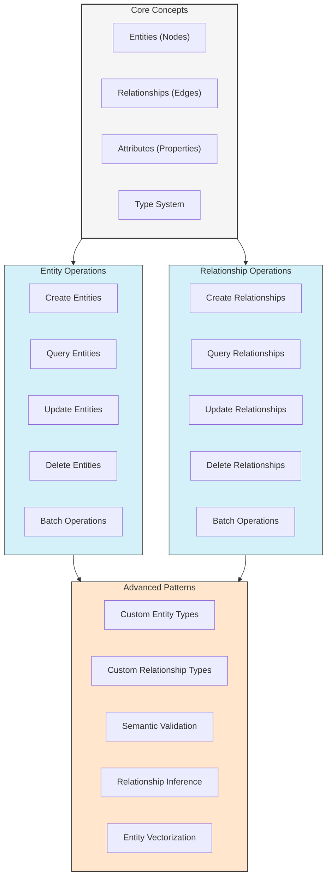
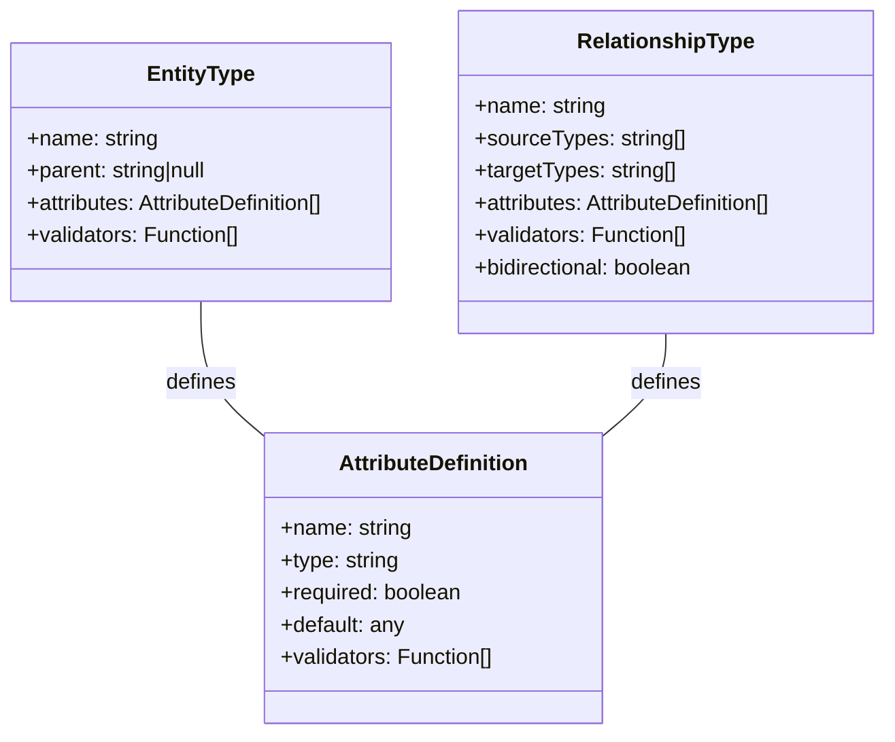

# Working with Entities and Relationships in UltraLink

This guide provides comprehensive examples and best practices for working with UltraLink's core building blocks: entities and relationships. These fundamental elements form the foundation of your knowledge graph.



## 1. Understanding the Core Concepts

### 1.1 Entities

Entities represent objects, concepts, or things in your knowledge domain. Each entity in UltraLink has:

- **Unique Identifier**: A string that uniquely identifies the entity
- **Type**: A semantic category that defines the entity's nature
- **Attributes**: Key-value pairs that describe the entity's properties

```javascript
// Basic entity structure
{
  id: "person-1",
  type: "person",
  attributes: {
    name: "Alice Chen",
    age: 32,
    expertise: ["machine learning", "data visualization"]
  }
}
```

### 1.2 Relationships

Relationships connect entities and define how they interact with each other. Each relationship has:

- **Source**: The entity where the relationship originates
- **Target**: The entity where the relationship points to
- **Type**: The semantic meaning of the connection
- **Attributes**: Additional properties that describe the relationship

```javascript
// Basic relationship structure
{
  source: "person-1",
  target: "project-a",
  type: "leads",
  attributes: {
    start_date: "2023-01-15",
    role: "project manager",
    allocation_percentage: 70
  }
}
```

### 1.3 Type System

UltraLink's type system provides structure and validation:



## 2. Creating and Managing Entities

### 2.1 Creating Entities

The basic syntax for creating entities:

```javascript
const entity = ultralink.addEntity(id, type, attributes, options);
```

Examples:

```javascript
// Creating a simple entity
const person = ultralink.addEntity('person-1', 'person', {
  name: 'Alice Chen',
  title: 'Data Scientist',
  expertise: ['machine learning', 'NLP', 'data visualization']
});

// Creating an entity with more options
const paper = ultralink.addEntity('paper-123', 'research_paper', {
  title: 'Advances in Neural Network Architectures',
  authors: ['Chen, A.', 'Kumar, R.', 'Smith, J.'],
  publication_date: '2023-06-15',
  doi: '10.1234/example.doi.123',
  keywords: ['neural networks', 'deep learning', 'architecture optimization']
}, {
  generateVector: true,                   // Automatically create vector embedding
  linkExisting: true,                     // Automatically connect to similar entities
  temporalTracking: true,                 // Track changes to this entity over time
  metadata: {                            // Additional metadata
    source: 'manual entry',
    verified: true
  }
});
```

### 2.2 Batch Entity Creation

For performance with large datasets:

```javascript
// Creating multiple entities at once
const entities = [
  {
    id: 'person-1',
    type: 'person',
    attributes: { name: 'Alice Chen', role: 'Researcher' }
  },
  {
    id: 'person-2',
    type: 'person',
    attributes: { name: 'Bob Smith', role: 'Engineer' }
  },
  {
    id: 'project-a',
    type: 'project',
    attributes: { name: 'Neural Interface', status: 'active' }
  }
];

// Batch add entities
await ultralink.addEntitiesBatch(entities);
```

### 2.3 Retrieving Entities

```javascript
// Get entity by ID
const entity = await ultralink.getEntity('person-1');

// Find entities based on criteria
const researchers = await ultralink.findEntities({
  type: 'person',
  attributes: {
    role: 'Researcher'
  }
});

// Complex query with operators
const seniorResearchers = await ultralink.findEntities({
  type: 'person',
  attributes: {
    role: 'Researcher',
    'experience_years': { $gte: 5 },
    'publications': { $exists: true }
  }
});

// Pagination
const results = await ultralink.findEntities({
  type: 'research_paper'
}, {
  skip: 20,    // Skip first 20 results
  limit: 10    // Return 10 results
});
```

### 2.4 Updating Entities

```javascript
// Update entity attributes
await ultralink.updateEntity('person-1', {
  title: 'Senior Data Scientist',
  expertise: ['machine learning', 'NLP', 'data visualization', 'causal inference']
});

// Partial update with options
await ultralink.updateEntity('person-1', {
  'contact.email': 'alice.chen@example.com'
}, {
  createPath: true,         // Create nested objects if they don't exist
  timestamp: new Date(),    // Record when this change happened
  author: 'system',         // Record who made this change
  reason: 'Adding contact information'  // Why the change was made
});
```

### 2.5 Deleting Entities

```javascript
// Delete a single entity
await ultralink.deleteEntity('project-archived');

// Delete with options
await ultralink.deleteEntity('project-archived', {
  cascade: true,              // Also delete relationships
  softDelete: true,           // Mark as deleted but don't remove
  timestamp: new Date(),      // When the deletion occurred
  author: 'admin'             // Who performed the deletion
});

// Delete multiple entities matching criteria
await ultralink.deleteEntities({
  type: 'task',
  attributes: {
    status: 'completed',
    completion_date: { $lt: '2023-01-01' }
  }
});
```

## 3. Creating and Managing Relationships

### 3.1 Creating Relationships

Basic syntax:

```javascript
const relationship = ultralink.addRelationship(sourceId, targetId, type, attributes, options);
```

Examples:

```javascript
// Creating a simple relationship
ultralink.addRelationship('person-1', 'project-a', 'leads', {
  start_date: '2023-01-15',
  role: 'project manager'
});

// Creating a relationship with more options
ultralink.addRelationship('paper-123', 'paper-456', 'cites', {
  context: 'Background methodology',
  page: 7,
  quote: 'As demonstrated by Chen et al...'
}, {
  bidirectional: false,           // One-way relationship
  weight: 0.8,                    // Strength/importance of relationship
  temporalTracking: true,         // Track changes to this relationship
  generateVector: true,           // Generate embedding for this relationship
  metadata: {
    source: 'automatic extraction',
    verified: false
  }
});
```

### 3.2 Batch Relationship Creation

```javascript
// Creating multiple relationships at once
const relationships = [
  {
    source: 'person-1',
    target: 'project-a',
    type: 'leads',
    attributes: { start_date: '2023-01-15' }
  },
  {
    source: 'person-2',
    target: 'project-a',
    type: 'contributes_to',
    attributes: { role: 'developer' }
  },
  {
    source: 'person-1',
    target: 'person-2',
    type: 'manages',
    attributes: { department: 'engineering' }
  }
];

// Batch add relationships
await ultralink.addRelationshipsBatch(relationships);
```

### 3.3 Retrieving Relationships

```javascript
// Get all relationships for an entity
const personRelationships = await ultralink.getRelationships('person-1');

// Get specific relationship types
const managementRelationships = await ultralink.getRelationships('person-1', {
  types: ['manages', 'reports_to']
});

// Get relationships with specific direction
const outgoingRelationships = await ultralink.getRelationships('person-1', {
  direction: 'outgoing'  // 'incoming', 'outgoing', or 'both'
});

// Find relationships based on criteria
const recentCollaborations = await ultralink.findRelationships({
  type: 'collaborates_with',
  attributes: {
    start_date: { $gte: '2023-01-01' }
  }
});
```

### 3.4 Updating Relationships

```javascript
// Update relationship attributes
await ultralink.updateRelationship('person-1', 'project-a', 'leads', {
  role: 'senior project manager',
  allocation_percentage: 85
});

// Update with options
await ultralink.updateRelationship('person-1', 'project-a', 'leads', {
  status: 'active'
}, {
  timestamp: new Date(),
  author: 'system',
  reason: 'Status update'
});
```

### 3.5 Deleting Relationships

```javascript
// Delete a specific relationship
await ultralink.deleteRelationship('person-1', 'project-a', 'leads');

// Delete all relationships of a certain type
await ultralink.deleteRelationships({
  type: 'temporary_assignment'
});

// Delete relationships based on criteria
await ultralink.deleteRelationships({
  type: 'collaborates_with',
  attributes: {
    end_date: { $lt: new Date() }
  }
});
```

## 4. Advanced Entity-Relationship Patterns

### 4.1 Defining Custom Entity Types

Create custom entity types with validation and behavior:

```javascript
// Define a custom entity type
ultralink.defineEntityType('research_paper', {
  // Inherit from another type (optional)
  parent: 'document',
  
  // Define attributes with validation rules
  attributes: {
    title: { 
      type: 'string', 
      required: true,
      minLength: 3,
      maxLength: 200
    },
    authors: { 
      type: 'string[]', 
      required: true,
      minItems: 1
    },
    abstract: { 
      type: 'text',
      maxLength: 5000
    },
    publication_date: { 
      type: 'date',
      required: true
    },
    doi: {
      type: 'string',
      format: 'doi',  // Custom format validation
      required: false
    },
    citations: {
      type: 'number',
      default: 0,
      min: 0
    },
    status: {
      type: 'enum',
      values: ['draft', 'submitted', 'in_review', 'accepted', 'published', 'retracted'],
      default: 'draft'
    }
  },
  
  // Custom validators (functions that check overall entity validity)
  validators: [
    // Cannot be published without DOI
    (entity) => {
      if (entity.attributes.status === 'published' && !entity.attributes.doi) {
        return 'Published papers must have a DOI';
      }
      return null; // No error
    }
  ],
  
  // Lifecycle hooks
  hooks: {
    beforeCreate: async (entity) => {
      // Modify entity before creation
      if (!entity.attributes.created_at) {
        entity.attributes.created_at = new Date().toISOString();
      }
    },
    afterCreate: async (entity) => {
      // Take action after entity is created
      console.log(`Paper created: ${entity.id}`);
    }
  }
});
```

### 4.2 Defining Custom Relationship Types

```javascript
// Define a custom relationship type
ultralink.defineRelationshipType('cites', {
  // Allowed source entity types
  sourceTypes: ['research_paper', 'book', 'thesis'],
  
  // Allowed target entity types
  targetTypes: ['research_paper', 'book', 'thesis', 'dataset'],
  
  // Define attributes with validation
  attributes: {
    context: { 
      type: 'text',
      required: true
    },
    page_number: { 
      type: 'number',
      min: 1
    },
    section: {
      type: 'enum',
      values: ['introduction', 'methodology', 'results', 'discussion', 'conclusion'],
      required: false
    },
    significance: {
      type: 'number',
      min: 0,
      max: 1,
      default: 0.5
    }
  },
  
  // Validators
  validators: [
    // Cannot cite itself
    (rel) => rel.source !== rel.target ? null : 'A paper cannot cite itself',
    
    // Cannot cite papers published after itself
    async (rel, ultralink) => {
      const source = await ultralink.getEntity(rel.source);
      const target = await ultralink.getEntity(rel.target);
      
      if (source.attributes.publication_date < target.attributes.publication_date) {
        return 'Cannot cite papers published in the future';
      }
      return null;
    }
  ],
  
  // Is this a directed or bidirectional relationship?
  bidirectional: false,
  
  // Should this create an inverse relationship automatically?
  createInverse: true,
  
  // Name of the inverse relationship
  inverseName: 'cited_by',
  
  // Hooks
  hooks: {
    afterCreate: async (rel, ultralink) => {
      // Increment citation count on the target paper
      const target = await ultralink.getEntity(rel.target);
      await ultralink.updateEntity(rel.target, {
        citations: (target.attributes.citations || 0) + 1
      });
    }
  }
});
```

### 4.3 Entity-Relationship Patterns

Here are some common entity-relationship patterns in UltraLink:

#### Hierarchical Structures

```javascript
// Creating a hierarchical structure
ultralink.addEntity('department-engineering', 'department', { name: 'Engineering' });
ultralink.addEntity('team-frontend', 'team', { name: 'Frontend' });
ultralink.addEntity('team-backend', 'team', { name: 'Backend' });

// Establishing hierarchy
ultralink.addRelationship('department-engineering', 'team-frontend', 'contains');
ultralink.addRelationship('department-engineering', 'team-backend', 'contains');

// Traversing hierarchy
const childTeams = await ultralink.findConnected('department-engineering', {
  relationshipType: 'contains',
  direction: 'outgoing'
});

const parentDept = await ultralink.findConnected('team-frontend', {
  relationshipType: 'contains',
  direction: 'incoming'
});
```

#### Graph Traversal

```javascript
// Finding paths between entities
const paths = await ultralink.findPaths({
  start: 'person-1',
  end: 'person-5',
  maxDepth: 3
});

// Breadth-first traversal
const connections = await ultralink.traverse({
  start: 'person-1',
  strategy: 'breadth-first',
  maxDepth: 2,
  relationshipTypes: ['knows', 'works_with']
});

// Custom traversal
const results = await ultralink.traverse({
  start: 'concept-neural-networks',
  strategy: 'custom',
  traversalFn: (entity, depth, path) => {
    // Custom logic to determine whether to include this entity
    // and which connections to follow next
    return depth < 3 && entity.type === 'concept';
  }
});
```

#### Many-to-Many Relationships

```javascript
// Students and courses (many-to-many)
ultralink.addEntity('student-1', 'student', { name: 'Alice' });
ultralink.addEntity('student-2', 'student', { name: 'Bob' });
ultralink.addEntity('course-1', 'course', { name: 'Machine Learning 101' });
ultralink.addEntity('course-2', 'course', { name: 'Data Structures' });

// Enrollments with relationship attributes
ultralink.addRelationship('student-1', 'course-1', 'enrolled_in', { grade: 'A', semester: 'Fall 2023' });
ultralink.addRelationship('student-1', 'course-2', 'enrolled_in', { grade: 'B+', semester: 'Fall 2023' });
ultralink.addRelationship('student-2', 'course-1', 'enrolled_in', { grade: 'A-', semester: 'Fall 2023' });

// Find all students in a course
const studentsInCourse = await ultralink.findConnected('course-1', {
  relationshipType: 'enrolled_in',
  direction: 'incoming'
});

// Find all courses for a student
const coursesForStudent = await ultralink.findConnected('student-1', {
  relationshipType: 'enrolled_in',
  direction: 'outgoing'
});
```

## 5. Optimizing Entity and Relationship Management

### 5.1 Batch Operations for Performance

```javascript
// Prepare batch of entities
const entities = [];
for (let i = 0; i < 1000; i++) {
  entities.push({
    id: `user-${i}`,
    type: 'user',
    attributes: {
      username: `user${i}`,
      active: Math.random() > 0.3
    }
  });
}

// Batch insert
await ultralink.addEntitiesBatch(entities);

// Generate batch of relationships
const relationships = [];
for (let i = 0; i < 900; i++) {
  relationships.push({
    source: `user-${i}`,
    target: `user-${i+100}`,
    type: 'follows',
    attributes: {
      date: new Date().toISOString()
    }
  });
}

// Batch insert relationships
await ultralink.addRelationshipsBatch(relationships);
```

### 5.2 Indexing for Query Performance

```javascript
// Create indexes for frequently queried attributes
ultralink.createIndex('person', 'name');
ultralink.createIndex('research_paper', 'publication_date');
ultralink.createIndex('research_paper', 'authors');

// Compound indexes
ultralink.createIndex('person', ['organization', 'role']);

// Use indexes in queries for better performance
const results = await ultralink.findEntities({
  type: 'person',
  attributes: {
    organization: 'Acme Corp',
    role: 'Engineer'
  }
});
```

### 5.3 Caching Strategies

```javascript
// Configure caching options
ultralink.configureCache({
  entities: {
    enabled: true,
    maxSize: 10000,
    ttl: 60 * 60 * 1000  // 1 hour in milliseconds
  },
  relationships: {
    enabled: true,
    maxSize: 50000,
    ttl: 30 * 60 * 1000  // 30 minutes
  },
  queries: {
    enabled: true,
    maxSize: 500,
    ttl: 5 * 60 * 1000   // 5 minutes
  }
});

// Clear cache when needed
ultralink.clearCache('entities');
ultralink.clearCache('queries');
```

## 6. Best Practices

### 6.1 Entity and Relationship Design

- **Use meaningful identifiers**: Create IDs that are both human-readable and unique
- **Choose granular entity types**: Prefer specific types over generic ones
- **Be consistent with relationship semantics**: Define clear meanings for relationship types
- **Design for traversal**: Structure relationships to facilitate common query patterns
- **Balance attribute depth**: Don't nest attributes too deeply

### 6.2 Data Validation

- **Define entity and relationship types**: Use the type system for validation
- **Set appropriate constraints**: Use min/max values, required fields, and enums
- **Create custom validators**: Implement domain-specific validation logic
- **Validate in batch operations**: Don't skip validation for performance
- **Handle validation errors gracefully**: Provide meaningful error messages

### 6.3 Performance Optimization

- **Use batch operations** for inserting many entities or relationships
- **Create indexes** for frequently queried attributes
- **Limit query results** with pagination when dealing with large sets
- **Be specific in traversals** by limiting depth and relationship types
- **Consider denormalization** for frequently accessed, rarely changed attributes

## 7. Conclusion

Entities and relationships form the foundation of your UltraLink knowledge graph. By understanding how to effectively create, query, update, and manage these elements, you can build rich, semantically meaningful representations of your domain knowledge.

For more advanced topics, see:
- [Vector-Based Search and Discovery](./vector-search.md)
- [Temporal Analysis Guide](./temporal-analysis.md)
- [Custom Entity Types](../advanced/custom-entity-types.md)
- [Advanced Query Patterns](../advanced/advanced-query-patterns.md) 