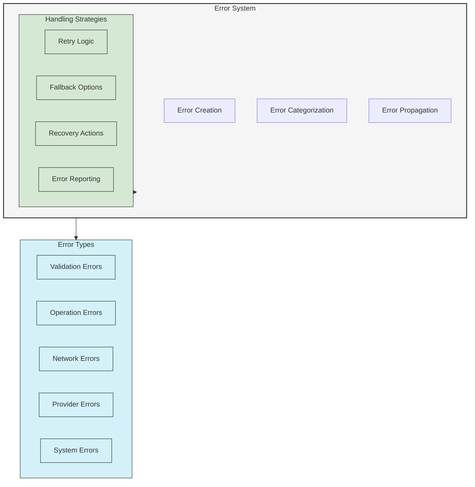

# Error Handling in UltraLink

This guide provides comprehensive information on error handling patterns, error types, and best practices when working with UltraLink.

## Error System Architecture

UltraLink implements a structured error handling system to provide consistent, informative errors across all operations:



## Error Types

UltraLink classifies errors into several categories to make error handling more consistent:

### Validation Errors

```typescript
// Example of a validation error
try {
  const entity = await ultralink.createEntity({
    type: 123, // Invalid type - should be string
    attributes: {
      title: 'Test'
    }
  });
} catch (error) {
  if (error instanceof UltraLink.ValidationError) {
    console.error('Validation failed:', error.message);
    console.log('Field:', error.field);
    console.log('Details:', error.details);
  }
}
```

Common validation errors include:
- Invalid data types
- Missing required fields
- Invalid format (e.g., malformed IDs)
- Schema validation failures
- Constraint violations

### Operation Errors

```typescript
// Example of an operation error
try {
  // Attempt to delete an entity that doesn't exist
  await ultralink.deleteEntity('nonexistent-id');
} catch (error) {
  if (error instanceof UltraLink.OperationError) {
    console.error('Operation failed:', error.message);
    console.log('Operation:', error.operation);
    console.log('Resource:', error.resource);
  }
}
```

Common operation errors include:
- Entity not found
- Duplicate entity
- Relationship constraints violated
- Operation timeout
- Permission denied

### Network Errors

```typescript
// Example of a network error
try {
  await ultralink.initialize();
} catch (error) {
  if (error instanceof UltraLink.NetworkError) {
    console.error('Network error:', error.message);
    console.log('Service:', error.service);
    console.log('Retry possible:', error.isRetryable);
  }
}
```

Common network errors include:
- Connection failure
- Timeout
- Service unavailable
- Rate limiting

### Provider Errors

```typescript
// Example of a provider error
try {
  await ultralink.generateEmbedding('Test content');
} catch (error) {
  if (error instanceof UltraLink.ProviderError) {
    console.error('Provider error:', error.message);
    console.log('Provider:', error.provider);
    console.log('Operation:', error.operation);
  }
}
```

Common provider errors include:
- API key invalid
- Provider unavailable
- Quota exceeded
- Unsupported operation
- Model not found

### System Errors

```typescript
// Example of a system error
try {
  await ultralink.query({
    // Complex query that causes an internal error
  });
} catch (error) {
  if (error instanceof UltraLink.SystemError) {
    console.error('System error:', error.message);
    console.log('Component:', error.component);
    console.log('Error ID:', error.errorId);
  }
}
```

Common system errors include:
- Internal state corruption
- Resource exhaustion
- Unexpected failures
- Unhandled exceptions

## Working with Error Objects

### Error Structure

All UltraLink errors share a common structure:

```typescript
interface UltraLinkError extends Error {
  // Base properties
  name: string;       // Error class name
  code: string;       // Error code (e.g., 'ENTITY_NOT_FOUND')
  message: string;    // Human-readable error message
  cause?: Error;      // Original error (if wrapped)
  
  // Metadata
  timestamp: number;  // When the error occurred
  operation?: string; // Operation that caused the error
  
  // Debugging
  stack?: string;     // Stack trace
  details?: any;      // Additional error details
}
```

### Accessing Error Details

```typescript
try {
  // Operation that might fail
  await ultralink.createEntity({
    type: 'document',
    attributes: {
      // Invalid data
    }
  });
} catch (error) {
  // Basic error handling
  console.error(`Error: ${error.message} (${error.code})`);
  
  // Check error type
  if (error.name === 'ValidationError') {
    console.log('Validation failed:', error.details);
  }
  
  // Inspect complete error
  console.log(JSON.stringify(error, null, 2));
  
  // Log the original cause (if this error wraps another)
  if (error.cause) {
    console.log('Caused by:', error.cause);
  }
}
```

## Error Handling Patterns

### Basic Try-Catch

```typescript
try {
  const entity = await ultralink.createEntity({
    type: 'document',
    attributes: {
      title: 'Test Document'
    }
  });
  console.log('Entity created:', entity.id);
} catch (error) {
  console.error('Failed to create entity:', error.message);
}
```

### Type-Specific Error Handling

```typescript
try {
  await ultralink.createRelationship({
    source: 'entity-1',
    target: 'entity-2',
    type: 'references'
  });
} catch (error) {
  // Handle different error types differently
  if (error instanceof UltraLink.ValidationError) {
    console.error('Invalid data:', error.message);
  } else if (error instanceof UltraLink.OperationError) {
    if (error.code === 'ENTITY_NOT_FOUND') {
      console.error('One of the entities does not exist');
    } else {
      console.error('Operation failed:', error.message);
    }
  } else if (error instanceof UltraLink.NetworkError) {
    console.error('Network issue, please try again later');
  } else {
    console.error('Unexpected error:', error.message);
  }
}
```

### Automatic Retry for Transient Errors

```typescript
async function withRetry(operation, maxRetries = 3, initialDelay = 500) {
  let lastError;
  
  for (let attempt = 1; attempt <= maxRetries; attempt++) {
    try {
      return await operation();
    } catch (error) {
      lastError = error;
      
      // Only retry on certain error types
      const isRetryable = 
        error instanceof UltraLink.NetworkError ||
        (error instanceof UltraLink.ProviderError && error.isRetryable) ||
        (error.code === 'RATE_LIMIT_EXCEEDED');
      
      if (!isRetryable || attempt === maxRetries) {
        throw error;
      }
      
      // Exponential backoff
      const delay = initialDelay * Math.pow(1.5, attempt - 1);
      console.log(`Attempt ${attempt} failed, retrying in ${delay}ms`);
      await new Promise(resolve => setTimeout(resolve, delay));
    }
  }
  
  throw lastError;
}

// Usage
try {
  const result = await withRetry(() => 
    ultralink.generateEmbedding('Retry this operation if it fails')
  );
  console.log('Operation succeeded:', result);
} catch (error) {
  console.error('All retry attempts failed:', error);
}
```

### Error Handling with Fallbacks

```typescript
async function createEntityWithFallback(data) {
  try {
    // Try with vector embedding
    return await ultralink.createEntity({
      ...data,
      generateVector: true
    });
  } catch (error) {
    if (error instanceof UltraLink.ProviderError && 
        error.provider === 'openai') {
      console.warn('OpenAI embedding failed, creating without vector');
      
      // Fallback: create entity without vector
      return await ultralink.createEntity({
        ...data,
        generateVector: false
      });
    }
    
    // Re-throw other errors
    throw error;
  }
}

// Usage
try {
  const entity = await createEntityWithFallback({
    type: 'document',
    attributes: {
      title: 'Document with fallback',
      content: 'This will try vector generation with fallback'
    }
  });
  console.log('Entity created:', entity.id);
} catch (error) {
  console.error('All approaches failed:', error);
}
```

### Batch Operation Error Handling

```typescript
// Process a batch with individual error handling
async function processBatch(items) {
  const results = {
    successful: [],
    failed: []
  };
  
  for (const item of items) {
    try {
      const entity = await ultralink.createEntity(item);
      results.successful.push({
        originalItem: item,
        result: entity
      });
    } catch (error) {
      results.failed.push({
        originalItem: item,
        error: {
          message: error.message,
          code: error.code
        }
      });
    }
  }
  
  return results;
}

// Usage
const batchResults = await processBatch([
  { type: 'document', attributes: { title: 'First document' } },
  { type: 'document', attributes: { title: 'Second document' } },
  { /* Invalid data that will cause an error */ }
]);

console.log(`Successfully processed: ${batchResults.successful.length} items`);
console.log(`Failed to process: ${batchResults.failed.length} items`);
```

## Advanced Error Handling

### Custom Error Handler

```typescript
// Configure custom error handling
const ultralink = new UltraLink({
  errorHandling: {
    onError: (error, context) => {
      // Log all errors to monitoring system
      logToMonitoring(error, context);
      
      // Return true to continue normal error propagation
      // Return false to suppress the error
      return true;
    }
  }
});

// Custom logging function
function logToMonitoring(error, context) {
  const errorData = {
    timestamp: new Date().toISOString(),
    errorType: error.name,
    code: error.code,
    message: error.message,
    operation: context.operation,
    parameters: context.parameters,
    stack: error.stack
  };
  
  // Send to monitoring system
  console.log('Logging error:', errorData);
}
```

### Error Event Listeners

```typescript
// Listen for all errors
ultralink.on('error', (error, context) => {
  console.error('An error occurred:', error);
  console.log('Context:', context);
});

// Listen for specific error types
ultralink.on('error:validation', (error, context) => {
  console.error('Validation error:', error.message);
});

ultralink.on('error:provider', (error, context) => {
  console.error('Provider error:', error.provider, error.message);
  
  // Notify administrator about provider issues
  notifyAdmin(`Provider ${error.provider} error: ${error.message}`);
});
```

### Transaction Handling

```typescript
// Use transactions for multi-step operations
async function createDocumentWithAuthor(documentData, authorData) {
  const transaction = await ultralink.beginTransaction();
  
  try {
    // Create author entity
    const author = await transaction.createEntity({
      type: 'person',
      attributes: authorData
    });
    
    // Create document entity
    const document = await transaction.createEntity({
      type: 'document',
      attributes: documentData
    });
    
    // Create relationship
    await transaction.createRelationship({
      source: author.id,
      target: document.id,
      type: 'authored'
    });
    
    // Commit the transaction
    await transaction.commit();
    
    return { author, document };
  } catch (error) {
    // Rollback on any error
    await transaction.rollback();
    throw error;
  }
}
```

## Error Handling Best Practices

### 1. Validate Input Early

```typescript
// Validate before operation
function createDocument(data) {
  // Validate required fields
  if (!data.title) {
    throw new UltraLink.ValidationError({
      message: 'Document title is required',
      field: 'title'
    });
  }
  
  if (data.title.length > 100) {
    throw new UltraLink.ValidationError({
      message: 'Document title cannot exceed 100 characters',
      field: 'title'
    });
  }
  
  // Proceed with validated data
  return ultralink.createEntity({
    type: 'document',
    attributes: data
  });
}
```

### 2. Use Error Factories

```typescript
// Error factory for consistent errors
const Errors = {
  entityNotFound: (id) => new UltraLink.OperationError({
    message: `Entity with ID '${id}' not found`,
    code: 'ENTITY_NOT_FOUND',
    resource: { id, type: 'entity' }
  }),
  
  invalidOperation: (operation, reason) => new UltraLink.OperationError({
    message: `Cannot perform ${operation}: ${reason}`,
    code: 'INVALID_OPERATION',
    operation
  }),
  
  networkFailure: (service, details) => new UltraLink.NetworkError({
    message: `Failed to connect to ${service}: ${details}`,
    code: 'NETWORK_FAILURE',
    service,
    isRetryable: true
  })
};

// Usage
async function getEntitySafely(id) {
  try {
    return await ultralink.getEntity(id);
  } catch (error) {
    if (error.code === 'ENTITY_NOT_FOUND') {
      throw Errors.entityNotFound(id);
    }
    throw error;
  }
}
```

### 3. Provide Context in Errors

```typescript
// Adding context to errors
try {
  await complexOperation();
} catch (error) {
  // Enhance error with context
  const contextualError = new UltraLink.OperationError({
    message: `Failed during import process: ${error.message}`,
    code: 'IMPORT_FAILED',
    operation: 'import',
    cause: error,
    details: {
      stage: 'data_transformation',
      itemsProcessed: 42,
      failedItem: currentItem
    }
  });
  
  throw contextualError;
}
```

### 4. Implement Graceful Degradation

```typescript
async function searchWithFallbacks(query) {
  try {
    // Try vector search first
    return await ultralink.searchSimilar(query, {
      limit: 10
    });
  } catch (vectorError) {
    console.warn('Vector search failed, trying keyword search', vectorError);
    
    try {
      // Fall back to keyword search
      return await ultralink.findEntities({
        where: {
          'attributes.content': {
            search: query
          }
        },
        limit: 10
      });
    } catch (keywordError) {
      console.warn('Keyword search failed, using basic match', keywordError);
      
      // Last resort: basic match
      return await ultralink.findEntities({
        where: {
          'attributes.tags': {
            contains: query.split(' ')[0] // Use first word as tag
          }
        },
        limit: 10
      });
    }
  }
}
```

### 5. Log Errors Appropriately

```typescript
// Error logging wrapper
async function withErrorLogging(operation, context = {}) {
  try {
    return await operation();
  } catch (error) {
    // Determine severity
    let severity = 'error';
    
    if (error instanceof UltraLink.ValidationError) {
      severity = 'warn';
    }
    
    if (error instanceof UltraLink.NetworkError && error.isRetryable) {
      severity = 'warn';
    }
    
    // Log based on severity
    const logData = {
      error: {
        type: error.name,
        code: error.code,
        message: error.message,
        stack: error.stack
      },
      context,
      timestamp: new Date().toISOString()
    };
    
    if (severity === 'error') {
      console.error('Operation failed', logData);
      // Send to error monitoring
      errorMonitoring.captureException(error, { extra: context });
    } else {
      console.warn('Operation warning', logData);
    }
    
    // Re-throw the original error
    throw error;
  }
}

// Usage
try {
  await withErrorLogging(
    () => ultralink.createEntity(entityData),
    { operation: 'createEntity', data: entityData }
  );
} catch (error) {
  // Handle the error
}
```

## Common Error Scenarios and Solutions

### Entity Not Found

```typescript
// Check if an entity exists before referencing it
async function safelyAddRelationship(source, target, type) {
  try {
    // Check if source exists
    await ultralink.getEntity(source);
  } catch (error) {
    if (error.code === 'ENTITY_NOT_FOUND') {
      throw new Error(`Source entity ${source} does not exist`);
    }
    throw error;
  }
  
  try {
    // Check if target exists
    await ultralink.getEntity(target);
  } catch (error) {
    if (error.code === 'ENTITY_NOT_FOUND') {
      throw new Error(`Target entity ${target} does not exist`);
    }
    throw error;
  }
  
  // Both exist, create the relationship
  return ultralink.createRelationship({ source, target, type });
}
```

### Provider API Failures

```typescript
// Handling provider API issues
async function resilientVectorSearch(query, options = {}) {
  try {
    return await ultralink.searchSimilar(query, options);
  } catch (error) {
    if (error instanceof UltraLink.ProviderError) {
      if (error.code === 'RATE_LIMIT_EXCEEDED') {
        // Wait and retry
        await sleep(2000);
        return await ultralink.searchSimilar(query, options);
      }
      
      if (error.code === 'PROVIDER_UNAVAILABLE') {
        // Fall back to alternate provider
        return await ultralink.searchSimilar(query, {
          ...options,
          provider: 'alternate'
        });
      }
    }
    
    throw error;
  }
}
```

### Handling Concurrent Operations

```typescript
// Safely handle potential race conditions
async function updateIfNotChanged(id, currentData, updates) {
  try {
    // Use optimistic concurrency control
    return await ultralink.updateEntity(id, {
      ...updates,
      version: currentData.version // Ensure this is the version we're updating
    });
  } catch (error) {
    if (error.code === 'VERSION_CONFLICT') {
      // Entity was modified by another process
      const latestEntity = await ultralink.getEntity(id);
      
      // Decide how to handle conflict
      if (canMergeChanges(latestEntity, updates)) {
        return await ultralink.updateEntity(id, {
          ...mergeChanges(latestEntity, updates),
          version: latestEntity.version
        });
      } else {
        throw new Error('Entity was modified by another process');
      }
    }
    throw error;
  }
}
```

### Handling Network Issues

```typescript
// Configure network resilience
const ultralink = new UltraLink({
  network: {
    timeout: 10000, // 10 seconds
    retries: 3,
    backoff: {
      initial: 1000,
      factor: 2,
      maxDelay: 10000
    }
  }
});

// Manual network resilience
async function withNetworkResilience(operation) {
  const maxRetries = 3;
  let attempt = 0;
  
  while (true) {
    try {
      return await operation();
    } catch (error) {
      attempt++;
      
      if (!(error instanceof UltraLink.NetworkError) || attempt >= maxRetries) {
        throw error;
      }
      
      const delay = Math.min(1000 * Math.pow(2, attempt - 1), 10000);
      console.warn(`Network error, retrying in ${delay}ms (attempt ${attempt}/${maxRetries})`);
      await new Promise(resolve => setTimeout(resolve, delay));
    }
  }
}
```

## Error Reporting and Monitoring

### Setting Up Error Monitoring

```typescript
// Configure error monitoring
const ultralink = new UltraLink({
  errorHandling: {
    monitor: true,
    reportErrors: true,
    errorReporter: (error, context) => {
      // Send to your monitoring service
      sentryCapture(error, {
        extra: {
          operation: context.operation,
          parameters: context.parameters
        },
        tags: {
          component: 'ultralink',
          errorType: error.name,
          errorCode: error.code
        }
      });
    }
  }
});
```

### Custom Error Analytics

```typescript
// Track error metrics
class ErrorMetrics {
  constructor() {
    this.counts = {};
    this.lastErrors = [];
  }
  
  trackError(error) {
    // Increment error counts
    const type = error.name || 'Unknown';
    const code = error.code || 'UNKNOWN';
    const key = `${type}:${code}`;
    
    this.counts[key] = (this.counts[key] || 0) + 1;
    
    // Store recent errors
    this.lastErrors.push({
      type,
      code,
      message: error.message,
      timestamp: Date.now()
    });
    
    // Keep only last 100 errors
    if (this.lastErrors.length > 100) {
      this.lastErrors.shift();
    }
  }
  
  getMetrics() {
    return {
      counts: this.counts,
      recent: this.lastErrors,
      topErrors: Object.entries(this.counts)
        .sort((a, b) => b[1] - a[1])
        .slice(0, 10)
    };
  }
}

// Initialize metrics
const errorMetrics = new ErrorMetrics();

// Set up listener
ultralink.on('error', error => {
  errorMetrics.trackError(error);
});

// View metrics
app.get('/api/error-metrics', (req, res) => {
  res.json(errorMetrics.getMetrics());
});
```

## Next Steps

- [Core API Reference](../api/core.md) - Complete API documentation
- [Advanced Queries Guide](./advanced-queries.md) - Learn complex query patterns
- [Vector Operations Guide](./vector-operations.md) - Advanced vector operations
- [Performance Optimization](./performance.md) - Performance tuning guide 