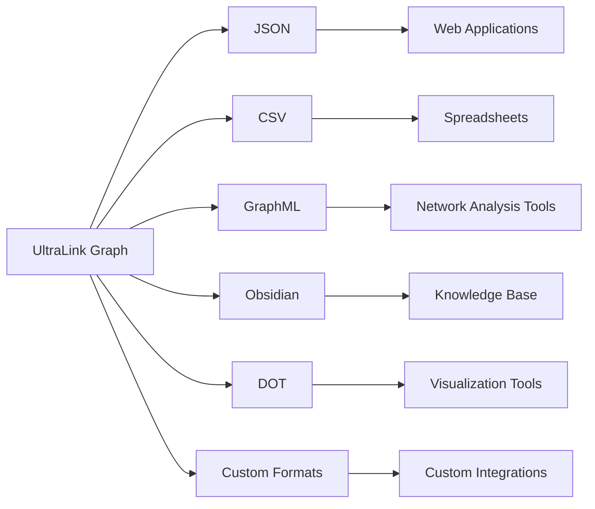
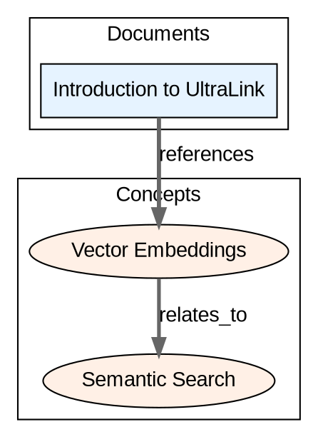

# UltraLink Export Formats Guide 📤

UltraLink supports exporting your knowledge graph to multiple formats, allowing integration with various tools and systems. This guide explains each export format, its use cases, configuration options, and provides examples.

## Overview



## Export Methods

UltraLink provides several methods for exporting data:

```javascript
// Export to various formats
const jsonData = ultralink.toJSON();
const csvData = ultralink.toCSV();
const graphMLData = ultralink.toGraphML();
const obsidianData = ultralink.toObsidian({ directory: './knowledge-base' });
const dotData = ultralink.toDOT();

// Export to file
await ultralink.exportToFile('json', './output/data.json');
await ultralink.exportToFile('csv', './output/data.csv');
await ultralink.exportToFile('graphml', './output/data.graphml');
await ultralink.exportToFile('dot', './output/data.dot');

// Batch export to multiple formats
await ultralink.batchExport([
  { format: 'json', path: './output/data.json' },
  { format: 'csv', path: './output/data.csv' },
  { format: 'graphml', path: './output/data.graphml' }
]);
```

## JSON Format

The JSON format provides a complete representation of your knowledge graph, including entities, relationships, metadata, and vectors.

### Use Cases

- **Web Applications**: Easy to use in JavaScript applications
- **API Integration**: Standard format for API responses
- **Data Backup**: Complete representation for backup and restore
- **Cross-System Integration**: Universal format supported by most systems

### Export Options

```javascript
// Basic JSON export
const jsonData = ultralink.toJSON();

// JSON export with options
const formattedJson = ultralink.toJSON({
  pretty: true,                  // Pretty print with indentation
  includeVectors: true,          // Include vector embeddings
  includeMetadata: true,         // Include graph metadata
  includeHistory: false,         // Exclude version history
  filter: {                      // Filter what to include
    entityTypes: ['document', 'concept'],
    relationshipTypes: ['references', 'relates_to'],
    attributes: ['title', 'content', 'importance']
  },
  transform: (entity) => {       // Transform entities before export
    // Custom transformation logic
    return entity;
  }
});
```

### JSON Structure

```json
{
  "entities": [
    {
      "id": "document-1",
      "type": "document",
      "attributes": {
        "title": "Introduction to UltraLink",
        "content": "UltraLink is a powerful framework...",
        "created": "2023-06-15T10:30:00Z",
        "importance": 0.85
      },
      "vector": {
        "embedding": [0.23, 0.45, -0.12, 0.78],
        "model": "text-embedding-3-large"
      }
    }
  ],
  "relationships": [
    {
      "source": "document-1",
      "target": "concept-1",
      "type": "references",
      "attributes": {
        "strength": 0.92,
        "context": "core concept"
      }
    }
  ],
  "metadata": {
    "graphName": "Documentation Graph",
    "version": "1.0.0",
    "created": "2023-06-15T10:00:00Z",
    "modified": "2023-06-15T11:30:00Z",
    "entityCount": 25,
    "relationshipCount": 40
  }
}
```

## CSV Format

The CSV format provides a tabular representation of entities and relationships, suitable for analysis in spreadsheets and data tools.

### Use Cases

- **Data Analysis**: Easy to import into Excel, Google Sheets, etc.
- **Data Science**: Input for data science tools like pandas
- **Reporting**: Generate tabular reports
- **Data Exchange**: Universal format compatible with many systems

### Export Options

```javascript
// Basic CSV export
const csvData = ultralink.toCSV();

// CSV export with options
const formattedCsv = ultralink.toCSV({
  delimiter: ',',                // Delimiter (default is ',')
  includeHeader: true,           // Include header row
  quoteStrings: true,            // Quote string values
  entities: {                    // Entity export options
    include: true,
    filename: 'entities.csv',
    attributes: ['title', 'content', 'importance']
  },
  relationships: {               // Relationship export options
    include: true,
    filename: 'relationships.csv',
    attributes: ['strength', 'context']
  },
  flatten: true,                 // Flatten nested attributes
  flattenSeparator: '_'          // Separator for flattened keys
});
```

### CSV Output Example

**entities.csv**:
```
id,type,title,content,importance,vector_0,vector_1,vector_2,vector_3
document-1,document,Introduction to UltraLink,UltraLink is a powerful framework...,0.85,0.23,0.45,-0.12,0.78
concept-1,concept,Vector Embeddings,Numerical representations of semantic meaning,0.92,0.56,-0.23,0.67,0.11
```

**relationships.csv**:
```
source,target,type,strength,context
document-1,concept-1,references,0.92,core concept
concept-1,concept-2,relates_to,0.85,similar concept
```

## GraphML Format

GraphML is an XML-based file format for graphs, widely used in network analysis tools.

### Use Cases

- **Network Analysis**: Import into tools like Gephi, NodeXL, or Cytoscape
- **Graph Visualization**: Visualize the graph structure
- **Graph Algorithms**: Apply graph algorithms in specialized tools
- **Interoperability**: Standard format for graph exchange

### Export Options

```javascript
// Basic GraphML export
const graphMLData = ultralink.toGraphML();

// GraphML export with options
const formattedGraphML = ultralink.toGraphML({
  includeAttributes: true,       // Include entity and relationship attributes
  attributeTypes: true,          // Include type information for attributes
  prettify: true,                // Pretty print the XML
  metadata: true,                // Include graph metadata
  directed: true,                // Treat relationships as directed
  nodeLabels: 'id',              // Use 'id' field as node labels
  edgeLabels: 'type',            // Use 'type' field as edge labels
  includeVectors: false          // Exclude vector embeddings
});
```

### GraphML Output Example

```xml
<?xml version="1.0" encoding="UTF-8"?>
<graphml xmlns="http://graphml.graphdrawing.org/xmlns">
  <key id="d0" for="node" attr.name="type" attr.type="string"/>
  <key id="d1" for="node" attr.name="title" attr.type="string"/>
  <key id="d2" for="node" attr.name="importance" attr.type="double"/>
  <key id="d3" for="edge" attr.name="strength" attr.type="double"/>
  <key id="d4" for="edge" attr.name="context" attr.type="string"/>
  
  <graph id="G" edgedefault="directed">
    <node id="document-1">
      <data key="d0">document</data>
      <data key="d1">Introduction to UltraLink</data>
      <data key="d2">0.85</data>
    </node>
    <node id="concept-1">
      <data key="d0">concept</data>
      <data key="d1">Vector Embeddings</data>
      <data key="d2">0.92</data>
    </node>
    
    <edge id="e1" source="document-1" target="concept-1">
      <data key="d3">0.92</data>
      <data key="d4">core concept</data>
    </edge>
  </graph>
</graphml>
```

## Obsidian Format

UltraLink can export to an Obsidian-compatible knowledge base, creating markdown files with proper links and metadata.

### Use Cases

- **Knowledge Management**: Create an Obsidian vault from your data
- **Documentation**: Generate interconnected documentation
- **Research Notes**: Export research findings as interconnected notes
- **Learning Resources**: Create learning materials with cross-references

### Export Options

```javascript
// Export to Obsidian knowledge base
await ultralink.toObsidian({
  directory: './knowledge-base',     // Output directory
  includeBacklinks: true,            // Include backlinks section
  frontmatter: true,                 // Include YAML frontmatter
  templateDirectory: './templates',  // Templates for different entity types
  folderStructure: 'type',           // Organize by entity type
  filenameFormat: '{{id}}',          // Format for filenames
  linkFormat: '[[{{id}}]]',          // Format for links
  metadata: true,                    // Include metadata file
  index: true,                       // Generate index file
  assets: true,                      // Copy assets (images, etc.)
  embeddings: false                  // Don't include vector embeddings
});
```

### Obsidian Output Example

**knowledge-base/document/document-1.md**:
```markdown
---
title: Introduction to UltraLink
type: document
importance: 0.85
created: 2023-06-15T10:30:00Z
---

# Introduction to UltraLink

UltraLink is a powerful framework...

## References

- [[vector-embeddings]] - core concept (strength: 0.92)

## Metadata

- **Type**: document
- **Created**: 2023-06-15
- **Importance**: 0.85
```

**knowledge-base/concept/concept-1.md**:
```markdown
---
title: Vector Embeddings
type: concept
importance: 0.92
---

# Vector Embeddings

Numerical representations of semantic meaning in vector space.

## Backlinks

- [[document-1]] references this concept
- [[concept-2]] relates to this concept

## Related Concepts

- [[concept-2]] - similar concept (strength: 0.85)
```

## DOT Format

DOT is a graph description language used by the GraphViz visualization tools.

### Use Cases

- **Graph Visualization**: Generate visualizations with GraphViz tools
- **Documentation**: Include graph visualizations in documentation
- **Presentations**: Create visual representations for presentations
- **Static Diagrams**: Generate static graph diagrams

### Export Options

```javascript
// Basic DOT export
const dotData = ultralink.toDOT();

// DOT export with options
const formattedDOT = ultralink.toDOT({
  directed: true,                // Create a directed graph
  nodeAttributes: {              // Default node attributes
    shape: 'box',
    style: 'filled',
    fillcolor: '#f5f5f5'
  },
  edgeAttributes: {              // Default edge attributes
    arrowhead: 'normal',
    color: '#666666'
  },
  nodeFormatter: (node) => {     // Custom node formatting
    return {
      label: node.attributes.title || node.id,
      shape: node.type === 'document' ? 'box' : 'ellipse',
      fillcolor: getColorForType(node.type)
    };
  },
  edgeFormatter: (edge) => {     // Custom edge formatting
    return {
      label: edge.type,
      style: edge.attributes.strength > 0.8 ? 'bold' : 'solid',
      penwidth: Math.max(1, edge.attributes.strength * 3)
    };
  },
  clusterBy: 'type'              // Group nodes by type
});
```

### DOT Output Example



## Custom Export Formats

UltraLink can be extended to support custom export formats through plugins.

### Implementing Custom Exporters

```javascript
// Define a custom exporter
const myCustomExporter = {
  name: 'custom-format',
  description: 'Custom export format for specialized use case',
  export: (ultralink, options) => {
    // Implementation to convert UltraLink data to custom format
    const entities = ultralink.entities;
    const relationships = ultralink.getLinks();
    
    // Transform to custom format
    const customFormat = transformToCustomFormat(entities, relationships, options);
    
    return customFormat;
  }
};

// Register the custom exporter
ultralink.registerExporter(myCustomExporter);

// Use the custom exporter
const customData = ultralink.export('custom-format', {
  // Custom options
});
```

## Export API Reference

### toJSON(options?)

Exports the UltraLink graph to JSON format.

```javascript
const jsonData = ultralink.toJSON({
  pretty: true,
  includeVectors: true,
  includeMetadata: true
});
```

### toCSV(options?)

Exports the UltraLink graph to CSV format.

```javascript
const csvData = ultralink.toCSV({
  delimiter: ',',
  includeHeader: true,
  quoteStrings: true
});
```

### toGraphML(options?)

Exports the UltraLink graph to GraphML format.

```javascript
const graphMLData = ultralink.toGraphML({
  includeAttributes: true,
  attributeTypes: true,
  prettify: true
});
```

### toObsidian(options)

Exports the UltraLink graph to an Obsidian knowledge base.

```javascript
await ultralink.toObsidian({
  directory: './knowledge-base',
  includeBacklinks: true,
  frontmatter: true
});
```

### toDOT(options?)

Exports the UltraLink graph to DOT format for GraphViz.

```javascript
const dotData = ultralink.toDOT({
  directed: true,
  nodeAttributes: { shape: 'box' },
  edgeAttributes: { arrowhead: 'normal' }
});
```

### exportToFile(format, filePath, options?)

Exports the UltraLink graph to a file in the specified format.

```javascript
await ultralink.exportToFile('json', './output/data.json', {
  pretty: true
});
```

### batchExport(exports)

Exports the UltraLink graph to multiple formats and files in a single operation.

```javascript
await ultralink.batchExport([
  { format: 'json', path: './output/data.json', options: { pretty: true } },
  { format: 'csv', path: './output/data.csv' },
  { format: 'graphml', path: './output/data.graphml' }
]);
```

## Best Practices

### Data Completeness

- **Include Metadata**: When appropriate, include metadata for better context
- **Consider Vectors**: Only include vector embeddings when they will be used by the target system
- **Attribute Selection**: Only export relevant attributes to avoid unnecessary data

### Performance Considerations

- **Large Graphs**: For large graphs, consider using streaming exports
- **Memory Usage**: Watch memory usage when exporting large datasets
- **Batching**: Use batch operations for multiple exports

### Data Security

- **Sensitive Data**: Be cautious about exporting sensitive data
- **Encryption**: Consider encrypting exported files containing sensitive information
- **Access Control**: Implement proper access controls for exported files

### Format-Specific Practices

- **JSON**: Use pretty printing only when human readability is important
- **CSV**: Always include headers for better usability
- **GraphML**: Include attribute types for better compatibility
- **Obsidian**: Use templates for consistent knowledge base structure
- **DOT**: Use custom formatters for better visual representation

## Troubleshooting

### Common Issues and Solutions

| Issue | Possible Cause | Solution |
|-------|---------------|----------|
| Large JSON files | Too much data or pretty printing | Disable pretty printing, filter unnecessary data |
| CSV formatting issues | Special characters in data | Enable quoting for string values |
| GraphML import errors | Missing attribute types | Enable attributeTypes option |
| Obsidian links not working | Incorrect link format | Check the linkFormat option |
| DOT rendering issues | Complex graph structure | Use clusterBy to organize the graph, adjust layout |

### Error Handling

```javascript
try {
  const data = ultralink.toJSON();
  await fs.writeFile('./output/data.json', data);
} catch (error) {
  console.error('Export error:', error.message);
  // Implement fallback or error recovery
}
```

## Related Documentation

- [Configuration Reference](../reference/configuration.md)
- [API Reference](../api/README.md)
- [Obsidian Integration](../guides/obsidian-integration.md)
- [Visualization Guide](../guides/visualization.md)
- [Data Import Guide](../guides/data-import.md) 