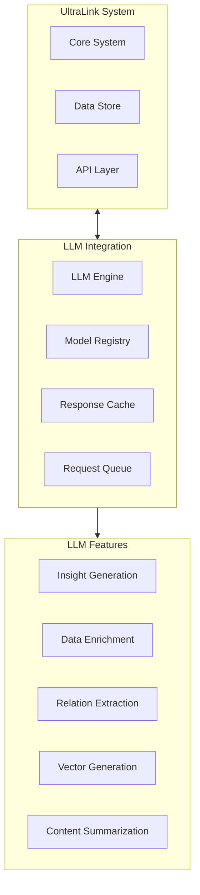
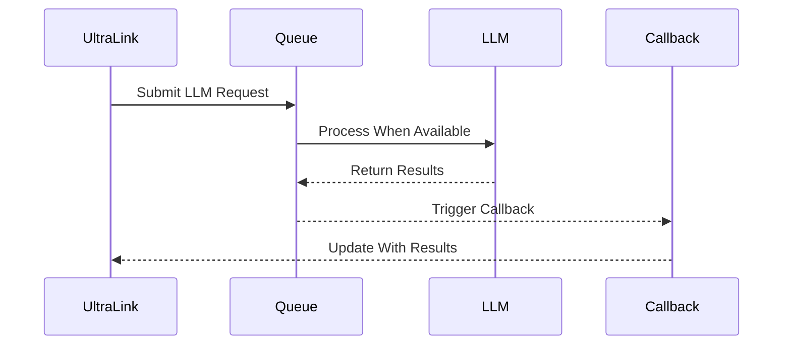
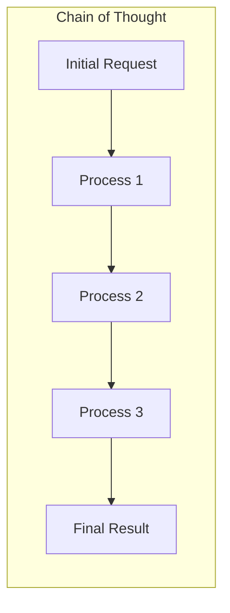
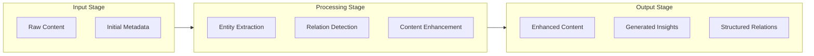
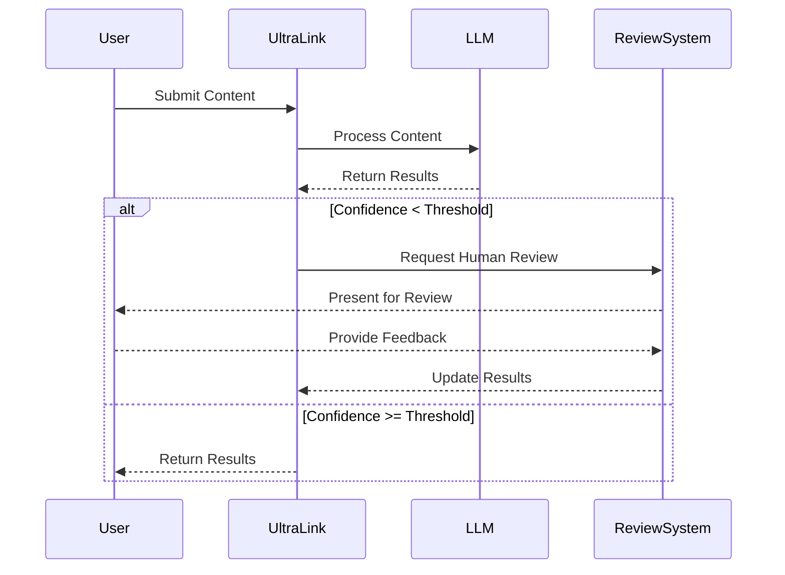

# LLM Integration Guide 🤖

## Overview

UltraLink's Language Model (LLM) integration provides powerful capabilities for enhancing relationships, generating insights, and enriching metadata through AI models. This document explains how to effectively integrate and leverage LLMs within the UltraLink ecosystem.

## System Architecture



## Integration Methods

### 1. Direct API Integration

```javascript
// Configure LLM integration
ultralink.llm.configure({
    provider: 'openai',
    model: 'gpt-4',
    apiKey: process.env.OPENAI_API_KEY,
    options: {
        temperature: 0.3,
        maxTokens: 2000,
        caching: true
    }
});

// Generate insights from a document
const insights = await ultralink.llm.generateInsights({
    content: documentContent,
    aspects: ['technical', 'business', 'risks'],
    format: 'structured',
    confidence: true
});
```

### 2. Batch Processing

```javascript
// Process multiple documents in batch
const batchResults = await ultralink.llm.processBatch({
    items: documents,
    operation: 'extract_relations',
    concurrency: 5,
    options: {
        relationTypes: ['depends_on', 'refers_to', 'implements'],
        minConfidence: 0.7
    }
});
```

### 3. Event-Driven Integration



## Key Features

### 1. Insight Generation

```javascript
// Generate insights from content
const insights = await ultralink.llm.generateInsights({
    content: documentContent,
    prompt: customPrompt || 'default',
    aspects: {
        technical: true,
        business: true,
        risks: true,
        opportunities: true
    },
    structure: {
        format: 'json',
        schema: insightSchema
    }
});
```

Example output:
```json
{
  "technical": [
    {
      "insight": "The approach uses transformer architecture with attention mechanisms",
      "confidence": 0.92,
      "evidence": ["Section 3.2", "Figure 4"],
      "implications": ["Suitable for parallel processing", "Requires GPU resources"]
    }
  ],
  "business": [
    {
      "insight": "Implementation could reduce processing time by 45%",
      "confidence": 0.87,
      "evidence": ["Results table", "Benchmark comparison"],
      "implications": ["Cost savings", "Competitive advantage"]
    }
  ]
}
```

### 2. Relation Extraction

```javascript
// Extract relationships from content
const relations = await ultralink.llm.extractRelations({
    content: documentContent,
    relationTypes: [
        'depends_on',
        'implements',
        'references',
        'contradicts',
        'extends'
    ],
    entities: existingEntities || 'auto-detect',
    confidence: true
});
```

### 3. Content Enrichment

```javascript
// Enrich entity with LLM-generated content
const enriched = await ultralink.llm.enrichEntity({
    entity: entityId,
    enrichments: [
        'summary',
        'key_points',
        'related_concepts',
        'impact_assessment'
    ],
    contextual: true,
    existing: true  // Use existing data as context
});
```

### 4. Vector Enhancement

```javascript
// Enhance vector representations
const enhancedVectors = await ultralink.llm.enhanceVectors({
    entities: entities,
    method: 'embedding',
    model: 'text-embedding-3-large',
    options: {
        dimensions: 1536,
        normalize: true
    }
});
```

## Advanced Configurations

### 1. Prompt Engineering

```javascript
// Define custom prompts
ultralink.llm.definePrompts({
    'technical-analysis': {
        template: `
            Analyze the following technical content and provide:
            1. Key technical concepts
            2. Implementation details
            3. Technical challenges
            4. Possible optimizations
            
            Content: {{content}}
        `,
        parameters: {
            temperature: 0.2,
            model: 'gpt-4'
        }
    }
});

// Use custom prompt
const analysis = await ultralink.llm.process({
    content: documentContent,
    promptName: 'technical-analysis'
});
```

### 2. Chain of Thought Processing



```javascript
// Create processing chain
const chain = ultralink.llm.createChain({
    steps: [
        {
            name: 'extract-entities',
            prompt: 'entity-extraction',
            output: 'entities'
        },
        {
            name: 'analyze-relationships',
            prompt: 'relationship-analysis',
            input: 'entities',
            output: 'relationships'
        },
        {
            name: 'generate-insights',
            prompt: 'insight-generation',
            input: ['entities', 'relationships'],
            output: 'insights'
        }
    ],
    options: {
        maxRetries: 2,
        logging: true
    }
});

// Execute chain
const result = await chain.execute({
    content: documentContent
});
```

### 3. Hybrid Approaches

```javascript
// Combine rule-based and LLM approaches
const hybrid = await ultralink.llm.hybridProcess({
    content: documentContent,
    steps: [
        {
            type: 'rule-based',
            operation: 'extract_structured_data',
            options: { schema: dataSchema }
        },
        {
            type: 'llm',
            operation: 'enhance_extracted_data',
            options: { model: 'gpt-4' }
        },
        {
            type: 'rule-based',
            operation: 'validate_enhanced_data',
            options: { rules: validationRules }
        }
    ]
});
```

## Performance Optimization

### 1. Caching Strategies

```javascript
// Configure LLM caching
ultralink.llm.configureCache({
    strategy: 'semantic',  // semantic similarity matching
    ttl: '24h',  // cache validity period
    storage: 'redis',  // cache storage backend
    options: {
        similarityThreshold: 0.92,
        compressionEnabled: true
    }
});
```

### 2. Batch Processing

```javascript
// Configure batch processing
ultralink.llm.configureBatch({
    maxBatchSize: 50,
    batchInterval: 500,  // ms
    maxConcurrent: 5,
    prioritization: (items) => {
        // Sort items by priority
        return items.sort((a, b) => b.priority - a.priority);
    }
});
```

### 3. Cost Management

```javascript
// Configure cost management
ultralink.llm.configureCost({
    budget: {
        daily: 10.0,  // $10 per day
        monthly: 200.0  // $200 per month
    },
    alerts: {
        threshold: 0.8,  // Alert at 80% of budget
        channels: ['email', 'webhook']
    },
    tracking: {
        detailed: true,
        report: 'daily'
    }
});
```

## Integration Patterns

### 1. Content Analysis Pipeline



### 2. Continuous Enrichment

```javascript
// Configure continuous enrichment
const enrichmentProcess = ultralink.llm.configureEnrichment({
    trigger: {
        onAdd: true,
        onUpdate: true,
        onAccess: false,
        schedule: '0 0 * * *'  // Daily at midnight
    },
    pipeline: enrichmentPipeline,
    options: {
        priorityQueue: true,
        maxRetries: 3
    }
});

// Start enrichment process
await enrichmentProcess.start();
```

### 3. Human-in-the-Loop



## Best Practices

### 1. Prompt Design

- **Be specific** - Clearly define what you want the LLM to do
- **Provide context** - Include relevant background information
- **Structure outputs** - Specify format requirements
- **Include examples** - Use few-shot prompting for complex tasks
- **Set constraints** - Define boundaries and limitations

### 2. Data Quality

- **Pre-process inputs** - Clean and format data before LLM processing
- **Validate outputs** - Implement validation for LLM-generated content
- **Handle edge cases** - Prepare for unexpected or low-quality outputs
- **Implement feedback loops** - Use results to improve future processing

### 3. Security & Privacy

- **Data minimization** - Only send necessary information to LLM
- **PII handling** - Redact or anonymize personal information
- **Output sanitization** - Validate and sanitize LLM outputs
- **Audit trails** - Maintain detailed logs of LLM interactions
- **Access controls** - Implement proper authorization for LLM features

## Use Cases

### 1. Automated Knowledge Base Construction

```javascript
// Build knowledge base using LLM
const kb = await ultralink.llm.buildKnowledgeBase({
    sources: documentSources,
    structure: knowledgeBaseSchema,
    extraction: {
        entities: true,
        relations: true,
        concepts: true
    },
    enrichment: {
        summaries: true,
        definitions: true,
        examples: true
    }
});
```

### 2. Document Analysis & Insight Generation

```javascript
// Analyze documents and generate insights
const insights = await ultralink.llm.analyzeDocuments({
    documents: documentsCollection,
    analysis: {
        topics: true,
        sentiments: true,
        key_points: true,
        controversies: true
    },
    visualization: true,
    summary: {
        length: 'medium',
        format: 'bullets'
    }
});
```

### 3. Content Recommendation

```javascript
// Generate personalized recommendations
const recommendations = await ultralink.llm.recommend({
    user: userData,
    contentPool: availableContent,
    criteria: {
        relevance: 0.6,
        novelty: 0.3,
        diversity: 0.1
    },
    explanation: true,
    limit: 10
});
```

## Troubleshooting

### 1. Common Issues

| Issue | Possible Causes | Solutions |
|-------|----------------|-----------|
| Poor quality outputs | Ambiguous prompts, Insufficient context | Refine prompts, Add context, Use examples |
| High latency | Model size, Request volume, Complex operations | Use smaller models, Implement caching, Batch processing |
| Consistency issues | Randomness settings, Context limitations | Lower temperature, Improve prompt design, Use structured outputs |
| Cost overruns | Inefficient prompts, Unnecessary requests | Optimize prompts, Implement caching, Set budgets |

### 2. Debugging Strategies

```javascript
// Enable debug mode
ultralink.llm.debug({
    level: 'detailed',
    capture: {
        requests: true,
        responses: true,
        timings: true
    },
    output: 'file',
    path: './logs/llm-debug.log'
});
```

### 3. Monitoring

```javascript
// Configure LLM monitoring
ultralink.llm.monitor({
    metrics: [
        'request_count',
        'token_usage',
        'latency',
        'error_rate',
        'cost'
    ],
    dimensions: [
        'model',
        'operation_type',
        'status'
    ],
    alerts: {
        error_rate: { threshold: 0.05, window: '5m' },
        latency: { threshold: 2000, window: '1h' }
    }
});
```

## Advanced Topics

### 1. Fine-tuning Integration

```javascript
// Configure fine-tuning
const fineTuning = await ultralink.llm.configureFinetuning({
    baseModel: 'gpt-3.5-turbo',
    trainingData: trainingDataset,
    parameters: {
        epochs: 3,
        batchSize: 4,
        learningRate: 1e-5
    },
    evaluation: {
        metrics: ['accuracy', 'f1_score'],
        testSplit: 0.2
    }
});

// Start fine-tuning process
const fineTunedModel = await fineTuning.start();
```

### 2. Multi-modal Integration

```javascript
// Process multi-modal content
const multimodalResults = await ultralink.llm.processMultimodal({
    content: {
        text: textContent,
        images: imageFiles,
        audio: audioFiles
    },
    operations: [
        { type: 'image_analysis', options: { detail: 'high' } },
        { type: 'text_analysis', options: { depth: 'comprehensive' } },
        { type: 'cross_modal_correlation', options: { strength: 'high' } }
    ],
    output: {
        format: 'structured',
        crossReferences: true
    }
});
```

### 3. Responsible AI Integration

```javascript
// Configure responsible AI settings
ultralink.llm.configureResponsibleAI({
    fairness: {
        biasDetection: true,
        mitigationStrategies: ['prompt_design', 'output_filtering']
    },
    transparency: {
        explanations: true,
        confidenceScores: true,
        modelProvenance: true
    },
    oversight: {
        humanReviewThreshold: 0.7,
        contentFiltering: 'standard',
        usage: {
            logging: true,
            reporting: 'weekly'
        }
    }
});
```

## Further Reading

1. [Advanced Prompt Engineering](../guides/prompt-engineering.md)
2. [LLM Security Best Practices](../guides/llm-security.md)
3. [Cost Optimization Strategies](../guides/llm-cost-optimization.md)
4. [Fine-tuning UltraLink Models](../guides/llm-fine-tuning.md)
5. [Multi-modal Integration](../guides/multi-modal.md) 