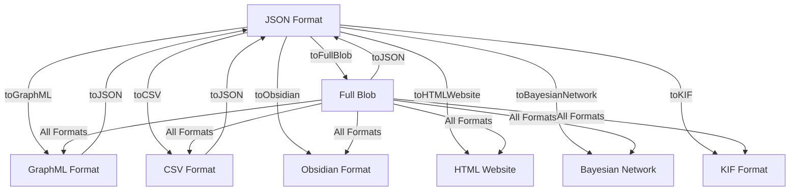
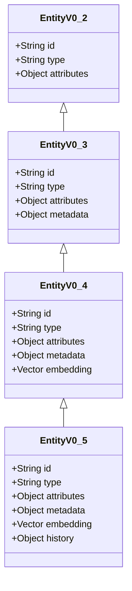
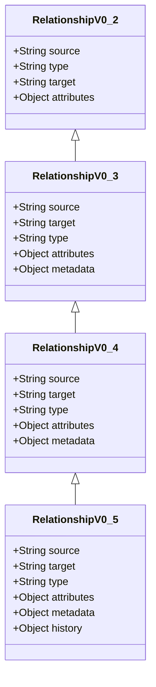

# UltraLink Migration Guide

This guide helps you migrate between different UltraLink formats or upgrade to newer versions of UltraLink with minimal disruption.

## Table of Contents

1. [Format Migration](#format-migration)
   - [Migrating from JSON to Other Formats](#migrating-from-json-to-other-formats)
   - [Migrating from CSV to Other Formats](#migrating-from-csv-to-other-formats)
   - [Migrating from GraphML to Other Formats](#migrating-from-graphml-to-other-formats)
   - [Migrating from Obsidian to Other Formats](#migrating-from-obsidian-to-other-formats)
   - [Migrating from Bayesian Network to Other Formats](#migrating-from-bayesian-network-to-other-formats)
   - [Migrating from KIF to Other Formats](#migrating-from-kif-to-other-formats)
2. [Version Migration](#version-migration)
   - [Upgrading from v0.4.x to v0.5.x](#upgrading-from-v04x-to-v05x)
   - [Upgrading from v0.3.x to v0.4.x](#upgrading-from-v03x-to-v04x)
   - [Upgrading from v0.2.x to v0.3.x](#upgrading-from-v02x-to-v03x)
3. [Data Model Changes](#data-model-changes)
4. [API Compatibility](#api-compatibility)
5. [Best Practices](#best-practices)

## Format Migration

UltraLink supports conversion between all of its supported formats, allowing you to seamlessly migrate your data.



### Migrating from JSON to Other Formats

JSON is the most universal format and provides a straightforward path to all other formats.

#### JSON to GraphML

```javascript
// Load JSON data
const jsonData = await fs.readFile('data.json', 'utf8');
const ultralink = new UltraLink();

// Import JSON
await ultralink.fromJSON(JSON.parse(jsonData));

// Export to GraphML
const graphml = await ultralink.toGraphML();
await fs.writeFile('data.graphml', graphml);
```

#### JSON to CSV

```javascript
// Load JSON data
const jsonData = await fs.readFile('data.json', 'utf8');
const ultralink = new UltraLink();

// Import JSON
await ultralink.fromJSON(JSON.parse(jsonData));

// Export to CSV
const csvData = await ultralink.toCSV();
await fs.writeFile('entities.csv', csvData.entities);
await fs.writeFile('relationships.csv', csvData.relationships);
```

#### JSON to Obsidian

```javascript
// Load JSON data
const jsonData = await fs.readFile('data.json', 'utf8');
const ultralink = new UltraLink();

// Import JSON
await ultralink.fromJSON(JSON.parse(jsonData));

// Export to Obsidian
await ultralink.toObsidian({
  directory: './obsidian-vault',
  includeBacklinks: true
});
```

#### JSON to Bayesian Network

```javascript
// Load JSON data
const jsonData = await fs.readFile('data.json', 'utf8');
const ultralink = new UltraLink();

// Import JSON
await ultralink.fromJSON(JSON.parse(jsonData));

// Export to Bayesian Network
const bayesianNet = await ultralink.toBayesianNetwork({
  outputFormat: 'json', // or 'bif'
  nodeTypeMapping: {
    'person': 'discrete',
    'event': 'discrete'
  }
});

if (bayesianNet.format === 'json') {
  await fs.writeFile('network.json', JSON.stringify(bayesianNet.data, null, 2));
} else { // bif format
  await fs.writeFile('network.bif', bayesianNet.data);
}
```

#### JSON to KIF

```javascript
// Load JSON data
const jsonData = await fs.readFile('data.json', 'utf8');
const ultralink = new UltraLink();

// Import JSON
await ultralink.fromJSON(JSON.parse(jsonData));

// Export to KIF
const kif = await ultralink.toKIF({
  includeMetaKnowledge: true
});
await fs.writeFile('knowledge.kif', kif);
```

### Migrating from CSV to Other Formats

CSV migration typically involves importing both entities and relationships CSV files.

```javascript
// Load CSV data
const entitiesCsv = await fs.readFile('entities.csv', 'utf8');
const relationshipsCsv = await fs.readFile('relationships.csv', 'utf8');

const ultralink = new UltraLink();

// Import CSV
await ultralink.fromCSV({
  entities: entitiesCsv,
  relationships: relationshipsCsv
});

// Now you can export to any format
const json = await ultralink.toJSON();
const graphml = await ultralink.toGraphML();
// etc.
```

### Migrating from GraphML to Other Formats

GraphML migration typically preserves network structure but may lose some metadata.

```javascript
// Load GraphML data
const graphmlData = await fs.readFile('data.graphml', 'utf8');
const ultralink = new UltraLink();

// Import GraphML
await ultralink.fromGraphML(graphmlData);

// Now you can export to any format
const json = await ultralink.toJSON();
```

### Migrating from Obsidian to Other Formats

Obsidian migration involves reading multiple Markdown files from a vault.

```javascript
const ultralink = new UltraLink();

// Import from Obsidian
await ultralink.fromObsidian({
  directory: './obsidian-vault',
  parseWikiLinks: true,
  parseFrontmatter: true
});

// Now you can export to any format
const json = await ultralink.toJSON();
```

### Migrating from Bayesian Network to Other Formats

Bayesian networks can be imported from BIF or JSON format.

```javascript
const ultralink = new UltraLink();

// Import from BIF format
const bifData = await fs.readFile('network.bif', 'utf8');
await ultralink.fromBayesianNetwork({
  data: bifData,
  format: 'bif'
});

// Or import from JSON format
const jsonData = await fs.readFile('network.json', 'utf8');
await ultralink.fromBayesianNetwork({
  data: JSON.parse(jsonData),
  format: 'json'
});

// Now you can export to any format
const json = await ultralink.toJSON();
```

### Migrating from KIF to Other Formats

KIF imports preserve logical structure and relationships.

```javascript
const ultralink = new UltraLink();

// Import from KIF
const kifData = await fs.readFile('knowledge.kif', 'utf8');
await ultralink.fromKIF(kifData);

// Now you can export to any format
const json = await ultralink.toJSON();
```

## Version Migration

### Upgrading from v0.4.x to v0.5.x

Version 0.5.x introduces support for Bayesian Networks and KIF, along with several API improvements.

#### Breaking Changes

- `ultralink.toHTML()` has been renamed to `ultralink.toHTMLWebsite()`
- The event system now uses a different API for registering listeners

```javascript
// Before (v0.4.x)
ultralink.on('entityAdded', handler);

// After (v0.5.x)
ultralink.events.on('entity.added', handler);
```

- Vector store configuration options have changed

```javascript
// Before (v0.4.x)
const ultralink = new UltraLink({
  vectorStore: {
    dimensions: 768
  }
});

// After (v0.5.x)
const ultralink = new UltraLink({
  vectors: {
    enabled: true,
    dimensions: 768,
    model: 'text-embedding-3-small'
  }
});
```

#### Migration Steps

1. Update your package.json to use the latest version:

```json
{
  "dependencies": {
    "ultralink": "^0.5.0"
  }
}
```

2. Run `npm install` or `yarn install` to update the package.

3. Update your code to use the new APIs:

```javascript
// Update import statements if you're using named imports
const { UltraLink, BaseExporter } = require('ultralink');

// Update event listeners
ultralink.events.on('entity.added', (entity) => {
  console.log(`Entity added: ${entity.id}`);
});

// Update vector configuration
const ultralink = new UltraLink({
  vectors: {
    enabled: true,
    dimensions: 768
  }
});

// Update HTML export calls
const website = await ultralink.toHTMLWebsite({
  title: 'Knowledge Graph'
});
```

4. Take advantage of new features:

```javascript
// Export to Bayesian Network
const bayesianNetwork = await ultralink.toBayesianNetwork();

// Export to KIF
const kif = await ultralink.toKIF();
```

### Upgrading from v0.3.x to v0.4.x

Version 0.4.x introduced improved vector support and Obsidian export.

#### Breaking Changes

- The `addEntity` method now returns a Promise
- The `query` API has changed significantly

```javascript
// Before (v0.3.x)
const results = ultralink.query({
  type: 'person',
  attributes: {
    age: { $gt: 30 }
  }
});

// After (v0.4.x)
const results = await ultralink.findEntities({
  type: 'person',
  attributes: {
    age: { $gt: 30 }
  }
});
```

#### Migration Steps

1. Update your package.json:

```json
{
  "dependencies": {
    "ultralink": "^0.4.0"
  }
}
```

2. Update async/await usage:

```javascript
// Before
const entity = ultralink.addEntity('alice', 'person', { name: 'Alice' });

// After
const entity = await ultralink.addEntity('alice', 'person', { name: 'Alice' });
```

3. Update query calls:

```javascript
// Before
const people = ultralink.query({ type: 'person' });

// After
const people = await ultralink.findEntities({ type: 'person' });
```

### Upgrading from v0.2.x to v0.3.x

Version 0.3.x introduced the HTML Website export and improved GraphML support.

#### Breaking Changes

- The `toJSON` method now includes metadata by default
- The `addLink` method has a different parameter order

```javascript
// Before (v0.2.x)
ultralink.addLink('alice', 'knows', 'bob', { since: 2020 });

// After (v0.3.x)
ultralink.addLink('alice', 'bob', 'knows', { since: 2020 });
```

#### Migration Steps

1. Update your package.json:

```json
{
  "dependencies": {
    "ultralink": "^0.3.0"
  }
}
```

2. Update link creation calls:

```javascript
// Update all addLink calls
ultralink.addLink('alice', 'bob', 'knows', { since: 2020 });
```

3. Update JSON export if you were relying on the old behavior:

```javascript
// To get the old behavior
const json = ultralink.toJSON({ includeMetadata: false });
```

## Data Model Changes

The UltraLink data model has evolved across versions. Here's a summary of key changes:

### Entity Model Evolution



### Relationship Model Evolution



### Converting Old Data Models

To convert data from older models:

```javascript
// Function to convert v0.2 data to v0.5 format
function convertV2toV5(oldData) {
  const newData = {
    entities: [],
    relationships: []
  };
  
  // Convert entities
  for (const entity of oldData.entities) {
    newData.entities.push({
      id: entity.id,
      type: entity.type,
      attributes: entity.attributes || {},
      metadata: {
        created: new Date().toISOString(),
        modified: new Date().toISOString()
      }
    });
  }
  
  // Convert relationships
  for (const rel of oldData.relationships) {
    newData.relationships.push({
      source: rel.source,
      target: rel.type === 'knows' ? rel.target : rel.type,
      type: rel.type === 'knows' ? rel.type : 'has',
      attributes: rel.attributes || {},
      metadata: {
        created: new Date().toISOString(),
        modified: new Date().toISOString()
      }
    });
  }
  
  return newData;
}
```

## API Compatibility

UltraLink aims to maintain API compatibility where possible, but some changes between major versions are necessary to improve the library.

### Compatibility Layer

For smoother transitions, UltraLink v0.5.x includes a compatibility layer for v0.4.x APIs:

```javascript
// Enable v0.4.x compatibility mode
const ultralink = new UltraLink({
  compatibility: {
    v4Api: true
  }
});

// Now you can use v0.4.x API methods
ultralink.on('entityAdded', handler); // old event API still works
```

### Function Mapping

| v0.3.x Function | v0.4.x Function | v0.5.x Function |
|-----------------|-----------------|-----------------|
| `query()` | `findEntities()` | `findEntities()` |
| `addLink(src, type, tgt)` | `addLink(src, tgt, type)` | `addLink(src, tgt, type)` |
| `toHTML()` | `toHTML()` | `toHTMLWebsite()` |
| N/A | N/A | `toBayesianNetwork()` |
| N/A | N/A | `toKIF()` |

## Best Practices

When migrating between versions or formats, follow these best practices:

### 1. Test in a Development Environment First

Always test your migration in a development environment before applying it to production data.

```javascript
// Test migration script
async function testMigration() {
  try {
    // Load production data
    const productionData = await fs.readFile('production-data.json', 'utf8');
    
    // Create test instance
    const testUltralink = new UltraLink();
    await testUltralink.fromJSON(JSON.parse(productionData));
    
    // Test export to new format
    const newFormat = await testUltralink.toBayesianNetwork();
    
    // Validate the new format
    validateOutput(newFormat);
    
    console.log('Migration test successful');
  } catch (error) {
    console.error('Migration test failed:', error);
  }
}
```

### 2. Create Backups Before Migration

Always create backups of your data before migrating.

```javascript
// Backup current data
async function backupData() {
  const ultralink = new UltraLink();
  // Load your data...
  
  // Create backup in full blob format (most comprehensive)
  const backup = await ultralink.toFullBlob({
    compress: true
  });
  
  // Save backup with timestamp
  const timestamp = new Date().toISOString().replace(/:/g, '-');
  await fs.writeFile(`backup-${timestamp}.blob`, backup);
  
  console.log(`Backup created: backup-${timestamp}.blob`);
}
```

### 3. Use Incremental Migration for Large Datasets

For large datasets, migrate in batches to avoid memory issues.

```javascript
// Incremental migration
async function migrateIncrementally(sourceFile, targetFormat, batchSize = 1000) {
  // Read source file as stream
  const source = fs.createReadStream(sourceFile);
  const target = fs.createWriteStream(`output.${targetFormat}`);
  
  // Create parser and formatter
  const parser = createJsonParser();
  const formatter = createFormatter(targetFormat);
  
  // Set up transformation pipeline
  source
    .pipe(parser)
    .pipe(new BatchProcessor(batchSize))
    .pipe(formatter)
    .pipe(target);
    
  return new Promise((resolve, reject) => {
    target.on('finish', resolve);
    target.on('error', reject);
  });
}
```

### 4. Validate Data After Migration

Always validate your data after migration to ensure integrity.

```javascript
// Validation function
function validateData(ultralink) {
  // Check entity count
  const entityCount = ultralink.entities.size;
  if (entityCount === 0) {
    throw new Error('No entities found after migration');
  }
  
  // Check relationship count
  const relationshipCount = ultralink.relationships.size;
  if (relationshipCount === 0) {
    throw new Error('No relationships found after migration');
  }
  
  // Check for orphaned relationships
  for (const rel of ultralink.relationships.values()) {
    if (!ultralink.entities.has(rel.source)) {
      throw new Error(`Orphaned relationship: source ${rel.source} not found`);
    }
    if (!ultralink.entities.has(rel.target)) {
      throw new Error(`Orphaned relationship: target ${rel.target} not found`);
    }
  }
  
  return true;
}
```

### 5. Update Documentation and Scripts

Update your documentation and scripts to reflect the new version or format.

```javascript
// Document version in your scripts
const ULTRALINK_VERSION = '0.5.0';

function checkVersion() {
  const actualVersion = require('ultralink/package.json').version;
  if (actualVersion !== ULTRALINK_VERSION) {
    console.warn(`Warning: Script expects UltraLink version ${ULTRALINK_VERSION}, but found ${actualVersion}`);
  }
}
```

## Conclusion

UltraLink's flexible format conversion system makes migration between formats straightforward, while version upgrades may require some code changes to adapt to new APIs. By following this guide and the best practices outlined, you can ensure a smooth transition between formats and versions. 