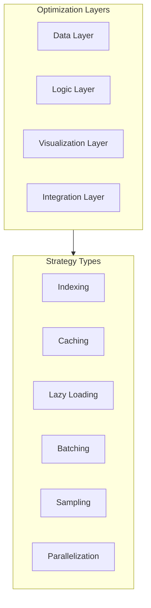

# Performance Optimization Guide 🚀

## Overview

This guide provides comprehensive strategies and best practices for optimizing performance in UltraLink applications. Whether you're working with large datasets, complex networks, vector operations, or interactive visualizations, these techniques will help you build high-performance applications.

## Performance Architecture



## Memory Management

### Data Structure Optimization

UltraLink's data structures can be optimized for memory efficiency:

```javascript
// Configure memory-efficient data structures
ultralink.configure({
    dataStructures: {
        entityStorage: 'sparse', // 'dense', 'sparse', 'adaptive'
        linkStorage: 'adjacencyList', // 'adjacencyList', 'adjacencyMatrix', 'hybrid'
        vectorStorage: 'quantized', // 'float32', 'float16', 'quantized'
        memoryLimit: '4GB'
    }
});
```

### Large Dataset Handling

For large datasets, implement incremental loading strategies:

```javascript
// Configure large dataset handling
ultralink.configure({
    largeDatasets: {
        incrementalLoading: true,
        chunkSize: 1000,
        prefetchDistance: 2, // number of chunks to prefetch
        disposeDistance: 5, // number of chunks to keep in memory
        loadingStrategy: 'priority' // 'sequential', 'priority', 'adaptive'
    }
});
```

### Memory Monitoring

Add monitoring to detect and prevent memory issues:

```javascript
// Set up memory monitoring
ultralink.monitor.memory({
    interval: 5000, // ms
    thresholds: {
        warning: 0.7, // 70% of configured memory limit
        critical: 0.9 // 90% of configured memory limit
    },
    onWarning: (stats) => {
        console.warn('Memory usage high', stats);
        ultralink.gc(); // run garbage collection
    },
    onCritical: (stats) => {
        console.error('Memory usage critical', stats);
        ultralink.reduceCacheSizes();
        ultralink.gc();
    }
});
```

## CPU Optimization

### Computation Strategies

Optimize computation-heavy operations:

```javascript
// Configure computation strategies
ultralink.configure({
    computation: {
        strategy: 'adaptive', // 'realtime', 'background', 'adaptive'
        prioritization: true,
        deferNonEssential: true,
        workerThreads: 4, // number of worker threads to use
        maxConcurrency: 8
    }
});
```

### Batch Processing

Process operations in batches for better CPU utilization:

```javascript
// Configure batch processing
ultralink.batch.configure({
    maxBatchSize: 100,
    batchInterval: 50, // ms
    processingStrategy: 'adaptiveConcurrency',
    sortBy: 'priority'
});

// Use batch processing for vector operations
await ultralink.batch.process([
    { type: 'generateVector', entity: entity1 },
    { type: 'generateVector', entity: entity2 },
    // more operations...
]);
```

### Worker Threading

Offload intensive computation to worker threads:

```javascript
// Configure worker threading
ultralink.workers.configure({
    poolSize: navigator.hardwareConcurrency || 4,
    taskTypes: ['vectorGeneration', 'graphAnalysis', 'dataTransformation'],
    scheduling: 'dynamic' // 'static', 'dynamic', 'work-stealing'
});

// Offload computation to worker
const result = await ultralink.workers.compute({
    task: 'clusterAnalysis',
    data: largeDataset,
    priority: 'high'
});
```

## Data Storage & Retrieval

### Indexing Strategies

Proper indexing dramatically improves query performance:

```javascript
// Configure indexing
ultralink.index.configure({
    indexes: [
        { name: 'byType', fields: ['type'], type: 'hash' },
        { name: 'byAttribute', fields: ['attributes.importance'], type: 'btree' },
        { name: 'fullText', fields: ['attributes.title', 'attributes.content'], type: 'inverted' },
        { name: 'vector', algorithm: 'hnsw', dimensions: 1536, m: 16, efConstruction: 200 }
    ],
    autoIndex: true,
    backgroundIndexing: true,
    reindexingSchedule: '0 0 * * *' // cron syntax, midnight daily
});
```

### Query Optimization

Optimize how you query the UltraLink graph:

```javascript
// Efficient entity queries
const entities = ultralink.query.entities({
    filter: {
        type: 'document',
        'attributes.status': 'published',
        'attributes.importance': { $gt: 0.7 }
    },
    select: ['id', 'type', 'attributes.title'], // projection
    sort: { 'attributes.created': -1 },
    limit: 20,
    useIndex: 'byType'
});

// Efficient relationship queries
const relationships = ultralink.query.relationships({
    source: entity.id,
    types: ['references', 'cites'],
    direction: 'outgoing',
    depth: 2,
    path: true
});
```

### Caching Strategies

Implement effective caching to reduce redundant computation:

```javascript
// Configure caching
ultralink.cache.configure({
    // Entity cache
    entities: {
        strategy: 'lru',
        maxSize: 1000,
        ttl: '1h'
    },
    // Query cache
    queries: {
        strategy: 'lru',
        maxSize: 500,
        ttl: '10m'
    },
    // Computation cache
    computation: {
        strategy: 'tiered',
        levels: [
            { name: 'memory', maxSize: 1000, ttl: '5m' },
            { name: 'indexedDB', maxSize: 10000, ttl: '1d' }
        ]
    },
    // Vector cache
    vectors: {
        strategy: 'similarity',
        maxSize: 5000,
        similarityThreshold: 0.95
    }
});
```

## Network Optimization

### Data Transfer Optimization

Optimize data transfer for network operations:

```javascript
// Configure network optimization
ultralink.network.configure({
    compression: true,
    batchRequests: true,
    maxBatchSize: 50,
    retryStrategy: {
        maxRetries: 3,
        backoff: 'exponential',
        initialDelay: 1000
    },
    prioritization: {
        enabled: true,
        highPriorityEndpoints: ['/vector/generate', '/graph/query']
    }
});
```

### Progressive Loading

Implement progressive loading for large network transfers:

```javascript
// Configure progressive loading
ultralink.network.progressive({
    chunks: true,
    chunkSize: 500,
    priorityFields: ['id', 'type', 'attributes.title'],
    loadComplete: false,
    onChunkReceived: (chunk, progress) => {
        updateProgressBar(progress);
        renderPartialResults(chunk);
    }
});
```

### Offline Support

Optimize for intermittent network conditions:

```javascript
// Configure offline support
ultralink.offline.configure({
    enabled: true,
    syncStrategy: 'periodic', // 'immediate', 'periodic', 'manual'
    syncInterval: 300000, // 5 minutes
    conflictResolution: 'server-wins', // 'client-wins', 'server-wins', 'merge', 'manual'
    queueSize: 100,
    storage: {
        mechanism: 'indexedDB',
        encryption: true
    }
});
```

## Vector Operations

### Vector Generation Optimization

Optimize vector embedding generation:

```javascript
// Configure vector optimization
ultralink.vectors.configure({
    generation: {
        batchSize: 32, // optimal batch size for embedding model
        concurrency: 4,
        caching: true,
        preprocessText: true,
        modelOptimization: {
            quantization: true,
            pruning: false,
            dynamicBatching: true
        }
    }
});
```

### Vector Storage Optimization

Optimize how vector data is stored:

```javascript
// Configure vector storage
ultralink.vectors.storage({
    format: 'quantized', // 'float32', 'float16', 'quantized'
    compression: true,
    indexing: {
        algorithm: 'hnsw', // 'flat', 'hnsw', 'pq', 'ivf'
        parameters: {
            m: 16, // higher = more accuracy, more memory
            efConstruction: 200, // higher = more accuracy, slower build
            ef: 50 // higher = more accuracy, slower search
        }
    },
    persistence: {
        strategy: 'hybrid', // 'memory', 'disk', 'hybrid'
        syncInterval: 300000 // 5 minutes
    }
});
```

### Vector Search Optimization

Optimize vector similarity search:

```javascript
// Configure vector search
ultralink.vectors.search.configure({
    algorithm: 'approximate', // 'exact', 'approximate'
    approximateAlgorithm: 'hnsw', // 'hnsw', 'pq', 'ivf'
    maxResults: 100,
    minSimilarity: 0.75,
    returnDistance: true,
    timeout: 1000, // ms
    metrics: 'cosine' // 'cosine', 'euclidean', 'dot', 'angular'
});
```

## Visualization Performance

### Rendering Optimization

Optimize visualization rendering:

```javascript
// Configure rendering optimization
ultralink.visualize.configureRendering({
    renderer: 'auto', // 'svg', 'canvas', 'webgl', 'auto'
    adaptiveDetail: true,
    levels: [
        { threshold: 100, detail: 'high' },
        { threshold: 1000, detail: 'medium' },
        { threshold: 10000, detail: 'low' }
    ],
    webgl: {
        antialiasing: true,
        precision: 'highp', // 'lowp', 'mediump', 'highp'
        depthTest: true,
        alphaBlending: true
    },
    optimizations: {
        culling: true, // don't render off-screen elements
        batching: true, // batch similar draw calls
        instancing: true, // use instanced rendering
        precompute: true // precompute static geometries
    }
});
```

### Visual Complexity Management

Manage visual complexity for better performance:

```javascript
// Configure visual complexity management
ultralink.visualize.configureComplexity({
    maxVisibleNodes: 1000,
    maxVisibleEdges: 2000,
    simplificationStrategies: [
        { threshold: 5000, strategy: 'clustering' },
        { threshold: 10000, strategy: 'sampling' },
        { threshold: 20000, strategy: 'filtering' }
    ],
    dynamicLoading: {
        enabled: true,
        viewport: true,
        expandOnDemand: true
    }
});
```

### Interaction Optimization

Optimize for interactive performance:

```javascript
// Configure interaction optimization
ultralink.visualize.configureInteraction({
    eventThrottling: true,
    throttleDelay: 16, // ms (approx 60fps)
    progressiveRendering: true,
    interactions: {
        pan: { optimized: true, inertia: true },
        zoom: { optimized: true, smoothing: true },
        select: { optimized: true, debounce: 50 }
    },
    responsiveness: {
        prioritizeInteractions: true,
        deferNonEssential: true
    }
});
```

## Performance Testing & Monitoring

### Benchmarking

Set up benchmarks to measure performance:

```javascript
// Configure benchmarking
const benchmark = ultralink.performance.benchmark({
    tests: [
        { name: 'entityCreation', iterations: 1000, setup: setupEntities },
        { name: 'relationshipCreation', iterations: 5000, setup: setupRelationships },
        { name: 'vectorSearch', iterations: 100, setup: setupVectors },
        { name: 'graphTraversal', iterations: 50, setup: setupGraph }
    ],
    warmup: true,
    warmupIterations: 10,
    reporting: {
        detailed: true,
        output: 'console', // 'console', 'file', 'custom'
        compareWithBaseline: true
    }
});

// Run benchmarks
const results = await benchmark.run();
```

### Performance Monitoring

Set up real-time performance monitoring:

```javascript
// Configure performance monitoring
ultralink.performance.monitor({
    metrics: [
        { name: 'memoryUsage', interval: 5000 },
        { name: 'cpuUsage', interval: 5000 },
        { name: 'queryTimes', threshold: 500 },
        { name: 'renderTimes', threshold: 16 },
        { name: 'networkRequests', detailed: true }
    ],
    alerting: {
        enabled: true,
        thresholds: {
            memoryUsage: 0.8, // 80% of limit
            queryTimes: 2000, // ms
            renderTimes: 100 // ms
        }
    },
    logging: {
        level: 'warn', // 'debug', 'info', 'warn', 'error'
        destination: 'console' // 'console', 'file', 'remote'
    },
    visualization: {
        dashboard: true,
        realtime: true
    }
});
```

### Performance Debugging

Tools for identifying performance bottlenecks:

```javascript
// Enable performance debugging
ultralink.performance.debug({
    tracing: true,
    flamegraphs: true,
    breakdown: true,
    profiling: {
        cpu: true,
        memory: true,
        rendering: true
    },
    suggestions: true,
    autoProfiling: {
        enabled: true,
        slowQueryThreshold: 1000, // ms
        highMemoryThreshold: 0.7, // 70% of limit
        slowRenderThreshold: 100 // ms
    }
});
```

## Advanced Optimization Techniques

### Lazy Computation

Implement lazy computation for expensive operations:

```javascript
// Configure lazy computation
ultralink.performance.configureLazy({
    enabled: true,
    operations: [
        { type: 'graphMetrics', strategy: 'on-demand' },
        { type: 'vectorClustering', strategy: 'on-demand' },
        { type: 'impactAnalysis', strategy: 'on-demand' }
    ],
    caching: true,
    invalidation: 'selective' // 'immediate', 'selective', 'manual'
});
```

### Sharding

Partition large data for better performance:

```javascript
// Configure data sharding
ultralink.performance.configureSharding({
    enabled: true,
    strategy: 'attribute', // 'hash', 'range', 'attribute', 'graph'
    shardBy: 'type', // entity property to shard by
    numberOfShards: 4,
    loadBalancing: true,
    replication: false
});
```

### Predictive Loading

Implement predictive loading based on user behavior:

```javascript
// Configure predictive loading
ultralink.performance.configurePredictive({
    enabled: true,
    userBehaviorTracking: true,
    predictionModels: [
        { type: 'navigation', algorithm: 'markov-chain' },
        { type: 'search', algorithm: 'frequency-analysis' },
        { type: 'visualization', algorithm: 'viewport-projection' }
    ],
    preloadThreshold: 0.7, // probability threshold for preloading
    adaptiveLearning: true
});
```

## Domain-Specific Optimizations

### Large Graph Optimization

For very large graphs:

```javascript
// Configure large graph optimization
ultralink.graph.configureLargeGraph({
    partitioning: true,
    metaNodes: true,
    hierarchical: true,
    streaming: true,
    algorithms: {
        pathfinding: 'bidirectional-a-star',
        centrality: 'approximate-betweenness',
        clustering: 'louvain-parallel'
    }
});
```

### Real-time System Optimization

For real-time systems:

```javascript
// Configure real-time optimization
ultralink.realtime.configure({
    updateRate: 60, // updates per second
    interpolation: true,
    prediction: true,
    prioritization: {
        enabled: true,
        strategies: [
            { type: 'viewport', weight: 0.6 },
            { type: 'interaction', weight: 0.3 },
            { type: 'recency', weight: 0.1 }
        ]
    },
    smoothing: {
        enabled: true,
        algorithm: 'exponential',
        factor: 0.3
    }
});
```

### High-Concurrency Optimization

For multi-user systems:

```javascript
// Configure concurrency optimization
ultralink.concurrency.configure({
    locking: {
        strategy: 'optimistic', // 'pessimistic', 'optimistic', 'none'
        timeout: 5000, // ms
        retries: 3
    },
    transaction: {
        enabled: true,
        isolation: 'read-committed', // 'read-uncommitted', 'read-committed', 'repeatable-read', 'serializable'
        timeout: 10000 // ms
    },
    conflict: {
        detection: 'version-based', // 'timestamp-based', 'version-based', 'value-based'
        resolution: 'last-write-wins' // 'first-write-wins', 'last-write-wins', 'merge', 'custom'
    }
});
```

## Best Practices

### Data Modeling

- **Right-size your entities**: Don't create overly detailed entities if not needed
- **Normalize sparingly**: Avoid over-normalization that requires excessive traversals
- **Think in aggregates**: Group related entities that are typically accessed together
- **Use structured attributes**: For complex attributes, use structured objects with clear schemas
- **Be consistent**: Use consistent naming and typing conventions

### Query Patterns

- **Project needed fields**: Only request the data you need
- **Use appropriate indexes**: Make sure queries use available indexes
- **Combine related queries**: Batch related queries to reduce round-trips
- **Use specialized query methods**: Use pattern-specific methods like path finding
- **Consider query complexity**: Be aware of the computational complexity of queries

### Caching Strategy

- **Identify hot data**: Cache frequently accessed entities and query results
- **Cache hierarchically**: Use multi-level caching for different data access patterns
- **Set appropriate TTLs**: Use time-to-live values that match data volatility
- **Use cache invalidation**: Implement proper invalidation strategies for data consistency
- **Monitor hit rates**: Adjust cache sizes and strategies based on hit rate metrics

### Asynchronous Processing

- **Offload heavy operations**: Move intensive operations off the main thread
- **Implement background processing**: For non-time-critical operations
- **Use message queues**: For reliable asynchronous processing
- **Provide feedback**: Show progress for long-running operations
- **Implement retry mechanisms**: Handle failures gracefully

## Troubleshooting Common Performance Issues

### Slow Query Performance

**Symptoms:**
- Queries take longer than expected
- UI feels sluggish when loading data

**Solutions:**
- Analyze query patterns with `ultralink.performance.analyzeQuery(queryFunction)`
- Add appropriate indexes using `ultralink.index.add(...)`
- Optimize query structure to leverage existing indexes
- Implement query-specific caching

### Memory Leaks

**Symptoms:**
- Gradually increasing memory usage
- Performance degrades over time

**Solutions:**
- Use `ultralink.performance.memoryProfile()` to identify retained objects
- Implement proper cleanup in visualization components
- Review event listener attachments and detachments
- Use weakly referenced caches for large objects

### Rendering Performance

**Symptoms:**
- Visualizations are slow to update
- Interactions like zooming and panning lag

**Solutions:**
- Switch to optimized renderer with `ultralink.visualize.setRenderer('webgl')`
- Reduce visual complexity with clustering or filtering
- Implement level-of-detail rendering based on zoom levels
- Use offscreen rendering for preparation steps

### Network Bottlenecks

**Symptoms:**
- Long wait times for data
- Operations timeout or fail

**Solutions:**
- Implement data compression with `ultralink.network.enableCompression()`
- Batch API requests
- Implement progressive loading
- Use caching for frequently accessed remote data

## Case Studies

### Case Study 1: Optimizing a 100,000+ Node Graph

**Challenge:** Visualizing and analyzing a graph with over 100,000 nodes and 500,000 edges.

**Solution:**
1. Implemented hierarchical clustering to reduce visual complexity
2. Used WebGL rendering with custom shaders for high-performance drawing
3. Configured adaptive detail levels based on zoom
4. Implemented viewport-based loading of visible data only
5. Used web workers for all heavy graph analytics

**Results:**
- Reduced initial load time from 30 seconds to 3 seconds
- Maintained 60fps during navigation
- Enabled interactive analysis of the full dataset

### Case Study 2: Real-time Collaborative Knowledge Graph

**Challenge:** Supporting 50+ concurrent users editing a shared knowledge graph.

**Solution:**
1. Implemented optimistic concurrency control
2. Used conflict-free replicated data types (CRDTs) for collaborative edits
3. Established differential synchronization for efficient updates
4. Created entity-level locking for sensitive operations
5. Developed smart caching with real-time invalidation

**Results:**
- Supported 50+ simultaneous users
- Reduced sync conflicts by 95%
- Lowered bandwidth usage by 70%
- Maintained sub-100ms response times

## Further Reading

- [Advanced Memory Management](../advanced/memory-management.md)
- [Vector Database Integration](../advanced/vector-databases.md)
- [Distributed UltraLink Systems](../advanced/distributed-systems.md)
- [GPU Acceleration Guide](../advanced/gpu-acceleration.md)
- [Performance Testing Framework](../advanced/performance-testing.md) 