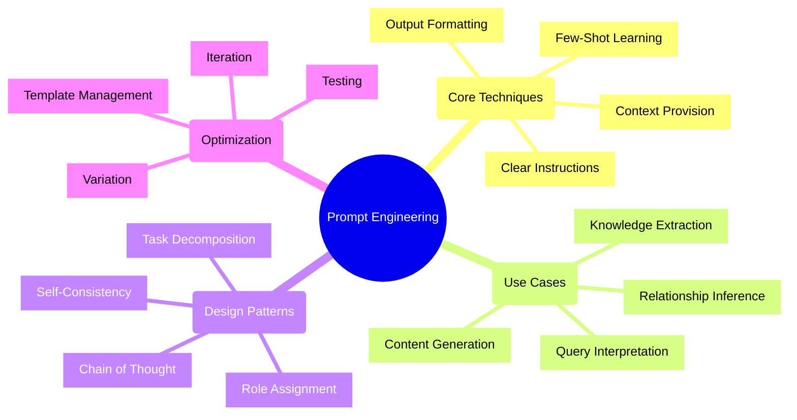
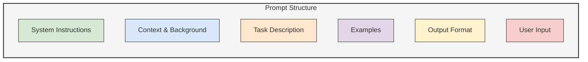
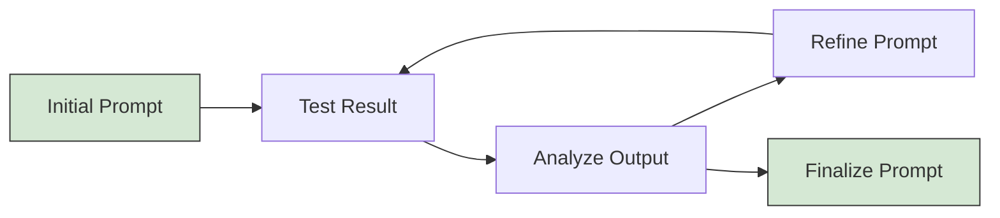

# Prompt Engineering Guide 📝

## Overview

Effective prompt engineering is crucial for getting optimal results from Large Language Models (LLMs) in UltraLink. This guide provides practical techniques, patterns, and examples to craft effective prompts for various UltraLink use cases.



## Fundamentals of Prompt Engineering

### Prompt Components

An effective prompt typically includes several key components:



1. **System Instructions** - Define the assistant's role and general behavior
2. **Context & Background** - Provide relevant information and domain knowledge
3. **Task Description** - Specify the exact task to be performed
4. **Examples** - Demonstrate expected inputs and outputs (few-shot learning)
5. **Output Format** - Define the required response structure
6. **User Input** - Include the specific content to process

### Basic Prompt Template

```javascript
// Define a basic prompt template
const basicPromptTemplate = `
System: {{system}}

Context:
{{context}}

Task:
{{task}}

{{#if examples}}
Examples:
{{examples}}
{{/if}}

Output Format:
{{format}}

User Input:
{{userInput}}
`;

// Use the template
const prompt = ultralink.llm.template(basicPromptTemplate, {
  system: "You are a knowledgeable assistant with expertise in data analysis.",
  context: "We are analyzing a dataset about customer purchasing patterns.",
  task: "Identify key trends and patterns in the data.",
  examples: "Input: [sample data]\nOutput: [sample analysis]",
  format: "Provide your analysis in bullet points with a summary at the end.",
  userInput: customerData
});
```

## Prompt Patterns for UltraLink

### 1. Entity Extraction Pattern

For extracting entities from unstructured text:

```javascript
// Entity extraction prompt
const entityExtractionPrompt = `
System: You are a precise entity extraction assistant.

Task: Extract entities of the specified types from the text below.

Entity Types:
{{entityTypes}}

Output Format:
Return a JSON array of objects, where each object has:
- "type": The entity type from the list above
- "name": The entity name as it appears in the text
- "attributes": An object containing any relevant attributes mentioned

Example Output:
[
  {
    "type": "person",
    "name": "Jane Smith",
    "attributes": {
      "role": "CEO",
      "organization": "Acme Corp"
    }
  }
]

Text to analyze:
{{text}}
`;

// Usage example
const extractedEntities = await ultralink.llm.process({
  template: entityExtractionPrompt,
  params: {
    entityTypes: "person, organization, location, date, project",
    text: documentContent
  },
  temperature: 0.1,  // Lower temperature for more deterministic results
  responseFormat: { type: "json_object" }
});

// Add extracted entities to UltraLink
for (const entity of extractedEntities) {
  await ultralink.addEntity(
    generateId(entity.name, entity.type),
    entity.type,
    entity.attributes
  );
}
```

### 2. Relationship Detection Pattern

For identifying relationships between entities:

```javascript
// Relationship detection prompt
const relationshipDetectionPrompt = `
System: You are an expert at identifying relationships between entities.

Context:
I have identified the following entities:
{{#each entities}}
- {{this.name}} ({{this.type}}): {{this.description}}
{{/each}}

Task:
Identify all relationships between these entities mentioned in the following text.

Output Format:
Return a JSON array of relationship objects with:
- "source": The name of the source entity
- "target": The name of the target entity
- "type": The type of relationship (e.g., "works_for", "located_in", "part_of")
- "attributes": Any additional properties of the relationship
- "evidence": Text snippet that supports this relationship
- "confidence": A number between 0 and 1 indicating confidence

Example:
[
  {
    "source": "Jane Smith",
    "target": "Acme Corp",
    "type": "works_for",
    "attributes": {
      "role": "CEO",
      "start_date": "2020-01-01"
    },
    "evidence": "Jane Smith has been the CEO of Acme Corp since January 2020.",
    "confidence": 0.95
  }
]

Text:
{{text}}
`;

// Usage example
const entityList = await ultralink.getEntities({
  types: ['person', 'organization', 'project'],
  limit: 50
});

const relationships = await ultralink.llm.process({
  template: relationshipDetectionPrompt,
  params: {
    entities: Object.values(entityList).map(e => ({
      name: e.attributes.name || e.id,
      type: e.type,
      description: e.attributes.description || ''
    })),
    text: documentContent
  },
  temperature: 0.2,
  responseFormat: { type: "json_object" }
});

// Add detected relationships to UltraLink
for (const rel of relationships) {
  const sourceId = findEntityId(rel.source, entityList);
  const targetId = findEntityId(rel.target, entityList);
  
  if (sourceId && targetId) {
    await ultralink.addLink(
      sourceId,
      targetId,
      rel.type,
      {
        ...rel.attributes,
        confidence: rel.confidence,
        evidence: rel.evidence
      }
    );
  }
}
```

### 3. Content Enhancement Pattern

For enriching entity descriptions:

```javascript
// Content enhancement prompt
const contentEnhancementPrompt = `
System: You are a knowledgeable assistant specialized in enriching entity descriptions.

Entity Information:
Type: {{entityType}}
Name: {{entityName}}
Current Description: {{description}}
{{#if attributes}}
Attributes:
{{#each attributes}}
- {{@key}}: {{this}}
{{/each}}
{{/if}}

Task:
Enhance the description of this entity by adding more relevant details, context, and explanation. Maintain factual accuracy and do not introduce information not implied by the original description or attributes.

Output Format:
Provide the enhanced description as a single, well-structured paragraph. Do not include phrases like "based on the provided information" or meta-references to the task.

`;

// Usage example
const enhanceEntityDescription = async (entityId) => {
  const entity = await ultralink.getEntity(entityId);
  
  if (!entity) return null;
  
  const enhancedDescription = await ultralink.llm.process({
    template: contentEnhancementPrompt,
    params: {
      entityType: entity.type,
      entityName: entity.attributes.name || entity.id,
      description: entity.attributes.description || '',
      attributes: entity.attributes
    },
    temperature: 0.7,  // Higher temperature for more creative content
    maxTokens: 300
  });
  
  // Update entity with enhanced description
  await ultralink.updateEntity(entityId, {
    description: enhancedDescription,
    description_enhanced: true,
    last_enhanced: new Date().toISOString()
  });
  
  return enhancedDescription;
};
```

### 4. Insight Generation Pattern

For generating insights from entity relationships:

```javascript
// Insight generation prompt
const insightGenerationPrompt = `
System: You are an analytical assistant that identifies non-obvious insights from data.

Context:
I have a knowledge graph with the following entities and relationships:

Entities:
{{#each entities}}
- {{this.id}} ({{this.type}}): {{this.name}}
{{/each}}

Relationships:
{{#each relationships}}
- {{this.source}} {{this.type}} {{this.target}}{{#if this.attributes}} ({{formatAttributes this.attributes}}){{/if}}
{{/each}}

Task:
Analyze this knowledge graph and identify meaningful insights, patterns, and implications that might not be immediately obvious. Focus on:
1. Central entities with many connections
2. Interesting patterns or clusters
3. Potential gaps or missing relationships
4. Strategic implications

Output Format:
Provide 3-5 insights, each with:
- A clear, specific insight statement
- Supporting evidence from the data
- Potential implications or recommendations

`;

// Usage example
const generateNetworkInsights = async (subgraphQuery) => {
  // Get a subgraph to analyze
  const subgraph = await ultralink.getSubgraph(subgraphQuery);
  
  // Format entities and relationships for the prompt
  const entities = Object.values(subgraph.entities).map(e => ({
    id: e.id,
    type: e.type,
    name: e.attributes.name || e.id
  }));
  
  const relationships = [];
  for (const [sourceId, sourceData] of Object.entries(subgraph.entities)) {
    for (const [relType, relTargets] of Object.entries(sourceData.relationships || {})) {
      for (const rel of relTargets) {
        relationships.push({
          source: sourceId,
          type: relType,
          target: rel.target,
          attributes: rel.attributes
        });
      }
    }
  }
  
  // Generate insights
  const insights = await ultralink.llm.process({
    template: insightGenerationPrompt,
    params: {
      entities,
      relationships,
      formatAttributes: (attrs) => {
        return Object.entries(attrs)
          .map(([k, v]) => `${k}: ${v}`)
          .join(', ');
      }
    },
    temperature: 0.5,
    maxTokens: 800
  });
  
  return insights;
};
```

## Advanced Prompt Techniques

### 1. Chain of Thought Prompting

Encourage step-by-step reasoning for complex tasks:

```javascript
// Chain of thought prompt for complex analysis
const chainOfThoughtPrompt = `
System: You are a knowledgeable analytical assistant.

Task:
Analyze the potential impact of the following technology trend on our business model.

Approach this analysis step-by-step:
1. First, identify the key aspects of the technology trend
2. Then, analyze our current business model's strengths and vulnerabilities
3. Next, evaluate how each aspect of the trend might affect specific components of our business
4. Consider both opportunities and threats
5. Finally, provide strategic recommendations based on your analysis

Technology Trend:
{{trend}}

Our Business Model:
{{businessModel}}

Output Format:
Structure your response with clear headings for each step of your analysis.
`;

// Usage example
const strategicAnalysis = await ultralink.llm.process({
  template: chainOfThoughtPrompt,
  params: {
    trend: technologyTrend,
    businessModel: companyBusinessModel
  },
  temperature: 0.4,
  maxTokens: 1200
});
```

### 2. Few-Shot Learning

Provide examples to guide the model:

```javascript
// Few-shot learning for entity classification
const fewShotClassificationPrompt = `
System: You are an expert at classifying entities in our domain.

Task:
Classify each entity into the most appropriate category from our taxonomy.

Categories:
- Product: Physical or digital items we sell
- Customer: Individuals or organizations that purchase our products
- Supplier: Organizations that provide components or services to us
- Process: Internal business processes or workflows
- Technology: Tools, platforms, or systems we use

Examples:
Entity: "Invoice processing"
Analysis: This describes a workflow for handling invoices, which is an internal business activity.
Classification: Process

Entity: "XYZ Corporation"
Analysis: This is a company name, likely either a customer or supplier.
Classification: Customer (if they buy from us) or Supplier (if they provide to us)

Entity: "Cloud database"
Analysis: This is a technical system used for data storage.
Classification: Technology

Your task:
Entity: "{{entity}}"
Analysis:
`;

// Usage example
const classification = await ultralink.llm.process({
  template: fewShotClassificationPrompt,
  params: {
    entity: entityToClassify
  },
  temperature: 0.2
});
```

### 3. Role Assignment

Assign a specific role to guide the model's perspective:

```javascript
// Role assignment for domain-specific responses
const domainExpertPrompt = `
System: You are a {{role}} with over 20 years of experience in {{domain}}. You have deep technical knowledge and practical expertise in solving complex problems in this field.

Context:
{{context}}

Question:
{{question}}

Based on your expertise as a {{role}}, please provide a comprehensive, technically accurate response. Include relevant standards, best practices, and considerations that might not be obvious to someone with less experience.
`;

// Usage example
const expertResponse = await ultralink.llm.process({
  template: domainExpertPrompt,
  params: {
    role: "cybersecurity architect",
    domain: "enterprise network security",
    context: securityContext,
    question: securityQuestion
  },
  temperature: 0.3
});
```

### 4. Task Decomposition

Break complex tasks into smaller, manageable steps:

```javascript
// Task decomposition for complex document analysis
const documentAnalysisPrompt = `
System: You are a document analysis assistant that breaks down complex documents.

Task:
I need to analyze the following document. Please:

1. First, identify the document type and overall structure
2. Extract the key sections and their main points
3. Identify all entities mentioned (people, organizations, products, etc.)
4. Determine the primary purpose and intended audience
5. Highlight any actions, decisions, or deadlines mentioned
6. Summarize the document in a concise paragraph

Document:
{{document}}

Output Format:
Provide your analysis with clear headings for each of the six steps above.
`;

// Usage with UltraLink's pipeline feature
const documentAnalysis = await ultralink.llm.runPipeline({
  stages: [
    {
      name: "initial_analysis",
      template: documentAnalysisPrompt,
      params: { document }
    },
    {
      name: "entity_extraction",
      template: entityExtractionPrompt,
      params: {
        entityTypes: "person, organization, product, date, location",
        text: "{{initial_analysis}}"
      }
    },
    {
      name: "relationship_detection",
      template: relationshipDetectionPrompt,
      dependsOn: ["entity_extraction"],
      params: {
        entities: "{{entity_extraction}}",
        text: document
      }
    }
  ]
});
```

## Prompt Templates in UltraLink

UltraLink provides a built-in template system for managing and reusing prompts:

### 1. Defining Templates

```javascript
// Define reusable templates
ultralink.llm.defineTemplates({
  // Entity extraction template
  "entity_extraction": `
    System: You are a precise entity extraction assistant.
    
    Task: Extract entities of the specified types from the text below.
    
    Entity Types:
    {{entityTypes}}
    
    Output Format:
    Return a JSON array of objects with type, name, and attributes.
    
    Text to analyze:
    {{text}}
  `,
  
  // Relationship detection template
  "relationship_detection": `
    System: You are an expert at identifying relationships between entities.
    
    Context:
    I have identified the following entities:
    {{#each entities}}
    - {{this.name}} ({{this.type}})
    {{/each}}
    
    Task:
    Identify all relationships between these entities mentioned in the following text.
    
    Output Format:
    Return a JSON array of relationship objects with source, target, type, and attributes.
    
    Text:
    {{text}}
  `,
  
  // More templates...
});
```

### 2. Using Templates

```javascript
// Use a predefined template
const entities = await ultralink.llm.process({
  templateName: "entity_extraction",
  params: {
    entityTypes: "person, organization, location, date, project",
    text: documentContent
  },
  responseFormat: { type: "json_object" }
});

// Combine templates
const enhancedTemplate = ultralink.llm.combineTemplates([
  "system_instruction",
  "entity_extraction",
  "custom_output_format"
], {
  // Optional overrides and additions
  additionalContext: "This is a technical document..."
});
```

### 3. Template Management

```javascript
// Get all available templates
const templates = ultralink.llm.listTemplates();

// Get a specific template
const template = ultralink.llm.getTemplate("entity_extraction");

// Update a template
ultralink.llm.updateTemplate("entity_extraction", newTemplateContent);

// Delete a template
ultralink.llm.deleteTemplate("deprecated_template");
```

## Best Practices

### Clarity and Specificity

- Be explicit about what you want the model to do
- Define the exact format for the output
- Provide all necessary context
- Use examples to illustrate expected output

### Iterative Refinement



1. **Start simple**: Begin with a basic prompt
2. **Test**: Evaluate the results
3. **Analyze**: Identify strengths and weaknesses
4. **Refine**: Adjust instructions, context, or examples
5. **Repeat**: Continue testing and refining
6. **Finalize**: Document the optimized prompt

### Managing Complexity

For complex tasks:

- Break down into smaller subtasks
- Use chain-of-thought prompting
- Implement multi-step workflows
- Consider using UltraLink's pipeline feature

### Model Parameters

Adjust parameters based on the task:

| Parameter | Low Value | High Value | Best For |
|-----------|-----------|------------|----------|
| Temperature | 0.0-0.3 | 0.7-1.0 | Deterministic tasks vs. Creative tasks |
| Max Tokens | Lower limit | Higher limit | Concise output vs. Detailed output |
| Top P | 0.1-0.5 | 0.7-1.0 | Focused output vs. Varied output |

## Common Patterns by Use Case

### Data Extraction

```javascript
// Template for structured data extraction
ultralink.llm.defineTemplates({
  "structured_extraction": `
    System: You are a precise data extraction assistant.
    
    Task:
    Extract the following information from the text according to this schema:
    {{schema}}
    
    Output Format:
    Return a valid JSON object matching the schema exactly. Only include fields mentioned in the text. Use null for missing values.
    
    Text:
    {{text}}
  `
});
```

### Content Generation

```javascript
// Template for content generation
ultralink.llm.defineTemplates({
  "content_generation": `
    System: You are a skilled content creator with expertise in {{domain}}.
    
    Context:
    {{context}}
    
    Task:
    Create {{contentType}} about {{topic}} for {{audience}}. The tone should be {{tone}} and the length should be {{length}}.
    
    Key points to include:
    {{keyPoints}}
    
    Output Format:
    Provide the content directly without meta-commentary. Do not include placeholders.
  `
});
```

### Knowledge Base Queries

```javascript
// Template for knowledge base queries
ultralink.llm.defineTemplates({
  "knowledge_query": `
    System: You are an assistant helping to find the most relevant information.
    
    Context:
    The user is querying a knowledge base with information about:
    {{domainDescription}}
    
    Task:
    Convert the user's natural language query into a structured search that will retrieve the most relevant information.
    
    User Query:
    {{query}}
    
    Output Format:
    {
      "interpretedQuery": "Restate what the user is asking for in clear terms",
      "keywords": ["key", "search", "terms"],
      "filters": {
        "entityTypes": ["relevant", "entity", "types"],
        "dateRange": {"start": "YYYY-MM-DD", "end": "YYYY-MM-DD"} or null,
        "attributes": {"attributeName": "value"} or {}
      },
      "sortBy": "relevance" or "date" or "other metric",
      "expandToInclude": ["related", "concepts", "to", "include"]
    }
  `
});
```

## Troubleshooting Prompts

### Common Issues and Solutions

| Issue | Potential Causes | Solutions |
|-------|-----------------|-----------|
| Incomplete outputs | Token limit, unclear instructions | Increase max tokens, clarify required components |
| Inconsistent format | Ambiguous format instructions | Provide explicit format with examples |
| Hallucinations | Insufficient context, high temperature | Add more context, lower temperature |
| Off-topic responses | Unclear focus, prompt injection | Use clearer constraints, implement guardrails |
| Verbose/wordy responses | Lack of conciseness instruction | Explicitly request concise output |

### Debugging Example

```javascript
// Debugging prompt issues
const debugPrompt = async (prompt, params, options = {}) => {
  console.log("=== PROMPT DEBUGGING ===");
  
  // Test with different temperatures
  const temperatures = [0.0, 0.3, 0.7];
  
  for (const temp of temperatures) {
    console.log(`\n--- Temperature: ${temp} ---`);
    
    try {
      const result = await ultralink.llm.process({
        template: prompt,
        params,
        temperature: temp,
        ...options
      });
      
      console.log("Result:", result);
      
      // Analyze token usage
      console.log("Token usage:", ultralink.llm.getLastRequestStats().tokens);
      
      // Analyze response characteristics
      const analysis = await ultralink.llm.process({
        template: "Analyze this response: {{response}}",
        params: { response: result }
      });
      
      console.log("Analysis:", analysis);
    } catch (error) {
      console.error("Error:", error.message);
    }
  }
  
  console.log("\n=== END DEBUGGING ===");
};

// Usage
await debugPrompt(problemPrompt, promptParams);
```

## Advanced Topics

For more detailed information on advanced prompt engineering, refer to:

- [LLM Integration Guide](llm-integration.md) - Complete LLM integration with UltraLink
- [LLM Security Guide](llm-security.md) - Security considerations for prompts
- [Custom Templates](../advanced/custom-templates.md) - Creating and managing template libraries

## Conclusion

Effective prompt engineering is both an art and a science. By applying the patterns, techniques, and best practices in this guide, you can significantly improve the quality and reliability of LLM outputs in your UltraLink applications. Remember that prompt engineering is an iterative process—continue refining your prompts based on results and changing requirements. 