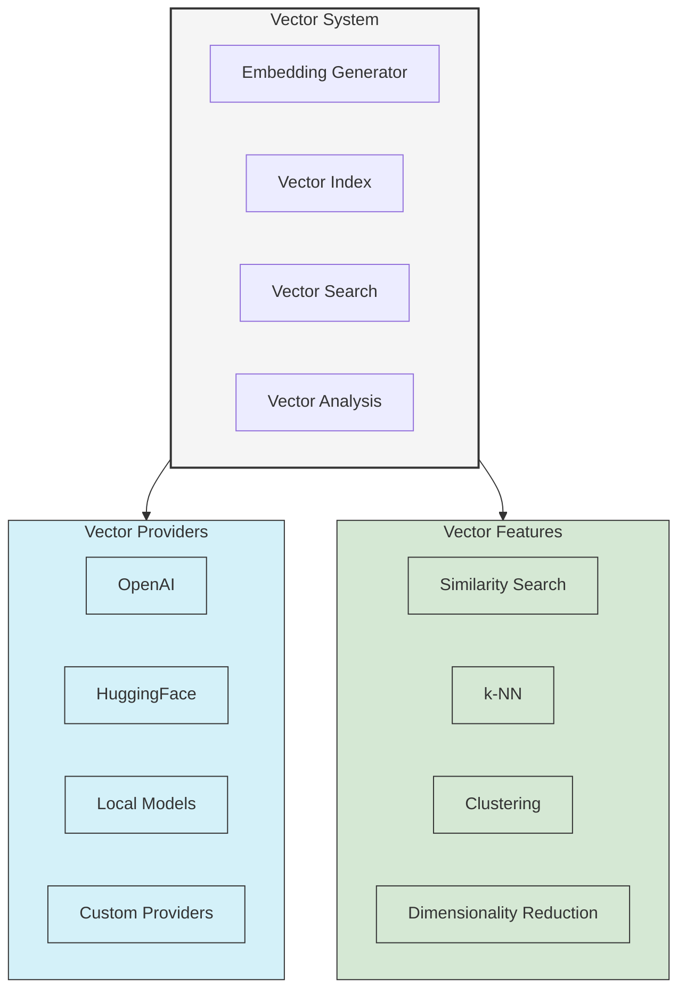

# Vector Operations in UltraLink

This guide provides comprehensive information on UltraLink's vector capabilities, including embedding generation, similarity search, and advanced vector operations.

## Vector System Architecture

UltraLink's vector system is designed to provide powerful embedding and search capabilities:



## Vector Provider Configuration

### Setting Up Vector Providers

```typescript
// Initialize UltraLink with OpenAI embeddings
const ultralink = new UltraLink({
  storage: {
    adapter: 'memory'
  },
  vector: {
    provider: 'openai',
    dimensions: 1536,  // Optional, defaults to provider's dimensions
    options: {
      apiKey: process.env.OPENAI_API_KEY,
      model: 'text-embedding-ada-002'
    }
  }
});

// Initialize with HuggingFace provider
const huggingfaceUltralink = new UltraLink({
  vector: {
    provider: 'huggingface',
    options: {
      apiKey: process.env.HUGGINGFACE_API_KEY,
      model: 'sentence-transformers/all-mpnet-base-v2'
    }
  }
});

// Initialize with local TensorFlow.js provider
const localUltralink = new UltraLink({
  vector: {
    provider: 'tensorflow',
    options: {
      modelPath: './models/universal-sentence-encoder',
      normalizeVectors: true
    }
  }
});
```

### Multiple Vector Providers

UltraLink supports using multiple vector providers simultaneously:

```typescript
const multiProviderUltralink = new UltraLink({
  vector: {
    providers: [
      {
        name: 'default',
        provider: 'openai',
        options: {
          apiKey: process.env.OPENAI_API_KEY,
          model: 'text-embedding-ada-002'
        }
      },
      {
        name: 'local',
        provider: 'tensorflow',
        options: {
          modelPath: './models/universal-sentence-encoder'
        }
      },
      {
        name: 'multilingual',
        provider: 'huggingface',
        options: {
          model: 'sentence-transformers/paraphrase-multilingual-mpnet-base-v2'
        }
      }
    ],
    defaultProvider: 'default'
  }
});

// Use a specific provider
const vector = await multiProviderUltralink.generateEmbedding(
  'Multilingual text to embed',
  { provider: 'multilingual' }
);
```

### Custom Vector Providers

You can create custom vector providers for specialized embedding models:

```typescript
// Implement a custom vector provider
class MyCustomVectorProvider {
  constructor(options) {
    this.model = initializeCustomModel(options);
  }

  async initialize() {
    // Load model, etc.
    await this.model.load();
  }

  async generateEmbedding(content) {
    // Custom embedding generation logic
    const embedding = await this.model.embed(content);
    return embedding;
  }

  similarity(v1, v2) {
    // Custom similarity calculation
    return cosineSimilarity(v1, v2);
  }
}

// Register the custom provider
ultralink.registerVectorProvider('custom', 
  new MyCustomVectorProvider(options)
);

// Use the custom provider
const vector = await ultralink.generateEmbedding(
  'Text to embed',
  { provider: 'custom' }
);
```

## Generating Embeddings

### Basic Embedding Generation

```typescript
// Generate a single embedding
const content = 'UltraLink provides powerful vector capabilities';
const vector = await ultralink.generateEmbedding(content);

console.log(vector.length); // Typically 1536 for OpenAI embeddings

// Generate with specific options
const customVector = await ultralink.generateEmbedding(content, {
  provider: 'openai',
  model: 'text-embedding-ada-002',
  normalize: true
});
```

### Batch Embedding Generation

```typescript
// Generate multiple embeddings in a batch
const contents = [
  'First document to embed',
  'Second document to embed',
  'Third document to embed'
];

const vectors = await ultralink.generateEmbeddings(contents);

console.log(vectors.length); // 3
console.log(vectors[0].length); // 1536
```

### Creating Entities with Embeddings

```typescript
// Create an entity with an embedding
const content = 'UltraLink knowledge graph with vector embeddings';
const vector = await ultralink.generateEmbedding(content);

const entity = await ultralink.createEntity({
  type: 'document',
  attributes: {
    title: 'Vector Capabilities',
    content
  },
  vector
});

console.log('Entity created with vector:', entity.id);

// Shorthand for generating and storing embeddings
const autoEmbeddedEntity = await ultralink.createEntity({
  type: 'document',
  attributes: {
    title: 'Auto-Embedded Document',
    content: 'This content will be automatically embedded'
  },
  generateVector: true  // Automatically generate vector from content
});
```

### Embedding Field Configuration

Configure which fields should be used for embedding generation:

```typescript
const ultralink = new UltraLink({
  vector: {
    provider: 'openai',
    // Configure automatic embedding
    autoEmbed: {
      enabled: true,
      contentField: 'attributes.content',
      titleField: 'attributes.title',
      titleWeight: 0.3,  // Weight title at 30% of the content
      combine: 'weighted-concat'  // Options: concat, weighted-concat
    }
  }
});

// Create an entity with auto-embedding
const entity = await ultralink.createEntity({
  type: 'document',
  attributes: {
    title: 'Vector Search Guide',
    content: 'Comprehensive guide to vector search capabilities'
  },
  // No need to specify generateVector: true if autoEmbed.enabled is true
});
```

## Vector Similarity and Search

### Basic Similarity Calculation

```typescript
// Calculate similarity between two vectors
const v1 = await ultralink.generateEmbedding('First text');
const v2 = await ultralink.generateEmbedding('Similar text');

const similarity = ultralink.calculateSimilarity(v1, v2);
console.log('Similarity score:', similarity); // Value between 0 and 1

// Calculate similarity between entities
const e1 = await ultralink.getEntity('entity-1');
const e2 = await ultralink.getEntity('entity-2');

const entitySimilarity = await ultralink.calculateEntitySimilarity(
  e1.id,
  e2.id
);
console.log('Entity similarity:', entitySimilarity);
```

### Vector Search Methods

```typescript
// Search by text query
const textResults = await ultralink.searchSimilar(
  'How to implement vector search',
  {
    limit: 10,
    threshold: 0.7  // Only return results with similarity >= 0.7
  }
);

// Search by vector
const queryVector = await ultralink.generateEmbedding('Advanced vector operations');
const vectorResults = await ultralink.searchByVector(
  queryVector,
  {
    limit: 5,
    includeVectors: true  // Include the vectors in results
  }
);

// Search with filters
const filteredResults = await ultralink.searchSimilar(
  'Knowledge graph concepts',
  {
    filter: {
      type: 'document',
      'attributes.status': 'published'
    },
    limit: 10
  }
);
```

### k-Nearest Neighbors (k-NN) Search

```typescript
// Find nearest neighbors to an entity
const neighbors = await ultralink.findNearestNeighbors(
  'entity-123',
  {
    limit: 5,
    includeDistance: true
  }
);

console.log('Nearest neighbors:');
for (const neighbor of neighbors) {
  console.log(`${neighbor.entity.id}: ${neighbor.distance}`);
}

// Find nearest neighbors by vector
const vector = await ultralink.generateEmbedding('Query text');
const vectorNeighbors = await ultralink.findNearestNeighborsByVector(
  vector,
  {
    limit: 10,
    filter: {
      type: 'document'
    }
  }
);
```

### Hybrid Search

Combine vector similarity with keyword or attribute filtering:

```typescript
// Hybrid search with keyword and vector components
const hybridResults = await ultralink.search({
  text: 'vector embeddings',
  filter: {
    type: 'document',
    'attributes.tags': {
      contains: 'technical'
    }
  },
  weights: {
    vector: 0.7,  // 70% weight on vector similarity
    keyword: 0.3  // 30% weight on keyword matching
  },
  limit: 20
});

// Advanced hybrid search with multiple components
const advancedHybridResults = await ultralink.search({
  text: 'vector search techniques',
  filter: {
    type: 'document'
  },
  boost: [
    {
      field: 'attributes.rating',
      factor: 0.2,
      type: 'multiply'
    },
    {
      field: 'attributes.views',
      factor: 0.1,
      type: 'log'
    }
  ],
  limit: 10
});
```

## Advanced Vector Operations

### Vector Clustering

```typescript
// Cluster entities by vector similarity
const clusters = await ultralink.clusterEntities({
  type: 'document',
  algorithm: 'kmeans',
  numClusters: 5,
  attributes: ['id', 'type', 'attributes.title']
});

console.log(`Generated ${clusters.length} clusters`);
for (const cluster of clusters) {
  console.log(`Cluster ${cluster.id} with ${cluster.entities.length} entities`);
  console.log(`Centroid similarity: ${cluster.centroidSimilarity}`);
  console.log(`Top terms: ${cluster.topTerms.join(', ')}`);
}

// Advanced clustering with options
const advancedClusters = await ultralink.clusterEntities({
  filter: {
    type: 'document',
    'attributes.status': 'published'
  },
  algorithm: 'hierarchical',
  options: {
    distanceThreshold: 0.3,
    linkage: 'average'
  },
  includeVectors: false
});
```

### Dimensionality Reduction

```typescript
// Reduce vector dimensions for visualization
const reduced = await ultralink.reduceDimensions({
  type: 'document',
  method: 'tsne',  // Options: tsne, umap, pca
  dimensions: 2,
  attributes: ['id', 'attributes.title']
});

console.log('Reduced dimensions for visualization:');
for (const item of reduced) {
  console.log(`${item.attributes.title}: [${item.coordinates.join(', ')}]`);
}

// Export for visualization
const visualizationData = {
  points: reduced.map(item => ({
    id: item.id,
    title: item.attributes.title,
    x: item.coordinates[0],
    y: item.coordinates[1]
  }))
};

// Save to file or send to visualization library
fs.writeFileSync('visualization.json', JSON.stringify(visualizationData));
```

### Vector Operations Pipeline

```typescript
// Create a vector processing pipeline
const pipeline = ultralink.createVectorPipeline([
  {
    type: 'normalize',
  },
  {
    type: 'dimension-reduce',
    method: 'pca',
    dimensions: 100
  },
  {
    type: 'cluster',
    algorithm: 'kmeans',
    numClusters: 5
  }
]);

// Apply pipeline to entities
const results = await pipeline.process({
  type: 'document',
  limit: 1000
});

console.log('Pipeline results:', results);
```

## Semantic Analysis with Vectors

### Text Classification

```typescript
// Classify text into categories
const categories = ['technology', 'science', 'business', 'sports'];
const categoryVectors = await Promise.all(
  categories.map(cat => ultralink.generateEmbedding(cat))
);

// Function to classify text
async function classifyText(text) {
  const textVector = await ultralink.generateEmbedding(text);
  
  // Find most similar category
  let maxSimilarity = -1;
  let bestCategory = null;
  
  for (let i = 0; i < categories.length; i++) {
    const similarity = ultralink.calculateSimilarity(textVector, categoryVectors[i]);
    if (similarity > maxSimilarity) {
      maxSimilarity = similarity;
      bestCategory = categories[i];
    }
  }
  
  return { category: bestCategory, confidence: maxSimilarity };
}

// Classify text
const classification = await classifyText(
  'New smartphone features advanced AI capabilities'
);
console.log('Classification:', classification);
// Output: { category: 'technology', confidence: 0.82 }
```

### Semantic Grouping

```typescript
// Group semantically similar entities
const semanticGroups = await ultralink.findSemanticGroups({
  type: 'document',
  similarityThreshold: 0.8,
  maxGroups: 10,
  attributes: ['id', 'attributes.title']
});

console.log(`Found ${semanticGroups.length} semantic groups`);
for (const group of semanticGroups) {
  console.log(`Group: ${group.label}`);
  console.log(`Entities: ${group.entities.map(e => e.attributes.title).join(', ')}`);
}
```

## Vector Storage and Indexing

### Vector Index Configuration

```typescript
// Configure vector index when initializing
const ultralink = new UltraLink({
  vector: {
    provider: 'openai',
    index: {
      type: 'hnsw',  // Options: hnsw, flat, annoy, faiss
      options: {
        efConstruction: 200,
        M: 16
      }
    }
  }
});

// Create custom index at runtime
await ultralink.createVectorIndex({
  name: 'document_vectors',
  filter: {
    type: 'document'
  },
  indexType: 'hnsw',
  options: {
    efConstruction: 100,
    M: 8
  }
});

// Use specific index for search
const results = await ultralink.searchSimilar('Query text', {
  limit: 10,
  indexName: 'document_vectors'
});
```

### External Vector Stores

```typescript
// Configure external vector store
const ultralink = new UltraLink({
  vector: {
    provider: 'openai',
    store: {
      type: 'pinecone',
      options: {
        apiKey: process.env.PINECONE_API_KEY,
        environment: 'us-west1-gcp',
        index: 'ultralink-vectors'
      }
    }
  }
});

// Configure Qdrant vector store
const qdrantUltralink = new UltraLink({
  vector: {
    provider: 'openai',
    store: {
      type: 'qdrant',
      options: {
        url: 'http://localhost:6333',
        collectionName: 'ultralink'
      }
    }
  }
});
```

## Optimizing Vector Operations

### Caching Vector Embeddings

```typescript
// Configure vector caching
const ultralink = new UltraLink({
  vector: {
    provider: 'openai',
    cache: {
      enabled: true,
      ttl: 86400,  // 24 hours
      maxSize: 10000  // Store up to 10,000 vectors
    }
  }
});

// Cache control in embedding requests
const vector = await ultralink.generateEmbedding('Text to embed', {
  cache: {
    bypass: false,  // Use cache if available
    key: 'custom-key'  // Custom cache key
  }
});
```

### Batch Processing

```typescript
// Batch create entities with vectors
const documents = [
  { title: 'Document 1', content: 'Content for document 1' },
  { title: 'Document 2', content: 'Content for document 2' },
  { title: 'Document 3', content: 'Content for document 3' }
];

// Process in batch
const entities = await ultralink.createEntitiesWithVectors(
  documents.map(doc => ({
    type: 'document',
    attributes: doc,
    contentField: 'attributes.content'  // Field to generate vector from
  }))
);

console.log(`Created ${entities.length} entities with vectors`);
```

### Vector Compression

```typescript
// Configure vector compression
const ultralink = new UltraLink({
  vector: {
    provider: 'openai',
    compression: {
      enabled: true,
      method: 'scalar-quantization',  // or 'product-quantization'
      options: {
        bits: 8
      }
    }
  }
});

// Apply compression to existing vectors
await ultralink.compressVectors({
  filter: {
    type: 'document'
  },
  method: 'scalar-quantization',
  options: {
    bits: 8
  }
});
```

## Working with Vector Metadata

### Vector Metadata Management

```typescript
// Add metadata to vectors
const entity = await ultralink.createEntity({
  type: 'document',
  attributes: {
    title: 'Vector Metadata Example',
    content: 'This document demonstrates vector metadata'
  },
  vector: {
    data: await ultralink.generateEmbedding('Vector content'),
    metadata: {
      model: 'text-embedding-ada-002',
      dimensions: 1536,
      contentHash: 'sha256:abc123',
      timestamp: Date.now()
    }
  }
});

// Query by vector metadata
const results = await ultralink.findEntities({
  where: {
    'vector.metadata.model': 'text-embedding-ada-002',
    'vector.metadata.dimensions': 1536
  }
});
```

### Vector Versioning

```typescript
// Configure vector versioning
const ultralink = new UltraLink({
  vector: {
    provider: 'openai',
    versioning: {
      enabled: true,
      keepVersions: 3  // Keep last 3 vector versions
    }
  }
});

// Update entity with new vector but keep history
await ultralink.updateEntity('entity-123', {
  attributes: {
    content: 'Updated content'
  },
  generateVector: true,
  keepVectorHistory: true
});

// Get vector history
const vectorHistory = await ultralink.getVectorHistory('entity-123');
console.log(`Entity has ${vectorHistory.length} vector versions`);

// Revert to previous vector
await ultralink.revertToVectorVersion('entity-123', vectorHistory[1].id);
```

## Vector Visualizations

### Vector Space Visualization

```typescript
// Generate visualization data
const visualizationData = await ultralink.generateVectorVisualization({
  type: 'document',
  limit: 100,
  dimensions: 2,  // Reduce to 2D for visualization
  method: 'tsne',
  options: {
    perplexity: 30,
    iterations: 1000
  }
});

// Format for visualization libraries
const forD3 = visualizationData.map(item => ({
  id: item.id,
  label: item.attributes.title,
  x: item.coordinates[0],
  y: item.coordinates[1],
  category: item.attributes.category,
  size: item.attributes.importance || 1
}));

// Export to file
fs.writeFileSync('vector-visualization.json', JSON.stringify(forD3));
```

### Similarity Heatmap

```typescript
// Generate similarity matrix for entities
const entities = await ultralink.findEntities({
  type: 'document',
  limit: 20,
  select: ['id', 'attributes.title']
});

const similarityMatrix = await ultralink.generateSimilarityMatrix(
  entities.map(e => e.id)
);

// Format for heatmap visualization
const heatmapData = {
  labels: entities.map(e => e.attributes.title),
  matrix: similarityMatrix
};

// Export for visualization
fs.writeFileSync('similarity-heatmap.json', JSON.stringify(heatmapData));
```

## Implementing Vector Workflows

### Content Recommendation System

```typescript
// User profile based on interests
async function buildUserProfile(userId) {
  // Get user's viewed or liked documents
  const userInteractions = await getUserInteractions(userId);
  
  if (userInteractions.length === 0) {
    return null; // No profile available
  }
  
  // Get the vectors for the documents
  const interactionVectors = await Promise.all(
    userInteractions.map(async interaction => {
      const entity = await ultralink.getEntity(interaction.documentId);
      return {
        vector: entity.vector,
        weight: interaction.score // based on view time, likes, etc.
      };
    })
  );
  
  // Create a weighted average vector representing user's interests
  return createWeightedVector(interactionVectors);
}

// Generate personalized recommendations
async function getRecommendations(userId) {
  const userProfile = await buildUserProfile(userId);
  
  if (!userProfile) {
    // Fall back to popular content
    return getPopularContent();
  }
  
  // Find content similar to user profile
  const recommendations = await ultralink.searchByVector(userProfile, {
    filter: {
      type: 'document',
      'attributes.status': 'published',
      // Exclude already viewed documents
      'id': {
        notIn: await getUserViewedDocuments(userId)
      }
    },
    limit: 10
  });
  
  return recommendations;
}
```

### Semantic Document Classification

```typescript
// Create category vectors
async function setupCategories() {
  const categories = [
    {
      id: 'technology',
      description: 'Articles about computers, software, and digital innovation'
    },
    {
      id: 'science',
      description: 'Articles about scientific research, discoveries, and methods'
    },
    {
      id: 'business',
      description: 'Articles about finance, entrepreneurship, and management'
    }
  ];
  
  // Create or update category entities with vectors
  for (const category of categories) {
    await ultralink.createOrUpdateEntity({
      id: `category-${category.id}`,
      type: 'category',
      attributes: category,
      vector: await ultralink.generateEmbedding(category.description),
      upsert: true
    });
  }
}

// Classify a document into categories
async function classifyDocument(documentId) {
  const document = await ultralink.getEntity(documentId);
  
  if (!document.vector) {
    // Generate vector if not available
    document.vector = await ultralink.generateEmbedding(
      document.attributes.content
    );
    
    await ultralink.updateEntity(documentId, { vector: document.vector });
  }
  
  // Find similar categories
  const categories = await ultralink.searchByVector(document.vector, {
    filter: {
      type: 'category'
    },
    limit: 3,
    threshold: 0.5
  });
  
  // Assign categories with confidence scores
  const documentCategories = categories.map(result => ({
    categoryId: result.entity.id.replace('category-', ''),
    confidence: result.score
  }));
  
  // Update document with categories
  await ultralink.updateEntity(documentId, {
    attributes: {
      categories: documentCategories
    }
  });
  
  return documentCategories;
}
```

## Best Practices

### Optimizing Vector Performance

1. **Batch Processing**: Use `generateEmbeddings` for multiple texts instead of individual calls.

2. **Caching Strategy**: Enable vector caching to avoid redundant API calls:
   ```typescript
   const ultralink = new UltraLink({
     vector: {
       provider: 'openai',
       cache: {
         enabled: true,
         ttl: 86400,  // 24 hours
         storage: 'redis'  // Options: memory, redis, disk
       }
     }
   });
   ```

3. **Index Selection**: Use appropriate vector indexes based on your dataset size:
   - Small datasets (< 10k vectors): `flat` index
   - Medium datasets: `hnsw` index
   - Large datasets (> 1M vectors): External vector store like Pinecone or Qdrant

4. **Dimension Reduction**: Consider reducing vector dimensions for large datasets:
   ```typescript
   // Reduce dimensions while preserving most information
   await ultralink.reduceDimensionsForAll({
     method: 'pca',
     dimensions: 256,
     filter: {
       type: 'document'
     }
   });
   ```

### Vector Quality Best Practices

1. **Content Preprocessing**:
   ```typescript
   // Configure text preprocessing
   const ultralink = new UltraLink({
     vector: {
       provider: 'openai',
       preprocessing: {
         enabled: true,
         trim: true,
         removeStopwords: false,
         maxTokens: 8192
       }
     }
   });
   ```

2. **Chunk Management**:
   ```typescript
   // Split long content into chunks
   const chunks = ultralink.splitContent(longDocument, {
     maxChunkSize: 2000,
     overlap: 200
   });
   
   // Create entities for each chunk
   for (const [index, chunk] of chunks.entries()) {
     await ultralink.createEntity({
       type: 'document_chunk',
       attributes: {
         documentId: 'doc-123',
         content: chunk,
         chunkIndex: index
       },
       generateVector: true
     });
   }
   ```

3. **Model Selection**: Choose the right embedding model for your use case:
   - English content: `text-embedding-ada-002`
   - Multilingual: `paraphrase-multilingual-mpnet-base-v2`
   - Code: `code-search-babbage-code-001`

## Next Steps

- [Advanced Queries Guide](./advanced-queries.md) - Complex query capabilities
- [Core API Reference](../api/core.md) - Complete API documentation
- [Performance Optimization](./performance.md) - Performance tuning guide 