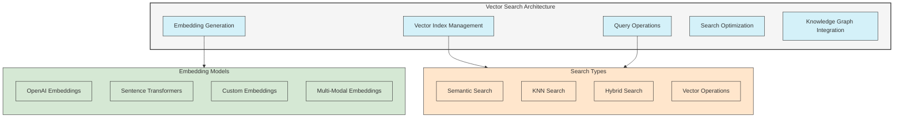
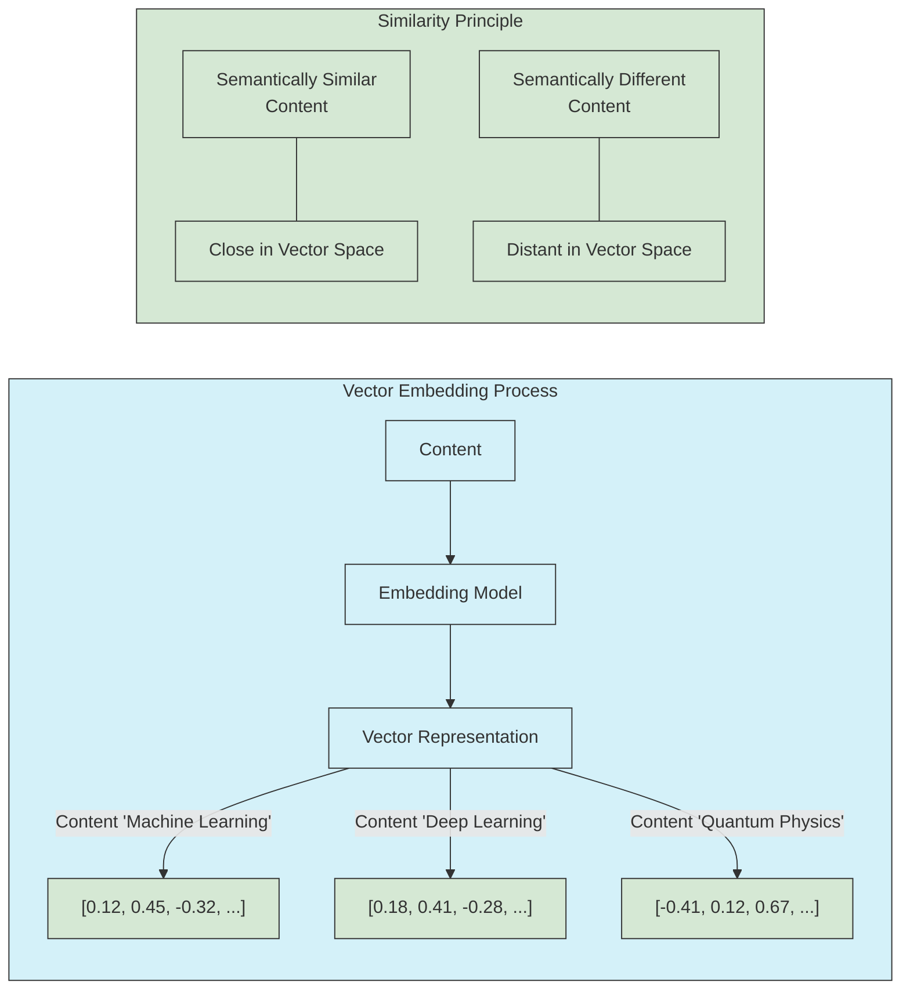

# UltraLink Vector Search Guide

This guide provides a comprehensive overview of UltraLink's vector search capabilities, including how to use the UltraLink Query Language (UQL) for semantic similarity searches, hybrid vector-structural queries, and advanced vector operations.

## Vector Search Architecture

UltraLink's vector search capabilities are built on a sophisticated architecture designed for both accuracy and performance:



## 1. Vector Embedding Basics

### 1.1 What are Vector Embeddings?

Vector embeddings are numerical representations of content (text, images, etc.) in high-dimensional space, where semantic similarity is represented by vector proximity.



### 1.2 Configuring Vector Embeddings

Configure UltraLink to use vector embeddings:

```javascript
// Configure UltraLink with vector embedding capabilities
const ultralink = new UltraLink({
  // Basic configuration
  storage: {
    adapter: 'memory'
  },
  
  // Vector configuration
  vector: {
    provider: 'openai',
    options: {
      apiKey: process.env.OPENAI_API_KEY,
      model: 'text-embedding-ada-002',
      dimensions: 1536
    },
    // Index configuration
    index: {
      type: 'hnsw',
      parameters: {
        M: 16,             // Graph connectivity
        efConstruction: 200, // Index build quality
        efSearch: 100      // Search quality
      }
    }
  }
});

await ultralink.initialize();
```

### 1.3 Generating Embeddings

UltraLink can generate embeddings for entities and content:

```javascript
// Generate embeddings for content
const embedding = await ultralink.generateEmbedding('Machine learning is a subset of artificial intelligence that focuses on the development of algorithms that can learn from and make predictions based on data.');

console.log(embedding.length); // 1536 for OpenAI ada-002

// Create entity with embedding
const entity = await ultralink.addEntity('document-123', 'document', {
  title: 'Introduction to Machine Learning',
  content: 'Machine learning is a subset of artificial intelligence that focuses on the development of algorithms that can learn from and make predictions based on data.'
}, {
  generateVector: true  // Automatically generate vector embedding
});

// Generate embedding for existing entity
await ultralink.generateVectorForEntity('document-456');

// Batch generate embeddings for multiple entities
await ultralink.batchGenerateVectors({
  entityType: 'document',
  attributes: ['title', 'content'],
  where: {
    'attributes.status': 'published'
  }
});
```

## 2. Basic Vector Search Queries

### 2.1 Finding Similar Content

Use UQL to find entities similar to a text query:

```
// Find documents similar to a text query
MATCH (doc:document)
WHERE VECTOR_SIMILARITY(doc, 'neural networks for image classification') > 0.75
RETURN doc
ORDER BY VECTOR_SIMILARITY(doc, 'neural networks for image classification') DESC
LIMIT 10
```

Find entities similar to an existing entity:

```
// Find documents similar to a reference document
MATCH (reference:document {id: 'doc-123'})
MATCH (other:document)
WHERE other.id <> reference.id
  AND VECTOR_SIMILARITY(other, reference) > 0.8
RETURN other.attributes.title, VECTOR_SIMILARITY(other, reference) AS similarity
ORDER BY similarity DESC
```

### 2.2 Using the SIMILAR TO Syntax

UQL provides a `SIMILAR TO` syntax for more expressive vector searches:

```
// Find entities similar to a specific entity
MATCH (target) SIMILAR TO (source {id: 'concept-123'})
WITH target, similarity
WHERE similarity > 0.75
RETURN target, similarity
ORDER BY similarity DESC
LIMIT 10

// Find documents similar to a text query
MATCH (doc:document) SIMILAR TO {text: 'quantum computing applications'}
WITH doc, similarity
WHERE similarity > 0.7
RETURN doc, similarity
ORDER BY similarity DESC
```

### 2.3 Vector Search with Filtering

Combine vector similarity with traditional filters:

```
// Find similar documents with publication date filter
MATCH (doc:document)
WHERE VECTOR_SIMILARITY(doc, 'machine learning for healthcare') > 0.7
  AND doc.attributes.publication_date > '2022-01-01'
  AND doc.attributes.status = 'published'
RETURN doc.attributes.title, doc.attributes.publication_date, 
       VECTOR_SIMILARITY(doc, 'machine learning for healthcare') AS relevance
ORDER BY relevance DESC

// Find similar documents with tag filtering
MATCH (doc:document)
WHERE VECTOR_SIMILARITY(doc, 'natural language processing') > 0.75
  AND doc.attributes.tags CONTAINS 'NLP'
RETURN doc.attributes.title, doc.attributes.tags,
       VECTOR_SIMILARITY(doc, 'natural language processing') AS relevance
ORDER BY relevance DESC
```

## 3. Advanced Vector Search Techniques

### 3.1 Hybrid Search: Combining Vector and Graph Operations

Combine vector similarity with graph traversals:

```
// Find publications similar to a topic and authored by specific organization
MATCH (topic:concept {id: 'reinforcement-learning'})
MATCH (org:organization {attributes: {name: 'Stanford University'}})
MATCH (author:person)-[:works_at]->(org)
MATCH (author)-[:authored]->(doc:document)
WHERE VECTOR_SIMILARITY(doc, topic) > 0.7
RETURN doc.attributes.title, author.attributes.name,
       VECTOR_SIMILARITY(doc, topic) AS relevance
ORDER BY relevance DESC

// Find papers that cite documents similar to a query
MATCH (doc:document) SIMILAR TO {text: 'transformer architecture for NLP'}
WITH doc, similarity WHERE similarity > 0.8
MATCH (citing:document)-[:cites]->(doc)
RETURN citing.attributes.title, doc.attributes.title, similarity
ORDER BY similarity DESC
```

### 3.2 Multi-Vector Queries

Perform searches considering multiple vector comparisons:

```
// Find documents similar to multiple concepts
MATCH (ml:concept {id: 'machine-learning'})
MATCH (healthcare:concept {id: 'healthcare'})
MATCH (doc:document)
WHERE VECTOR_SIMILARITY(doc, ml) > 0.7
  AND VECTOR_SIMILARITY(doc, healthcare) > 0.6
RETURN doc.attributes.title,
       VECTOR_SIMILARITY(doc, ml) AS ml_relevance,
       VECTOR_SIMILARITY(doc, healthcare) AS healthcare_relevance,
       (VECTOR_SIMILARITY(doc, ml) + VECTOR_SIMILARITY(doc, healthcare)) / 2 AS combined_relevance
ORDER BY combined_relevance DESC

// Find documents in a specific vector space region
MATCH (doc:document)
MATCH (concept1:concept {id: 'neural-networks'})
MATCH (concept2:concept {id: 'computer-vision'})
MATCH (concept3:concept {id: 'image-recognition'})
WHERE VECTOR_SIMILARITY(doc, concept1) > 0.6
  AND VECTOR_SIMILARITY(doc, concept2) > 0.6
  AND VECTOR_SIMILARITY(doc, concept3) > 0.6
RETURN doc.attributes.title,
       (VECTOR_SIMILARITY(doc, concept1) + 
        VECTOR_SIMILARITY(doc, concept2) +
        VECTOR_SIMILARITY(doc, concept3)) / 3 AS topic_relevance
ORDER BY topic_relevance DESC
```

### 3.3 Negative Vector Matching

Find content dissimilar to a reference:

```
// Find documents similar to one concept but not another
MATCH (doc:document)
MATCH (include:concept {id: 'artificial-intelligence'})
MATCH (exclude:concept {id: 'robot-hardware'})
WHERE VECTOR_SIMILARITY(doc, include) > 0.7
  AND VECTOR_SIMILARITY(doc, exclude) < 0.3
RETURN doc.attributes.title,
       VECTOR_SIMILARITY(doc, include) AS relevance
ORDER BY relevance DESC

// Differential similarity for finding unique content
MATCH (doc:document)
MATCH (reference:document {id: 'survey-paper'})
MATCH (commonplace:concept {id: 'common-knowledge'})
WHERE VECTOR_SIMILARITY(doc, reference) > 0.6
  AND VECTOR_SIMILARITY(doc, commonplace) < 0.4
RETURN doc.attributes.title,
       VECTOR_SIMILARITY(doc, reference) - VECTOR_SIMILARITY(doc, commonplace) AS novelty_score
ORDER BY novelty_score DESC
```

## 4. Vector Operations and Transformations

### 4.1 Vector Arithmetic

Perform arithmetic operations on vectors:

```javascript
// Get embeddings for concepts
const aiEmbedding = await ultralink.getEntityVector('concept-ai');
const mlEmbedding = await ultralink.getEntityVector('concept-ml');
const healthcareEmbedding = await ultralink.getEntityVector('concept-healthcare');

// Vector arithmetic (AI + Healthcare - ML)
const resultVector = ultralink.vectorArithmetic({
  add: [aiEmbedding, healthcareEmbedding],
  subtract: [mlEmbedding]
});

// Search with the computed vector
const results = await ultralink.executeQuery(`
  MATCH (doc:document)
  WHERE VECTOR_SIMILARITY(doc, $vector) > 0.7
  RETURN doc
  ORDER BY VECTOR_SIMILARITY(doc, $vector) DESC
  LIMIT 10
`, { 
  vector: resultVector 
});
```

Using vector arithmetic in UQL:

```
// Conceptual analogy search (king - man + woman = queen)
MATCH (king:concept {id: 'king'})
MATCH (man:concept {id: 'man'})
MATCH (woman:concept {id: 'woman'})
WITH VECTOR_ARITHMETIC([king, woman], [man]) AS target_vector

MATCH (entity)
WHERE entity.id NOT IN ['king', 'man', 'woman']
RETURN entity.attributes.name, VECTOR_SIMILARITY(entity, target_vector) AS similarity
ORDER BY similarity DESC
LIMIT 5
```

### 4.2 Vector Space Exploration

Explore the vector space around specific points:

```
// Find concepts in the neighborhood of a target
MATCH (center:concept {id: 'deep-learning'})
MATCH (other:concept)
WHERE other.id <> center.id
WITH other, VECTOR_SIMILARITY(other, center) AS similarity
WHERE similarity > 0.6
RETURN other.attributes.name, similarity
ORDER BY similarity DESC

// Find entities at specific similarity thresholds
MATCH (reference:document {id: 'survey-paper'})
MATCH (doc:document)
WHERE doc.id <> reference.id
WITH doc, VECTOR_SIMILARITY(doc, reference) AS similarity
RETURN 
  COUNT(CASE WHEN similarity >= 0.9 THEN 1 END) AS very_similar,
  COUNT(CASE WHEN similarity >= 0.7 AND similarity < 0.9 THEN 1 END) AS moderately_similar,
  COUNT(CASE WHEN similarity >= 0.5 AND similarity < 0.7 THEN 1 END) AS somewhat_similar,
  COUNT(CASE WHEN similarity < 0.5 THEN 1 END) AS not_similar
```

### 4.3 Custom Vector Functions

Define and use custom vector functions:

```javascript
// Register a custom vector function
ultralink.registerVectorFunction('weightedSimilarity', (vector1, vector2, weight1 = 0.5, weight2 = 0.5) => {
  // Custom similarity calculation with weights
  const sim = ultralink.vectorSimilarity(vector1, vector2);
  return (sim * weight1) + ((1 - sim) * weight2);
});

// Use the custom function in a query
const results = await ultralink.executeQuery(`
  MATCH (doc:document)
  WHERE CUSTOM_VECTOR_FN('weightedSimilarity', doc, $query, 0.7, 0.3) > 0.6
  RETURN doc
  ORDER BY CUSTOM_VECTOR_FN('weightedSimilarity', doc, $query, 0.7, 0.3) DESC
`, {
  query: 'advanced machine learning techniques'
});
```

## 5. Clustering and Dimensionality Reduction

### 5.1 Vector Clustering

Group entities based on vector similarity:

```
// K-means clustering
CALL vector.kmeans('document', {k: 5, attribute: 'vector'})
YIELD cluster_id, entities
RETURN cluster_id, SIZE(entities) AS size, 
       [e IN entities | e.attributes.title][..5] AS sample_titles

// DBSCAN clustering
CALL vector.dbscan('document', {
  epsilon: 0.2,
  minPoints: 5,
  attribute: 'vector'
})
YIELD cluster_id, entities
RETURN cluster_id, SIZE(entities) AS size
```

### 5.2 Dimensionality Reduction

Reduce vector dimensions for visualization:

```javascript
// Reduce dimensions for visualization
const projection = await ultralink.reduceDimensions({
  entityType: 'document',
  method: 'tsne',  // or 'umap', 'pca'
  dimensions: 2,
  perplexity: 30,  // for t-SNE
  parameters: {
    // Algorithm-specific parameters
    iterations: 1000
  }
});

// Save the projection coordinates to entities
for (const item of projection) {
  await ultralink.updateEntity(item.id, {
    visualization_x: item.coordinates[0],
    visualization_y: item.coordinates[1]
  });
}
```

### 5.3 Topic Modeling with Vectors

Extract topics from document clusters:

```
// Find centroids of document clusters
CALL vector.clustering.centroids('document', {
  clusters: 10,
  attribute: 'vector'
})
YIELD centroid_id, centroid_vector, entities
WITH centroid_id, centroid_vector, entities

// Find closest terms to centroids
MATCH (term:term)
WITH centroid_id, centroid_vector, entities,
     term, VECTOR_SIMILARITY(term, centroid_vector) AS term_relevance
ORDER BY centroid_id, term_relevance DESC
WITH centroid_id, entities, COLLECT(term.attributes.text)[..10] AS topic_terms
RETURN centroid_id, 
       SIZE(entities) AS cluster_size,
       topic_terms,
       [e IN entities[..5] | e.attributes.title] AS sample_documents
```

## 6. Vector Search Applications

### 6.1 Semantic Document Search

Build a semantic document search system:

```javascript
// Define a semantic search function
async function semanticSearch(query, options = {}) {
  const results = await ultralink.executeQuery(`
    MATCH (doc:document)
    WHERE VECTOR_SIMILARITY(doc, $query) > ${options.threshold || 0.7}
    AND ${options.filter ? `doc.attributes.${options.filter}` : 'true'} 
    RETURN doc.id, 
           doc.attributes.title,
           doc.attributes.preview,
           VECTOR_SIMILARITY(doc, $query) AS score
    ORDER BY score DESC
    LIMIT ${options.limit || 10}
  `, { query });
  
  return results;
}

// Example usage
const searchResults = await semanticSearch('quantum machine learning applications', {
  threshold: 0.75,
  filter: 'status = "published"',
  limit: 20
});
```

### 6.2 Recommendation System

Create a hybrid recommendation system:

```
// Content-based recommendations
MATCH (user:user {id: 'user-123'})
MATCH (user)-[:viewed]->(viewed:document)
WITH user, AVG(viewed.vector) AS user_profile

MATCH (doc:document)
WHERE NOT (user)-[:viewed]->(doc)
WITH doc, user, user_profile,
     VECTOR_SIMILARITY(doc, user_profile) AS content_score

// Collaborative filtering component
OPTIONAL MATCH (similar_user:user)-[:viewed]->(doc)
WHERE (similar_user)-[:similar_to]->(user)
WITH doc, user, content_score, COUNT(similar_user) AS social_score

// Final scoring
RETURN doc.attributes.title,
       content_score * 0.7 + (social_score / 10) * 0.3 AS combined_score
ORDER BY combined_score DESC
LIMIT 10
```

### 6.3 Semantic Classification

Use vectors for content classification:

```
// Training a classification model
MATCH (doc:document)-[:belongs_to]->(category:category)
WITH category, COLLECT(doc) AS category_docs
WITH category, REDUCE(acc = 0, d IN category_docs | acc + d.vector) / SIZE(category_docs) AS category_centroid

// Store the centroids
MERGE (classifier:classifier {type: 'document_categories'})
SET classifier.centroids = COLLECT({category: category.id, vector: category_centroid})

// Classification query
MATCH (classifier:classifier {type: 'document_categories'})
MATCH (doc:document {id: 'new-document'})
UNWIND classifier.centroids AS centroid
WITH doc, centroid.category AS category, VECTOR_SIMILARITY(doc, centroid.vector) AS similarity
ORDER BY similarity DESC
LIMIT 1
MERGE (doc)-[:classified_as]->(category:category {id: category})
RETURN doc.attributes.title, category, similarity
```

## 7. Performance Optimization for Vector Search

### 7.1 Vector Index Configuration

Optimize vector indexes for your use case:

```javascript
// Configure vector index for maximum recall
await ultralink.configureVectorIndex({
  type: 'hnsw',
  parameters: {
    M: 64,              // Higher connectivity improves recall but uses more memory
    efConstruction: 400, // Higher value improves index quality but slows construction
    efSearch: 200       // Higher value improves search quality but slows queries
  },
  dimensions: 1536,     // Match your embedding model's dimensions
  metric: 'cosine'      // Use 'cosine', 'euclidean', or 'dot_product' based on your needs
});

// Configure for maximum performance
await ultralink.configureVectorIndex({
  type: 'hnsw',
  parameters: {
    M: 16,               // Lower connectivity for faster searches with less memory
    efConstruction: 100, // Lower value for faster index building
    efSearch: 50         // Lower value for faster queries
  },
  quantization: {        // Quantize vectors to save memory
    enabled: true,
    bits: 8,             // Use 8-bit quantization (vs 32-bit floats)
    type: 'scalar'       // Simple scalar quantization
  }
});
```

### 7.2 Batch Vector Operations

Process vectors in batches for better performance:

```javascript
// Batch vector generation
await ultralink.batchGenerateVectors({
  entities: await ultralink.findEntities({
    type: 'document',
    where: { 'attributes.has_vector': false }
  }),
  concurrency: 10,     // Process 10 embeddings in parallel
  chunkSize: 100       // Process in chunks of 100
});

// Batch similarity calculation
const similarityMatrix = await ultralink.batchCalculateSimilarity({
  source: await ultralink.findEntities({ type: 'document', limit: 100 }),
  target: await ultralink.findEntities({ type: 'concept', limit: 50 }),
  threshold: 0.7,      // Only return similarities above threshold
  outputFormat: 'pairs' // Return as pairs instead of matrix
});
```

### 7.3 Caching Vector Operations

Use caching to improve vector search performance:

```javascript
// Configure vector operation caching
ultralink.configure({
  vector: {
    caching: {
      enabled: true,
      // Cache text-to-embedding conversions
      textToVector: {
        enabled: true,
        maxSize: 5000,   // Cache up to 5000 entries
        ttl: 86400       // 24 hours in seconds
      },
      // Cache similarity calculation results
      similarities: {
        enabled: true,
        maxSize: 10000
      },
      // Cache frequent query results
      queryResults: {
        enabled: true,
        maxSize: 1000
      }
    }
  }
});
```

## 8. Integration with Other UltraLink Features

### 8.1 Combining Vector Search with Temporal Queries

Search for content that has evolved over time:

```
// Find documents that have become more similar to a concept over time
MATCH (concept:concept {id: 'transformer-model'})
MATCH (doc:document) AT '2022-01-01' AS doc_old
MATCH (doc:document) AT '2023-01-01' AS doc_new
WHERE VECTOR_SIMILARITY(doc_new, concept) - VECTOR_SIMILARITY(doc_old, concept) > 0.2
RETURN doc.attributes.title,
       VECTOR_SIMILARITY(doc_old, concept) AS old_similarity,
       VECTOR_SIMILARITY(doc_new, concept) AS new_similarity,
       VECTOR_SIMILARITY(doc_new, concept) - VECTOR_SIMILARITY(doc_old, concept) AS similarity_change
ORDER BY similarity_change DESC
```

### 8.2 LLM-Enhanced Vector Search

Combine vector search with LLM capabilities:

```javascript
// Enhanced semantic search with LLM query expansion
async function enhancedSemanticSearch(query, options = {}) {
  // Use LLM to expand the query with related terms
  const expandedQuery = await ultralink.llm.expandQuery(query, {
    style: 'semantic',
    maxTerms: 5
  });
  
  // Search with both original and expanded queries
  const [originalResults, expandedResults] = await Promise.all([
    ultralink.executeQuery(`
      MATCH (doc:document)
      WHERE VECTOR_SIMILARITY(doc, $query) > ${options.threshold || 0.7}
      RETURN doc, VECTOR_SIMILARITY(doc, $query) AS score
      ORDER BY score DESC
      LIMIT ${options.limit || 10}
    `, { query }),
    
    ultralink.executeQuery(`
      MATCH (doc:document)
      WHERE VECTOR_SIMILARITY(doc, $expandedQuery) > ${options.threshold || 0.7}
      RETURN doc, VECTOR_SIMILARITY(doc, $expandedQuery) AS score
      ORDER BY score DESC
      LIMIT ${options.limit || 10}
    `, { expandedQuery })
  ]);
  
  // Merge and deduplicate results
  const mergedResults = [...originalResults];
  for (const expResult of expandedResults) {
    if (!mergedResults.some(r => r.doc.id === expResult.doc.id)) {
      mergedResults.push(expResult);
    }
  }
  
  return mergedResults.sort((a, b) => b.score - a.score).slice(0, options.limit || 10);
}
```

### 8.3 Export and Visualization

Visualize vector relationships:

```javascript
// Export vector space visualization data
const visualizationData = await ultralink.exportVectorVisualization({
  entityType: 'document',
  reduction: {
    method: 'umap',
    dimensions: 2
  },
  labels: 'attributes.title',
  clusters: {
    method: 'kmeans',
    k: 5,
    colorField: 'cluster'
  },
  format: 'd3'  // Export for D3.js visualization
});

// Export similar entity network
const network = await ultralink.exportSimilarityNetwork({
  entityType: 'document',
  threshold: 0.8,
  maxConnections: 5,  // Max connections per node
  includeAttributes: ['title', 'type', 'publication_date'],
  format: 'graphml'   // Export as GraphML
});
```

## Related Documentation

- [UQL Reference Guide](../reference/query-language-syntax.md)
- [Vector Index Optimization](../technical/vector-index-optimization.md)
- [Advanced Query Patterns](../guides/advanced-query-patterns.md)
- [Embedding Models Reference](../reference/embedding-models.md)
- [Performance Optimization Guide](../performance/query-optimization.md) 