# Visualization & Rendering Guide 🎨

## Overview

UltraLink provides powerful visualization and rendering capabilities that transform complex relational data into insightful visual representations. This guide explains the visualization framework, rendering options, and best practices for creating effective data visualizations.

## Visualization Architecture


## Core Visualization Types

### 1. Network Visualizations


```javascript
// Create network visualization
const networkViz = ultralink.visualize.network({
    data: graphData,
    layout: 'force-directed',
    options: {
        nodeSize: node => node.weight * 5,
        nodeColor: node => colorScale(node.group),
        edgeWidth: edge => edge.weight,
        edgeColor: edge => edge.type === 'strong' ? '#FF5733' : '#C70039',
        labels: true,
        interactive: true
    }
});
```

### 2. Vector Space Visualizations


```javascript
// Create vector space visualization
const vectorViz = ultralink.visualize.vectorSpace({
    vectors: entityVectors,
    dimensions: 2,  // or 3 for 3D visualization
    options: {
        reduction: 'tsne',  // or 'umap', 'pca'
        perplexity: 30,
        iterations: 1000,
        clustering: true,
        clusterAlgorithm: 'kmeans',
        numberOfClusters: 5
    },
    style: {
        pointSize: 5,
        pointColor: point => clusterColors[point.cluster],
        labels: true,
        interactive: true
    }
});
```

### 3. Temporal Visualizations


```javascript
// Create temporal visualization
const timelineViz = ultralink.visualize.timeline({
    events: temporalEvents,
    options: {
        timeUnit: 'month',
        groupBy: 'category',
        layout: 'vertical',  // or 'horizontal'
        zoom: true
    },
    style: {
        eventColor: event => event.type === 'milestone' ? '#FF5733' : '#C70039',
        eventSize: event => event.importance * 5,
        labels: true
    }
});
```

### 4. Matrix Visualizations

```mermaid
graph TB
    subgraph Matrix["Adjacency Matrix"]
        direction LR
        M[
            A B C D
          A■□□■
          B□■■□
          C□■■■
          D■□■■
        ]
    end
```



```javascript
// Create matrix visualization
const matrixViz = ultralink.visualize.matrix({
    data: relationData,
    options: {
        rowOrder: 'cluster',  // or 'alphabetical', 'custom'
        columnOrder: 'cluster',
        normalized: true,
        symmetric: false
    },
    style: {
        colorScale: d3.interpolateViridis,
        labels: true,
        gridLines: true,
        interactive: true
    }
});
```

## Advanced Visualization Features

### 1. Interactive Elements

```javascript
// Add interactivity to visualization
visualization.addInteractivity({
    events: {
        click: handleClick,
        hover: handleHover,
        zoom: handleZoom,
        pan: handlePan
    },
    tooltips: {
        enabled: true,
        content: item => generateTooltipHTML(item),
        position: 'top',
        delay: 300
    },
    selection: {
        enabled: true,
        multiple: true,
        highlight: true
    },
    filters: {
        controls: true,
        properties: ['type', 'category', 'weight']
    }
});
```

### 2. Dynamic Updates

```javascript
// Configure dynamic updates
visualization.configureDynamicUpdates({
    mode: 'realtime',  // or 'polling', 'manual'
    interval: 5000,  // ms, for polling mode
    transition: {
        enabled: true,
        duration: 750,
        easing: 'cubic-in-out'
    },
    dataSource: {
        type: 'websocket',  // or 'api', 'stream'
        url: 'wss://example.com/data'
    }
});
```

### 3. Multi-view Dashboards


```javascript
// Create multi-view dashboard
const dashboard = ultralink.visualize.createDashboard({
    container: '#dashboard',
    layout: {
        type: 'grid',  // or 'flex', 'custom'
        rows: 2,
        columns: 2,
        responsiveBreakpoints: true
    },
    views: [
        { id: 'network', type: 'network', data: networkData, options: networkOptions },
        { id: 'vector', type: 'vector-space', data: vectorData, options: vectorOptions },
        { id: 'timeline', type: 'timeline', data: timelineData, options: timelineOptions },
        { id: 'matrix', type: 'matrix', data: matrixData, options: matrixOptions }
    ],
    coordination: {
        linked: true,
        selections: true,
        filters: true
    }
});
```

## Rendering Systems

### 1. HTML / SVG Rendering

```javascript
// Configure SVG renderer
const svgRenderer = ultralink.render.createRenderer({
    type: 'svg',
    options: {
        width: 800,
        height: 600,
        responsive: true,
        accessibility: true,
        optimization: {
            elementReuse: true,
            clipping: true
        }
    }
});

// Apply renderer to visualization
visualization.setRenderer(svgRenderer);
```

### 2. Canvas / WebGL Rendering

```javascript
// Configure WebGL renderer
const webglRenderer = ultralink.render.createRenderer({
    type: 'webgl',
    options: {
        width: 800,
        height: 600,
        antialiasing: true,
        highDPI: true,
        performanceMode: 'auto',  // or 'quality', 'performance'
        maxElements: 10000
    }
});

// Apply renderer to visualization
visualization.setRenderer(webglRenderer);
```

### 3. Static Image Export

```javascript
// Export visualization to image
await visualization.export({
    format: 'png',  // or 'jpg', 'svg', 'pdf'
    options: {
        width: 1920,
        height: 1080,
        scale: 2,  // for high resolution
        background: '#ffffff',
        quality: 0.9  // for jpg
    },
    output: 'file',  // or 'buffer', 'dataURL'
    filename: 'visualization-export.png'
});
```

## Styling & Theming

### 1. Styling System

```javascript
// Configure visualization style
visualization.setStyle({
    theme: 'light',  // or 'dark', 'custom'
    colors: {
        primary: '#3498db',
        secondary: '#2ecc71',
        accent: '#e74c3c',
        background: '#f8f9fa',
        text: '#2c3e50'
    },
    typography: {
        fontFamily: 'Inter, sans-serif',
        titleSize: '18px',
        labelSize: '12px',
        fontWeight: 400
    },
    elements: {
        node: {
            borderWidth: 2,
            borderColor: '#fff',
            shadow: true
        },
        edge: {
            opacity: 0.7,
            curvature: 0.3
        },
        label: {
            backgroundColor: 'rgba(255, 255, 255, 0.8)',
            padding: '2px 4px',
            borderRadius: '2px'
        }
    }
});
```

### 2. Theme Management

```javascript
// Register custom theme
ultralink.visualize.registerTheme('corporate', {
    colors: corporateColors,
    typography: corporateTypography,
    elements: corporateElements
});

// Apply theme to all visualizations
ultralink.visualize.setGlobalTheme('corporate');
```

### 3. Dynamic Styling

```javascript
// Create dynamic style rules
visualization.setDynamicStyles({
    rules: [
        {
            selector: 'node',
            condition: node => node.importance > 0.7,
            style: {
                size: node => node.importance * 10,
                color: '#e74c3c',
                borderWidth: 3,
                labelVisible: true
            }
        },
        {
            selector: 'edge',
            condition: edge => edge.weight < 0.3,
            style: {
                opacity: edge => edge.weight,
                dashArray: [3, 2],
                width: 1
            }
        }
    ]
});
```

## Layout Algorithms

### 1. Network Layouts


```javascript
// Configure force-directed layout
const forceLayout = ultralink.layout.createLayout({
    type: 'force-directed',
    options: {
        linkDistance: 100,
        charge: -30,
        gravity: 0.1,
        friction: 0.9,
        alpha: 0.1,
        alphaDecay: 0.0228,
        initialPositions: 'random',  // or 'preset'
        constraints: {
            groups: groupDefinitions,
            boundaries: boundaryDefinitions
        }
    }
});

// Apply layout to visualization
visualization.setLayout(forceLayout);
```

### 2. Temporal Layouts

```javascript
// Configure temporal layout
const timelineLayout = ultralink.layout.createLayout({
    type: 'timeline',
    options: {
        orientation: 'horizontal',  // or 'vertical'
        scale: 'linear',  // or 'log', 'time'
        spacing: 'equal',  // or 'proportional'
        alignment: 'center',
        layers: {
            enabled: true,
            groupBy: 'category'
        }
    }
});

// Apply layout to visualization
visualization.setLayout(timelineLayout);
```

### 3. Dimensionality Reduction

```javascript
// Configure dimensionality reduction layout
const tsneLayout = ultralink.layout.createLayout({
    type: 'tsne',
    options: {
        dimensions: 2,
        perplexity: 30,
        iterations: 1000,
        epsilon: 10,
        metric: 'euclidean',  // or 'manhattan', 'cosine'
        initialization: 'random',  // or 'pca'
        progress: progressCallback
    }
});

// Apply layout to visualization
visualization.setLayout(tsneLayout);
```

## Performance Optimization

### 1. Large Data Handling

```javascript
// Configure large data handling
visualization.configureLargeDataHandling({
    strategy: 'adaptive',  // or 'sampling', 'clustering', 'streaming'
    thresholds: {
        nodes: 5000,
        edges: 10000
    },
    sampling: {
        method: 'random',  // or 'importance', 'stratified'
        rate: 0.1,  // 10% of data
        preserveStructure: true
    },
    clustering: {
        maxClusters: 100,
        method: 'modularity',
        expandable: true
    },
    progressive: {
        enabled: true,
        batchSize: 1000,
        interval: 50  // ms
    }
});
```

### 2. Rendering Optimization

```javascript
// Configure rendering optimization
visualization.configureRenderingOptimization({
    level: 'auto',  // or 'low', 'medium', 'high'
    adaptiveDetail: true,
    culling: {
        enabled: true,
        distance: 1000
    },
    lod: {
        enabled: true,
        levels: [
            { distance: 0, detail: 1.0 },
            { distance: 500, detail: 0.7 },
            { distance: 1000, detail: 0.3 }
        ]
    },
    batching: true,
    workerThreads: 4
});
```

### 3. Caching

```javascript
// Configure visualization cache
visualization.configureCache({
    layouts: {
        enabled: true,
        ttl: '1h',
        invalidation: 'auto'
    },
    computations: {
        enabled: true,
        strategies: ['memoize', 'lazy']
    },
    rendering: {
        enabled: true,
        types: ['textures', 'geometries']
    }
});
```

## Integration Examples

### 1. Web Embedding

```javascript
// Create embeddable visualization
const embeddable = ultralink.visualize.createEmbeddable({
    visualization: visualization,
    container: '#visualization-container',
    responsive: true,
    iframe: {
        enabled: false,  // set to true for iframe embedding
        sandboxed: true,
        allowFullscreen: true
    },
    export: {
        enabled: true,
        formats: ['png', 'svg', 'json']
    },
    api: {
        exposed: true,
        methods: ['setData', 'filter', 'highlight']
    }
});

// Generate embed code
const embedCode = embeddable.getEmbedCode();
```

### 2. Application Integration

```javascript
// Integrate with application
app.registerVisualization({
    id: 'network-analysis',
    component: visualization,
    mountPoint: '#app-visualization-container',
    lifecycle: {
        initialize: () => visualization.initialize(),
        update: (data) => visualization.update(data),
        destroy: () => visualization.destroy()
    },
    events: {
        onSelection: handleSelection,
        onFilter: handleFilter,
        onViewChange: handleViewChange
    }
});
```

### 3. Export Pipeline

```javascript
// Configure export pipeline
const exportPipeline = ultralink.visualize.createExportPipeline({
    source: visualization,
    formats: [
        { type: 'svg', options: svgOptions },
        { type: 'png', options: pngOptions },
        { type: 'json', options: jsonOptions },
        { type: 'csv', options: csvOptions }
    ],
    batch: {
        enabled: true,
        variations: [
            { name: 'small', width: 800, height: 600 },
            { name: 'medium', width: 1200, height: 900 },
            { name: 'large', width: 1920, height: 1080 }
        ]
    },
    automation: {
        schedule: '0 0 * * *',  // daily at midnight
        destination: './exports'
    }
});

// Run export pipeline
await exportPipeline.run();
```

## Accessibility & Best Practices

### 1. Accessibility

```javascript
// Configure accessibility
visualization.configureAccessibility({
    features: {
        screenReader: true,
        keyboardNavigation: true,
        highContrast: true,
        textAlternatives: true
    },
    ariaLabels: {
        container: 'Network visualization of research relationships',
        nodes: node => `${node.type}: ${node.id} with importance ${node.importance}`,
        edges: edge => `Relationship from ${edge.source} to ${edge.target} of type ${edge.type}`
    },
    navigation: {
        focusable: true,
        tabIndex: 0,
        keyBindings: {
            'ArrowRight': 'navigateNext',
            'ArrowLeft': 'navigatePrevious',
            'Enter': 'select',
            'Escape': 'reset'
        }
    }
});
```

### 2. Responsiveness

```javascript
// Configure responsive behavior
visualization.configureResponsiveness({
    breakpoints: [
        { width: 480, options: mobileOptions },
        { width: 768, options: tabletOptions },
        { width: 1200, options: desktopOptions }
    ],
    adaptiveLayout: true,
    adaptiveDetail: true,
    preserveAspectRatio: false,
    minDimensions: { width: 300, height: 200 }
});
```

### 3. Best Practices

- **Clarity** - Ensure visualizations communicate clearly and focus on key insights
- **Consistency** - Use consistent visual language across visualizations
- **Context** - Provide context and explanations for complex visualizations
- **Interactivity** - Use interactivity purposefully to enhance understanding
- **Performance** - Optimize for performance with large datasets
- **Accessibility** - Make visualizations accessible to all users
- **Responsiveness** - Ensure visualizations work well on different devices

## Troubleshooting

### 1. Common Issues

| Issue | Possible Causes | Solutions |
|-------|----------------|-----------|
| Poor performance | Too much data, Inefficient rendering | Implement sampling, Use WebGL renderer, Enable batching |
| Visualization not appearing | Container issues, Data problems | Check container size, Validate data, Check console errors |
| Layout problems | Algorithm settings, Data structure | Adjust layout parameters, Check data consistency |
| Interactive features not working | Event binding issues, Renderer limitations | Check event registration, Switch renderers |

### 2. Debugging

```javascript
// Enable visualization debugging
ultralink.visualize.debug({
    level: 'verbose',  // or 'error', 'warn', 'info'
    inspectData: true,
    inspectEvents: true,
    performance: true,
    visualFeedback: true,
    logTo: 'console'  // or 'file', 'custom'
});
```

### 3. Fallbacks

```javascript
// Configure visualization fallbacks
visualization.configureFallbacks({
    renderers: [
        { type: 'webgl', condition: 'webgl-support' },
        { type: 'canvas', condition: 'canvas-support' },
        { type: 'svg', condition: 'always' }
    ],
    features: {
        interactivity: { fallback: 'basic-controls' },
        animations: { fallback: 'none' },
        3d: { fallback: '2d-projection' }
    },
    content: {
        nonVisual: true,
        textSummary: generateTextSummary,
        dataTable: true
    }
});
```

## Advanced Topics

### 1. Custom Visualizations

```javascript
// Create custom visualization type
ultralink.visualize.registerVisualizationType('custom-radial', {
    creator: createRadialVisualization,
    defaults: radialDefaults,
    validators: radialValidators,
    renderers: ['svg', 'canvas']
});

// Create instance of custom visualization
const radialViz = ultralink.visualize.custom('custom-radial', {
    data: hierarchicalData,
    options: customOptions
});
```

### 2. Animation System

```javascript
// Configure animation system
visualization.configureAnimations({
    enabled: true,
    transitions: {
        enter: {
            duration: 500,
            easing: 'cubic-out',
            stagger: 50
        },
        update: {
            duration: 300,
            easing: 'cubic-in-out'
        },
        exit: {
            duration: 300,
            easing: 'cubic-in'
        }
    },
    interactions: {
        hover: {
            scale: 1.2,
            duration: 200
        },
        select: {
            scale: 1.3,
            highlight: true,
            duration: 300
        }
    }
});
```

### 3. Extension System

```javascript
// Create visualization extension
const analyticsExtension = ultralink.visualize.createExtension({
    name: 'advanced-analytics',
    init: (visualization, options) => {
        // Initialize extension
    },
    methods: {
        calculateMetrics: calculateVisualizationMetrics,
        generateReport: generateAnalyticsReport
    },
    hooks: {
        beforeRender: beforeRenderHook,
        afterDataUpdate: afterDataUpdateHook,
        onInteraction: onInteractionHook
    }
});

// Register extension
ultralink.visualize.registerExtension(analyticsExtension);

// Use extension
visualization.useExtension('advanced-analytics', {
    metrics: ['centrality', 'clustering'],
    realtime: true
});
```

## Further Reading

1. [Data Visualization Principles](../guides/visualization-principles.md)
2. [Advanced Network Visualization](../guides/network-visualization.md)
3. [Interactive Dashboard Development](../guides/dashboards.md)
4. [WebGL Rendering Optimization](../guides/webgl-optimization.md)
5. [Accessibility in Data Visualization](../guides/viz-accessibility.md) 