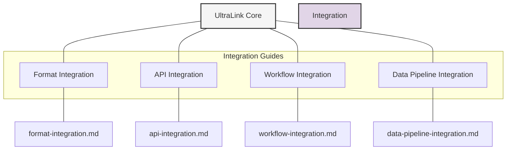
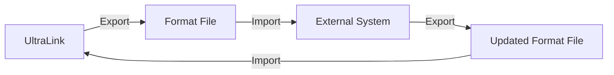
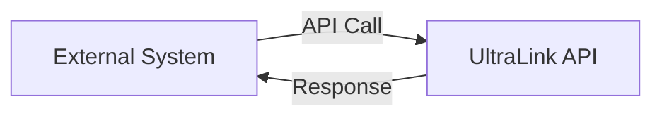
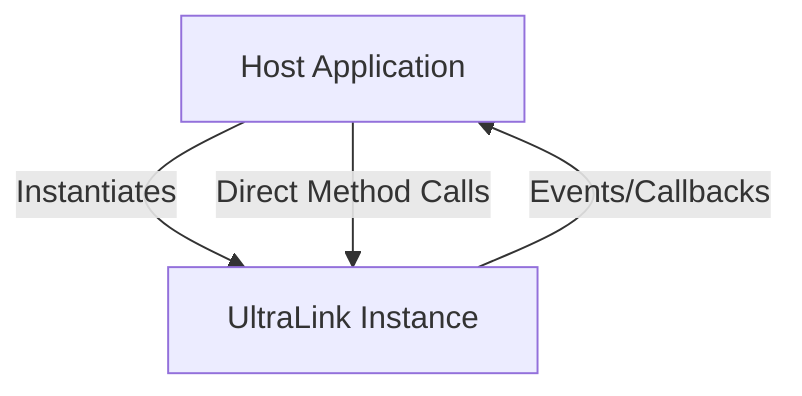
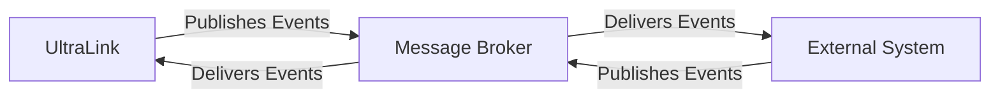

# UltraLink Integration Guides

This directory contains guides, examples, and resources for integrating UltraLink with external systems, tools, and workflows.

## Available Integration Guides

| Guide | Description | Status |
|-------|-------------|--------|
| [Format Integration](format-integration.md) | Integration with external tools using UltraLink's export formats | Available |
| API Integration | Exposing UltraLink functionality through REST, GraphQL, and WebSocket APIs | Planned |
| Workflow Integration | Incorporating UltraLink into CI/CD pipelines, Git workflows, and team processes | Planned |
| Data Pipeline Integration | Integrating UltraLink with ETL processes, data lakes, and analytics pipelines | Planned |

## Integration Patterns

When integrating UltraLink with external systems, consider the following patterns:

### 1. Format-Based Integration

This pattern uses UltraLink's export formats (JSON, GraphML, CSV, etc.) to share data with external systems:

**Use when**: 
- Systems have well-defined import/export capabilities
- Batch processing is acceptable
- Full data dumps are needed

**Example formats**:
- JSON for web applications
- GraphML for graph visualization tools
- CSV for data analysis tools
- Bayesian Network formats for probabilistic modeling
- KIF for AI systems

### 2. API-Based Integration

This pattern exposes UltraLink functionality through APIs that other systems can call:

**Use when**:
- Real-time data access is needed
- Partial data access is common
- Multiple systems need access to the same UltraLink instance

**Example APIs**:
- REST API for CRUD operations
- GraphQL API for flexible querying
- WebSocket API for real-time updates

### 3. Embedded Integration

This pattern embeds UltraLink directly into another application:

**Use when**:
- Deep integration with a single application is needed
- Performance is critical
- Custom functionality is required

**Example embeddings**:
- Browser-based applications
- Desktop applications
- Server applications

### 4. Event-Driven Integration

This pattern uses events and message queues to communicate between UltraLink and other systems:

**Use when**:
- Systems need to stay loosely coupled
- Asynchronous processing is acceptable
- Multiple systems need to react to the same events

**Example implementations**:
- Kafka for high-throughput event processing
- RabbitMQ for reliable message delivery
- Redis Pub/Sub for lightweight messaging

## Best Practices

1. **Document integration points**: Clearly document how systems integrate with UltraLink
2. **Test integration thoroughly**: Create automated tests for integration points
3. **Consider versioning**: Include version information in exports and APIs
4. **Handle errors gracefully**: Implement proper error handling for integration points
5. **Monitor integrations**: Set up monitoring for integration health and performance

## Getting Started

To get started with UltraLink integration:

1. Identify the systems you need to integrate with
2. Select the appropriate integration pattern and format
3. Follow the relevant integration guide
4. Test the integration thoroughly
5. Document the integration for future reference

## Related Resources

- [UltraLink Format Documentation](../formats/README.md)
- [API Reference](../api/README.md)
- [Example Integrations](../examples/integrations/) 