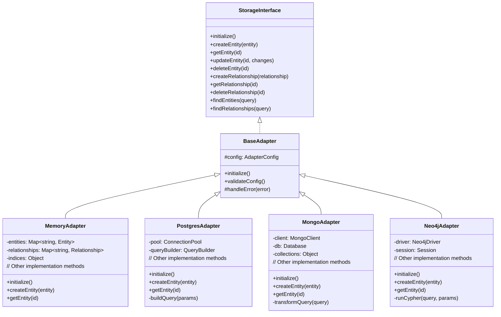
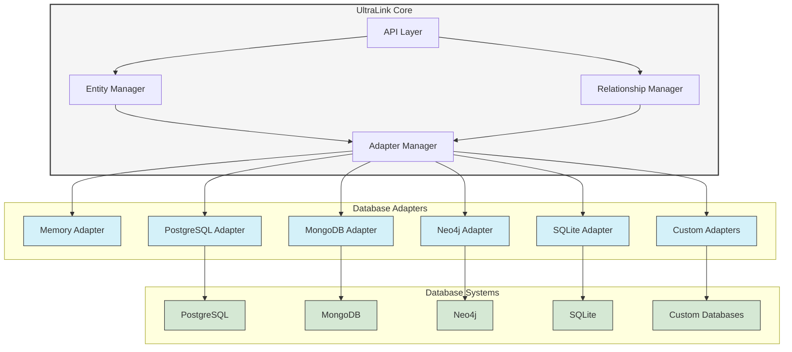
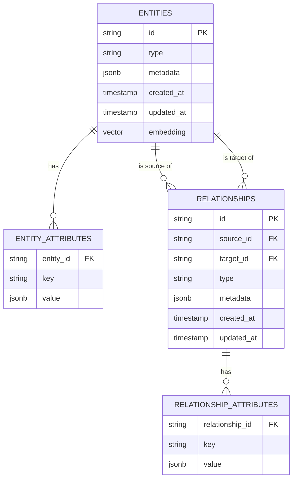
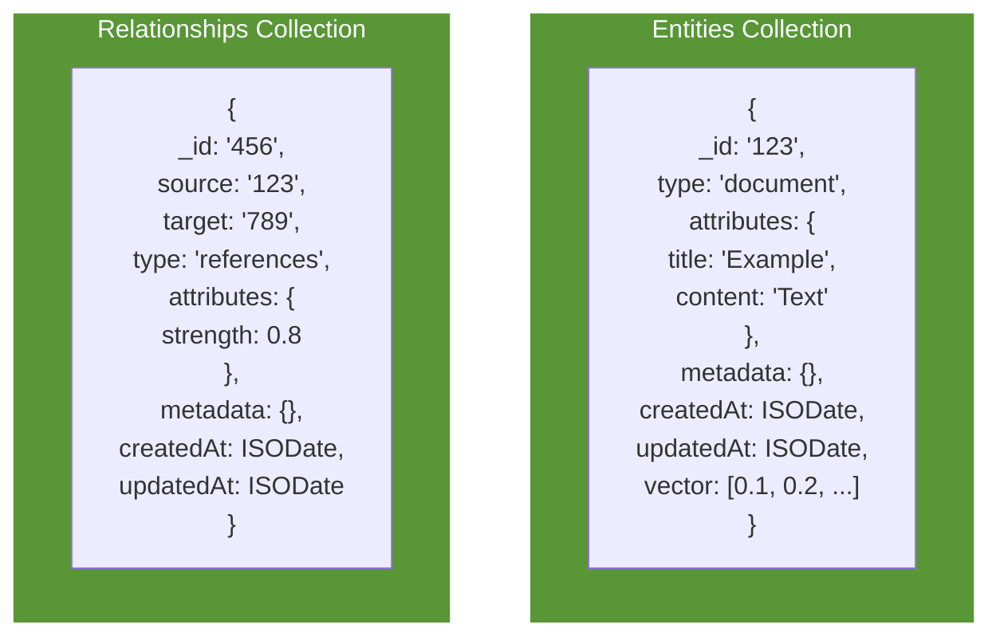
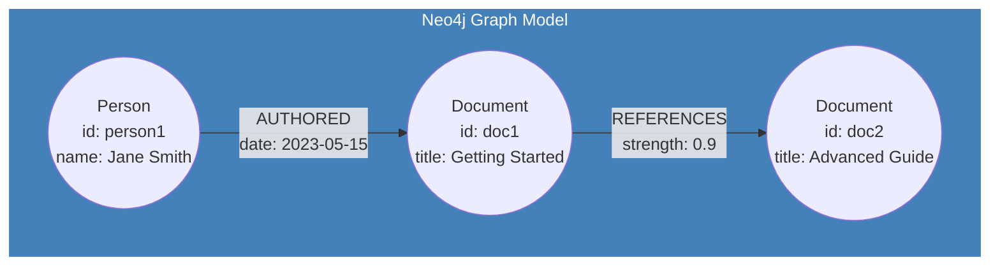
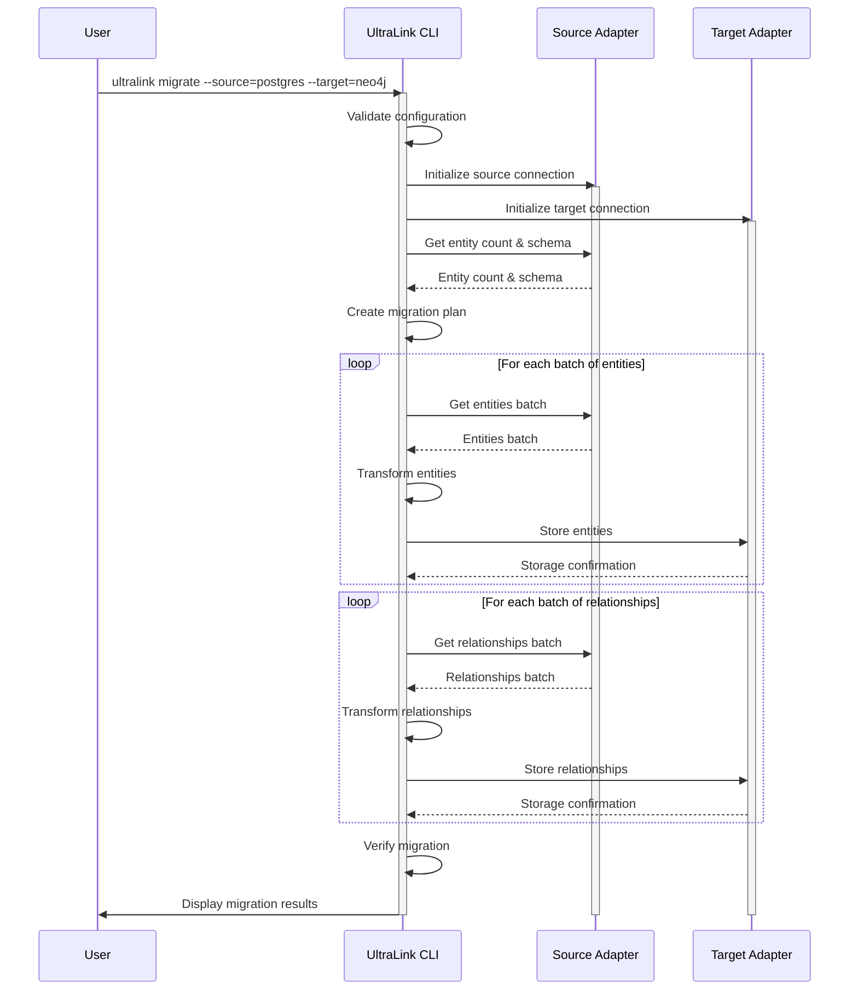
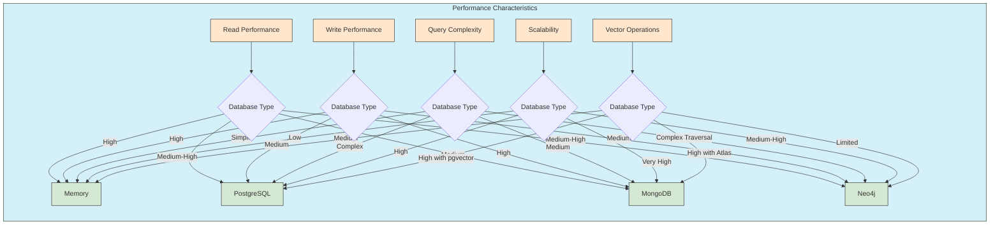

# Database Integration

This document provides comprehensive guidance on integrating UltraLink with various database systems for production deployments. UltraLink supports multiple database backends through its adapter architecture.

## Database Adapter Architecture

UltraLink's database integration is built on a flexible adapter architecture that provides consistent interfaces across different storage backends:



## Database Integration Flow

The following diagram shows how UltraLink interacts with different database systems:



## Database Schema Models

Each database adapter implements the UltraLink data model differently based on database capabilities:

```mermaid
graph TD
    subgraph Relational["Relational Database (PostgreSQL)"]
        direction TB
        
        entity_table[Entities Table]
        entity_attrs[Entity Attributes Table]
        rel_table[Relationships Table]
        rel_attrs[Relationship Attributes Table]
        
        entity_table -->|1:N| entity_attrs
        rel_table -->|1:N| rel_attrs
        entity_table -->|1:N| rel_table
        entity_table -->|1:N| rel_table
    end
    
    subgraph Document["Document Database (MongoDB)"]
        direction TB
        
        entities_coll[Entities Collection]
        rels_coll[Relationships Collection]
        
        entities_coll -.->|referenced by| rels_coll
    end
    
    subgraph Graph["Graph Database (Neo4j)"]
        direction TB
        
        nodes[Nodes with Properties]
        edges[Relationships with Properties]
        
        nodes -->|connected by| edges
    end
    
    classDef relational fill:#f9d9d0,stroke:#333,stroke-width:1px
    classDef document fill:#d0f9d5,stroke:#333,stroke-width:1px
    classDef graph fill:#d0d9f9,stroke:#333,stroke-width:1px
    
    class Relational relational
    class Document document
    class Graph graph
    class entity_table,entity_attrs,rel_table,rel_attrs relational
    class entities_coll,rels_coll document
    class nodes,edges graph
```

## PostgreSQL Integration

### Schema Design



### Configuration

```typescript
import { UltraLink } from '@ultralink/core';
import { PostgresAdapter } from '@ultralink/storage-postgres';

const ultralink = new UltraLink({
  storage: {
    adapter: new PostgresAdapter({
      host: 'localhost',
      port: 5432,
      database: 'ultralink',
      user: 'postgres',
      password: 'password',
      ssl: process.env.NODE_ENV === 'production',
      
      // Schema options
      schema: 'ultralink',
      entityTable: 'entities',
      relationshipTable: 'relationships',
      
      // Connection pool config
      pool: {
        min: 2,
        max: 10,
        idleTimeoutMillis: 30000
      },
      
      // Additional options
      vectorExtension: 'pgvector',
      enableMigrations: true,
      migrationsTable: 'ultralink_migrations'
    })
  }
});

await ultralink.initialize();
```

## MongoDB Integration

### Collection Design



### Configuration

```typescript
import { UltraLink } from '@ultralink/core';
import { MongoAdapter } from '@ultralink/storage-mongodb';

const ultralink = new UltraLink({
  storage: {
    adapter: new MongoAdapter({
      uri: 'mongodb://localhost:27017',
      database: 'ultralink',
      
      // Collection names
      entitiesCollection: 'entities',
      relationshipsCollection: 'relationships',
      
      // Connection options
      useNewUrlParser: true,
      useUnifiedTopology: true,
      
      // Index options
      createIndexes: true,
      vectorIndexConfig: {
        dimensions: 1536,
        type: 'hnsw',
        similarity: 'cosine'
      }
    })
  }
});

await ultralink.initialize();
```

## Neo4j Integration

### Graph Model



### Configuration

```typescript
import { UltraLink } from '@ultralink/core';
import { Neo4jAdapter } from '@ultralink/storage-neo4j';

const ultralink = new UltraLink({
  storage: {
    adapter: new Neo4jAdapter({
      uri: 'neo4j://localhost:7687',
      username: 'neo4j',
      password: 'password',
      database: 'ultralink',
      
      // Connection options
      maxConnectionPoolSize: 50,
      connectionTimeout: 30000,
      
      // Graph model options
      entityLabel: 'Entity',
      relationshipPrefix: 'REL_',
      useNativeTypes: true,
      
      // Vector configuration
      vectorProperty: 'embedding'
    })
  }
});

await ultralink.initialize();
```

## Database Migration Workflow

UltraLink provides tools to help migrate data between different database backends:



## Performance Considerations

Each database backend has different performance characteristics:



## Best Practices

### Database Selection Guidelines

When choosing a database backend for UltraLink, consider the following factors:

1. **Data Volume**: 
   - Small-scale: Memory or SQLite
   - Medium-scale: PostgreSQL
   - Large-scale: MongoDB or PostgreSQL with sharding

2. **Query Patterns**:
   - Simple entity lookups: Any adapter
   - Complex relationship traversals: Neo4j
   - Advanced filtering with good performance: PostgreSQL
   - Flexible schema evolution: MongoDB

3. **Vector Search Requirements**:
   - Advanced vector search: PostgreSQL with pgvector
   - Integrated vector and text search: MongoDB Atlas
   - Simple vector operations: Memory adapter

4. **Deployment Environment**:
   - Serverless: MongoDB Atlas or Aurora PostgreSQL
   - On-premises: Any supported database
   - Edge computing: SQLite

## Links to Related Documentation

- [Storage Configuration Guide](../guides/storage-configuration.md)
- [Vector Index Optimization](../technical/vector-index-optimization.md)
- [Database Performance Benchmarks](../performance/database-benchmarks.md)
- [Migration Between Databases](../advanced/database-migration.md) 