# UltraLink Format Integration Guide

This guide provides practical advice and code examples for integrating UltraLink's export formats with external systems, tools, and workflows.

## Overview

UltraLink's multi-format export capabilities allow for seamless integration with a wide range of systems:

```mermaid
graph TD
    UL[UltraLink]
    
    subgraph "Data Science Tools"
        Jupyter[Jupyter Notebooks]
        R[R/RStudio]
        Python[Python/Pandas]
    end
    
    subgraph "Graph Tools"
        Gephi[Gephi]
        Cytoscape[Cytoscape]
        Neo4j[Neo4j]
    end
    
    subgraph "Knowledge Management"
        Obsidian[Obsidian]
        LogSeq[LogSeq]
        Notion[Notion]
    end
    
    subgraph "AI Systems"
        LLM[LLM Systems]
        KnowledgeGraph[Knowledge Graphs]
        ReasoningEngines[Reasoning Engines]
    end
    
    UL -- CSV --> Jupyter
    UL -- CSV --> R
    UL -- JSON --> Python
    
    UL -- GraphML --> Gephi
    UL -- GraphML --> Cytoscape
    UL -- JSON --> Neo4j
    
    UL -- Markdown --> Obsidian
    UL -- Markdown --> LogSeq
    UL -- HTML --> Notion
    
    UL -- KIF --> ReasoningEngines
    UL -- JSON --> LLM
    UL -- JSON --> KnowledgeGraph
    UL -- BIF --> ProbabilisticModels
```



## Data Science & Analytics Integration

### Python/Pandas Integration

```python
import pandas as pd
import json

# Load JSON export from UltraLink
with open('ultralink_export.json', 'r') as f:
    data = json.load(f)
    
# Create pandas DataFrames
entities_df = pd.DataFrame([
    {**{'id': e['id'], 'type': e['type']}, **e['attributes']} 
    for e in data['entities']
])

relationships_df = pd.DataFrame([
    {
        'source': r['source'], 
        'target': r['target'], 
        'type': r['type'], 
        **r['attributes']
    } 
    for r in data['relationships']
])

# Analyze data
print(entities_df.describe())
print(relationships_df.groupby('type').count())

# Visualize with matplotlib
import matplotlib.pyplot as plt
entity_types = entities_df['type'].value_counts()
entity_types.plot(kind='bar')
plt.title('Entity Types Distribution')
plt.show()
```

### R Integration

```r
library(readr)
library(dplyr)
library(tidygraph)
library(ggraph)

# Load CSV exports from UltraLink
entities <- read_csv("entities.csv")
relationships <- read_csv("relationships.csv")

# Create a graph
graph <- tbl_graph(
  nodes = entities,
  edges = relationships,
  directed = TRUE
)

# Analyze the graph
graph %>%
  activate(nodes) %>%
  mutate(centrality = centrality_degree()) %>%
  arrange(desc(centrality))

# Visualize
ggraph(graph, layout = "fr") +
  geom_edge_link(aes(color = type), alpha = 0.5) +
  geom_node_point(aes(color = type, size = centrality)) +
  theme_graph()
```

## Graph Visualization Tools

### Gephi Integration

1. Export your UltraLink data to GraphML:
   ```javascript
   await ultralink.toGraphML({
     filename: 'network_data.graphml',
     includeAllAttributes: true
   });
   ```

2. In Gephi:
   - Open Gephi and select "File > Open" to import the GraphML file
   - Use the Data Laboratory to explore node and edge attributes
   - Apply layouts (ForceAtlas2 works well for knowledge graphs)
   - Use the Partition panel to color nodes by their types
   - Use the Statistics panel to compute metrics like Betweenness Centrality
   - Use Filters to focus on specific parts of the graph

### Neo4j Integration

```javascript
// Generate Cypher statements from UltraLink
const cypherStatements = ultralink.toCypher({
  createConstraints: true,
  batchSize: 1000,
  includeProperties: true
});

// Write to file for Neo4j import
fs.writeFileSync('import.cypher', cypherStatements);
```

Then in Neo4j:

```cypher
// Load the generated Cypher statements
:source import.cypher

// Example queries
MATCH (n)
RETURN n.type, count(*) as count
ORDER BY count DESC;

// Find paths between entities
MATCH path = (a {id: 'entity1'})-[*1..3]-(b {id: 'entity2'})
RETURN path
LIMIT 10;
```

## Knowledge Management Systems

### Obsidian Integration

1. Export your UltraLink data to Obsidian format:
   ```javascript
   await ultralink.toObsidian({
     directory: './obsidian-vault',
     includeBacklinks: true,
     includeTags: true,
     frontmatterFormat: 'yaml'
   });
   ```

2. In Obsidian:
   - Open the exported directory as a vault
   - Use the Graph View to visualize relationships
   - Create additional notes that reference the generated entities
   - Use the Dataview plugin for advanced querying

### Custom Wiki Integration

For custom wiki systems that support Markdown:

```javascript
// Generate Markdown with custom templates
const markdownFiles = await ultralink.toMarkdown({
  directory: './wiki-content',
  templates: {
    entity: customEntityTemplate,
    index: customIndexTemplate
  },
  linkFormat: '[[{id}|{name}]]'
});
```

## AI and Reasoning Systems

### Knowledge Interchange Format (KIF) Integration

For integrating with knowledge-based and formal reasoning systems:

```javascript
// Export to KIF format
const kifOutput = await ultralink.toKIF({
  includeMetaKnowledge: true,
  includeRules: true,
  prettyPrint: true
});

// Write to file for import into reasoning systems
fs.writeFileSync('knowledge_base.kif', kifOutput);
```

Example of importing into a reasoning system (using a hypothetical JS reasoning engine):

```javascript
const ReasoningEngine = require('reasoning-engine');

// Initialize the engine with the KIF content
const engine = new ReasoningEngine();
await engine.loadKIF('knowledge_base.kif');

// Perform inference
const results = await engine.query(`
  (and 
    (instance ?x Organization)
    (collaborates ?x ResearchGroup))
`);

console.log('Organizations collaborating with the research group:', results);
```

### Bayesian Network Integration

For probabilistic reasoning tools:

```javascript
// Export to BIF format for Bayesian tools
const bifOutput = await ultralink.toBayesianNetwork({
  outputFormat: 'bif',
  includeParameters: true
});

// Write to file
fs.writeFileSync('model.bif', bifOutput);
```

Example of using with a Bayesian inference library:

```javascript
const { BayesianNetwork } = require('bayesian-inference-library');

// Load the network from BIF
const network = BayesianNetwork.fromBIF('model.bif');

// Set evidence
network.setEvidence('FactorA', 'true');
network.setEvidence('FactorB', 'false');

// Perform inference
const posteriorProbability = network.inferProbability('Outcome');
console.log('Posterior probability:', posteriorProbability);
```

## Data Integration Pipelines

### ETL Pipeline Integration

Example of incorporating UltraLink exports into an ETL pipeline:

```javascript
const { pipeline } = require('node-etl-framework');

// Create an ETL pipeline using UltraLink exports
const knowledgeETL = pipeline()
  .extract(async () => {
    // Export data from UltraLink
    const jsonData = await ultralink.toJSON({
      includeMetadata: true,
      includeHistory: false
    });
    return jsonData;
  })
  .transform((data) => {
    // Transform the data for your target system
    return {
      nodes: data.entities.map(e => ({
        id: e.id,
        label: e.attributes.name || e.id,
        properties: {
          ...e.attributes,
          entity_type: e.type
        }
      })),
      edges: data.relationships.map(r => ({
        from: r.source,
        to: r.target,
        label: r.type,
        properties: r.attributes
      }))
    };
  })
  .load(async (transformedData) => {
    // Load into target system (e.g., database)
    await targetSystem.bulkImport(transformedData);
    return { success: true, count: transformedData.nodes.length + transformedData.edges.length };
  });

// Run the pipeline
knowledgeETL.run()
  .then(result => console.log('ETL process completed:', result))
  .catch(err => console.error('ETL process failed:', err));
```

## Web and API Integration

### REST API Integration

Serving UltraLink data through a REST API:

```javascript
const express = require('express');
const app = express();

app.get('/api/knowledge', async (req, res) => {
  try {
    // Export UltraLink data to JSON
    const jsonData = await ultralink.toJSON({
      includeMetadata: false,
      prettyPrint: false
    });
    
    res.json(jsonData);
  } catch (error) {
    res.status(500).json({ error: error.message });
  }
});

app.get('/api/knowledge/graph', async (req, res) => {
  try {
    // Generate GraphML and set content type
    const graphml = await ultralink.toGraphML();
    
    res.set('Content-Type', 'application/xml');
    res.send(graphml);
  } catch (error) {
    res.status(500).json({ error: error.message });
  }
});

app.listen(3000, () => {
  console.log('API server running on port 3000');
});
```

### Web Visualization Integration

Embedding UltraLink visualizations in web applications:

```javascript
// Export UltraLink data to a format compatible with D3.js
const graphData = await ultralink.toD3Format({
  includeAttributes: true,
  nodeIdField: 'id',
  nodeLabelField: 'name',
  nodeTypeField: 'type'
});

// Client-side JavaScript with D3.js
const d3Code = `
document.addEventListener('DOMContentLoaded', () => {
  const data = ${JSON.stringify(graphData)};
  
  const width = 800;
  const height = 600;
  
  const svg = d3.select('#graph')
    .append('svg')
    .attr('width', width)
    .attr('height', height);
    
  const simulation = d3.forceSimulation(data.nodes)
    .force('link', d3.forceLink(data.links).id(d => d.id))
    .force('charge', d3.forceManyBody().strength(-300))
    .force('center', d3.forceCenter(width / 2, height / 2));
    
  // Create links
  const link = svg.append('g')
    .selectAll('line')
    .data(data.links)
    .enter().append('line')
    .attr('stroke', '#999')
    .attr('stroke-opacity', 0.6);
    
  // Create nodes
  const node = svg.append('g')
    .selectAll('circle')
    .data(data.nodes)
    .enter().append('circle')
    .attr('r', 5)
    .attr('fill', d => {
      // Color by node type
      const colors = {
        person: '#ff9900',
        concept: '#0099ff',
        document: '#00cc00'
      };
      return colors[d.type] || '#999';
    })
    .call(d3.drag()
      .on('start', dragstarted)
      .on('drag', dragged)
      .on('end', dragended));
      
  // Add node labels
  const label = svg.append('g')
    .selectAll('text')
    .data(data.nodes)
    .enter().append('text')
    .text(d => d.name || d.id)
    .attr('font-size', 10)
    .attr('dx', 12)
    .attr('dy', 4);
    
  // Update positions on simulation tick
  simulation.on('tick', () => {
    link
      .attr('x1', d => d.source.x)
      .attr('y1', d => d.source.y)
      .attr('x2', d => d.target.x)
      .attr('y2', d => d.target.y);
      
    node
      .attr('cx', d => d.x)
      .attr('cy', d => d.y);
      
    label
      .attr('x', d => d.x)
      .attr('y', d => d.y);
  });
  
  // Drag functions
  function dragstarted(event, d) {
    if (!event.active) simulation.alphaTarget(0.3).restart();
    d.fx = d.x;
    d.fy = d.y;
  }
  
  function dragged(event, d) {
    d.fx = event.x;
    d.fy = event.y;
  }
  
  function dragended(event, d) {
    if (!event.active) simulation.alphaTarget(0);
    d.fx = null;
    d.fy = null;
  }
});
`;

// Create an HTML file with the D3 visualization
const htmlContent = `
<!DOCTYPE html>
<html>
<head>
  <title>UltraLink Knowledge Graph</title>
  <script src="https://d3js.org/d3.v7.min.js"></script>
  <style>
    body { margin: 0; font-family: Arial, sans-serif; }
    #graph { width: 100%; height: 100vh; }
  </style>
</head>
<body>
  <div id="graph"></div>
  <script>${d3Code}</script>
</body>
</html>
`;

fs.writeFileSync('visualization.html', htmlContent);
```

## Batch Processing

For large-scale batch processing of UltraLink data:

```javascript
const { spawn } = require('child_process');
const fs = require('fs');

async function batchExport(ultralink, outputDir) {
  // Create output directory
  if (!fs.existsSync(outputDir)) {
    fs.mkdirSync(outputDir, { recursive: true });
  }
  
  console.log('Starting batch export...');
  
  // Export in multiple formats
  await Promise.all([
    // JSON for data processing
    ultralink.toJSON({ 
      filename: `${outputDir}/data.json` 
    }),
    
    // CSV for data analysis
    ultralink.toCSV({ 
      directory: `${outputDir}/csv` 
    }),
    
    // GraphML for visualization
    ultralink.toGraphML({ 
      filename: `${outputDir}/graph.graphml` 
    }),
    
    // Obsidian for knowledge management
    ultralink.toObsidian({ 
      directory: `${outputDir}/obsidian` 
    }),
    
    // BIF for probabilistic modeling
    ultralink.toBayesianNetwork({
      outputFormat: 'bif',
      filename: `${outputDir}/model.bif`
    }),
    
    // KIF for knowledge representation
    ultralink.toKIF({
      filename: `${outputDir}/knowledge.kif`
    }),
    
    // Full Blob for backup
    ultralink.toFullBlob({
      filename: `${outputDir}/backup.blob`,
      compress: true
    })
  ]);
  
  console.log('Export complete. Processing data...');
  
  // Process the exports with external tools
  const processes = [
    // Run analysis script on CSV data
    spawn('python', ['analyze_data.py', `${outputDir}/csv`]),
    
    // Import into Neo4j
    spawn('neo4j-admin', ['import', '--nodes', `${outputDir}/csv/entities.csv`, '--relationships', `${outputDir}/csv/relationships.csv`]),
    
    // Run Gephi layout algorithm
    spawn('gephi', ['-run', 'ForceAtlas2', '-in', `${outputDir}/graph.graphml`, '-out', `${outputDir}/graph_layout.pdf`])
  ];
  
  // Wait for all processes to complete
  await Promise.all(processes.map(proc => 
    new Promise((resolve, reject) => {
      proc.on('close', code => code === 0 ? resolve() : reject(new Error(`Process exited with code ${code}`)));
    })
  ));
  
  console.log('Batch processing complete!');
}

// Usage
batchExport(myUltraLink, './output/batch-job-123')
  .then(() => console.log('Batch job finished successfully'))
  .catch(err => console.error('Batch job failed:', err));
```

## Best Practices for Format Integration

1. **Choose the right format** for your target system:
   - Use **JSON** for web applications and general-purpose integration
   - Use **CSV** for data analysis and spreadsheet applications
   - Use **GraphML** for graph visualization tools
   - Use **Obsidian format** for knowledge management systems
   - Use **BIF** for probabilistic modeling and Bayesian networks
   - Use **KIF** for symbolic AI and formal reasoning systems
   - Use **Full Blob** for complete backups and system transfers

2. **Validate exports** before integration:
   - Check for expected entity counts and relationship types
   - Verify that all required attributes are present
   - Test with a small subset of data before full-scale integration

3. **Handle errors gracefully**:
   - Implement proper error handling for integration points
   - Set up monitoring for integration pipelines
   - Create fallback mechanisms for critical integrations

4. **Optimize for large datasets**:
   - Use streaming approaches for large exports
   - Consider incremental exports for frequently changing data
   - Implement pagination for API-based integrations

5. **Maintain consistency**:
   - Keep entity and relationship identifiers consistent across systems
   - Document the mapping between UltraLink data models and target systems
   - Implement synchronization mechanisms for bidirectional integrations

## Conclusion

UltraLink's multi-format export capabilities provide tremendous flexibility for integration with external systems and tools. By selecting the appropriate format and following the integration patterns outlined in this guide, you can seamlessly incorporate UltraLink's knowledge representation capabilities into your existing workflows and systems.

For format-specific details, refer to the individual format documentation:

- [JSON Format](../formats/json-format.md)
- [GraphML Format](../formats/graphml-format.md)
- [CSV Format](../formats/csv-format.md) 
- [Obsidian Format](../formats/obsidian-format.md)
- [HTML Website Format](../formats/html-website-format.md)
- [Bayesian Network Format](../formats/bayesian-graph.md)
- [Knowledge Interchange Format (KIF)](../formats/knowledge-interchange-format.md)
- [Full Blob Format](../formats/full-blob-format.md) 