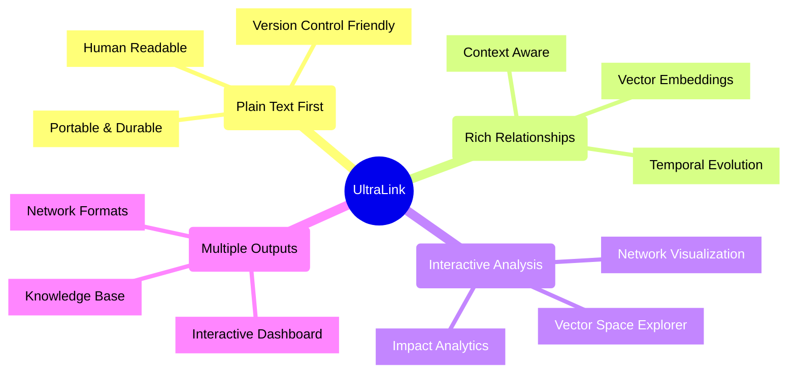
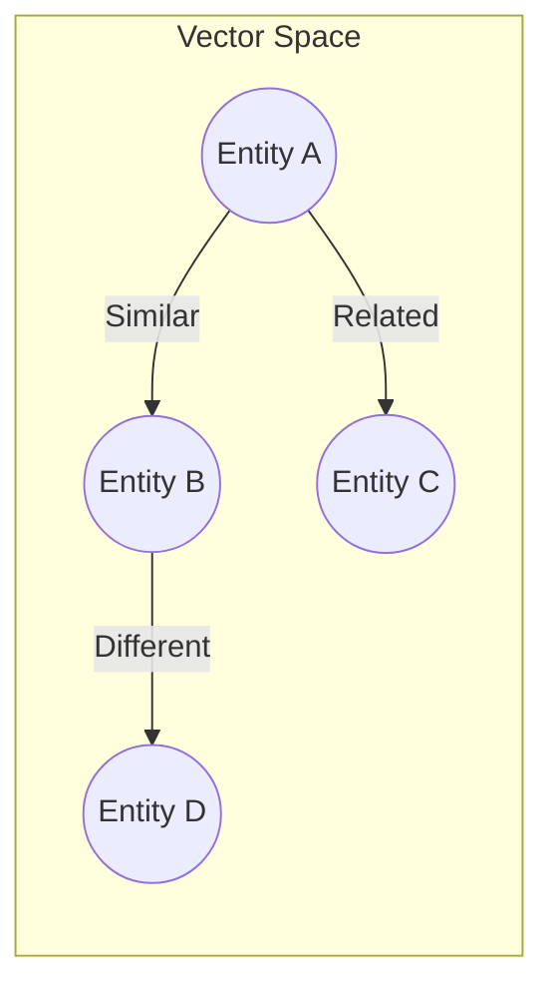
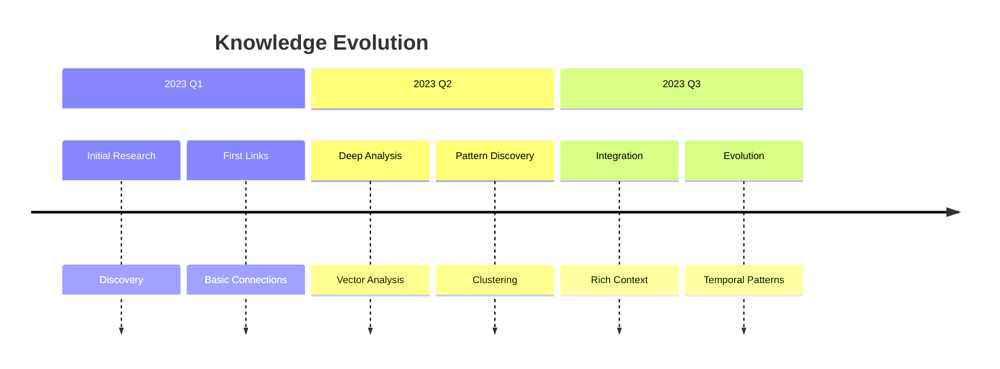
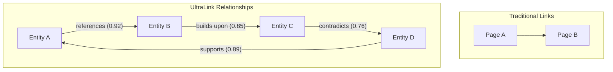
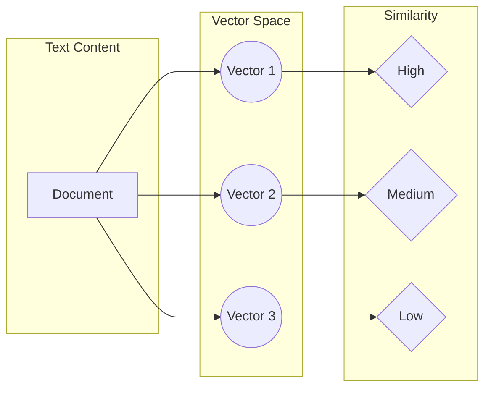
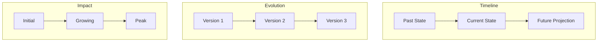
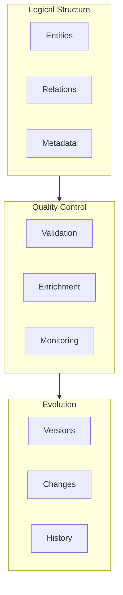
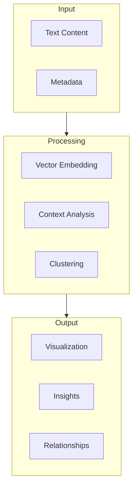
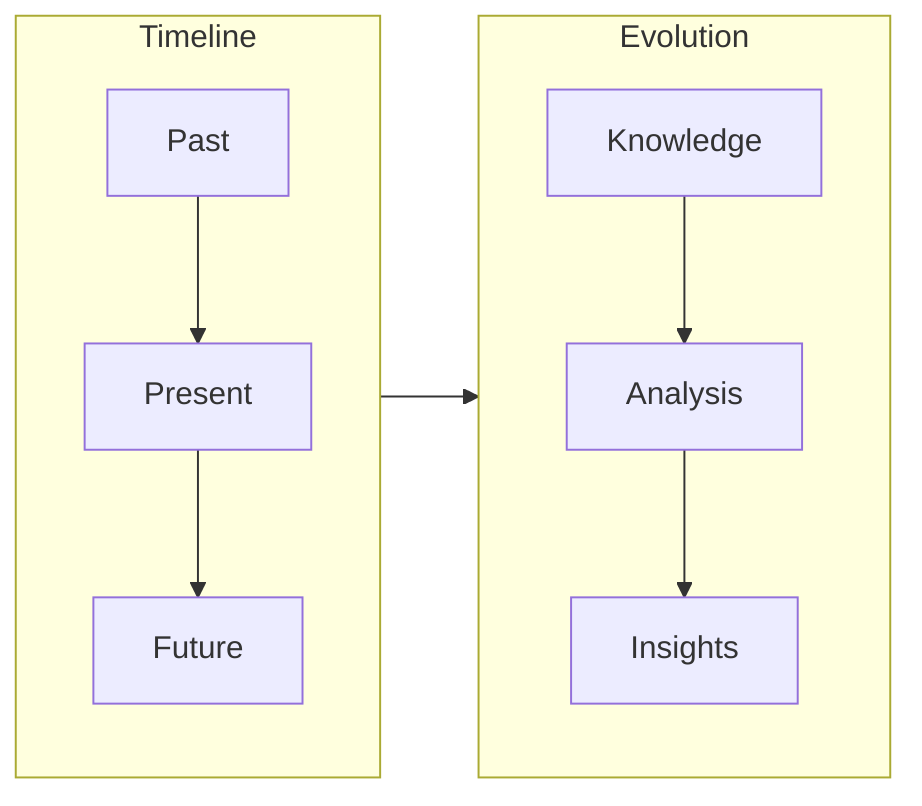

# Welcome to UltraLink! 🚀

## What is UltraLink? 🤔

UltraLink is a revolutionary paradigm for managing and visualizing relational content that goes beyond traditional hypertext. Think of it as "Hypertext 2.0" - where links aren't just connections, but rich relationships with context, meaning, and evolution over time.

## Why UltraLink? 🎯

Traditional systems fall short in several ways:
- 🔗 Links are simple and unidirectional
- 📊 No semantic understanding
- ⏱️ No temporal awareness
- 🔍 Limited analysis capabilities
- 🎨 Basic visualization options

UltraLink solves these problems with:
- 🔄 Rich, bidirectional relationships
- 🧠 Semantic understanding through vectors
- 📈 Temporal evolution tracking
- 📊 Advanced analytics and insights
- 🎨 Interactive visualizations

## The Big Picture 🌟



## Core Concepts 🧠

### 1. Beyond Simple Links 🔗

Traditional hypertext gives us this:
```
[Document A] --> [Document B]
```

UltraLink gives us this:
```
[Document A] --{type: "references",
                confidence: 0.92,
                context: "methodology",
                temporal: "2023-Q2",
                vector: [0.1, 0.2, 0.3]}--> [Document B]
```

### 2. Vector Space Understanding 🎯

Every entity in UltraLink can exist in a semantic vector space:



### 3. Temporal Evolution 📈

Knowledge and relationships evolve over time:



## Understanding Relationships 🔗



### Types of Relationships

1. **Direct References** 📑
   - Citations
   - Dependencies
   - Implementations

2. **Semantic Relations** 🧠
   - Similar concepts
   - Related ideas
   - Opposing views

3. **Temporal Relations** ⏱️
   - Evolution over time
   - Version history
   - Development paths

4. **Impact Relations** 📊
   - Influence metrics
   - Usage patterns
   - Citation impact

## Vector Space Concepts 🎯

### Understanding Embeddings



### Vector Operations

1. **Similarity Calculation** 📐
```javascript
const similarity = ultralink.calculateSimilarity(entity1, entity2);
console.log(`Similarity: ${similarity.toFixed(2)}`); // e.g., 0.85
```

2. **Nearest Neighbors** 🎯
```javascript
const neighbors = ultralink.findNearestNeighbors(entity, {
  limit: 5,
  minSimilarity: 0.7
});
```

3. **Cluster Analysis** 🔍
```javascript
const clusters = ultralink.analyzeClusters({
  method: 'kmeans',
  numberOfClusters: 5
});
```

## Temporal Concepts ⏱️

### Understanding Time in UltraLink



### Temporal Operations

1. **Track Evolution** 📈
```javascript
const history = ultralink.getEvolution(entity, {
  startDate: '2023-01',
  endDate: '2023-12'
});
```

2. **Compare Versions** 🔄
```javascript
const diff = ultralink.compareVersions(entity, {
  version1: 'v1.0',
  version2: 'v2.0'
});
```

3. **Predict Trends** 🎯
```javascript
const prediction = ultralink.predictTrend(entity, {
  metric: 'impact',
  horizon: '6months'
});
```

## Advanced Features 🚀

### 1. LLM Integration

```javascript
// Generate insights
const insights = await ultralink.generateInsights(entity, {
  depth: 'detailed',
  aspects: ['technical', 'impact', 'trends']
});

// Enhance relationships
await ultralink.enhanceRelationships(entity, {
  enrichment: 'semantic',
  confidence: 0.8
});
```

### 2. Custom Visualizations

```javascript
// Create custom network view
const network = ultralink.createVisualization('network', {
  layout: 'force-directed',
  colors: {
    nodes: 'category',
    edges: 'relationship'
  },
  interactions: ['zoom', 'pan', 'click']
});

// Create custom timeline
const timeline = ultralink.createVisualization('timeline', {
  type: 'interactive',
  metrics: ['impact', 'activity'],
  annotations: true
});
```

### 3. Advanced Analytics

```javascript
// Perform impact analysis
const impact = await ultralink.analyzeImpact(entity, {
  metrics: ['citations', 'usage', 'influence'],
  timeframe: 'last-12-months'
});

// Generate network metrics
const metrics = ultralink.calculateNetworkMetrics({
  centrality: true,
  clustering: true,
  pathLength: true
});
```

## Real-World Examples 🌍

### 1. Research Knowledge Base

```javascript
// Create research project
const project = ultralink.createProject('quantum-computing', {
  type: 'research',
  fields: ['physics', 'computer-science'],
  temporal: true
});

// Add research papers
project.addPaper('quantum-supremacy-2023', {
  title: 'Quantum Supremacy Achievement',
  authors: ['Alice Chen', 'Bob Smith'],
  vector: await ultralink.generateVector(paperContent),
  relationships: [
    { type: 'cites', target: 'quantum-theory-2022' },
    { type: 'extends', target: 'quantum-hardware-2023' }
  ]
});
```

### 2. Technical Documentation

```javascript
// Create documentation structure
const docs = ultralink.createDocumentation('api-docs', {
  type: 'technical',
  versions: ['v1', 'v2', 'v3'],
  tracking: true
});

// Add API endpoints with relationships
docs.addEndpoint('/users', {
  methods: ['GET', 'POST'],
  version: 'v2',
  relationships: [
    { type: 'requires', target: 'authentication' },
    { type: 'uses', target: 'user-schema' }
  ],
  vector: await ultralink.generateVector(endpointDocs)
});
```

## Best Practices Extended 🌟

### 1. Data Organization



## Troubleshooting Guide 🔧

### Common Issues and Solutions

1. **Vector Generation**
   ```javascript
   // Problem: Poor vector quality
   // Solution: Adjust parameters
   const vector = await ultralink.generateVector(content, {
     model: 'enhanced',
     preprocessing: true,
     quality: 'high'
   });
   ```

2. **Relationship Management**
   ```javascript
   // Problem: Inconsistent relationships
   // Solution: Validate and clean
   await ultralink.validateRelationships({
     checkCycles: true,
     resolveConflicts: true,
     repairBroken: true
   });
   ```

3. **Performance Issues**
   ```javascript
   // Problem: Slow queries
   // Solution: Optimize indexes
   await ultralink.optimizeIndexes({
     vectors: true,
     relationships: true,
     temporal: true
   });
   ```

## Community and Resources 👥

### 1. Learning Resources 📚
- Interactive Tutorials
- Video Guides
- Code Examples
- Best Practices

### 2. Community Support 💬
- Stack Overflow Tag
- Discord Community
- GitHub Discussions
- Regular Webinars

### 3. Contributing 🤝
- Code Contributions
- Documentation
- Bug Reports
- Feature Requests

## Getting Started 🚀

### 1. Basic Usage

```javascript
// Create a new UltraLink instance
const ultralink = new UltraLink();

// Add entities with rich context
ultralink.addEntity('concept-a', {
  type: 'concept',
  vector: [0.1, 0.2, 0.3],
  temporal: '2023-Q2'
});

// Create meaningful relationships
ultralink.addRelation('concept-a', 'concept-b', {
  type: 'influences',
  strength: 0.85,
  context: 'theoretical_framework'
});
```

### 2. Visualization

```javascript
// Generate interactive dashboard
await ultralink.generateDashboard();

// Export to various formats
await ultralink.export('graphml');
await ultralink.export('obsidian');
```

## Understanding the Magic ✨

### 1. Vector Space Magic 🎯



### 2. Temporal Understanding 🕒



## Best Practices 🌟

1. **Start Simple** 🎯
   - Begin with basic entities and relationships
   - Add richness gradually
   - Let patterns emerge naturally

2. **Think in Contexts** 🧩
   - Consider relationship types
   - Add meaningful metadata
   - Track temporal aspects

3. **Leverage Visualization** 👁️
   - Use the interactive dashboard
   - Explore vector spaces
   - Track evolution over time

4. **Iterate and Refine** 🔄
   - Review and update relationships
   - Enhance with new insights
   - Track impact and usage

## Common Use Cases 🎯

1. **Research Knowledge Base** 📚
   - Track papers and findings
   - Map concept relationships
   - Measure research impact

2. **Project Documentation** 📋
   - Connect related documents
   - Track decision evolution
   - Visualize dependencies

3. **Learning Resources** 🎓
   - Map concept prerequisites
   - Track learning paths
   - Measure understanding

4. **Content Management** 📱
   - Organize related content
   - Track content evolution
   - Analyze impact

## Next Steps 👣

1. **Explore the Documentation** 📚
   - Read the [Core Concepts](../concepts/)
   - Try the [Tutorials](../tutorials/)
   - Check [Examples](../examples/)

2. **Join the Community** 👥
   - GitHub Discussions
   - Discord Channel
   - Regular Webinars

3. **Start Building** 🏗️
   - Create your first project
   - Share your experience
   - Contribute back

## Need Help? 🆘

- 📚 [Documentation](../README.md)
- 💬 [Discord Community](https://discord.gg/ultralink)
- 🐛 [Issue Tracker](https://github.com/ultralink/issues)
- 📧 [Support Email](mailto:support@ultralink.dev)

Welcome aboard the UltraLink journey! 🚀 