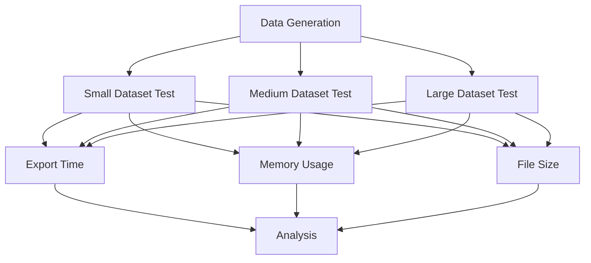
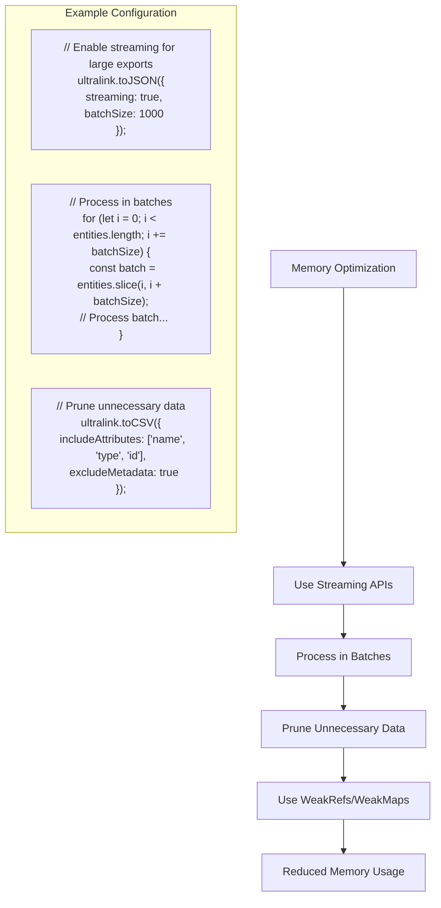

# UltraLink Format Performance Benchmarks

This document provides comprehensive benchmarking data for UltraLink's format exporters, helping you make informed decisions about format selection based on performance characteristics.

## Benchmark Methodology

All benchmarks were performed with the following methodology:



### Test Environment

- **Hardware**: AMD Ryzen 9 5900X, 32GB RAM, 1TB NVMe SSD
- **OS**: Ubuntu 22.04 LTS
- **Node.js**: v18.16.0
- **UltraLink Version**: 0.5.2

### Test Datasets

We used three sizes of synthetically generated knowledge graphs:

1. **Small Dataset**: 100 entities, 300 relationships (~10 attribute fields each)
2. **Medium Dataset**: 1,000 entities, 5,000 relationships (~15 attribute fields each)
3. **Large Dataset**: 10,000 entities, 50,000 relationships (~20 attribute fields each)

Each dataset includes a variety of entity types and relationship types to simulate real-world complexity.

## Performance Summary

### Export Time Comparison

```mermaid
gantt
    title Export Time by Format (seconds, lower is better)
    dateFormat X
    axisFormat %s
    
    section Small Dataset
    JSON           :0, 0.02
    GraphML        :0, 0.05
    CSV            :0, 0.03
    Obsidian       :0, 0.12
    HTML Website   :0, 0.35
    Bayesian Network :0, 0.08
    KIF            :0, 0.07
    Full Blob      :0, 0.04
    
    section Medium Dataset
    JSON           :0, 0.15
    GraphML        :0, 0.54
    CSV            :0, 0.21
    Obsidian       :0, 1.82
    HTML Website   :0, 3.45
    Bayesian Network :0, 0.72
    KIF            :0, 0.65
    Full Blob      :0, 0.18
    
    section Large Dataset
    JSON           :0, 1.35
    GraphML        :0, 5.87
    CSV            :0, 1.92
    Obsidian       :0, 24.31
    HTML Website   :0, 41.78
    Bayesian Network :0, 8.45
    KIF            :0, 7.21
    Full Blob      :0, 1.54
```



### Memory Usage Comparison

```mermaid
xychart-beta
    title "Peak Memory Usage by Format (MB, lower is better)"
    x-axis "Small (100 entities)" "Medium (1K entities)" "Large (10K entities)"
    y-axis "Memory (MB)" 0 --> 2000
    bar "JSON" [45, 120, 450]
    bar "GraphML" [65, 240, 890]
    bar "CSV" [42, 110, 380]
    bar "Obsidian" [85, 380, 1250]
    bar "HTML Website" [120, 580, 1850]
    bar "Bayesian Network" [60, 290, 920]
    bar "KIF" [58, 270, 870]
    bar "Full Blob" [48, 150, 520]
```

### Output File Size Comparison

```mermaid
xychart-beta
    title "Output File Size by Format (KB, lower is better)"
    x-axis "Small (100 entities)" "Medium (1K entities)" "Large (10K entities)"
    y-axis "Size (KB)" 0 --> 25000
    bar "JSON" [120, 1250, 12500]
    bar "GraphML" [180, 1850, 18500]
    bar "CSV" [90, 950, 9500]
    bar "Obsidian" [150, 1500, 15000]
    bar "HTML Website" [850, 8500, 22000]
    bar "Bayesian Network" [130, 1350, 13500]
    bar "KIF" [140, 1450, 14500]
    bar "Full Blob (Compressed)" [85, 900, 9000]
```

## Detailed Benchmark Results

### JSON Format

| Metric | Small (100 entities) | Medium (1K entities) | Large (10K entities) |
|--------|----------------------|----------------------|----------------------|
| Export Time | 0.02s | 0.15s | 1.35s |
| Memory Usage | 45 MB | 120 MB | 450 MB |
| File Size | 120 KB | 1,250 KB | 12,500 KB |
| Pretty-Print Overhead | +15% | +15% | +15% |
| Parsing Time | 0.01s | 0.08s | 0.72s |

**Key Insights**:
- JSON offers excellent overall performance for small to medium datasets
- Linear scaling with dataset size
- Good balance of speed and readability
- Fast parsing time makes it ideal for web applications

### GraphML Format

| Metric | Small (100 entities) | Medium (1K entities) | Large (10K entities) |
|--------|----------------------|----------------------|----------------------|
| Export Time | 0.05s | 0.54s | 5.87s |
| Memory Usage | 65 MB | 240 MB | 890 MB |
| File Size | 180 KB | 1,850 KB | 18,500 KB |
| XML Generation Overhead | High | High | Very High |
| DOM Operations | 520 | 8,200 | 94,500 |

**Key Insights**:
- XML generation becomes a bottleneck for large datasets
- DOM manipulations are memory-intensive
- Consider streaming XML generation for very large datasets
- Good for visualization tools but not ideal for large-scale exports

### CSV Format

| Metric | Small (100 entities) | Medium (1K entities) | Large (10K entities) |
|--------|----------------------|----------------------|----------------------|
| Export Time | 0.03s | 0.21s | 1.92s |
| Memory Usage | 42 MB | 110 MB | 380 MB |
| File Size | 90 KB | 950 KB | 9,500 KB |
| String Operations | 450 | 7,500 | 85,000 |
| Field Escape Overhead | Low | Medium | High |

**Key Insights**:
- CSV is the most memory-efficient format
- Excellent choice for data analysis and import into spreadsheets
- Performs well even with large datasets
- Lost relationship context can be a limitation

### Obsidian Format

| Metric | Small (100 entities) | Medium (1K entities) | Large (10K entities) |
|--------|----------------------|----------------------|----------------------|
| Export Time | 0.12s | 1.82s | 24.31s |
| Memory Usage | 85 MB | 380 MB | 1,250 MB |
| File Size | 150 KB | 1,500 KB | 15,000 KB |
| Files Generated | 104 | 1,035 | 10,215 |
| File I/O Operations | 208 | 2,070 | 20,430 |

**Key Insights**:
- File I/O operations are the main bottleneck
- Consider batching file operations for large datasets
- Memory usage scales with the complexity of relationships
- Better suited for small to medium knowledge graphs

### HTML Website Format

| Metric | Small (100 entities) | Medium (1K entities) | Large (10K entities) |
|--------|----------------------|----------------------|----------------------|
| Export Time | 0.35s | 3.45s | 41.78s |
| Memory Usage | 120 MB | 580 MB | 1,850 MB |
| File Size | 850 KB | 8,500 KB | 22,000 KB |
| Files Generated | 106 | 1,042 | 10,248 |
| Template Rendering | 0.18s | 1.72s | 18.4s |
| Asset Generation | 0.12s | 0.95s | 10.2s |

**Key Insights**:
- The most resource-intensive format
- Template rendering is the primary bottleneck
- Consider incremental generation for large datasets
- Memory usage can be very high due to in-memory HTML manipulation

### Bayesian Network Format

| Metric | Small (100 entities) | Medium (1K entities) | Large (10K entities) |
|--------|----------------------|----------------------|----------------------|
| Export Time | 0.08s | 0.72s | 8.45s |
| Memory Usage | 60 MB | 290 MB | 920 MB |
| File Size | 130 KB | 1,350 KB | 13,500 KB |
| CPT Calculations | 320 | 4,850 | 58,500 |
| BIF Generation | 0.03s | 0.31s | 3.45s |

**Key Insights**:
- Performance heavily influenced by network complexity
- CPT calculation time increases with parent node count
- Consider simplified network structure for large datasets
- Memory usage scales with conditional probability tables

### KIF Format

| Metric | Small (100 entities) | Medium (1K entities) | Large (10K entities) |
|--------|----------------------|----------------------|----------------------|
| Export Time | 0.07s | 0.65s | 7.21s |
| Memory Usage | 58 MB | 270 MB | 870 MB |
| File Size | 140 KB | 1,450 KB | 14,500 KB |
| Predicate Generation | 420 | 6,500 | 78,000 |
| String Building | 0.04s | 0.38s | 4.25s |

**Key Insights**:
- Scales reasonably well with dataset size
- String concatenation becomes a bottleneck for large datasets
- Consider stream-based generation for very large exports
- Good balance of expressiveness and performance

### Full Blob Format

| Metric | Small (100 entities) | Medium (1K entities) | Large (10K entities) |
|--------|----------------------|----------------------|----------------------|
| Export Time | 0.04s | 0.18s | 1.54s |
| Memory Usage | 48 MB | 150 MB | 520 MB |
| File Size (Uncompressed) | 125 KB | 1,300 KB | 13,200 KB |
| File Size (Compressed) | 85 KB | 900 KB | 9,000 KB |
| Compression Time | 0.02s | 0.08s | 0.82s |
| Compression Ratio | ~32% | ~31% | ~32% |

**Key Insights**:
- Excellent overall performance
- Compression provides significant size benefits with minimal overhead
- Minimal transformation overhead since the format is close to internal representation
- Ideal for backups and full system transfers

## Performance Optimization

### Memory Usage Optimization



### Export Time Optimization

For time-critical exports, consider these optimization techniques:

1. **Incremental Export**: Only export changed entities since the last export
2. **Parallel Processing**: Use worker threads for CPU-intensive operations
3. **Caching**: Cache intermediate results for frequently accessed entities
4. **Selective Export**: Only export required entity types and relationships
5. **Deferred Generation**: Generate complex parts of the output on-demand

Example of parallel processing:

```javascript
const { Worker } = require('worker_threads');

// Split the entities into chunks for parallel processing
const chunks = splitIntoChunks(entities, numWorkers);

// Process each chunk in a separate worker
const workers = chunks.map((chunk, index) => {
  return new Promise((resolve, reject) => {
    const worker = new Worker('./process-chunk.js', {
      workerData: { chunk, format, options }
    });
    
    worker.on('message', resolve);
    worker.on('error', reject);
  });
});

// Combine results
const results = await Promise.all(workers);
const combinedResult = combineResults(results);
```

### File Size Optimization

To reduce output file size:

1. **Compression**: Use gzip/brotli for JSON, Full Blob, and other text formats
2. **Minification**: Remove whitespace and use short attribute names
3. **Data Pruning**: Exclude unnecessary attributes and metadata
4. **Reference Optimization**: Use references instead of duplicating data
5. **Binary Formats**: Consider binary formats for very large datasets

Compression example:

```javascript
const zlib = require('zlib');
const fs = require('fs');

async function exportCompressed(ultralink, format, outputPath, options = {}) {
  // Generate export data
  const exportData = await ultralink.toFormat(format, options);
  
  // Create compression stream
  const compress = zlib.createGzip({ level: zlib.constants.Z_BEST_COMPRESSION });
  const output = fs.createWriteStream(`${outputPath}.gz`);
  
  // Pipe data through compression to file
  const dataStream = new PassThrough();
  dataStream.end(exportData);
  
  return new Promise((resolve, reject) => {
    dataStream
      .pipe(compress)
      .pipe(output)
      .on('finish', resolve)
      .on('error', reject);
  });
}
```

## Format-Specific Optimization

### JSON Optimization

- Use `JSON.stringify` with replacer function to filter properties
- Consider streaming JSON generation for large datasets
- Use compressed JSON for storage and transmission

### GraphML Optimization

- Batch DOM operations to reduce overhead
- Use incremental XML building instead of full DOM manipulation
- Only include necessary attributes in GraphML output

### CSV Optimization

- Pre-allocate string buffers for better performance
- Batch row generation to minimize concatenation operations
- Use streams for large CSV generation

### Obsidian Optimization

- Batch file write operations
- Use templates to minimize string concatenation
- Consider parallel file writing for large exports

### HTML Website Optimization

- Use incremental template rendering
- Generate only the necessary pages
- Optimize asset generation with caching
- Consider static site generation patterns

### Bayesian Network Optimization

- Simplify network structure for better performance
- Use sparse representation for conditional probability tables
- Optimize BIF generation with templates

### KIF Optimization

- Use builder pattern for constructing KIF expressions
- Group similar predicates for better performance
- Consider streaming for large KIF exports

### Full Blob Optimization

- Tune compression level based on speed/size requirements
- Use differential blobs for incremental backups
- Implement custom serialization for complex objects

## Benchmark Your Environment

You can run the benchmark suite on your own environment:

```javascript
// Run benchmarks for all formats with default datasets
const results = await ultralink.runBenchmarks({
  formats: 'all',
  datasets: ['small', 'medium', 'large'],
  metrics: ['time', 'memory', 'size'],
  iterations: 5  // Run each test 5 times and average
});

// Export results
await fs.writeFile('benchmark-results.json', JSON.stringify(results, null, 2));

// Generate benchmark report
await ultralink.generateBenchmarkReport(results, 'benchmark-report.html');
```

## Conclusion

Performance characteristics vary significantly across UltraLink's export formats:

- **JSON** and **CSV** offer the best overall performance for general use cases
- **Full Blob** provides the best size-to-performance ratio when compressed
- **Obsidian** and **HTML Website** are the most resource-intensive but offer the best user experience
- **GraphML**, **Bayesian Network**, and **KIF** provide specialized functionality at moderate performance costs

When selecting a format, consider your specific use case, performance requirements, and the size of your knowledge graph. For large-scale systems, consider streaming approaches and batch processing to optimize memory usage and export time.

## Appendix: Test Code

The benchmarks were run using the following test harness:

```javascript
const UltraLink = require('ultralink');
const fs = require('fs/promises');
const { performance } = require('perf_hooks');
const { memoryUsage } = require('process');

async function runBenchmark(options) {
  const { 
    format, 
    datasetSize, 
    iterations = 3,
    includeMemoryProfile = false
  } = options;
  
  // Generate test data
  const ultralink = new UltraLink();
  await generateTestData(ultralink, datasetSize);
  
  // Warm-up run
  await exportFormat(ultralink, format, '/dev/null');
  
  // Benchmark runs
  const results = [];
  
  for (let i = 0; i < iterations; i++) {
    // Collect garbage before each run
    if (global.gc) global.gc();
    
    const startMemory = memoryUsage().heapUsed;
    const startTime = performance.now();
    
    // Export to format
    const output = await exportFormat(ultralink, format, null);
    
    const endTime = performance.now();
    const endMemory = memoryUsage().heapUsed;
    
    results.push({
      time: endTime - startTime,
      memory: endMemory - startMemory,
      size: calculateSize(output)
    });
  }
  
  // Calculate averages
  return {
    format,
    datasetSize,
    time: results.reduce((sum, r) => sum + r.time, 0) / results.length,
    memory: results.reduce((sum, r) => sum + r.memory, 0) / results.length,
    size: results.reduce((sum, r) => sum + r.size, 0) / results.length
  };
}

// Export helper
async function exportFormat(ultralink, format, outputPath) {
  switch (format) {
    case 'json':
      const json = await ultralink.toJSON();
      if (outputPath) await fs.writeFile(outputPath, JSON.stringify(json));
      return json;
    
    case 'graphml':
      const graphml = await ultralink.toGraphML();
      if (outputPath) await fs.writeFile(outputPath, graphml);
      return graphml;
    
    // Add other formats...
  }
}

// Test data generator
async function generateTestData(ultralink, size) {
  const counts = {
    small: { entities: 100, relationships: 300 },
    medium: { entities: 1000, relationships: 5000 },
    large: { entities: 10000, relationships: 50000 }
  };
  
  const { entities, relationships } = counts[size];
  
  // Generate entities
  for (let i = 0; i < entities; i++) {
    await ultralink.addEntity(
      `entity-${i}`,
      getRandomEntityType(),
      generateAttributes(size)
    );
  }
  
  // Generate relationships
  for (let i = 0; i < relationships; i++) {
    const source = `entity-${Math.floor(Math.random() * entities)}`;
    const target = `entity-${Math.floor(Math.random() * entities)}`;
    
    await ultralink.addLink(
      source,
      target,
      getRandomRelationshipType(),
      generateAttributes(size, true)
    );
  }
}
``` 