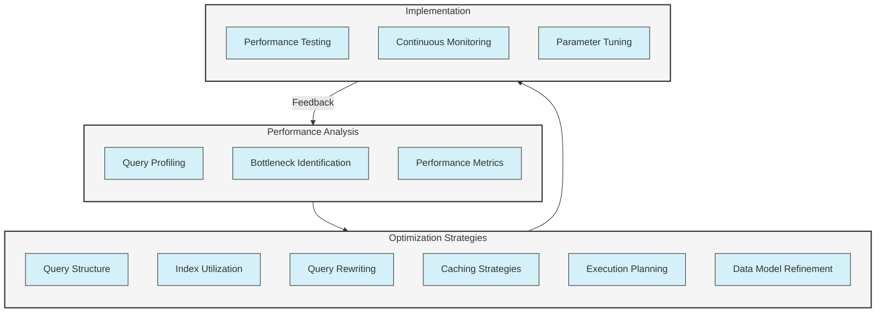
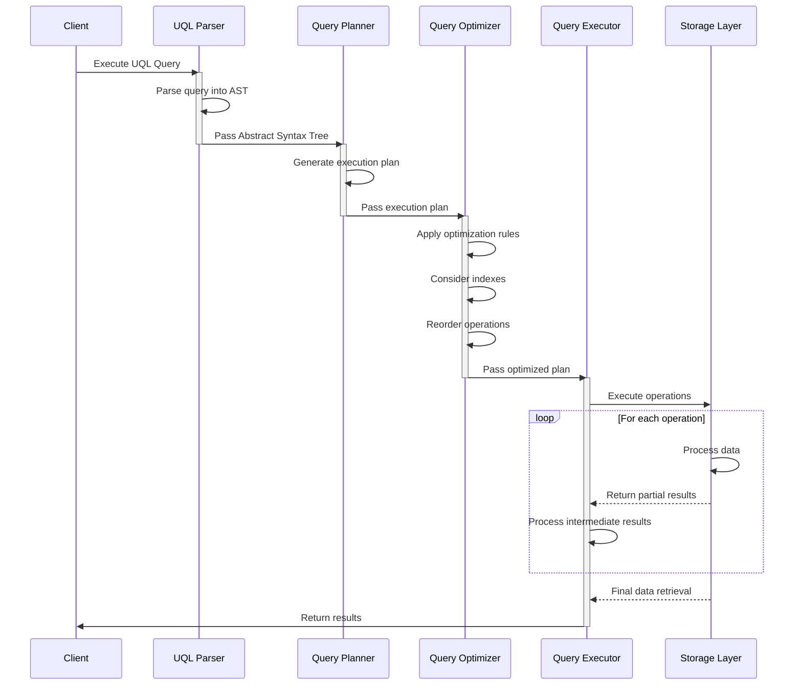
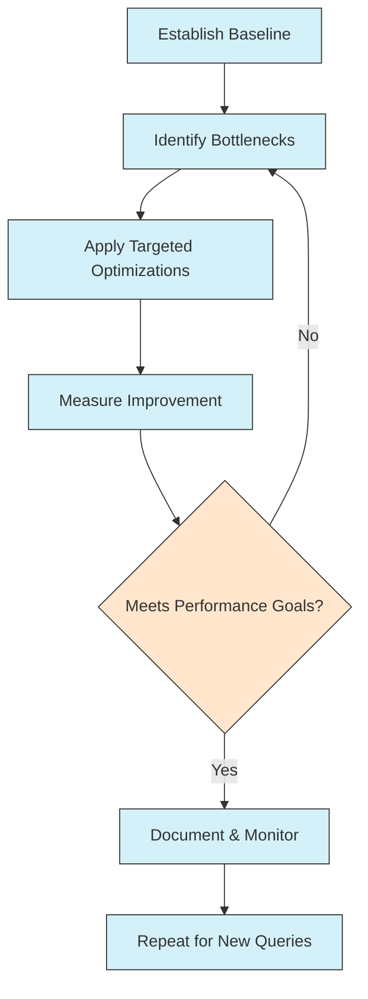

# UltraLink Query Optimization Guide

This document provides comprehensive guidance on optimizing UltraLink Query Language (UQL) queries for maximum performance. Whether you're working with small datasets or massive knowledge graphs, these optimization techniques will help you write efficient queries that scale.

## Performance Optimization Framework

Optimizing UQL queries follows a systematic approach:



## Query Execution Pipeline

Understanding how UQL queries are processed helps in optimizing them:



## 1. Query Profiling and Analysis

### 1.1 Profiling UQL Queries

Profile your queries to identify performance bottlenecks:

```javascript
// Enable query profiling
const profile = await ultralink.profileQuery(`
  MATCH (person:person)-[:authored]->(doc:document)
  WHERE doc.attributes.tags CONTAINS 'machine learning'
  RETURN person, COUNT(doc) AS doc_count
`);

console.log(profile.executionTime); // Total execution time in ms
console.log(profile.stages);        // Detailed execution stages
console.log(profile.nodeAccess);    // Number of nodes accessed
console.log(profile.indexUsage);    // Index usage information
```

### 1.2 Understanding Execution Plans

Analyze the execution plan to understand how your query is processed:

```javascript
// Get the execution plan without running the query
const plan = await ultralink.explainQuery(`
  MATCH (author:person)-[:authored]->(doc:document)
  WHERE doc.attributes.publication_date > '2023-01-01'
  RETURN author, COUNT(doc) AS publication_count
`);

console.log(plan.operations);  // Sequence of operations
console.log(plan.estimatedCost); // Estimated cost
console.log(plan.indexUsage);    // Indexes used
console.log(plan.recommendations); // Optimization recommendations
```

### 1.3 Performance Metrics to Monitor

Key metrics to track for query performance:

1. **Query execution time**: Overall time to complete
2. **Node access count**: Number of nodes examined
3. **Relationship traversals**: Number of relationships followed
4. **Index utilization**: Whether and how indexes are used
5. **Memory usage**: Peak memory consumption during execution
6. **Cache hit ratio**: Percentage of data retrieved from cache

## 2. Query Structure Optimization

### 2.1 Starting with the Most Selective Patterns

Begin with the most selective patterns to reduce the initial result set:

```
// Less efficient query (starts with all persons)
MATCH (person:person)
MATCH (person)-[:authored]->(doc:document)
WHERE doc.attributes.publication_date > '2023-01-01'
RETURN person, COUNT(doc) AS publication_count

// More efficient query (starts with filtered documents)
MATCH (doc:document)
WHERE doc.attributes.publication_date > '2023-01-01'
MATCH (person:person)-[:authored]->(doc)
RETURN person, COUNT(doc) AS publication_count
```

### 2.2 Filtering Early

Apply filters as early as possible to reduce intermediate results:

```
// Less efficient: Filters applied after pattern matching
MATCH (author:person)-[:authored]->(doc:document)
WHERE doc.attributes.publication_date > '2023-01-01'
  AND author.attributes.organization = 'Stanford University'
RETURN author, COUNT(doc) AS publication_count

// More efficient: Filter nodes during the pattern matching
MATCH (author:person {attributes: {organization: 'Stanford University'}})-[:authored]->(doc:document)
WHERE doc.attributes.publication_date > '2023-01-01'
RETURN author, COUNT(doc) AS publication_count
```

### 2.3 Optimizing WITH Clause Usage

Use the WITH clause to manage intermediate results efficiently:

```
// Less efficient: Processing all relationships before filtering
MATCH (author:person)-[:authored]->(doc:document)
RETURN author, COUNT(doc) AS doc_count
ORDER BY doc_count DESC
LIMIT 10

// More efficient: Filter first, then aggregate
MATCH (author:person)-[:authored]->(doc:document)
WITH author, COUNT(doc) AS doc_count
WHERE doc_count > 5
RETURN author, doc_count
ORDER BY doc_count DESC
LIMIT 10
```

### 2.4 Managing Path Length

Be cautious with variable-length paths, especially in large graphs:

```
// Potentially expensive query (unbounded path)
MATCH path = (start:concept)-[:related_to*]->(end:concept)
WHERE start.attributes.name = 'Machine Learning'
RETURN end.attributes.name, LENGTH(path) AS distance

// More efficient with bounded path length
MATCH path = (start:concept)-[:related_to*1..3]->(end:concept)
WHERE start.attributes.name = 'Machine Learning'
RETURN end.attributes.name, LENGTH(path) AS distance
```

## 3. Index Optimization

### 3.1 Creating Effective Indexes

Create indexes for frequently queried properties:

```javascript
// Create index on document publication date
await ultralink.createIndex('document', 'attributes.publication_date');

// Create index on person name with specific configuration
await ultralink.createIndex('person', 'attributes.name', {
  type: 'string',
  caseInsensitive: true
});

// Create composite index
await ultralink.createIndex('document', ['type', 'attributes.status']);
```

### 3.2 Leveraging Indexes in Queries

Structure queries to leverage existing indexes:

```
// Will use index on publication_date
MATCH (doc:document)
WHERE doc.attributes.publication_date > '2023-01-01'
RETURN COUNT(doc)

// Will use composite index on type and status
MATCH (doc:document)
WHERE doc.type = 'research_paper' AND doc.attributes.status = 'published'
RETURN doc
```

### 3.3 Vector Indexing for Similarity Queries

Optimize vector searches with appropriate index configurations:

```javascript
// Configure vector index
await ultralink.configureVectorIndex({
  type: 'hnsw',        // HNSW algorithm (fastest for most cases)
  dimensions: 1536,    // Embedding dimensions
  m: 16,               // Number of connections per layer (higher = more accurate but more memory)
  efConstruction: 200, // Index build quality parameter
  efSearch: 100        // Search quality parameter (higher = more accurate but slower)
});
```

```
// Optimized vector search using index
MATCH (doc:document)
WHERE VECTOR_SIMILARITY(doc, 'quantum computing applications') > 0.7
USING INDEX vector_hnsw
RETURN doc
ORDER BY VECTOR_SIMILARITY(doc, 'quantum computing applications') DESC
LIMIT 10
```

## 4. Query Rewriting Techniques

### 4.1 Pattern Reordering

Reorder patterns for better performance:

```
// Original query
MATCH (author:person)-[:authored]->(doc:document)
MATCH (doc)-[:cites]->(cited:document)
WHERE cited.attributes.publication_date < '2020-01-01'
RETURN author, COUNT(DISTINCT cited) AS citation_count

// Rewritten query
MATCH (cited:document)
WHERE cited.attributes.publication_date < '2020-01-01'
MATCH (doc:document)-[:cites]->(cited)
MATCH (author:person)-[:authored]->(doc)
RETURN author, COUNT(DISTINCT cited) AS citation_count
```

### 4.2 Breaking Complex Queries

Break complex queries into simpler parts:

```
// Complex single query
MATCH (author:person)-[:authored]->(doc:document)-[:cites]->(cited:document)<-[:authored]-(authority:person)
WHERE doc.attributes.publication_date > '2020-01-01'
  AND cited.attributes.citations > 50
RETURN author.attributes.name, 
       COUNT(DISTINCT doc) AS authored_papers,
       COUNT(DISTINCT cited) AS cited_papers,
       COUNT(DISTINCT authority) AS authorities_cited

// Broken down into parts
// Part 1: Find relevant documents
MATCH (doc:document)
WHERE doc.attributes.publication_date > '2020-01-01'
WITH doc

// Part 2: Find authors and their documents
MATCH (author:person)-[:authored]->(doc)
WITH author, COLLECT(doc) AS authored_docs

// Part 3: Find citations to influential papers
UNWIND authored_docs AS doc
MATCH (doc)-[:cites]->(cited:document)
WHERE cited.attributes.citations > 50
WITH author, authored_docs, COLLECT(DISTINCT cited) AS cited_docs

// Part 4: Find authorities
UNWIND cited_docs AS cited
MATCH (authority:person)-[:authored]->(cited)
WHERE authority <> author
WITH author, SIZE(authored_docs) AS authored_papers, SIZE(cited_docs) AS cited_papers, COLLECT(DISTINCT authority) AS authorities

RETURN author.attributes.name, authored_papers, cited_papers, SIZE(authorities) AS authorities_cited
```

### 4.3 Refactoring Expensive Operations

Identify and refactor expensive operations:

```
// Expensive operation (sorting a large result set)
MATCH (doc:document)
WHERE doc.attributes.publication_date > '2020-01-01'
RETURN doc
ORDER BY doc.attributes.citation_count DESC

// Refactored to limit before sorting
MATCH (doc:document)
WHERE doc.attributes.publication_date > '2020-01-01'
AND doc.attributes.citation_count > 10 // Pre-filter to reduce sort burden
RETURN doc
ORDER BY doc.attributes.citation_count DESC
LIMIT 100 // Limit the results to sort
```

## 5. Caching Strategies

### 5.1 Result Caching

Cache frequently used query results:

```javascript
// Configure query result caching
ultralink.configure({
  caching: {
    enabled: true,
    queryResults: {
      enabled: true,
      maxSize: 1000,   // Maximum entries in cache
      ttl: 3600        // Time to live in seconds
    }
  }
});

// Use cached results for repeated queries
const results1 = await ultralink.executeQuery(`
  MATCH (doc:document)
  WHERE doc.attributes.publication_date > '2023-01-01'
  RETURN COUNT(doc)
`, { useCache: true });

// Same query will use cached results if available
const results2 = await ultralink.executeQuery(`
  MATCH (doc:document)
  WHERE doc.attributes.publication_date > '2023-01-01'
  RETURN COUNT(doc)
`, { useCache: true });
```

### 5.2 Vector Caching

Optimize vector operations with appropriate caching:

```javascript
// Configure vector caching
ultralink.configure({
  vector: {
    caching: {
      enabled: true,
      textToVector: {
        enabled: true,
        maxSize: 5000   // Cache up to 5000 text-to-vector conversions
      },
      similarityResults: {
        enabled: true,
        maxSize: 1000   // Cache up to 1000 similarity search results
      }
    }
  }
});
```

### 5.3 Pre-Computation Strategies

Pre-compute expensive calculations and store results:

```javascript
// Pre-compute document similarity
await ultralink.executeTask('precompute-document-similarity', {
  type: 'document',
  threshold: 0.7,
  storeAs: 'similar_to'  // Stored as relationships
});

// Use pre-computed similarity
MATCH (doc:document {id: 'paper-123'})-[:similar_to]->(similar:document)
RETURN similar.attributes.title, similar.similarity AS similarity_score
ORDER BY similarity_score DESC
```

## 6. Query Execution Planning

### 6.1 Parallelizing Independent Operations

Break queries into independent parts that can be executed in parallel:

```javascript
// Execute multiple independent queries in parallel
const [authors, topics, recentDocs] = await Promise.all([
  ultralink.executeQuery(`
    MATCH (author:person)
    WHERE author.attributes.papers_count > 10
    RETURN author.attributes.name, author.attributes.papers_count
    LIMIT 100
  `),
  
  ultralink.executeQuery(`
    MATCH (topic:concept)
    RETURN topic.attributes.name, SIZE((topic)<-[:relates_to]-()) AS usage
    ORDER BY usage DESC
    LIMIT 20
  `),
  
  ultralink.executeQuery(`
    MATCH (doc:document)
    WHERE doc.attributes.publication_date > '2023-01-01'
    RETURN doc.attributes.title, doc.attributes.publication_date
    ORDER BY doc.attributes.publication_date DESC
    LIMIT 50
  `)
]);
```

### 6.2 Paging and Batching

Process large result sets in manageable batches:

```javascript
// Query with paging
async function getAllEntities() {
  const pageSize = 1000;
  let currentPage = 0;
  let hasMore = true;
  let allEntities = [];
  
  while (hasMore) {
    const results = await ultralink.executeQuery(`
      MATCH (entity:document)
      WHERE entity.attributes.status = 'active'
      RETURN entity
      ORDER BY entity.attributes.created_at
      SKIP ${currentPage * pageSize}
      LIMIT ${pageSize}
    `);
    
    allEntities = allEntities.concat(results);
    hasMore = results.length === pageSize;
    currentPage++;
  }
  
  return allEntities;
}
```

### 6.3 Query Hints

Provide hints to the query optimizer:

```
// Using query hints for index selection
MATCH (doc:document)
WHERE doc.attributes.publication_date > '2023-01-01'
USING INDEX doc_publication_date_idx
RETURN doc

// Using query hints for join strategy
MATCH (author:person)-[:authored]->(doc:document)
USING JOIN HASH
WHERE doc.attributes.status = 'published'
RETURN author, COUNT(doc) AS publication_count
```

## 7. Data Model Optimization

### 7.1 Denormalization for Performance

Strategically denormalize data to improve query performance:

```javascript
// Denormalize author count on document
await ultralink.addEntity('paper-123', 'document', {
  title: 'Advanced Query Optimization',
  publication_date: '2023-05-15',
  // Denormalized count eliminates the need for relationship counting
  authors_count: 3,
  citations_count: 42
});

// Query using denormalized data
MATCH (doc:document)
WHERE doc.attributes.authors_count > 2
AND doc.attributes.citations_count > 10
RETURN doc.attributes.title, doc.attributes.authors_count, doc.attributes.citations_count
```

### 7.2 Pre-Calculated Relationships

Create direct relationships for common traversals:

```javascript
// Original query requiring multi-hop traversal
MATCH (researcher:person)-[:authored]->(paper:document)-[:cites]->(cited:document)<-[:authored]-(authority:person)
RETURN researcher.attributes.name, authority.attributes.name, COUNT(paper) AS connection_strength

// Create direct relationship during data processing
await ultralink.addRelationship('researcher-123', 'authority-456', 'cites_work_of', {
  strength: 5,  // Pre-calculated count of citations
  papers: ['paper-1', 'paper-2', 'paper-3', 'paper-4', 'paper-5']
});

// Optimized query using pre-calculated relationship
MATCH (researcher:person)-[r:cites_work_of]->(authority:person)
RETURN researcher.attributes.name, authority.attributes.name, r.attributes.strength AS connection_strength
```

### 7.3 Optimizing Entity Attributes

Structure entity attributes for optimal query performance:

```javascript
// Original entity with nested attributes that are frequently queried
await ultralink.addEntity('doc-123', 'document', {
  title: 'Optimization Techniques',
  metadata: {
    publication: {
      date: '2023-01-15',
      venue: 'Journal of Data Science',
      issue: '4',
      volume: '12'
    }
  }
});

// Optimized entity with flattened structure for frequent queries
await ultralink.addEntity('doc-123', 'document', {
  title: 'Optimization Techniques',
  // Frequently queried attributes at top level
  publication_date: '2023-01-15',
  publication_venue: 'Journal of Data Science',
  // Less frequently accessed details can remain nested
  publication_details: {
    issue: '4',
    volume: '12'
  }
});
```

## 8. Advanced Optimization Techniques

### 8.1 Custom Indexes and Specialized Data Structures

Implement custom index types for specialized queries:

```javascript
// Configure a custom spatial index
await ultralink.createCustomIndex('spatial_index', {
  type: 'spatial',
  entityType: 'location',
  coordinateFields: ['attributes.latitude', 'attributes.longitude'],
  precision: 6
});

// Use the spatial index in queries
const nearbyLocations = await ultralink.executeQuery(`
  MATCH (loc:location)
  WHERE SPATIAL_DISTANCE(loc, 37.7749, -122.4194) < 10000
  USING INDEX spatial_index
  RETURN loc.attributes.name, loc.attributes.latitude, loc.attributes.longitude
`);
```

### 8.2 Query Compilation

Compile frequently used queries for faster execution:

```javascript
// Compile a frequently used query
const compiledQuery = await ultralink.compileQuery(`
  MATCH (doc:document)
  WHERE doc.attributes.publication_date > $date
  AND doc.attributes.tags CONTAINS $tag
  RETURN doc
`);

// Execute the compiled query with different parameters
const results1 = await compiledQuery.execute({
  date: '2023-01-01',
  tag: 'machine learning'
});

const results2 = await compiledQuery.execute({
  date: '2022-01-01',
  tag: 'deep learning'
});
```

### 8.3 Stored Procedures for Complex Operations

Implement stored procedures for complex operations:

```javascript
// Register a stored procedure
await ultralink.registerProcedure('findInfluentialAuthors', `
  MATCH (author:person)-[:authored]->(doc:document)
  WITH author, COUNT(doc) AS authored_count
  
  MATCH (doc:document)<-[:authored]-(author)
  MATCH (doc)<-[:cites]-(citing:document)
  WITH author, authored_count, COUNT(citing) AS citation_count
  
  RETURN author.attributes.name, 
         authored_count,
         citation_count,
         citation_count / authored_count AS impact_factor
  ORDER BY impact_factor DESC
  LIMIT 10
`);

// Call the stored procedure
const influentialAuthors = await ultralink.callProcedure('findInfluentialAuthors');
```

## 9. Query Performance Patterns by Use Case

### 9.1 Knowledge Graph Navigation

Optimize queries for navigating large knowledge graphs:

```
// Incremental exploration with depth limiting
MATCH path = (concept:concept {id: 'machine-learning'})-[:related_to*1..2]->(related:concept)
WITH related, MIN(LENGTH(path)) AS distance
ORDER BY distance, related.attributes.relevance DESC
LIMIT 10
RETURN related.attributes.name, distance

// Guided exploration with relevance filtering
MATCH (source:concept {id: 'deep-learning'})
CALL {
  MATCH (source)-[:related_to]->(direct:concept)
  RETURN direct, 1 AS distance
  UNION
  MATCH (source)-[:related_to]->(intermediate)-[:related_to]->(indirect:concept)
  WHERE indirect <> source
  AND NOT (source)-[:related_to]->(indirect)
  RETURN indirect, 2 AS distance
}
WITH * ORDER BY distance, VECTOR_SIMILARITY(source, direct) DESC
LIMIT 15
RETURN concept.attributes.name, distance
```

### 9.2 Recommendation Engine Queries

Optimize recommendation engine queries:

```
// Efficient personalized recommendations
MATCH (user:user {id: 'user-123'})

// Step 1: Get user interests (limited to top 5)
MATCH (user)-[interest:interested_in]->(topic:concept)
WITH user, topic, interest.attributes.strength AS interest_strength
ORDER BY interest_strength DESC
LIMIT 5

// Step 2: Find potential documents by interest (bounded exploration)
MATCH (topic)<-[:relates_to]-(doc:document)
WHERE NOT (user)-[:viewed|rated]->(doc)
WITH user, doc, SUM(interest_strength) AS relevance_score

// Step 3: Combine with collaborative filtering (bounded to similar users)
OPTIONAL MATCH (similar_user:user)-[:viewed]->(doc)
WHERE (user)-[:similar_to {score: > 0.6}]->(similar_user)
WITH user, doc, relevance_score, COUNT(similar_user) AS social_signal

// Final scoring and limiting
RETURN doc.attributes.title,
       relevance_score * 0.7 + social_signal * 0.3 AS combined_score
ORDER BY combined_score DESC
LIMIT 10
```

### 9.3 Analytics and Reporting Queries

Optimize analytics and reporting queries:

```
// Efficient analytics with pre-aggregation
// Assume we've pre-calculated monthly document counts by topic
MATCH (stats:topic_stats)
WHERE stats.attributes.year = 2023
WITH stats.attributes.topic AS topic, 
     [stats.attributes.jan, stats.attributes.feb, stats.attributes.mar,
      stats.attributes.apr, stats.attributes.may, stats.attributes.jun] AS monthly_counts
RETURN topic, monthly_counts,
       REDUCE(acc = 0, count IN monthly_counts | acc + count) AS total_count
ORDER BY total_count DESC
LIMIT 10

// Real-time analytics with optimized aggregation
MATCH (doc:document)
WHERE doc.attributes.publication_date >= '2023-01-01'
  AND doc.attributes.publication_date < '2024-01-01'
WITH doc.attributes.publication_date.month AS month, COUNT(doc) AS doc_count
RETURN month, doc_count
ORDER BY month
```

## 10. Measuring and Evaluating Query Performance

### 10.1 Performance Testing Framework

Implement a systematic approach to performance testing:

```javascript
// Define a set of standard test queries
const testQueries = [
  {
    name: 'Basic entity lookup',
    query: `MATCH (doc:document {id: 'paper-123'}) RETURN doc`
  },
  {
    name: 'Filtered entity search',
    query: `MATCH (doc:document) 
            WHERE doc.attributes.publication_date > '2023-01-01'
            RETURN doc LIMIT 100`
  },
  {
    name: 'Relationship traversal',
    query: `MATCH (author:person)-[:authored]->(doc:document)
            RETURN author.attributes.name, COUNT(doc) AS doc_count`
  },
  // Add more standard queries...
];

// Run performance tests
async function runPerformanceTests(iterations = 5) {
  const results = {};
  
  for (const test of testQueries) {
    const times = [];
    
    for (let i = 0; i < iterations; i++) {
      const start = performance.now();
      await ultralink.executeQuery(test.query);
      const end = performance.now();
      times.push(end - start);
    }
    
    // Calculate statistics
    results[test.name] = {
      min: Math.min(...times),
      max: Math.max(...times),
      avg: times.reduce((sum, t) => sum + t, 0) / times.length,
      median: times.sort()[Math.floor(times.length / 2)]
    };
  }
  
  return results;
}
```

### 10.2 Performance Monitoring Dashboard

Set up a monitoring dashboard to track query performance over time:

```javascript
// Configure performance monitoring
ultralink.configure({
  monitoring: {
    enabled: true,
    queries: {
      trackSlowest: 100,     // Track slowest 100 queries
      sampleRate: 0.1,       // Sample 10% of all queries
      thresholdMs: 500,      // Log queries slower than 500ms
      aggregationInterval: 60000  // Aggregate metrics every 60 seconds
    }
  }
});

// Get performance metrics
const metrics = await ultralink.getPerformanceMetrics({
  period: 'day',
  categories: ['queries', 'vector_operations', 'storage_operations']
});

console.log(metrics.queries.averageExecutionTime);
console.log(metrics.queries.slowestQueries);
console.log(metrics.queries.throughput);
```

## 11. Progressive Optimization Process

Follow this iterative optimization approach for continuous improvement:



1. **Establish Baseline**: Measure current performance
2. **Identify Bottlenecks**: Use profiling to pinpoint issues
3. **Apply Targeted Optimizations**: Focus on high-impact changes
4. **Measure Improvement**: Quantify the impact of optimizations
5. **Evaluate**: Determine if performance meets requirements
6. **Document & Monitor**: Record successful patterns and monitor for regression
7. **Continuous Iteration**: Apply process to new queries and evolving requirements

## Related Documentation

- [UQL Reference Guide](../reference/query-language-syntax.md)
- [Advanced Query Patterns](../guides/advanced-query-patterns.md)
- [Index Management Guide](../guides/index-management.md)
- [Performance Monitoring](../performance/monitoring.md)
- [UltraLink Scaling Guide](../performance/scaling.md) 