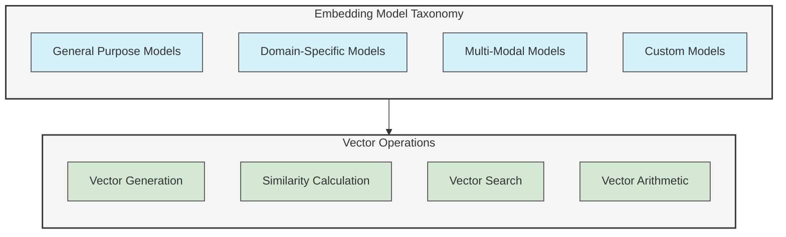
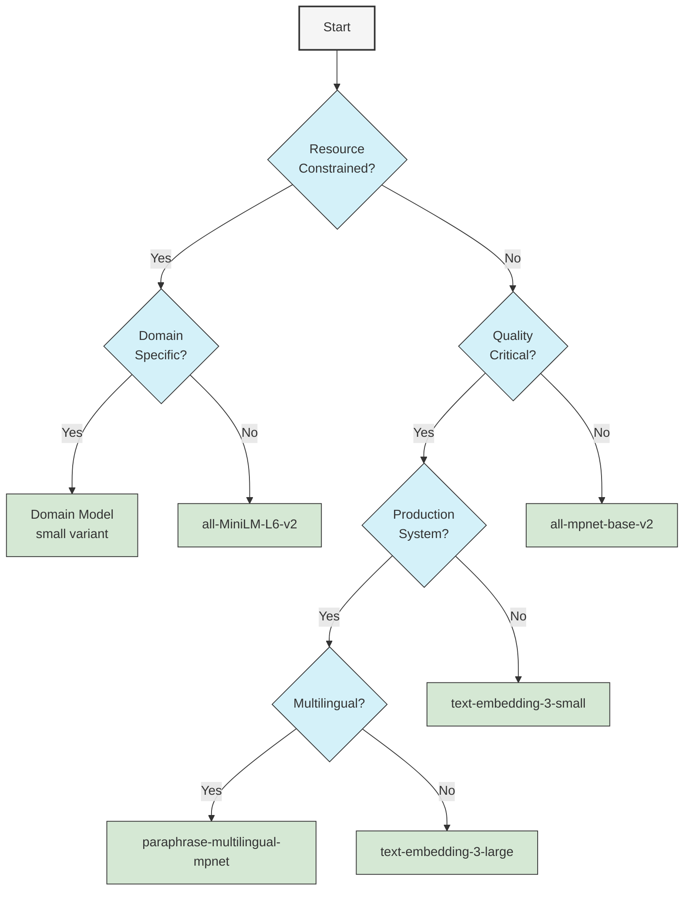

# UltraLink Embedding Models Reference

This reference guide provides detailed information about the embedding models supported by UltraLink, including model specifications, configuration options, performance characteristics, and best practices for selecting and using different models.

## Overview

UltraLink's vector search capabilities rely on embedding models that convert content into high-dimensional vector representations. These embeddings capture the semantic meaning of the content, enabling similarity-based operations within the UltraLink Query Language (UQL).



## Supported Models

### General Purpose Text Embedding Models

These models are designed to work well across a wide range of text-based applications.

#### OpenAI Models

| Model | Dimensions | Max Tokens | Strengths | Best For |
|-------|------------|------------|-----------|----------|
| text-embedding-ada-002 | 1536 | 8191 | High quality, good for general-purpose use | Production systems requiring high-quality results |
| text-embedding-3-small | 1536 | 8191 | Fast, cost-effective | Cost-sensitive applications |
| text-embedding-3-large | 3072 | 8191 | State-of-the-art performance | When quality is the top priority |

**Configuration:**

```javascript
// Configure UltraLink with OpenAI embedding
const ultralink = new UltraLink({
  vector: {
    provider: 'openai',
    options: {
      apiKey: process.env.OPENAI_API_KEY,
      model: 'text-embedding-3-small',
      dimensions: 1536
    }
  }
});
```

#### Sentence Transformers Models

| Model | Dimensions | Max Tokens | Strengths | Best For |
|-------|------------|------------|-----------|----------|
| all-MiniLM-L6-v2 | 384 | 512 | Very fast, small footprint | Quick prototyping, resource-constrained environments |
| all-mpnet-base-v2 | 768 | 512 | Good balance of quality and performance | General purpose applications |
| all-distilroberta-v1 | 768 | 512 | Fast with decent quality | Balanced speed/quality requirements |
| multi-qa-mpnet-base-dot-v1 | 768 | 512 | Optimized for question-answering | Q&A applications, search systems |
| paraphrase-multilingual-mpnet-base-v2 | 768 | 512 | Multilingual support | Applications requiring multiple languages |

**Configuration:**

```javascript
// Configure UltraLink with Sentence Transformers
const ultralink = new UltraLink({
  vector: {
    provider: 'sentence-transformers',
    options: {
      model: 'all-mpnet-base-v2',
      dimensions: 768,
      // Optional: self-hosted model server
      endpoint: 'http://localhost:8080/v1/embeddings'
    }
  }
});
```

#### HuggingFace Models

| Model | Dimensions | Max Tokens | Strengths | Best For |
|-------|------------|------------|-----------|----------|
| BAAI/bge-small-en | 384 | 512 | Lightweight, good performance | Resource-constrained environments |
| BAAI/bge-base-en | 768 | 512 | Strong general performance | General-purpose applications |
| BAAI/bge-large-en | 1024 | 512 | High quality | Quality-critical applications |
| intfloat/e5-base | 768 | 512 | Strong for retrieval tasks | Information retrieval |
| intfloat/e5-large | 1024 | 512 | High quality for retrieval | Critical information retrieval |

**Configuration:**

```javascript
// Configure UltraLink with HuggingFace model
const ultralink = new UltraLink({
  vector: {
    provider: 'huggingface',
    options: {
      model: 'BAAI/bge-base-en',
      dimensions: 768,
      apiKey: process.env.HUGGINGFACE_API_KEY
    }
  }
});
```

### Domain-Specific Models

Models optimized for specific domains or use cases.

#### Code Embeddings

| Model | Dimensions | Strengths | Best For |
|-------|------------|-----------|----------|
| codellama/CodeLlama-7b-Instruct | 4096 | Strong code understanding | Code search and similarity |
| Salesforce/codet5p-220m | 768 | Efficient code embedding | Lightweight code applications |
| microsoft/codebert-base | 768 | Good general code embedding | Code search, classification |

**Configuration:**

```javascript
// Configure for code embedding
const ultralink = new UltraLink({
  vector: {
    provider: 'huggingface',
    options: {
      model: 'microsoft/codebert-base',
      dimensions: 768,
      apiKey: process.env.HUGGINGFACE_API_KEY
    }
  }
});
```

#### Science & Research Models

| Model | Dimensions | Strengths | Best For |
|-------|------------|-----------|----------|
| allenai/specter | 768 | Academic paper embedding | Research paper search |
| allenai/scibert-scivocab-uncased | 768 | Scientific text | Scientific document search |
| gsarti/biobert-nli | 768 | Biomedical text | Medical literature search |

#### Legal Models

| Model | Dimensions | Strengths | Best For |
|-------|------------|-----------|----------|
| nlpaueb/legal-bert-base-uncased | 768 | Legal text understanding | Legal document search |
| law-ai/LexLM | 768 | Legal language | Legal document similarity |

### Multi-Modal Models

Models that can embed different types of content.

#### Text and Image Models

| Model | Dimensions | Content Types | Strengths | Best For |
|-------|------------|--------------|-----------|----------|
| clip-ViT-B-32 | 512 | Text & Images | Good text-image alignment | Cross-modal search |
| clip-ViT-L-14 | 768 | Text & Images | Higher quality text-image alignment | Quality-critical cross-modal applications |

**Configuration:**

```javascript
// Configure for multi-modal embedding
const ultralink = new UltraLink({
  vector: {
    provider: 'clip',
    options: {
      model: 'clip-ViT-B-32',
      dimensions: 512
    }
  }
});
```

### Custom Models

UltraLink supports integration with custom embedding models.

**Configuration:**

```javascript
// Configure UltraLink with custom embedding function
const ultralink = new UltraLink({
  vector: {
    provider: 'custom',
    options: {
      dimensions: 512,
      generateEmbedding: async (text) => {
        // Custom logic to generate embedding
        // Could call your own API service or use local model
        const response = await fetch('https://your-embedding-service.com/embed', {
          method: 'POST',
          body: JSON.stringify({ text }),
          headers: { 'Content-Type': 'application/json' }
        });
        return response.json().then(data => data.embedding);
      }
    }
  }
});
```

## Model Selection Guide

### Factors to Consider

When selecting an embedding model for your UltraLink application, consider the following factors:

1. **Quality Requirements**: How critical is embedding quality for your application?
2. **Performance Needs**: What are your latency and throughput requirements?
3. **Resource Constraints**: What are your memory and compute constraints?
4. **Domain Specificity**: Is your content from a specific domain?
5. **Content Type**: What types of content will you be embedding?
6. **Multilingual Needs**: Do you need support for multiple languages?
7. **Cost Considerations**: What are your budgetary constraints?

### Decision Matrix

Here's a decision matrix to help you select the appropriate model:



## Performance Benchmarks

The following table provides performance benchmarks for various models on common NLP tasks:

| Model | Semantic Similarity (Spearman ρ) | Retrieval (NDCG@10) | Classification (Accuracy) | Relative Speed | Memory Usage |
|-------|----------------------------------|---------------------|---------------------------|----------------|--------------|
| text-embedding-3-large | 0.840 | 0.878 | 0.928 | 1x | High |
| text-embedding-3-small | 0.812 | 0.845 | 0.905 | 2.5x | Medium |
| text-embedding-ada-002 | 0.800 | 0.830 | 0.895 | 3x | Medium |
| all-mpnet-base-v2 | 0.782 | 0.812 | 0.880 | 5x | Medium |
| all-MiniLM-L6-v2 | 0.751 | 0.775 | 0.840 | 10x | Low |

*Note: Higher is better for Spearman ρ, NDCG@10, and Accuracy. For Relative Speed, higher means faster (multiplier relative to the slowest model).*

## Configuration Options

### Common Configuration Parameters

```javascript
// Comprehensive configuration example
const ultralink = new UltraLink({
  vector: {
    provider: 'openai', // 'openai', 'sentence-transformers', 'huggingface', 'clip', 'custom'
    options: {
      model: 'text-embedding-3-small',
      dimensions: 1536,
      apiKey: process.env.API_KEY,
      
      // Optional parameters
      batchSize: 32,         // Number of texts to embed in a single API call
      timeout: 30000,        // Timeout in milliseconds
      retry: {               // Retry configuration
        maxRetries: 3,
        initialDelay: 1000,
        maxDelay: 10000
      },
      
      // Content preparation
      preprocessing: {
        maxTokens: 8000,      // Maximum tokens to process
        truncation: 'end',    // How to truncate: 'start', 'end', 'middle'
        normalize: true,      // Normalize text (e.g., lowercase)
        removeStopwords: false // Remove common stopwords
      },
      
      // Caching
      cache: {
        enabled: true,
        maxSize: 10000,
        ttl: 86400           // Time-to-live in seconds (24 hours)
      }
    },
    
    // Vector index configuration
    index: {
      type: 'hnsw',
      parameters: {
        M: 16,
        efConstruction: 200,
        efSearch: 100
      }
    }
  }
});
```

### Provider-Specific Options

#### OpenAI

```javascript
{
  provider: 'openai',
  options: {
    apiKey: process.env.OPENAI_API_KEY,
    model: 'text-embedding-3-small',
    organization: 'org-123', // Optional: organization ID
    baseURL: 'https://api.openai.com/v1', // Optional: custom endpoint
    dimensions: 1536         // Optional: request specific dimensions
  }
}
```

#### Sentence Transformers

```javascript
{
  provider: 'sentence-transformers',
  options: {
    model: 'all-mpnet-base-v2',
    endpoint: 'http://localhost:8080/embeddings', // Optional: custom endpoint
    pooling: 'mean',  // Pooling strategy: 'mean', 'max', 'cls'
    normalize: true   // Whether to normalize vectors to unit length
  }
}
```

#### HuggingFace

```javascript
{
  provider: 'huggingface',
  options: {
    apiKey: process.env.HUGGINGFACE_API_KEY,
    model: 'BAAI/bge-large-en',
    endpoint: 'https://api-inference.huggingface.co/models/', // Optional
    revision: 'main', // Model revision
    waitForModel: true // Whether to wait if model is loading
  }
}
```

## Best Practices

### Entity Embedding Best Practices

1. **Combine relevant fields**: When generating embeddings for entities, combine relevant fields to create a more comprehensive representation:

```javascript
// Generate embedding with weighted fields
await ultralink.generateVectorForEntity('document-123', {
  fields: [
    { name: 'title', weight: 2.0 },
    { name: 'abstract', weight: 1.5 },
    { name: 'content', weight: 1.0 },
    { name: 'keywords', weight: 2.0 }
  ]
});
```

2. **Add context markers**: Use special tokens or markers to add structure to the text being embedded:

```javascript
// Add context markers
const textToEmbed = `TITLE: ${document.title}
ABSTRACT: ${document.abstract}
KEYWORDS: ${document.keywords.join(', ')}
CONTENT: ${document.content}`;

await ultralink.generateEmbedding(textToEmbed);
```

3. **Update embeddings when content changes**: Ensure embeddings stay in sync with entity content:

```javascript
// Set up automatic embedding updates
ultralink.configure({
  vector: {
    autoUpdate: true,
    updateTriggers: ['create', 'update'],
    updateFields: ['title', 'content', 'tags']
  }
});
```

### Query Embedding Best Practices

1. **Be specific with queries**: More specific queries generally yield better results:

```javascript
// Less effective
const results1 = await ultralink.executeQuery(`
  MATCH (doc:document)
  WHERE VECTOR_SIMILARITY(doc, 'AI') > 0.7
  RETURN doc
`);

// More effective
const results2 = await ultralink.executeQuery(`
  MATCH (doc:document)
  WHERE VECTOR_SIMILARITY(doc, 'Recent advances in artificial intelligence for healthcare applications') > 0.7
  RETURN doc
`);
```

2. **Query expansion**: Expand queries to improve recall:

```javascript
// Expand query with related terms
const expandedQuery = await ultralink.expandQuery('machine learning', {
  expansion: 'semantic',
  terms: 5
});

// Query with expanded text
const results = await ultralink.executeQuery(`
  MATCH (doc:document)
  WHERE VECTOR_SIMILARITY(doc, $query) > 0.7
  RETURN doc
`, { query: expandedQuery });
```

3. **Hybrid retrieval**: Combine vector search with keyword search:

```javascript
// Hybrid search function
async function hybridSearch(query, options = {}) {
  // Vector search
  const vectorResults = await ultralink.executeQuery(`
    MATCH (doc:document)
    WHERE VECTOR_SIMILARITY(doc, $query) > ${options.threshold || 0.7}
    RETURN doc.id, VECTOR_SIMILARITY(doc, $query) AS vector_score
  `, { query });
  
  // Keyword search (using a hypothetical keyword search function)
  const keywordResults = await ultralink.keywordSearch(query, {
    field: 'content'
  });
  
  // Combine and rerank
  return combineAndRerank(vectorResults, keywordResults, {
    vectorWeight: 0.7,
    keywordWeight: 0.3
  });
}
```

### Performance Optimization

1. **Embedding caching**: Cache embeddings to avoid redundant API calls:

```javascript
// Configure embedding cache
ultralink.configure({
  vector: {
    cache: {
      enabled: true,
      maxSize: 5000,
      ttl: 86400 // 24 hours in seconds
    }
  }
});
```

2. **Batch processing**: Process embeddings in batches:

```javascript
// Process in batches
await ultralink.batchGenerateVectors({
  entityType: 'document',
  batchSize: 50,
  concurrency: 5
});
```

3. **Index optimization**: Tune index parameters for your use case:

```javascript
// Optimize for high recall
await ultralink.configureVectorIndex({
  type: 'hnsw',
  parameters: {
    M: 64,
    efConstruction: 400,
    efSearch: 200
  }
});

// Optimize for speed
await ultralink.configureVectorIndex({
  type: 'hnsw',
  parameters: {
    M: 16,
    efConstruction: 100,
    efSearch: 40
  }
});
```

## Model Deployment Options

### Self-Hosting Models

UltraLink supports self-hosting embedding models for improved privacy and reduced API costs:

```javascript
// Configure with self-hosted model server
const ultralink = new UltraLink({
  vector: {
    provider: 'sentence-transformers',
    options: {
      model: 'all-mpnet-base-v2',
      endpoint: 'http://localhost:8080/embeddings'
    }
  }
});
```

### Setting Up a Model Server

1. **Using Sentence Transformers API**:

```bash
pip install sentence-transformers fastapi uvicorn
```

Create a server file `server.py`:

```python
from fastapi import FastAPI, HTTPException
from pydantic import BaseModel
from sentence_transformers import SentenceTransformer
import numpy as np

app = FastAPI()
model = SentenceTransformer('all-mpnet-base-v2')

class TextRequest(BaseModel):
    texts: list[str]

@app.post("/embeddings")
async def generate_embeddings(request: TextRequest):
    try:
        embeddings = model.encode(request.texts)
        # Convert to list for JSON serialization
        embeddings_list = [embedding.tolist() for embedding in embeddings]
        return {"embeddings": embeddings_list}
    except Exception as e:
        raise HTTPException(status_code=500, detail=str(e))

if __name__ == "__main__":
    import uvicorn
    uvicorn.run(app, host="0.0.0.0", port=8080)
```

Run the server:

```bash
python server.py
```

2. **Using Docker**:

```dockerfile
FROM python:3.9-slim

WORKDIR /app

RUN pip install sentence-transformers fastapi uvicorn

COPY server.py /app/

EXPOSE 8080

CMD ["python", "server.py"]
```

Build and run:

```bash
docker build -t embedding-server .
docker run -p 8080:8080 embedding-server
```

## Related Documentation

- [Vector Search Guide](../guides/vector-search.md)
- [UQL Query Language Syntax](../reference/query-language-syntax.md)
- [Vector Index Optimization](../technical/vector-index-optimization.md)
- [Performance Optimization Guide](../performance/query-optimization.md) 