# UltraLink Query Language (UQL) Reference

This document provides a comprehensive reference for UltraLink's Query Language (UQL), a powerful text-based query language for searching, traversing, and analyzing knowledge graphs.

## Overview

UQL is a purpose-built query language that combines the expressiveness of graph query languages like Cypher with UltraLink-specific features for vector similarity, temporal analysis, and semantic enrichment.

```mermaid
graph TD
    subgraph QueryLanguageComponents["UQL Components"]
        direction TB
        PatternMatching[Pattern Matching]
        Filtering[Filtering & Conditions]
        Traversal[Graph Traversal]
        Aggregation[Aggregation & Grouping]
        Similarity[Vector Similarity]
        Temporal[Temporal Operations]
        Sorting[Sorting & Pagination]
        Projection[Projection & Return]
    end

    subgraph Examples["Example Use Cases"]
        FindRelated[Find Related Entities]
        DiscoverPatterns[Discover Patterns]
        AnalyzeConnections[Analyze Connections]
        IdentifySimilar[Identify Similar Content]
        TrackChanges[Track Changes Over Time]
        GenerateInsights[Generate Insights]
    end

    PatternMatching --> FindRelated
    PatternMatching --> DiscoverPatterns
    Filtering --> FindRelated
    Traversal --> AnalyzeConnections
    Similarity --> IdentifySimilar
    Temporal --> TrackChanges
    Aggregation --> GenerateInsights
    Sorting --> FindRelated
    Projection --> GenerateInsights

    classDef component fill:#d4f1f9,stroke:#333,stroke-width:1px
    classDef usecase fill:#d5e8d4,stroke:#333,stroke-width:1px

    class QueryLanguageComponents component
    class PatternMatching,Filtering,Traversal,Aggregation,Similarity,Temporal,Sorting,Projection component
    class Examples,FindRelated,DiscoverPatterns,AnalyzeConnections,IdentifySimilar,TrackChanges,GenerateInsights usecase
```



## Query Structure

A basic UQL query follows this structure:

```
MATCH <pattern>
WHERE <conditions>
RETURN <expressions>
ORDER BY <sort_expressions>
LIMIT <count>
```

Each component is optional except `MATCH` or `RETURN`, with at least one of those being required.

## Pattern Matching

### Basic Patterns

```
// Find all person entities
MATCH (person:person)
RETURN person

// Find all documents with their authors
MATCH (author:person)-[r:authored]->(doc:document)
RETURN author, doc
```

### Pattern Syntax

```
(variable:type)                    // Node pattern with type
(variable:type {prop: value})      // Node with property constraint
(variable)                         // Node with any type
-[r:type]->                        // Directed relationship
-[r:type*1..3]->                   // Variable-length path (1 to 3 hops)
-[r:type|OTHER_TYPE]->             // Relationship with multiple possible types
-[:type]->                         // Unnamed relationship
-[r]->                             // Relationship with any type
<-[r:type]-                        // Reverse direction
-[r:type]-                         // Undirected relationship
```

### Multiple Patterns

```
// Find collaborations between authors
MATCH (author1:person)-[:authored]->(doc1:document),
      (author2:person)-[:authored]->(doc2:document),
      (author1)-[:collaborates_with]->(author2)
RETURN author1.attributes.name, author2.attributes.name, COUNT(doc1) as collaboration_count
```

## Filtering with WHERE

### Basic Conditions

```
// Find documents with specific tag
MATCH (doc:document)
WHERE doc.attributes.tags CONTAINS 'machine learning'
RETURN doc

// Find experienced researchers
MATCH (person:person)
WHERE person.attributes.experience_years > 5
  AND person.attributes.field = 'AI'
RETURN person
```

### Comparison Operators

- `=`: Equal to
- `<>` or `!=`: Not equal to
- `>`, `>=`: Greater than, Greater than or equal to
- `<`, `<=`: Less than, Less than or equal to
- `IN`: Value in array
- `CONTAINS`: Array contains value
- `STARTS WITH`: String starts with value
- `ENDS WITH`: String ends with value
- `=~`: Matches regular expression

### Logical Operators

- `AND`: Logical AND
- `OR`: Logical OR
- `NOT`: Logical negation
- `XOR`: Exclusive OR
- `()`: Grouping for complex conditions

```
// Complex filtering example
MATCH (doc:document)
WHERE (doc.attributes.publication_date > '2020-01-01' AND
       doc.attributes.publication_date < '2023-01-01')
  AND (doc.attributes.tags CONTAINS 'AI' OR
       doc.attributes.tags CONTAINS 'machine learning')
  AND NOT doc.attributes.status = 'retracted'
RETURN doc
```

## Path Operations

### Variable Length Paths

```
// Find all entities connected to a concept within 3 hops
MATCH path = (concept:concept {id: 'neural-networks'})-[*1..3]-(related)
RETURN related, LENGTH(path) as distance

// Find shortest path between two researchers
MATCH p = shortestPath((researcher1:person {id: 'alice'})-[*]-(researcher2:person {id: 'bob'}))
RETURN p, LENGTH(p) as hops
```

### Named Paths

```
// Capture and return entire paths
MATCH p = (author:person)-[:authored]->(doc:document)-[:cites]->(cited:document)
WHERE author.attributes.name = 'Jane Smith'
RETURN p
```

## Vector Similarity Operations

UQL provides special syntax for vector-based similarity operations:

```
// Find similar documents to a text query
MATCH (doc:document)
WHERE VECTOR_SIMILARITY(doc, 'quantum computing applications') > 0.7
RETURN doc
ORDER BY VECTOR_SIMILARITY(doc, 'quantum computing applications') DESC
LIMIT 10

// Find entities similar to a specific entity
MATCH (target) SIMILAR TO (source {id: 'concept-123'})
WITH target, similarity
WHERE similarity > 0.8
RETURN target
ORDER BY similarity DESC

// Find entities with vector match on specific attributes
MATCH (doc:document)
WHERE VECTOR_MATCH(doc.attributes.abstract, 'neural networks for time series') > 0.75
RETURN doc
```

## Temporal Operations

UQL includes syntax for temporal queries:

```
// Find entity state at a specific time
MATCH (project:project {id: 'project-123'}) AT '2023-01-15'
RETURN project

// Find changes to entities over time
MATCH (project:project {id: 'project-123'}) CHANGES BETWEEN '2023-01-01' AND '2023-12-31'
RETURN project, change_type, timestamp

// Find relationships that existed at a point in time
MATCH (person:person)-[r:works_on]->(project:project) AT '2022-06-01'
RETURN person, project
```

## Aggregation Functions

UQL supports various aggregation functions:

```
// Count documents by topic
MATCH (doc:document)
RETURN doc.attributes.topic, COUNT(doc) as count
ORDER BY count DESC

// Calculate average rating by author
MATCH (author:person)-[:authored]->(doc:document)
RETURN author.attributes.name, AVG(doc.attributes.rating) as avg_rating, COUNT(doc) as doc_count
```

Common aggregation functions:
- `COUNT()`: Count records
- `SUM()`: Sum numeric values
- `AVG()`: Calculate average
- `MIN()`: Find minimum value
- `MAX()`: Find maximum value
- `COLLECT()`: Gather values into an array
- `DISTINCT`: Return only unique values

## Results Manipulation

### Sorting

```
// Sort results by multiple fields
MATCH (doc:document)
WHERE doc.attributes.tags CONTAINS 'AI'
RETURN doc
ORDER BY doc.attributes.publication_date DESC, doc.attributes.citations DESC
```

### Pagination

```
// Implement pagination with SKIP and LIMIT
MATCH (doc:document)
RETURN doc
ORDER BY doc.attributes.created_at DESC
SKIP 20  // Skip first 20 results (page 1 if page size is 20)
LIMIT 20 // Return next 20 results (page 2)
```

### Projection

```
// Return specific fields and computed values
MATCH (author:person)-[:authored]->(doc:document)
RETURN author.attributes.name as author_name,
       doc.attributes.title as document_title,
       doc.attributes.publication_date as published,
       doc.attributes.citations / doc.attributes.age_years as impact_factor
```

## Advanced Features

### Parameterized Queries

Parameters make queries reusable and protect against injection:

```javascript
// Using parameters in queries
const results = await ultralink.executeQuery(`
  MATCH (doc:document)
  WHERE doc.attributes.topic = $topic
  AND doc.attributes.published_date > $date
  RETURN doc
`, {
  topic: 'machine learning',
  date: '2023-01-01'
});
```

### Subqueries

```
// Use WITH to chain query parts
MATCH (author:person)-[:authored]->(doc:document)
WITH author, COUNT(doc) as doc_count
WHERE doc_count > 5
MATCH (author)-[:works_at]->(org:organization)
RETURN author.attributes.name, doc_count, org.attributes.name
```

### WITH Clause

The `WITH` clause passes results from one part of a query to the next:

```
// Finding authors with papers on specific topics
MATCH (author:person)-[:authored]->(doc:document)
WHERE doc.attributes.tags CONTAINS 'AI'
WITH author, COUNT(doc) as ai_papers
MATCH (author)-[:authored]->(ml_doc:document)
WHERE ml_doc.attributes.tags CONTAINS 'machine learning'
WITH author, ai_papers, COUNT(ml_doc) as ml_papers
WHERE ai_papers > 2 AND ml_papers > 2
RETURN author.attributes.name, ai_papers, ml_papers
```

## Specialized Query Patterns

### Finding Influential Nodes

```
// Find most influential papers by citation count
MATCH (doc:document)<-[r:cites]-(citing:document)
WITH doc, COUNT(r) as citation_count
ORDER BY citation_count DESC
LIMIT 10
RETURN doc.attributes.title, citation_count
```

### Community Detection

```
// Find research communities by co-authorship
MATCH (author1:person)-[:authored]->(:document)<-[:authored]-(author2:person)
WHERE author1 <> author2
WITH author1, author2, COUNT(*) as collaboration_strength
WHERE collaboration_strength >= 3
RETURN author1.attributes.name, author2.attributes.name, collaboration_strength
ORDER BY collaboration_strength DESC
```

### Knowledge Path Discovery

```
// Find knowledge paths between concepts
MATCH path = shortestPath(
  (source:concept {id: 'machine-learning'})-[:related_to*1..5]->(target:concept {id: 'quantum-computing'})
)
RETURN [node IN NODES(path) | node.attributes.name] as knowledge_path
```

## Examples of Common Queries

### Finding Related Entities

```
// Find all papers related to a concept
MATCH (concept:concept {id: 'neural-networks'})<-[:relates_to]-(paper:document)
RETURN paper

// Find papers that cite a specific paper
MATCH (cited:document {id: 'paper-123'})<-[:cites]-(citing:document)
RETURN citing
```

### Topic Analysis

```
// Find most common topics
MATCH (doc:document)
UNWIND doc.attributes.tags as tag
RETURN tag, COUNT(*) as usage
ORDER BY usage DESC
LIMIT 10

// Find trending topics over time
MATCH (doc:document)
WHERE doc.attributes.publication_date >= '2020-01-01'
UNWIND doc.attributes.tags as tag
WITH tag, doc.attributes.publication_date.year as year, COUNT(*) as count
RETURN tag, year, count
ORDER BY year, count DESC
```

### Recommendation Queries

```
// Find paper recommendations based on reading history
MATCH (user:user {id: 'user-123'})-[:has_read]->(read:document)
MATCH (read)<-[:cites]-(citing:document)
WHERE NOT (user)-[:has_read]->(citing)
RETURN citing, COUNT(read) as relevance_score
ORDER BY relevance_score DESC
LIMIT 5

// Find collaborator recommendations
MATCH (researcher:person {id: 'researcher-456'})-[:authored]->(paper:document)
MATCH (paper)<-[:cites]-(citing:document)<-[:authored]-(potential:person)
WHERE NOT (researcher)-[:collaborates_with]-(potential)
  AND researcher <> potential
RETURN potential.attributes.name, COUNT(citing) as connection_strength
ORDER BY connection_strength DESC
```

## Performance Tips

1. **Use type labels** in patterns to narrow searches
2. **Start with the most specific patterns** to reduce initial match set
3. **Filter early** to reduce intermediate results
4. **Use indexes** on frequently queried properties
5. **Limit path depth** for variable-length path queries
6. **Use parameters** instead of literals for better caching
7. **Profile queries** to identify performance bottlenecks
8. **Limit results** when only a subset is needed
9. **Use WITH to aggregate** intermediate results before further processing
10. **Break complex queries** into simpler parts with clear flow

## Common Error Messages

| Error | Description | Solution |
|-------|-------------|----------|
| `Unknown variable` | Referenced variable not defined | Check variable names in MATCH clauses |
| `No such property` | Property doesn't exist | Check property path and entity schema |
| `Type constraint not satisfied` | Entity doesn't match type | Verify type labels in patterns |
| `Syntax error` | Invalid query syntax | Check query syntax against reference |
| `Parameter not supplied` | Missing parameter value | Ensure all parameters are provided |
| `Path not found` | No matching paths exist | Check path constraints or increase max length |

## Related Documentation

- [Advanced Query Patterns](../guides/advanced-queries.md)
- [Query Optimization Guide](../performance/query-optimization.md)
- [Vector Search Guide](../guides/vector-search.md)
- [Temporal Query Guide](../guides/temporal-queries.md)
- [Query Performance Tuning](../performance/query-performance.md) 