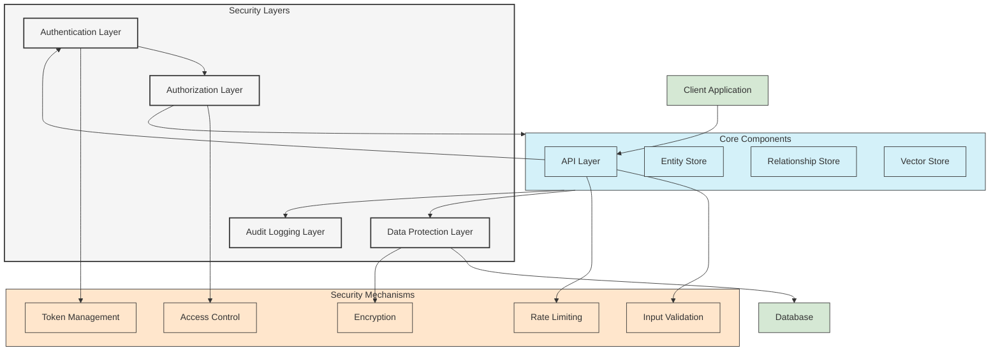
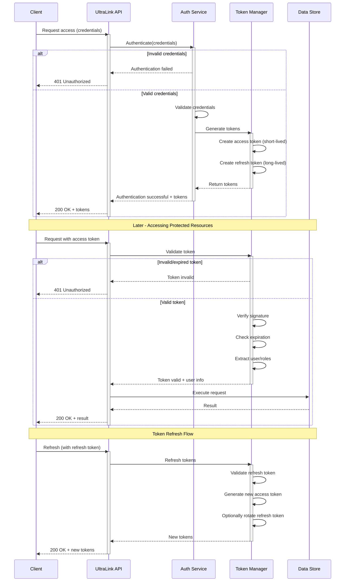
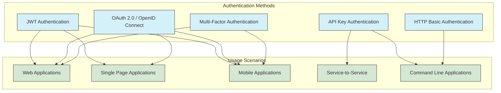
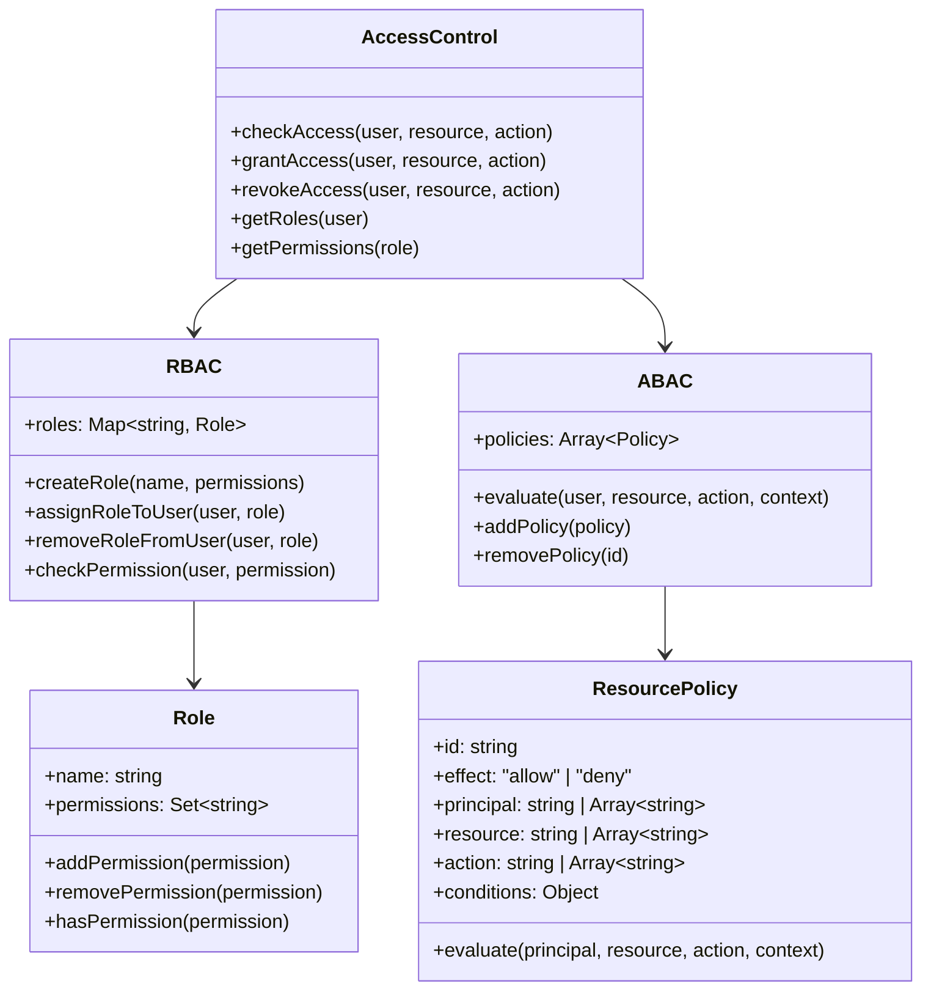
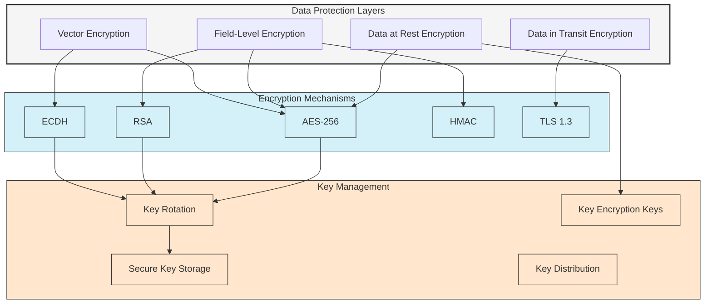
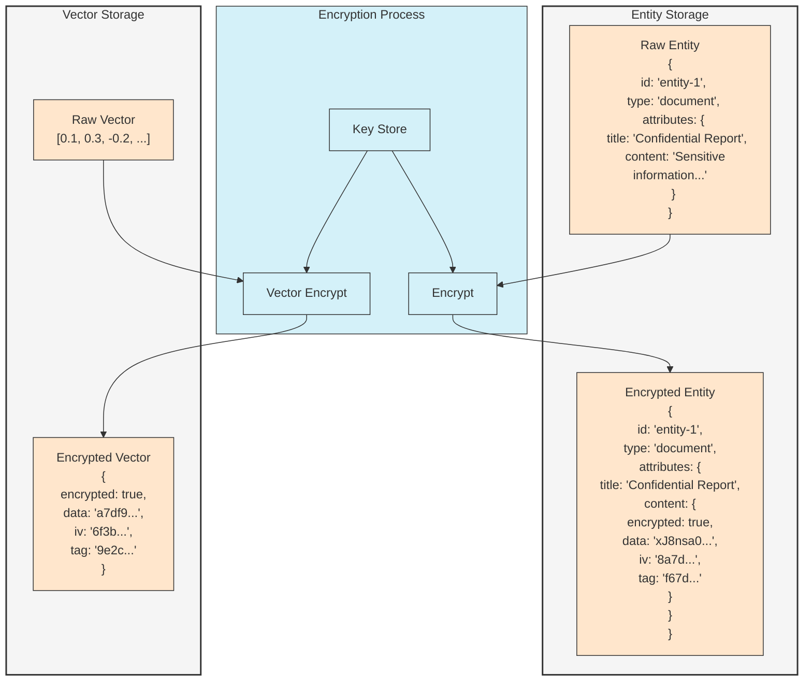
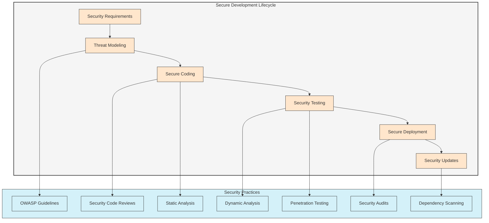
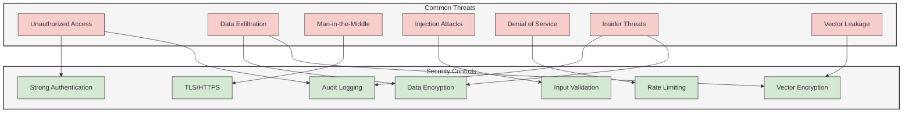
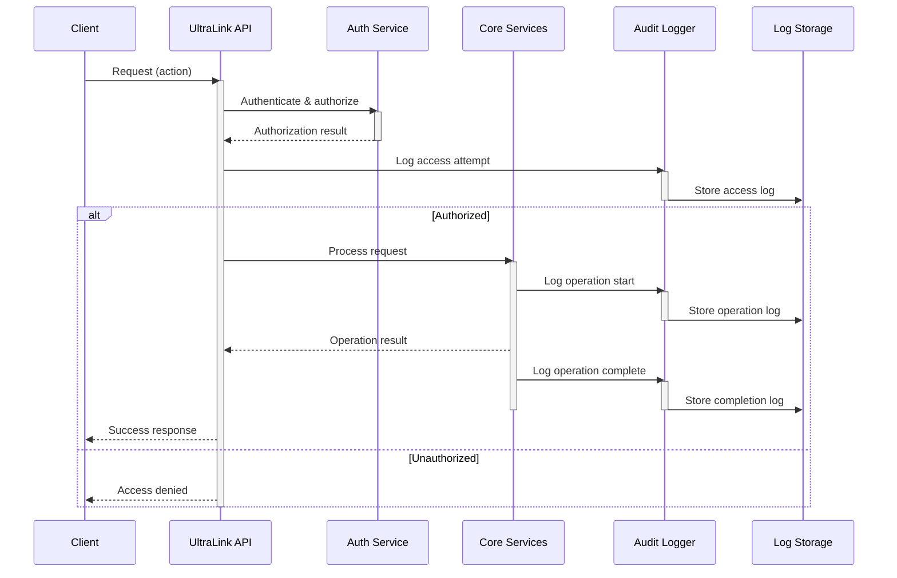

# Security Architecture

This document outlines UltraLink's security architecture, including its authentication and authorization systems, data protection mechanisms, and security best practices.

## Security Architecture Overview

UltraLink implements a multi-layered security architecture designed to protect knowledge graph data, control access, and prevent unauthorized operations.



## Authentication System

UltraLink's authentication system provides multiple authentication methods and secure token management.



### Authentication Methods

UltraLink supports multiple authentication methods to meet different security requirements:



## Authorization System

UltraLink implements a flexible and granular authorization system:



### Permission Model

The following diagram shows UltraLink's permission structure:

```mermaid
graph TD
    subgraph PermissionModel["Permission Model"]
        direction TB
        
        Actions[Actions<br/>create, read, update, delete, search, export]
        Resources[Resources<br/>entity, relationship, vector, export]
        Constraints[Constraints<br/>type, owner, attributes, metadata]
        
        Permissions[Permissions<br/>Format: resource:action:constraint]
    end
    
    Actions --> Permissions
    Resources --> Permissions
    Constraints --> Permissions
    
    subgraph Examples["Permission Examples"]
        direction TB
        
        P1[entity:read:*<br/>Read any entity]
        P2[entity:read:type=document<br/>Read entities of type 'document']
        P3[entity:create:*<br/>Create any entity]
        P4[relationship:read:*<br/>Read any relationship]
        P5[entity:*:owner=${userId}<br/>Full access to own entities]
    end
    
    Permissions --> Examples
    
    classDef model fill:#f5f5f5,stroke:#333,stroke-width:2px
    classDef component fill:#d4f1f9,stroke:#333,stroke-width:1px
    classDef permission fill:#ffe6cc,stroke:#333,stroke-width:1px
    
    class PermissionModel model
    class Actions,Resources,Constraints,Permissions component
    class Examples,P1,P2,P3,P4,P5 permission
```

## Data Protection

UltraLink implements multiple layers of data protection:



### Encryption Implementation



## Secure Development Practices

UltraLink follows secure development practices throughout its development lifecycle:



## Threat Modeling

UltraLink's security architecture is designed to address various threats:



## Audit Logging

UltraLink's audit logging system captures security-relevant events:



## Security Configuration

UltraLink provides comprehensive security configuration options:

```typescript
import { UltraLink } from '@ultralink/core';
import { JwtAuthProvider } from '@ultralink/auth-jwt';
import { FieldEncryptionPlugin } from '@ultralink/security';

// Initialize UltraLink with security configuration
const ultralink = new UltraLink({
  // Authentication configuration
  auth: {
    provider: new JwtAuthProvider({
      secret: process.env.JWT_SECRET,
      expiresIn: '1h',
      refreshToken: {
        enabled: true,
        expiresIn: '7d'
      },
      // Optional MFA configuration
      mfa: {
        enabled: true,
        methods: ['totp']
      }
    }),
    // Rate limiting
    rateLimit: {
      enabled: true,
      windowMs: 15 * 60 * 1000, // 15 minutes
      max: 100 // limit each IP to 100 requests per windowMs
    }
  },
  
  // Access control configuration
  accessControl: {
    enabled: true,
    defaultPolicy: 'deny',
    rbac: {
      roles: {
        admin: ['*:*:*'],
        editor: ['entity:create:*', 'entity:read:*', 'entity:update:*'],
        viewer: ['entity:read:*']
      }
    },
    abac: {
      policies: [
        {
          id: 'policy-1',
          effect: 'allow',
          principal: '${user.id}',
          resource: 'entity',
          action: '*',
          conditions: {
            'resource.owner': '${user.id}'
          }
        }
      ]
    }
  },
  
  // Data protection
  security: {
    encryption: {
      enabled: true,
      keyProvider: 'env',
      keyEnvVar: 'ENCRYPTION_KEY',
      algorithms: {
        symmetric: 'aes-256-gcm',
        asymmetric: 'rsa-oaep'
      },
      fields: {
        entity: ['attributes.content', 'attributes.privateNotes'],
        vector: true // Enable vector encryption
      }
    }
  },
  
  // Audit logging
  audit: {
    enabled: true,
    level: 'info',
    events: ['auth.*', 'entity.*', 'relationship.*', 'export.*'],
    storage: {
      type: 'file',
      path: './logs/audit.log',
      rotation: {
        enabled: true,
        size: '10m',
        files: 5
      }
    }
  }
});

// Add security plugins
ultralink.use(new FieldEncryptionPlugin({
  encryptionKey: process.env.FIELD_ENCRYPTION_KEY,
  fields: [
    {
      path: 'entity.attributes.sensitiveData',
      algorithm: 'aes-256-gcm'
    }
  ]
}));

await ultralink.initialize();
```

## Security Best Practices

### Application Security Checklist

1. **Authentication**:
   - Use secure authentication mechanisms (JWT, OAuth, etc.)
   - Implement proper token validation and expiration
   - Enable multi-factor authentication for sensitive operations
   - Secure storage of tokens and credentials

2. **Authorization**:
   - Implement least privilege principle
   - Use role-based and attribute-based access control
   - Validate authorization on every request
   - Apply appropriate permission boundaries

3. **Data Protection**:
   - Encrypt sensitive data at rest
   - Always use HTTPS/TLS for data in transit
   - Implement field-level encryption for highly sensitive data
   - Configure and use vector embedding encryption

4. **Input Validation**:
   - Validate all user input
   - Use parameterized queries to prevent injection
   - Implement strict type checking
   - Sanitize data before processing

5. **Secure Configuration**:
   - Use environment variables for secrets
   - Implement secure key management
   - Run security scans on dependencies
   - Apply regular security updates

6. **Monitoring and Incident Response**:
   - Enable comprehensive audit logging
   - Set up monitoring for suspicious activities
   - Develop an incident response plan
   - Perform regular security reviews

## Related Documentation

- [Authentication Configuration](./authentication.md)
- [Authorization and Access Control](./authorization.md)
- [Data Encryption Guide](./encryption.md)
- [Security Hardening Guide](./hardening.md)
- [Audit Logging Setup](./audit-logging.md)
- [API Security Best Practices](./api-security.md) 