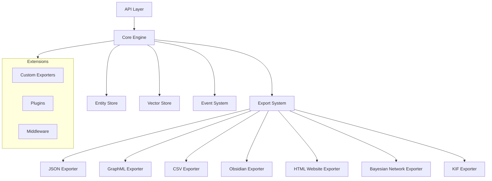
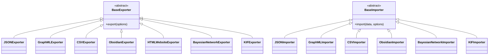

# UltraLink Technical Documentation

Welcome to the UltraLink technical documentation. This section provides in-depth information about the internals, architecture, and implementation details of UltraLink, designed for developers who want to understand how UltraLink works under the hood or contribute to its development.

## Table of Contents

1. [Architecture](#architecture)
   - [System Overview](../architecture/overview.md)
   - [Core Components](../architecture/components.md)
   - [Data Flow](../architecture/data-flow.md)
   - [Extension Points](../architecture/extensions.md)

2. [Core Systems](#core-systems)
   - [Entity Store](./entity-store.md)
   - [Relationship Manager](./relationship-manager.md)
   - [Query Engine](./query-engine.md)
   - [Vector Store](./vector-store.md)
   - [Event System](./event-system.md)

3. [Export & Import System](#export--import-system)
   - [Format Conversion](./format-conversion.md)
   - [Exporter Architecture](./exporter-architecture.md)
   - [Importer Architecture](./importer-architecture.md)
   - [Validation System](./validation-system.md)

4. [Performance](#performance)
   - [Benchmarks](../performance/format-benchmarks.md)
   - [Optimization Strategies](../performance/optimization.md)
   - [Memory Management](../performance/memory-management.md)
   - [Profiling](../performance/profiling.md)

5. [Development](#development)
   - [Development Setup](./development-setup.md)
   - [Testing Strategy](./testing-strategy.md)
   - [Contributing Guidelines](./contributing.md)
   - [Code Style](./code-style.md)

## Architecture

UltraLink is built with a modular architecture that separates core functionality into distinct components. This makes the system flexible, maintainable, and extensible.

For a detailed overview of UltraLink's architecture, see the [System Overview](../architecture/overview.md) document.

## Core Systems

UltraLink's functionality is divided into several core systems:

### Entity Store

The Entity Store is responsible for managing all entities in the knowledge graph, including their attributes and metadata. It provides efficient storage, retrieval, and indexing mechanisms to optimize access patterns.

### Relationship Manager

The Relationship Manager handles the connections between entities, supporting typed relationships with attributes and metadata. It maintains efficient indexing structures to support fast graph traversal, path finding, and relationship queries.

### Query Engine

The Query Engine provides a powerful query language for searching and filtering entities and relationships. It supports a MongoDB-like syntax with advanced operators for complex filtering, logical operations, and pattern matching.

### Vector Store

The Vector Store manages vector embeddings associated with entities, enabling semantic search and similarity matching. It supports efficient nearest-neighbor search algorithms and can be integrated with various embedding models.

### Event System

The Event System provides a robust publish-subscribe mechanism for reacting to changes in the knowledge graph. It emits events for entity and relationship operations, allowing applications to build reactive interfaces and maintain data consistency.

## Export & Import System

UltraLink's Export & Import System is designed around a plugin architecture, making it easy to add support for new formats:

The [Format Conversion](./format-conversion.md) document provides detailed information about the conversion process between different formats.

## Performance

Performance is a critical aspect of UltraLink, especially for large knowledge graphs. The [Benchmarks](../performance/format-benchmarks.md) document provides detailed performance metrics for different operations and export formats.

Key performance considerations include:

- **Memory Efficiency**: Strategies for minimizing memory usage with large graphs
- **Query Performance**: Indexing and optimization techniques for fast queries
- **Export Performance**: Format-specific optimizations for efficient exports
- **Scalability**: Approaches for handling graphs of different sizes

## Development

Contributing to UltraLink development requires an understanding of the codebase, development workflow, and coding standards. The [Development Setup](./development-setup.md) document provides instructions for setting up a development environment, while the [Contributing Guidelines](./contributing.md) outline the process for submitting changes.

## Format Specifications

For detailed specifications of the supported export formats, see the [Format Documentation](../formats/README.md).

## API Reference

The complete API reference is available in the [API Documentation](../api/README.md). 