# UltraLink Technical Architecture

This document provides an in-depth exploration of UltraLink's technical architecture, including component relationships, data flows, and implementation details. The diagrams and explanations here are intended for developers who need to understand UltraLink's internal structure.

## System Overview

UltraLink is built on a layered architecture that separates concerns while providing flexibility for extension and customization.

```mermaid
flowchart TB
    subgraph Client["Client Applications"]
        WebApp["Web Applications"]
        NodeApp["Node.js Applications"]
        CLITool["Command Line Tools"]
    end
    
    subgraph PublicAPI["Public API Layer"]
        CoreAPI["Core API"]
        QueryAPI["Query API"]
        ExportAPI["Export API"]
        VectorAPI["Vector API"]
        TemporalAPI["Temporal API"]
    end
    
    subgraph CoreEngine["Core Engine"]
        EntityManager["Entity Manager"]
        RelationshipManager["Relationship Manager"]
        TypeSystem["Type System"]
        ValidationEngine["Validation Engine"]
        QueryEngine["Query Engine"]
        InferenceEngine["Inference Engine"]
    end
    
    subgraph DataLayer["Data Layer"]
        EntityStore["Entity Store"]
        RelationshipStore["Relationship Store"]
        VectorStore["Vector Store"]
        TemporalStore["Temporal Store"]
        MetadataStore["Metadata Store"]
    end
    
    subgraph ExtensionSystem["Extension System"]
        ExportFormats["Export Formats"]
        VectorModels["Vector Models"]
        CustomRenderFormats["Custom Render Formats"]
        Plugins["Plugins"]
    end
    
    Client --> PublicAPI
    PublicAPI --> CoreEngine
    CoreEngine --> DataLayer
    CoreEngine --> ExtensionSystem
    ExtensionSystem --> DataLayer
    
    classDef client fill:#f9a03f,stroke:#f9a03f,color:#333
    classDef api fill:#59b3a9,stroke:#59b3a9,color:#333
    classDef core fill:#5271ff,stroke:#5271ff,color:white
    classDef data fill:#a883e9,stroke:#a883e9,color:white
    classDef extension fill:#78c552,stroke:#78c552,color:#333
    
    class Client client
    class PublicAPI api
    class CoreEngine core
    class DataLayer data
    class ExtensionSystem extension
```

## Component Breakdown

### Public API Layer

The public API layer provides the main interface for developers to interact with UltraLink.

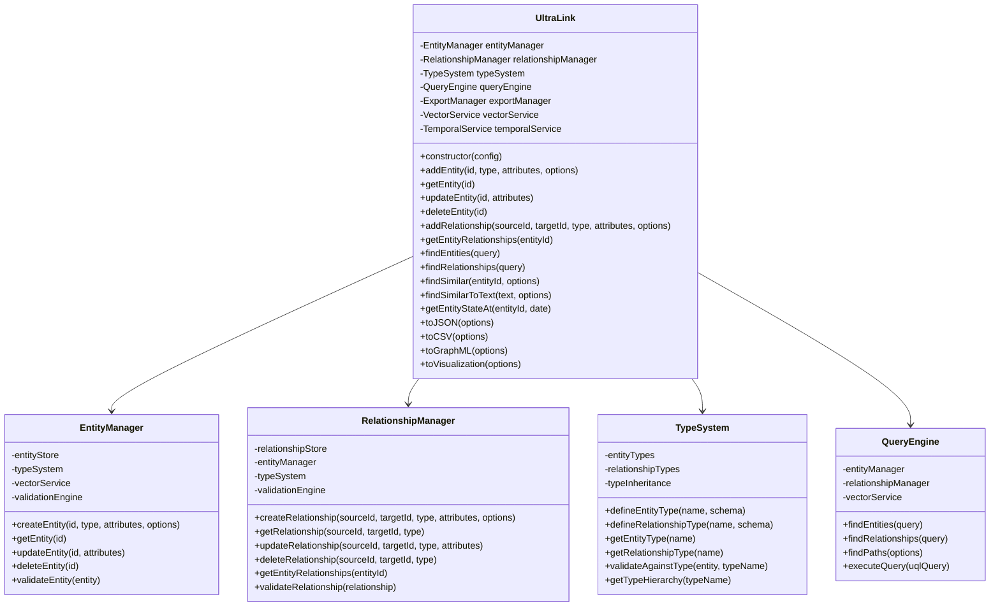

### Core Engine

The core engine implements the central functionality of UltraLink.

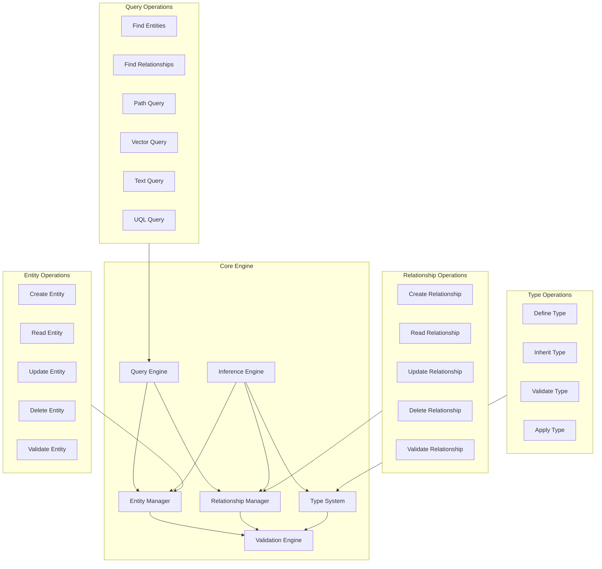

### Data Layer

The data layer handles persistence and retrieval of various types of data.

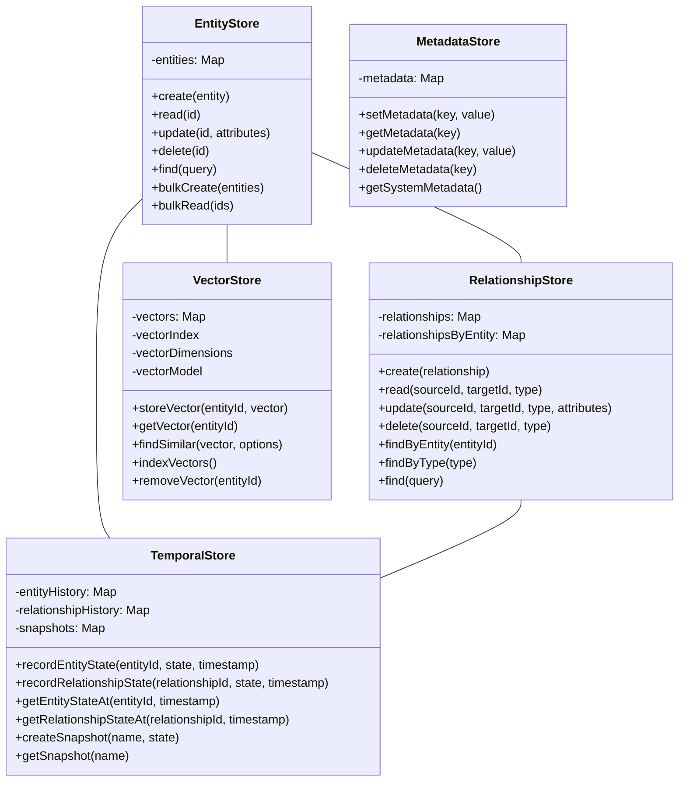

## Data Flow Diagrams

### Entity Creation Flow

This diagram illustrates the flow of data and control when creating a new entity.

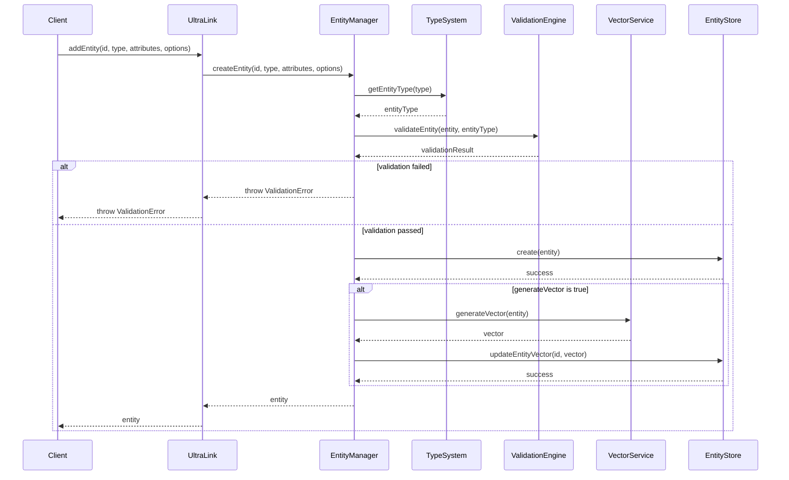

### Query Execution Flow

This diagram shows how a query flows through the system.

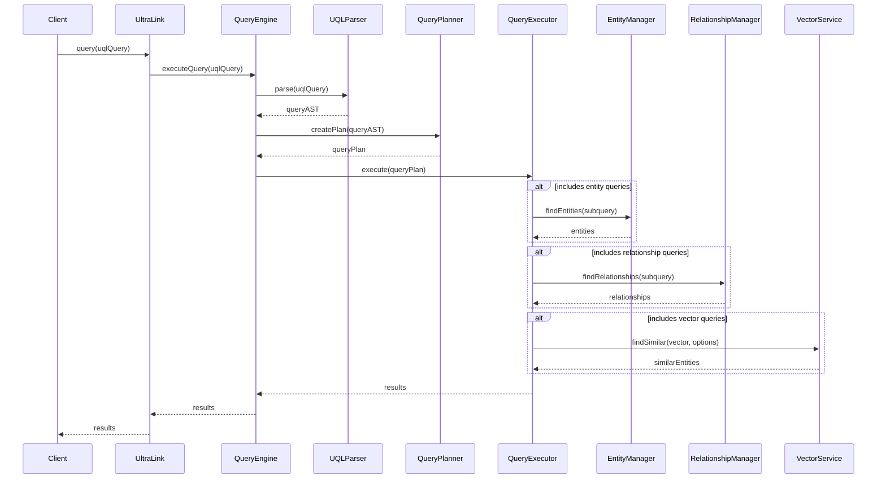

### Export Flow

This diagram illustrates the flow when exporting to various formats.

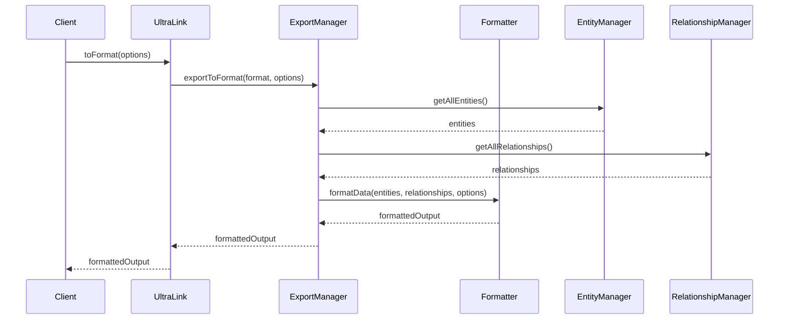

## Internal Data Structures

### Entity Structure

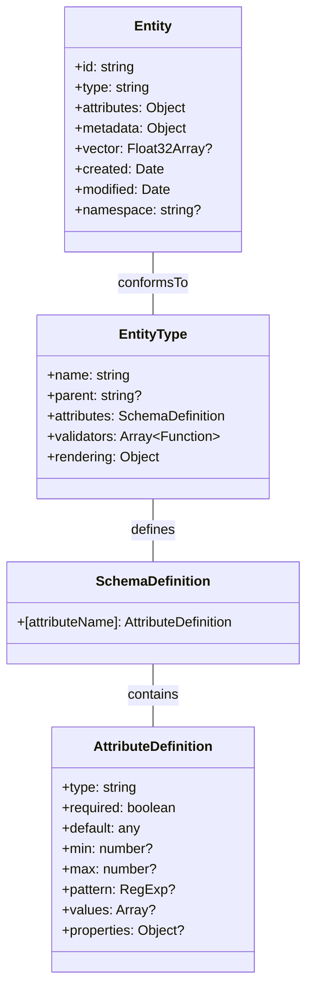

### Relationship Structure

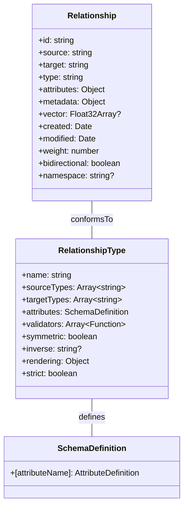

## Vector Integration

The vector integration architecture allows UltraLink to work with different embedding models.

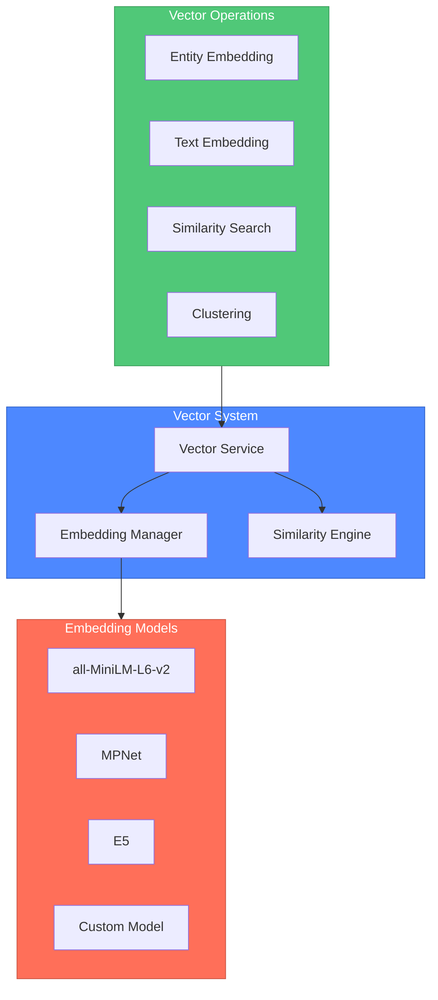

## Temporal System

The temporal system architecture enables tracking changes over time.

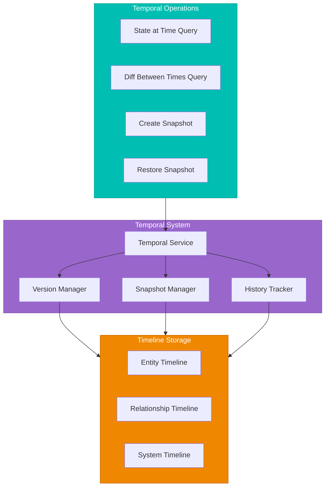

## Extensibility Architecture

UltraLink's extensibility architecture allows for customization and extension.

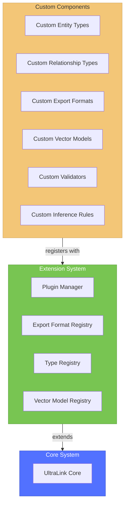

## Validation System

The validation system architecture ensures data integrity.

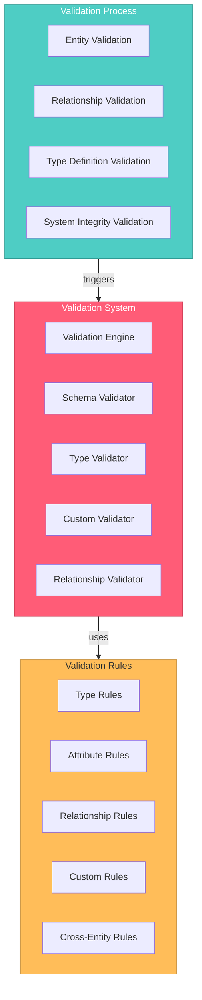

## Performance Optimization

UltraLink includes several performance optimization strategies.

```mermaid
flowchart LR
    subgraph IndexStrategies["Indexing Strategies"]
        IdIndex["ID Index"]
        TypeIndex["Type Index"]
        AttributeIndex["Attribute Index"]
        VectorIndex["Vector Index"]
    end
    
    subgraph CachingSystem["Caching System"]
        EntityCache["Entity Cache"]
        RelationshipCache["Relationship Cache"]
        QueryCache["Query Cache"]
        TypeCache["Type Cache"]
    end
    
    subgraph LazyLoading["Lazy Loading"]
        LazyVectors["Lazy Vector Loading"]
        LazyRelationships["Lazy Relationship Loading"]
        LazyHistory["Lazy History Loading"]
    end
    
    subgraph BatchProcessing["Batch Processing"]
        BatchCreation["Batch Entity Creation"]
        BatchQueries["Batch Queries"]
        BatchVectorization["Batch Vectorization"]
    end
    
    IndexStrategies --- CachingSystem
    CachingSystem --- LazyLoading
    LazyLoading --- BatchProcessing
    
    classDef is fill:#5d87e6,stroke:#4a6cb8,color:white
    classDef cs fill:#ff8552,stroke:#cc6a42,color:white
    classDef ll fill:#79c99e,stroke:#61a17f,color:white
    classDef bp fill:#d183c9,stroke:#a769a1,color:white
    
    class IndexStrategies is
    class CachingSystem cs
    class LazyLoading ll
    class BatchProcessing bp
```

## Export System Architecture

The export system allows for rendering to multiple formats.

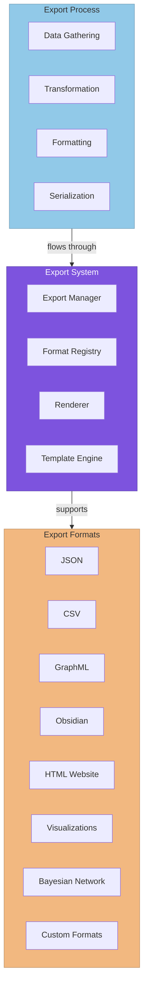

## Implementation Considerations

### Memory Management

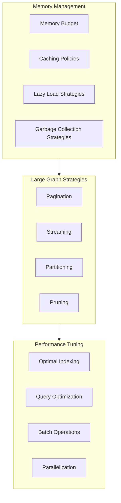

### Concurrency and Thread Safety

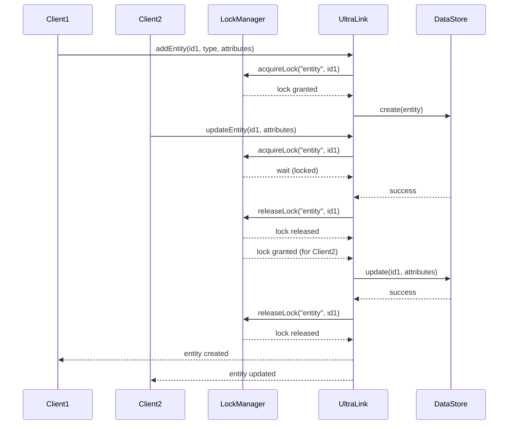

## Integration Patterns

### External System Integration

```mermaid
flowchart LR
    subgraph ExternalSystems["External Systems"]
        Database["Databases"]
        API["External APIs"]
        FileSystem["File Systems"]
        MessageQueue["Message Queues"]
    end
    
    subgraph IntegrationLayer["Integration Layer"]
        Adapters["Adapters"]
        Connectors["Connectors"]
        Transformers["Transformers"]
        EventHandlers["Event Handlers"]
    end
    
    subgraph UltraLinkSystem["UltraLink System"]
        Import["Import Services"]
        Export["Export Services"]
        Events["Event System"]
        Core["Core System"]
    end
    
    ExternalSystems <--> IntegrationLayer
    IntegrationLayer <--> UltraLinkSystem
    
    classDef external fill:#f29e4c,stroke:#c27f3d,color:#333
    classDef integration fill:#3e92cc,stroke:#3174a3,color:white
    classDef ultralink fill:#7768ae,stroke:#5f538b,color:white
    
    class ExternalSystems external
    class IntegrationLayer integration
    class UltraLinkSystem ultralink
```

### Plugin Architecture

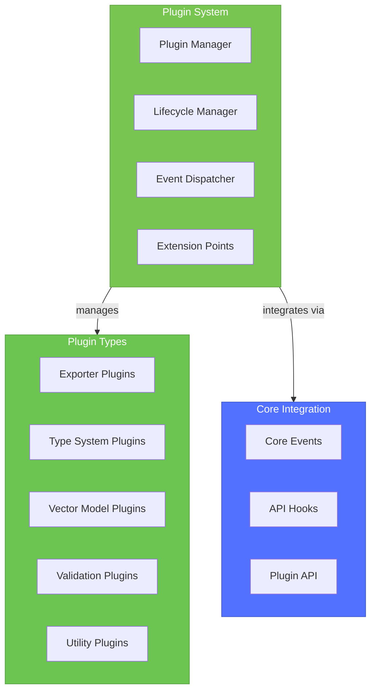

## Deployment Architectures

### Single Application Deployment

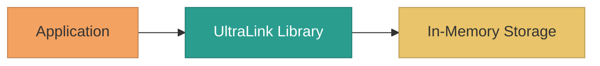

### Client-Server Deployment

```mermaid
flowchart LR
    subgraph ClientSide["Client Side"]
        WebClient["Web Client"]
        MobileClient["Mobile Client"]
        DesktopClient["Desktop Client"]
    end
    
    subgraph ServerSide["Server Side"]
        APIServer["API Server"]
        UltraLinkServer["UltraLink Server"]
        StorageSystem["Storage System"]
    end
    
    ClientSide <-- API Calls --> APIServer
    APIServer --> UltraLinkServer
    UltraLinkServer --> StorageSystem
    
    classDef client fill:#f4a261,stroke:#c38250,color:#333
    classDef server fill:#2a9d8f,stroke:#227f73,color:white
    classDef storage fill:#e9c46a,stroke:#ba9d55,color:#333
    
    class ClientSide client
    class ServerSide server
    class StorageSystem storage
```

### Distributed Deployment

```mermaid
flowchart TB
    subgraph Clients["Clients"]
        WebClient["Web Clients"]
        APIClient["API Clients"]
    end
    
    subgraph Frontend["Frontend Layer"]
        LoadBalancer["Load Balancer"]
        APIGateway["API Gateway"]
        CDN["CDN"]
    end
    
    subgraph Services["Service Layer"]
        EntityService["Entity Service"]
        RelationshipService["Relationship Service"]
        QueryService["Query Service"]
        VectorService["Vector Service"]
        ExportService["Export Service"]
    end
    
    subgraph Storage["Storage Layer"]
        EntityDB["Entity Database"]
        RelationshipDB["Relationship Database"]
        VectorDB["Vector Database"]
        TemporalDB["Temporal Database"]
        MetadataDB["Metadata Database"]
    end
    
    Clients <--> Frontend
    Frontend <--> Services
    Services <--> Storage
    
    classDef client fill:#f4a261,stroke:#c38250,color:#333
    classDef front fill:#2a9d8f,stroke:#227f73,color:white
    classDef service fill:#457b9d,stroke:#38637e,color:white
    classDef storage fill:#e9c46a,stroke:#ba9d55,color:#333
    
    class Clients client
    class Frontend front
    class Services service
    class Storage storage
```

## Event System

UltraLink's event system allows for reactive programming patterns.

```mermaid
flowchart LR
    subgraph EventSystem["Event System"]
        EventEmitter["Event Emitter"]
        EventBus["Event Bus"]
        EventRegistry["Event Registry"]
    end
    
    subgraph EventTypes["Event Types"]
        EntityEvents["Entity Events"]
        RelationshipEvents["Relationship Events"]
        QueryEvents["Query Events"]
        SystemEvents["System Events"]
    end
    
    subgraph EventHandlers["Event Handlers"]
        Listeners["Listeners"]
        Middleware["Middleware"]
        Hooks["Hooks"]
        Plugins["Plugins"]
    end
    
    EventTypes -- flow through --> EventSystem
    EventSystem -- dispatched to --> EventHandlers
    
    classDef es fill:#ff7a5a,stroke:#cc6248,color:white
    classDef et fill:#61a0af,stroke:#4e808c,color:white
    classDef eh fill:#97cc04,stroke:#79a303,color:#333
    
    class EventSystem es
    class EventTypes et
    class EventHandlers eh
```

## Security Architecture

```mermaid
flowchart TB
    subgraph SecuritySystem["Security System"]
        AccessControl["Access Control"]
        DataValidation["Data Validation"]
        Sanitization["Sanitization"]
        Encryption["Encryption"]
    end
    
    subgraph AccessLevels["Access Levels"]
        EntityLevel["Entity Level"]
        RelationshipLevel["Relationship Level"]
        AttributeLevel["Attribute Level"]
        OperationLevel["Operation Level"]
    end
    
    subgraph SecurityPolicies["Security Policies"]
        AuthNPolicy["Authentication Policy"]
        AuthZPolicy["Authorization Policy"]
        DataPolicy["Data Protection Policy"]
        AuditPolicy["Audit Policy"]
    end
    
    SecuritySystem -- implements --> SecurityPolicies
    SecuritySystem -- controls at --> AccessLevels
    
    classDef ss fill:#ef476f,stroke:#bf3959,color:white
    classDef al fill:#ffd166,stroke:#ccaf52,color:#333
    classDef sp fill:#06d6a0,stroke:#05ab80,color:#333
    
    class SecuritySystem ss
    class AccessLevels al
    class SecurityPolicies sp
```

---

This technical documentation provides a comprehensive view of UltraLink's architecture through detailed Mermaid diagrams. Developers can use this information to understand UltraLink's internal structure, extend its capabilities, optimize performance, and integrate with other systems. 