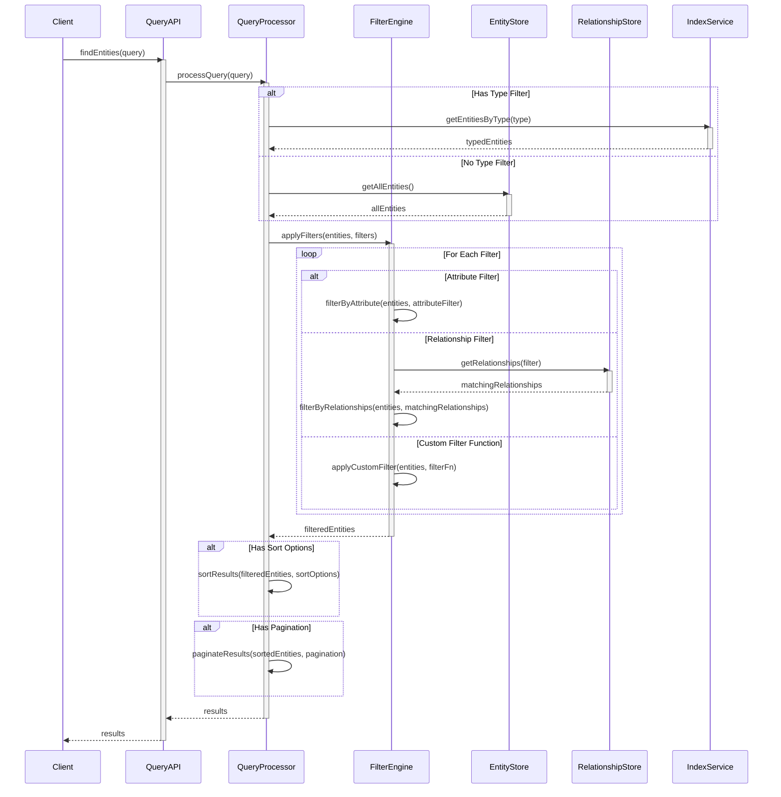
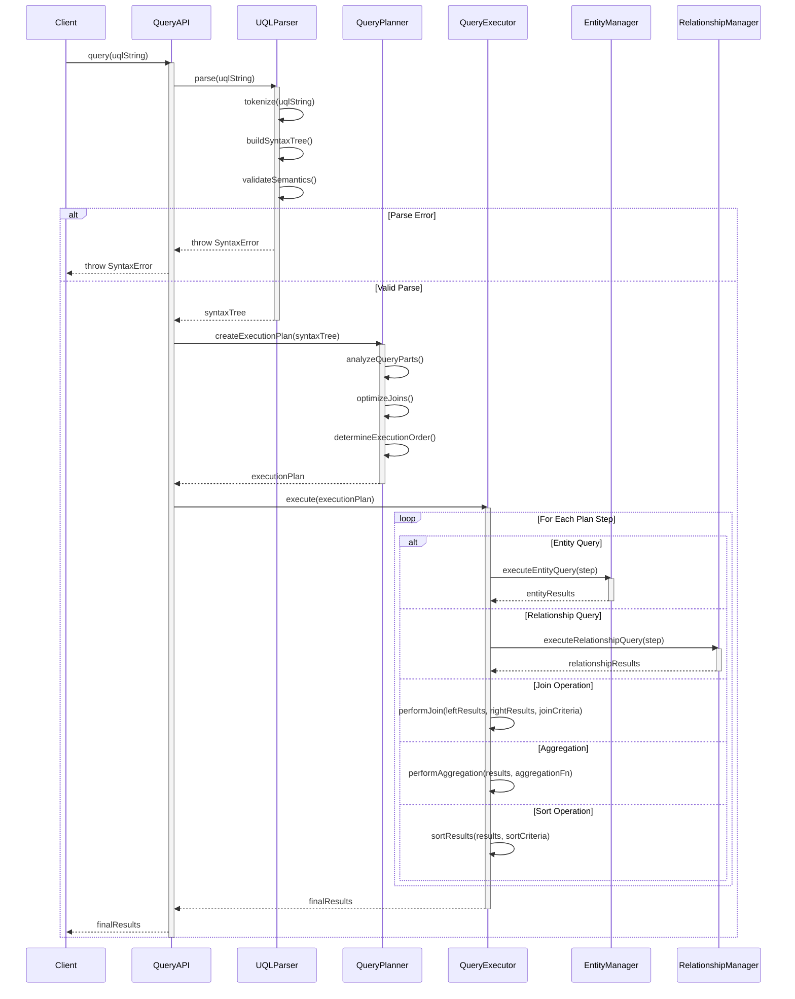
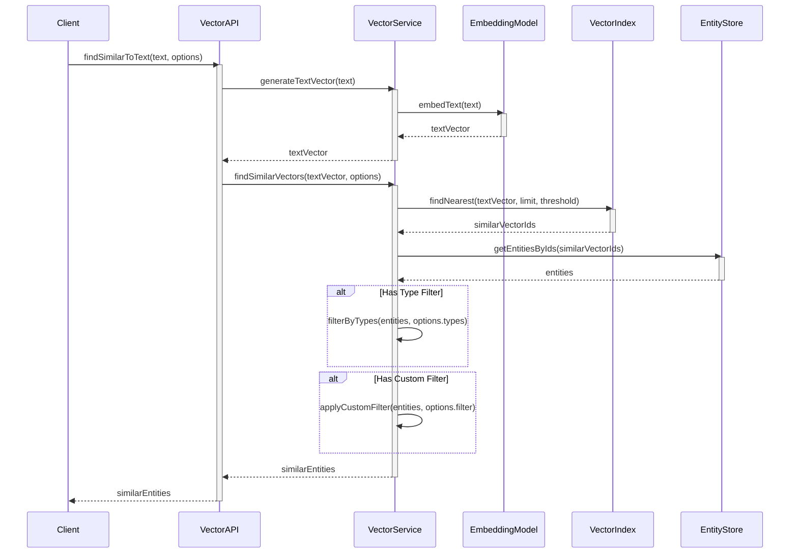
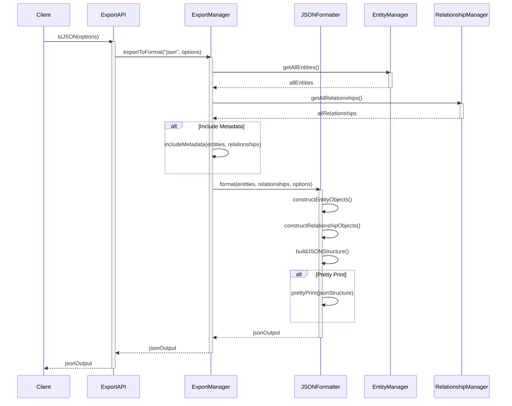
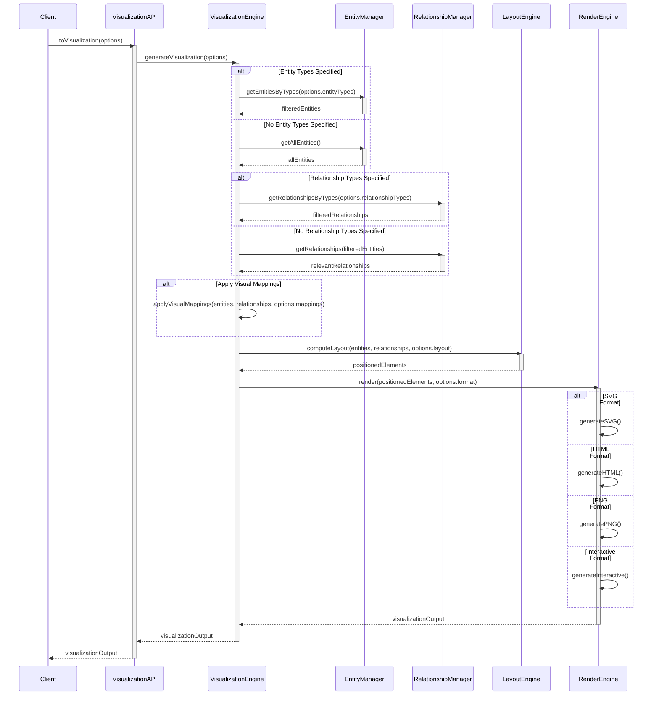
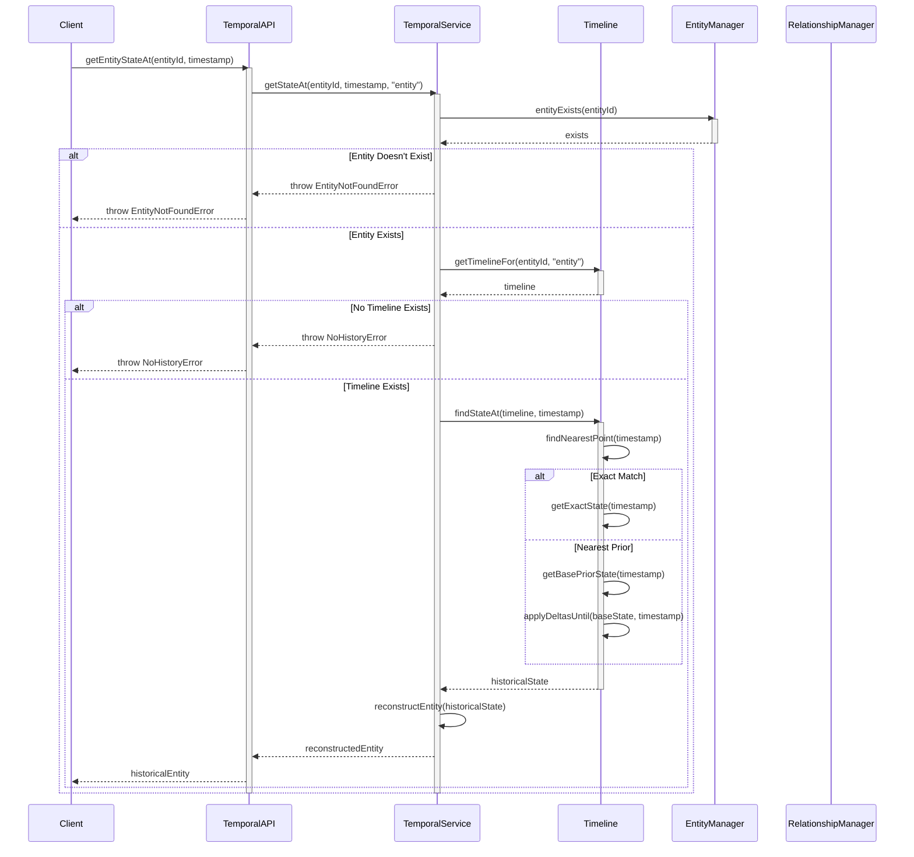
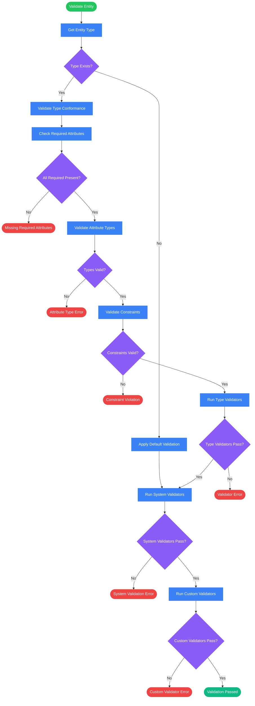
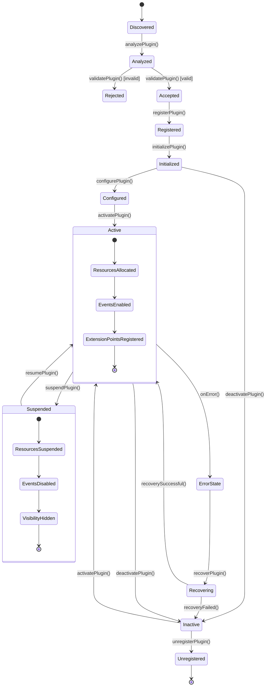
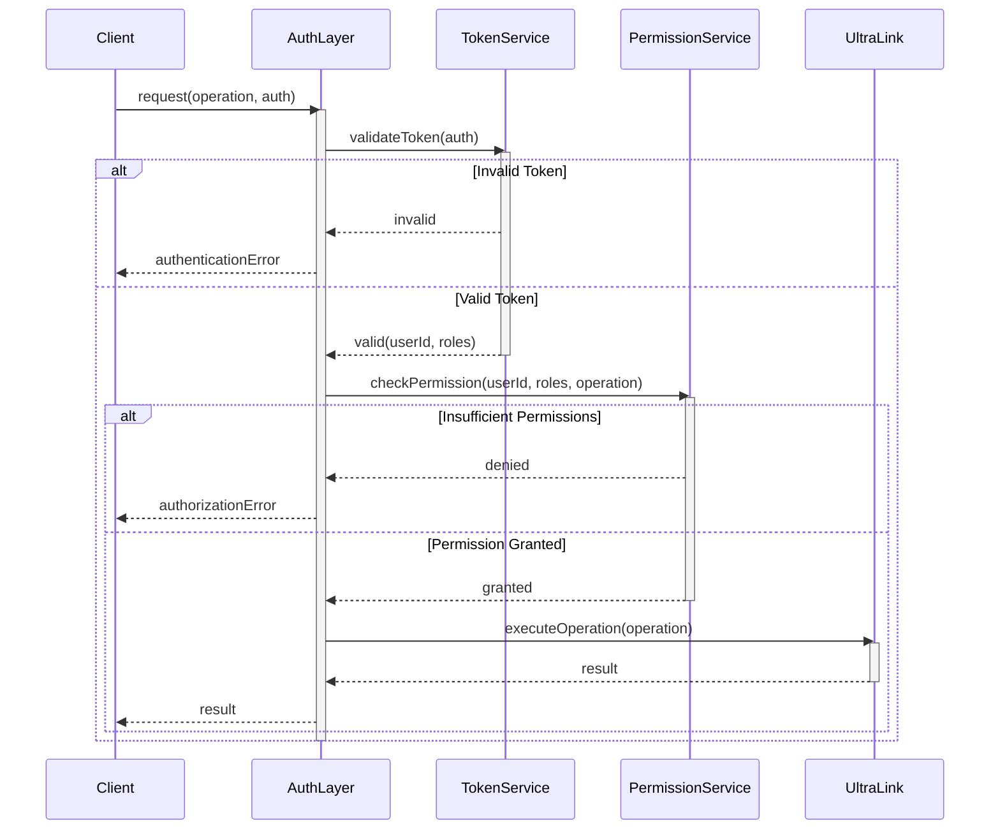

# UltraLink Data Flow Models

This document provides a comprehensive examination of UltraLink's data flow models, illustrating how data and control flow through the system during various operations. These models are designed to help developers understand the internal processes and optimize their interactions with UltraLink.

## Core Data Flows

### Entity Lifecycle Data Flow

The following diagram illustrates the complete lifecycle of an entity in UltraLink:

```mermaid
flowchart TD
    Start([Start]) --> CreateEntity[Create Entity]
    CreateEntity --> ValidateEntity{Validate Entity}
    
    ValidateEntity -->|Valid| GenerateVector{Generate Vector?}
    ValidateEntity -->|Invalid| ValidationError([Validation Error])
    
    GenerateVector -->|Yes| EmbeddingProcess[Generate Embedding]
    GenerateVector -->|No| StoreEntity[Store Entity]
    EmbeddingProcess --> StoreEntity
    
    StoreEntity --> IndexEntity[Index Entity]
    IndexEntity --> EmitEvent[Emit Entity Created Event]
    EmitEvent --> EntityCreated([Entity Created])
    
    EntityCreated --> QueryEntity[Query Entity]
    QueryEntity --> UpdateEntity[Update Entity]
    UpdateEntity --> ValidateUpdate{Validate Update}
    
    ValidateUpdate -->|Valid| UpdateVector{Update Vector?}
    ValidateUpdate -->|Invalid| UpdateError([Update Validation Error])
    
    UpdateVector -->|Yes| RegenerateVector[Regenerate Embedding]
    UpdateVector -->|No| StoreUpdate[Store Updated Entity]
    RegenerateVector --> StoreUpdate
    
    StoreUpdate --> ReindexEntity[Reindex Entity]
    ReindexEntity --> EmitUpdateEvent[Emit Entity Updated Event]
    EmitUpdateEvent --> EntityUpdated([Entity Updated])
    
    EntityUpdated --> DeleteEntity[Delete Entity]
    DeleteEntity --> RemoveRelationships[Remove Associated Relationships]
    RemoveRelationships --> RemoveFromIndex[Remove from Indices]
    RemoveFromIndex --> EmitDeleteEvent[Emit Entity Deleted Event]
    EmitDeleteEvent --> EntityDeleted([Entity Deleted])
    
    classDef start fill:#22c55e,stroke:#22c55e,color:white
    classDef process fill:#3b82f6,stroke:#3b82f6,color:white
    classDef decision fill:#8b5cf6,stroke:#8b5cf6,color:white
    classDef event fill:#f59e0b,stroke:#f59e0b,color:#333
    classDef end fill:#ef4444,stroke:#ef4444,color:white
    
    class Start start
    class CreateEntity,StoreEntity,IndexEntity,QueryEntity,UpdateEntity,StoreUpdate,ReindexEntity,DeleteEntity,RemoveRelationships,RemoveFromIndex,GenerateVector,EmbeddingProcess,RegenerateVector process
    class ValidateEntity,ValidateUpdate,UpdateVector decision
    class EmitEvent,EmitUpdateEvent,EmitDeleteEvent event
    class ValidationError,UpdateError,EntityCreated,EntityUpdated,EntityDeleted end
```

### Relationship Lifecycle Data Flow

The complete lifecycle of a relationship in UltraLink:

```mermaid
flowchart TD
    Start([Start]) --> ValidateEntities{Validate Entities}
    
    ValidateEntities -->|Valid| CreateRelationship[Create Relationship]
    ValidateEntities -->|Invalid| EntityError([Entity Error])
    
    CreateRelationship --> ValidateRelationship{Validate Relationship}
    ValidateRelationship -->|Valid| CheckBidirectional{Bidirectional?}
    ValidateRelationship -->|Invalid| ValidationError([Validation Error])
    
    CheckBidirectional -->|Yes| CreateReverseRel[Create Reverse Relationship]
    CheckBidirectional -->|No| StoreRelationship[Store Relationship]
    CreateReverseRel --> StoreRelationship
    
    StoreRelationship --> IndexRelationship[Index Relationship]
    IndexRelationship --> EmitEvent[Emit Relationship Created Event]
    EmitEvent --> RelCreated([Relationship Created])
    
    RelCreated --> QueryRelationship[Query Relationship]
    QueryRelationship --> UpdateRelationship[Update Relationship]
    UpdateRelationship --> ValidateUpdate{Validate Update}
    
    ValidateUpdate -->|Valid| StoreUpdate[Store Updated Relationship]
    ValidateUpdate -->|Invalid| UpdateError([Update Validation Error])
    
    StoreUpdate --> ReindexRelationship[Reindex Relationship]
    ReindexRelationship --> EmitUpdateEvent[Emit Relationship Updated Event]
    EmitUpdateEvent --> RelUpdated([Relationship Updated])
    
    RelUpdated --> DeleteRelationship[Delete Relationship]
    DeleteRelationship --> CheckBidirDelete{Bidirectional?}
    
    CheckBidirDelete -->|Yes| DeleteReverseRel[Delete Reverse Relationship]
    CheckBidirDelete -->|No| RemoveFromIndex[Remove from Indices]
    DeleteReverseRel --> RemoveFromIndex
    
    RemoveFromIndex --> EmitDeleteEvent[Emit Relationship Deleted Event]
    EmitDeleteEvent --> RelDeleted([Relationship Deleted])
    
    classDef start fill:#22c55e,stroke:#22c55e,color:white
    classDef process fill:#3b82f6,stroke:#3b82f6,color:white
    classDef decision fill:#8b5cf6,stroke:#8b5cf6,color:white
    classDef event fill:#f59e0b,stroke:#f59e0b,color:#333
    classDef end fill:#ef4444,stroke:#ef4444,color:white
    
    class Start start
    class CreateRelationship,StoreRelationship,IndexRelationship,QueryRelationship,UpdateRelationship,StoreUpdate,ReindexRelationship,DeleteRelationship,RemoveFromIndex,CreateReverseRel,DeleteReverseRel process
    class ValidateEntities,ValidateRelationship,ValidateUpdate,CheckBidirectional,CheckBidirDelete decision
    class EmitEvent,EmitUpdateEvent,EmitDeleteEvent event
    class EntityError,ValidationError,UpdateError,RelCreated,RelUpdated,RelDeleted end
```

## Query System Data Flows

### Object Query Data Flow

The flow of data when performing an object-based query:



### UQL Query Data Flow

The flow of data for the text-based UltraLink Query Language (UQL):



### Vector Query Data Flow

The flow of data when performing vector similarity searches:



## Export System Data Flows

### JSON Export Data Flow

The flow of data when exporting to JSON format:



### Visualization Export Data Flow

The flow of data when generating visualizations:



## Vector Integration Data Flows

### Vector Generation Data Flow

The flow of data when generating vector embeddings:

```mermaid
flowchart TD
    Start([Generate Vector]) --> InputSource{Input Source}
    
    InputSource -->|Entity| PrepareEntityText[Prepare Entity Text]
    InputSource -->|Text| PrepareRawText[Prepare Raw Text]
    InputSource -->|Relationship| PrepareRelText[Prepare Relationship Text]
    
    PrepareEntityText --> CombineAttributes[Combine Entity Attributes]
    PrepareRelText --> CombineRelAttributes[Combine Relationship Attributes]
    
    CombineAttributes --> NormalizeText[Normalize Text]
    PrepareRawText --> NormalizeText
    CombineRelAttributes --> NormalizeText
    
    NormalizeText --> SelectModel{Select Model}
    
    SelectModel -->|Default| DefaultModel[Use Default Embedding Model]
    SelectModel -->|Custom| CustomModel[Use Custom Embedding Model]
    
    DefaultModel --> GenerateEmbedding[Generate Embedding]
    CustomModel --> GenerateEmbedding
    
    GenerateEmbedding --> ProcessBatching{Batch Processing?}
    
    ProcessBatching -->|Yes| BatchEmbed[Process in Batch]
    ProcessBatching -->|No| SingleEmbed[Process Individually]
    
    BatchEmbed --> CombineResults[Combine Results]
    SingleEmbed --> OptimizeVector[Optimize Vector]
    CombineResults --> OptimizeVector
    
    OptimizeVector --> StoreVector[Store Vector]
    StoreVector --> IndexVector[Index Vector]
    IndexVector --> End([Vector Generated])
    
    classDef start fill:#22c55e,stroke:#22c55e,color:white
    classDef process fill:#3b82f6,stroke:#3b82f6,color:white
    classDef decision fill:#8b5cf6,stroke:#8b5cf6,color:white
    classDef end fill:#ef4444,stroke:#ef4444,color:white
    
    class Start start
    class PrepareEntityText,PrepareRawText,PrepareRelText,CombineAttributes,CombineRelAttributes,NormalizeText,DefaultModel,CustomModel,GenerateEmbedding,BatchEmbed,SingleEmbed,CombineResults,OptimizeVector,StoreVector,IndexVector process
    class InputSource,SelectModel,ProcessBatching decision
    class End end
```

### Vector Similarity Search Data Flow

```mermaid
flowchart TD
    Start([Start Search]) --> SearchType{Search Type}
    
    SearchType -->|Text Query| PrepareText[Prepare Text]
    SearchType -->|Entity ID| GetEntityVector[Get Entity Vector]
    SearchType -->|Raw Vector| ValidateVector[Validate Vector Dimensions]
    
    PrepareText --> NormalizeText[Normalize Text]
    NormalizeText --> GenerateQueryVector[Generate Query Vector]
    
    GetEntityVector --> EntityExists{Entity Exists?}
    EntityExists -->|Yes| RetrieveVector[Retrieve Entity Vector]
    EntityExists -->|No| EntityError([Entity Not Found Error])
    
    RetrieveVector --> VectorExists{Vector Exists?}
    VectorExists -->|Yes| UseExistingVector[Use Existing Vector]
    VectorExists -->|No| GenerateVector[Generate Vector for Entity]
    
    GenerateVector --> UseExistingVector
    
    ValidateVector --> VectorValid{Vector Valid?}
    VectorValid -->|Yes| UseProvidedVector[Use Provided Vector]
    VectorValid -->|No| VectorError([Invalid Vector Error])
    
    GenerateQueryVector --> PerformSearch[Perform Vector Search]
    UseExistingVector --> PerformSearch
    UseProvidedVector --> PerformSearch
    
    PerformSearch --> SelectSearchAlgorithm{Search Algorithm}
    
    SelectSearchAlgorithm -->|Exact| ExactNearestNeighbor[Exact Nearest Neighbor]
    SelectSearchAlgorithm -->|Approximate| ApproximateSearch[Approximate Nearest Neighbor]
    
    ExactNearestNeighbor --> ApplyThreshold[Apply Similarity Threshold]
    ApproximateSearch --> ApplyThreshold
    
    ApplyThreshold --> FilterResults[Filter Results by Type]
    FilterResults --> ApplyLimit[Apply Results Limit]
    ApplyLimit --> SortResults[Sort by Similarity Score]
    
    SortResults --> HydrateResults[Hydrate Entity Data]
    HydrateResults --> End([Return Results])
    
    classDef start fill:#22c55e,stroke:#22c55e,color:white
    classDef process fill:#3b82f6,stroke:#3b82f6,color:white
    classDef decision fill:#8b5cf6,stroke:#8b5cf6,color:white
    classDef error fill:#ef4444,stroke:#ef4444,color:white
    classDef end fill:#f59e0b,stroke:#f59e0b,color:#333
    
    class Start start
    class PrepareText,NormalizeText,GenerateQueryVector,RetrieveVector,GenerateVector,UseExistingVector,UseProvidedVector,PerformSearch,ExactNearestNeighbor,ApproximateSearch,ApplyThreshold,FilterResults,ApplyLimit,SortResults,HydrateResults process
    class SearchType,EntityExists,VectorExists,VectorValid,SelectSearchAlgorithm decision
    class EntityError,VectorError error
    class End end
```

## Temporal System Data Flows

### State Tracking Data Flow

The flow of data when tracking entity state changes:

```mermaid
flowchart TD
    Start([State Change]) --> EntityChange{Entity or Relationship}
    
    EntityChange -->|Entity| CaptureEntityState[Capture Current Entity State]
    EntityChange -->|Relationship| CaptureRelState[Capture Current Relationship State]
    
    CaptureEntityState --> CreateEntitySnapshot[Create Entity Snapshot]
    CaptureRelState --> CreateRelSnapshot[Create Relationship Snapshot]
    
    CreateEntitySnapshot --> AddTimestamp[Add Timestamp]
    CreateRelSnapshot --> AddTimestamp
    
    AddTimestamp --> TrackingEnabled{Temporal Tracking Enabled?}
    
    TrackingEnabled -->|Yes| SelectStorageStrategy{Storage Strategy}
    TrackingEnabled -->|No| SkipTracking[Skip Tracking]
    
    SelectStorageStrategy -->|Full Copy| FullStateCopy[Store Complete State Copy]
    SelectStorageStrategy -->|Delta| StoreDelta[Store Only Changed Fields]
    
    FullStateCopy --> CompressState{Compress Data?}
    StoreDelta --> CompressState
    
    CompressState -->|Yes| CompressData[Compress State Data]
    CompressState -->|No| StoreState[Store State in Timeline]
    
    CompressData --> StoreState
    
    StoreState --> UpdateLatestPointer[Update Latest State Pointer]
    UpdateLatestPointer --> EmitEvent[Emit State Change Event]
    
    EmitEvent --> End([State Recorded])
    SkipTracking --> End
    
    classDef start fill:#22c55e,stroke:#22c55e,color:white
    classDef process fill:#3b82f6,stroke:#3b82f6,color:white
    classDef decision fill:#8b5cf6,stroke:#8b5cf6,color:white
    classDef skip fill:#9ca3af,stroke:#9ca3af,color:white
    classDef end fill:#f59e0b,stroke:#f59e0b,color:#333
    
    class Start start
    class CaptureEntityState,CaptureRelState,CreateEntitySnapshot,CreateRelSnapshot,AddTimestamp,FullStateCopy,StoreDelta,CompressData,StoreState,UpdateLatestPointer,EmitEvent process
    class EntityChange,TrackingEnabled,SelectStorageStrategy,CompressState decision
    class SkipTracking skip
    class End end
```

### Historical Query Data Flow

The flow of data when querying historical state:



## Type System Data Flows

### Type Definition Data Flow

The flow of data when defining custom types:

```mermaid
flowchart TD
    Start([Define Type]) --> TypeKind{Entity or Relationship Type}
    
    TypeKind -->|Entity Type| ValidateEntitySchema[Validate Entity Schema]
    TypeKind -->|Relationship Type| ValidateRelSchema[Validate Relationship Schema]
    
    ValidateEntitySchema --> CheckEntityName{Name Exists?}
    ValidateRelSchema --> CheckRelName{Name Exists?}
    
    CheckEntityName -->|Yes| UpdateExisting[Update Existing Type]
    CheckEntityName -->|No| ValidateParent[Validate Parent Type]
    
    CheckRelName -->|Yes| UpdateExisting
    CheckRelName -->|No| ValidateSourceTarget[Validate Source/Target Types]
    
    ValidateParent --> ParentValid{Parent Valid?}
    ParentValid -->|No| ParentError([Invalid Parent Error])
    ParentValid -->|Yes| ValidateAttributes[Validate Attribute Schema]
    
    ValidateSourceTarget --> SourceTargetValid{Types Valid?}
    SourceTargetValid -->|No| TypesError([Invalid Types Error])
    SourceTargetValid -->|Yes| ValidateAttributes
    
    ValidateAttributes --> AttributesValid{Schema Valid?}
    AttributesValid -->|No| SchemaError([Invalid Schema Error])
    AttributesValid -->|Yes| RegisterType[Register Type]
    
    UpdateExisting --> RegisterType
    
    RegisterType --> BuildTypeHierarchy[Build Type Hierarchy]
    BuildTypeHierarchy --> IndexType[Index Type]
    IndexType --> EmitEvent[Emit Type Defined Event]
    EmitEvent --> End([Type Defined])
    
    classDef start fill:#22c55e,stroke:#22c55e,color:white
    classDef process fill:#3b82f6,stroke:#3b82f6,color:white
    classDef decision fill:#8b5cf6,stroke:#8b5cf6,color:white
    classDef error fill:#ef4444,stroke:#ef4444,color:white
    classDef end fill:#f59e0b,stroke:#f59e0b,color:#333
    
    class Start start
    class ValidateEntitySchema,ValidateRelSchema,ValidateParent,ValidateSourceTarget,ValidateAttributes,RegisterType,BuildTypeHierarchy,IndexType,EmitEvent,UpdateExisting process
    class TypeKind,CheckEntityName,CheckRelName,ParentValid,SourceTargetValid,AttributesValid decision
    class ParentError,TypesError,SchemaError error
    class End end
```

## Validation System Data Flows

### Entity Validation Data Flow

The flow of data during entity validation:



## Plugin System Data Flows

### Plugin Lifecycle Flow

The flow of control during a plugin's lifecycle:



## Security Data Flows

### Authentication Flow



## Integration Data Flows

### External System Integration Flow

```mermaid
flowchart TD
    Start([Integration]) --> IntegrationType{Integration Type}
    
    IntegrationType -->|Import| SourceSystem[Connect to Source System]
    IntegrationType -->|Export| TargetSystem[Connect to Target System]
    IntegrationType -->|Sync| BothSystems[Connect to Both Systems]
    
    SourceSystem --> FetchData[Fetch External Data]
    FetchData --> TransformImport[Transform to UltraLink Format]
    TransformImport --> ValidationCheck{Validate Data}
    
    ValidationCheck -->|Invalid| ImportError([Import Validation Error])
    ValidationCheck -->|Valid| ImportToUltraLink[Import to UltraLink]
    ImportToUltraLink --> UpdateMetadata[Update Integration Metadata]
    
    TargetSystem --> PrepareData[Prepare UltraLink Data]
    PrepareData --> TransformExport[Transform to Target Format]
    TransformExport --> ExportValidation{Validate Export}
    
    ExportValidation -->|Invalid| ExportError([Export Validation Error])
    ExportValidation -->|Valid| SendToTarget[Send to Target System]
    SendToTarget --> UpdateMetadata
    
    BothSystems --> CompareData[Compare Data States]
    CompareData --> DiffDetection{Changes Detected}
    
    DiffDetection -->|No| NoChanges[No Sync Required]
    DiffDetection -->|Yes| DetermineSyncDirection[Determine Sync Direction]
    
    DetermineSyncDirection --> ApplyChanges[Apply Changes]
    ApplyChanges --> UpdateMetadata
    
    UpdateMetadata --> LogActivity[Log Integration Activity]
    LogActivity --> End([Integration Complete])
    NoChanges --> End
    
    classDef start fill:#22c55e,stroke:#22c55e,color:white
    classDef process fill:#3b82f6,stroke:#3b82f6,color:white
    classDef decision fill:#8b5cf6,stroke:#8b5cf6,color:white
    classDef error fill:#ef4444,stroke:#ef4444,color:white
    classDef skip fill:#9ca3af,stroke:#9ca3af,color:white
    classDef end fill:#f59e0b,stroke:#f59e0b,color:#333
    
    class Start start
    class SourceSystem,FetchData,TransformImport,ImportToUltraLink,TargetSystem,PrepareData,TransformExport,SendToTarget,BothSystems,CompareData,DetermineSyncDirection,ApplyChanges,UpdateMetadata,LogActivity,NoChanges process
    class IntegrationType,ValidationCheck,ExportValidation,DiffDetection decision
    class ImportError,ExportError error
    class End end
```

---

These data flow models provide a comprehensive view of how information flows through UltraLink during various operations. Understanding these flows is essential for developing efficient applications and extensions that leverage UltraLink's capabilities. The mermaid diagrams offer visual clarity on complex processes, helping developers navigate the system architecture. 