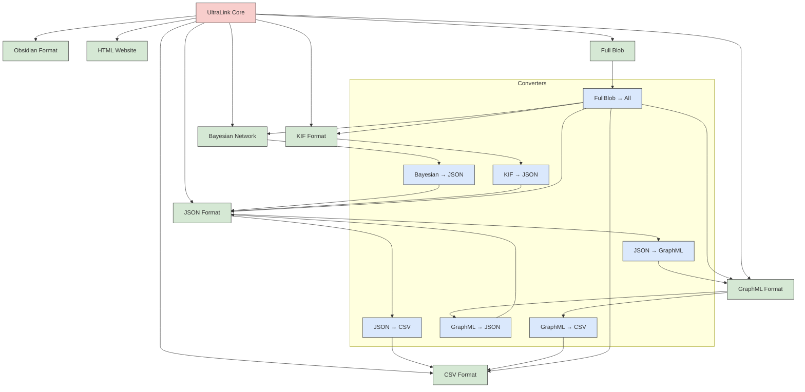
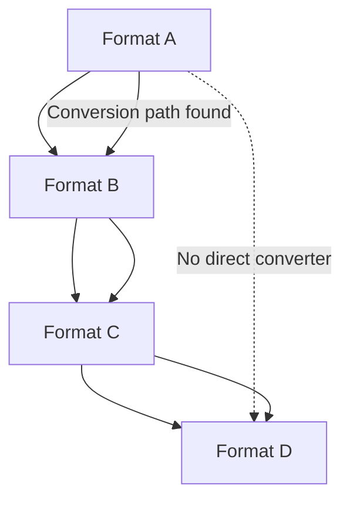

# UltraLink Format Conversion Technical Guide

This technical guide explains the internals of UltraLink's format conversion system, including implementation details, optimization techniques, and advanced usage patterns.

## Format Conversion Architecture

UltraLink implements a flexible format conversion system that allows for seamless transformation between different formats:



## Conversion Implementation

### Core Conversion Interface

UltraLink's format conversion is based on a common interface:

```typescript
interface FormatConverter {
  sourceFormat: string;
  targetFormat: string;
  canConvert(source: any): boolean;
  convert(source: any, options?: ConversionOptions): any;
}

interface ConversionOptions {
  includeMetadata?: boolean;
  preserveTypes?: boolean;
  validationLevel?: 'none' | 'basic' | 'strict';
  customMappings?: Record<string, string>;
  [key: string]: any;
}
```

### Converter Registration

Converters are registered with the system and automatically discovered:

```javascript
// Register a converter
UltraLink.registerConverter({
  sourceFormat: 'json',
  targetFormat: 'graphml',
  canConvert: (source) => {
    // Check if the source is valid JSON for GraphML conversion
    return source && 
           (typeof source === 'object' || typeof source === 'string') &&
           (source.entities || source.nodes);
  },
  convert: (source, options = {}) => {
    // Conversion logic...
    return graphmlOutput;
  }
});

// Usage
const jsonData = ultralink.toJSON();
const graphml = UltraLink.convertFormat(jsonData, 'json', 'graphml', {
  preserveTypes: true
});
```

### Conversion Path Finding

When a direct converter is not available, UltraLink can create a conversion path:



Implementation details:

```javascript
function findConversionPath(sourceFormat, targetFormat) {
  // Use a breadth-first search to find the shortest conversion path
  const visited = new Set([sourceFormat]);
  const queue = [{
    format: sourceFormat,
    path: []
  }];
  
  while (queue.length > 0) {
    const { format, path } = queue.shift();
    
    // Find all converters that accept this format as source
    const nextConverters = converters.filter(c => c.sourceFormat === format);
    
    for (const converter of nextConverters) {
      const nextFormat = converter.targetFormat;
      
      if (nextFormat === targetFormat) {
        // Found a path to the target
        return [...path, converter];
      }
      
      if (!visited.has(nextFormat)) {
        visited.add(nextFormat);
        queue.push({
          format: nextFormat,
          path: [...path, converter]
        });
      }
    }
  }
  
  // No path found
  return null;
}
```

## Direct Conversions

UltraLink implements several direct converters for common format pairs:

### JSON to GraphML

```javascript
// JSON to GraphML converter
function convertJSONToGraphML(jsonData, options = {}) {
  const { includeAttributes = true } = options;
  
  // Create GraphML document
  const doc = document.implementation.createDocument(
    'http://graphml.graphdrawing.org/xmlns',
    'graphml',
    null
  );
  
  // Add required namespaces
  const root = doc.documentElement;
  root.setAttribute('xmlns', 'http://graphml.graphdrawing.org/xmlns');
  root.setAttribute('xmlns:xsi', 'http://www.w3.org/2001/XMLSchema-instance');
  root.setAttribute('xsi:schemaLocation', 
    'http://graphml.graphdrawing.org/xmlns http://graphml.graphdrawing.org/xmlns/1.0/graphml.xsd'
  );
  
  // Create graph element
  const graph = doc.createElement('graph');
  graph.setAttribute('id', 'G');
  graph.setAttribute('edgedefault', 'directed');
  root.appendChild(graph);
  
  // Define attribute keys
  const attributeKeys = new Map();
  if (includeAttributes) {
    // Generate keys for entity attributes
    for (const entity of jsonData.entities) {
      for (const [key, value] of Object.entries(entity.attributes || {})) {
        if (!attributeKeys.has(`n-${key}`)) {
          const attrType = typeof value;
          const keyEl = doc.createElement('key');
          keyEl.setAttribute('id', `n-${key}`);
          keyEl.setAttribute('for', 'node');
          keyEl.setAttribute('attr.name', key);
          keyEl.setAttribute('attr.type', attrTypeToGraphML(attrType));
          root.insertBefore(keyEl, graph);
          attributeKeys.set(`n-${key}`, attrType);
        }
      }
    }
    
    // Generate keys for relationship attributes
    for (const rel of jsonData.relationships) {
      for (const [key, value] of Object.entries(rel.attributes || {})) {
        if (!attributeKeys.has(`e-${key}`)) {
          const attrType = typeof value;
          const keyEl = doc.createElement('key');
          keyEl.setAttribute('id', `e-${key}`);
          keyEl.setAttribute('for', 'edge');
          keyEl.setAttribute('attr.name', key);
          keyEl.setAttribute('attr.type', attrTypeToGraphML(attrType));
          root.insertBefore(keyEl, graph);
          attributeKeys.set(`e-${key}`, attrType);
        }
      }
    }
  }
  
  // Add nodes
  for (const entity of jsonData.entities) {
    const node = doc.createElement('node');
    node.setAttribute('id', entity.id);
    
    // Add type as a data element
    const typeData = doc.createElement('data');
    typeData.setAttribute('key', 'n-type');
    typeData.textContent = entity.type;
    node.appendChild(typeData);
    
    // Add other attributes
    if (includeAttributes) {
      for (const [key, value] of Object.entries(entity.attributes || {})) {
        const data = doc.createElement('data');
        data.setAttribute('key', `n-${key}`);
        data.textContent = String(value);
        node.appendChild(data);
      }
    }
    
    graph.appendChild(node);
  }
  
  // Add edges
  for (const rel of jsonData.relationships) {
    const edge = doc.createElement('edge');
    edge.setAttribute('source', rel.source);
    edge.setAttribute('target', rel.target);
    
    // Add type as a data element
    const typeData = doc.createElement('data');
    typeData.setAttribute('key', 'e-type');
    typeData.textContent = rel.type;
    edge.appendChild(typeData);
    
    // Add other attributes
    if (includeAttributes) {
      for (const [key, value] of Object.entries(rel.attributes || {})) {
        const data = doc.createElement('data');
        data.setAttribute('key', `e-${key}`);
        data.textContent = String(value);
        edge.appendChild(data);
      }
    }
    
    graph.appendChild(edge);
  }
  
  // Serialize to string
  const serializer = new XMLSerializer();
  return serializer.serializeToString(doc);
}

// Helper function to map JS types to GraphML types
function attrTypeToGraphML(jsType) {
  switch (jsType) {
    case 'number':
      return 'double';
    case 'boolean':
      return 'boolean';
    default:
      return 'string';
  }
}
```

### JSON to CSV

```javascript
// JSON to CSV converter
function convertJSONToCSV(jsonData, options = {}) {
  const { delimiter = ',', includeHeader = true } = options;
  
  // Extract all unique attribute keys
  const entityKeys = new Set(['id', 'type']);
  for (const entity of jsonData.entities) {
    for (const key of Object.keys(entity.attributes || {})) {
      entityKeys.add(key);
    }
  }
  
  const relationshipKeys = new Set(['source', 'target', 'type']);
  for (const rel of jsonData.relationships) {
    for (const key of Object.keys(rel.attributes || {})) {
      relationshipKeys.add(key);
    }
  }
  
  // Convert keys to arrays
  const entityKeysArray = Array.from(entityKeys);
  const relationshipKeysArray = Array.from(relationshipKeys);
  
  // Create entities CSV
  let entitiesCSV = '';
  
  if (includeHeader) {
    entitiesCSV += entityKeysArray.map(escapeCSV).join(delimiter) + '\n';
  }
  
  for (const entity of jsonData.entities) {
    const row = entityKeysArray.map(key => {
      if (key === 'id') return escapeCSV(entity.id);
      if (key === 'type') return escapeCSV(entity.type);
      return escapeCSV(entity.attributes?.[key] ?? '');
    });
    entitiesCSV += row.join(delimiter) + '\n';
  }
  
  // Create relationships CSV
  let relationshipsCSV = '';
  
  if (includeHeader) {
    relationshipsCSV += relationshipKeysArray.map(escapeCSV).join(delimiter) + '\n';
  }
  
  for (const rel of jsonData.relationships) {
    const row = relationshipKeysArray.map(key => {
      if (key === 'source') return escapeCSV(rel.source);
      if (key === 'target') return escapeCSV(rel.target);
      if (key === 'type') return escapeCSV(rel.type);
      return escapeCSV(rel.attributes?.[key] ?? '');
    });
    relationshipsCSV += row.join(delimiter) + '\n';
  }
  
  return {
    entities: entitiesCSV,
    relationships: relationshipsCSV
  };
}

// Helper function to escape CSV values
function escapeCSV(value) {
  if (value === null || value === undefined) {
    return '';
  }
  
  const str = String(value);
  
  // If the value contains commas, quotes, or newlines, wrap it in quotes
  if (str.includes(',') || str.includes('"') || str.includes('\n')) {
    // Double up any quotes in the value
    return `"${str.replace(/"/g, '""')}"`;
  }
  
  return str;
}
```

## Multi-Step Conversions

When a direct converter isn't available, UltraLink can use multi-step conversions:

```javascript
// Convert from KIF to GraphML through JSON
function convertKIFToGraphML(kifData, options = {}) {
  // Step 1: Convert KIF to JSON
  const jsonData = convertKIFToJSON(kifData, options);
  
  // Step 2: Convert JSON to GraphML
  return convertJSONToGraphML(jsonData, options);
}
```

The conversion process tracks steps to avoid circular conversions:

```javascript
function convertFormat(data, sourceFormat, targetFormat, options = {}, conversionPath = []) {
  // Direct conversion available?
  const directConverter = findConverter(sourceFormat, targetFormat);
  if (directConverter) {
    return directConverter.convert(data, options);
  }
  
  // Find conversion path
  const path = findConversionPath(sourceFormat, targetFormat);
  if (!path) {
    throw new Error(`No conversion path found from ${sourceFormat} to ${targetFormat}`);
  }
  
  // Prevent circular conversions
  const pathKey = path.map(c => `${c.sourceFormat}->${c.targetFormat}`).join('|');
  if (conversionPath.includes(pathKey)) {
    throw new Error(`Circular conversion detected: ${conversionPath.join(' -> ')}`);
  }
  
  // Apply conversions in sequence
  let result = data;
  for (const converter of path) {
    result = converter.convert(result, options);
  }
  
  return result;
}
```

## Specialized Converters

### Bayesian Network to JSON

```javascript
// BayesianNetwork to JSON converter
function convertBayesianNetworkToJSON(bnData, options = {}) {
  if (options.format === 'bif') {
    return convertBIFToJSON(bnData, options);
  }
  
  // Assume bnData is already in the internal Bayesian Network format
  const result = {
    entities: [],
    relationships: []
  };
  
  // Convert nodes to entities
  for (const [nodeId, node] of Object.entries(bnData.nodes)) {
    const entity = {
      id: nodeId,
      type: node.type || 'node',
      attributes: {
        states: node.states,
        cpt: node.cpt
      }
    };
    
    // Copy additional node properties
    for (const [key, value] of Object.entries(node)) {
      if (!['id', 'type', 'states', 'cpt', 'parents', 'children'].includes(key)) {
        entity.attributes[key] = value;
      }
    }
    
    result.entities.push(entity);
  }
  
  // Convert edges based on parent relationships
  for (const [nodeId, node] of Object.entries(bnData.nodes)) {
    for (const parentId of node.parents || []) {
      result.relationships.push({
        source: parentId,
        target: nodeId,
        type: 'influences',
        attributes: {
          strength: calculateInfluenceStrength(bnData.nodes[parentId], node)
        }
      });
    }
  }
  
  return result;
}

// Helper function to calculate influence strength
function calculateInfluenceStrength(parentNode, childNode) {
  // This is a simplified implementation
  // A more sophisticated approach would analyze the CPT values
  return 0.5; 
}
```

### KIF to JSON

```javascript
// KIF to JSON converter (simplified implementation)
function convertKIFToJSON(kifData, options = {}) {
  // Parse the KIF content
  const kifAST = parseKIF(kifData);
  
  // Initial empty result
  const result = {
    entities: [],
    relationships: []
  };
  
  // Track entities and their attributes
  const entitiesMap = new Map();
  const relationshipsMap = new Map();
  
  // Process each KIF expression
  for (const expr of kifAST) {
    if (Array.isArray(expr)) {
      const [predicate, ...args] = expr;
      
      if (predicate === 'instance') {
        // instance ?x ?type - Create entity
        const [entityId, entityType] = args;
        if (!entitiesMap.has(entityId)) {
          entitiesMap.set(entityId, {
            id: entityId,
            type: entityType,
            attributes: {}
          });
        } else {
          entitiesMap.get(entityId).type = entityType;
        }
      } else if (predicate === '=') {
        // (= (attribute ?entity) ?value) - Set attribute
        const [fnExpr, value] = args;
        if (Array.isArray(fnExpr) && fnExpr.length > 1) {
          const [attrName, entityId] = fnExpr;
          if (entitiesMap.has(entityId)) {
            entitiesMap.get(entityId).attributes[attrName] = value;
          }
        }
      } else if (args.length >= 2) {
        // (relation ?entity1 ?entity2) - Create relationship
        const source = args[0];
        const target = args[1];
        const relType = predicate;
        
        const relId = `${source}-${relType}-${target}`;
        if (!relationshipsMap.has(relId)) {
          relationshipsMap.set(relId, {
            source,
            target,
            type: relType,
            attributes: {}
          });
        }
        
        // Handle additional arguments as attributes
        if (args.length > 2) {
          for (let i = 2; i < args.length; i += 2) {
            if (i + 1 < args.length) {
              const attrName = args[i];
              const attrValue = args[i + 1];
              relationshipsMap.get(relId).attributes[attrName] = attrValue;
            }
          }
        }
      }
    }
  }
  
  // Convert maps to arrays
  result.entities = Array.from(entitiesMap.values());
  result.relationships = Array.from(relationshipsMap.values());
  
  return result;
}

// Simplified KIF parser
function parseKIF(kifData) {
  // This is a placeholder for a real KIF parser
  // In a real implementation, this would parse the KIF syntax into an AST
  // For now, we'll just return a simple mock structure
  return [
    ['instance', 'Alice', 'Person'],
    ['instance', 'Bob', 'Person'],
    ['=', ['name', 'Alice'], 'Alice Smith'],
    ['=', ['age', 'Alice'], 30],
    ['knows', 'Alice', 'Bob']
  ];
}
```

## Advanced Usage

### Format Conversion with Custom Mapping

UltraLink allows custom attribute mapping during conversion:

```javascript
// Convert from JSON to CSV with custom mappings
const csvData = ultralink.convertFormat(jsonData, 'json', 'csv', {
  attributeMapping: {
    'entity.name': 'Name',
    'entity.type': 'Category',
    'entity.attributes.created': 'Creation Date',
    'relationship.type': 'Link Type'
  }
});
```

### Batch Conversion

For working with large datasets:

```javascript
// Batch conversion of multiple files
async function batchConvert(inputDir, outputDir, sourceFormat, targetFormat, options = {}) {
  const files = await fs.promises.readdir(inputDir);
  const sourceFiles = files.filter(f => f.endsWith(`.${sourceFormat}`));
  
  // Create output directory if it doesn't exist
  if (!fs.existsSync(outputDir)) {
    await fs.promises.mkdir(outputDir, { recursive: true });
  }
  
  // Process files in batches to avoid memory issues
  const batchSize = options.batchSize || 10;
  for (let i = 0; i < sourceFiles.length; i += batchSize) {
    const batch = sourceFiles.slice(i, i + batchSize);
    
    // Process batch concurrently
    await Promise.all(batch.map(async (file) => {
      const sourcePath = path.join(inputDir, file);
      const targetFile = file.replace(`.${sourceFormat}`, `.${targetFormat}`);
      const targetPath = path.join(outputDir, targetFile);
      
      // Read source file
      const sourceData = await fs.promises.readFile(sourcePath, 'utf8');
      
      // Convert data
      const targetData = ultralink.convertFormat(
        sourceData, 
        sourceFormat, 
        targetFormat, 
        options
      );
      
      // Write target file
      if (typeof targetData === 'string') {
        await fs.promises.writeFile(targetPath, targetData, 'utf8');
      } else {
        // Handle object outputs (like CSV which has entities and relationships)
        if (targetData.entities) {
          await fs.promises.writeFile(
            path.join(outputDir, `${path.basename(file, `.${sourceFormat}`)}-entities.${targetFormat}`),
            targetData.entities,
            'utf8'
          );
        }
        
        if (targetData.relationships) {
          await fs.promises.writeFile(
            path.join(outputDir, `${path.basename(file, `.${sourceFormat}`)}-relationships.${targetFormat}`),
            targetData.relationships,
            'utf8'
          );
        }
      }
    }));
  }
}
```

### Streaming Conversion

For very large files:

```javascript
// Stream-based conversion for large files
function streamingConvert(inputStream, outputStream, sourceFormat, targetFormat, options = {}) {
  // Create appropriate parser for source format
  const parser = createFormatParser(sourceFormat);
  
  // Create formatter for target format
  const formatter = createFormatFormatter(targetFormat);
  
  // Set up the pipeline
  inputStream
    .pipe(parser)
    .pipe(new ConversionTransform(options))
    .pipe(formatter)
    .pipe(outputStream);
    
  return new Promise((resolve, reject) => {
    outputStream.on('finish', resolve);
    outputStream.on('error', reject);
  });
}

// Example usage with files
async function convertLargeFile(inputFile, outputFile, sourceFormat, targetFormat, options = {}) {
  const input = fs.createReadStream(inputFile);
  const output = fs.createWriteStream(outputFile);
  
  await streamingConvert(input, output, sourceFormat, targetFormat, options);
  console.log(`Converted ${inputFile} to ${outputFile}`);
}
```

## Performance Optimization

### Caching Conversions

UltraLink can cache conversion results for performance:

```javascript
// LRU cache for conversions
const conversionCache = new Map();
const MAX_CACHE_SIZE = 100;

function cachedConvertFormat(data, sourceFormat, targetFormat, options = {}) {
  // Create cache key based on input data, formats, and options
  const cacheKey = createCacheKey(data, sourceFormat, targetFormat, options);
  
  // Check if result is in cache
  if (conversionCache.has(cacheKey)) {
    return conversionCache.get(cacheKey);
  }
  
  // Perform conversion
  const result = convertFormat(data, sourceFormat, targetFormat, options);
  
  // Cache result
  if (conversionCache.size >= MAX_CACHE_SIZE) {
    // Remove oldest entry
    const oldestKey = conversionCache.keys().next().value;
    conversionCache.delete(oldestKey);
  }
  
  conversionCache.set(cacheKey, result);
  return result;
}

function createCacheKey(data, sourceFormat, targetFormat, options) {
  // For simple data, use JSON.stringify
  if (typeof data === 'string' || data.length < 1000) {
    return `${sourceFormat}:${targetFormat}:${JSON.stringify(options)}:${JSON.stringify(data)}`;
  }
  
  // For complex data, use a hash of the content
  return `${sourceFormat}:${targetFormat}:${JSON.stringify(options)}:${hashContent(data)}`;
}

function hashContent(data) {
  // Simple hash function for demonstration
  // In a real implementation, use a proper hashing algorithm
  let hash = 0;
  const str = typeof data === 'string' ? data : JSON.stringify(data);
  
  for (let i = 0; i < str.length; i++) {
    const char = str.charCodeAt(i);
    hash = ((hash << 5) - hash) + char;
    hash = hash & hash; // Convert to 32bit integer
  }
  
  return hash.toString(16);
}
```

### Lazy Processing

For formats that don't need everything up front:

```javascript
// Lazy JSON to GraphML conversion
function lazyJSONToGraphML(jsonData, options = {}) {
  // Return a function that generates the GraphML on demand
  return function generateGraphML() {
    return convertJSONToGraphML(jsonData, options);
  };
}

// Usage
const graphmlGenerator = ultralink.convertFormat(largeJsonData, 'json', 'graphml', {
  lazy: true
});

// GraphML is only generated when needed
const graphml = graphmlGenerator();
```

## Error Handling and Validation

UltraLink implements robust error handling for conversions:

```javascript
class ConversionError extends Error {
  constructor(message, { sourceFormat, targetFormat, cause, data }) {
    super(message);
    this.name = 'ConversionError';
    this.sourceFormat = sourceFormat;
    this.targetFormat = targetFormat;
    this.cause = cause;
    this.data = data;
  }
}

function safeConvertFormat(data, sourceFormat, targetFormat, options = {}) {
  try {
    // Validate input data
    if (!validateInputFormat(data, sourceFormat)) {
      throw new Error(`Invalid ${sourceFormat} format`);
    }
    
    // Perform conversion
    const result = convertFormat(data, sourceFormat, targetFormat, options);
    
    // Validate output if requested
    if (options.validateOutput) {
      if (!validateOutputFormat(result, targetFormat)) {
        throw new Error(`Generated invalid ${targetFormat} format`);
      }
    }
    
    return result;
  } catch (error) {
    throw new ConversionError(
      `Error converting from ${sourceFormat} to ${targetFormat}: ${error.message}`,
      {
        sourceFormat,
        targetFormat,
        cause: error,
        data: options.includeDataInErrors ? data : undefined
      }
    );
  }
}

// Format validators
function validateInputFormat(data, format) {
  // Format-specific validation
  switch (format) {
    case 'json':
      return typeof data === 'object' || 
             (typeof data === 'string' && isValidJSON(data));
    case 'graphml':
      return typeof data === 'string' && isValidGraphML(data);
    case 'csv':
      return typeof data === 'string' || 
             (typeof data === 'object' && 
              data.entities && data.relationships);
    // Add validators for other formats...
    default:
      return true; // No validation for unknown formats
  }
}

function validateOutputFormat(data, format) {
  // Format-specific validation
  switch (format) {
    case 'json':
      return typeof data === 'object' &&
             data.entities && Array.isArray(data.entities) &&
             data.relationships && Array.isArray(data.relationships);
    case 'graphml':
      return typeof data === 'string' && 
             data.includes('<graphml') && 
             data.includes('</graphml>');
    // Add validators for other formats...
    default:
      return true; // No validation for unknown formats
  }
}
```

## Best Practices for Format Conversion

1. **Choose the Most Direct Path**: When possible, use direct converters rather than multi-step conversions to minimize data loss

2. **Preserve Metadata**: Include metadata and type information during conversion to enhance fidelity

3. **Validate Conversions**: Always validate both input and output formats to catch issues early

4. **Handle Large Datasets**: Use streaming or chunked processing for very large datasets to avoid memory issues

5. **Test Round-Trip Conversions**: Verify that data can be converted back to its original format without significant loss

6. **Cache When Appropriate**: Cache conversion results for frequently accessed data, but be mindful of memory usage

7. **Customize for Specific Needs**: Use custom attribute mappings and options to tailor conversions to specific requirements

8. **Monitor Performance**: Keep track of conversion times and optimize bottlenecks

9. **Handle Errors Gracefully**: Implement comprehensive error handling to provide useful diagnostics

10. **Document Format Limitations**: Be aware of what each format can and cannot represent

## Conclusion

UltraLink's format conversion system provides a flexible and powerful way to transform knowledge graphs between different representations. By understanding the internal architecture and implementation details, you can leverage these capabilities to seamlessly integrate UltraLink with a wide range of external systems and tools.

Whether you need simple JSON exports, complex graph visualizations, or formal logical representations, UltraLink's conversion framework ensures your data can be appropriately formatted while maintaining as much fidelity as possible across transformations. 