# UltraLink Implementation Patterns

This document provides detailed implementation patterns for effectively using UltraLink in various scenarios. These patterns serve as blueprints for common use cases, demonstrating best practices and optimal approaches.

## Basic Patterns

### Entity Creation Pattern

The standard pattern for creating and managing entities:

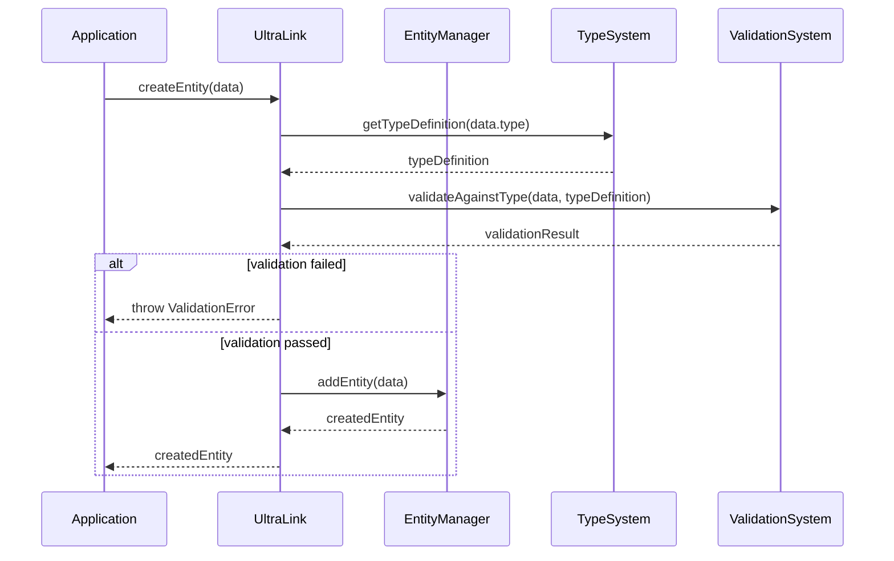
```mermaid
sequenceDiagram
    participant App as Application
    participant UL as UltraLink
    participant EM as EntityManager
    participant TS as TypeSystem
    participant VS as ValidationSystem
    
    App->>UL: createEntity(data)
    UL->>TS: getTypeDefinition(data.type)
    TS-->>UL: typeDefinition
    UL->>VS: validateAgainstType(data, typeDefinition)
    VS-->>UL: validationResult
    
    alt validation failed
        UL-->>App: throw ValidationError
    else validation passed
        UL->>EM: addEntity(data)
        EM-->>UL: createdEntity
        UL-->>App: createdEntity
    end
```

### Relationship Management Pattern

Pattern for creating and managing relationships between entities:

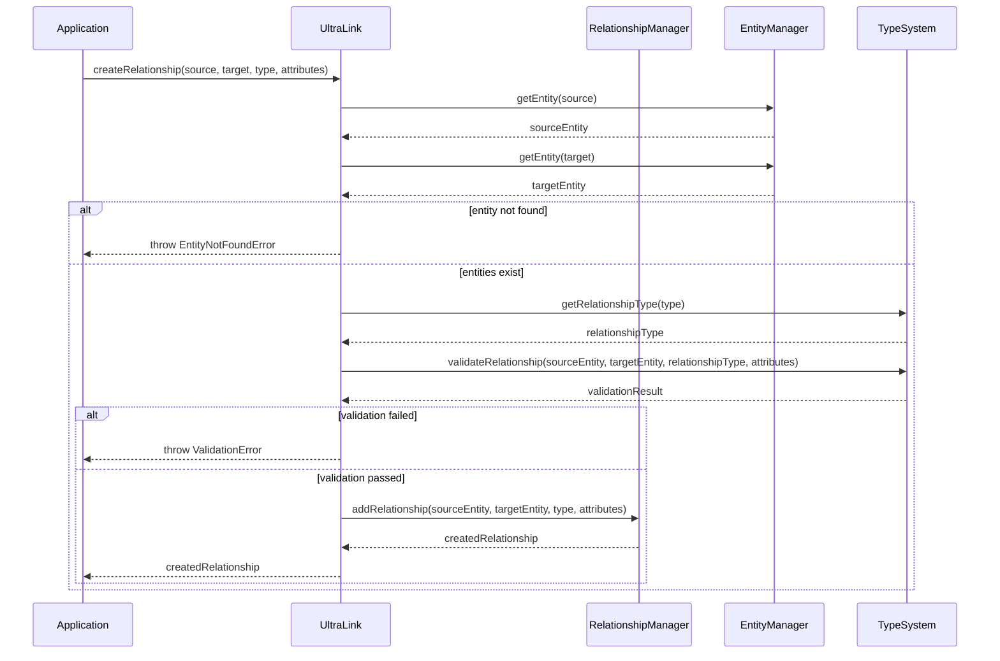
```mermaid
sequenceDiagram
    participant App as Application
    participant UL as UltraLink
    participant RM as RelationshipManager
    participant EM as EntityManager
    participant TS as TypeSystem
    
    App->>UL: createRelationship(source, target, type, attributes)
    UL->>EM: getEntity(source)
    EM-->>UL: sourceEntity
    UL->>EM: getEntity(target)
    EM-->>UL: targetEntity
    
    alt entity not found
        UL-->>App: throw EntityNotFoundError
    else entities exist
        UL->>TS: getRelationshipType(type)
        TS-->>UL: relationshipType
        UL->>TS: validateRelationship(sourceEntity, targetEntity, relationshipType, attributes)
        TS-->>UL: validationResult
        
        alt validation failed
            UL-->>App: throw ValidationError
        else validation passed
            UL->>RM: addRelationship(sourceEntity, targetEntity, type, attributes)
            RM-->>UL: createdRelationship
            UL-->>App: createdRelationship
        end
    end
```

### Query Pattern

Standard pattern for executing queries:

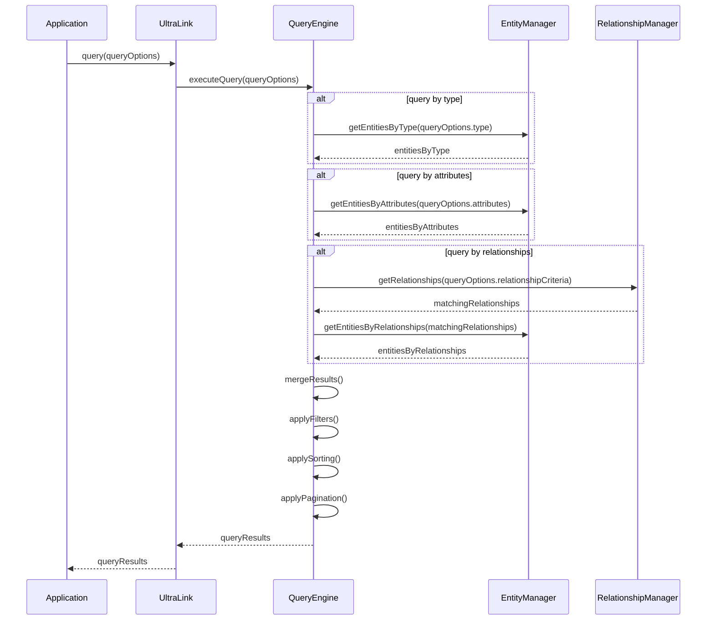
```mermaid
sequenceDiagram
    participant App as Application
    participant UL as UltraLink
    participant QE as QueryEngine
    participant EM as EntityManager
    participant RM as RelationshipManager
    
    App->>UL: query(queryOptions)
    UL->>QE: executeQuery(queryOptions)
    
    alt query by type
        QE->>EM: getEntitiesByType(queryOptions.type)
        EM-->>QE: entitiesByType
    end
    
    alt query by attributes
        QE->>EM: getEntitiesByAttributes(queryOptions.attributes)
        EM-->>QE: entitiesByAttributes
    end
    
    alt query by relationships
        QE->>RM: getRelationships(queryOptions.relationshipCriteria)
        RM-->>QE: matchingRelationships
        QE->>EM: getEntitiesByRelationships(matchingRelationships)
        EM-->>QE: entitiesByRelationships
    end
    
    QE->>QE: mergeResults()
    QE->>QE: applyFilters()
    QE->>QE: applySorting()
    QE->>QE: applyPagination()
    
    QE-->>UL: queryResults
    UL-->>App: queryResults
```

## Advanced Patterns

### Vector Search Pattern

Pattern for similarity search using vector embeddings:

```mermaid
flowchart TD
    Start([Begin Search]) --> InputType{Input Type}
    
    InputType -->|Text| TextProcess[Process Text Input]
    InputType -->|Entity| EntityProcess[Process Entity Input]
    
    TextProcess --> TextEmbed[Generate Text Embedding]
    EntityProcess --> EntityCheck{Has Vector?}
    
    EntityCheck -->|Yes| UseExisting[Use Existing Vector]
    EntityCheck -->|No| GenerateNew[Generate New Vector]
    GenerateNew --> UseExisting
    
    TextEmbed --> SimilaritySearch[Perform Similarity Search]
    UseExisting --> SimilaritySearch
    
    SimilaritySearch --> FilterByType[Filter By Entity Type]
    FilterByType --> ApplyThreshold[Apply Similarity Threshold]
    ApplyThreshold --> LimitResults[Limit Results]
    LimitResults --> End([Return Results])
    
    classDef start fill:#22c55e,stroke:#22c55e,color:white
    classDef process fill:#3b82f6,stroke:#3b82f6,color:white
    classDef decision fill:#8b5cf6,stroke:#8b5cf6,color:white
    classDef end fill:#f59e0b,stroke:#f59e0b,color:#333
    
    class Start start
    class TextProcess,TextEmbed,GenerateNew,UseExisting,SimilaritySearch,FilterByType,ApplyThreshold,LimitResults process
    class InputType,EntityCheck decision
    class End end
```

### Type Hierarchy Pattern

Pattern for implementing and using type hierarchies:

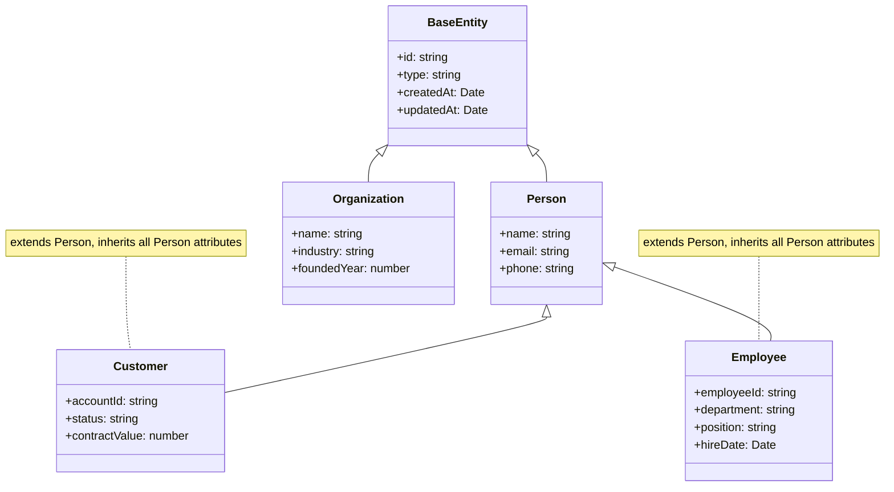
```mermaid
classDiagram
    class BaseEntity {
        +id: string
        +type: string
        +createdAt: Date
        +updatedAt: Date
    }
    
    class Person {
        +name: string
        +email: string
        +phone: string
    }
    
    class Organization {
        +name: string
        +industry: string
        +foundedYear: number
    }
    
    class Customer {
        +accountId: string
        +status: string
        +contractValue: number
    }
    
    class Employee {
        +employeeId: string
        +department: string
        +position: string
        +hireDate: Date
    }
    
    BaseEntity <|-- Person
    BaseEntity <|-- Organization
    Person <|-- Customer
    Person <|-- Employee
    
    note for Customer "extends Person, inherits all Person attributes"
    note for Employee "extends Person, inherits all Person attributes"
```

Implementation example:

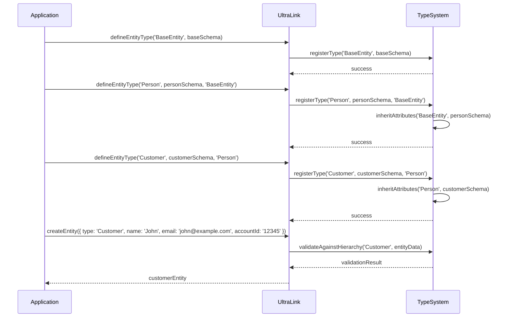
```mermaid
sequenceDiagram
    participant App as Application
    participant UL as UltraLink
    participant TS as TypeSystem
    
    App->>UL: defineEntityType('BaseEntity', baseSchema)
    UL->>TS: registerType('BaseEntity', baseSchema)
    TS-->>UL: success
    
    App->>UL: defineEntityType('Person', personSchema, 'BaseEntity')
    UL->>TS: registerType('Person', personSchema, 'BaseEntity')
    TS->>TS: inheritAttributes('BaseEntity', personSchema)
    TS-->>UL: success
    
    App->>UL: defineEntityType('Customer', customerSchema, 'Person')
    UL->>TS: registerType('Customer', customerSchema, 'Person')
    TS->>TS: inheritAttributes('Person', customerSchema)
    TS-->>UL: success
    
    App->>UL: createEntity({ type: 'Customer', name: 'John', email: 'john@example.com', accountId: '12345' })
    UL->>TS: validateAgainstHierarchy('Customer', entityData)
    TS-->>UL: validationResult
    UL-->>App: customerEntity
```

### Temporal Query Pattern

Pattern for querying entities across time:

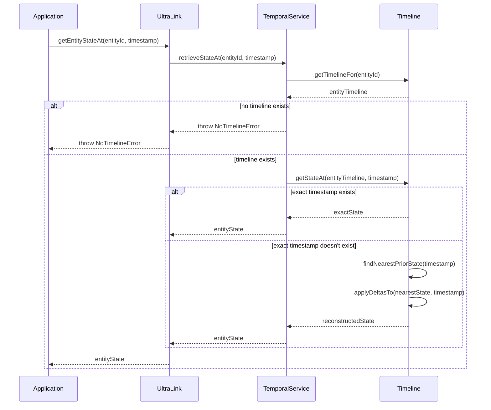
```mermaid
sequenceDiagram
    participant App as Application
    participant UL as UltraLink
    participant TS as TemporalService
    participant TL as Timeline
    
    App->>UL: getEntityStateAt(entityId, timestamp)
    UL->>TS: retrieveStateAt(entityId, timestamp)
    TS->>TL: getTimelineFor(entityId)
    TL-->>TS: entityTimeline
    
    alt no timeline exists
        TS-->>UL: throw NoTimelineError
        UL-->>App: throw NoTimelineError
    else timeline exists
        TS->>TL: getStateAt(entityTimeline, timestamp)
        
        alt exact timestamp exists
            TL-->>TS: exactState
            TS-->>UL: entityState
        else exact timestamp doesn't exist
            TL->>TL: findNearestPriorState(timestamp)
            TL->>TL: applyDeltasTo(nearestState, timestamp)
            TL-->>TS: reconstructedState
            TS-->>UL: entityState
        end
        
        UL-->>App: entityState
    end
```

### Change Tracking Pattern

Pattern for implementing change tracking:

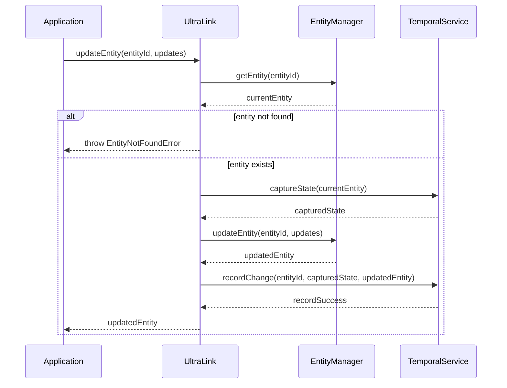
```mermaid
sequenceDiagram
    participant App as Application
    participant UL as UltraLink
    participant EM as EntityManager
    participant TS as TemporalService
    
    App->>UL: updateEntity(entityId, updates)
    UL->>EM: getEntity(entityId)
    EM-->>UL: currentEntity
    
    alt entity not found
        UL-->>App: throw EntityNotFoundError
    else entity exists
        UL->>TS: captureState(currentEntity)
        TS-->>UL: capturedState
        
        UL->>EM: updateEntity(entityId, updates)
        EM-->>UL: updatedEntity
        
        UL->>TS: recordChange(entityId, capturedState, updatedEntity)
        TS-->>UL: recordSuccess
        
        UL-->>App: updatedEntity
    end
```

## Integration Patterns

### External Data Import Pattern

Pattern for importing data from external systems:

```mermaid
flowchart TD
    Start([Begin Import]) --> ConfigSource[Configure Source]
    ConfigSource --> FetchData[Fetch External Data]
    FetchData --> Validate{Validate Data}
    
    Validate -->|Invalid| LogErrors[Log Validation Errors]
    LogErrors --> ErrorHandling{Error Handling}
    
    ErrorHandling -->|Skip| ContinueImport[Continue Import]
    ErrorHandling -->|Abort| End([End with Error])
    
    Validate -->|Valid| Transform[Transform to UltraLink Format]
    ContinueImport --> Transform
    
    Transform --> TypeMap{Entity Type Mapping}
    TypeMap -->|New Types| DefineTypes[Define New Types]
    TypeMap -->|Existing Types| UseExisting[Use Existing Types]
    
    DefineTypes --> ImportEntities[Import Entities]
    UseExisting --> ImportEntities
    
    ImportEntities --> RelationshipMap[Map Relationships]
    RelationshipMap --> ImportRelationships[Import Relationships]
    ImportRelationships --> LogResults[Log Import Results]
    LogResults --> End2([Import Complete])
    
    classDef start fill:#22c55e,stroke:#22c55e,color:white
    classDef process fill:#3b82f6,stroke:#3b82f6,color:white
    classDef decision fill:#8b5cf6,stroke:#8b5cf6,color:white
    classDef error fill:#ef4444,stroke:#ef4444,color:white
    classDef end fill:#f59e0b,stroke:#f59e0b,color:#333
    
    class Start start
    class ConfigSource,FetchData,LogErrors,Transform,DefineTypes,UseExisting,ImportEntities,RelationshipMap,ImportRelationships,LogResults process
    class Validate,ErrorHandling,TypeMap decision
    class End,End2 end
```

### Export Pattern

Pattern for exporting data to external systems:

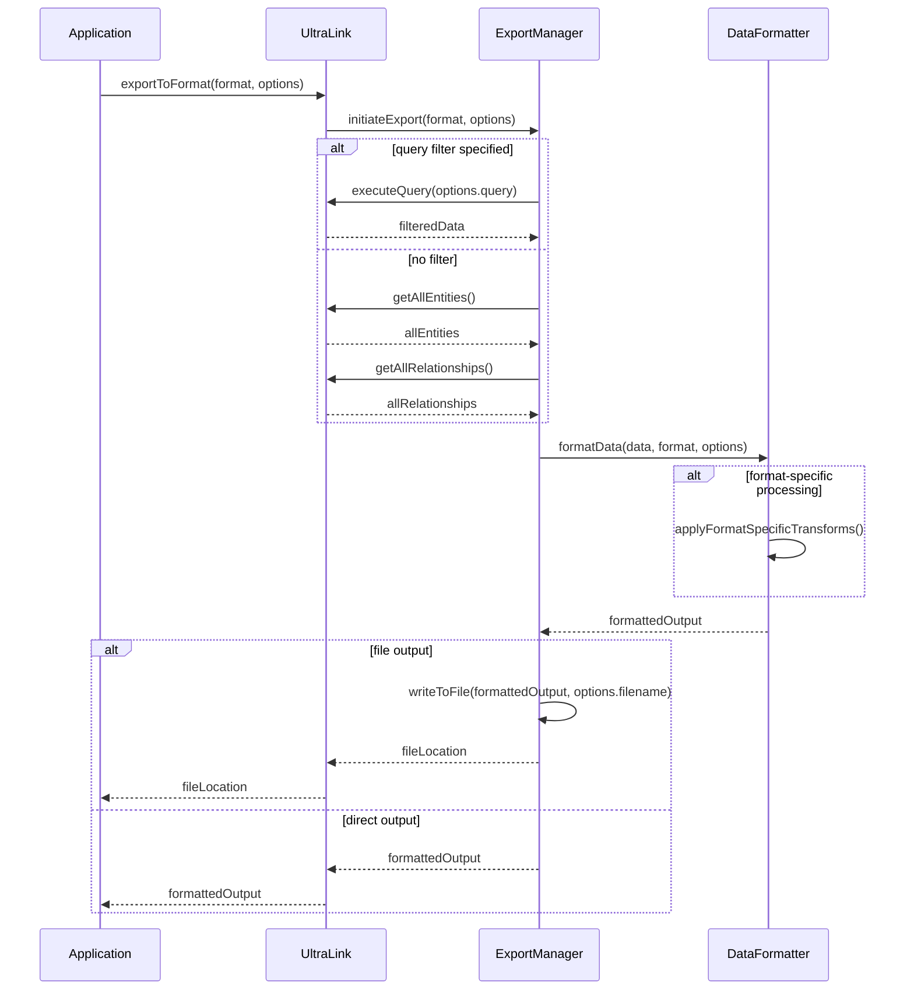
```mermaid
sequenceDiagram
    participant App as Application
    participant UL as UltraLink
    participant EM as ExportManager
    participant DF as DataFormatter
    
    App->>UL: exportToFormat(format, options)
    UL->>EM: initiateExport(format, options)
    
    alt query filter specified
        EM->>UL: executeQuery(options.query)
        UL-->>EM: filteredData
    else no filter
        EM->>UL: getAllEntities()
        UL-->>EM: allEntities
        EM->>UL: getAllRelationships()
        UL-->>EM: allRelationships
    end
    
    EM->>DF: formatData(data, format, options)
    
    alt format-specific processing
        DF->>DF: applyFormatSpecificTransforms()
    end
    
    DF-->>EM: formattedOutput
    
    alt file output
        EM->>EM: writeToFile(formattedOutput, options.filename)
        EM-->>UL: fileLocation
        UL-->>App: fileLocation
    else direct output
        EM-->>UL: formattedOutput
        UL-->>App: formattedOutput
    end
```

## Application Patterns

### Knowledge Graph Pattern

Pattern for implementing a knowledge graph:

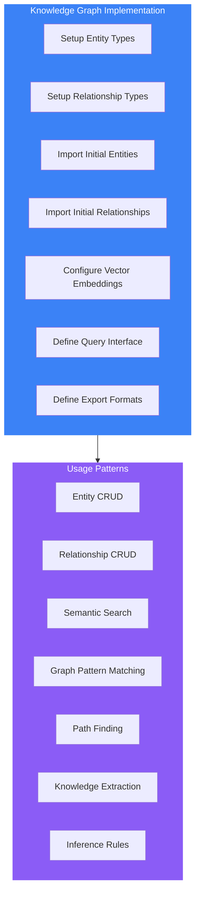
```mermaid
flowchart TD
    subgraph KnowledgeGraph["Knowledge Graph Implementation"]
        TypeSetup[Setup Entity Types]
        RelSetup[Setup Relationship Types]
        
        EntityImport[Import Initial Entities]
        RelationshipImport[Import Initial Relationships]
        
        VectorSetup[Configure Vector Embeddings]
        
        QueryInterface[Define Query Interface]
        
        ExportMechanism[Define Export Formats]
    end
    
    subgraph Usage["Usage Patterns"]
        EntityManagement[Entity CRUD]
        RelationshipManagement[Relationship CRUD]
        
        SemanticSearch[Semantic Search]
        PatternMatching[Graph Pattern Matching]
        PathFinding[Path Finding]
        
        KnowledgeExtraction[Knowledge Extraction]
        Inference[Inference Rules]
    end
    
    KnowledgeGraph --> Usage
    
    classDef kg fill:#3b82f6,stroke:#3b82f6,color:white
    classDef usage fill:#8b5cf6,stroke:#8b5cf6,color:white
    
    class KnowledgeGraph kg
    class Usage usage
```

Implementation example:

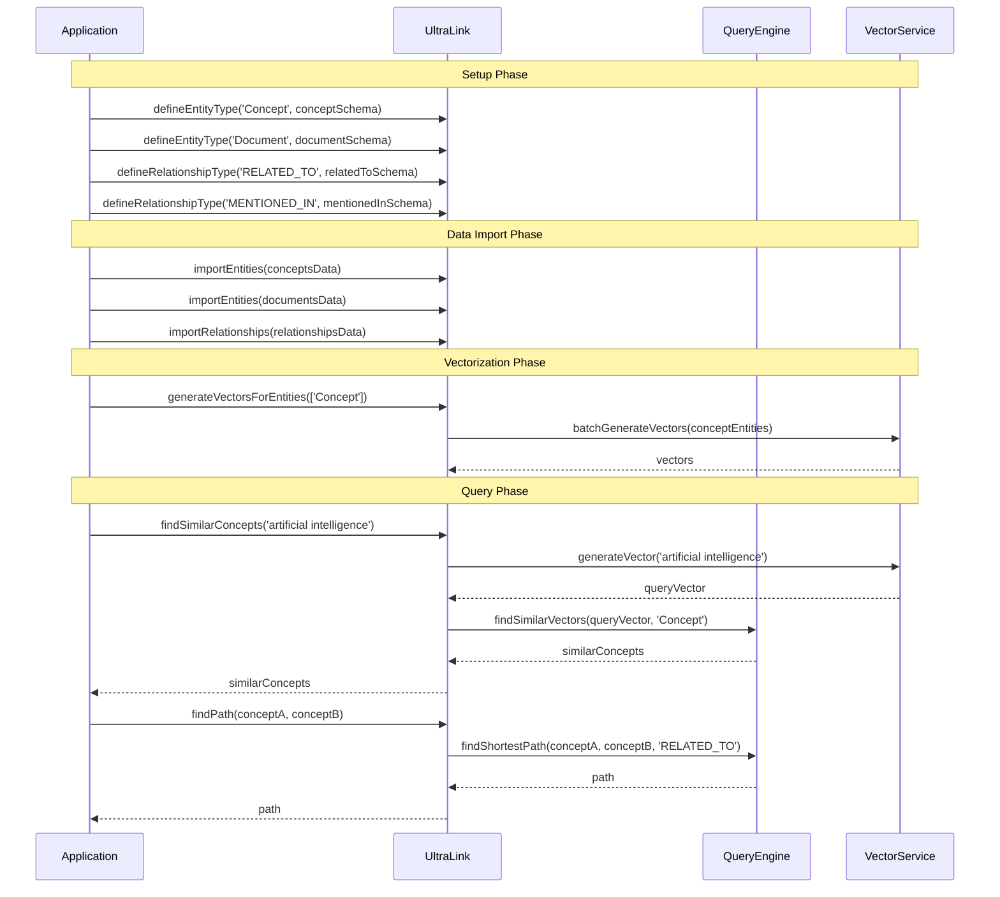
```mermaid
sequenceDiagram
    participant App as Application
    participant UL as UltraLink
    participant QE as QueryEngine
    participant VS as VectorService
    
    Note over App,VS: Setup Phase
    App->>UL: defineEntityType('Concept', conceptSchema)
    App->>UL: defineEntityType('Document', documentSchema)
    App->>UL: defineRelationshipType('RELATED_TO', relatedToSchema)
    App->>UL: defineRelationshipType('MENTIONED_IN', mentionedInSchema)
    
    Note over App,VS: Data Import Phase
    App->>UL: importEntities(conceptsData)
    App->>UL: importEntities(documentsData)
    App->>UL: importRelationships(relationshipsData)
    
    Note over App,VS: Vectorization Phase
    App->>UL: generateVectorsForEntities(['Concept'])
    UL->>VS: batchGenerateVectors(conceptEntities)
    VS-->>UL: vectors
    
    Note over App,VS: Query Phase
    App->>UL: findSimilarConcepts('artificial intelligence')
    UL->>VS: generateVector('artificial intelligence')
    VS-->>UL: queryVector
    UL->>QE: findSimilarVectors(queryVector, 'Concept')
    QE-->>UL: similarConcepts
    UL-->>App: similarConcepts
    
    App->>UL: findPath(conceptA, conceptB)
    UL->>QE: findShortestPath(conceptA, conceptB, 'RELATED_TO')
    QE-->>UL: path
    UL-->>App: path
```

### Document Management Pattern

Pattern for managing documents and their relationships:

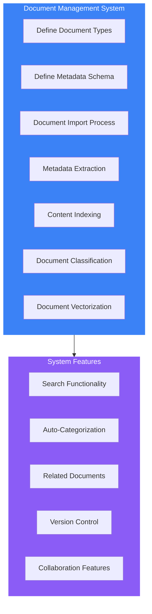
```mermaid
flowchart TD
    subgraph DocumentSystem["Document Management System"]
        DocumentTypes[Define Document Types]
        MetadataSchema[Define Metadata Schema]
        
        DocumentImport[Document Import Process]
        MetadataExtraction[Metadata Extraction]
        ContentIndexing[Content Indexing]
        
        Classification[Document Classification]
        Vectorization[Document Vectorization]
    end
    
    subgraph Features["System Features"]
        Search[Search Functionality]
        Categorization[Auto-Categorization]
        RelatedDocs[Related Documents]
        
        VersionControl[Version Control]
        CollabFeatures[Collaboration Features]
    end
    
    DocumentSystem --> Features
    
    classDef ds fill:#3b82f6,stroke:#3b82f6,color:white
    classDef ft fill:#8b5cf6,stroke:#8b5cf6,color:white
    
    class DocumentSystem ds
    class Features ft
```

Implementation example:

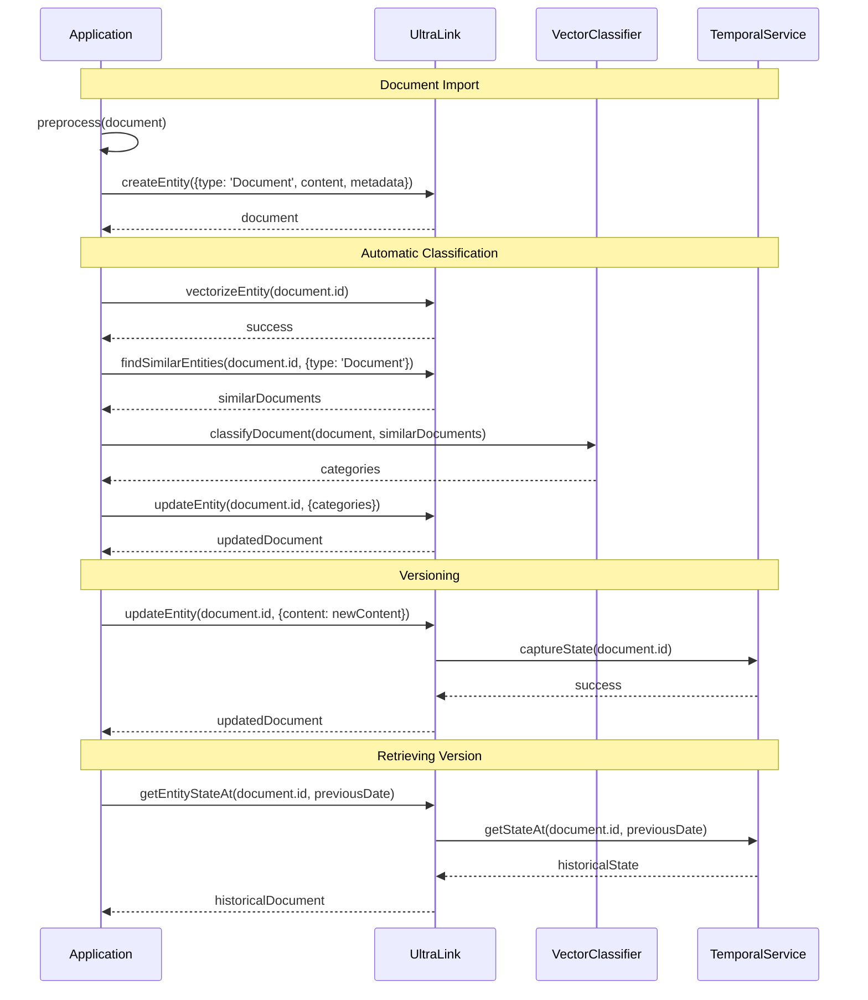
```mermaid
sequenceDiagram
    participant App as Application
    participant UL as UltraLink
    participant VC as VectorClassifier
    participant TS as TemporalService
    
    Note over App,TS: Document Import
    App->>App: preprocess(document)
    App->>UL: createEntity({type: 'Document', content, metadata})
    UL-->>App: document
    
    Note over App,TS: Automatic Classification
    App->>UL: vectorizeEntity(document.id)
    UL-->>App: success
    App->>UL: findSimilarEntities(document.id, {type: 'Document'})
    UL-->>App: similarDocuments
    
    App->>VC: classifyDocument(document, similarDocuments)
    VC-->>App: categories
    
    App->>UL: updateEntity(document.id, {categories})
    UL-->>App: updatedDocument
    
    Note over App,TS: Versioning
    App->>UL: updateEntity(document.id, {content: newContent})
    UL->>TS: captureState(document.id)
    TS-->>UL: success
    UL-->>App: updatedDocument
    
    Note over App,TS: Retrieving Version
    App->>UL: getEntityStateAt(document.id, previousDate)
    UL->>TS: getStateAt(document.id, previousDate)
    TS-->>UL: historicalState
    UL-->>App: historicalDocument
```

### Customer 360 Pattern

Pattern for implementing a customer 360 view:

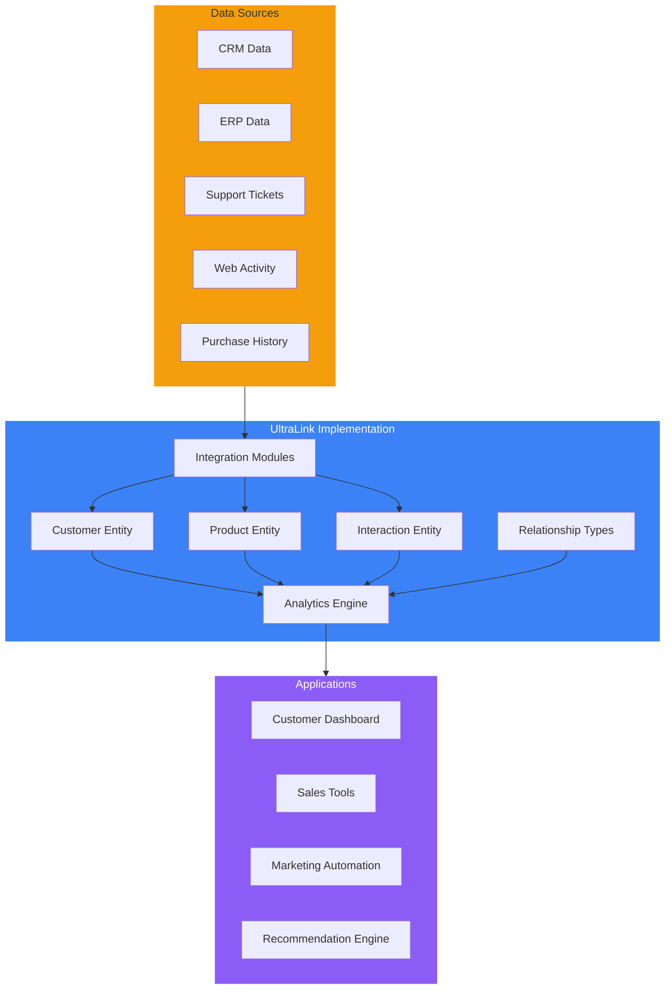
```mermaid
flowchart TD
    subgraph DataSources["Data Sources"]
        CRM["CRM Data"]
        ERP["ERP Data"]
        Support["Support Tickets"]
        WebActivity["Web Activity"]
        PurchaseHistory["Purchase History"]
    end
    
    subgraph UltraLinkSystem["UltraLink Implementation"]
        CustomerEntity["Customer Entity"]
        ProductEntity["Product Entity"]
        InteractionEntity["Interaction Entity"]
        
        Relationships["Relationship Types"]
        
        IntegrationModules["Integration Modules"]
        AnalyticsEngine["Analytics Engine"]
    end
    
    subgraph Applications["Applications"]
        CustomerDashboard["Customer Dashboard"]
        SalesTools["Sales Tools"]
        MarketingAutomation["Marketing Automation"]
        RecommendationEngine["Recommendation Engine"]
    end
    
    DataSources --> IntegrationModules
    IntegrationModules --> CustomerEntity
    IntegrationModules --> ProductEntity
    IntegrationModules --> InteractionEntity
    CustomerEntity --> AnalyticsEngine
    ProductEntity --> AnalyticsEngine
    InteractionEntity --> AnalyticsEngine
    Relationships --> AnalyticsEngine
    AnalyticsEngine --> Applications
    
    classDef source fill:#f59e0b,stroke:#f59e0b,color:#333
    classDef system fill:#3b82f6,stroke:#3b82f6,color:white
    classDef app fill:#8b5cf6,stroke:#8b5cf6,color:white
    
    class DataSources source
    class UltraLinkSystem system
    class Applications app
```

Implementation example:

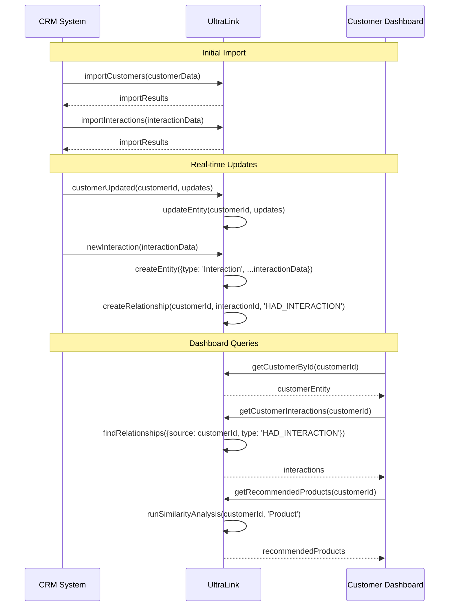
```mermaid
sequenceDiagram
    participant CRM as CRM System
    participant UL as UltraLink
    participant Dashboard as Customer Dashboard
    
    Note over CRM,Dashboard: Initial Import
    CRM->>UL: importCustomers(customerData)
    UL-->>CRM: importResults
    
    CRM->>UL: importInteractions(interactionData)
    UL-->>CRM: importResults
    
    Note over CRM,Dashboard: Real-time Updates
    CRM->>UL: customerUpdated(customerId, updates)
    UL->>UL: updateEntity(customerId, updates)
    
    CRM->>UL: newInteraction(interactionData)
    UL->>UL: createEntity({type: 'Interaction', ...interactionData})
    UL->>UL: createRelationship(customerId, interactionId, 'HAD_INTERACTION')
    
    Note over CRM,Dashboard: Dashboard Queries
    Dashboard->>UL: getCustomerById(customerId)
    UL-->>Dashboard: customerEntity
    
    Dashboard->>UL: getCustomerInteractions(customerId)
    UL->>UL: findRelationships({source: customerId, type: 'HAD_INTERACTION'})
    UL-->>Dashboard: interactions
    
    Dashboard->>UL: getRecommendedProducts(customerId)
    UL->>UL: runSimilarityAnalysis(customerId, 'Product')
    UL-->>Dashboard: recommendedProducts
```

## Performance Patterns

### Bulk Operations Pattern

Pattern for efficient bulk operations:

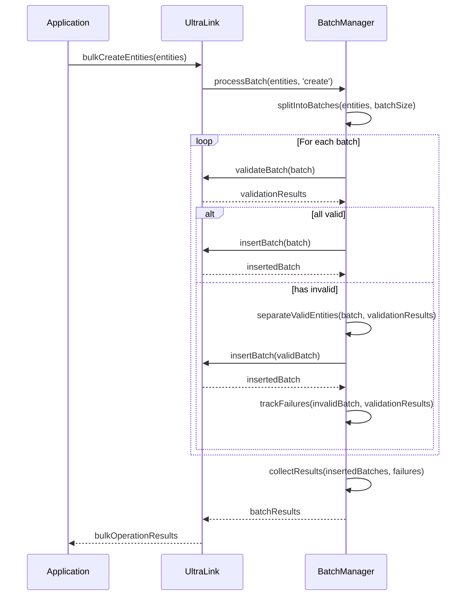
```mermaid
sequenceDiagram
    participant App as Application
    participant UL as UltraLink
    participant BM as BatchManager
    
    App->>UL: bulkCreateEntities(entities)
    UL->>BM: processBatch(entities, 'create')
    
    BM->>BM: splitIntoBatches(entities, batchSize)
    
    loop For each batch
        BM->>UL: validateBatch(batch)
        UL-->>BM: validationResults
        
        alt all valid
            BM->>UL: insertBatch(batch)
            UL-->>BM: insertedBatch
        else has invalid
            BM->>BM: separateValidEntities(batch, validationResults)
            BM->>UL: insertBatch(validBatch)
            UL-->>BM: insertedBatch
            BM->>BM: trackFailures(invalidBatch, validationResults)
        end
    end
    
    BM->>BM: collectResults(insertedBatches, failures)
    BM-->>UL: batchResults
    UL-->>App: bulkOperationResults
```

### Caching Pattern

Pattern for implementing effective caching:

```mermaid
flowchart TD
    Start([Query Request]) --> CacheCheck{Check Cache}
    
    CacheCheck -->|Cache Hit| RetrieveFromCache[Retrieve from Cache]
    CacheCheck -->|Cache Miss| ExecuteQuery[Execute Query]
    
    RetrieveFromCache --> ValidateCache{Cache Valid?}
    ValidateCache -->|Yes| ReturnCached[Return Cached Results]
    ValidateCache -->|No| ExecuteQuery
    
    ExecuteQuery --> StoreInCache[Store in Cache]
    StoreInCache --> SetTTL[Set Time-to-Live]
    SetTTL --> ReturnFresh[Return Fresh Results]
    
    ReturnCached --> End([Return Results])
    ReturnFresh --> End
    
    classDef start fill:#22c55e,stroke:#22c55e,color:white
    classDef process fill:#3b82f6,stroke:#3b82f6,color:white
    classDef decision fill:#8b5cf6,stroke:#8b5cf6,color:white
    classDef end fill:#f59e0b,stroke:#f59e0b,color:#333
    
    class Start start
    class RetrieveFromCache,ExecuteQuery,StoreInCache,SetTTL,ReturnCached,ReturnFresh process
    class CacheCheck,ValidateCache decision
    class End end
```

Implementation example:

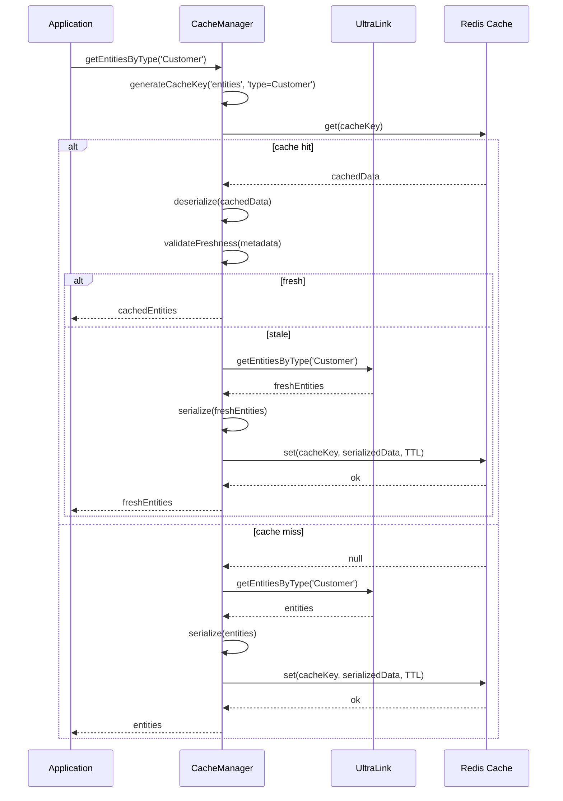
```mermaid
sequenceDiagram
    participant App as Application
    participant CM as CacheManager
    participant UL as UltraLink
    participant Redis as Redis Cache
    
    App->>CM: getEntitiesByType('Customer')
    CM->>CM: generateCacheKey('entities', 'type=Customer')
    CM->>Redis: get(cacheKey)
    
    alt cache hit
        Redis-->>CM: cachedData
        CM->>CM: deserialize(cachedData)
        CM->>CM: validateFreshness(metadata)
        
        alt fresh
            CM-->>App: cachedEntities
        else stale
            CM->>UL: getEntitiesByType('Customer')
            UL-->>CM: freshEntities
            CM->>CM: serialize(freshEntities)
            CM->>Redis: set(cacheKey, serializedData, TTL)
            Redis-->>CM: ok
            CM-->>App: freshEntities
        end
    else cache miss
        Redis-->>CM: null
        CM->>UL: getEntitiesByType('Customer')
        UL-->>CM: entities
        CM->>CM: serialize(entities)
        CM->>Redis: set(cacheKey, serializedData, TTL)
        Redis-->>CM: ok
        CM-->>App: entities
    end
```

## Visualization Patterns

### Interactive Graph Visualization Pattern

Pattern for creating interactive graph visualizations:

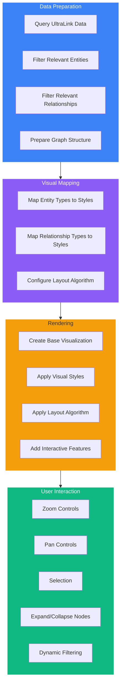
```mermaid
flowchart TD
    subgraph DataPreparation["Data Preparation"]
        QueryData[Query UltraLink Data]
        FilterEntities[Filter Relevant Entities]
        FilterRelationships[Filter Relevant Relationships]
        PrepareStructure[Prepare Graph Structure]
    end
    
    subgraph VisualMapping["Visual Mapping"]
        EntityStyles[Map Entity Types to Styles]
        RelationshipStyles[Map Relationship Types to Styles]
        LayoutConfig[Configure Layout Algorithm]
    end
    
    subgraph Rendering["Rendering"]
        CreateVisualization[Create Base Visualization]
        ApplyStyles[Apply Visual Styles]
        ApplyLayout[Apply Layout Algorithm]
        AddInteractivity[Add Interactive Features]
    end
    
    subgraph Interaction["User Interaction"]
        Zoom[Zoom Controls]
        Pan[Pan Controls]
        Select[Selection]
        Expand[Expand/Collapse Nodes]
        Filter[Dynamic Filtering]
    end
    
    DataPreparation --> VisualMapping
    VisualMapping --> Rendering
    Rendering --> Interaction
    
    classDef prep fill:#3b82f6,stroke:#3b82f6,color:white
    classDef map fill:#8b5cf6,stroke:#8b5cf6,color:white
    classDef render fill:#f59e0b,stroke:#f59e0b,color:#333
    classDef interact fill:#10b981,stroke:#10b981,color:white
    
    class DataPreparation prep
    class VisualMapping map
    class Rendering render
    class Interaction interact
```

Implementation example:

```mermaid
sequenceDiagram
    participant App as Web Application
    participant UL as UltraLink
    participant VE as VisualizationEngine
    
    App->>UL: getEntitiesByTypes(['Person', 'Organization'])
    UL-->>App: entities
    
    App->>UL: getRelationshipsByTypes(['WORKS_FOR', 'MANAGES'])
    UL-->>App: relationships
    
    App->>VE: createVisualization(entities, relationships)
    VE->>VE: prepareGraphStructure(entities, relationships)
    VE->>VE: applyEntityStyles(entityStyleMap)
    VE->>VE: applyRelationshipStyles(relationshipStyleMap)
    VE->>VE: applyForceLayout()
    
    VE-->>App: visualization
    
    App->>App: renderVisualization(visualization)
    
    Note over App,VE: User Interaction
    App->>VE: handleNodeClick(nodeId)
    VE->>UL: getEntity(nodeId)
    UL-->>VE: entityDetails
    VE->>VE: showEntityDetails(entityDetails)
    VE-->>App: updatedView
    
    App->>VE: expandNode(nodeId)
    VE->>UL: getRelatedEntities(nodeId)
    UL-->>VE: relatedEntities
    VE->>VE: addToVisualization(relatedEntities)
    VE->>VE: reapplyLayout()
    VE-->>App: updatedVisualization
```

## Data Analysis Patterns

### Analytics Pattern

Pattern for implementing analytics on UltraLink data:

```mermaid
flowchart TD
    subgraph DataExtraction["Data Extraction"]
        QueryData[Extract Raw Data]
        Aggregation[Perform Aggregations]
        Transformation[Transform Data]
    end
    
    subgraph Analysis["Analysis"]
        Statistics[Statistical Analysis]
        NetworkAnalysis[Network Analysis]
        PatternDetection[Pattern Detection]
        Clustering[Clustering Analysis]
    end
    
    subgraph Visualization["Visualization"]
        Charts[Create Charts]
        Dashboards[Build Dashboards]
        Reports[Generate Reports]
    end
    
    DataExtraction --> Analysis
    Analysis --> Visualization
    
    classDef extract fill:#3b82f6,stroke:#3b82f6,color:white
    classDef analyze fill:#8b5cf6,stroke:#8b5cf6,color:white
    classDef visualize fill:#f59e0b,stroke:#f59e0b,color:#333
    
    class DataExtraction extract
    class Analysis analyze
    class Visualization visualize
```

Implementation example:

```mermaid
sequenceDiagram
    participant App as Analytics Application
    participant UL as UltraLink
    participant AM as AnalyticsModule
    participant DB as Analytics Database
    
    App->>AM: initiateAnalysis('customer_engagement')
    AM->>UL: getEntitiesByType('Customer')
    UL-->>AM: customers
    
    AM->>UL: getEntitiesByType('Interaction')
    UL-->>AM: interactions
    
    AM->>UL: getRelationshipsByType('HAD_INTERACTION')
    UL-->>AM: customerInteractions
    
    AM->>AM: preprocessData(customers, interactions, customerInteractions)
    AM->>DB: storeAnalyticsData(processedData)
    DB-->>AM: success
    
    AM->>AM: performAnalysis('engagement_metrics')
    AM->>AM: generateReports()
    AM->>AM: createVisualizations()
    
    AM-->>App: analysisResults
    App->>App: displayDashboard(analysisResults)
```

---

These implementation patterns provide a structured approach to using UltraLink for various common scenarios. The patterns demonstrate not only how to implement specific features, but also how to combine UltraLink's capabilities to build comprehensive solutions. By following these patterns, developers can ensure they are using UltraLink effectively and according to best practices. 