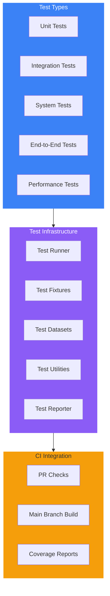
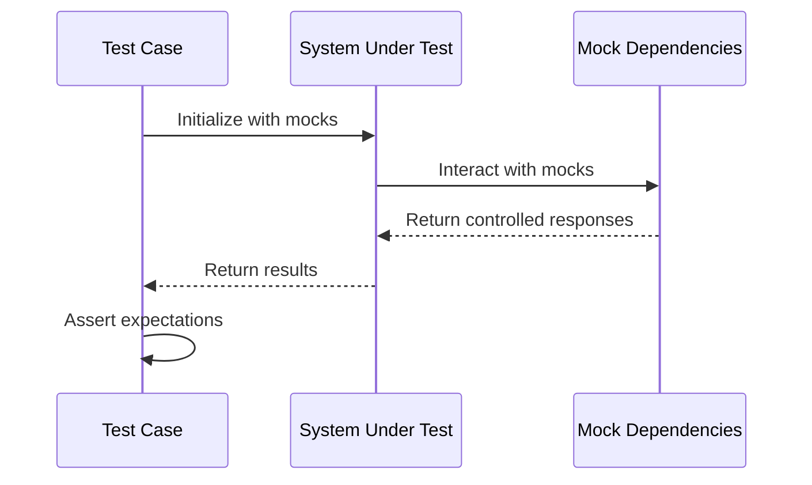
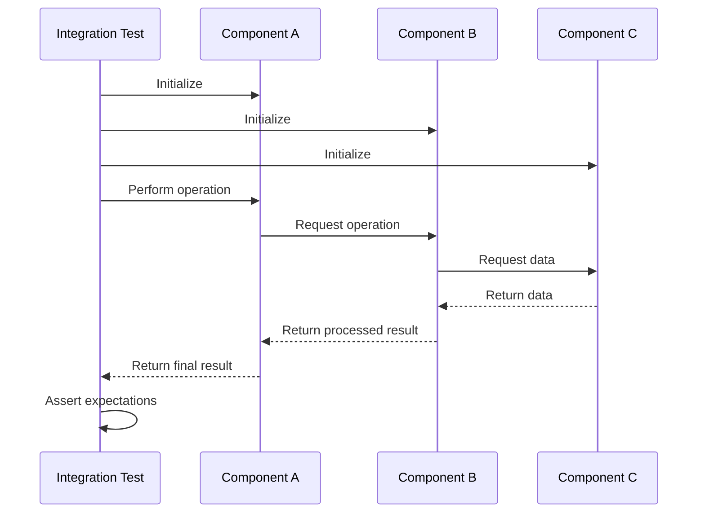
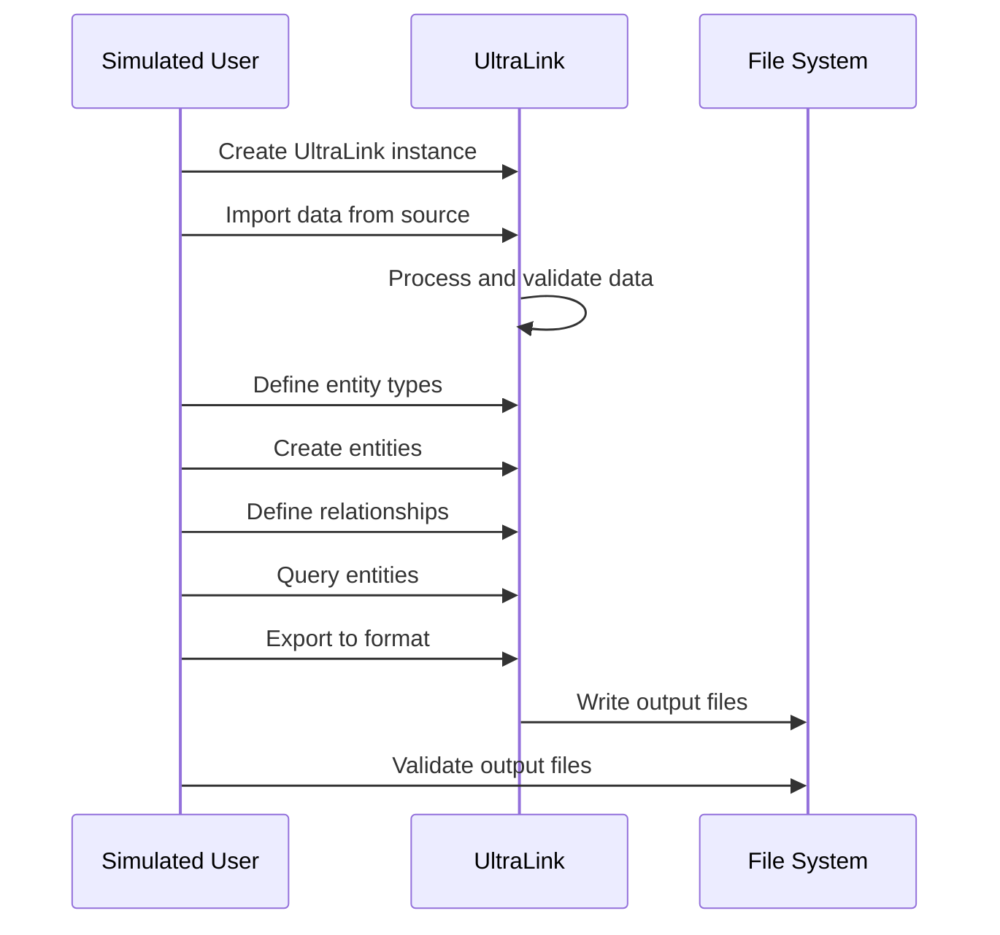
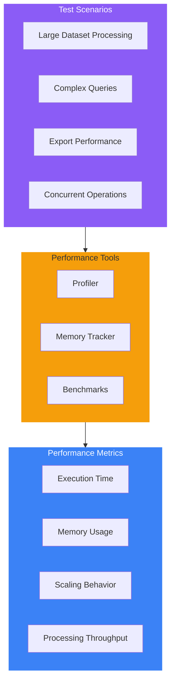
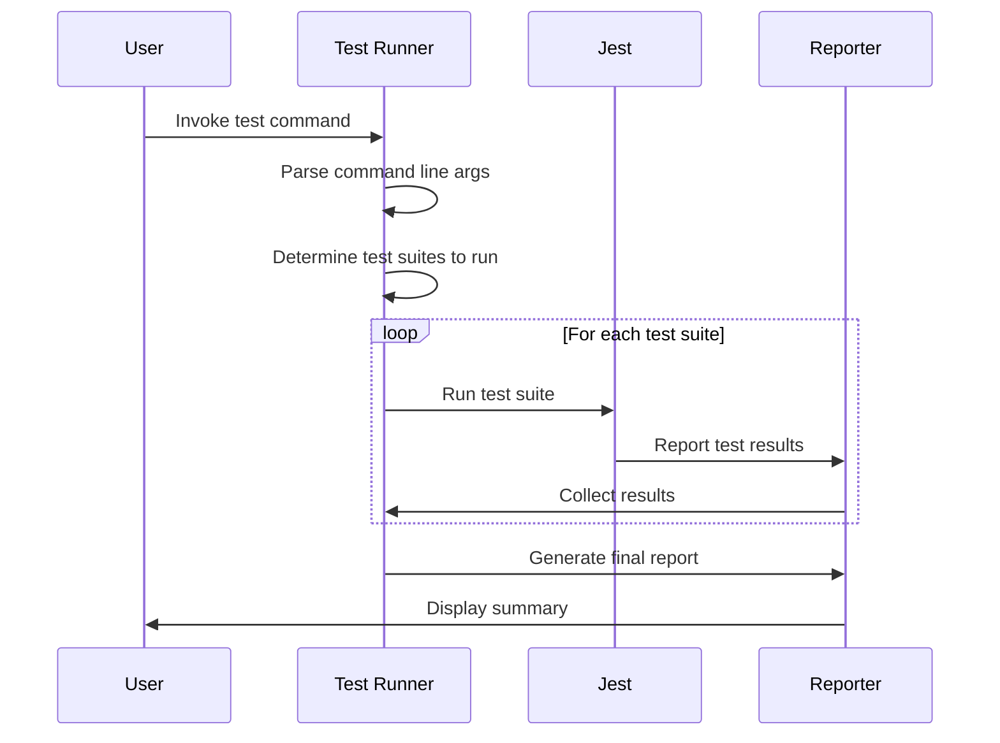

# UltraLink Testing Documentation

This document provides comprehensive details about the UltraLink testing framework, test suite organization, and implementation. It serves as a guide for understanding how UltraLink is tested and how to maintain and extend the test suite.

## Testing Philosophy

UltraLink's testing philosophy is built on the following principles:

1. **Comprehensive Coverage**: Tests cover all aspects of the system
2. **Real-World Scenarios**: Tests reflect real-world usage patterns
3. **Performance Awareness**: Tests verify performance characteristics
4. **Maintainability**: Tests are easy to maintain and understand
5. **Documentation**: Tests serve as living documentation of system behavior

## Test Suite Organization

The UltraLink testing framework is organized into several layers, with each layer focusing on specific aspects of the system:



### Directory Structure

```
/tests
├── unit/               # Unit tests
├── integration/        # Integration tests
├── system/             # System tests
├── e2e/                # End-to-end tests
├── performance/        # Performance tests
├── fixtures/           # Test fixtures
│   └── Systems/        # Sample systems for testing
├── utils/              # Test utilities
├── runners/            # Test runners
├── test-datasets/      # Test datasets
└── format-tests/       # Format-specific tests
```

## Test Types

### Unit Tests

Unit tests focus on individual components and classes in isolation. These tests verify that each unit of the system works correctly on its own.



Key unit test areas:
- Entity management
- Relationship management
- Data validation
- Utility functions
- Import/export functions

### Integration Tests

Integration tests verify that components work together correctly. These tests focus on the interaction between subsystems.



Key integration test areas:
- Parser integration with entity store
- Export functionality across formats
- Entity and relationship interactions
- Vector generation and search

### System Tests

System tests verify the behavior of the complete system, focusing on specific subsystems or features.

```mermaid
flowchart TD
    Start([Begin System Test])
    -->SetupEnvironment[Setup Test Environment]
    -->InitializeSystem[Initialize UltraLink System]
    -->LoadEntities[Load Test Entities]
    -->DefineRelationships[Define Relationships]
    -->ExecuteOperations[Execute System Operations]
    -->ExportData[Export to Various Formats]
    -->ValidateOutput[Validate Output]
    -->VerifyIntegrity[Verify System Integrity]
    -->End([End Test])
    
    classDef start fill:#22c55e,stroke:#22c55e,color:white
    classDef process fill:#3b82f6,stroke:#3b82f6,color:white
    classDef end fill:#f59e0b,stroke:#f59e0b,color:#333
    
    class Start start
    class SetupEnvironment,InitializeSystem,LoadEntities,DefineRelationships,ExecuteOperations,ExportData,ValidateOutput,VerifyIntegrity process
    class End end
```

Key system test areas:
- Full export system pipeline
- Rendering complex systems
- Format conversion
- System configuration options

### End-to-End (E2E) Tests

E2E tests simulate real-world usage of UltraLink from start to finish.



Key E2E test scenarios:
- Knowledge base creation and querying
- Database import and export
- Format conversion workflows
- Visualization generation

### Performance Tests

Performance tests verify the system's speed, resource usage, and scalability.



Key performance test areas:
- Memory usage during large dataset processing
- Processing time for various operations
- Scalability with increasing dataset size
- Export performance for different formats

## Running Tests

UltraLink uses a custom test runner built on top of Jest. The test runner provides detailed reporting and organized test execution.

### Test Commands

- `npm test`: Runs standard tests (excluding performance tests)
- `npm run test:all`: Runs all tests including performance tests
- `npm run test:performance`: Runs only performance tests
- `npm run test:help`: Shows help for the test runner

### Test Runner Implementation

The test runner (`tests/utils/run-tests.js`) organizes test execution in the following way:



## Test Fixtures and Datasets

UltraLink tests rely on a set of carefully designed fixtures and datasets to provide realistic testing scenarios.

### System Fixtures

The `tests/fixtures/Systems/` directory contains complete system definitions used for testing:

1. **ActiveInferenceLab**: A system modeling active inference concepts
2. **ResearchTeam**: A research team organization model 
3. **USAHistory**: A system modeling US historical events
4. **DesertEcosystem**: A biological ecosystem model
5. **HumanAnatomy**: A human anatomy model
6. **NeurofeedbackResearch**: A research field model
7. **Car**: An automotive system model
8. **POMDP**: A partially observable Markov decision process model

Each system fixture provides:
- Entity definitions
- Relationship definitions
- System metadata
- Expected outputs for various export formats

## Known Issues and Limitations

Based on test results, the following issues have been identified:

1. **Visualization Export Issues**: Some visualization formats (SVG, PNG, D3, Cytoscape) encounter formatting issues in certain system exports. These are handled gracefully with fallback mechanisms but should be addressed.

2. **System Export Tests**: The system export test suite shows failures related to visualization format outputs. The system creates fallback visualizations to ensure tests can proceed.

3. **Memory Leaks**: Some tests exhibit potential memory leaks, indicated by worker processes failing to exit gracefully. These should be addressed using the `--detectOpenHandles` flag with Jest.

4. **Test Coverage**: Overall code coverage is currently at around 50%, with some modules having lower coverage. Increasing test coverage should be prioritized for core components.

## Best Practices for Writing Tests

When writing tests for UltraLink, follow these guidelines:

1. **Isolation**: Unit tests should not depend on other units
2. **Completeness**: Test both happy paths and error conditions
3. **Readability**: Tests should be easy to read and understand
4. **Performance**: Tests should be efficient and fast-running
5. **Independence**: Tests should not depend on execution order

### Test Structure Example

```javascript
describe('Entity Manager', () => {
  // Setup code
  beforeEach(() => {
    // Initialize test environment
  });
  
  // Teardown code
  afterEach(() => {
    // Clean up test environment
  });
  
  describe('Entity Creation', () => {
    it('should create an entity with valid properties', () => {
      // Test code
    });
    
    it('should reject an entity with missing required properties', () => {
      // Test code
    });
  });
  
  describe('Entity Retrieval', () => {
    // More test cases
  });
});
```

## Continuous Integration

Tests are automatically run in CI for all pull requests and commits to the main branch. The CI pipeline:

1. Runs the unit tests
2. Runs the integration tests
3. Runs the system tests
4. Runs the E2E tests
5. Optionally runs performance tests
6. Generates coverage reports
7. Blocks PRs if tests fail

## Adding New Tests

When adding new functionality to UltraLink, follow these steps to ensure proper test coverage:

1. Add unit tests for new components or functions
2. Add or update integration tests for component interactions
3. Update system tests if the new functionality affects system-level behavior
4. Add E2E tests for new user workflows
5. Consider performance implications and add performance tests if needed

## Test Report Examples

### Sample Test Report Structure

```json
{
  "timestamp": "2025-03-18T14:12:02.526Z",
  "testSuites": [
    {
      "name": "Unit Tests",
      "command": "npx jest tests/unit",
      "required": true,
      "status": "passed",
      "output": "...",
      "error": null,
      "exitCode": 0
    },
    {
      "name": "Integration Tests",
      "command": "npx jest tests/integration",
      "required": true,
      "status": "passed",
      "output": "...",
      "error": null,
      "exitCode": 0
    },
    {
      "name": "System Export Tests",
      "command": "npx jest tests/system",
      "required": true,
      "status": "failed",
      "output": "...",
      "error": "One or more tests failed",
      "exitCode": 1
    },
    {
      "name": "End-to-End Tests",
      "command": "npx jest tests/e2e",
      "required": true,
      "status": "passed",
      "output": "...",
      "error": null,
      "exitCode": 0
    }
  ],
  "summary": {
    "total": 4,
    "passed": 3,
    "failed": 1,
    "skipped": 0
  }
}
```

## Future Improvements

The following improvements are planned for the testing infrastructure:

1. **Increased Code Coverage**: Target at least 80% code coverage for core components
2. **Automated Snapshot Testing**: Implement snapshot tests for export formats
3. **Visual Regression Testing**: Add tests for visual output comparison
4. **Performance Benchmarking**: Create baseline performance metrics and ensure new changes don't regress
5. **Improved Error Reporting**: Enhance error messages and diagnostic information
6. **Cross-platform Testing**: Ensure tests pass on all supported platforms
7. **Fix Visualization Export Issues**: Resolve the known issues with visualization exports

## Visualization Testing

### Overview
The visualization testing system ensures that UltraLink can generate visualizations in various formats while gracefully handling errors and providing meaningful feedback.

### Supported Formats
- SVG (Static vector graphics)
- PNG (Raster graphics)
- D3.js (Interactive JavaScript visualizations)
- Cytoscape (Interactive network visualizations)

### Test Process
1. **Format Validation**
   - Validates input format against supported formats
   - Checks format-specific requirements
   - Verifies output structure

2. **Content Generation**
   - Generates visualization content
   - Handles layout calculations
   - Applies styling and formatting

3. **Error Handling**
   - Catches and logs generation errors
   - Creates error files with details
   - Provides fallback content

4. **Output Validation**
   - Verifies file generation
   - Checks content structure
   - Validates format-specific requirements

### Error Handling
1. **Format Errors**
   - Invalid format specification
   - Unsupported format requests
   - Format-specific validation failures

2. **Generation Errors**
   - Layout calculation failures
   - Content generation issues
   - Resource limitations

3. **File System Errors**
   - Directory creation failures
   - File write errors
   - Permission issues

### Fallback Content
1. **HTML Formats (D3, Cytoscape)**
   ```html
   <div class="error-message">
     <h2>Visualization Generation Failed</h2>
     <p>The visualization could not be generated in the expected format.</p>
     <p>System: [System Name]</p>
     <p>Format: [Format Type]</p>
   </div>
   ```

2. **SVG Format**
   ```svg
   <svg xmlns="http://www.w3.org/2000/svg" width="800" height="600">
     <rect width="100%" height="100%" fill="#f8f9fa"/>
     <text x="50%" y="50%" text-anchor="middle" font-family="sans-serif" font-size="24" fill="#333">[System Name]</text>
     <text x="50%" y="52%" dy="1.2em" text-anchor="middle" font-family="sans-serif" font-size="14" fill="#666">Visualization Generation Failed</text>
     <text x="50%" y="54%" dy="1.2em" text-anchor="middle" font-family="sans-serif" font-size="12" fill="#999">Format: [Format Type]</text>
   </svg>
   ```

3. **PNG Format**
   - 1x1 transparent PNG as placeholder
   - Error message in separate text file

4. **Error Logs**
   - Detailed error messages
   - Stack traces when available
   - System context information

### Best Practices
1. **Test Coverage**
   - Test all supported formats
   - Include error scenarios
   - Verify fallback content
   - Check error logging

2. **Error Handling**
   - Catch specific error types
   - Provide meaningful messages
   - Generate appropriate fallbacks
   - Log detailed information

3. **Output Validation**
   - Verify file existence
   - Check content structure
   - Validate format requirements
   - Test error files

4. **Performance**
   - Monitor generation time
   - Check resource usage
   - Optimize large datasets
   - Handle timeouts

### Known Issues
1. **Format Validation**
   - Some formats may not match expected structure
   - Fallback content is provided
   - Error messages are logged

2. **Test Leaks**
   - Some tests may have open handles
   - Use `--detectOpenHandles` to identify
   - Worker processes need cleanup

3. **Performance**
   - Large datasets may be slow
   - Some formats require more resources
   - Timeout handling needed

### Future Improvements
1. **Validation**
   - More robust format checking
   - Better error messages
   - Enhanced fallback content

2. **Performance**
   - Optimize generation
   - Reduce resource usage
   - Improve cleanup

3. **Documentation**
   - More examples
   - Better error guides
   - Updated testing docs

## Conclusion

The UltraLink testing suite provides comprehensive verification of the system's functionality, performance, and reliability. By following the test-driven development approach and maintaining high test coverage, UltraLink ensures robust operation and facilitates ongoing development and improvement. 