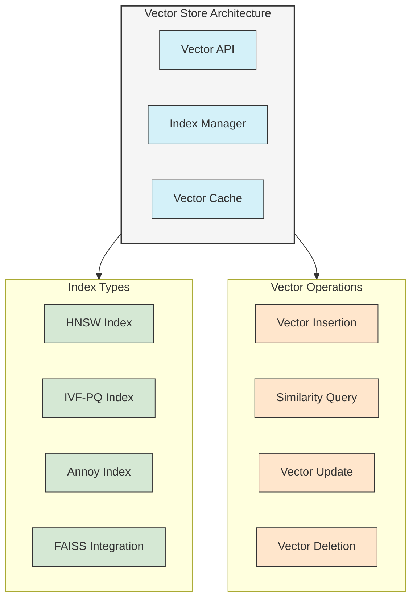
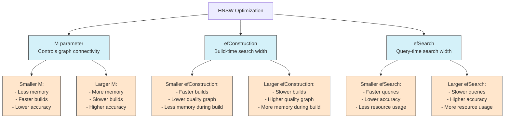
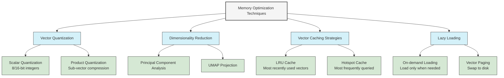
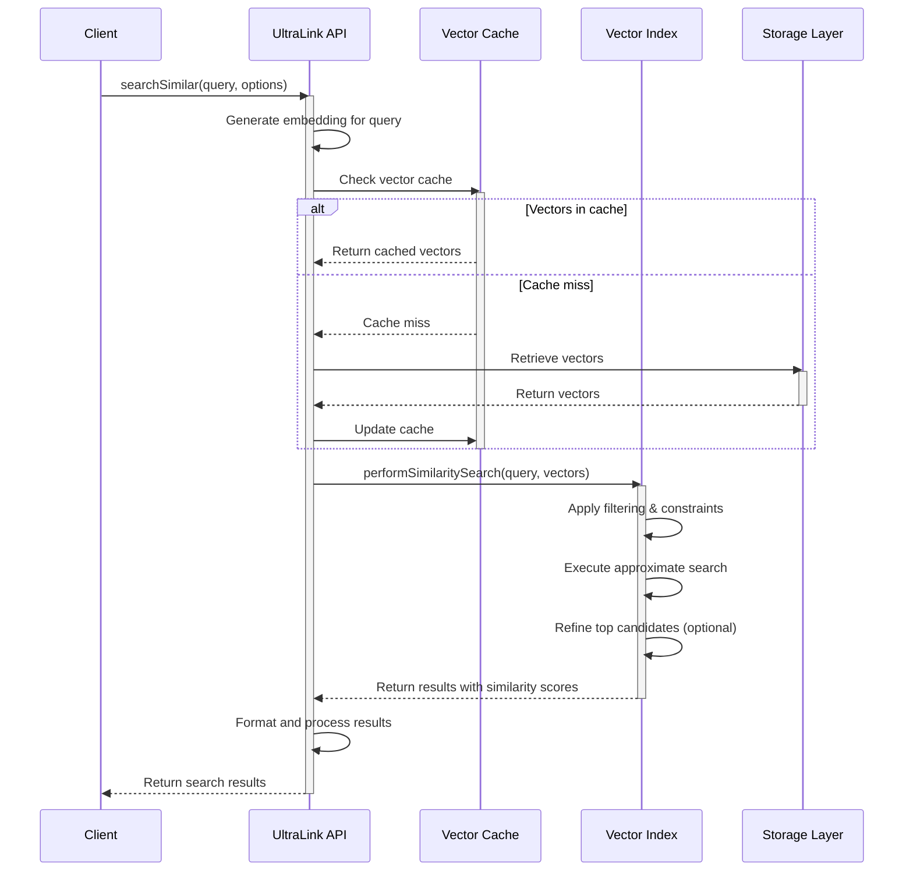

# Vector Index Optimization

This technical document explores advanced optimization techniques for UltraLink's vector indexing system to enhance search performance, reduce memory footprint, and scale efficiently.

## Vector Index Architecture

UltraLink's vector indexing system is designed for high-performance similarity search operations while maintaining flexibility across different deployment environments.



## Vector Index Types and Selection

UltraLink supports multiple vector index types, each with unique performance characteristics and trade-offs:

```mermaid
graph TD
    VectorIndex[Vector Index Selection]
    
    VectorIndex --> HNSW[Hierarchical Navigable Small World]
    VectorIndex --> IVFPQ[Inverted File with Product Quantization]
    VectorIndex --> ANNOY[Approximate Nearest Neighbors Oh Yeah]
    VectorIndex --> FAISS[Facebook AI Similarity Search]
    
    subgraph HNSW_Details[HNSW Details]
        HNSW_Pros[Pros:<br/>- High accuracy<br/>- Fast queries<br/>- Incremental updates]
        HNSW_Cons[Cons:<br/>- Higher memory usage<br/>- Complex parameter tuning]
        HNSW_Best[Best For:<br/>- Medium data size<br/>- High precision requirements<br/>- Frequent updates]
    end
    
    subgraph IVFPQ_Details[IVF-PQ Details]
        IVFPQ_Pros[Pros:<br/>- Low memory footprint<br/>- Scales to billions of vectors<br/>- Fast search times]
        IVFPQ_Cons[Cons:<br/>- Lower precision<br/>- Requires rebuilding for updates<br/>- Complex to tune]
        IVFPQ_Best[Best For:<br/>- Very large datasets<br/>- Memory-constrained environments<br/>- Approximate results acceptable]
    end
    
    subgraph ANNOY_Details[Annoy Details]
        ANNOY_Pros[Pros:<br/>- Simple to use<br/>- Memory-mappable<br/>- Good for high dimensions]
        ANNOY_Cons[Cons:<br/>- Less accurate than HNSW<br/>- Static index (no incremental updates)]
        ANNOY_Best[Best For:<br/>- Static datasets<br/>- Disk-based deployments<br/>- Simplicity over tuning]
    end
    
    subgraph FAISS_Details[FAISS Details]
        FAISS_Pros[Pros:<br/>- Highly optimized<br/>- GPU acceleration<br/>- Multiple index types]
        FAISS_Cons[Cons:<br/>- External dependency<br/>- Complex API<br/>- Higher resource requirements]
        FAISS_Best[Best For:<br/>- Production deployments<br/>- GPU availability<br/>- Maximum performance]
    end
    
    HNSW --> HNSW_Details
    IVFPQ --> IVFPQ_Details
    ANNOY --> ANNOY_Details
    FAISS --> FAISS_Details
    
    classDef main fill:#f5f5f5,stroke:#333,stroke-width:2px
    classDef index fill:#d4f1f9,stroke:#333,stroke-width:1px
    classDef details fill:#ffe6cc,stroke:#333,stroke-width:1px
    classDef pros fill:#d5e8d4,stroke:#333,stroke-width:1px
    classDef cons fill:#f8cecc,stroke:#333,stroke-width:1px
    classDef best fill:#e1d5e7,stroke:#333,stroke-width:1px
    
    class VectorIndex main
    class HNSW,IVFPQ,ANNOY,FAISS index
    class HNSW_Details,IVFPQ_Details,ANNOY_Details,FAISS_Details details
    class HNSW_Pros,IVFPQ_Pros,ANNOY_Pros,FAISS_Pros pros
    class HNSW_Cons,IVFPQ_Cons,ANNOY_Cons,FAISS_Cons cons
    class HNSW_Best,IVFPQ_Best,ANNOY_Best,FAISS_Best best
```

## Performance Optimization Techniques

### HNSW Parameter Optimization



### Memory-Optimized Vector Storage

Optimizing memory usage for vector embeddings is critical for scalability:



## Query Optimization Workflow

The following diagram illustrates the optimized query workflow in UltraLink:



## Implementation Examples

### Configuring Vector Indexes

```typescript
import { UltraLink } from '@ultralink/core';

const ultralink = new UltraLink({
  // Basic configuration
  storage: {
    adapter: 'memory'
  },
  
  // Vector store configuration with HNSW
  vector: {
    provider: 'openai',
    options: {
      apiKey: process.env.OPENAI_API_KEY,
      model: 'text-embedding-ada-002'
    },
    index: {
      type: 'hnsw',
      parameters: {
        M: 16,             // Graph connectivity (8-64)
        efConstruction: 200, // Index build quality parameter
        efSearch: 100      // Search quality parameter
      },
      // Memory optimization
      quantization: {
        enabled: true,
        bits: 8           // Use 8-bit quantization
      }
    }
  }
});

await ultralink.initialize();
```

### Memory-Optimized Vector Search

```typescript
// Configure with memory optimization
const ultralink = new UltraLink({
  vector: {
    // ... basic vector configuration ...
    memory: {
      cacheSize: 5000,        // Number of vectors to keep in memory
      cacheStrategy: 'lru',   // Least Recently Used strategy
      dimensionReduction: {
        enabled: true,
        technique: 'pca',
        dimensions: 128       // Reduce to 128 dimensions from original
      }
    }
  }
});

// Perform memory-efficient search
const results = await ultralink.searchSimilar('query text', {
  limit: 10,
  threshold: 0.7,
  options: {
    reranking: true,       // Enable result reranking
    refinement: {
      enabled: true,
      candidates: 100      // Re-check top 100 candidates exactly
    }
  }
});
```

## Performance Benchmarks

See the [Vector Performance Benchmarks](../performance/vector-benchmarks.md) document for detailed performance metrics across different index configurations, dataset sizes, and hardware environments.

## Links to Related Documentation

- [Vector Integration Overview](../core-features/vector-integration.md)
- [Entity Store Technical Details](./entity-store.md)
- [Storage Backend Configuration](../guides/storage-configuration.md)
- [Memory Optimization Strategies](../performance/memory-optimization.md) 