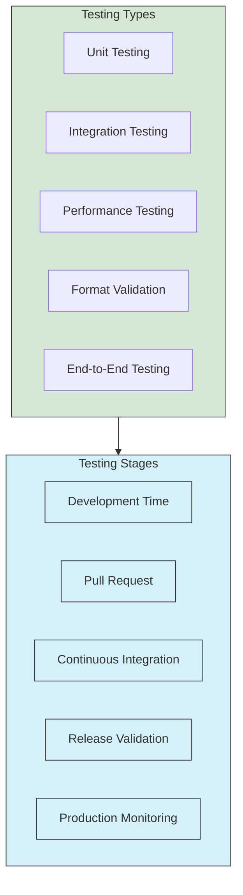
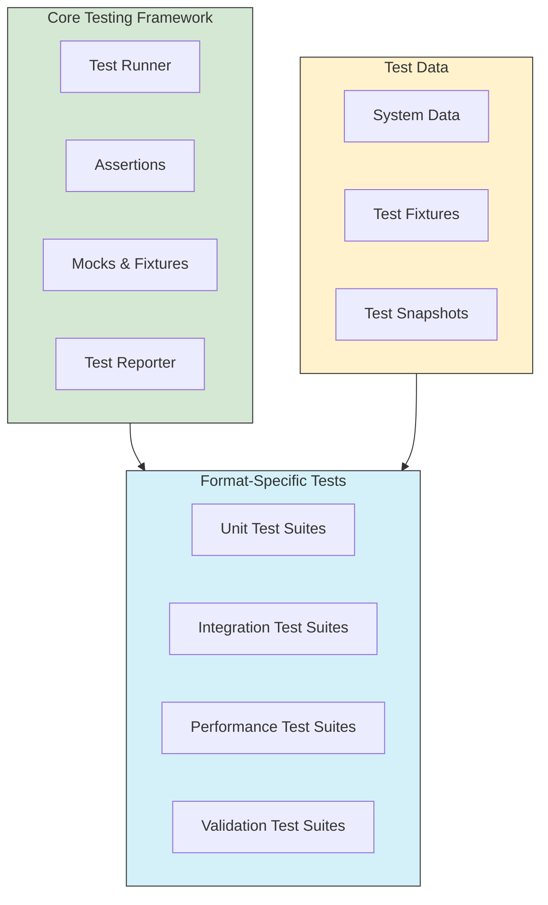

# UltraLink Format Testing Framework

This document outlines the comprehensive testing framework for UltraLink's format transformations, providing developers with structured approaches for validating format exporters through various testing methodologies.



## Testing Objectives

Format testing in UltraLink aims to achieve the following objectives:

1. **Correctness**: Ensuring formats accurately represent UltraLink data
2. **Robustness**: Handling edge cases and unexpected inputs gracefully
3. **Performance**: Meeting performance requirements for various data sizes
4. **Usability**: Generating formats that work well with target systems
5. **Consistency**: Maintaining consistent behavior across versions
6. **Compatibility**: Working correctly with external tools and libraries

## Test Framework Architecture

The UltraLink testing framework follows a structured approach to thoroughly test all format exporters:



## Unit Testing

Unit tests focus on isolated testing of format exporter modules, ensuring their basic functionality and handling of various options and edge cases.

### Test Structure

Each format exporter should have a dedicated unit test file following this structure:

```javascript
// tests/unit/exporters/example-format.test.js

const UltraLink = require('../../../src/ultralink');
const ExampleFormatExporter = require('../../../src/lib/exporters/example-format');

describe('ExampleFormatExporter', () => {
  // Test basic functionality
  describe('Basic functionality', () => {
    it('should export basic entities and relationships', () => {
      // Setup test data
      const ultralink = new UltraLink();
      
      // Add test entities and relationships
      const entity1 = ultralink.createEntity({
        id: 'test1',
        type: 'test',
        attributes: { name: 'Test 1' }
      });
      
      const entity2 = ultralink.createEntity({
        id: 'test2',
        type: 'test',
        attributes: { name: 'Test 2' }
      });
      
      ultralink.createRelationship({
        source: entity1.id,
        target: entity2.id,
        type: 'related_to'
      });
      
      // Export to format
      const output = ultralink.toExampleFormat();
      
      // Assertions
      expect(output).toBeDefined();
      // Format-specific assertions
    });
  });
  
  // Test options
  describe('Options handling', () => {
    // Test each supported option
    it('should respect prettyPrint option', () => {
      const ultralink = new UltraLink();
      ultralink.createEntity({ id: 'test', type: 'test' });
      
      const prettyOutput = ultralink.toExampleFormat({ prettyPrint: true });
      const compactOutput = ultralink.toExampleFormat({ prettyPrint: false });
      
      // Options-specific assertions
      expect(prettyOutput.length).toBeGreaterThan(compactOutput.length);
    });
    
    // Additional option tests
  });
  
  // Test edge cases
  describe('Edge cases', () => {
    it('should handle special characters', () => {
      const ultralink = new UltraLink();
      ultralink.createEntity({
        id: 'special',
        type: 'test',
        attributes: {
          text: 'Special chars: <>&"\'\n\t'
        }
      });
      
      const output = ultralink.toExampleFormat();
      
      // Edge case assertions
      expect(output).toContain('Special chars');
    });
    
    it('should handle empty UltraLink instance', () => {
      const ultralink = new UltraLink();
      const output = ultralink.toExampleFormat();
      
      // Empty case assertions
      expect(output).toBeDefined();
    });
    
    // More edge cases
  });
  
  // Test error handling
  describe('Error handling', () => {
    it('should handle errors gracefully', () => {
      // Setup error scenario
      const mockUltralink = {
        entities: 'not-a-map', // Intentionally invalid
        links: new Map()
      };
      
      const exporter = new ExampleFormatExporter(mockUltralink);
      
      // Error assertions
      expect(() => exporter.export()).toThrow();
    });
    
    // More error handling tests
  });
});
```

### Test Coverage Goals

Aim for the following coverage goals for format exporter unit tests:

| Coverage Type | Minimum Goal | Optimal Goal |
|---------------|--------------|--------------|
| Line Coverage | 90% | 95% |
| Branch Coverage | 85% | 90% |
| Function Coverage | 95% | 100% |
| Statement Coverage | 90% | 95% |

## Integration Testing

Integration tests verify that format exporters work correctly within the complete UltraLink system, focusing on the interaction between components.

### System Test Integration

Add your format to the system rendering tests:

```javascript
// tests/system/rendering.test.js

// Add your format to the FORMATS array
const FORMATS = [
  'json',
  'graphml',
  'csv',
  // ... other formats
  'example-format' // Your new format
];

// Add format-specific test case
describe(`example-format format`, () => {
  const outputPath = path.join(OUTPUT_DIR, systemName, 'example-format');
  
  it(`should render ${systemName} to example-format format`, () => {
    const filePath = path.join(outputPath, `${systemName.toLowerCase()}.example`);
    fs.writeFileSync(filePath, system.toExampleFormat({
      // Format-specific options
    }));
    
    // Verify file exists
    expect(fs.existsSync(filePath)).toBe(true);
    
    // Verify content (basic checks)
    const content = fs.readFileSync(filePath, 'utf8');
    // Format-specific assertions
  });
});
```

### All-Systems Render Test Integration

Integrate your format into the comprehensive system rendering test runner:

```javascript
// tests/runners/all-systems-render-test.js

// Add your format to the FORMATS array
const FORMATS = [
  'json',
  'graphml',
  'csv',
  // ... other formats
  'example-format' // Your new format
];

// Add format-specific rendering case in the renderSystem function
async function renderSystem(systemName, system, logger) {
  // ... existing code ...
  
  // Your format case
  case 'example-format':
    output = await system.toExampleFormat({
      // Format-specific options
    });
    outputPath = path.join(systemOutputDir, `${systemName}.example`);
    await fs.writeFile(outputPath, output);
    break;
}
```

## Performance Testing

Performance tests ensure that format exporters meet performance requirements for various data sizes.

### Performance Test Structure

```javascript
// tests/performance/exporters/example-format.perf.js

const { performance } = require('perf_hooks');
const UltraLink = require('../../../src/ultralink');
const { createDataset } = require('../../fixtures/performance-data');

describe('ExampleFormatExporter Performance', () => {
  // Test with various dataset sizes
  const sizes = [
    { name: 'tiny', entities: 10, relationships: 20 },
    { name: 'small', entities: 100, relationships: 200 },
    { name: 'medium', entities: 1000, relationships: 2000 },
    { name: 'large', entities: 10000, relationships: 20000 }
  ];
  
  sizes.forEach(size => {
    it(`should handle ${size.name} dataset efficiently`, async () => {
      // Skip larger tests in CI if needed
      if (process.env.CI && size.entities > 1000) {
        console.log(`Skipping ${size.name} test in CI`);
        return;
      }
      
      // Create test dataset
      const ultralink = new UltraLink();
      await createDataset(ultralink, size.entities, size.relationships);
      
      // Measure memory usage before
      const memBefore = process.memoryUsage().heapUsed;
      
      // Measure execution time
      const startTime = performance.now();
      const output = ultralink.toExampleFormat();
      const endTime = performance.now();
      
      // Measure memory usage after
      const memAfter = process.memoryUsage().heapUsed;
      
      // Calculate metrics
      const durationMs = endTime - startTime;
      const memoryUsageMB = (memAfter - memBefore) / (1024 * 1024);
      const outputSizeMB = Buffer.byteLength(output) / (1024 * 1024);
      const entitiesPerSecond = size.entities / (durationMs / 1000);
      
      // Log performance metrics
      console.log(`
        Dataset: ${size.name}
        Entities: ${size.entities}
        Relationships: ${size.relationships}
        Duration: ${durationMs.toFixed(2)}ms
        Memory Usage: ${memoryUsageMB.toFixed(2)}MB
        Output Size: ${outputSizeMB.toFixed(2)}MB
        Entities/sec: ${entitiesPerSecond.toFixed(2)}
      `);
      
      // Performance assertions
      if (size.name === 'medium') {
        expect(durationMs).toBeLessThan(1000); // Medium dataset < 1 second
      }
      
      if (size.name === 'small') {
        expect(durationMs).toBeLessThan(100); // Small dataset < 100ms
      }
    });
  });
  
  // Test memory efficiency
  it('should be memory efficient with large datasets', async () => {
    // Create large dataset incrementally to avoid test OOM
    const ultralink = new UltraLink();
    const batchSize = 1000;
    const totalEntities = 10000;
    
    // Add entities in batches
    for (let i = 0; i < totalEntities; i += batchSize) {
      await createDataset(ultralink, batchSize, batchSize * 2, i);
    }
    
    // Track memory usage during export
    const memoryUsage = [];
    const memoryTracker = setInterval(() => {
      memoryUsage.push(process.memoryUsage().heapUsed / (1024 * 1024));
    }, 100);
    
    // Perform export
    const output = ultralink.toExampleFormat();
    
    // Stop tracking and analyze
    clearInterval(memoryTracker);
    
    // Calculate memory metrics
    const maxMemory = Math.max(...memoryUsage);
    const avgMemory = memoryUsage.reduce((sum, val) => sum + val, 0) / memoryUsage.length;
    
    console.log(`
      Max Memory: ${maxMemory.toFixed(2)}MB
      Avg Memory: ${avgMemory.toFixed(2)}MB
      Memory Samples: ${memoryUsage.length}
    `);
    
    // Memory assertions
    expect(maxMemory).toBeLessThan(1024); // Should use less than 1GB
  });
});
```

### Performance Requirements

Establish clear performance requirements for format exporters:

| Dataset Size | Max Export Time | Max Memory Increase | Notes |
|--------------|-----------------|---------------------|-------|
| Tiny (10-100 entities) | 100ms | 10MB | Interactive use |
| Small (100-1K entities) | 500ms | 50MB | API response time |
| Medium (1K-10K entities) | 2s | 200MB | Background job |
| Large (10K-100K entities) | 30s | 1GB | Batch processing |
| Huge (100K+ entities) | 5min | 4GB | Export job |

## Format Validation Testing

Validation tests ensure that exported formats conform to format specifications and maintain semantic integrity.

### Validation Test Structure

```javascript
// tests/validation/exporters/example-format.validation.js

const UltraLink = require('../../../src/ultralink');
const validateExampleFormat = require('../../../src/lib/validators/example-format-validator');
const { createTestSystems } = require('../../fixtures/test-systems');

describe('ExampleFormat Validation', () => {
  // Test validation with various systems
  const systems = createTestSystems();
  
  Object.entries(systems).forEach(([systemName, system]) => {
    it(`should produce valid output for ${systemName}`, () => {
      // Export system to format
      const output = system.toExampleFormat();
      
      // Validate output
      const validation = validateExampleFormat(output);
      
      // Validation assertions
      expect(validation.valid).toBe(true);
      expect(validation.errors).toHaveLength(0);
    });
  });
  
  // Test semantic preservation
  it('should preserve semantic integrity', () => {
    // Create test system
    const ultralink = new UltraLink();
    
    // Add test entities and relationships with specific attributes
    // designed to test semantic preservation
    const entity1 = ultralink.createEntity({
      id: 'semantic1',
      type: 'test',
      attributes: {
        name: 'Semantic Test 1',
        nested: { key1: 'value1', key2: 'value2' },
        array: [1, 2, 3]
      }
    });
    
    const entity2 = ultralink.createEntity({
      id: 'semantic2',
      type: 'test',
      attributes: {
        name: 'Semantic Test 2'
      }
    });
    
    ultralink.createRelationship({
      source: entity1.id,
      target: entity2.id,
      type: 'semantic_link',
      attributes: {
        weight: 0.75,
        tags: ['tag1', 'tag2']
      }
    });
    
    // Export to format
    const output = ultralink.toExampleFormat();
    
    // Validate semantic preservation
    const validation = validateExampleFormat(output, {
      validateSemanticPreservation: true,
      originalData: ultralink
    });
    
    // Semantic validation assertions
    expect(validation.valid).toBe(true);
    expect(validation.semanticPreservation.entitiesPreserved).toBe(true);
    expect(validation.semanticPreservation.relationshipsPreserved).toBe(true);
    expect(validation.semanticPreservation.attributesPreserved).toBe(true);
  });
  
  // Test format-specific requirements
  it('should meet format-specific requirements', () => {
    // Create test system specifically designed to test format requirements
    const ultralink = new UltraLink();
    
    // Add test data targeting format-specific features
    // ...
    
    // Export to format
    const output = ultralink.toExampleFormat();
    
    // Validate format-specific requirements
    const validation = validateExampleFormat(output, {
      validateFormatSpecifics: true
    });
    
    // Format-specific validation assertions
    expect(validation.valid).toBe(true);
    expect(validation.formatSpecifics.requirement1).toBe(true);
    expect(validation.formatSpecifics.requirement2).toBe(true);
  });
});
```

## End-to-End Testing

End-to-end tests verify that exported formats work correctly with their intended target systems and tools.

### Tool Integration Tests

```javascript
// tests/e2e/exporters/example-format.e2e.js

const UltraLink = require('../../../src/ultralink');
const fs = require('fs');
const path = require('path');
const { spawnSync } = require('child_process');

describe('ExampleFormat E2E Tests', () => {
  // Skip in CI environments without external tools
  beforeAll(() => {
    // Check if required external tools are available
    const toolCheck = spawnSync('example-tool', ['--version']);
    
    if (toolCheck.error || toolCheck.status !== 0) {
      console.warn('example-tool not found, skipping E2E tests');
      return true; // Skip tests
    }
    
    return false; // Run tests
  });
  
  // Test with external tool
  it('should be usable with example-tool', async () => {
    // Create test system
    const ultralink = new UltraLink();
    
    // Add test entities and relationships
    const entity1 = ultralink.createEntity({
      id: 'e2e1',
      type: 'test',
      attributes: { name: 'E2E Test 1' }
    });
    
    const entity2 = ultralink.createEntity({
      id: 'e2e2',
      type: 'test',
      attributes: { name: 'E2E Test 2' }
    });
    
    ultralink.createRelationship({
      source: entity1.id,
      target: entity2.id,
      type: 'connected_to'
    });
    
    // Export to format
    const output = ultralink.toExampleFormat();
    
    // Save to temp file
    const tempFile = path.join(os.tmpdir(), `ultralink-e2e-${Date.now()}.example`);
    fs.writeFileSync(tempFile, output);
    
    try {
      // Run external tool with the exported file
      const result = spawnSync('example-tool', ['process', tempFile]);
      
      // External tool assertions
      expect(result.status).toBe(0);
      expect(result.stdout.toString()).toContain('Successfully processed');
    } finally {
      // Clean up
      fs.unlinkSync(tempFile);
    }
  });
  
  // Test round-trip conversion
  it('should support round-trip conversion', async () => {
    // Skip if importer not implemented
    if (!UltraLink.prototype.fromExampleFormat) {
      console.warn('fromExampleFormat not implemented, skipping round-trip test');
      return;
    }
    
    // Create test system
    const original = new UltraLink();
    
    // Add test entities and relationships
    original.createEntity({
      id: 'round1',
      type: 'test',
      attributes: { name: 'Round Trip 1' }
    });
    
    original.createEntity({
      id: 'round2',
      type: 'test',
      attributes: { name: 'Round Trip 2' }
    });
    
    original.createRelationship({
      source: 'round1',
      target: 'round2',
      type: 'connected_to'
    });
    
    // Export to format
    const output = original.toExampleFormat();
    
    // Import from format
    const imported = new UltraLink();
    await imported.fromExampleFormat(output);
    
    // Verify entity count
    expect(imported.entities.size).toBe(original.entities.size);
    
    // Verify entities
    for (const [id, entity] of original.entities) {
      const importedEntity = imported.entities.get(id);
      expect(importedEntity).toBeDefined();
      expect(importedEntity.type).toBe(entity.type);
      
      // Compare attributes (shallow comparison for simple cases)
      expect(importedEntity.attributes).toEqual(entity.attributes);
    }
    
    // Verify relationship count
    let originalRelCount = 0;
    let importedRelCount = 0;
    
    for (const targets of original.links.values()) {
      originalRelCount += targets.size;
    }
    
    for (const targets of imported.links.values()) {
      importedRelCount += targets.size;
    }
    
    expect(importedRelCount).toBe(originalRelCount);
  });
});
```

## Test Data Management

Effective test data management is crucial for comprehensive format testing.

### Test Fixture Organization

```
tests/
├── fixtures/
│   ├── test-systems/
│   │   ├── index.js              # Main export for all test systems
│   │   ├── simple-system.js      # Basic test system
│   │   ├── complex-system.js     # Complex test system with various features
│   │   ├── edge-case-system.js   # System with edge cases
│   │   └── performance-system.js # System for performance testing
│   │
│   ├── test-entities/            # Reusable entity definitions
│   ├── test-relationships/       # Reusable relationship definitions
│   └── performance-data/         # Tools for generating performance test data
│
├── unit/                         # Unit tests
├── integration/                  # Integration tests
├── validation/                   # Validation tests
├── performance/                  # Performance tests
└── e2e/                          # End-to-end tests
```

### Test System Factory

Create reusable test systems for consistent testing:

```javascript
// tests/fixtures/test-systems/index.js

const UltraLink = require('../../../src/ultralink');
const createSimpleSystem = require('./simple-system');
const createComplexSystem = require('./complex-system');
const createEdgeCaseSystem = require('./edge-case-system');

/**
 * Creates a set of standard test systems
 * @returns {Object} Map of system name to UltraLink instance
 */
function createTestSystems() {
  return {
    simple: createSimpleSystem(),
    complex: createComplexSystem(),
    edgeCases: createEdgeCaseSystem()
  };
}

/**
 * Creates a test system with specific characteristics
 * @param {Object} options - System configuration options
 * @returns {UltraLink} Configured UltraLink instance
 */
function createCustomTestSystem(options = {}) {
  const ultralink = new UltraLink();
  
  // Configure based on options
  if (options.withVectors) {
    // Add vector-enabled entities
  }
  
  if (options.withNestedAttributes) {
    // Add entities with nested attributes
  }
  
  if (options.withCircularReferences) {
    // Add entities with circular relationships
  }
  
  // Add specified number of entities and relationships
  const entityCount = options.entityCount || 10;
  const relationshipCount = options.relationshipCount || 20;
  
  for (let i = 0; i < entityCount; i++) {
    ultralink.createEntity({
      id: `test-${i}`,
      type: 'test',
      attributes: {
        name: `Test Entity ${i}`,
        index: i
      }
    });
  }
  
  // Add relationships
  let relCount = 0;
  while (relCount < relationshipCount && relCount < entityCount * entityCount) {
    const sourceIdx = Math.floor(Math.random() * entityCount);
    const targetIdx = Math.floor(Math.random() * entityCount);
    
    if (sourceIdx !== targetIdx) {
      try {
        ultralink.createRelationship({
          source: `test-${sourceIdx}`,
          target: `test-${targetIdx}`,
          type: 'connected_to',
          attributes: {
            weight: Math.random(),
            index: relCount
          }
        });
        relCount++;
      } catch (e) {
        // Relationship might already exist, try again
      }
    }
  }
  
  return ultralink;
}

module.exports = {
  createTestSystems,
  createCustomTestSystem,
  createSimpleSystem,
  createComplexSystem,
  createEdgeCaseSystem
};
```

## Continuous Integration

Set up continuous integration to automatically test format exporters as part of the development workflow.

### Format-Specific CI Workflow

```yaml
# .github/workflows/format-tests.yml
name: Format Exporter Tests

on:
  push:
    paths:
      - 'src/lib/exporters/**'
      - 'tests/**/exporters/**'
  pull_request:
    paths:
      - 'src/lib/exporters/**'
      - 'tests/**/exporters/**'

jobs:
  test-format-exporters:
    runs-on: ubuntu-latest
    
    strategy:
      matrix:
        node-version: [14.x, 16.x, 18.x]
    
    steps:
      - uses: actions/checkout@v2
      
      - name: Use Node.js ${{ matrix.node-version }}
        uses: actions/setup-node@v2
        with:
          node-version: ${{ matrix.node-version }}
      
      - name: Install dependencies
        run: npm ci
      
      - name: Run format unit tests
        run: npm run test:unit -- exporters
      
      - name: Run format integration tests
        run: npm run test:integration -- exporters
      
      - name: Run format validation tests
        run: npm run test:validation -- exporters
      
      - name: Run format performance tests
        run: npm run test:performance -- exporters
      
      - name: Check test coverage
        run: npm run test:coverage
      
      - name: Upload test results
        uses: actions/upload-artifact@v2
        with:
          name: format-test-results
          path: |
            coverage
            test-reports
```

## Test Reporting

Generate comprehensive reports for format test results.

### Test Report Generation

```javascript
// scripts/generate-format-test-report.js

const fs = require('fs').promises;
const path = require('path');

async function generateFormatTestReport() {
  // Collect test results
  const unitResults = require('../test-reports/unit-tests.json');
  const integrationResults = require('../test-reports/integration-tests.json');
  const validationResults = require('../test-reports/validation-tests.json');
  const performanceResults = require('../test-reports/performance-tests.json');
  
  // Collect coverage data
  const coverage = require('../coverage/coverage-summary.json');
  
  // Generate format-specific report
  const report = {
    timestamp: new Date().toISOString(),
    summary: {
      unit: summarizeTestResults(unitResults),
      integration: summarizeTestResults(integrationResults),
      validation: summarizeTestResults(validationResults),
      performance: summarizeTestResults(performanceResults)
    },
    coverage: summarizeCoverage(coverage),
    details: {
      unit: unitResults,
      integration: integrationResults,
      validation: validationResults,
      performance: performanceResults
    }
  };
  
  // Generate HTML report
  const html = generateHtmlReport(report);
  
  // Write reports
  await fs.mkdir('test-reports/format-exporters', { recursive: true });
  await fs.writeFile('test-reports/format-exporters/report.json', JSON.stringify(report, null, 2));
  await fs.writeFile('test-reports/format-exporters/report.html', html);
  
  console.log('Format test report generated.');
}

// Helper functions for report generation
function summarizeTestResults(results) {
  // Implement test result summarization
}

function summarizeCoverage(coverage) {
  // Implement coverage summarization
}

function generateHtmlReport(report) {
  // Implement HTML report generation
}

// Run the report generator
generateFormatTestReport().catch(console.error);
```

## Best Practices

### Test Organization

- **Isolation**: Each format exporter should have its own test files
- **Independence**: Tests should not depend on the order of execution
- **Idempotence**: Tests should produce the same results when run multiple times
- **Focus**: Each test should focus on a specific aspect of the format
- **Clarity**: Test names should clearly describe what is being tested

### Test Coverage

- **Feature Coverage**: Test all features and options of the format exporter
- **Edge Case Coverage**: Test unusual and boundary conditions
- **Error Coverage**: Test error handling and recovery
- **Performance Coverage**: Test with various data sizes and compositions
- **Format-Specific Coverage**: Test format-specific features and requirements

### Test Maintenance

- **Keep Tests Current**: Update tests when format specifications change
- **Avoid Brittle Tests**: Don't test implementation details, test behavior
- **Use Test Fixtures**: Maintain reusable test data
- **Automate When Possible**: Use CI/CD for continuous testing
- **Review Test Results**: Regularly review test reports to identify issues

## Conclusion

A comprehensive testing framework is essential for ensuring the reliability and correctness of UltraLink's format exporters. By following the patterns and practices outlined in this document, you can create robust tests that validate your formats across multiple dimensions and ensure they meet the high-quality standards expected of UltraLink components.

For specific format testing examples, see the following resources:

- [JSON Format Testing](../formats/json_format_testing.md)
- [GraphML Format Testing](../formats/graphml_format_testing.md)
- [CSV Format Testing](../formats/csv_format_testing.md)
- [Obsidian Format Testing](../formats/obsidian_format_testing.md)

For format validation implementation details, see the [Format Validation Guide](../formats/format_validation.md). 