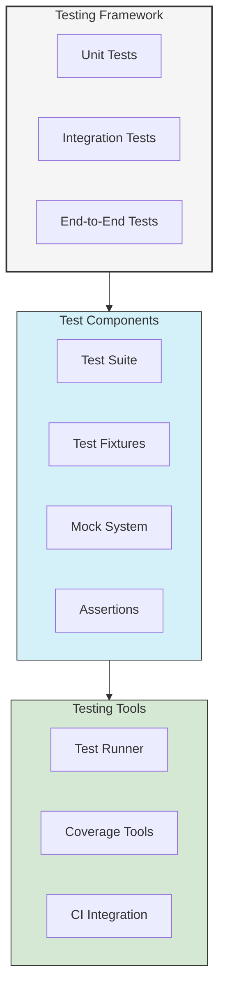

# Testing Guide

This guide provides comprehensive information on testing UltraLink components, plugins, and extensions. It includes best practices, examples, and common testing patterns.

## Testing Architecture



## Test Suite Structure

### Basic Test Setup

```typescript
import { TestSuite, TestContext } from '@ultralink/testing';

describe('UltraLink Component', () => {
  let suite: TestSuite;
  let context: TestContext;

  beforeAll(async () => {
    suite = new TestSuite();
    context = await suite.createContext();
  });

  afterAll(async () => {
    await suite.cleanup();
  });

  beforeEach(async () => {
    await context.reset();
  });

  it('should perform basic operation', async () => {
    const result = await context.core.someOperation();
    expect(result).toBeDefined();
  });
});
```

### Test Context

```typescript
interface TestContext {
  // Core instance
  core: UltraLinkCore;
  
  // Test utilities
  utils: TestUtils;
  
  // Mock system
  mocks: MockSystem;
  
  // Assertions
  assert: AssertionUtils;
  
  // Helper methods
  reset(): Promise<void>;
  cleanup(): Promise<void>;
  createFixture(type: string): Promise<any>;
}
```

## Unit Testing

### Entity Tests

```typescript
describe('Entity Management', () => {
  let suite: TestSuite;
  let context: TestContext;

  beforeEach(async () => {
    suite = new TestSuite();
    context = await suite.createContext();
  });

  it('should create an entity', async () => {
    const entity = await context.core.createEntity({
      type: 'document',
      attributes: {
        title: 'Test Document'
      }
    });

    expect(entity).toMatchObject({
      type: 'document',
      attributes: {
        title: 'Test Document'
      }
    });
  });

  it('should update an entity', async () => {
    const entity = await context.createFixture('document');
    
    await context.core.updateEntity(entity.id, {
      attributes: {
        title: 'Updated Title'
      }
    });

    const updated = await context.core.getEntity(entity.id);
    expect(updated.attributes.title).toBe('Updated Title');
  });

  it('should delete an entity', async () => {
    const entity = await context.createFixture('document');
    await context.core.deleteEntity(entity.id);

    await expect(
      context.core.getEntity(entity.id)
    ).rejects.toThrow('Entity not found');
  });
});
```

### Relationship Tests

```typescript
describe('Relationship Management', () => {
  let suite: TestSuite;
  let context: TestContext;
  let source: Entity;
  let target: Entity;

  beforeEach(async () => {
    suite = new TestSuite();
    context = await suite.createContext();
    
    source = await context.createFixture('document');
    target = await context.createFixture('document');
  });

  it('should create a relationship', async () => {
    const relationship = await context.core.createRelationship({
      source: source.id,
      target: target.id,
      type: 'references'
    });

    expect(relationship).toMatchObject({
      source: source.id,
      target: target.id,
      type: 'references'
    });
  });

  it('should query relationships', async () => {
    await context.core.createRelationship({
      source: source.id,
      target: target.id,
      type: 'references'
    });

    const relationships = await context.core.getRelationships(source.id);
    expect(relationships).toHaveLength(1);
    expect(relationships[0].target).toBe(target.id);
  });
});
```

### Vector Tests

```typescript
describe('Vector Operations', () => {
  let suite: TestSuite;
  let context: TestContext;

  beforeEach(async () => {
    suite = new TestSuite();
    context = await suite.createContext({
      vector: {
        provider: 'test'
      }
    });
  });

  it('should generate embeddings', async () => {
    const content = 'Test content';
    const vector = await context.core.generateEmbedding(content);

    expect(vector).toBeInstanceOf(Float32Array);
    expect(vector.length).toBe(context.config.vector.dimensions);
  });

  it('should calculate similarity', async () => {
    const v1 = await context.core.generateEmbedding('First text');
    const v2 = await context.core.generateEmbedding('Second text');

    const similarity = await context.core.calculateSimilarity(v1, v2);
    expect(similarity).toBeGreaterThanOrEqual(0);
    expect(similarity).toBeLessThanOrEqual(1);
  });

  it('should perform vector search', async () => {
    const entities = await context.createFixtures('document', 5);
    const query = await context.core.generateEmbedding('Search query');

    const results = await context.core.searchByVector(query, {
      limit: 3
    });

    expect(results).toHaveLength(3);
    expect(results[0].score).toBeGreaterThan(results[1].score);
  });
});
```

## Integration Testing

### Storage Integration

```typescript
describe('Storage Integration', () => {
  let suite: TestSuite;
  let context: TestContext;

  beforeEach(async () => {
    suite = new TestSuite();
    context = await suite.createContext({
      storage: {
        adapter: 'test-persistent'
      }
    });
  });

  it('should persist and retrieve entities', async () => {
    const entity = await context.core.createEntity({
      type: 'document',
      attributes: {
        title: 'Test'
      }
    });

    // Simulate restart
    await context.core.disconnect();
    await context.core.connect();

    const retrieved = await context.core.getEntity(entity.id);
    expect(retrieved).toMatchObject(entity);
  });

  it('should handle concurrent operations', async () => {
    const operations = Array(10).fill(0).map(() =>
      context.core.createEntity({
        type: 'document'
      })
    );

    const entities = await Promise.all(operations);
    expect(entities).toHaveLength(10);
  });
});
```

### Plugin Integration

```typescript
describe('Plugin Integration', () => {
  let suite: TestSuite;
  let context: TestContext;
  let plugin: TestPlugin;

  beforeEach(async () => {
    suite = new TestSuite();
    plugin = new TestPlugin();
    
    context = await suite.createContext({
      plugins: [plugin]
    });
  });

  it('should handle plugin lifecycle', async () => {
    expect(plugin.initialized).toBe(true);
    
    await context.core.disconnect();
    expect(plugin.initialized).toBe(false);
  });

  it('should execute plugin middleware', async () => {
    const entity = await context.core.createEntity({
      type: 'document'
    });

    expect(plugin.middlewareCalls).toContain('entity:create');
    expect(plugin.processedEntities).toContain(entity.id);
  });

  it('should handle plugin commands', async () => {
    const result = await context.core.executeCommand(
      'test-plugin:command',
      { param: 'value' }
    );

    expect(result).toBeDefined();
    expect(plugin.commandCalls).toContain('test-plugin:command');
  });
});
```

### Event System Integration

```typescript
describe('Event System Integration', () => {
  let suite: TestSuite;
  let context: TestContext;
  let events: any[] = [];

  beforeEach(async () => {
    suite = new TestSuite();
    context = await suite.createContext();
    events = [];

    context.core.on('entity:*', (event) => {
      events.push(event);
    });
  });

  it('should emit entity events', async () => {
    const entity = await context.core.createEntity({
      type: 'document'
    });

    expect(events).toContainEqual(
      expect.objectContaining({
        type: 'entity:created',
        data: expect.objectContaining({
          id: entity.id
        })
      })
    );
  });

  it('should emit relationship events', async () => {
    const source = await context.createFixture('document');
    const target = await context.createFixture('document');

    await context.core.createRelationship({
      source: source.id,
      target: target.id,
      type: 'references'
    });

    expect(events).toContainEqual(
      expect.objectContaining({
        type: 'relationship:created'
      })
    );
  });
});
```

## End-to-End Testing

### Complete Workflow Tests

```typescript
describe('End-to-End Workflows', () => {
  let suite: TestSuite;
  let context: TestContext;

  beforeEach(async () => {
    suite = new TestSuite();
    context = await suite.createContext({
      storage: { adapter: 'test-persistent' },
      vector: { provider: 'test' },
      plugins: [new TestPlugin()]
    });
  });

  it('should handle complete document workflow', async () => {
    // Create document
    const doc = await context.core.createEntity({
      type: 'document',
      attributes: {
        title: 'Test Document',
        content: 'Test content for vector generation'
      }
    });

    // Generate vector
    const vector = await context.core.generateEmbedding(
      doc.attributes.content
    );
    await context.core.updateEntity(doc.id, { vector });

    // Create relationships
    const related = await context.createFixture('document');
    await context.core.createRelationship({
      source: doc.id,
      target: related.id,
      type: 'references'
    });

    // Search
    const results = await context.core.searchSimilar(
      'test content',
      { limit: 5 }
    );

    expect(results).toContainEqual(
      expect.objectContaining({
        id: doc.id
      })
    );

    // Verify graph
    const graph = await context.core.getSubgraph(doc.id);
    expect(graph.nodes).toHaveLength(2);
    expect(graph.edges).toHaveLength(1);
  });
});
```

### Performance Tests

```typescript
describe('Performance Tests', () => {
  let suite: TestSuite;
  let context: TestContext;

  beforeEach(async () => {
    suite = new TestSuite();
    context = await suite.createContext();
  });

  it('should handle bulk operations efficiently', async () => {
    const start = performance.now();
    
    // Create many entities
    const entities = await Promise.all(
      Array(1000).fill(0).map(() =>
        context.core.createEntity({
          type: 'document',
          attributes: {
            title: 'Test'
          }
        })
      )
    );

    const duration = performance.now() - start;
    expect(duration).toBeLessThan(5000); // 5 seconds

    // Verify all entities
    const count = await context.core.query({
      type: 'document',
      aggregate: { count: true }
    });
    expect(count).toBe(1000);
  });

  it('should handle concurrent vector operations', async () => {
    const texts = Array(100).fill('Test content');
    const start = performance.now();

    const vectors = await context.core.generateEmbeddings(texts);
    const duration = performance.now() - start;

    expect(vectors).toHaveLength(100);
    expect(duration).toBeLessThan(1000); // 1 second
  });
});
```

## Mock System

### Creating Mocks

```typescript
describe('Mock System', () => {
  let suite: TestSuite;
  let context: TestContext;

  beforeEach(async () => {
    suite = new TestSuite();
    context = await suite.createContext();
  });

  it('should mock storage operations', async () => {
    const mockStorage = context.mocks.createStorageAdapter();
    context.core.useStorage(mockStorage);

    await context.core.createEntity({
      type: 'document'
    });

    expect(mockStorage.set).toHaveBeenCalled();
  });

  it('should mock vector operations', async () => {
    const mockVector = context.mocks.createVectorProvider();
    context.core.useVectorProvider(mockVector);

    await context.core.generateEmbedding('test');

    expect(mockVector.generateEmbedding).toHaveBeenCalled();
  });
});
```

### Mock Responses

```typescript
describe('Mock Responses', () => {
  let suite: TestSuite;
  let context: TestContext;

  beforeEach(async () => {
    suite = new TestSuite();
    context = await suite.createContext();
  });

  it('should mock successful responses', async () => {
    context.mocks.mockResponse('createEntity', {
      id: 'test-id',
      type: 'document'
    });

    const entity = await context.core.createEntity({
      type: 'document'
    });

    expect(entity.id).toBe('test-id');
  });

  it('should mock error responses', async () => {
    context.mocks.mockError('createEntity', new Error('Test error'));

    await expect(
      context.core.createEntity({
        type: 'document'
      })
    ).rejects.toThrow('Test error');
  });
});
```

## Test Utilities

### Assertions

```typescript
describe('Custom Assertions', () => {
  let suite: TestSuite;
  let context: TestContext;

  beforeEach(async () => {
    suite = new TestSuite();
    context = await suite.createContext();
  });

  it('should use entity assertions', async () => {
    const entity = await context.core.createEntity({
      type: 'document'
    });

    context.assert.entityExists(entity.id);
    context.assert.entityHasType(entity.id, 'document');
  });

  it('should use relationship assertions', async () => {
    const source = await context.createFixture('document');
    const target = await context.createFixture('document');

    const rel = await context.core.createRelationship({
      source: source.id,
      target: target.id,
      type: 'references'
    });

    context.assert.relationshipExists(rel.id);
    context.assert.entitiesAreConnected(source.id, target.id);
  });
});
```

### Test Fixtures

```typescript
describe('Test Fixtures', () => {
  let suite: TestSuite;
  let context: TestContext;

  beforeEach(async () => {
    suite = new TestSuite();
    context = await suite.createContext();
  });

  it('should create entity fixtures', async () => {
    const doc = await context.createFixture('document', {
      title: 'Test'
    });

    expect(doc).toMatchObject({
      type: 'document',
      attributes: {
        title: 'Test'
      }
    });
  });

  it('should create relationship fixtures', async () => {
    const [source, target] = await context.createFixtures('document', 2);
    
    const rel = await context.createFixture('relationship', {
      source: source.id,
      target: target.id,
      type: 'references'
    });

    expect(rel).toMatchObject({
      source: source.id,
      target: target.id,
      type: 'references'
    });
  });
});
```

## Continuous Integration

### GitHub Actions Configuration

```yaml
name: Tests

on: [push, pull_request]

jobs:
  test:
    runs-on: ubuntu-latest

    steps:
      - uses: actions/checkout@v2
      
      - name: Setup Node.js
        uses: actions/setup-node@v2
        with:
          node-version: '16'
          
      - name: Install dependencies
        run: npm ci
        
      - name: Run tests
        run: npm test
        
      - name: Upload coverage
        uses: codecov/codecov-action@v2
```

### Test Configuration

```typescript
// jest.config.js
module.exports = {
  preset: 'ts-jest',
  testEnvironment: 'node',
  setupFilesAfterEnv: ['./test/setup.ts'],
  coverageThreshold: {
    global: {
      branches: 80,
      functions: 80,
      lines: 80,
      statements: 80
    }
  }
};
```

## Best Practices

1. **Test Organization**
   - Group related tests together
   - Use descriptive test names
   - Follow the AAA pattern (Arrange, Act, Assert)

2. **Test Coverage**
   - Aim for high coverage
   - Test edge cases
   - Include error scenarios

3. **Test Performance**
   - Keep tests fast
   - Use appropriate timeouts
   - Minimize test dependencies

4. **Test Maintenance**
   - Keep tests DRY
   - Use shared fixtures
   - Document complex test scenarios

5. **Test Quality**
   - Write deterministic tests
   - Avoid test interdependence
   - Clean up test data

## Next Steps

- [Core API Reference](../api/core.md)
- [Plugin Development Guide](../advanced/plugin-development.md)
- [Deployment Guide](../deployment/index.md) 