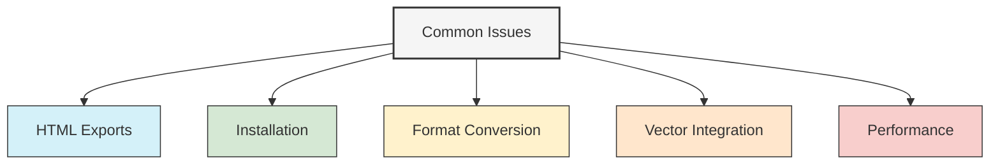

# Troubleshooting UltraLink

This section provides troubleshooting guides and solutions for common issues you might encounter when working with UltraLink.

## Troubleshooting Resources

### [Main Troubleshooting Guide](./troubleshooting.md)

A comprehensive guide to diagnosing and resolving common issues:

- General troubleshooting approach
- Error code reference
- Common pitfalls and solutions
- Configuration troubleshooting
- Environment-specific issues

### [HTML Website Export Troubleshooting](./html-website-export.md)

Specific guidance for resolving issues with HTML website exports:

- Styling problems
- Interactive element issues
- Navigation errors
- Resource loading issues
- Browser compatibility problems

## Format-Specific Troubleshooting

If you're experiencing issues with specific formats, refer to the format documentation:

- [JSON Format](../formats/JSON_FORMAT.md#troubleshooting)
- [GraphML Format](../formats/GRAPHML_FORMAT.md#troubleshooting)
- [CSV Format](../formats/CSV_FORMAT.md#troubleshooting)
- [Obsidian Format](../formats/OBSIDIAN_FORMAT.md#troubleshooting)
- [HTML Website Format](../formats/HTML_WEBSITE_FORMAT.md#troubleshooting)
- [Bayesian Network Format](../formats/BAYESIAN_NETWORK_FORMAT.md#troubleshooting)
- [KIF Format](../formats/KIF_FORMAT.md#troubleshooting)

## Get Help from the Community

If you can't find a solution to your problem in the documentation:

- Check the [FAQ](../faq.md) for answers to common questions
- Get help from the [Community Support](../contributing/community-support.md) resources
- Report issues on our [GitHub repository](https://github.com/docxology/ultralink/issues) 